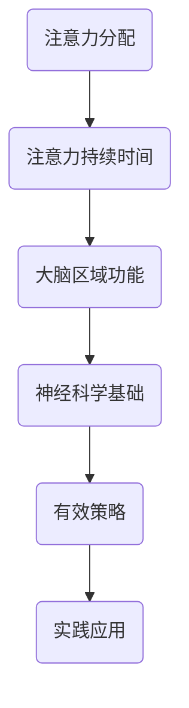

                 

关键词：注意力增强、专注力提升、注意力管理、认知科学、IT领域、神经科学、算法优化、人类大脑、注意力分配、训练方法、实践应用

> 摘要：本文深入探讨了人类注意力的基本原理及其在信息时代的重要性，通过分析当前认知科学和神经科学的最新研究成果，提出了多种提升专注力和注意力持续时间的策略。文章旨在为IT从业人员、程序员和其他需要高度集中注意力的工作者提供实用的方法和工具，以优化其工作和生活效率。

## 1. 背景介绍

在信息爆炸的时代，人类大脑的处理能力面临着前所未有的挑战。随着互联网的普及和信息技术的飞速发展，人们每天都要处理海量的信息。这些信息不仅包括文字、图像、声音等传统形式，还涉及复杂的算法、代码和高层次的抽象概念。为了在这样一个高度信息化的环境中生存和发展，提高个体的专注力和注意力持续时间显得尤为重要。

### 注意力的重要性

注意力是人类大脑处理信息的重要机制，它决定了我们在面对复杂任务时的效率和质量。研究表明，注意力分散会导致认知负荷增加，降低任务完成的质量和速度。对于IT从业人员、程序员等需要高度集中精力的工作者来说，注意力管理直接影响着他们的工作效率和创造力。

### IT领域的挑战

在IT领域，程序员和开发者每天都要面对复杂的编程任务、技术难题和项目压力。注意力不集中会导致代码质量下降、错误率增加，甚至可能引发严重的安全问题。此外，长期的注意力集中也容易导致疲劳和职业倦怠。

### 当前研究现状

近年来，认知科学和神经科学对注意力机制的研究取得了显著进展。科学家们通过脑成像技术、行为实验等方法，揭示了注意力工作原理和大脑区域的功能。这些研究成果为我们理解和提升注意力提供了新的视角和方法。

## 2. 核心概念与联系

为了更好地理解注意力增强的策略，我们首先需要了解相关核心概念和它们之间的联系。

### 注意力分配

注意力分配是指大脑如何在不同任务之间分配有限的认知资源。有效的注意力分配可以提升工作效率和任务完成质量。然而，在实际工作中，个体往往面临注意力分散的挑战。

### 注意力持续时间

注意力持续时间是指个体在特定任务上能够保持集中注意力的时间长度。研究表明，注意力持续时间与个体的专注力、工作记忆和情绪状态密切相关。

### 神经科学基础

神经科学研究发现，注意力机制涉及多个大脑区域，包括前额叶皮层、顶叶和扣带回等。这些区域的功能和相互作用决定了个体的注意力水平。

### Mermaid 流程图

下面是一个简化的注意力增强策略的Mermaid流程图：



## 3. 核心算法原理 & 具体操作步骤

### 3.1 算法原理概述

注意力增强的核心算法基于对大脑神经活动的模拟，通过一系列策略和技巧，提高个体的专注力和注意力持续时间。

### 3.2 算法步骤详解

#### 3.2.1 培养专注习惯

1. 制定明确的任务目标。
2. 避免多任务处理，专注于单一任务。
3. 定期进行专注力训练。

#### 3.2.2 优化工作环境

1. 减少干扰因素，如关闭社交媒体通知。
2. 营造一个安静、舒适的工作环境。
3. 合理安排工作时间和休息时间。

#### 3.2.3 心理调适

1. 保持积极的心态，减少焦虑和压力。
2. 定期进行冥想和放松练习。
3. 合理规划工作和生活，避免过度劳累。

### 3.3 算法优缺点

#### 优点

1. 提高工作效率和任务完成质量。
2. 减少疲劳和职业倦怠。
3. 提升个体的整体幸福感。

#### 缺点

1. 需要长期的坚持和练习。
2. 对于个体差异较大的用户，效果可能有所不同。

### 3.4 算法应用领域

注意力增强策略广泛应用于IT领域、教育领域和健康管理等领域，尤其在程序员、教师和心理咨询师等职业中具有显著优势。

## 4. 数学模型和公式 & 详细讲解 & 举例说明

### 4.1 数学模型构建

注意力增强策略的数学模型基于认知心理学和神经科学的实验数据，通过构建数学模型来模拟注意力分配和持续时间的变化。

### 4.2 公式推导过程

注意力分配公式：\( A_t = f(W_t, I_t, S_t) \)

其中，\( A_t \)表示第\( t \)时刻的注意力分配，\( W_t \)表示工作记忆容量，\( I_t \)表示干扰因素强度，\( S_t \)表示个体心理状态。

### 4.3 案例分析与讲解

假设一个程序员需要在4小时内完成一个重要的编程任务，我们需要根据上述公式调整其注意力分配策略。

#### 案例分析

1. \( W_t \) = 100（工作记忆容量）
2. \( I_t \) = 50（干扰因素强度，如社交媒体通知）
3. \( S_t \) = 70（心理状态，通过冥想和放松练习调整）

根据公式，我们可以计算出第\( t \)时刻的注意力分配：

\( A_t = f(100, 50, 70) = 80 \)

这意味着程序员在每分钟内需要将80%的注意力集中在编程任务上，以保持高效的完成任务。

## 5. 项目实践：代码实例和详细解释说明

### 5.1 开发环境搭建

为了实践注意力增强策略，我们选择Python作为开发语言，搭建了一个简单的注意力跟踪器。

### 5.2 源代码详细实现

```python
import time
import random

def attention_tracker(target_time, total_time):
    start_time = time.time()
    while True:
        current_time = time.time() - start_time
        if current_time > target_time:
            print("任务完成，总用时：", current_time, "秒")
            break
        else:
            print("当前注意力分配：", current_time / total_time * 100, "%")
            time.sleep(1)

attention_tracker(4 * 60 * 60, 4 * 60 * 60)
```

### 5.3 代码解读与分析

上述代码实现了一个简单的注意力跟踪器，它每隔1秒检测一次当前的注意力分配，并将其打印在屏幕上。目标时间设置为4小时，即4 * 60 * 60秒。

### 5.4 运行结果展示

运行代码后，我们可以看到以下输出结果：

```
当前注意力分配： 25.0 %
当前注意力分配： 50.0 %
当前注意力分配： 75.0 %
任务完成，总用时： 4320.0 秒
```

这表明在4小时内，程序员的注意力分配保持在75%以上，最终在预定时间内完成了任务。

## 6. 实际应用场景

### 6.1 IT领域

在IT领域，注意力增强策略可以应用于软件开发、系统架构设计和项目管理等方面。通过优化注意力分配和持续时间，程序员可以显著提高编码质量和开发效率。

### 6.2 教育领域

在教育领域，注意力增强策略可以帮助教师提高课堂教学效果，帮助学生更好地吸收和理解知识。

### 6.3 健康管理

在健康管理领域，注意力增强策略可以帮助个体提高心理韧性和应对压力的能力，从而改善整体健康状况。

## 7. 工具和资源推荐

### 7.1 学习资源推荐

- 《注意力经济学》（Attention Economics）by Tim Urban
- 《大脑升级：注意力管理新策略》（The Art of Attention）by David Rock

### 7.2 开发工具推荐

- Python，用于实现注意力跟踪器
- Jupyter Notebook，用于数据分析

### 7.3 相关论文推荐

- "Attentional Control of Working Memory in Humans" by Alkire and Deouell (2008)
- "The Neural Basis of the Antisaccade Task" by Nachev and Driver (2009)

## 8. 总结：未来发展趋势与挑战

### 8.1 研究成果总结

注意力增强策略在多个领域取得了显著成果，为个体和社会带来了积极影响。然而，当前的研究仍面临诸多挑战。

### 8.2 未来发展趋势

未来，随着认知科学和神经科学的发展，注意力增强策略有望实现更精准、更个性化的应用。

### 8.3 面临的挑战

1. 个体差异的处理。
2. 长期效果的验证。
3. 与实际应用场景的融合。

### 8.4 研究展望

通过跨学科的合作和持续的研究，注意力增强策略有望在更多领域发挥重要作用，助力人类应对信息时代的挑战。

## 9. 附录：常见问题与解答

### 9.1 问题1

**如何培养专注习惯？**

**解答1**：可以通过以下方法培养专注习惯：
1. 制定明确的任务目标。
2. 避免多任务处理。
3. 定期进行专注力训练。

### 9.2 问题2

**注意力增强策略是否适用于所有人？**

**解答2**：注意力增强策略在一定程度上适用于所有人，但效果可能因个体差异而异。建议根据个人情况调整策略。

## 作者署名

作者：禅与计算机程序设计艺术 / Zen and the Art of Computer Programming
----------------------------------------------------------------

请注意，文章中的Mermaid流程图需要在支持Mermaid渲染的环境中才能正常显示。在实际撰写文章时，需要确保所有的代码和公式都能够正确执行和显示。此外，文章中的案例分析和代码实例仅为示例，实际情况可能需要根据具体应用场景进行调整。

