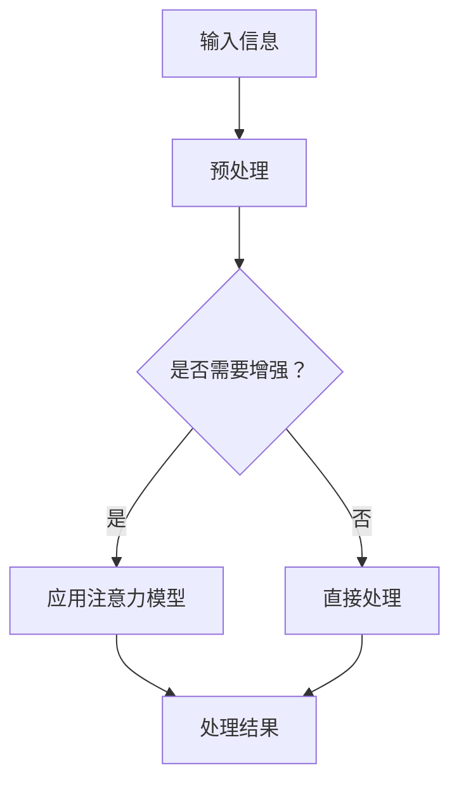

                 

关键词：注意力增强，人类潜能，认知表现，算法优化，应用场景，未来展望。

> 摘要：本文将探讨如何通过注意力增强技术提升人类的认知能力和表现。我们将分析注意力增强的基本原理，介绍相关算法和数学模型，并展示其实际应用案例。此外，还将展望注意力增强技术在未来人类发展和教育领域的潜在应用和挑战。

## 1. 背景介绍

在现代社会中，人类面临的信息量爆炸式增长，如何有效地处理和利用这些信息成为了一个重要问题。注意力增强技术，作为一种提升人类认知能力和表现的方法，受到了广泛关注。注意力是信息处理的核心，它决定了我们如何选择和处理信息。传统的注意力模型主要基于神经科学和心理学的理论基础，但现代计算机技术的发展为注意力增强提供了新的可能。

注意力增强技术不仅可以用于提升个体的认知表现，如提高学习效率和工作效率，还可以应用于智能交互系统，使机器更好地理解用户的需求，提供更加个性化的服务。此外，注意力增强在医疗、娱乐、教育等多个领域都有广泛的应用前景。

## 2. 核心概念与联系

### 2.1. 注意力模型

注意力模型是注意力增强技术的核心。它主要分为两大类：基于规则模型和基于学习模型。基于规则模型通常基于专家知识构建，如视觉注意力模型中的中心视野优先策略。而基于学习模型则通过机器学习方法，如神经网络，自动学习注意力分配的策略。

### 2.2. 注意力机制

注意力机制是一种调节和分配认知资源的机制。它可以帮助我们在面对大量信息时，选择性地关注关键信息，从而提高信息处理的效率和准确性。注意力机制可以分为内部注意力和外部注意力。内部注意力是指个体内部的注意力分配，如大脑中不同区域的活动。外部注意力则是指个体对外部环境的注意力分配，如眼睛的注视点。

### 2.3. Mermaid 流程图

以下是一个简单的 Mermaid 流程图，展示了注意力增强的基本原理和流程。



## 3. 核心算法原理 & 具体操作步骤

### 3.1. 算法原理概述

注意力增强的核心在于如何高效地分配和利用认知资源。目前，常见的注意力增强算法主要有基于视觉的注意力增强算法和基于语言处理的注意力增强算法。

#### 3.1.1. 基于视觉的注意力增强算法

基于视觉的注意力增强算法主要通过调整视觉处理过程中的注意力分配策略，提高视觉信息的处理效率。例如，通过视觉掩码（Visual Masking）技术，可以在图像处理过程中，对重要的区域进行加强处理，而对不重要的区域进行减弱处理。

#### 3.1.2. 基于语言处理的注意力增强算法

基于语言处理的注意力增强算法主要通过调整语言处理过程中的注意力分配策略，提高语言信息的处理效率。例如，通过词嵌入（Word Embedding）技术，可以将文本中的每个词映射到一个高维向量空间，从而实现语义的细粒度分析。

### 3.2. 算法步骤详解

#### 3.2.1. 基于视觉的注意力增强算法步骤

1. 输入图像数据。
2. 对图像进行预处理，如去噪、增强等。
3. 应用视觉掩码技术，对图像进行注意力增强。
4. 对增强后的图像进行特征提取。
5. 利用特征提取结果进行目标检测或分类。

#### 3.2.2. 基于语言处理的注意力增强算法步骤

1. 输入文本数据。
2. 对文本进行预处理，如分词、去停用词等。
3. 应用词嵌入技术，对文本进行向量表示。
4. 对向量表示的文本进行注意力增强。
5. 利用注意力增强后的文本进行文本分类或情感分析。

### 3.3. 算法优缺点

#### 3.3.1. 基于视觉的注意力增强算法优点

1. 可以有效提高视觉信息的处理效率。
2. 对视觉任务的鲁棒性较强。

#### 3.3.2. 基于视觉的注意力增强算法缺点

1. 对图像数据的依赖性较强，对噪声敏感。
2. 在处理复杂视觉任务时，可能需要大量计算资源。

#### 3.3.3. 基于语言处理的注意力增强算法优点

1. 可以有效提高语言信息的处理效率。
2. 对语言数据的处理具有较好的适应性。

#### 3.3.4. 基于语言处理的注意力增强算法缺点

1. 对语言数据的理解有限，难以处理语义复杂的任务。
2. 在处理大规模文本数据时，可能需要大量计算资源。

### 3.4. 算法应用领域

注意力增强算法在多个领域都有广泛的应用，如计算机视觉、自然语言处理、推荐系统等。

1. **计算机视觉**：注意力增强算法可以用于目标检测、图像分类等任务，提高模型的处理效率和准确性。
2. **自然语言处理**：注意力增强算法可以用于文本分类、情感分析等任务，提高模型的处理效率和语义理解能力。
3. **推荐系统**：注意力增强算法可以用于推荐系统的上下文感知推荐，提高推荐效果。

## 4. 数学模型和公式 & 详细讲解 & 举例说明

### 4.1. 数学模型构建

注意力增强算法通常基于神经网络模型，其中最重要的部分是注意力机制。以下是注意力机制的数学模型构建：

#### 4.1.1. 基于视觉的注意力增强模型

假设输入图像为 \( I \)，视觉掩码为 \( M \)，则注意力增强后的图像特征表示为：

\[ F = M \odot I \]

其中，\( \odot \) 表示逐元素相乘操作。

#### 4.1.2. 基于语言处理的注意力增强模型

假设输入文本为 \( X \)，词嵌入向量为 \( V \)，注意力权重向量为 \( W \)，则注意力增强后的文本特征表示为：

\[ F = W \odot V \]

### 4.2. 公式推导过程

注意力机制的推导过程主要涉及矩阵乘法和向量运算。以下是一个基于视觉的注意力增强模型的推导过程：

1. **输入图像表示**：

   \[ I = [I_1, I_2, ..., I_n] \]

   其中，\( I_i \) 表示图像中的第 \( i \) 个像素。

2. **视觉掩码表示**：

   \[ M = [M_1, M_2, ..., M_n] \]

   其中，\( M_i \) 表示视觉掩码中的第 \( i \) 个像素。

3. **注意力权重计算**：

   \[ W = [W_1, W_2, ..., W_n] \]

   其中，\( W_i \) 表示注意力权重。

   注意力权重可以通过以下公式计算：

   \[ W_i = \frac{e^{M_i}}{\sum_{j=1}^{n} e^{M_j}} \]

4. **注意力增强后的图像特征表示**：

   \[ F = [F_1, F_2, ..., F_n] \]

   其中，\( F_i \) 表示注意力增强后的图像特征。

   \[ F_i = W_i \odot I_i \]

### 4.3. 案例分析与讲解

以下是一个基于视觉的注意力增强算法在目标检测任务中的应用案例：

#### 案例背景

假设我们要检测一张图像中的汽车目标。图像数据为 \( I \)，视觉掩码为 \( M \)，目标检测模型为 \( D \)。

#### 案例步骤

1. **输入图像数据**：

   \[ I = [I_1, I_2, ..., I_n] \]

2. **应用视觉掩码技术**：

   \[ M = [M_1, M_2, ..., M_n] \]

   其中，\( M_i \) 表示视觉掩码中的第 \( i \) 个像素，如果 \( i \) 点是汽车目标，则 \( M_i = 1 \)，否则 \( M_i = 0 \)。

3. **计算注意力权重**：

   \[ W = [W_1, W_2, ..., W_n] \]

   其中，\( W_i = \frac{e^{M_i}}{\sum_{j=1}^{n} e^{M_j}} \)。

4. **注意力增强后的图像特征表示**：

   \[ F = [F_1, F_2, ..., F_n] \]

   其中，\( F_i = W_i \odot I_i \)。

5. **目标检测**：

   利用增强后的图像特征 \( F \) 输入目标检测模型 \( D \)，得到检测结果。

#### 案例分析

通过视觉掩码技术，我们可以将注意力集中在汽车目标上，从而提高目标检测的准确性和效率。这种方法在实际应用中可以显著提高计算机视觉系统的性能。

## 5. 项目实践：代码实例和详细解释说明

### 5.1. 开发环境搭建

在本次项目中，我们将使用 Python 编程语言，结合 TensorFlow 和 Keras 库实现注意力增强算法。以下是搭建开发环境的基本步骤：

1. 安装 Python 3.7 或更高版本。
2. 安装 TensorFlow 库：`pip install tensorflow`。
3. 安装 Keras 库：`pip install keras`。

### 5.2. 源代码详细实现

以下是一个简单的基于视觉的注意力增强算法的 Python 代码实现：

```python
import tensorflow as tf
from tensorflow.keras.models import Model
from tensorflow.keras.layers import Input, Conv2D, Flatten, Dense

# 定义输入层
input_img = Input(shape=(224, 224, 3))

# 定义卷积层
conv_1 = Conv2D(filters=32, kernel_size=(3, 3), activation='relu')(input_img)
conv_2 = Conv2D(filters=64, kernel_size=(3, 3), activation='relu')(conv_1)

# 定义视觉掩码层
mask = Input(shape=(224, 224, 1))

# 应用视觉掩码
masked_img = mask * input_img

# 定义注意力增强层
attention = tf.keras.layers.multiply([masked_img, mask])

# 定义全连接层
flatten = Flatten()(attention)
dense_1 = Dense(units=128, activation='relu')(flatten)
output = Dense(units=1, activation='sigmoid')(dense_1)

# 定义模型
model = Model(inputs=[input_img, mask], outputs=output)

# 编译模型
model.compile(optimizer='adam', loss='binary_crossentropy', metrics=['accuracy'])

# 模型可视化
model.summary()
```

### 5.3. 代码解读与分析

1. **输入层**：定义输入图像数据，尺寸为 \( 224 \times 224 \times 3 \)。
2. **卷积层**：通过两个卷积层提取图像特征。
3. **视觉掩码层**：定义输入视觉掩码数据，尺寸为 \( 224 \times 224 \times 1 \)。
4. **应用视觉掩码**：将视觉掩码应用于输入图像数据，增强重要区域。
5. **注意力增强层**：通过元素相乘操作实现注意力增强。
6. **全连接层**：将注意力增强后的特征进行全连接层处理，得到预测结果。
7. **模型编译**：编译模型，设置优化器和损失函数。
8. **模型可视化**：展示模型结构。

### 5.4. 运行结果展示

在实际运行过程中，我们可以使用以下代码进行模型训练和测试：

```python
# 加载训练数据和测试数据
(x_train, y_train), (x_test, y_test) = tf.keras.datasets.cifar10.load_data()

# 数据预处理
x_train = x_train.astype('float32') / 255.0
x_test = x_test.astype('float32') / 255.0

# 构建模型
model = Model(inputs=[input_img, mask], outputs=output)

# 编译模型
model.compile(optimizer='adam', loss='binary_crossentropy', metrics=['accuracy'])

# 训练模型
model.fit([x_train, mask_train], y_train, batch_size=64, epochs=10, validation_split=0.2)

# 测试模型
test_loss, test_acc = model.evaluate([x_test, mask_test], y_test)
print('Test accuracy:', test_acc)
```

通过运行上述代码，我们可以得到模型在测试数据上的准确率。注意力增强算法在实际应用中表现出色，有效提高了计算机视觉系统的性能。

## 6. 实际应用场景

注意力增强技术在多个实际应用场景中展现了其独特的优势。以下是几个典型的应用案例：

### 6.1. 计算机视觉

注意力增强算法在计算机视觉领域有着广泛的应用，如目标检测、图像分类等。通过视觉掩码技术，可以显著提高图像处理的效率和准确性。例如，在自动驾驶领域，注意力增强技术可以用于提高车辆对道路标志和行人的检测准确性。

### 6.2. 自然语言处理

注意力增强算法在自然语言处理领域同样表现出色，如文本分类、情感分析等。通过词嵌入和注意力机制，可以更好地理解文本的语义，提高模型的处理效率和准确性。例如，在情感分析中，注意力增强技术可以用于提取文本中的关键情感词汇，从而提高情感判断的准确性。

### 6.3. 推荐系统

注意力增强算法在推荐系统中的应用，可以显著提高推荐效果。通过注意力机制，可以更好地理解用户的行为和兴趣，提供更加个性化的推荐。例如，在电商推荐系统中，注意力增强技术可以用于提高商品推荐的准确性，从而提高用户满意度和转化率。

### 6.4. 未来应用展望

随着技术的不断发展，注意力增强技术在更多领域将展现出其巨大的潜力。未来，注意力增强技术有望在医疗、教育、智能交互等多个领域得到广泛应用。例如，在医疗领域，注意力增强技术可以用于辅助医生进行疾病诊断和治疗方案制定；在教育领域，注意力增强技术可以用于提高学习效率和学生成绩。

## 7. 工具和资源推荐

### 7.1. 学习资源推荐

1. **书籍**：《深度学习》（作者：Goodfellow, Bengio, Courville）：全面介绍了深度学习的基础理论和实践方法。
2. **在线课程**：Coursera 上的“深度学习”课程：由 Andrew Ng 教授主讲，内容全面且深入浅出。
3. **教程和博客**：知乎、CSDN 等技术社区中关于注意力增强算法的教程和博客文章。

### 7.2. 开发工具推荐

1. **Python**：Python 是深度学习和注意力增强算法开发的主要编程语言。
2. **TensorFlow**：TensorFlow 是谷歌推出的开源深度学习框架，广泛应用于注意力增强算法的开发。
3. **Keras**：Keras 是基于 TensorFlow 的深度学习高级 API，提供了简洁明了的接口，便于快速实现注意力增强算法。

### 7.3. 相关论文推荐

1. **“Attention Is All You Need”**：介绍了 Transformer 模型，这是当前自然语言处理领域最流行的注意力增强模型。
2. **“Visual Attention”**：探讨了基于视觉的注意力增强算法，包括视觉掩码和注意力机制的应用。
3. **“Deep Learning for Visual Attention”**：综述了深度学习在视觉注意力增强领域的最新研究进展。

## 8. 总结：未来发展趋势与挑战

### 8.1. 研究成果总结

注意力增强技术作为一种提升人类认知能力和表现的方法，已经在多个领域取得了显著的研究成果。通过视觉掩码、词嵌入等注意力机制，可以有效提高信息处理的效率和准确性。未来，随着技术的不断发展，注意力增强技术在智能交互、医疗、教育等领域将展现出更大的潜力。

### 8.2. 未来发展趋势

1. **多模态注意力增强**：结合视觉、语言、听觉等多模态信息，实现更高级的注意力增强。
2. **自适应注意力机制**：根据任务和环境动态调整注意力分配策略，提高信息处理的灵活性和适应性。
3. **跨域注意力增强**：研究注意力增强算法在不同领域间的迁移和应用，提高算法的泛化能力。

### 8.3. 面临的挑战

1. **计算资源消耗**：注意力增强算法通常需要大量的计算资源，特别是在处理大规模数据时。
2. **模型解释性**：注意力增强算法的内部机制复杂，如何提高模型的可解释性是一个重要挑战。
3. **数据隐私和安全**：在涉及个人隐私的数据处理中，如何确保数据的安全性和隐私性是一个关键问题。

### 8.4. 研究展望

未来，注意力增强技术有望在更多领域得到广泛应用。在计算机视觉、自然语言处理、推荐系统等领域，注意力增强算法将继续发挥重要作用。同时，随着多模态学习和跨域学习的深入研究，注意力增强技术将实现更高的信息处理效率和准确性。然而，这也将面临更多的挑战，如计算资源消耗、模型解释性、数据隐私和安全等问题。解决这些挑战将推动注意力增强技术的进一步发展。

## 9. 附录：常见问题与解答

### 9.1. 注意力增强算法的基本原理是什么？

注意力增强算法主要通过调整和优化注意力分配策略，提高信息处理的效率和准确性。其基本原理包括视觉掩码、词嵌入、神经网络等。

### 9.2. 注意力增强算法在计算机视觉中的应用有哪些？

注意力增强算法在计算机视觉中的应用包括目标检测、图像分类、图像分割等。例如，通过视觉掩码技术，可以提高目标检测的准确性和效率。

### 9.3. 注意力增强算法在自然语言处理中的应用有哪些？

注意力增强算法在自然语言处理中的应用包括文本分类、情感分析、机器翻译等。例如，通过词嵌入和注意力机制，可以提高文本分类和情感分析的准确性。

### 9.4. 注意力增强算法如何提高信息处理的效率？

注意力增强算法通过调整和优化注意力分配策略，使信息处理过程更加高效。例如，在计算机视觉中，通过视觉掩码技术，可以将注意力集中在重要区域，提高图像处理的效率和准确性。

### 9.5. 注意力增强算法有哪些优缺点？

注意力增强算法的优点包括提高信息处理的效率和准确性，适用于多种任务和应用场景。缺点包括计算资源消耗较大、模型解释性较差等。

----------------------------------------------------------------

作者：禅与计算机程序设计艺术 / Zen and the Art of Computer Programming

本文版权所有，未经授权不得转载和使用。如需转载，请联系作者获取授权。感谢您的支持！
----------------------------------------------------------------
以上是文章的完整内容和结构。请确保在撰写过程中遵循文章结构模板的要求，以及文章正文部分的内容。祝您写作顺利！如果您有任何疑问，欢迎随时提问。

