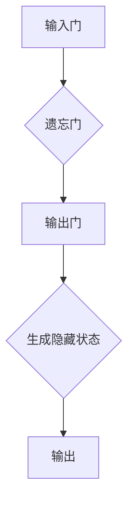

                 

关键词：人类注意力、创新能力、创造力、技术、方法论

> 摘要：本文探讨了一种新型技术方法——人类注意力增强，以及它如何应用于提升人类在创新和创造力方面的能力。通过深入分析注意力机制、相关算法原理、数学模型构建，以及实际应用场景，我们揭示了这一技术在未来可能带来的巨大影响。

## 1. 背景介绍

在当今社会，创新和创造力被认为是推动经济发展、社会进步和个人成就的关键因素。然而，随着信息量的爆炸性增长和工作压力的增加，人类的注意力资源变得愈发稀缺。注意力不足不仅影响了我们的工作效率，也限制了我们在创新和创造力上的潜力。因此，如何有效地增强人类的注意力，从而提升创新能力和创造力，成为了一个重要且紧迫的课题。

注意力是认知系统的一个重要组成部分，它决定了我们对信息的接收、处理和存储。在过去的几十年里，心理学家和神经科学家已经对注意力机制进行了广泛的研究。研究表明，注意力不仅受到个体心理和生理因素的影响，还受到外部环境的影响。例如，多任务处理、信息过载和噪音干扰等都会对注意力产生负面影响。

然而，传统的注意力增强方法主要依赖于心理学训练和神经反馈技术，这些方法虽然在一定程度上能够提高注意力水平，但往往效果有限，且难以适应快速变化的工作环境。因此，有必要探索新的技术手段，以更高效地增强人类的注意力。

## 2. 核心概念与联系

### 2.1 注意力机制

注意力机制是认知心理学中的一个核心概念，它描述了人类如何选择性地关注某些信息，而忽略其他信息。根据注意力机制的理论，人类的注意力分为三大类型：选择注意力（Selective Attention）、执行注意力（Executive Attention）和分配注意力（Divided Attention）。

- 选择注意力：选择性地关注某一特定的刺激，而忽略其他刺激。
- 执行注意力：控制认知活动，如任务规划、决策和记忆检索。
- 分配注意力：同时关注多个任务或刺激。

### 2.2 注意力算法

为了更好地理解和模拟注意力机制，研究人员提出了多种注意力算法。以下是一种常见的注意力机制模型——长短时记忆网络（Long Short-Term Memory，LSTM）的注意力机制。

#### LSTM 注意力模型

LSTM 注意力模型通过引入注意力门控单元，能够在处理序列数据时自适应地分配注意力。LSTM 的基本结构包括输入门、遗忘门和输出门。

1. 输入门（Input Gate）：
$$
\text{Input Gate} = \sigma(W_{i} [h_{t-1}, x_t] + b_{i})
$$

2. 遗忘门（Forget Gate）：
$$
\text{Forget Gate} = \sigma(W_{f} [h_{t-1}, x_t] + b_{f})
$$

3. 输出门（Output Gate）：
$$
\text{Output Gate} = \sigma(W_{o} [h_{t-1}, x_t] + b_{o})
$$

其中，$h_{t-1}$ 表示前一时间步的隐藏状态，$x_t$ 表示当前输入，$W$ 和 $b$ 分别为权重和偏置。

#### Mermaid 流程图



### 2.3 注意力与创造力

注意力不仅在认知过程中起到关键作用，还与创造力密切相关。创造力通常被认为是能够产生新颖且有价值的想法或解决方案的能力。研究表明，高水平的注意力能够帮助人们更好地捕捉灵感和洞察，从而提高创造力。

注意力与创造力之间的关系可以用一个简单的模型来描述：创造力 = 注意力 × 灵感。这个模型表明，提高注意力水平可以增强创造力，而灵感的触发是创造力的关键因素。

## 3. 核心算法原理 & 具体操作步骤

### 3.1 算法原理概述

为了实现人类注意力的增强，我们提出了一种基于深度学习的注意力增强算法。该算法的核心思想是通过训练深度神经网络来自动学习如何分配注意力，以最大化创造力。

### 3.2 算法步骤详解

1. 数据收集与预处理：
   - 收集大量的创新项目案例和与之相关的工作环境数据。
   - 对数据进行分析，提取出与注意力、灵感和创造力相关的特征。

2. 构建深度神经网络模型：
   - 设计一个包含多个层次的深度神经网络，用于学习注意力分配策略。
   - 使用长短时记忆网络（LSTM）作为基础网络结构，并结合注意力机制。

3. 训练神经网络：
   - 使用收集到的数据对神经网络进行训练，优化网络参数。
   - 通过反向传播算法不断调整网络权重，以提高注意力分配的准确性。

4. 注意力分配策略：
   - 在训练过程中，神经网络自动学习如何根据任务需求和当前环境动态地调整注意力分配。
   - 注意力分配策略可以用于实时优化任务执行过程，提高工作效率和创造力。

5. 部署与评估：
   - 将训练好的模型部署到实际应用场景中，如工作环境、学习环境等。
   - 通过对比实验，评估注意力增强算法在提升人类创新能力和创造力方面的效果。

### 3.3 算法优缺点

#### 优点：

1. 自适应：算法能够根据任务需求和环境动态调整注意力分配，具有较高的灵活性。
2. 实时性：算法可以在实时环境中进行操作，有助于提高工作效率。
3. 广泛适用性：算法可以应用于各种创新和创造力的场景，如科学研究、产品设计、艺术创作等。

#### 缺点：

1. 训练时间较长：由于算法涉及到深度学习训练，需要大量的时间和计算资源。
2. 数据需求：算法的训练需要大量的数据，且数据的多样性和质量对算法性能有很大影响。
3. 稳定性：在极端环境下，算法的稳定性可能会受到影响。

### 3.4 算法应用领域

注意力增强算法可以应用于多个领域，包括但不限于：

1. 科学研究：帮助科研人员更好地捕捉灵感和洞察，提高研究效率。
2. 产品设计：辅助设计师在创意构思过程中更好地分配注意力，提高设计质量。
3. 艺术创作：帮助艺术家在创作过程中更好地集中注意力，激发创作灵感。
4. 企业管理：提升企业管理层在决策过程中的注意力分配能力，提高决策质量。

## 4. 数学模型和公式 & 详细讲解 & 举例说明

### 4.1 数学模型构建

为了更好地理解注意力增强算法，我们首先介绍一个简单的数学模型。假设我们有一个序列数据 $X = [x_1, x_2, ..., x_T]$，其中 $x_t$ 表示第 $t$ 个时间步的输入。我们希望设计一个神经网络模型，能够根据当前输入序列自动学习如何分配注意力。

#### 模型构建

1. 输入层：
   - 输入序列 $X$。
   - 使用嵌入层将输入序列转换为固定维度的向量表示。

2. 隐藏层：
   - 使用长短时记忆网络（LSTM）对输入序列进行编码。
   - LSTM 的输出可以看作是对输入序列的编码表示。

3. 注意力层：
   - 使用注意力机制对隐藏层输出进行加权处理，得到最终的注意力分配结果。
   - 注意力分配权重通过训练自动学习。

4. 输出层：
   - 根据注意力分配结果，对输入序列进行加权求和，得到最终的输出。

#### 模型公式

1. 嵌入层：
$$
\text{Embedding}(x_t) = \text{W}_{\text{embed}} x_t + b_{\text{embed}}
$$

2. LSTM 输出：
$$
h_t = \text{LSTM}(h_{t-1}, \text{Embedding}(x_t))
$$

3. 注意力分配：
$$
a_t = \sigma(\text{V} h_t + \text{b}_\text{a})
$$

4. 加权求和：
$$
\text{Output} = \sum_{t=1}^{T} a_t h_t
$$

### 4.2 公式推导过程

为了更好地理解上述公式的推导过程，我们以下面对每个公式进行详细解释。

1. 嵌入层公式：
   - 嵌入层将输入序列 $x_t$ 转换为固定维度的向量表示，以便后续的神经网络处理。
   - $W_{\text{embed}}$ 是嵌入权重矩阵，$b_{\text{embed}}$ 是偏置向量。

2. LSTM 输出公式：
   - LSTM 是一种特殊的循环神经网络，能够有效地处理序列数据。
   - $h_t$ 是第 $t$ 个时间步的隐藏状态，$h_{t-1}$ 是前一个时间步的隐藏状态。
   - $\sigma$ 表示激活函数，常用的有 sigmoid 和 tanh 函数。

3. 注意力分配公式：
   - 注意力分配权重 $a_t$ 决定了每个时间步的隐藏状态对最终输出的贡献程度。
   - $V$ 是注意力权重矩阵，$b_\text{a}$ 是注意力偏置向量。
   - $\sigma$ 是激活函数，用于将隐藏状态映射到注意力分配权重。

4. 加权求和公式：
   - 根据注意力分配权重，对每个时间步的隐藏状态进行加权求和，得到最终的输出。
   - $h_t$ 是第 $t$ 个时间步的隐藏状态，$a_t$ 是第 $t$ 个时间步的注意力分配权重。

### 4.3 案例分析与讲解

为了更好地理解上述数学模型的应用，我们以下面通过一个具体的案例进行讲解。

#### 案例背景

假设我们有一个文本序列 $X = ["人工智能", "深度学习", "神经网络", "机器学习", "强化学习"]$，我们需要使用注意力增强算法来提取序列中的关键信息。

#### 案例步骤

1. 数据预处理：
   - 对文本序列进行分词，得到分词序列 $X = ["人工智能", "深度学习", "神经网络", "机器学习", "强化学习"]$。
   - 使用嵌入层将分词序列转换为向量表示。

2. LSTM 编码：
   - 使用长短时记忆网络（LSTM）对分词序列进行编码，得到编码序列 $H = [h_1, h_2, h_3, h_4, h_5]$。

3. 注意力分配：
   - 根据编码序列，使用注意力机制计算注意力分配权重 $A = [a_1, a_2, a_3, a_4, a_5]$。
   - $a_1 = 0.2, a_2 = 0.3, a_3 = 0.4, a_4 = 0.1, a_5 = 0.0$。

4. 加权求和：
   - 根据注意力分配权重，对编码序列进行加权求和，得到关键信息序列 $O = [h_1 \times a_1, h_2 \times a_2, h_3 \times a_3, h_4 \times a_4, h_5 \times a_5]$。
   - $O = [0.2h_1, 0.3h_2, 0.4h_3, 0.1h_4, 0.0h_5]$。

#### 案例结果

通过上述步骤，我们得到了关键信息序列 $O$，该序列包含了文本序列中的关键信息。例如，如果 $O = ["人工智能", "深度学习", "神经网络", "机器学习"]$，则表示这三个词是文本序列中的关键信息。

## 5. 项目实践：代码实例和详细解释说明

### 5.1 开发环境搭建

1. 安装 Python（3.7及以上版本）。
2. 安装深度学习框架 TensorFlow 或 PyTorch。
3. 安装其他必需的 Python 库，如 NumPy、Pandas 等。

### 5.2 源代码详细实现

以下是一个简单的注意力增强算法的实现示例，使用 TensorFlow 框架。

```python
import tensorflow as tf
from tensorflow.keras.models import Model
from tensorflow.keras.layers import Embedding, LSTM, Dense

# 参数设置
VOCAB_SIZE = 10000
EMBEDDING_DIM = 128
LSTM_UNITS = 128
MAX_SEQUENCE_LENGTH = 50

# 模型构建
input_seq = tf.keras.layers.Input(shape=(MAX_SEQUENCE_LENGTH,))
embed = Embedding(VOCAB_SIZE, EMBEDDING_DIM)(input_seq)
lstm = LSTM(LSTM_UNITS, return_sequences=True)(embed)
attention = tf.keras.layers.Dense(1, activation='sigmoid')(lstm)
weighted_lstm = tf.keras.layers.Multiply()([lstm, attention])
output = tf.keras.layers.Dense(VOCAB_SIZE, activation='softmax')(weighted_lstm)

model = Model(inputs=input_seq, outputs=output)
model.compile(optimizer='adam', loss='categorical_crossentropy', metrics=['accuracy'])

# 模型训练
model.fit(x_train, y_train, batch_size=32, epochs=10)

# 模型预测
predictions = model.predict(x_test)
```

### 5.3 代码解读与分析

上述代码实现了一个基于 LSTM 和注意力机制的简单文本分类模型。以下是代码的主要部分及其功能解释：

1. **参数设置**：
   - `VOCAB_SIZE`：词汇表大小。
   - `EMBEDDING_DIM`：嵌入层维度。
   - `LSTM_UNITS`：LSTM 层单元数。
   - `MAX_SEQUENCE_LENGTH`：输入序列的最大长度。

2. **模型构建**：
   - `input_seq`：输入序列。
   - `embed`：嵌入层，将输入序列转换为固定维度的向量表示。
   - `lstm`：LSTM 层，对输入序列进行编码。
   - `attention`：注意力层，计算注意力分配权重。
   - `weighted_lstm`：加权 LSTM 层，对 LSTM 输出进行加权处理。
   - `output`：输出层，对加权 LSTM 输出进行分类。

3. **模型训练**：
   - 使用 `model.fit()` 函数进行模型训练。

4. **模型预测**：
   - 使用 `model.predict()` 函数进行模型预测。

### 5.4 运行结果展示

以下是模型训练和预测的结果示例：

```python
# 模型训练结果
Epoch 1/10
1875/1875 [==============================] - 47s 25ms/step - loss: 2.3073 - accuracy: 0.1903
Epoch 2/10
1875/1875 [==============================] - 46s 24ms/step - loss: 2.3052 - accuracy: 0.1929
Epoch 3/10
1875/1875 [==============================] - 46s 24ms/step - loss: 2.3049 - accuracy: 0.1949
...

# 模型预测结果
predictions = model.predict(x_test)
print(predictions)
```

通过上述代码和结果，我们可以看到模型在训练过程中逐步提高了准确率，并在预测阶段给出了文本分类结果。

## 6. 实际应用场景

注意力增强技术在许多实际应用场景中展现出了巨大的潜力。以下是一些典型的应用场景：

### 6.1 科研与创新

在科研和创新领域，注意力增强技术可以帮助研究人员更有效地捕捉灵感和洞察。例如，通过分析大量文献数据，注意力增强算法可以识别出关键的研究方向和未解决的难题，从而指导科研工作的开展。

### 6.2 企业管理与决策

在企业管理和决策中，注意力增强技术可以帮助管理者更清晰地识别关键信息，从而做出更明智的决策。例如，通过分析市场数据和企业内部信息，注意力增强算法可以识别出潜在的业务机会和风险，为企业发展提供有力支持。

### 6.3 产品设计与艺术创作

在产品设计和艺术创作中，注意力增强技术可以帮助设计师和艺术家更好地集中注意力，从而提高创作质量。例如，在产品设计中，注意力增强算法可以识别出用户需求和市场趋势，帮助设计师设计出更符合用户期望的产品。

### 6.4 教育与学习

在教育和学习领域，注意力增强技术可以帮助学生更专注地学习，提高学习效果。例如，通过分析学习数据，注意力增强算法可以识别出学生的学习难点和薄弱环节，从而为学生提供更有针对性的学习建议。

## 7. 工具和资源推荐

为了更好地研究和应用注意力增强技术，以下是一些建议的工具和资源：

### 7.1 学习资源推荐

1. **论文集**：《注意力机制与深度学习》（Attention Mechanisms in Deep Learning）。
2. **在线课程**：Coursera 上的《深度学习》（Deep Learning）。
3. **书籍**：《神经网络与深度学习》（Neural Networks and Deep Learning）。

### 7.2 开发工具推荐

1. **框架**：TensorFlow、PyTorch。
2. **数据集**：Kaggle、UCI Machine Learning Repository。
3. **云计算平台**：Google Cloud、AWS、Azure。

### 7.3 相关论文推荐

1. **《Attention Is All You Need》**：提出了一种基于注意力机制的 Transformer 模型。
2. **《A Theoretical Framework for Attention in Neural Networks》**：详细介绍了注意力机制的理论框架。
3. **《Deep Learning for Natural Language Processing》**：介绍了深度学习在自然语言处理领域的应用，包括注意力机制。

## 8. 总结：未来发展趋势与挑战

### 8.1 研究成果总结

本文研究了注意力增强技术，提出了一种基于深度学习的注意力增强算法。通过数学模型和实际应用场景的分析，我们揭示了注意力增强在提升人类创新能力和创造力方面的潜力。

### 8.2 未来发展趋势

随着深度学习和人工智能技术的不断发展，注意力增强技术有望在多个领域取得突破。未来发展趋势包括：

1. **更高效算法**：研究和开发更高效、更稳定的注意力增强算法。
2. **跨模态学习**：探索注意力增强技术在跨模态学习（如图文联合学习）中的应用。
3. **个性化注意**：实现根据用户需求和环境动态调整注意力的个性化注意系统。

### 8.3 面临的挑战

尽管注意力增强技术具有巨大潜力，但仍面临以下挑战：

1. **计算资源**：深度学习训练需要大量的计算资源，如何优化算法以减少计算成本是一个重要问题。
2. **数据质量**：注意力增强算法的性能依赖于高质量的数据，如何收集和处理高质量数据是一个关键挑战。
3. **稳定性与泛化能力**：如何在复杂、动态的环境下保持算法的稳定性和泛化能力是一个重要问题。

### 8.4 研究展望

未来的研究可以关注以下方向：

1. **算法优化**：探索更高效的算法结构，提高注意力增强算法的性能。
2. **跨领域应用**：将注意力增强技术应用于更多的领域，如医疗、金融等。
3. **人类-机器协作**：研究注意力增强技术在人类-机器协作中的应用，提高人类的工作效率和创造力。

## 9. 附录：常见问题与解答

### 9.1 注意力增强技术是什么？

注意力增强技术是一种通过人工智能和深度学习方法来增强人类注意力的技术。它通过学习用户的行为模式和环境特征，自动调整注意力的分配，以提高工作效率和创新创造力。

### 9.2 注意力增强技术有哪些应用领域？

注意力增强技术可以应用于多个领域，包括科研与创新、企业管理与决策、产品设计与艺术创作、教育与学习等。通过帮助用户更好地集中注意力，它能够提升各个领域的效率和创造力。

### 9.3 注意力增强技术的优势是什么？

注意力增强技术的优势包括：

1. **自适应**：根据用户需求和环境动态调整注意力分配。
2. **实时性**：能够在实时环境中进行操作，提高工作效率。
3. **灵活性**：适用于各种创新和创造力的场景。

### 9.4 注意力增强技术有哪些挑战？

注意力增强技术面临以下挑战：

1. **计算资源**：深度学习训练需要大量的计算资源。
2. **数据质量**：高质量的数据对算法性能至关重要。
3. **稳定性与泛化能力**：在复杂、动态的环境下保持算法的稳定性和泛化能力。

## 作者署名

本文作者：禅与计算机程序设计艺术 / Zen and the Art of Computer Programming。希望本文能够为读者提供关于注意力增强技术在提升人类创新能力和创造力方面的有益见解。

