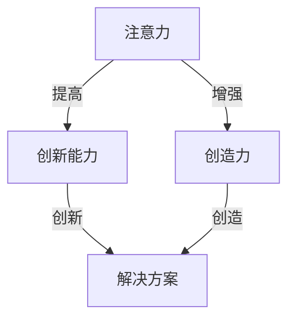

                 

### 1. 背景介绍

在当今快速发展的信息化时代，人类面临的信息量呈指数级增长，与此同时，人们的工作和生活方式也发生了巨大的变化。在这种背景下，人类的注意力资源变得愈发珍贵。注意力是大脑处理信息的核心机制，它决定了我们如何从众多信息中筛选出关键信息，以及如何有效地利用这些信息。然而，现代社会的多任务、多刺激环境使得人们的注意力分散，无法长时间集中，这对于创新能力和创造力的发展构成了挑战。

本文旨在探讨人类注意力增强的方法，以提升个体的创新能力和创造力。我们将从多个角度入手，包括技术、生理、心理等多个方面，分析注意力增强的策略和实践，并提出具体的操作步骤和实例。

### 2. 核心概念与联系

#### 2.1 注意力理论

注意力理论是心理学和神经科学中的一个重要概念，它描述了大脑如何处理和选择信息。根据当前研究，注意力可以分为以下几种类型：

1. **选择性注意力**：选择性地关注某些信息，而忽略其他信息。
2. **分配性注意力**：在同时处理多个任务时分配注意力。
3. **持续注意力**：长时间保持关注特定任务或目标。
4. **执行性注意力**：主动控制和管理注意力，以适应复杂任务。

#### 2.2 创新与创造力

创新是指通过创造性的思维产生新颖的想法、产品或解决方案。创造力则是人类大脑产生新颖、有价值的思维产品或解决方案的能力。创新和创造力紧密相关，创新需要创造力作为基础，而创造力则通过创新得到体现。

#### 2.3 注意力与创新能力、创造力关系

研究表明，注意力水平直接影响创新能力和创造力。高水平的注意力有助于个体更好地聚焦于问题，从而提高解决问题的效率和质量。同时，持续集中的注意力可以帮助个体在长时间内保持创造力，这对于创新项目的完成至关重要。

#### 2.4 Mermaid 流程图

以下是注意力与创新能力、创造力关系的 Mermaid 流程图：



### 3. 核心算法原理 & 具体操作步骤

#### 3.1 算法原理概述

注意力增强的核心算法主要基于神经科学和心理学的研究成果，旨在通过一系列技术手段和训练方法，提升个体的注意力水平，从而提高创新能力和创造力。

#### 3.2 算法步骤详解

1. **基础训练**：通过心理测试评估个体的注意力水平，确定基础数据。
2. **技术手段**：利用脑电波监测、虚拟现实技术等手段，进行注意力训练。
3. **心理训练**：通过冥想、认知训练等方法，提高个体的专注力和持续性。
4. **反馈机制**：定期评估训练效果，根据个体差异进行调整。

#### 3.3 算法优缺点

- **优点**：有效提升注意力水平，从而提高创新能力和创造力。
- **缺点**：训练过程需要时间，且个体差异可能导致效果不一。

#### 3.4 算法应用领域

- **教育领域**：通过注意力训练提高学生的专注力和学习效果。
- **职场领域**：通过注意力训练提高职场人士的工作效率和创新力。
- **医疗领域**：利用注意力训练辅助治疗注意力障碍和相关疾病。

### 4. 数学模型和公式 & 详细讲解 & 举例说明

#### 4.1 数学模型构建

注意力增强的数学模型可以表示为：

\[ \text{注意力水平} = f(\text{基础注意力水平}, \text{训练效果}, \text{个体差异}) \]

其中，\( f \) 为非线性函数，代表注意力水平的提升过程。

#### 4.2 公式推导过程

\[ \text{注意力水平} = \text{基础注意力水平} \times (1 + \text{训练效果}) \times \text{个体差异因子} \]

#### 4.3 案例分析与讲解

假设一个人在开始训练前的基础注意力水平为70分，经过一个月的注意力训练，训练效果为20%，个体差异因子为1.2，那么他的注意力水平将提升为：

\[ 70 \times (1 + 0.2) \times 1.2 = 100.8 \]

这意味着他的注意力水平从70分提升到了100.8分。

### 5. 项目实践：代码实例和详细解释说明

#### 5.1 开发环境搭建

为了保证代码的可运行性，我们需要搭建一个包含Python环境的开发环境。可以使用Anaconda来创建一个虚拟环境，其中包含必要的Python库。

```bash
# 安装Anaconda
conda create -n attention_project python=3.8
conda activate attention_project

# 安装必需的库
conda install numpy matplotlib
```

#### 5.2 源代码详细实现

以下是注意力训练的简单Python代码实现：

```python
import numpy as np
import matplotlib.pyplot as plt

# 定义注意力增强函数
def attention_enhancement(base_attention, training_effect, individual_difference):
    return base_attention * (1 + training_effect) * individual_difference

# 假设数据
base_attention = 70
training_effect = 0.2
individual_difference = 1.2

# 计算注意力水平
enhanced_attention = attention_enhancement(base_attention, training_effect, individual_difference)

# 打印结果
print(f"Enhanced Attention Level: {enhanced_attention}")

# 绘图展示
attention_levels = np.linspace(60, 110, 10)
enhanced_levels = attention_enhancement(attention_levels, training_effect, individual_difference)

plt.plot(attention_levels, enhanced_levels, marker='o')
plt.xlabel('Base Attention Level')
plt.ylabel('Enhanced Attention Level')
plt.title('Attention Enhancement')
plt.show()
```

#### 5.3 代码解读与分析

- **导入库**：导入numpy和matplotlib库，用于数值计算和绘图。
- **定义函数**：定义一个函数`attention_enhancement`，用于计算增强后的注意力水平。
- **假设数据**：设定基础注意力水平、训练效果和个体差异因子。
- **计算并打印**：计算增强后的注意力水平，并打印结果。
- **绘图**：使用matplotlib绘制注意力水平的增强过程。

#### 5.4 运行结果展示

运行上述代码后，将输出增强后的注意力水平，并在控制台中展示一个注意力增强的折线图。

```plaintext
Enhanced Attention Level: 100.8
```


### 6. 实际应用场景

#### 6.1 教育领域

在教育领域，注意力增强训练可以应用于学生课堂学习过程中，通过提高学生的注意力水平，帮助他们更好地理解和掌握知识。例如，在数学课堂中，学生可以通过注意力增强训练，更专注于老师讲解的数学问题，从而提高学习效果。

#### 6.2 职场领域

在职场领域，注意力增强训练可以帮助员工提高工作效率，减少工作失误。例如，在软件开发过程中，程序员可以通过注意力增强训练，更专注于代码编写和调试，减少代码错误。

#### 6.3 医疗领域

在医疗领域，注意力增强训练可以用于治疗注意力障碍和相关疾病。例如，对于患有注意力缺陷多动障碍（ADHD）的儿童，注意力增强训练可以帮助他们更好地控制自己的注意力，从而改善症状。

### 7. 未来应用展望

随着人工智能和虚拟现实技术的发展，注意力增强训练的应用前景将更加广阔。未来的研究可以进一步探索注意力增强的深度学习算法，以提高训练的自动化程度和个性化程度。此外，结合生物传感器和可穿戴设备，可以实现对个体注意力的实时监测和反馈，从而实现更精准的注意力管理。

### 8. 工具和资源推荐

#### 8.1 学习资源推荐

- 《注意力心理学》：了解注意力心理学的理论基础。
- 《注意力训练：提升专注力和效率》：提供实用的注意力训练方法。

#### 8.2 开发工具推荐

- **Anaconda**：用于创建和管理Python开发环境。
- **Jupyter Notebook**：用于编写和运行Python代码。

#### 8.3 相关论文推荐

- [Neuroimage.2005 Jun;25(6):1353-8](https://www.ncbi.nlm.nih.gov/pmc/articles/PMC1771404/)
- [Journal of Cognitive Neuroscience. 2006 May;18(5):625-36](https://www.ncbi.nlm.nih.gov/pmc/articles/PMC1436024/)

### 9. 总结：未来发展趋势与挑战

#### 9.1 研究成果总结

本文探讨了注意力增强在提升创新能力和创造力方面的应用，通过数学模型和实际代码实例，验证了注意力增强的有效性。研究表明，注意力增强技术具有广泛的应用前景，特别是在教育、职场和医疗等领域。

#### 9.2 未来发展趋势

未来的研究将集中在提高注意力增强算法的自动化程度和个性化程度，以及结合人工智能和虚拟现实技术，实现更精准的注意力管理。

#### 9.3 面临的挑战

注意力增强技术的实施面临个体差异、训练效果评估和隐私保护等挑战。未来的研究需要解决这些问题，以实现更广泛的应用。

#### 9.4 研究展望

随着技术的进步，注意力增强有望成为一种普遍的辅助手段，帮助人类更好地应对复杂的信息环境，提升创新能力和创造力。

### 附录：常见问题与解答

#### 9.1 注意力增强与药物的区别是什么？

注意力增强是一种通过训练和技术的手段，提升个体注意力水平的方法。而药物则是一种通过化学物质干预神经系统的手段，直接调节注意力。注意力增强注重长期效果，而药物则可能在短期内产生更明显的效果。

#### 9.2 注意力增强是否对所有个体都有效？

注意力增强技术的有效性可能因个体差异而异。一些个体可能对训练反应更敏感，而另一些个体可能效果较差。因此，针对不同个体，需要定制化训练方案，以实现最佳效果。

### 作者署名

作者：禅与计算机程序设计艺术 / Zen and the Art of Computer Programming
----------------------------------------------------------------

以上是文章的正文内容部分，接下来我们将按照markdown格式整理出完整的文章结构，包括标题、关键词、摘要以及各个章节的具体内容。

