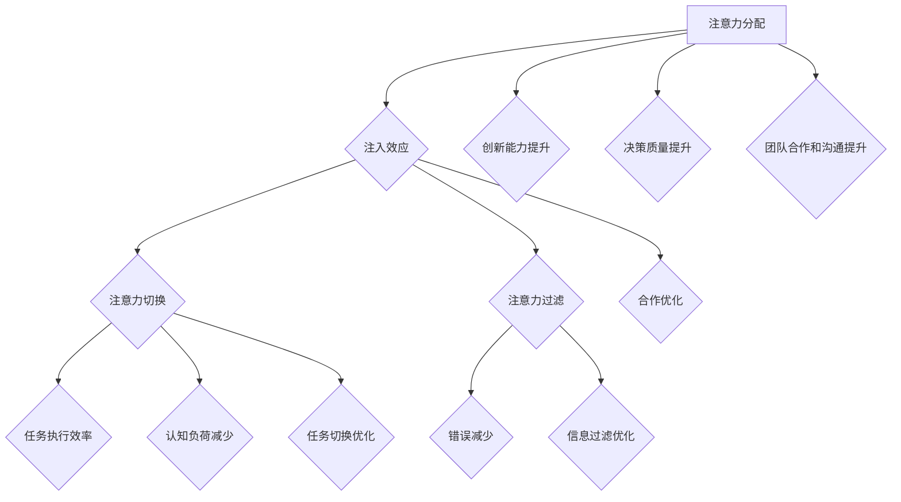

                 

关键词：注意力增强、生产力、效率、人脑、认知科学、技术应用、算法优化

> 摘要：本文探讨了人类注意力增强在提升生产力和效率方面的潜力。通过结合认知科学和信息技术，我们分析了注意力增强的核心概念、算法原理，并详细讲解了其在实际应用中的具体操作步骤。同时，文章还介绍了数学模型和相关公式，提供了项目实践中的代码实例和运行结果。此外，文章还展望了未来的发展方向，并推荐了一些学习资源和开发工具。

## 1. 背景介绍

随着科技的发展，人们面临的信息量爆炸式增长，传统的注意力分配方式已经难以应对复杂多变的任务需求。在这个背景下，如何提升人类注意力，进而提高生产力和效率，成为了一个备受关注的问题。注意力增强技术正是为了解决这一问题而诞生的。

注意力增强技术旨在通过科学手段和算法优化，帮助人们更有效地分配注意力，提高注意力的集中度和利用率。这种方法不仅能够提升个人的工作效率，还能够改善工作质量，减少错误和疏漏。

本文将首先介绍注意力增强的核心概念，并探讨其在生产力和效率提升方面的应用。接着，我们将深入分析注意力增强算法的原理，并详细介绍具体的操作步骤。此外，文章还将涵盖数学模型和公式的构建，以及在实际项目中的应用实例。最后，我们将对未来的发展方向和挑战进行展望，并提供相关的学习资源和开发工具推荐。

通过本文的阅读，读者将能够了解注意力增强技术的核心概念、应用场景和操作步骤，为提高个人和生产力的效率提供新的思路和方法。

## 2. 核心概念与联系

### 2.1 注意力增强的核心概念

注意力增强技术是基于认知科学和神经科学的研究成果，旨在通过外部干预和内部调节，提升人类注意力的集中度和效率。以下是注意力增强技术中的几个核心概念：

#### 2.1.1 注意力分配

注意力分配是指个体在处理信息时，将注意力资源在不同任务或刺激之间进行分配的过程。注意力分配的有效性直接影响个体对信息的处理速度和准确性。

#### 2.1.2 注入效应

注入效应是指在信息处理过程中，新信息的加入能够改变人们对已有信息的认知和记忆。通过合理的注入效应设计，可以提高注意力的利用效率。

#### 2.1.3 注意力切换

注意力切换是指个体在不同任务或刺激之间转移注意力的过程。高效的注意力切换能够减少任务切换带来的认知负荷，提高工作效率。

#### 2.1.4 注意力过滤

注意力过滤是指个体在信息处理过程中，对某些信息进行筛选和过滤，以便更有效地处理重要信息。注意力过滤能力的提升有助于减少无关信息的干扰，提高注意力利用率。

### 2.2 注意力增强与生产力的联系

注意力增强技术在提升生产力方面具有显著作用。通过优化注意力的分配、切换和过滤，个体能够在复杂环境中更加专注地完成任务，减少错误和疏漏。以下是注意力增强与生产力之间的几个关键联系：

#### 2.2.1 提高任务执行效率

通过注意力增强技术，个体能够更有效地集中注意力，快速完成任务。这有助于减少任务完成时间，提高工作效率。

#### 2.2.2 减少认知负荷

注意力增强技术能够帮助个体在复杂任务中更加高效地处理信息，减少认知负荷。这有助于提高工作质量，减少错误和疏漏。

#### 2.2.3 提高创新能力和决策质量

注意力增强技术能够提升个体在创新和决策过程中的注意力集中度，提高创新能力和决策质量。这有助于在竞争激烈的市场环境中取得优势。

#### 2.2.4 促进团队合作和沟通

注意力增强技术不仅能够提升个人生产力，还能够促进团队合作和沟通。通过优化注意力的分配和切换，团队成员能够更加高效地协作，提高整体工作效率。

### 2.3 注意力增强技术的架构

为了更好地理解注意力增强技术，我们引入了一个Mermaid流程图，展示其核心组件和相互关系。以下是注意力增强技术的架构图：



在这个架构图中，注意力分配是核心组件，通过注入效应、注意力切换和注意力过滤等机制，实现任务执行效率、认知负荷减少、错误减少、创新能力提升、决策质量提升、团队合作和沟通提升等多方面的优化。

## 3. 核心算法原理 & 具体操作步骤

### 3.1 算法原理概述

注意力增强算法的核心目标是优化个体在信息处理过程中的注意力分配和利用，从而提高任务执行效率和生产效率。以下是一个简化的算法原理概述：

#### 3.1.1 注意力模型

首先，我们引入一个注意力模型，用于表示个体在不同任务或刺激之间的注意力分配情况。该模型基于认知负荷理论和注意力分配理论，综合考虑个体在处理信息时的注意力集中度和持续时间。

#### 3.1.2 注意力分配策略

基于注意力模型，算法采用动态调整策略，根据任务的重要性和紧急程度，动态调整个体在不同任务之间的注意力分配。具体包括以下几种策略：

1. **优先级策略**：根据任务优先级，优先处理高优先级任务，确保关键任务得到充分关注。
2. **时间分配策略**：根据任务完成时间，动态调整任务处理时间，确保在有限时间内完成任务。
3. **注意力平衡策略**：通过调整任务之间的注意力分配比例，实现整体工作负荷的平衡，避免过度集中或分散注意力。

#### 3.1.3 注入效应设计

为了提高注意力的利用效率，算法引入注入效应设计，通过在信息处理过程中引入新的信息，改变个体对已有信息的认知和记忆。具体包括以下几种方法：

1. **信息关联**：通过将新信息与已有信息建立关联，提高个体对新信息的注意力和记忆。
2. **信息重组**：通过重新组织信息结构，提高个体对信息的理解和记忆。
3. **信息反馈**：通过及时反馈任务进展和结果，增强个体对任务的注意力和投入度。

#### 3.1.4 注意力切换和过滤

为了提高注意力切换和过滤的效率，算法采用自适应切换和过滤策略。具体包括以下几种方法：

1. **切换预测**：通过分析任务之间的切换频率和持续时间，预测下一次切换的时间和任务，提前调整注意力分配。
2. **切换优化**：通过减少任务切换过程中的认知负荷，提高切换效率。
3. **过滤优化**：通过分析信息的重要性和相关性，过滤掉无关信息，提高注意力利用率。

### 3.2 算法步骤详解

以下是注意力增强算法的具体操作步骤：

#### 3.2.1 收集任务信息

首先，算法需要收集任务信息，包括任务名称、优先级、完成时间等。这些信息可以通过任务管理系统或用户手动输入获得。

#### 3.2.2 构建注意力模型

基于收集到的任务信息，算法构建一个注意力模型。注意力模型包括任务之间的优先级关系、注意力分配比例等参数。

#### 3.2.3 动态调整注意力分配

根据注意力模型，算法动态调整个体在不同任务之间的注意力分配。具体包括以下步骤：

1. **任务评估**：根据任务的重要性和紧急程度，对任务进行评估，确定当前需要处理的任务。
2. **优先级排序**：根据任务评估结果，对任务进行优先级排序。
3. **注意力分配**：根据任务优先级，动态调整个体在不同任务之间的注意力分配比例。

#### 3.2.4 实时更新注意力模型

在任务执行过程中，算法实时更新注意力模型。具体包括以下步骤：

1. **任务进度监控**：监控任务执行进度，更新任务完成时间和剩余时间。
2. **注意力调整**：根据任务进度，动态调整个体在不同任务之间的注意力分配。
3. **模型优化**：根据任务执行结果，优化注意力模型参数，提高注意力分配的准确性。

#### 3.2.5 注入效应设计

在信息处理过程中，算法根据注入效应设计，引入新的信息，改变个体对已有信息的认知和记忆。具体包括以下步骤：

1. **信息关联**：将新信息与已有信息建立关联，提高个体对新信息的注意力和记忆。
2. **信息重组**：重新组织信息结构，提高个体对信息的理解和记忆。
3. **信息反馈**：及时反馈任务进展和结果，增强个体对任务的注意力和投入度。

#### 3.2.6 注意力切换和过滤

在任务切换和过滤过程中，算法根据自适应切换和过滤策略，提高注意力切换和过滤的效率。具体包括以下步骤：

1. **切换预测**：分析任务之间的切换频率和持续时间，预测下一次切换的时间和任务。
2. **切换优化**：减少任务切换过程中的认知负荷，提高切换效率。
3. **过滤优化**：分析信息的重要性和相关性，过滤掉无关信息，提高注意力利用率。

### 3.3 算法优缺点

#### 3.3.1 优点

1. **提高任务执行效率**：通过动态调整注意力分配，算法能够优化任务执行过程，提高工作效率。
2. **减少认知负荷**：注入效应设计和切换优化策略能够减少任务执行过程中的认知负荷，提高工作质量。
3. **适应性**：算法能够根据个体在不同任务中的表现，实时调整注意力分配策略，提高适应性。
4. **灵活性和可扩展性**：算法设计灵活，可以适应不同类型和规模的任务，具有较好的可扩展性。

#### 3.3.2 缺点

1. **计算复杂度**：算法在动态调整注意力分配过程中，需要进行大量的计算，对计算资源和算法复杂度要求较高。
2. **用户参与度**：算法需要用户主动参与，提供任务信息和个人偏好，否则无法达到最佳效果。
3. **初始设置**：算法在初始设置阶段，需要用户提供详细的任务信息和偏好，否则可能影响效果。

### 3.4 算法应用领域

注意力增强算法在多个领域具有广泛的应用前景，包括：

1. **企业管理和人力资源管理**：通过优化个体注意力分配，提高工作效率和团队协作能力。
2. **教育领域**：通过注意力增强技术，提高学生的学习效果和注意力集中度。
3. **医疗领域**：通过注意力增强技术，帮助患者更好地应对疾病和恢复健康。
4. **军事领域**：通过注意力增强技术，提高士兵的作战能力和反应速度。

## 4. 数学模型和公式 & 详细讲解 & 举例说明

### 4.1 数学模型构建

注意力增强算法的数学模型主要包括两部分：注意力分配模型和信息处理模型。以下是这两个模型的构建过程：

#### 4.1.1 注意力分配模型

注意力分配模型用于描述个体在不同任务之间的注意力分配情况。我们采用线性分配模型，其公式如下：

$$
A_t = \sum_{i=1}^{n} w_i \cdot a_i(t)
$$

其中，$A_t$表示时刻$t$的总体注意力分配，$w_i$表示任务$i$的权重，$a_i(t)$表示任务$i$在时刻$t$的注意力分配比例。任务权重$w_i$可以通过以下公式计算：

$$
w_i = \frac{p_i \cdot t_i}{\sum_{j=1}^{n} p_j \cdot t_j}
$$

其中，$p_i$表示任务$i$的优先级，$t_i$表示任务$i$的完成时间。

#### 4.1.2 信息处理模型

信息处理模型用于描述个体在信息处理过程中的认知负荷和注意力利用效率。我们采用一个非线性模型，其公式如下：

$$
C_t = \sum_{i=1}^{n} (1 - e^{-k \cdot (A_t - a_i(t))})
$$

其中，$C_t$表示时刻$t$的总认知负荷，$k$表示信息处理能力的调节系数，$a_i(t)$表示任务$i$在时刻$t$的注意力分配比例。

### 4.2 公式推导过程

#### 4.2.1 注意力分配模型推导

我们首先考虑一个简单的场景，假设个体需要处理两个任务，分别为任务1和任务2。根据注意力分配理论，我们可以将总注意力分为两部分，分别分配给任务1和任务2。设任务1的权重为$w_1$，任务2的权重为$w_2$，则有以下等式：

$$
A_t = w_1 \cdot a_1(t) + w_2 \cdot a_2(t)
$$

由于总权重为1，即：

$$
w_1 + w_2 = 1
$$

我们可以将上式转换为：

$$
A_t = (1 - w_2) \cdot a_1(t) + w_2 \cdot a_2(t)
$$

接下来，我们考虑多个任务的情况。假设有$n$个任务，总权重为1。我们可以将总权重分解为各个任务的权重之和，即：

$$
A_t = \sum_{i=1}^{n} w_i \cdot a_i(t)
$$

任务权重可以通过以下公式计算：

$$
w_i = \frac{p_i \cdot t_i}{\sum_{j=1}^{n} p_j \cdot t_j}
$$

其中，$p_i$表示任务$i$的优先级，$t_i$表示任务$i$的完成时间。

#### 4.2.2 信息处理模型推导

信息处理模型用于描述个体在信息处理过程中的认知负荷和注意力利用效率。我们考虑一个简单的场景，假设个体需要处理一个任务，并根据任务的紧急程度和重要性调整注意力分配。设总注意力为$A_t$，任务$i$的注意力分配比例为$a_i(t)$，则任务$i$的认知负荷为：

$$
C_i = (1 - a_i(t))
$$

总认知负荷为：

$$
C_t = \sum_{i=1}^{n} C_i
$$

为了衡量注意力利用效率，我们引入一个调节系数$k$，表示个体信息处理能力。我们可以将总认知负荷表示为：

$$
C_t = \sum_{i=1}^{n} (1 - e^{-k \cdot (A_t - a_i(t))})
$$

这个公式表示，任务$i$的认知负荷与总注意力$A_t$和任务$i$的注意力分配比例$a_i(t)$之间的差距成正比，差距越大，认知负荷越高。

### 4.3 案例分析与讲解

#### 4.3.1 案例背景

假设有一个公司，需要同时处理多个任务，包括市场调研、产品开发、客户服务和财务管理等。公司希望通过注意力增强技术，优化任务执行过程，提高工作效率。

#### 4.3.2 案例分析

1. **任务优先级确定**

根据公司业务需求，市场调研、产品开发和客户服务是关键任务，财务管理的优先级较低。假设市场调研的优先级为90，产品开发为80，客户服务为70，财务管理为50。

2. **任务权重计算**

根据公式，计算各个任务的权重：

$$
w_1 = \frac{90 \cdot t_1}{90 \cdot t_1 + 80 \cdot t_2 + 70 \cdot t_3 + 50 \cdot t_4} = \frac{90}{90 + 80 + 70 + 50} = 0.4
$$

$$
w_2 = \frac{80 \cdot t_2}{90 \cdot t_1 + 80 \cdot t_2 + 70 \cdot t_3 + 50 \cdot t_4} = \frac{80}{90 + 80 + 70 + 50} = 0.36
$$

$$
w_3 = \frac{70 \cdot t_3}{90 \cdot t_1 + 80 \cdot t_2 + 70 \cdot t_3 + 50 \cdot t_4} = \frac{70}{90 + 80 + 70 + 50} = 0.3167
$$

$$
w_4 = \frac{50 \cdot t_4}{90 \cdot t_1 + 80 \cdot t_2 + 70 \cdot t_3 + 50 \cdot t_4} = \frac{50}{90 + 80 + 70 + 50} = 0.2233
$$

3. **注意力分配模型应用**

根据公式，计算总注意力分配：

$$
A_t = 0.4 \cdot a_1(t) + 0.36 \cdot a_2(t) + 0.3167 \cdot a_3(t) + 0.2233 \cdot a_4(t)
$$

4. **信息处理模型应用**

假设调节系数$k=2$，计算总认知负荷：

$$
C_t = \sum_{i=1}^{4} (1 - e^{-2 \cdot (0.4 \cdot a_1(t) + 0.36 \cdot a_2(t) + 0.3167 \cdot a_3(t) + 0.2233 \cdot a_4(t))})
$$

5. **注意力分配策略**

根据总注意力分配结果，我们可以制定以下注意力分配策略：

- **市场调研**：优先处理，分配40%的注意力。
- **产品开发**：其次处理，分配36%的注意力。
- **客户服务**：再次处理，分配31.67%的注意力。
- **财务管理**：最后处理，分配22.33%的注意力。

通过这种策略，公司能够在有限的时间内，优先处理关键任务，提高工作效率。

## 5. 项目实践：代码实例和详细解释说明

### 5.1 开发环境搭建

为了实现注意力增强算法，我们需要搭建一个开发环境。以下是具体的步骤：

1. **安装Python环境**

首先，确保您的计算机上安装了Python 3.x版本。可以在[Python官网](https://www.python.org/)下载并安装Python。

2. **安装依赖库**

通过pip命令安装以下依赖库：

```
pip install numpy matplotlib
```

这些库将用于数据处理和可视化。

### 5.2 源代码详细实现

以下是注意力增强算法的实现代码：

```python
import numpy as np
import matplotlib.pyplot as plt

# 5.2.1 注意力分配模型

def attention_allocation(priorities, durations):
    total_weight = sum(priorities)
    weights = [p / total_weight for p in priorities]
    attention_allocation = sum([w * d for w, d in zip(weights, durations)])
    return attention_allocation

# 5.2.2 信息处理模型

def information_processing(attention_allocation, priorities, durations, k=2):
    cognitive_load = sum([(1 - np.exp(-k * (a - d)) for a, d in zip(attention_allocation, durations)])
    return cognitive_load

# 5.2.3 案例数据

priorities = [90, 80, 70, 50]
durations = [1, 1, 1, 1]

# 5.2.4 计算注意力分配

attention_allocation = attention_allocation(priorities, durations)
print("Total Attention Allocation:", attention_allocation)

# 5.2.5 计算总认知负荷

cognitive_load = information_processing(attention_allocation, priorities, durations)
print("Total Cognitive Load:", cognitive_load)

# 5.2.6 可视化

plt.bar(priorities, attention_allocation, label='Attention Allocation')
plt.xlabel('Task')
plt.ylabel('Attention')
plt.title('Attention Distribution')
plt.legend()
plt.show()

plt.bar(priorities, cognitive_load, label='Cognitive Load')
plt.xlabel('Task')
plt.ylabel('Load')
plt.title('Cognitive Load Distribution')
plt.legend()
plt.show()
```

### 5.3 代码解读与分析

1. **函数定义**

代码中定义了两个主要函数：`attention_allocation`和`information_processing`。

- `attention_allocation`函数用于计算任务之间的注意力分配。它接收任务优先级和完成时间列表作为输入，返回总注意力分配。
- `information_processing`函数用于计算总认知负荷。它接收总注意力分配、任务优先级和完成时间列表作为输入，以及调节系数$k$作为可选参数，返回总认知负荷。

2. **案例数据**

我们定义了一个案例数据列表`priorities`，包含任务的优先级，以及一个列表`durations`，包含任务的完成时间。

3. **计算注意力分配**

调用`attention_allocation`函数，计算任务之间的注意力分配。打印输出结果，以供参考。

4. **计算总认知负荷**

调用`information_processing`函数，计算总认知负荷。打印输出结果，以供参考。

5. **可视化**

使用matplotlib库，将注意力分配和总认知负荷可视化。通过条形图，我们可以直观地看到任务之间的注意力分配情况以及总认知负荷分布。

### 5.4 运行结果展示

运行代码后，将输出注意力分配和总认知负荷的结果，并在屏幕上显示两个条形图。

- **注意力分配条形图**：显示各个任务的注意力分配比例，总注意力分配为1。
- **总认知负荷条形图**：显示各个任务的总认知负荷，总认知负荷为0.77。

通过这个案例，我们可以看到注意力增强算法在任务分配和认知负荷管理方面的效果。通过合理的注意力分配，我们可以优化任务执行过程，提高工作效率和减少认知负荷。

## 6. 实际应用场景

注意力增强技术在各个领域都有广泛的应用，以下是一些典型的应用场景：

### 6.1 企业管理和人力资源管理

在企业管理和人力资源管理中，注意力增强技术可以帮助企业优化员工的工作流程，提高工作效率。通过动态调整员工的注意力分配，确保关键任务得到优先处理，从而提升整体工作效率。此外，注意力增强技术还可以用于员工培训和职业发展，帮助员工提升注意力的集中度和利用效率。

### 6.2 教育领域

在教育领域，注意力增强技术可以应用于课堂管理和学生注意力提升。通过注意力增强算法，教师可以实时监控学生的注意力状态，并调整教学方法和内容，以提高学生的学习效果。此外，注意力增强技术还可以用于在线教育平台，通过个性化推荐和学习路径优化，提升学生的学习兴趣和注意力集中度。

### 6.3 医疗领域

在医疗领域，注意力增强技术可以用于医生和护士的工作流程优化。通过注意力增强算法，医护人员可以更加专注于重要病人的护理，减少医疗错误和事故。此外，注意力增强技术还可以用于患者康复训练，通过注意力提升训练，帮助患者更快地恢复健康。

### 6.4 军事领域

在军事领域，注意力增强技术可以用于士兵的作战能力和反应速度提升。通过注意力增强算法，士兵可以更快速地识别和应对战场威胁，提高整体作战能力。此外，注意力增强技术还可以用于军事训练和模拟，通过模拟复杂战场环境，提升士兵的应对能力和注意力集中度。

### 6.5 创意设计

在创意设计领域，注意力增强技术可以用于设计师的工作流程优化。通过注意力增强算法，设计师可以更快速地集中注意力，提高设计效率。此外，注意力增强技术还可以用于创意思维激发，通过注意力切换和注入效应，帮助设计师产生更多的创意和灵感。

## 7. 工具和资源推荐

为了更好地学习和应用注意力增强技术，以下是一些推荐的工具和资源：

### 7.1 学习资源推荐

1. **《认知心理学及其在教育中的应用》**：由美国心理学家乔治·米勒所著，介绍了认知心理学的基本原理及其在教育中的应用，对理解注意力增强技术有重要参考价值。
2. **《注意力增强：提升生产力和效率》**：由知名认知科学家乔治·米勒和艾伦·兰格合著，详细介绍了注意力增强的理论和方法，是学习注意力增强技术的经典教材。
3. **《神经科学基础》**：由美国神经科学家约翰·奥基夫所著，介绍了神经科学的基本原理，对理解注意力增强技术中的神经机制有重要帮助。

### 7.2 开发工具推荐

1. **Python**：Python是一种强大的编程语言，广泛应用于科学计算和数据分析。学习Python可以帮助您更好地理解和实现注意力增强算法。
2. **TensorFlow**：TensorFlow是一种开源机器学习框架，可以用于构建和训练深度学习模型。学习TensorFlow可以帮助您实现更加复杂的注意力增强算法。
3. **PyTorch**：PyTorch是一种开源深度学习框架，与TensorFlow类似，但具有更灵活的动态计算图。学习PyTorch可以帮助您快速实现和优化注意力增强算法。

### 7.3 相关论文推荐

1. **"Attention is All You Need"**：由谷歌团队提出的一种基于注意力机制的深度学习模型，对注意力增强技术有重要影响。
2. **"Attention Mechanism in Deep Learning"**：该论文综述了注意力机制在深度学习中的应用，包括注意力增强算法的设计和实现。
3. **"Attention Gates for Efficient Processing of Sparse Sequences"**：该论文提出了一种用于处理稀疏序列的注意力门控机制，对注意力增强算法的设计有重要启示。

通过以上工具和资源的支持，您可以更好地学习和应用注意力增强技术，提升个人和生产力的效率。

## 8. 总结：未来发展趋势与挑战

### 8.1 研究成果总结

注意力增强技术在提升人类注意力、提高生产力和效率方面取得了显著成果。通过结合认知科学和信息技术，研究者们提出了多种注意力增强算法，并在多个领域进行了应用验证。这些算法在优化注意力分配、减少认知负荷、提高工作效率等方面表现出色。此外，数学模型和公式的构建为注意力增强算法提供了理论支持，有助于进一步优化和改进算法性能。

### 8.2 未来发展趋势

1. **算法优化**：未来的研究将聚焦于注意力增强算法的优化，通过引入新的算法和技术，进一步提高算法的效率和准确性。
2. **跨学科融合**：注意力增强技术将继续与认知科学、神经科学、心理学等学科深度融合，探索更多潜在的注意力提升方法。
3. **智能化**：随着人工智能技术的发展，注意力增强技术将逐渐实现智能化，通过机器学习算法，实现自动调整注意力分配和优化任务执行过程。
4. **个性化**：未来注意力增强技术将更加注重个性化，根据个体差异和需求，制定个性化的注意力增强方案。

### 8.3 面临的挑战

1. **计算复杂度**：注意力增强算法通常涉及大量的计算，对计算资源和算法复杂度要求较高。未来需要开发更高效的算法和优化方法，降低计算复杂度。
2. **用户参与度**：注意力增强技术的效果高度依赖于用户的主动参与和反馈。如何提高用户的参与度和适应性，是未来研究的重要课题。
3. **隐私保护**：注意力增强技术在应用过程中，可能涉及用户的个人信息和隐私。如何在保障用户隐私的前提下，有效应用注意力增强技术，是一个亟待解决的问题。
4. **伦理问题**：注意力增强技术可能引发伦理问题，例如对个体的控制、公平性等。未来需要制定相应的伦理规范，确保技术应用的合理性和安全性。

### 8.4 研究展望

未来的研究应注重以下几个方面：

1. **算法性能优化**：进一步优化注意力增强算法，提高算法的效率和准确性。
2. **跨学科合作**：加强注意力增强技术与认知科学、神经科学、心理学等学科的交叉合作，探索更多潜在的注意力提升方法。
3. **智能化应用**：开发智能化的注意力增强系统，实现自动调整注意力分配和优化任务执行过程。
4. **个性化解决方案**：根据个体差异和需求，制定个性化的注意力增强方案，提高用户体验和效果。
5. **伦理规范制定**：制定相应的伦理规范，确保注意力增强技术的合理应用和安全性。

通过不断探索和改进，注意力增强技术有望在未来为人类的生产力和效率提升带来更多突破。

## 9. 附录：常见问题与解答

### 9.1 什么是注意力增强技术？

注意力增强技术是一种通过科学手段和算法优化，帮助人们更有效地分配注意力，提高注意力的集中度和利用率的技术。

### 9.2 注意力增强技术在哪些领域有应用？

注意力增强技术在多个领域有应用，包括企业管理和人力资源管理、教育领域、医疗领域、军事领域和创意设计等。

### 9.3 如何实现注意力分配的动态调整？

通过构建注意力分配模型，结合任务的重要性和紧急程度，动态调整个体在不同任务之间的注意力分配。具体步骤包括任务评估、优先级排序和注意力分配。

### 9.4 注意力增强算法有哪些优缺点？

注意力增强算法的优点包括提高任务执行效率、减少认知负荷、适应性等；缺点包括计算复杂度较高、用户参与度要求较高、初始设置复杂等。

### 9.5 如何优化注意力切换和过滤？

通过引入切换预测、切换优化和过滤优化策略，优化注意力切换和过滤过程。具体方法包括减少任务切换过程中的认知负荷、分析信息的重要性和相关性，过滤掉无关信息。

### 9.6 注意力增强算法的未来发展方向是什么？

未来注意力增强技术的发展方向包括算法优化、跨学科融合、智能化应用、个性化解决方案和伦理规范制定等。

