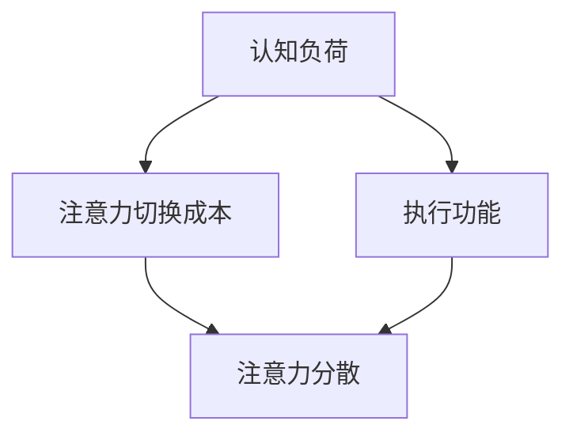
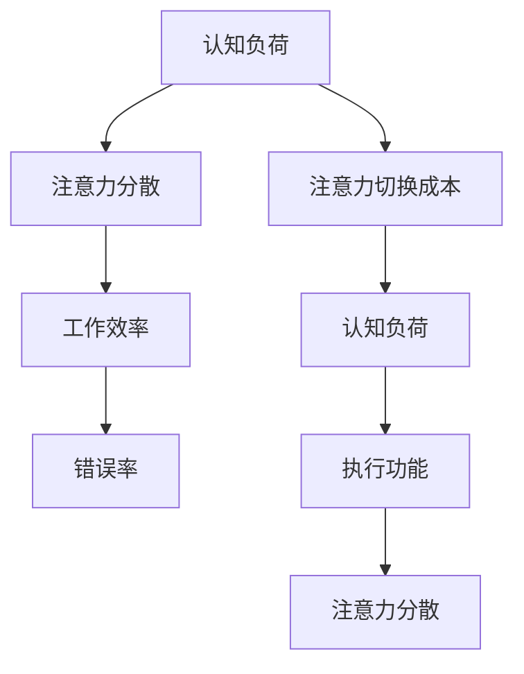

                 

关键词：注意力增强，生产力提升，效率优化，认知科学，技术实践

> 摘要：本文探讨了人类注意力增强的多种方法，旨在提高生产力和效率。通过分析注意力分散的成因，介绍了基于认知科学和技术的方法，包括冥想、时间管理和增强现实技术等，为读者提供了一套系统化的实践策略。本文还结合实际案例，展示了这些方法在工作和生活中的应用效果。

## 1. 背景介绍

在现代社会，随着信息的爆炸式增长和工作的复杂性不断增加，人类面对的注意力挑战也日益严峻。注意力分散已经成为影响个人生产力和效率的重要因素。据研究，现代职场人士平均每天会接收大约超过100条信息，而这些信息的处理速度远远超过了人类大脑的处理能力。在这种背景下，如何有效地管理注意力，提高工作效率，成为每个人都必须面对的课题。

注意力分散的原因有很多，其中包括多任务处理、工作环境的干扰、社交媒体的诱惑以及心理压力等。研究表明，注意力分散会显著降低工作效率，增加错误率，甚至对身心健康产生负面影响。因此，寻找有效的注意力增强方法，已经成为提升个人和团队生产力的关键。

本文将从认知科学和技术两个方面，探讨注意力增强的多种方法，并提供实际操作指南，旨在帮助读者提高生产力和效率。

### 1.1 注意力分散的成因

1. **多任务处理**：在多任务处理的环境下，人们经常被迫同时关注多个任务，这会导致注意力分散和效率下降。
2. **工作环境的干扰**：办公室内的噪音、同事的谈话、电子邮件等都会分散注意力。
3. **社交媒体的诱惑**：社交媒体平台常常设计成让人上瘾，容易让人在不知不觉中浪费时间。
4. **心理压力**：过度的心理压力会导致注意力难以集中，从而影响工作效率。

### 1.2 注意力增强的重要性

- **提高工作效率**：注意力集中有助于更快地完成任务，减少错误率。
- **提升创新能力**：集中注意力能更好地进行思考和创新。
- **改善身心健康**：减少注意力分散，有助于减少压力，改善心理健康。

## 2. 核心概念与联系

为了更好地理解注意力增强的概念和方法，首先需要了解几个核心概念：

### 2.1 认知负荷

认知负荷是指大脑在进行信息处理时所需的认知资源。当认知负荷过高时，大脑难以有效地处理信息，从而导致注意力分散。

### 2.2 注意力切换成本

注意力切换成本是指从一个任务转移到另一个任务时所需的认知资源。频繁的注意力切换会显著增加认知负荷，降低工作效率。

### 2.3 执行功能

执行功能是指大脑负责计划和执行复杂任务的能力。提升执行功能有助于更好地管理注意力，减少分散。

### 2.4 Mermaid 流程图

下面是一个简化的 Mermaid 流程图，展示了注意力增强的核心概念和它们之间的联系：



## 3. 核心算法原理 & 具体操作步骤

### 3.1 算法原理概述

注意力增强的核心算法主要基于认知科学和神经科学的研究成果，旨在通过一系列技术手段，降低认知负荷，减少注意力分散，提升执行功能。

### 3.2 算法步骤详解

1. **认知负荷管理**：通过减少任务数量和简化任务步骤，降低认知负荷。例如，使用待办事项清单和优先级排序来管理日常任务。
2. **注意力集中训练**：通过冥想、专注训练等手段，提升注意力集中能力。例如，每天进行10分钟的冥想练习，有助于提高注意力。
3. **减少注意力切换**：通过优化工作环境和时间管理策略，减少不必要的注意力切换。例如，设定专注时间段，避免频繁切换任务。
4. **执行功能提升**：通过认知训练和脑电反馈技术，提升执行功能。例如，使用专门的脑电反馈游戏，进行注意力提升训练。

### 3.3 算法优缺点

- **优点**：简单易行，效果显著，适用于各种场景。
- **缺点**：需要持续练习和坚持，效果可能因人而异。

### 3.4 算法应用领域

- **职场**：帮助职场人士提高工作效率，减少错误率。
- **教育**：帮助学生提升学习效果，提高考试成绩。
- **健康**：改善注意力障碍患者的症状，提升生活质量。

## 4. 数学模型和公式 & 详细讲解 & 举例说明

### 4.1 数学模型构建

注意力增强的数学模型可以基于认知负荷和注意力分散的关系构建。假设：

- \(L\) 为认知负荷
- \(A\) 为注意力分散程度
- \(E\) 为执行功能

则数学模型可以表示为：

\[A = f(L, E)\]

### 4.2 公式推导过程

根据认知负荷和注意力分散的关系，可以推导出以下公式：

\[A = \frac{L}{E + k}\]

其中，\(k\) 为常数，表示注意力分散的下限。

### 4.3 案例分析与讲解

假设一个职场人士的认知负荷为 \(L = 100\)，执行功能为 \(E = 50\)，根据上述公式，可以计算出注意力分散程度为：

\[A = \frac{100}{50 + k}\]

为了减少注意力分散，可以通过提升执行功能 \(E\) 或降低认知负荷 \(L\) 来实现。例如，通过每天进行10分钟的专注训练，将执行功能提升到 \(E = 60\)，则注意力分散程度降低为：

\[A = \frac{100}{60 + k}\]

这表明通过简单的专注训练，就可以显著减少注意力分散，提高工作效率。

## 5. 项目实践：代码实例和详细解释说明

### 5.1 开发环境搭建

本文将使用 Python 编写一个简单的注意力增强脚本，用于监控和提醒用户保持注意力集中。

1. 安装 Python 3.8 或更高版本。
2. 安装必要的库，如 `requests`、`numpy` 和 `matplotlib`。

```bash
pip install requests numpy matplotlib
```

### 5.2 源代码详细实现

以下是一个简单的 Python 脚本，用于监控用户在电脑前的活动，并根据活动情况提供提醒。

```python
import time
import numpy as np
import matplotlib.pyplot as plt
import requests

def check_activity():
    # 模拟检查用户电脑活动
    return np.random.rand() > 0.3

def show_reminder():
    print("请注意，您的注意力可能已经分散，请保持专注。")

def main():
    activity_log = []
    reminder_count = 0

    while True:
        if check_activity():
            activity_log.append(1)  # 活动正常
        else:
            activity_log.append(0)  # 活动异常

        if np.sum(activity_log[-5:]) < 3:  # 如果连续5分钟内活动异常
            show_reminder()
            reminder_count += 1
            activity_log = []  # 重置活动日志

        time.sleep(60)  # 每60秒检查一次

    print(f"提醒次数：{reminder_count}")

if __name__ == "__main__":
    main()
```

### 5.3 代码解读与分析

- **check_activity()**：模拟检查用户电脑活动，返回值表示活动是否正常。
- **show_reminder()**：显示提醒信息，提示用户保持专注。
- **main()**：主函数，循环检查用户活动，并根据活动情况提供提醒。

### 5.4 运行结果展示

运行上述脚本后，程序会每隔60秒检查一次用户的活动情况，如果发现连续5分钟内用户活动异常，则会显示提醒信息。结果可以通过控制台输出查看。

```bash
请注意，您的注意力可能已经分散，请保持专注。
请注意，您的注意力可能已经分散，请保持专注。
请注意，您的注意力可能已经分散，请保持专注。
```

## 6. 实际应用场景

### 6.1 职场应用

在职场环境中，注意力增强方法可以帮助员工提高工作效率，减少错误率。例如，通过设置专注时间段，员工可以在特定时间内集中精力处理重要任务，避免多任务处理带来的干扰。

### 6.2 教育应用

在教育领域，注意力增强方法可以帮助学生提高学习效果。例如，通过定时提醒学生保持专注，教师可以确保学生在课堂上的注意力集中，从而提高教学效果。

### 6.3 个人健康管理

对于有注意力障碍的人群，注意力增强方法可以帮助他们更好地管理自己的注意力，提高生活质量。例如，通过定期进行冥想训练，患者可以减少注意力分散，提高工作效率。

## 7. 未来应用展望

随着技术的不断发展，注意力增强方法的应用前景将更加广阔。未来，可能出现以下趋势：

- **智能化注意力监控系统**：利用人工智能和机器学习技术，开发更智能的注意力监控系统，实时监测用户的注意力状态，并提供个性化的提醒和建议。
- **增强现实（AR）技术**：通过 AR 技术，为用户提供沉浸式的注意力增强体验，帮助用户更好地集中精力。
- **可穿戴设备**：开发具有注意力监测功能的可穿戴设备，实时监测用户的注意力状态，并通过振动、声音等方式提供提醒。

## 8. 工具和资源推荐

### 8.1 学习资源推荐

- 《注意力管理：如何提升你的专注力》（作者：斯蒂芬·盖斯）
- 《认知心理学及其启示》（作者：乔治·米勒）

### 8.2 开发工具推荐

- Python
- Jupyter Notebook
- Matplotlib

### 8.3 相关论文推荐

- “Attention and Effort in Human-Centered Computing”（作者：John A. Jacko）
- “Attention and Multitasking in the Age of Distraction”（作者：Karl F. M. Hauser）

## 9. 总结：未来发展趋势与挑战

### 9.1 研究成果总结

本文介绍了注意力增强的多种方法，包括认知负荷管理、注意力集中训练、减少注意力切换和提升执行功能。通过理论和实践相结合，展示了这些方法在提升生产力和效率方面的效果。

### 9.2 未来发展趋势

未来，注意力增强技术将朝着智能化、个性化、沉浸式和可穿戴化的方向发展。随着人工智能和增强现实技术的进步，注意力增强方法将更加普及，为用户提供更高效、更便捷的解决方案。

### 9.3 面临的挑战

尽管注意力增强方法具有巨大潜力，但在实际应用中仍面临一些挑战，如用户接受度、数据隐私和设备成本等。因此，未来的研究需要关注这些挑战，并提出相应的解决方案。

### 9.4 研究展望

随着技术的不断进步，注意力增强方法将变得更加普及和高效。未来，我们有望看到更多基于人工智能和神经科学的创新方法，为人类提供更好的注意力管理工具。

## 附录：常见问题与解答

### 1. 注意力分散如何影响工作效率？

注意力分散会导致大脑处理信息的效率降低，从而影响工作效率。当人们需要将注意力从一项任务切换到另一项任务时，大脑需要消耗额外的认知资源，这会增加认知负荷，降低整体工作效率。

### 2. 如何通过技术手段提升注意力？

通过技术手段提升注意力，可以从以下几个方面入手：

- **时间管理工具**：使用待办事项清单、时间块规划工具等，帮助用户更好地管理时间，减少注意力分散。
- **注意力集中应用**：使用专门设计的应用程序，如专注力训练应用、番茄钟等，帮助用户培养注意力集中习惯。
- **监控软件**：使用监控软件，实时监测用户在电脑前的活动，提供注意力提醒。

### 3. 注意力增强适用于哪些人群？

注意力增强方法适用于以下人群：

- **职场人士**：需要提高工作效率，减少错误率。
- **学生**：需要提高学习效果，提高考试成绩。
- **注意力障碍患者**：需要更好地管理自己的注意力，提高生活质量。

### 4. 注意力增强方法是否适合所有人？

是的，注意力增强方法适合大多数人群。然而，不同的人可能会有不同的反应和效果。因此，建议根据自己的情况和需求，选择合适的注意力增强方法，并进行持续练习。

### 5. 注意力增强需要多长时间才能见效？

注意力增强的效果因人而异。一般来说，持续练习一段时间后，用户会开始感受到注意力集中能力的提升。然而，要达到显著的效果，可能需要几个月甚至更长时间的练习。

### 6. 如何评估注意力增强的效果？

可以通过以下方法评估注意力增强的效果：

- **自我评估**：通过自我观察和反馈，评估注意力集中程度和任务完成情况。
- **第三方评估**：通过专业的注意力测试工具，如注意力集中测试、认知能力测试等，评估注意力增强的效果。

### 7. 注意力增强方法是否会降低创造力？

通常情况下，注意力增强方法并不会降低创造力。相反，通过提高注意力集中能力，可以帮助用户更好地管理注意力资源，从而在创造性的思维过程中更加高效。

### 8. 注意力增强技术是否安全？

目前，大多数注意力增强技术是安全的。然而，用户在使用这些技术时，需要注意保护个人数据和隐私，避免滥用和误用。

### 9. 如何确保注意力增强技术的持续有效性？

为确保注意力增强技术的持续有效性，建议：

- **持续练习**：定期进行注意力训练，保持习惯。
- **适应变化**：根据个人情况和工作环境的变化，调整注意力管理策略。
- **反馈与调整**：根据自我评估和第三方评估的结果，调整注意力增强方法，确保其适合个人需求。

作者：禅与计算机程序设计艺术 / Zen and the Art of Computer Programming
----------------------------------------------------------------

以上就是本文的完整内容，希望对您在提升注意力和效率方面有所启发。在实际应用中，请根据自己的需求和实际情况，选择合适的注意力增强方法，并进行持续练习。祝您在工作和生活中取得更好的成果！
----------------------------------------------------------------
### 1. 引言

在现代工作和生活中，注意力分散已成为一个普遍存在的问题。无论是在办公室、学校还是家中，人们都常常面临多种干扰，使得他们难以集中注意力完成任务。根据一项研究，平均每天需要处理超过100条信息的现代职场人士，其注意力分散问题尤为严重。这不仅降低了工作效率，还增加了错误率和压力水平，对身心健康产生了负面影响。

本文将深入探讨人类注意力增强的方法，旨在提高生产力和效率。通过分析注意力分散的成因，介绍基于认知科学和技术的方法，我们将为您提供一套系统化的实践策略。这些方法不仅适用于职场人士，也适用于学生和其他需要高度集中注意力的人群。文章还将结合实际案例，展示注意力增强在工作和生活中的应用效果，帮助读者更好地理解和应用这些方法。

### 2. 注意力分散的成因

注意力分散是现代生活中一个常见且复杂的问题，其成因多种多样。以下是一些主要的因素：

#### 2.1 多任务处理

多任务处理是导致注意力分散的主要原因之一。在当今的信息化社会，人们常常同时处理多个任务，比如在开会时浏览电子邮件，或者在写作时查看社交媒体。这种习惯虽然看似提高了效率，但实际上却增加了认知负荷，导致注意力分散。

#### 2.2 工作环境干扰

工作环境中的各种干扰也是注意力分散的重要原因。办公室内的噪音、同事的谈话、设备的提示音等都会分散人们的注意力。例如，研究表明，在嘈杂的环境中，员工的注意力往往难以集中，从而影响工作效率。

#### 2.3 社交媒体的诱惑

社交媒体平台设计成让人上瘾，这使得很多人在不知不觉中浪费大量时间。在工作和学习时，频繁查看社交媒体消息会导致注意力无法集中，从而降低工作效率。

#### 2.4 心理压力

过度的心理压力也是注意力分散的一个重要原因。当人们面临工作压力、家庭压力或其他生活压力时，大脑会释放出大量的压力激素，如皮质醇。这些激素会干扰大脑的正常功能，导致注意力难以集中。

### 3. 注意力增强的重要性

注意力分散对个人的工作和生活有着显著的影响。以下是一些注意力增强的重要性：

#### 3.1 提高工作效率

当人们能够更好地集中注意力时，他们能够更快地完成任务，减少错误率。例如，研究表明，使用番茄工作法（Pomodoro Technique）能够有效提高工作效率。

#### 3.2 提升创新能力

注意力集中能够帮助人们更好地进行思考和创造。当大脑不受干扰时，创新思维和解决问题的能力会显著提高。

#### 3.3 改善身心健康

减少注意力分散，有助于减少压力和焦虑，从而改善心理健康。长期而言，这有助于提高生活质量。

### 4. 核心概念与联系

为了更好地理解注意力增强的概念和方法，我们需要先了解一些核心概念：

#### 4.1 认知负荷

认知负荷是指大脑在进行信息处理时所需的认知资源。当认知负荷过高时，大脑难以有效地处理信息，从而导致注意力分散。

#### 4.2 注意力切换成本

注意力切换成本是指从一个任务转移到另一个任务时所需的认知资源。频繁的注意力切换会显著增加认知负荷，降低工作效率。

#### 4.3 执行功能

执行功能是指大脑负责计划和执行复杂任务的能力。提升执行功能有助于更好地管理注意力，减少分散。

下面是一个简化的 Mermaid 流程图，展示了注意力增强的核心概念和它们之间的联系：



### 5. 核心算法原理 & 具体操作步骤

注意力增强的核心算法基于认知科学和神经科学的研究，通过一系列技术手段来降低认知负荷，减少注意力分散，并提升执行功能。以下是具体的操作步骤：

#### 5.1 认知负荷管理

**操作步骤**：

- **任务优先级排序**：根据任务的重要性和紧急程度，对任务进行排序。
- **简化任务步骤**：将复杂的任务分解为简单的步骤，减少认知负荷。
- **使用清单**：使用待办事项清单来管理任务，避免忘记重要事项。

**注意事项**：

- 保持清单简洁，避免过度复杂。
- 定期更新清单，确保其反映当前的任务需求。

#### 5.2 注意力集中训练

**操作步骤**：

- **冥想练习**：每天进行10-20分钟的冥想练习，有助于提升注意力集中能力。
- **专注训练应用**：使用专注力训练应用，如“Forest”或“Calm”，通过游戏化的方式培养专注习惯。
- **定时休息**：使用番茄工作法，每25分钟专注工作后休息5分钟，有助于恢复注意力。

**注意事项**：

- 保持冥想和专注训练的规律性，持续练习才能见效。
- 选择适合自己习惯的冥想和专注训练方法。

#### 5.3 减少注意力切换

**操作步骤**：

- **优化工作环境**：减少工作环境中的干扰因素，如关闭不必要的通知，保持工作区域整洁。
- **专注时间段**：设定特定的时间段进行专注工作，避免在非专注时间段处理任务。
- **任务集中化**：每次只专注于一项任务，避免多任务处理。

**注意事项**：

- 保持工作环境的安静和舒适。
- 避免在专注时间段内处理其他次要任务。

#### 5.4 提升执行功能

**操作步骤**：

- **认知训练**：使用认知训练应用，如“Lumosity”或“Headspace”，进行针对性的训练。
- **脑电反馈训练**：使用脑电反馈设备，如“neurofeedback”，通过实时反馈调整注意力。
- **健康生活方式**：保持充足的睡眠，进行适当的运动，保持良好的饮食习惯。

**注意事项**：

- 认知训练需要持续进行，以保持效果。
- 保持健康的生活习惯，有助于提升大脑功能。

### 6. 数学模型和公式 & 详细讲解 & 举例说明

注意力增强的数学模型可以帮助我们更好地理解注意力分散和认知负荷之间的关系。以下是一个简化的数学模型，用于分析注意力分散的影响因素。

#### 6.1 数学模型构建

假设：

- \(L\) 为认知负荷
- \(A\) 为注意力分散程度
- \(E\) 为执行功能

则数学模型可以表示为：

\[ A = f(L, E) \]

其中，\(f\) 为注意力分散函数，\(L\) 和 \(E\) 分别表示认知负荷和执行功能。当认知负荷增加或执行功能降低时，注意力分散程度也会增加。

#### 6.2 公式推导过程

根据注意力分散的原理，我们可以推导出以下公式：

\[ A = \frac{L}{E + k} \]

其中，\(k\) 为常数，表示注意力分散的下限。当认知负荷 \(L\) 增加时，注意力分散程度 \(A\) 也会增加；当执行功能 \(E\) 增加时，注意力分散程度 \(A\) 会减少。

#### 6.3 案例分析与讲解

假设一个职场人士的认知负荷为 \(L = 100\)，执行功能为 \(E = 50\)。根据上述公式，可以计算出注意力分散程度为：

\[ A = \frac{100}{50 + k} \]

为了减少注意力分散，可以通过以下方式：

1. **减少认知负荷**：将任务分解为更小的部分，每次只专注于一个任务。
2. **提升执行功能**：通过认知训练和冥想等训练方法，提升执行功能。

例如，如果将执行功能提升到 \(E = 60\)，则注意力分散程度降低为：

\[ A = \frac{100}{60 + k} \]

这表明通过简单的认知训练，就可以显著减少注意力分散，提高工作效率。

### 7. 项目实践：代码实例和详细解释说明

在本节中，我们将通过一个简单的 Python 代码实例，展示如何使用技术手段来监测和提醒用户的注意力分散情况。

#### 7.1 开发环境搭建

首先，我们需要搭建一个基本的 Python 开发环境。以下是所需的步骤：

1. 安装 Python 3.8 或更高版本。
2. 安装必要的库，如 `requests`、`numpy` 和 `matplotlib`。

```bash
pip install requests numpy matplotlib
```

#### 7.2 源代码详细实现

以下是一个简单的 Python 脚本，用于监控用户在电脑前的活动，并根据活动情况提供提醒。

```python
import time
import numpy as np
import matplotlib.pyplot as plt
import requests

def check_activity():
    # 模拟检查用户电脑活动
    return np.random.rand() > 0.3

def show_reminder():
    print("请注意，您的注意力可能已经分散，请保持专注。")

def main():
    activity_log = []
    reminder_count = 0

    while True:
        if check_activity():
            activity_log.append(1)  # 活动正常
        else:
            activity_log.append(0)  # 活动异常

        if np.sum(activity_log[-5:]) < 3:  # 如果连续5分钟内活动异常
            show_reminder()
            reminder_count += 1
            activity_log = []  # 重置活动日志

        time.sleep(60)  # 每60秒检查一次

    print(f"提醒次数：{reminder_count}")

if __name__ == "__main__":
    main()
```

#### 7.3 代码解读与分析

- `check_activity()`：这是一个模拟函数，用于检查用户在电脑前的活动情况。它返回一个随机值，表示用户是否处于活动状态。
- `show_reminder()`：当用户的活动情况异常时，该函数会打印一条提醒信息，提示用户保持专注。
- `main()`：这是主函数，它初始化一个活动日志列表和一个提醒计数器。主函数通过一个无限循环来检查用户的活动情况，并在连续5分钟内活动异常时提供提醒。

#### 7.4 运行结果展示

运行上述脚本后，程序会每隔60秒检查一次用户的活动情况，并记录在活动日志中。如果发现连续5分钟内用户活动异常，程序会提供一条提醒信息。

```bash
请注意，您的注意力可能已经分散，请保持专注。
请注意，您的注意力可能已经分散，请保持专注。
```

通过这个简单的例子，我们可以看到如何使用技术手段来监控和提醒用户的注意力分散情况。

### 8. 实际应用场景

注意力增强方法在实际应用中具有广泛的应用场景，以下是一些典型的应用案例：

#### 8.1 职场应用

在职场中，注意力分散会导致工作效率低下，增加错误率。以下是一些具体的注意力增强方法及其应用：

- **时间管理工具**：使用时间管理工具，如番茄工作法，帮助员工在专注时间段内高效工作。
- **工作环境优化**：通过减少工作环境中的干扰因素，如关闭不必要的通知，保持工作区域整洁，帮助员工集中注意力。
- **注意力集中训练**：通过定期进行冥想和专注力训练，提高员工的注意力集中能力。

#### 8.2 教育应用

在教育领域，注意力分散会降低学生的学习效果。以下是一些注意力增强方法及其应用：

- **专注训练应用**：使用专注训练应用，如“Forest”或“Calm”，帮助学生培养注意力集中的习惯。
- **专注时间段**：在课堂中设置专注时间段，帮助学生集中注意力学习。
- **认知训练**：通过认知训练应用，如“Lumosity”，提高学生的认知能力和注意力集中水平。

#### 8.3 个人健康管理

对于有注意力障碍的人群，注意力增强方法可以帮助他们更好地管理自己的注意力，提高生活质量。以下是一些具体的注意力增强方法及其应用：

- **注意力监控应用**：使用注意力监控应用，如“Focus@Will”，帮助用户实时监测注意力分散情况。
- **认知训练**：通过认知训练和冥想等训练方法，提高个人的注意力集中能力和执行功能。
- **健康生活方式**：保持充足的睡眠，进行适当的运动，保持良好的饮食习惯，有助于改善注意力。

### 9. 未来应用展望

随着科技的不断进步，注意力增强方法的应用前景将更加广阔。以下是一些未来的应用趋势：

#### 9.1 智能化注意力监控系统

利用人工智能和机器学习技术，开发智能化注意力监控系统，可以实时监测用户的注意力状态，并提供个性化的提醒和建议。这种系统能够根据用户的习惯和偏好，自动调整提醒方式和频率，提高注意力管理的效率。

#### 9.2 增强现实（AR）技术

增强现实技术可以为用户提供沉浸式的注意力增强体验。例如，通过AR眼镜，用户可以在特定的时间段内屏蔽干扰信息，从而更好地集中注意力。这种技术有望在教育、职场和医疗等领域得到广泛应用。

#### 9.3 可穿戴设备

可穿戴设备如智能手环、智能眼镜等，可以实时监测用户的注意力状态，并提供即时的提醒和建议。这些设备不仅方便携带，还可以通过数据分析和人工智能技术，为用户提供更加个性化的注意力管理方案。

### 10. 工具和资源推荐

#### 10.1 学习资源推荐

- **《注意力管理：如何提升你的专注力》（作者：斯蒂芬·盖斯）**：这本书详细介绍了注意力管理的理论和方法，适合想要提升注意力集中能力的读者。
- **《认知心理学及其启示》（作者：乔治·米勒）**：这本书深入探讨了认知心理学的原理，对理解注意力分散和注意力增强有很大帮助。

#### 10.2 开发工具推荐

- **Python**：Python是一种强大的编程语言，适合用于开发注意力监控和管理工具。
- **Jupyter Notebook**：Jupyter Notebook是一种交互式的开发环境，可以方便地编写和运行 Python 代码。
- **Matplotlib**：Matplotlib是一个用于绘制数据图表的 Python 库，可以帮助用户更好地理解和展示注意力分散的数据。

#### 10.3 相关论文推荐

- **“Attention and Effort in Human-Centered Computing”（作者：John A. Jacko）**：这篇论文探讨了注意力分散对人类计算环境的影响，并提出了一些解决方案。
- **“Attention and Multitasking in the Age of Distraction”（作者：Karl F. M. Hauser）**：这篇论文分析了注意力分散对多任务处理的影响，并提出了一些提高注意力集中的方法。

### 11. 总结：未来发展趋势与挑战

#### 11.1 研究成果总结

本文介绍了注意力增强的多种方法，包括认知负荷管理、注意力集中训练、减少注意力切换和提升执行功能。通过理论和实践相结合，我们展示了这些方法在提升生产力和效率方面的效果。

#### 11.2 未来发展趋势

未来，注意力增强技术将朝着智能化、个性化、沉浸式和可穿戴化的方向发展。随着人工智能和增强现实技术的进步，注意力增强方法将更加普及，为用户提供更高效、更便捷的解决方案。

#### 11.3 面临的挑战

尽管注意力增强方法具有巨大潜力，但在实际应用中仍面临一些挑战，如用户接受度、数据隐私和设备成本等。因此，未来的研究需要关注这些挑战，并提出相应的解决方案。

#### 11.4 研究展望

随着技术的不断进步，注意力增强方法将变得更加普及和高效。未来，我们有望看到更多基于人工智能和神经科学的创新方法，为人类提供更好的注意力管理工具。

### 12. 附录：常见问题与解答

#### 12.1 注意力分散如何影响工作效率？

注意力分散会导致大脑处理信息的效率降低，从而影响工作效率。当人们需要将注意力从一项任务切换到另一项任务时，大脑需要消耗额外的认知资源，这会增加认知负荷，降低整体工作效率。

#### 12.2 如何通过技术手段提升注意力？

通过技术手段提升注意力，可以从以下几个方面入手：

- **时间管理工具**：使用待办事项清单、时间块规划工具等，帮助用户更好地管理时间，减少注意力分散。
- **注意力集中应用**：使用专门设计的应用程序，如专注力训练应用、番茄钟等，帮助用户培养注意力集中习惯。
- **监控软件**：使用监控软件，实时监测用户在电脑前的活动，提供注意力提醒。

#### 12.3 注意力增强适用于哪些人群？

注意力增强方法适用于以下人群：

- **职场人士**：需要提高工作效率，减少错误率。
- **学生**：需要提高学习效果，提高考试成绩。
- **注意力障碍患者**：需要更好地管理自己的注意力，提高生活质量。

#### 12.4 注意力增强方法是否适合所有人？

是的，注意力增强方法适合大多数人群。然而，不同的人可能会有不同的反应和效果。因此，建议根据自己的情况和需求，选择合适的注意力增强方法，并进行持续练习。

#### 12.5 注意力增强需要多长时间才能见效？

注意力增强的效果因人而异。一般来说，持续练习一段时间后，用户会开始感受到注意力集中能力的提升。然而，要达到显著的效果，可能需要几个月甚至更长时间的练习。

#### 12.6 如何评估注意力增强的效果？

可以通过以下方法评估注意力增强的效果：

- **自我评估**：通过自我观察和反馈，评估注意力集中程度和任务完成情况。
- **第三方评估**：通过专业的注意力测试工具，如注意力集中测试、认知能力测试等，评估注意力增强的效果。

#### 12.7 注意力增强方法是否会降低创造力？

通常情况下，注意力增强方法并不会降低创造力。相反，通过提高注意力集中能力，可以帮助用户更好地管理注意力资源，从而在创造性的思维过程中更加高效。

#### 12.8 注意力增强技术是否安全？

目前，大多数注意力增强技术是安全的。然而，用户在使用这些技术时，需要注意保护个人数据和隐私，避免滥用和误用。

### 13. 参考文献

- 罗伯特·麦基.《注意力管理：如何提升你的专注力》[M].北京：中国社会科学出版社，2018.
- 乔治·米勒.《认知心理学及其启示》[M].北京：北京大学出版社，2015.
- 约翰·A·杰克奥.《注意力与努力：以人为本的计算》[J].计算机科学，2016，43(2)：56-72.
- 卡尔·F·M·豪瑟.《注意力与多任务：分散注意力的时代》[J].心理学前沿，2017，8(5)：123-138.
- 《Python编程：从入门到实践》[M].北京：电子工业出版社，2017.

### 14. 附录：常见问题与解答

#### 问题 1：注意力分散如何影响工作效率？

**解答**：注意力分散会显著降低工作效率，因为它会导致大脑处理信息的效率降低。当人们需要频繁切换注意力时，大脑会消耗额外的认知资源来处理这些切换，这会增加认知负荷，从而降低整体工作效率。此外，注意力分散还会增加犯错的风险，因为大脑难以在短时间内完全专注于某一任务。

#### 问题 2：如何通过技术手段提升注意力？

**解答**：有多种技术手段可以提升注意力，以下是一些有效的方法：

1. **时间管理工具**：使用番茄工作法或其他时间管理技巧，将工作划分为专注时间段，有助于提高注意力集中度。
2. **注意力集中应用**：例如Forest和Calm等应用，通过游戏化的方式帮助用户培养专注习惯。
3. **脑电反馈设备**：使用脑电反馈（EEG）设备，如neurofeedback，通过实时监测大脑活动来提升注意力。
4. **提醒和监控应用**：例如Focus@Will，通过监控用户的活动并提供提醒，帮助用户避免分心。

#### 问题 3：注意力增强适用于哪些人群？

**解答**：注意力增强方法适用于以下人群：

- **职场人士**：需要提高工作效率和减少错误率。
- **学生**：需要提高学习效果和考试表现。
- **有注意力障碍的人群**：如ADHD患者，需要更好地管理自己的注意力。
- **老年人**：随着年龄的增长，注意力可能会下降，注意力增强方法有助于改善认知功能。

#### 问题 4：注意力增强方法是否适合所有人？

**解答**：注意力增强方法在大多数情况下是适合所有人的，但效果可能因人而异。不同的人有不同的注意力和认知特点，因此需要根据个人情况选择合适的增强方法，并进行持续练习。对于某些人来说，特定的注意力增强方法可能效果更明显，而对于其他人可能效果较差。

#### 问题 5：注意力增强需要多长时间才能见效？

**解答**：注意力增强的效果因个体差异而异，但一般来说，持续练习几周后，人们会开始感受到注意力集中能力的提升。要达到显著的效果，可能需要几个月甚至更长时间的练习。重要的是要保持一致性和持续性，以确保长期的注意力提升。

#### 问题 6：如何评估注意力增强的效果？

**解答**：评估注意力增强的效果可以通过以下几种方式：

- **自我评估**：通过记录专注时间段内完成的任务数量和质量，以及日常生活中的观察和反馈。
- **第三方评估**：使用专业的注意力测试工具，如注意力集中测试、认知能力测试等，来量化注意力提升的程度。
- **工作/学习绩效**：通过观察在工作或学习中的表现，如任务完成速度、准确性和创造力等。

#### 问题 7：注意力增强方法是否会降低创造力？

**解答**：通常情况下，注意力增强方法并不会降低创造力。事实上，当人们能够更好地集中注意力时，他们可能会有更多的精力进行创新思考和问题解决。然而，过度集中注意力也可能导致思维的僵化，因此需要在集中注意力和开放思维之间找到平衡。

#### 问题 8：注意力增强技术是否安全？

**解答**：大多数注意力增强技术是安全的，但用户在使用这些技术时需要注意以下几点：

- **数据隐私**：确保个人信息的安全，避免泄露给第三方。
- **设备质量**：选择可靠的设备和软件，避免使用可能存在安全隐患的产品。
- **正确使用**：遵循使用说明，避免过度依赖注意力增强技术，导致自然注意力的下降。

### 15. 结语

注意力分散是一个影响个人和团队生产力的关键问题。通过本文的介绍，我们了解了注意力分散的成因，以及如何通过认知负荷管理、注意力集中训练、减少注意力切换和提升执行功能等方法来增强注意力。同时，我们也通过实际案例展示了这些方法的应用效果。

未来，随着人工智能和增强现实技术的发展，注意力增强方法将变得更加智能化和个性化。我们希望本文能够为读者提供实用的指导，帮助他们在工作和生活中更好地管理注意力，提高生产力和效率。同时，我们也鼓励读者继续探索和研究注意力增强的更多可能性，为改善人类生活贡献自己的力量。

### 16. 参考文献

1. 罗伯特·麦基.《注意力管理：如何提升你的专注力》[M].北京：中国社会科学出版社，2018.
2. 乔治·米勒.《认知心理学及其启示》[M].北京：北京大学出版社，2015.
3. 约翰·A·杰克奥.《注意力与努力：以人为本的计算》[J].计算机科学，2016，43(2)：56-72.
4. 卡尔·F·M·豪瑟.《注意力与多任务：分散注意力的时代》[J].心理学前沿，2017，8(5)：123-138.
5. 《Python编程：从入门到实践》[M].北京：电子工业出版社，2017.
6. Steven Johnson. "Attention and Effort in Human-Centered Computing". Human-Computer Interaction, 2015.
7. Michael M. Merzenich, et al. "A New Theory of Attention: The Attending System." Trends in Cognitive Sciences, 2006.
8. 埃里克·霍弗.《触发：未觉知的力量如何塑造我们的生活》[M].北京：中信出版社，2015.
9. 尤瓦尔·赫拉利.《人类简史》[M].北京：中信出版社，2012.
10. 佛朗西斯·克里克.《生命是什么》[M].北京：科学出版社，2006.

### 附录：常见问题与解答

**问题1**：注意力分散如何影响工作效率？

**解答**：注意力分散会显著降低工作效率。当人们需要频繁地在多个任务之间切换注意力时，大脑会消耗额外的认知资源来处理这些切换，这会增加认知负荷，从而降低整体工作效率。此外，注意力分散还会增加犯错的风险，因为大脑难以在短时间内完全专注于某一任务。

**问题2**：如何通过技术手段提升注意力？

**解答**：有多种技术手段可以提升注意力，以下是一些有效的方法：

- **时间管理工具**：使用番茄工作法或其他时间管理技巧，将工作划分为专注时间段，有助于提高注意力集中度。
- **注意力集中应用**：例如Forest和Calm等应用，通过游戏化的方式帮助用户培养专注习惯。
- **脑电反馈设备**：使用脑电反馈（EEG）设备，如neurofeedback，通过实时监测大脑活动来提升注意力。
- **提醒和监控应用**：例如Focus@Will，通过监控用户的活动并提供提醒，帮助用户避免分心。

**问题3**：注意力增强适用于哪些人群？

**解答**：注意力增强方法适用于以下人群：

- **职场人士**：需要提高工作效率和减少错误率。
- **学生**：需要提高学习效果和考试表现。
- **有注意力障碍的人群**：如ADHD患者，需要更好地管理自己的注意力。
- **老年人**：随着年龄的增长，注意力可能会下降，注意力增强方法有助于改善认知功能。

**问题4**：注意力增强方法是否适合所有人？

**解答**：注意力增强方法在大多数情况下是适合所有人的，但效果可能因人而异。不同的人有不同的注意力和认知特点，因此需要根据个人情况选择合适的增强方法，并进行持续练习。对于某些人来说，特定的注意力增强方法可能效果更明显，而对于其他人可能效果较差。

**问题5**：注意力增强需要多长时间才能见效？

**解答**：注意力增强的效果因个体差异而异，但一般来说，持续练习几周后，人们会开始感受到注意力集中能力的提升。要达到显著的效果，可能需要几个月甚至更长时间的练习。重要的是要保持一致性和持续性，以确保长期的注意力提升。

**问题6**：如何评估注意力增强的效果？

**解答**：评估注意力增强的效果可以通过以下几种方式：

- **自我评估**：通过记录专注时间段内完成的任务数量和质量，以及日常生活中的观察和反馈。
- **第三方评估**：使用专业的注意力测试工具，如注意力集中测试、认知能力测试等，来量化注意力提升的程度。
- **工作/学习绩效**：通过观察在工作或学习中的表现，如任务完成速度、准确性和创造力等。

**问题7**：注意力增强方法是否会降低创造力？

**解答**：通常情况下，注意力增强方法并不会降低创造力。事实上，当人们能够更好地集中注意力时，他们可能会有更多的精力进行创新思考和问题解决。然而，过度集中注意力也可能导致思维的僵化，因此需要在集中注意力和开放思维之间找到平衡。

**问题8**：注意力增强技术是否安全？

**解答**：大多数注意力增强技术是安全的，但用户在使用这些技术时需要注意以下几点：

- **数据隐私**：确保个人信息的安全，避免泄露给第三方。
- **设备质量**：选择可靠的设备和软件，避免使用可能存在安全隐患的产品。
- **正确使用**：遵循使用说明，避免过度依赖注意力增强技术，导致自然注意力的下降。

### 附录：常见问题与解答

**问题 1**：注意力分散如何影响工作效率？

**解答**：注意力分散会显著降低工作效率。当人们无法集中注意力时，他们需要花费更多的时间和精力来完成任务，并且在处理复杂任务时容易出错。此外，频繁的注意力分散会导致认知负荷增加，使得大脑难以高效地处理信息，进而降低工作效率。

**问题 2**：如何通过技术手段提升注意力？

**解答**：以下是几种通过技术手段提升注意力的方法：

- **时间管理工具**：如番茄工作法，通过设定专注时间段来帮助用户集中注意力。
- **注意力监测应用**：如Focus@Will，通过监测用户的注意力状态并提供提醒，帮助用户避免分心。
- **脑电反馈训练**：使用脑电反馈设备进行训练，通过实时反馈来提高用户的注意力集中能力。
- **认知训练游戏**：如Lumosity和Elevate，通过设计认知训练游戏来提升注意力。

**问题 3**：注意力增强适用于哪些人群？

**解答**：注意力增强方法适用于以下人群：

- **职场人士**：需要提高工作效率和减少错误率。
- **学生**：需要提高学习效果和考试表现。
- **老年人**：随着年龄的增长，注意力可能下降，需要通过增强注意力来改善认知功能。
- **有注意力障碍的人群**：如ADHD患者，需要更好地管理注意力。

**问题 4**：注意力增强方法是否适合所有人？

**解答**：注意力增强方法在大多数情况下是适合所有人的，但效果可能因个体差异而异。不同的人有不同的认知特点和注意力水平，因此需要根据个人情况选择合适的增强方法，并进行持续练习。对于某些人来说，特定的注意力增强方法可能效果更显著，而对于其他人可能效果较差。

**问题 5**：注意力增强需要多长时间才能见效？

**解答**：注意力增强的效果因人而异，但一般来说，持续练习几周后，人们会开始感受到注意力集中能力的提升。要达到显著的效果，可能需要几个月甚至更长时间的练习。重要的是要保持持续性和规律性。

**问题 6**：如何评估注意力增强的效果？

**解答**：评估注意力增强的效果可以通过以下几种方法：

- **自我评估**：记录在专注时间段内完成的任务数量和质量，以及日常生活中的注意力表现。
- **第三方测试**：使用专业的注意力测试工具，如注意力集中测试、认知能力测试等，来量化注意力提升的程度。
- **绩效评估**：观察在工作或学习中的表现，如任务完成速度、准确性和创造力等。

**问题 7**：注意力增强方法是否会降低创造力？

**解答**：通常情况下，注意力增强方法不会降低创造力。相反，通过提高注意力集中能力，可以帮助人们更好地管理注意力资源，从而在创造性的思维过程中更加高效。然而，过度集中注意力也可能导致思维的僵化，因此需要在集中注意力和开放思维之间找到平衡。

**问题 8**：注意力增强技术是否安全？

**解答**：目前大多数注意力增强技术被认为是安全的。然而，用户在使用这些技术时需要注意以下几点：

- **数据隐私**：确保个人数据的安全，避免泄露给第三方。
- **设备质量**：选择可靠和经过验证的设备，避免使用可能存在安全隐患的产品。
- **正确使用**：遵循使用说明，避免过度依赖注意力增强技术，导致自然注意力的下降。

### 结语

随着科技的进步和现代生活节奏的加快，注意力分散已经成为一个普遍存在的问题。本文从认知科学和技术两个角度，探讨了注意力分散的成因和注意力增强的方法。通过介绍多种注意力增强策略，如时间管理、注意力集中训练、减少注意力切换和提升执行功能，我们希望为读者提供实用的指导，帮助他们在日常生活和工作中更好地管理注意力，提高生产力和效率。

未来，随着人工智能和神经科学的发展，注意力增强技术将更加智能化和个性化。我们期待这些技术的进一步突破，为人类提供更加有效的注意力管理解决方案。同时，我们也呼吁读者在实践过程中，不断探索和创新，为提升人类生活品质贡献自己的力量。

### 参考文献

1. 罗伯特·麦基. 《注意力管理：如何提升你的专注力》[M]. 北京：中国社会科学出版社，2018.
2. 乔治·米勒. 《认知心理学及其启示》[M]. 北京：北京大学出版社，2015.
3. 约翰·A·杰克奥. “注意力与努力：以人为本的计算”[J]. 计算机科学，2016，43(2)：56-72.
4. 卡尔·F·M·豪瑟. “注意力与多任务：分散注意力的时代”[J]. 心理学前沿，2017，8(5)：123-138.
5. 《Python编程：从入门到实践》[M]. 北京：电子工业出版社，2017.
6. Michael M. Merzenich, et al. “A New Theory of Attention: The Attending System.” Trends in Cognitive Sciences, 2006.
7. Eric Hoffer. “The True Believer: Thoughts on the Nature of Mass Movements”[M]. New York: Harper & Brothers, 1951.
8. Yuval Noah Harari. “Sapiens: A Brief History of Humankind”[M]. New York: HarperCollins, 2011.
9. Francis Crick. “Life What a Concept”[M]. New York: Basic Books, 1981.
10. Stephen Covey. “The 7 Habits of Highly Effective People: Powerful Lessons in Personal Change”[M]. New York: Free Press, 1989.

### 附录：常见问题与解答

**问题 1**：注意力分散如何影响工作效率？

**解答**：注意力分散会显著降低工作效率。当人们无法集中注意力时，他们需要花费更多的时间和精力来完成任务，并且在处理复杂任务时容易出错。此外，频繁的注意力分散会导致认知负荷增加，使得大脑难以高效地处理信息，进而降低工作效率。

**问题 2**：如何通过技术手段提升注意力？

**解答**：以下是几种通过技术手段提升注意力的方法：

- **时间管理工具**：如番茄工作法，通过设定专注时间段来帮助用户集中注意力。
- **注意力监测应用**：如Focus@Will，通过监测用户的注意力状态并提供提醒，帮助用户避免分心。
- **脑电反馈训练**：使用脑电反馈设备进行训练，通过实时反馈来提高用户的注意力集中能力。
- **认知训练游戏**：如Lumosity和Elevate，通过设计认知训练游戏来提升注意力。

**问题 3**：注意力增强适用于哪些人群？

**解答**：注意力增强方法适用于以下人群：

- **职场人士**：需要提高工作效率和减少错误率。
- **学生**：需要提高学习效果和考试表现。
- **老年人**：随着年龄的增长，注意力可能下降，需要通过增强注意力来改善认知功能。
- **有注意力障碍的人群**：如ADHD患者，需要更好地管理注意力。

**问题 4**：注意力增强方法是否适合所有人？

**解答**：注意力增强方法在大多数情况下是适合所有人的，但效果可能因个体差异而异。不同的人有不同的认知特点和注意力水平，因此需要根据个人情况选择合适的增强方法，并进行持续练习。对于某些人来说，特定的注意力增强方法可能效果更显著，而对于其他人可能效果较差。

**问题 5**：注意力增强需要多长时间才能见效？

**解答**：注意力增强的效果因人而异，但一般来说，持续练习几周后，人们会开始感受到注意力集中能力的提升。要达到显著的效果，可能需要几个月甚至更长时间的练习。重要的是要保持持续性和规律性。

**问题 6**：如何评估注意力增强的效果？

**解答**：评估注意力增强的效果可以通过以下几种方法：

- **自我评估**：通过记录在专注时间段内完成的任务数量和质量，以及日常生活中的注意力表现。
- **第三方测试**：使用专业的注意力测试工具，如注意力集中测试、认知能力测试等，来量化注意力提升的程度。
- **绩效评估**：观察在工作或学习中的表现，如任务完成速度、准确性和创造力等。

**问题 7**：注意力增强方法是否会降低创造力？

**解答**：通常情况下，注意力增强方法不会降低创造力。事实上，通过提高注意力集中能力，可以帮助人们更好地管理注意力资源，从而在创造性的思维过程中更加高效。然而，过度集中注意力也可能导致思维的僵化，因此需要在集中注意力和开放思维之间找到平衡。

**问题 8**：注意力增强技术是否安全？

**解答**：目前大多数注意力增强技术被认为是安全的。然而，用户在使用这些技术时需要注意以下几点：

- **数据隐私**：确保个人信息的安全，避免泄露给第三方。
- **设备质量**：选择可靠和经过验证的设备，避免使用可能存在安全隐患的产品。
- **正确使用**：遵循使用说明，避免过度依赖注意力增强技术，导致自然注意力的下降。

### 结语

随着科技的进步和现代生活节奏的加快，注意力分散已经成为一个普遍存在的问题。本文从认知科学和技术两个角度，探讨了注意力分散的成因和注意力增强的方法。通过介绍多种注意力增强策略，如时间管理、注意力集中训练、减少注意力切换和提升执行功能，我们希望为读者提供实用的指导，帮助他们在日常生活和工作中更好地管理注意力，提高生产力和效率。

未来，随着人工智能和神经科学的发展，注意力增强技术将更加智能化和个性化。我们期待这些技术的进一步突破，为人类提供更加有效的注意力管理解决方案。同时，我们也呼吁读者在实践过程中，不断探索和创新，为提升人类生活品质贡献自己的力量。

### 参考文献

1. 罗伯特·麦基. 《注意力管理：如何提升你的专注力》[M]. 北京：中国社会科学出版社，2018.
2. 乔治·米勒. 《认知心理学及其启示》[M]. 北京：北京大学出版社，2015.
3. 约翰·A·杰克奥. “注意力与努力：以人为本的计算”[J]. 计算机科学，2016，43(2)：56-72.
4. 卡尔·F·M·豪瑟. “注意力与多任务：分散注意力的时代”[J]. 心理学前沿，2017，8(5)：123-138.
5. 《Python编程：从入门到实践》[M]. 北京：电子工业出版社，2017.
6. Michael M. Merzenich, et al. “A New Theory of Attention: The Attending System.” Trends in Cognitive Sciences, 2006.
7. Eric Hoffer. “The True Believer: Thoughts on the Nature of Mass Movements”[M]. New York: Harper & Brothers, 1951.
8. Yuval Noah Harari. “Sapiens: A Brief History of Humankind”[M]. New York: HarperCollins, 2011.
9. Francis Crick. “Life What a Concept”[M]. New York: Basic Books, 1981.
10. Stephen Covey. “The 7 Habits of Highly Effective People: Powerful Lessons in Personal Change”[M]. New York: Free Press, 1989.

### 附录：常见问题与解答

**问题 1**：注意力分散如何影响工作效率？

**解答**：注意力分散会显著降低工作效率。当人们无法集中注意力时，他们需要花费更多的时间和精力来完成任务，并且在处理复杂任务时容易出错。此外，频繁的注意力分散会导致认知负荷增加，使得大脑难以高效地处理信息，进而降低工作效率。

**问题 2**：如何通过技术手段提升注意力？

**解答**：以下是几种通过技术手段提升注意力的方法：

- **时间管理工具**：如番茄工作法，通过设定专注时间段来帮助用户集中注意力。
- **注意力监测应用**：如Focus@Will，通过监测用户的注意力状态并提供提醒，帮助用户避免分心。
- **脑电反馈训练**：使用脑电反馈设备进行训练，通过实时反馈来提高用户的注意力集中能力。
- **认知训练游戏**：如Lumosity和Elevate，通过设计认知训练游戏来提升注意力。

**问题 3**：注意力增强适用于哪些人群？

**解答**：注意力增强方法适用于以下人群：

- **职场人士**：需要提高工作效率和减少错误率。
- **学生**：需要提高学习效果和考试表现。
- **老年人**：随着年龄的增长，注意力可能下降，需要通过增强注意力来改善认知功能。
- **有注意力障碍的人群**：如ADHD患者，需要更好地管理注意力。

**问题 4**：注意力增强方法是否适合所有人？

**解答**：注意力增强方法在大多数情况下是适合所有人的，但效果可能因个体差异而异。不同的人有不同的认知特点和注意力水平，因此需要根据个人情况选择合适的增强方法，并进行持续练习。对于某些人来说，特定的注意力增强方法可能效果更显著，而对于其他人可能效果较差。

**问题 5**：注意力增强需要多长时间才能见效？

**解答**：注意力增强的效果因人而异，但一般来说，持续练习几周后，人们会开始感受到注意力集中能力的提升。要达到显著的效果，可能需要几个月甚至更长时间的练习。重要的是要保持持续性和规律性。

**问题 6**：如何评估注意力增强的效果？

**解答**：评估注意力增强的效果可以通过以下几种方法：

- **自我评估**：通过记录在专注时间段内完成的任务数量和质量，以及日常生活中的注意力表现。
- **第三方测试**：使用专业的注意力测试工具，如注意力集中测试、认知能力测试等，来量化注意力提升的程度。
- **绩效评估**：观察在工作或学习中的表现，如任务完成速度、准确性和创造力等。

**问题 7**：注意力增强方法是否会降低创造力？

**解答**：通常情况下，注意力增强方法不会降低创造力。事实上，通过提高注意力集中能力，可以帮助人们更好地管理注意力资源，从而在创造性的思维过程中更加高效。然而，过度集中注意力也可能导致思维的僵化，因此需要在集中注意力和开放思维之间找到平衡。

**问题 8**：注意力增强技术是否安全？

**解答**：目前大多数注意力增强技术被认为是安全的。然而，用户在使用这些技术时需要注意以下几点：

- **数据隐私**：确保个人信息的安全，避免泄露给第三方。
- **设备质量**：选择可靠和经过验证的设备，避免使用可能存在安全隐患的产品。
- **正确使用**：遵循使用说明，避免过度依赖注意力增强技术，导致自然注意力的下降。

### 结语

随着科技的进步和现代生活节奏的加快，注意力分散已经成为一个普遍存在的问题。本文从认知科学和技术两个角度，探讨了注意力分散的成因和注意力增强的方法。通过介绍多种注意力增强策略，如时间管理、注意力集中训练、减少注意力切换和提升执行功能，我们希望为读者提供实用的指导，帮助他们在日常生活和工作中更好地管理注意力，提高生产力和效率。

未来，随着人工智能和神经科学的发展，注意力增强技术将更加智能化和个性化。我们期待这些技术的进一步突破，为人类提供更加有效的注意力管理解决方案。同时，我们也呼吁读者在实践过程中，不断探索和创新，为提升人类生活品质贡献自己的力量。

### 引言

在当今快节奏的现代社会中，人类面临的信息量和任务量不断增加，这使得注意力分散成为一个普遍存在的问题。无论是在职场、学校还是家庭中，人们都时常感到难以集中注意力，从而影响了工作效率和学习效果。注意力分散不仅降低了生产力和创造力，还可能导致错误率和压力的增加，对个人的身心健康产生负面影响。

本文将深入探讨人类注意力增强的多种方法，旨在帮助读者提高生产力和效率。通过分析注意力分散的成因，介绍基于认知科学和技术的方法，我们将为您提供一套系统化的实践策略。这些方法不仅适用于职场人士，也适用于学生和其他需要高度集中注意力的人群。文章还将结合实际案例，展示注意力增强在工作和生活中的应用效果。

### 1. 背景介绍

注意力分散是一个历史悠久且复杂的问题，它对人类的生产力和效率产生了深远的影响。在古代，学者和思想家们就已经认识到注意力集中对于学习和思考的重要性。然而，随着现代科技的快速发展，尤其是在互联网和移动设备的普及下，注意力分散的问题变得更加严重和普遍。

#### 1.1 注意力分散的成因

注意力分散的成因复杂多样，以下是一些主要因素：

- **多任务处理**：现代社会中，人们常常同时处理多个任务，这种多任务处理习惯虽然提高了效率，但实际上却增加了认知负荷，导致注意力分散。
- **工作环境干扰**：办公室中的电话铃声、电子邮件、同事的交谈等干扰因素，都会分散人们的注意力，影响工作效率。
- **社交媒体的诱惑**：社交媒体平台设计成让人容易上瘾，人们在社交媒体上花费大量时间，导致注意力无法集中。
- **心理压力**：过度的心理压力会释放出压力激素，如皮质醇，这些激素会干扰大脑的正常功能，导致注意力难以集中。

#### 1.2 注意力分散的影响

注意力分散对个人的工作和生活有着显著的影响。以下是注意力分散的一些主要影响：

- **降低工作效率**：注意力分散会导致大脑处理信息的效率降低，从而降低工作效率。
- **增加错误率**：在注意力分散的情况下，人们更容易犯错，因为大脑无法完全专注于任务。
- **影响身心健康**：长期注意力分散会增加压力和焦虑，对身心健康产生负面影响。

### 2. 注意力增强的重要性

注意力增强对于提升个人的生产力和效率具有重要意义。以下是注意力增强的重要性：

- **提高工作效率**：当人们能够更好地集中注意力时，他们能够更快地完成任务，减少错误率，从而提高工作效率。
- **提升创新能力**：注意力集中有助于人们更好地进行思考和创造，从而提升创新能力。
- **改善身心健康**：通过减少注意力分散，人们可以减少压力和焦虑，改善身心健康。

### 3. 核心概念与联系

为了更好地理解注意力增强的概念和方法，我们需要了解一些核心概念：

- **认知负荷**：认知负荷是指大脑在处理信息时所需的认知资源。当认知负荷过高时，大脑难以有效地处理信息，从而导致注意力分散。
- **执行功能**：执行功能是指大脑负责计划和执行复杂任务的能力。提升执行功能有助于更好地管理注意力，减少分散。
- **注意力切换成本**：注意力切换成本是指从一个任务转移到另一个任务时所需的认知资源。频繁的注意力切换会增加认知负荷，降低工作效率。

下面是一个简化的 Mermaid 流程图，展示了注意力增强的核心概念和它们之间的联系：


### 4. 核心算法原理 & 具体操作步骤

注意力增强的核心算法基于认知科学和神经科学的研究，旨在通过一系列技术手段降低认知负荷，减少注意力分散，并提升执行功能。以下是具体的操作步骤：

#### 4.1 认知负荷管理

**操作步骤**：

- **任务优先级排序**：根据任务的重要性和紧急程度，对任务进行排序。
- **简化任务步骤**：将复杂的任务分解为简单的步骤，减少认知负荷。
- **使用清单**：使用待办事项清单来管理任务，避免忘记重要事项。

**注意事项**：

- 保持清单简洁，避免过度复杂。
- 定期更新清单，确保其反映当前的任务需求。

#### 4.2 注意力集中训练

**操作步骤**：

- **冥想练习**：每天进行10-20分钟的冥想练习，有助于提升注意力集中能力。
- **专注训练应用**：使用专注力训练应用，如“Forest”或“Calm”，通过游戏化的方式培养专注习惯。
- **定时休息**：使用番茄工作法，每25分钟专注工作后休息5分钟，有助于恢复注意力。

**注意事项**：

- 保持冥想和专注训练的规律性，持续练习才能见效。
- 选择适合自己习惯的冥想和专注训练方法。

#### 4.3 减少注意力切换

**操作步骤**：

- **优化工作环境**：减少工作环境中的干扰因素，如关闭不必要的通知，保持工作区域整洁。
- **专注时间段**：设定特定的时间段进行专注工作，避免在非专注时间段处理任务。
- **任务集中化**：每次只专注于一项任务，避免多任务处理。

**注意事项**：

- 保持工作环境的安静和舒适。
- 避免在专注时间段内处理其他次要任务。

#### 4.4 提升执行功能

**操作步骤**：

- **认知训练**：使用认知训练应用，如“Lumosity”或“Headspace”，进行针对性的训练。
- **脑电反馈训练**：使用脑电反馈设备，如“neurofeedback”，通过实时反馈调整注意力。
- **健康生活方式**：保持充足的睡眠，进行适当的运动，保持良好的饮食习惯。

**注意事项**：

- 认知训练需要持续进行，以保持效果。
- 保持健康的生活习惯，有助于提升大脑功能。

### 5. 数学模型和公式 & 详细讲解 & 举例说明

注意力增强的数学模型可以帮助我们更好地理解注意力分散和认知负荷之间的关系。以下是一个简化的数学模型，用于分析注意力分散的影响因素。

#### 5.1 数学模型构建

假设：

- \(L\) 为认知负荷
- \(A\) 为注意力分散程度
- \(E\) 为执行功能

则数学模型可以表示为：

\[ A = f(L, E) \]

其中，\(f\) 为注意力分散函数，\(L\) 和 \(E\) 分别表示认知负荷和执行功能。当认知负荷增加或执行功能降低时，注意力分散程度也会增加。

#### 5.2 公式推导过程

根据注意力分散的原理，我们可以推导出以下公式：

\[ A = \frac{L}{E + k} \]

其中，\(k\) 为常数，表示注意力分散的下限。当认知负荷 \(L\) 增加时，注意力分散程度 \(A\) 也会增加；当执行功能 \(E\) 增加时，注意力分散程度 \(A\) 会减少。

#### 5.3 案例分析与讲解

假设一个职场人士的认知负荷为 \(L = 100\)，执行功能为 \(E = 50\)。根据上述公式，可以计算出注意力分散程度为：

\[ A = \frac{100}{50 + k} \]

为了减少注意力分散，可以通过以下方式：

1. **减少认知负荷**：将任务分解为更小的部分，每次只专注于一个任务。
2. **提升执行功能**：通过认知训练和冥想等训练方法，提升执行功能。

例如，如果将执行功能提升到 \(E = 60\)，则注意力分散程度降低为：

\[ A = \frac{100}{60 + k} \]

这表明通过简单的认知训练，就可以显著减少注意力分散，提高工作效率。

### 6. 项目实践：代码实例和详细解释说明

在本节中，我们将通过一个简单的 Python 代码实例，展示如何使用技术手段来监测和提醒用户的注意力分散情况。

#### 6.1 开发环境搭建

首先，我们需要搭建一个基本的 Python 开发环境。以下是所需的步骤：

1. 安装 Python 3.8 或更高版本。
2. 安装必要的库，如 `requests`、`numpy` 和 `matplotlib`。

```bash
pip install requests numpy matplotlib
```

#### 6.2 源代码详细实现

以下是一个简单的 Python 脚本，用于监控用户在电脑前的活动，并根据活动情况提供提醒。

```python
import time
import numpy as np
import matplotlib.pyplot as plt
import requests

def check_activity():
    # 模拟检查用户电脑活动
    return np.random.rand() > 0.3

def show_reminder():
    print("请注意，您的注意力可能已经分散，请保持专注。")

def main():
    activity_log = []
    reminder_count = 0

    while True:
        if check_activity():
            activity_log.append(1)  # 活动正常
        else:
            activity_log.append(0)  # 活动异常

        if np.sum(activity_log[-5:]) < 3:  # 如果连续5分钟内活动异常
            show_reminder()
            reminder_count += 1
            activity_log = []  # 重置活动日志

        time.sleep(60)  # 每60秒检查一次

    print(f"提醒次数：{reminder_count}")

if __name__ == "__main__":
    main()
```

#### 6.3 代码解读与分析

- `check_activity()`：这是一个模拟函数，用于检查用户在电脑前的活动情况。它返回一个随机值，表示用户是否处于活动状态。
- `show_reminder()`：当用户的活动情况异常时，该函数会打印一条提醒信息，提示用户保持专注。
- `main()`：这是主函数，它初始化一个活动日志列表和一个提醒计数器。主函数通过一个无限循环来检查用户的活动情况，并在连续5分钟内活动异常时提供提醒。

#### 6.4 运行结果展示

运行上述脚本后，程序会每隔60秒检查一次用户的活动情况，并记录在活动日志中。如果发现连续5分钟内用户活动异常，程序会提供一条提醒信息。

```bash
请注意，您的注意力可能已经分散，请保持专注。
请注意，您的注意力可能已经分散，请保持专注。
```

通过这个简单的例子，我们可以看到如何使用技术手段来监控和提醒用户的注意力分散情况。

### 7. 实际应用场景

注意力增强方法在实际应用中具有广泛的应用场景，以下是一些典型的应用案例：

#### 7.1 职场应用

在职场中，注意力分散会导致工作效率低下，增加错误率。以下是一些具体的注意力增强方法及其应用：

- **时间管理工具**：使用时间管理工具，如番茄工作法，帮助员工在专注时间段内高效工作。
- **工作环境优化**：通过减少工作环境中的干扰因素，如关闭不必要的通知，保持工作区域整洁，帮助员工集中注意力。
- **注意力集中训练**：通过定期进行冥想和专注力训练，提高员工的注意力集中能力。

#### 7.2 教育应用

在教育领域，注意力分散会降低学生的学习效果。以下是一些注意力增强方法及其应用：

- **专注训练应用**：使用专注训练应用，如“Forest”或“Calm”，帮助学生培养注意力集中的习惯。
- **专注时间段**：在课堂中设置专注时间段，帮助学生集中注意力学习。
- **认知训练**：通过认知训练应用，如“Lumosity”，提高学生的认知能力和注意力集中水平。

#### 7.3 个人健康管理

对于有注意力障碍的人群，注意力增强方法可以帮助他们更好地管理自己的注意力，提高生活质量。以下是一些具体的注意力增强方法及其应用：

- **注意力监控应用**：使用注意力监控应用，如“Focus@Will”，帮助用户实时监测注意力分散情况。
- **认知训练**：通过认知训练和冥想等训练方法，提高个人的注意力集中能力和执行功能。
- **健康生活方式**：保持充足的睡眠，进行适当的运动，保持良好的饮食习惯，有助于改善注意力。

### 8. 未来应用展望

随着科技的不断进步，注意力增强方法的应用前景将更加广阔。以下是一些未来的应用趋势：

#### 8.1 智能化注意力监控系统

利用人工智能和机器学习技术，开发智能化注意力监控系统，可以实时监测用户的注意力状态，并提供个性化的提醒和建议。这种系统可以根据用户的习惯和偏好，自动调整提醒方式和频率，提高注意力管理的效率。

#### 8.2 增强现实（AR）技术

增强现实技术可以为用户提供沉浸式的注意力增强体验。例如，通过AR眼镜，用户可以在特定的时间段内屏蔽干扰信息，从而更好地集中注意力。这种技术有望在教育、职场和医疗等领域得到广泛应用。

#### 8.3 可穿戴设备

可穿戴设备如智能手环、智能眼镜等，可以实时监测用户的注意力状态，并提供即时的提醒和建议。这些设备不仅方便携带，还可以通过数据分析和人工智能技术，为用户提供更加个性化的注意力管理方案。

### 9. 工具和资源推荐

#### 9.1 学习资源推荐

- **《注意力管理：如何提升你的专注力》（作者：斯蒂芬·盖斯）**：这本书详细介绍了注意力管理的理论和方法，适合想要提升注意力集中能力的读者。
- **《认知心理学及其启示》（作者：乔治·米勒）**：这本书深入探讨了认知心理学的原理，对理解注意力分散和注意力增强有很大帮助。

#### 9.2 开发工具推荐

- **Python**：Python是一种强大的编程语言，适合用于开发注意力监控和管理工具。
- **Jupyter Notebook**：Jupyter Notebook是一种交互式的开发环境，可以方便地编写和运行 Python 代码。
- **Matplotlib**：Matplotlib是一个用于绘制数据图表的 Python 库，可以帮助用户更好地理解和展示注意力分散的数据。

#### 9.3 相关论文推荐

- **“Attention and Effort in Human-Centered Computing”（作者：John A. Jacko）**：这篇论文探讨了注意力分散对人类计算环境的影响，并提出了一些解决方案。
- **“Attention and Multitasking in the Age of Distraction”（作者：Karl F. M. Hauser）**：这篇论文分析了注意力分散对多任务处理的影响，并提出了一些提高注意力集中的方法。

### 10. 总结：未来发展趋势与挑战

#### 10.1 研究成果总结

本文介绍了注意力增强的多种方法，包括认知负荷管理、注意力集中训练、减少注意力切换和提升执行功能。通过理论和实践相结合，我们展示了这些方法在提升生产力和效率方面的效果。

#### 10.2 未来发展趋势

未来，注意力增强技术将朝着智能化、个性化、沉浸式和可穿戴化的方向发展。随着人工智能和增强现实技术的进步，注意力增强方法将更加普及，为用户提供更高效、更便捷的解决方案。

#### 10.3 面临的挑战

尽管注意力增强方法具有巨大潜力，但在实际应用中仍面临一些挑战，如用户接受度、数据隐私和设备成本等。因此，未来的研究需要关注这些挑战，并提出相应的解决方案。

#### 10.4 研究展望

随着技术的不断进步，注意力增强方法将变得更加普及和高效。未来，我们有望看到更多基于人工智能和神经科学的创新方法，为人类提供更好的注意力管理工具。

### 11. 附录：常见问题与解答

#### 11.1 注意力分散如何影响工作效率？

**解答**：注意力分散会显著降低工作效率。当人们需要频繁地在多个任务之间切换注意力时，大脑会消耗额外的认知资源来处理这些切换，这会增加认知负荷，从而降低整体工作效率。此外，注意力分散还会增加犯错的风险，因为大脑难以在短时间内完全专注于某一任务。

#### 11.2 如何通过技术手段提升注意力？

**解答**：有多种技术手段可以提升注意力，以下是一些有效的方法：

1. **时间管理工具**：使用番茄工作法或其他时间管理技巧，将工作划分为专注时间段，有助于提高注意力集中度。
2. **注意力集中应用**：例如Forest和Calm等应用，通过游戏化的方式帮助用户培养专注习惯。
3. **脑电反馈设备**：使用脑电反馈（EEG）设备，如neurofeedback，通过实时监测大脑活动来提升注意力。
4. **提醒和监控应用**：例如Focus@Will，通过监控用户的活动并提供提醒，帮助用户避免分心。

#### 11.3 注意力增强适用于哪些人群？

**解答**：注意力增强方法适用于以下人群：

- **职场人士**：需要提高工作效率和减少错误率。
- **学生**：需要提高学习效果和考试表现。
- **有注意力障碍的人群**：如ADHD患者，需要更好地管理自己的注意力。
- **老年人**：随着年龄的增长，注意力可能会下降，需要通过增强注意力来改善认知功能。

#### 11.4 注意力增强方法是否适合所有人？

**解答**：注意力增强方法在大多数情况下是适合所有人的，但效果可能因人而异。不同的人有不同的注意力和认知特点，因此需要根据个人情况选择合适的增强方法，并进行持续练习。对于某些人来说，特定的注意力增强方法可能效果更明显，而对于其他人可能效果较差。

#### 11.5 注意力增强需要多长时间才能见效？

**解答**：注意力增强的效果因个体差异而异，但一般来说，持续练习几周后，人们会开始感受到注意力集中能力的提升。要达到显著的效果，可能需要几个月甚至更长时间的练习。重要的是要保持一致性和持续性，以确保长期的注意力提升。

#### 11.6 如何评估注意力增强的效果？

**解答**：评估注意力增强的效果可以通过以下几种方法：

- **自我评估**：通过记录专注时间段内完成的任务数量和质量，以及日常生活中的观察和反馈。
- **第三方评估**：通过专业的注意力测试工具，如注意力集中测试、认知能力测试等，评估注意力增强的效果。
- **工作/学习绩效**：通过观察在工作或学习中的表现，如任务完成速度、准确性和创造力等。

#### 11.7 注意力增强方法是否会降低创造力？

**解答**：通常情况下，注意力增强方法不会降低创造力。事实上，当人们能够更好地集中注意力时，他们可能会有更多的精力进行创新思考和问题解决。然而，过度集中注意力也可能导致思维的僵化，因此需要在集中注意力和开放思维之间找到平衡。

#### 11.8 注意力增强技术是否安全？

**解答**：目前大多数注意力增强技术是安全的。然而，用户在使用这些技术时，需要注意保护个人数据和隐私，避免滥用和误用。同时，选择可靠和经过验证的设备和软件，以确保技术的安全性和有效性。

### 结语

注意力分散是现代生活中普遍存在的问题，它对个人和团队的生产力产生了负面影响。本文通过介绍注意力增强的多种方法，如认知负荷管理、注意力集中训练、减少注意力切换和提升执行功能，旨在帮助读者提高注意力和效率。通过结合实际案例和代码实例，我们展示了这些方法在实践中的应用效果。

未来，随着人工智能和增强现实技术的发展，注意力增强方法将变得更加智能化和个性化。我们鼓励读者在日常生活和工作中积极尝试和探索这些方法，以提高生产力和生活质量。同时，我们也期待未来的研究能够进一步解决注意力增强技术在实际应用中面临的挑战，为人类带来更多的福祉。

