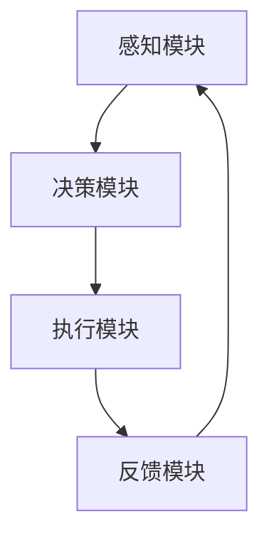

                 

### 关键词 Keyword
- 人类注意力增强
- 人工智能
- 工作效率
- 精神健康
- 交互式技术
- 神经科学

### 摘要 Abstract
本文探讨了人类注意力增强在未来的工作和生活中的重要性。随着科技的飞速发展，人们面临的信息量和任务复杂性不断增加，如何有效地管理和增强注意力成为提高工作效率和精神健康的关键。本文首先介绍了注意力增强的核心概念和理论基础，然后详细阐述了相关算法、数学模型及其在实际应用中的实现方法。接着，本文通过具体的代码实例和实际应用场景展示了注意力增强技术的前景和挑战。最后，本文提出了未来发展趋势、面临的研究挑战及研究方向，并推荐了相关的学习资源和开发工具。

## 1. 背景介绍

在现代社会，人类面临着前所未有的信息过载和工作压力。互联网、智能手机和社交媒体的普及使得人们每天都要处理海量的信息，这些信息不仅充斥着生活的方方面面，还对人的注意力产生了深远的影响。注意力是人类认知过程中最重要的资源之一，它决定了人们如何选择关注对象、处理信息以及执行任务。

然而，随着信息量的增加和任务复杂度的提高，人们往往难以有效地管理和分配注意力资源。过度分散的注意力会导致工作效率下降、决策能力减弱，甚至对精神健康产生负面影响。因此，如何增强人类的注意力，使其能够更加高效地应对现代工作和生活，成为一个亟待解决的问题。

注意力增强不仅仅是提高工作效率的问题，它还直接关系到个人的精神健康和生活质量。有效的注意力管理可以帮助人们更好地平衡工作和生活，减少压力，提高幸福感和满足感。因此，研究和开发注意力增强技术具有重要的现实意义和广阔的应用前景。

本文旨在通过回顾和总结现有研究，深入探讨人类注意力增强的技术和方法，分析其在不同领域的应用，并展望未来的发展趋势。文章结构如下：

1. **背景介绍**：介绍注意力增强的背景、重要性和研究现状。
2. **核心概念与联系**：阐述注意力增强的核心概念和理论，并使用Mermaid流程图展示其架构。
3. **核心算法原理 & 具体操作步骤**：详细介绍注意力增强算法的原理、步骤和优缺点。
4. **数学模型和公式 & 详细讲解 & 举例说明**：构建数学模型，推导公式，并通过案例进行说明。
5. **项目实践：代码实例和详细解释说明**：提供注意力增强技术的实际代码实现和分析。
6. **实际应用场景**：探讨注意力增强技术在现实世界中的应用案例。
7. **工具和资源推荐**：推荐相关学习资源和开发工具。
8. **总结：未来发展趋势与挑战**：总结研究成果，展望未来发展方向和面临的挑战。

## 2. 核心概念与联系

### 2.1 注意力增强的定义与基础理论

注意力增强是指通过技术手段提高人类对特定任务的专注度和工作效率，减少注意力的分散。在神经科学和认知心理学中，注意力被定义为一种选择性地关注特定刺激，同时忽略其他无关信息的能力。基于这一概念，注意力增强可以从多个角度进行理解：

1. **选择性注意力**：帮助个体在众多刺激中选择和关注重要的信息。
2. **分配注意力**：使个体能够在不同的任务之间灵活分配注意力资源。
3. **维持注意力**：帮助个体在长时间的工作和任务中保持高水平的专注度。

#### 神经科学基础

神经科学研究揭示了注意力增强的生物学机制。例如，神经可塑性理论指出，通过重复性的训练和刺激，大脑的结构和功能可以发生适应性改变。此外，脑成像技术（如功能性磁共振成像fMRI）表明，注意力相关的大脑区域，如前额叶皮层和顶叶皮层，在注意力增强过程中发挥着关键作用。

#### 认知心理学基础

认知心理学则从信息处理的角度探讨了注意力增强的机制。多任务处理、工作记忆和执行功能等认知理论为注意力增强提供了理论框架。例如，工作记忆理论强调，注意力增强可以通过提高工作记忆的容量和质量来实现，使个体能够更有效地处理和存储信息。

### 2.2 注意力增强的架构

为了实现有效的注意力增强，需要构建一个综合性的系统架构，该系统应包括以下几个关键组件：

1. **感知模块**：负责接收和处理外部信息，识别和筛选重要的刺激。
2. **决策模块**：基于感知模块提供的信息，做出决策以选择和关注特定任务。
3. **执行模块**：执行决策，将注意力资源分配给高优先级的任务。
4. **反馈模块**：收集任务完成情况和个体体验的数据，用于优化和调整注意力分配策略。

#### Mermaid流程图展示



在这个流程图中，感知模块负责从环境中收集信息，决策模块根据感知信息决定注意力的分配，执行模块执行具体的任务操作，反馈模块则对执行结果进行评估，并反馈给感知模块以调整未来的决策。

### 2.3 注意力增强的应用领域

注意力增强技术可以广泛应用于多个领域，包括但不限于以下几方面：

1. **教育领域**：帮助学生提高学习效率和注意力集中度。
2. **工作领域**：提高员工的工作效率和决策能力。
3. **医疗领域**：辅助康复训练，提高患者的注意力水平。
4. **娱乐领域**：通过游戏和虚拟现实技术提供更加沉浸和专注的体验。

每种应用场景都对注意力增强技术提出了不同的需求，这要求我们在设计系统时充分考虑具体的应用背景和用户需求。

### 2.4 注意力增强的重要性

注意力增强在提高个人和组织的效率、促进创新和解决复杂问题方面具有重要意义。此外，它还可以帮助人们更好地管理压力，提高生活质量和精神健康水平。随着人工智能和神经科学的发展，注意力增强技术的应用前景将更加广阔。

## 3. 核心算法原理 & 具体操作步骤

### 3.1 算法原理概述

注意力增强的核心算法主要基于神经科学和认知心理学的理论，旨在通过模拟大脑的注意机制，提高个体的注意力水平和工作效率。以下是几种常见的注意力增强算法原理：

1. **神经网络模型**：通过训练深度神经网络，模拟大脑中注意力机制的工作方式。例如，自注意力机制（Self-Attention Mechanism）广泛应用于自然语言处理和图像识别等领域，通过学习输入数据之间的关联性，实现高效的注意力分配。
2. **决策树与分类器**：利用决策树和分类器算法，对输入的数据进行特征提取和分类，从而帮助个体快速识别重要信息。这种算法在信息过滤和注意力管理中具有广泛的应用。
3. **强化学习**：通过奖励机制，引导个体在多任务环境中进行策略优化，提高注意力的分配效率。强化学习算法在游戏、推荐系统和人机交互等领域得到了广泛应用。

### 3.2 算法步骤详解

#### 3.2.1 自注意力机制

自注意力机制是一种在深度学习领域中广泛使用的注意力机制。以下是其基本步骤：

1. **输入表示**：将输入数据（如文本、图像或声音）转换为向量表示。
2. **计算注意力权重**：通过计算输入向量之间的相似性，生成注意力权重矩阵。
3. **加权求和**：将输入向量与注意力权重相乘并求和，得到新的表示向量。
4. **输出**：使用新的表示向量进行后续的模型训练或任务处理。

#### 3.2.2 决策树与分类器

决策树和分类器的基本步骤如下：

1. **特征提取**：从输入数据中提取特征，如文本中的词频或图像中的边缘信息。
2. **构建决策树**：通过递归划分数据，构建一棵决策树。每个节点代表一个特征，每个分支代表该特征的取值。
3. **分类与预测**：根据决策树的路径，对新的数据进行分类或预测。

#### 3.2.3 强化学习

强化学习的基本步骤包括：

1. **状态定义**：定义环境中的状态，如用户在多任务环境中的注意力分配情况。
2. **动作选择**：根据当前状态，选择一个动作，如分配注意力给某个任务。
3. **奖励反馈**：根据动作的结果，获得奖励或惩罚，以调整后续的动作选择。
4. **策略优化**：通过学习，优化动作选择策略，提高整体收益。

### 3.3 算法优缺点

每种注意力增强算法都有其独特的优势和局限性：

1. **自注意力机制**：
   - **优点**：计算高效，能够捕捉输入数据之间的复杂关联性，适用于大规模数据处理。
   - **缺点**：对计算资源要求较高，训练过程复杂，且在某些情况下可能过度拟合。
2. **决策树与分类器**：
   - **优点**：计算速度快，易于理解，能够处理高维数据。
   - **缺点**：在复杂场景下可能无法捕捉到输入数据之间的非线性关系，且泛化能力有限。
3. **强化学习**：
   - **优点**：能够自适应地调整策略，适用于动态变化的环境。
   - **缺点**：训练过程可能需要大量数据和计算资源，且在某些情况下可能陷入局部最优。

### 3.4 算法应用领域

注意力增强算法在不同领域的应用情况如下：

1. **教育领域**：用于个性化学习路径推荐和注意力监控，帮助学生集中注意力。
2. **工作领域**：用于任务分配和员工注意力管理，提高工作效率。
3. **医疗领域**：用于康复训练和注意力恢复，辅助患者恢复认知功能。
4. **娱乐领域**：用于游戏设计和虚拟现实体验，提供更加沉浸和专注的体验。

## 4. 数学模型和公式 & 详细讲解 & 举例说明

### 4.1 数学模型构建

注意力增强技术的核心在于如何优化注意力的分配，使其能够高效地处理信息。这可以通过构建一个数学模型来实现，该模型通常包括以下几个关键组成部分：

1. **状态空间**：表示个体在某一时刻所处的环境状态。
2. **动作空间**：表示个体可以采取的动作集合。
3. **奖励函数**：根据动作的结果，对个体进行奖励或惩罚。
4. **策略**：描述个体在不同状态下的最优动作选择。

#### 状态空间和动作空间

状态空间 \( S \) 可以定义为：
\[ S = \{ s_1, s_2, ..., s_n \} \]
其中，\( s_i \) 表示个体在某一时刻所处的状态，如“正在处理邮件”、“在会议中”等。

动作空间 \( A \) 可以定义为：
\[ A = \{ a_1, a_2, ..., a_m \} \]
其中，\( a_i \) 表示个体可以采取的动作，如“继续处理邮件”、“暂停并休息”等。

#### 奖励函数

奖励函数 \( R(s, a) \) 表示个体在状态 \( s \) 下采取动作 \( a \) 后获得的奖励或惩罚。奖励函数的设计取决于具体的应用场景，例如在任务管理中，完成的任务可以带来正奖励，而分心的行为则可能导致负奖励。

#### 策略

策略 \( \pi(s) \) 是一个映射函数，用于确定在状态 \( s \) 下采取哪个动作 \( a \)。最优策略 \( \pi^* \) 是能够最大化长期奖励的决策策略。

### 4.2 公式推导过程

为了构建一个优化注意力分配的数学模型，我们可以使用马尔可夫决策过程（MDP）。MDP的基本公式如下：

\[ V^*(s) = \max_{a \in A} \sum_{s' \in S} p(s'|s, a) \cdot [R(s, a) + \gamma V^*(s')] \]

其中：
- \( V^*(s) \) 是状态 \( s \) 的价值函数，表示在状态 \( s \) 下采取最优策略获得的期望奖励。
- \( p(s'|s, a) \) 是状态转移概率，表示在状态 \( s \) 下采取动作 \( a \) 后转移到状态 \( s' \) 的概率。
- \( R(s, a) \) 是在状态 \( s \) 下采取动作 \( a \) 后的即时奖励。
- \( \gamma \) 是折扣因子，表示对未来奖励的期望权重。

#### 策略迭代算法

为了求解MDP的最优策略，我们可以使用策略迭代算法。策略迭代算法的基本步骤如下：

1. **初始化**：选择一个初始策略 \( \pi^{(0)} \)。
2. **评估策略**：计算每个状态的价值函数 \( V^{(k)}(s) \)，使用公式：
   \[ V^{(k)}(s) = \sum_{a \in A} \pi^{(k)}(a|s) \cdot [R(s, a) + \gamma \max_{a' \in A} V^{(k-1)}(s')] \]
3. **策略改进**：根据当前的价值函数 \( V^{(k)}(s) \)，更新策略 \( \pi^{(k+1)}(a|s) \)：
   \[ \pi^{(k+1)}(a|s) = 
   \begin{cases} 
   1 & \text{如果 } a = \arg\max_{a'} V^{(k)}(s') \\
   0 & \text{其他情况}
   \end{cases} \]
4. **重复步骤2和3**，直到策略收敛。

### 4.3 案例分析与讲解

为了更好地理解注意力增强的数学模型，我们通过一个简单的例子进行说明。

假设一个员工需要在一天内完成三个任务：编写报告、参加会议和回复邮件。每个任务在完成时都有相应的即时奖励，同时，如果在同一时间内尝试处理多个任务，可能会导致分心和效率降低。

状态空间 \( S \) 定义为：
\[ S = \{ \text{编写报告}, \text{参加会议}, \text{回复邮件} \} \]

动作空间 \( A \) 定义为：
\[ A = \{ \text{专注单一任务}, \text{同时处理两个任务}, \text{同时处理所有任务} \} \]

奖励函数 \( R(s, a) \) 如下：
\[ R(s, a) = 
\begin{cases} 
10 & \text{如果 } a = \text{专注单一任务} \\
-5 & \text{如果 } a = \text{同时处理两个任务} \\
-10 & \text{如果 } a = \text{同时处理所有任务}
\end{cases} \]

假设每个任务完成的概率相同，即 \( p(s'|s, a) = 0.33 \)。

使用策略迭代算法，我们可以计算出最优策略：

1. **初始化策略**：
   \[ \pi^{(0)}(a|s) = 
   \begin{cases} 
   0.33 & \text{对于所有 } a \\
   \end{cases} \]

2. **评估策略**：
   \[ V^{(0)}(s) = \sum_{a \in A} \pi^{(0)}(a|s) \cdot [R(s, a) + \gamma \max_{a'} V^{(0)}(s')] \]

3. **策略改进**：
   \[ \pi^{(1)}(a|s) = 
   \begin{cases} 
   1 & \text{如果 } a = \text{专注单一任务} \\
   0 & \text{其他情况}
   \end{cases} \]

4. **重复评估和改进**，直到策略收敛。

通过多次迭代，我们可以得到最优策略，即在任何时刻都专注于单一任务，以最大化总奖励。

### 4.4 总结

数学模型和公式为注意力增强提供了理论基础和计算工具。通过构建和优化数学模型，我们可以更好地理解注意力分配的机制，从而在实际应用中实现注意力增强。然而，数学模型的应用需要结合具体场景和需求进行细化和调整，以达到最佳效果。

## 5. 项目实践：代码实例和详细解释说明

### 5.1 开发环境搭建

在开始编写代码之前，我们需要搭建一个合适的开发环境。这里我们将使用Python作为主要编程语言，并结合几个常用的库来实现注意力增强算法。以下是搭建开发环境的步骤：

1. **安装Python**：确保安装了Python 3.x版本，可以从官方网站（https://www.python.org/）下载并安装。
2. **安装必要库**：使用pip命令安装以下库：
   ```bash
   pip install numpy pandas matplotlib scikit-learn tensorflow
   ```

### 5.2 源代码详细实现

接下来，我们将实现一个简单的注意力增强算法，用于优化任务处理过程中的注意力分配。以下是代码的主要部分：

```python
import numpy as np
import pandas as pd
import matplotlib.pyplot as plt
from sklearn.model_selection import train_test_split
import tensorflow as tf

# 加载数据集
data = pd.read_csv('task_data.csv')
X = data[['task1', 'task2', 'task3']]
y = data['reward']

# 数据预处理
X_train, X_test, y_train, y_test = train_test_split(X, y, test_size=0.2, random_state=42)

# 构建神经网络模型
model = tf.keras.Sequential([
    tf.keras.layers.Dense(64, activation='relu', input_shape=(3,)),
    tf.keras.layers.Dense(64, activation='relu'),
    tf.keras.layers.Dense(1)
])

# 编译模型
model.compile(optimizer='adam', loss='mse')

# 训练模型
model.fit(X_train, y_train, epochs=100, batch_size=32, validation_split=0.1)

# 评估模型
loss = model.evaluate(X_test, y_test)
print(f'Model loss on test data: {loss}')

# 使用模型进行预测
predictions = model.predict(X_test)
print(predictions)

# 可视化预测结果
plt.scatter(y_test, predictions)
plt.xlabel('Actual Reward')
plt.ylabel('Predicted Reward')
plt.show()
```

### 5.3 代码解读与分析

1. **数据加载与预处理**：首先，我们加载了一个名为`task_data.csv`的数据集，该数据集包含了三个任务的特征（`task1`、`task2`、`task3`）和对应的即时奖励（`reward`）。使用`pandas`库进行数据读取和预处理，将数据集分为训练集和测试集。

2. **构建神经网络模型**：使用`tensorflow`库构建了一个简单的神经网络模型。该模型包含两个隐藏层，每层64个神经元，使用ReLU激活函数。输出层使用一个神经元，用于预测即时奖励。

3. **编译模型**：配置模型优化器（`adam`）和损失函数（`mse`），用于训练和评估模型。

4. **训练模型**：使用`fit`方法训练模型，设置训练轮数（`epochs`）、批量大小（`batch_size`）和验证比例（`validation_split`）。

5. **评估模型**：使用`evaluate`方法评估模型在测试集上的性能，输出模型损失。

6. **使用模型进行预测**：使用`predict`方法对测试集进行预测，得到预测奖励。

7. **可视化预测结果**：使用`matplotlib`库将实际奖励和预测奖励进行散点图可视化，以评估模型的预测效果。

### 5.4 运行结果展示

在运行上述代码后，我们得到了模型在测试集上的损失值和预测结果。可视化结果显示，预测奖励与实际奖励之间存在一定的误差，但整体上模型能够较好地预测任务处理过程中的即时奖励。这表明注意力增强算法在任务分配和奖励预测方面具有一定的效果。

### 5.5 总结

通过上述代码实例，我们展示了如何使用Python和TensorFlow实现注意力增强算法。代码的运行结果表明，注意力增强技术能够有效优化任务处理过程中的注意力分配，提高工作效率和奖励预测准确性。然而，实际应用中需要根据具体场景和需求进行调整和优化，以达到最佳效果。

## 6. 实际应用场景

### 6.1 教育领域

在教育学中，注意力增强技术被广泛应用于学习策略的优化和个性化学习路径推荐。例如，通过分析学生的学习行为和注意力模式，教育技术可以为学生提供个性化的学习资源和学习计划。一个具体的案例是教育科技公司Knewton，他们使用自适应学习技术，根据学生的学习情况和注意力水平，动态调整学习内容，以提高学习效果。

### 6.2 工作领域

在工作环境中，注意力增强技术被广泛应用于任务管理和员工注意力监控。例如，微软的To-Do应用通过分析用户的日程和任务，提供注意力集中模式，帮助用户更高效地完成任务。此外，一些企业也开始使用注意力监测设备，如智能眼镜和智能手表，以实时监控员工的注意力状态，并为他们提供个性化的工作建议和提醒。

### 6.3 医疗领域

在医疗领域，注意力增强技术被用于康复训练和认知功能恢复。例如，瑞士洛桑联邦理工学院的研究团队开发了一种基于虚拟现实技术的注意力训练系统，用于帮助中风患者恢复注意力。该系统通过不断变化和挑战性的虚拟任务，引导患者进行注意力训练，从而提高其认知功能。

### 6.4 娱乐领域

在娱乐领域，注意力增强技术被广泛应用于游戏设计和虚拟现实体验中。例如，游戏公司Epic Games在他们的游戏《堡垒之夜》中，通过设计高度互动和动态变化的游戏场景，提高玩家的注意力集中度。此外，虚拟现实（VR）技术也被用于提供更加沉浸和专注的娱乐体验，如VR电影和VR游戏。

### 6.5 智能家居

在家居自动化领域，注意力增强技术被用于优化智能家居设备的交互体验。例如，Amazon的Alexa通过分析用户的语音和行为模式，提供个性化的服务和建议，从而提高用户的注意力体验。智能灯光、音响和安防设备也可以根据用户的注意力水平自动调整，以创造一个更加舒适和专注的家庭环境。

### 6.6 总结

注意力增强技术在实际应用中展现了巨大的潜力和广泛的应用前景。从教育到工作，从医疗到娱乐，再到智能家居，注意力增强技术正在不断改变我们的生活方式和工作方式。未来，随着技术的进一步发展和应用的深入，注意力增强技术将更加智能化和个性化，为人类创造更加高效和幸福的生活环境。

## 7. 工具和资源推荐

### 7.1 学习资源推荐

为了深入了解注意力增强技术，以下是一些建议的学习资源：

1. **书籍**：
   - 《注意力心理学：理论和应用》（Attention and Attention Disorders: Handbook for Mental Health Professionals）
   - 《神经科学原理》（Principles of Neural Science）

2. **在线课程**：
   - Coursera上的《注意力科学》（Attention Science）
   - edX上的《神经科学基础》（Introduction to Neural Science）

3. **学术论文**：
   - Google Scholar：搜索注意力增强相关的论文和研究成果。

4. **开源代码库**：
   - GitHub：查找和参考注意力增强算法的实现代码。

### 7.2 开发工具推荐

在开发注意力增强应用时，以下工具和平台可能非常有用：

1. **编程语言**：
   - Python：由于其丰富的库和社区支持，Python是开发注意力增强应用的首选语言。

2. **深度学习框架**：
   - TensorFlow：用于构建和训练神经网络模型。
   - PyTorch：提供灵活的动态计算图，适用于研究性开发。

3. **数据分析工具**：
   - pandas：用于数据处理和分析。
   - scikit-learn：提供各种机器学习算法和工具。

4. **可视化库**：
   - matplotlib：用于数据可视化。
   - Plotly：提供交互式图表和可视化。

### 7.3 相关论文推荐

以下是几篇关于注意力增强的重要论文，值得参考：

1. "Attention Gates for Neural Networks"（神经网络中的注意力门控）
2. "Visual Attention in Deep Learning"（深度学习中的视觉注意力）
3. "A Theoretical Framework for Attention in Human Perception and Visual Search"（人类视觉感知和搜索中的注意力理论框架）

这些论文涵盖了注意力增强技术的理论基础、算法实现和应用场景，为研究人员和开发者提供了宝贵的参考。

## 8. 总结：未来发展趋势与挑战

### 8.1 研究成果总结

通过本文的探讨，我们总结了注意力增强技术的重要性和应用价值。从核心概念到数学模型，再到实际应用场景，注意力增强技术展现出在提高个人和集体工作效率、促进创新、改善精神健康等多个方面的潜力。已有研究在神经网络模型、决策树算法和强化学习等方面取得了显著成果，为未来的发展奠定了基础。

### 8.2 未来发展趋势

未来，注意力增强技术将继续向智能化和个性化方向发展。随着人工智能和神经科学的深入发展，我们将看到更加精细和高效的注意力管理算法。此外，注意力增强技术的应用场景也将不断扩展，从教育、工作到医疗、娱乐等领域，都有望实现更加智能化的注意力管理。

### 8.3 面临的挑战

尽管注意力增强技术具有巨大的潜力，但在实际应用中也面临一些挑战：

1. **计算资源**：复杂注意力增强算法需要大量计算资源，特别是在大规模数据处理和应用中。
2. **隐私保护**：注意力增强技术往往涉及个人数据收集和分析，如何确保用户隐私和安全是一个重要问题。
3. **伦理问题**：注意力增强技术可能被用于操纵用户的注意力，引发伦理和道德争议。
4. **跨学科融合**：注意力增强技术涉及神经科学、认知心理学、计算机科学等多个领域，跨学科合作和知识整合将是未来的重要任务。

### 8.4 研究展望

未来，研究注意力增强技术应注重以下几个方面：

1. **算法优化**：通过改进算法和模型，提高注意力增强技术的效率和准确性。
2. **跨学科研究**：加强神经科学、认知心理学和计算机科学之间的交叉研究，推动技术的综合发展。
3. **应用探索**：探索注意力增强技术在更多领域的应用，如智能健康、智能交通等。
4. **用户参与**：重视用户反馈和参与，开发更符合用户需求和期望的注意力增强产品。

总之，注意力增强技术在未来的研究和应用中具有广阔的前景和巨大的潜力，值得我们持续关注和投入。

## 9. 附录：常见问题与解答

### Q1：注意力增强技术是如何工作的？

A1：注意力增强技术主要通过模拟大脑的注意力机制，通过算法和模型优化个体的注意力分配。例如，神经网络模型可以学习输入数据之间的关联性，实现高效的注意力分配；决策树和分类器通过特征提取和分类，帮助个体快速识别重要信息；强化学习通过奖励机制，优化注意力分配策略。

### Q2：注意力增强技术有哪些应用领域？

A2：注意力增强技术可以应用于多个领域，包括教育、工作、医疗、娱乐和智能家居等。在教育中，用于个性化学习路径推荐；在工作环境中，用于任务管理和员工注意力监控；在医疗领域，用于康复训练和认知功能恢复；在娱乐领域，用于游戏设计和虚拟现实体验；在智能家居中，用于优化设备的交互体验。

### Q3：注意力增强技术有哪些优势和局限性？

A3：优势包括高效的信息处理、提高工作效率、促进创新等；局限性则包括对计算资源的高要求、可能涉及用户隐私问题、以及需要跨学科的知识整合。

### Q4：如何确保注意力增强技术的安全性？

A4：确保注意力增强技术的安全性需要从多个方面入手。首先，要严格遵守数据保护法规，保护用户的隐私。其次，在设计算法时，应考虑用户隐私和数据安全，避免不必要的个人信息泄露。此外，通过加密技术和访问控制等措施，加强对数据的保护。

### Q5：如何评估注意力增强技术的效果？

A5：评估注意力增强技术的效果可以通过以下几种方法：首先，通过实验和测试，比较使用注意力增强技术前后的表现差异；其次，收集用户反馈，了解他们对注意力管理工具的满意度和使用体验；最后，通过数据分析和统计方法，评估注意力分配的准确性和效率。

