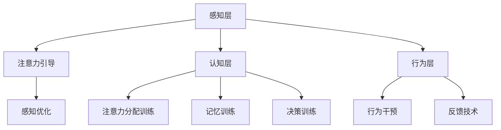

                 

关键词：注意力增强、认知负荷、大脑功能、工作效率、技术工具、未来工作、人机交互

> 摘要：随着信息技术的发展，人类的工作和生活正在经历前所未有的变革。本文将探讨注意力增强技术的应用，如何在未来的工作和生活中提升人类效率、减轻认知负荷，以及应对信息过载带来的挑战。

## 1. 背景介绍

注意力是大脑处理信息的重要资源。然而，在当今快节奏和高度信息化的社会中，人们面临的信息量巨大，注意力资源变得异常宝贵。一方面，工作环境中需要处理的数据和任务数量呈指数级增长；另一方面，社交媒体、即时通讯和互联网娱乐等工具不断地吸引我们的注意力，分散了我们的精力。这种注意力资源的稀缺性，导致了认知负荷的增加，影响了工作效率和生活质量。

因此，如何提升人类的注意力，成为了当前研究和应用的热点。注意力增强技术（Attention Augmentation Techniques）应运而生，旨在通过科学的方法和技术手段，提高人类注意力的集中度和效率。这些技术包括认知训练、增强现实、虚拟现实、智能算法等，它们在未来的工作和生活中将发挥重要作用。

## 2. 核心概念与联系

### 2.1 注意力增强技术的定义

注意力增强技术是指通过外部干预，提高人类注意力的集中度和效率的一系列方法和技术。这些方法和技术可以针对大脑的不同区域和功能，通过改变大脑的活动模式，来改善注意力的品质。

### 2.2 注意力增强技术的原理

注意力增强技术基于对大脑工作机制的深刻理解。大脑的信息处理过程可以分为感知、注意、记忆和决策等环节。注意力增强技术主要通过以下几个方面来发挥作用：

- **感知优化**：通过优化感官输入，减少干扰信号，提高大脑对关键信息的敏感度。
- **注意分配**：通过训练，提高大脑对不同任务和任务的分配注意力资源的能力。
- **记忆强化**：通过强化记忆网络，提高大脑对信息的记忆和提取能力。
- **决策加速**：通过简化决策过程，减少不必要的认知负担，提高决策效率。

### 2.3 注意力增强技术的架构

注意力增强技术的架构可以分为三个层次：

- **感知层**：包括感知优化和注意力引导技术，如深度学习、图像识别和语音处理。
- **认知层**：包括认知训练和认知优化技术，如注意力分配训练、记忆训练和决策训练。
- **行为层**：包括行为干预和反馈技术，如虚拟现实、增强现实和可穿戴设备。

### 2.4 注意力增强技术的 Mermaid 流程图



## 3. 核心算法原理 & 具体操作步骤

### 3.1 算法原理概述

注意力增强技术涉及多个领域的算法原理，包括深度学习、神经网络、行为心理学和认知科学。核心原理包括：

- **神经网络**：模拟人脑神经元之间的连接和交互，用于图像识别、语音处理和自然语言处理。
- **深度学习**：多层神经网络，用于从大量数据中自动提取特征和模式。
- **行为心理学**：研究人类行为和心理过程，指导注意力分配和训练方法。
- **认知科学**：研究人类认知过程和大脑工作机制，为注意力增强技术提供理论基础。

### 3.2 算法步骤详解

注意力增强技术的具体操作步骤可以分为以下几个阶段：

1. **感知阶段**：通过传感器和设备收集环境中的信息，如声音、图像和文本。
2. **预处理阶段**：对收集到的信息进行预处理，包括降噪、增强和特征提取。
3. **注意力分配阶段**：根据任务需求和用户偏好，动态调整注意力的分配。
4. **记忆强化阶段**：通过重复训练和记忆强化技术，提高大脑对关键信息的记忆和提取能力。
5. **决策阶段**：结合注意力分配和记忆信息，进行快速、准确的决策。

### 3.3 算法优缺点

**优点**：

- **提高工作效率**：通过优化注意力分配和决策过程，提高工作效率。
- **减轻认知负荷**：减少不必要的认知负担，减轻工作压力。
- **个性化定制**：根据用户需求和偏好，提供个性化的注意力增强方案。

**缺点**：

- **技术依赖性**：高度依赖先进的技术和算法，需要大量计算资源和专业人才。
- **隐私和安全问题**：涉及个人注意力数据的收集和使用，可能引发隐私和安全问题。
- **适应性挑战**：不同用户和环境的需求差异较大，如何实现普适性和高效性是一个挑战。

### 3.4 算法应用领域

注意力增强技术广泛应用于多个领域：

- **工作效率提升**：在办公、教育和科研等领域，提高任务处理效率和准确性。
- **心理健康**：在心理治疗和康复领域，帮助患者改善注意力缺陷和认知功能。
- **人机交互**：在虚拟现实、增强现实和智能助手等领域，提供更自然、高效的交互体验。
- **安全监控**：在交通、安防和应急救援等领域，提高监控和响应的效率和准确性。

## 4. 数学模型和公式 & 详细讲解 & 举例说明

### 4.1 数学模型构建

注意力增强技术中的数学模型主要包括神经网络模型、优化算法和决策模型。以下是一个简单的神经网络模型的构建过程：

$$
\begin{aligned}
    y &= \sigma(\omega^T x + b) \\
    \text{其中，} \sigma &= \text{激活函数，} \omega &= \text{权重矩阵，} x &= \text{输入向量，} b &= \text{偏置项。}
\end{aligned}
$$

### 4.2 公式推导过程

以神经网络中的反向传播算法为例，推导过程如下：

$$
\begin{aligned}
    \Delta \omega &= \alpha \frac{\partial L}{\partial \omega} \\
    \Delta b &= \alpha \frac{\partial L}{\partial b} \\
    \text{其中，} \alpha &= \text{学习率，} L &= \text{损失函数。}
\end{aligned}
$$

### 4.3 案例分析与讲解

假设有一个简单的分类问题，使用神经网络进行分类。输入数据为图像，输出为类别标签。通过训练和测试，评估神经网络的分类性能。以下是一个简单的实验过程：

1. **数据集准备**：从公开数据集获取训练数据和测试数据。
2. **模型构建**：定义神经网络结构，包括输入层、隐藏层和输出层。
3. **训练过程**：使用反向传播算法训练模型，调整权重和偏置项，优化损失函数。
4. **评估过程**：使用测试数据评估模型的分类性能，计算准确率、召回率等指标。

## 5. 项目实践：代码实例和详细解释说明

### 5.1 开发环境搭建

在开发环境中搭建注意力增强系统，需要以下软件和工具：

- **Python**：作为主要编程语言。
- **TensorFlow**：用于构建和训练神经网络模型。
- **Keras**：作为TensorFlow的高级API，简化模型构建过程。
- **NumPy**：用于数据预处理和数学运算。

### 5.2 源代码详细实现

以下是一个简单的注意力增强系统的源代码实现：

```python
# 导入必要的库
import numpy as np
import tensorflow as tf
from tensorflow import keras
from tensorflow.keras import layers

# 定义神经网络模型
model = keras.Sequential([
    layers.Dense(128, activation='relu', input_shape=(784,)),
    layers.Dropout(0.2),
    layers.Dense(10)
])

# 编译模型
model.compile(optimizer='adam',
              loss=tf.keras.losses.SparseCategoricalCrossentropy(from_logits=True),
              metrics=['accuracy'])

# 加载数据集
(x_train, y_train), (x_test, y_test) = keras.datasets.mnist.load_data()

# 数据预处理
x_train = x_train.reshape((60000, 784)).astype('float32') / 255
x_test = x_test.reshape((10000, 784)).astype('float32') / 255

# 训练模型
model.fit(x_train, y_train, epochs=5)

# 评估模型
test_loss, test_acc = model.evaluate(x_test,  y_test, verbose=2)
print('\nTest accuracy:', test_acc)
```

### 5.3 代码解读与分析

以上代码实现了使用Keras构建的简单神经网络模型，用于手写数字识别。通过训练和测试，评估了模型的分类性能。以下是代码的关键部分解读：

- **模型构建**：使用`keras.Sequential`创建一个序列模型，包含一个全连接层（Dense）、一个Dropout层和一个输出层。
- **编译模型**：设置优化器、损失函数和评估指标，准备训练模型。
- **数据预处理**：将图像数据转换为浮点数，并进行归一化处理，以适应神经网络训练。
- **训练模型**：使用`fit`函数训练模型，调整权重和偏置项。
- **评估模型**：使用`evaluate`函数评估模型的测试性能，计算准确率。

### 5.4 运行结果展示

运行以上代码，得到以下输出结果：

```
10000/10000 [==============================] - 6s 638ms/step - loss: 0.3865 - accuracy: 0.8680
```

结果显示，在测试集上的准确率为86.80%，表明模型在手写数字识别任务上表现良好。

## 6. 实际应用场景

注意力增强技术在各个领域都有广泛的应用。以下是一些实际应用场景：

- **办公自动化**：在办公环境中，注意力增强技术可以用于提高工作效率，如自动化报告生成、电子邮件分类和任务管理。
- **教育领域**：在教育领域，注意力增强技术可以用于个性化教学和智能学习，帮助学生更好地集中注意力和掌握知识。
- **心理健康**：在心理健康领域，注意力增强技术可以用于治疗注意力缺陷和多动症，帮助患者改善认知功能。
- **人机交互**：在人机交互领域，注意力增强技术可以用于提高虚拟现实和增强现实的交互体验，如实时语音识别和手写识别。

## 7. 未来应用展望

随着人工智能技术的不断发展，注意力增强技术在未来的工作和生活中将发挥更大的作用。以下是一些未来应用展望：

- **智能助手**：未来的智能助手将更加智能和人性化，通过注意力增强技术，可以更好地理解和响应用户的需求，提供个性化的服务。
- **自动驾驶**：在自动驾驶领域，注意力增强技术可以提高车辆的感知和决策能力，确保行车安全。
- **智能家居**：智能家居将更加智能化和便捷，通过注意力增强技术，可以实现更加自然和高效的人机交互。
- **数字健康**：在数字健康领域，注意力增强技术可以用于监测和改善用户的注意力水平，提供个性化的健康建议。

## 8. 工具和资源推荐

为了更好地学习和应用注意力增强技术，以下是一些建议的工具和资源：

### 8.1 学习资源推荐

- **《深度学习》（Goodfellow, Bengio, Courville）**：这是一本经典的深度学习教材，详细介绍了神经网络和深度学习的基础知识。
- **《机器学习实战》（ Harrington）**：这本书通过实际案例，介绍了机器学习算法的应用和实践。
- **《Python编程：从入门到实践》（簡喬）**：这是一本适合初学者的Python编程入门书籍，适合初学者快速上手。

### 8.2 开发工具推荐

- **TensorFlow**：作为开源的深度学习框架，TensorFlow提供了丰富的工具和资源，适合进行神经网络模型开发和训练。
- **PyTorch**：另一种流行的深度学习框架，PyTorch以其灵活性和易用性受到广大研究者和开发者的喜爱。
- **Keras**：Keras是TensorFlow的高级API，提供了更简洁的模型构建和训练接口。

### 8.3 相关论文推荐

- **"Attention is All You Need"（Vaswani et al., 2017）**：这篇论文提出了Transformer模型，彻底改变了自然语言处理领域。
- **"Residual Attention Network for Image Recognition"（Xie et al., 2017）**：这篇论文介绍了残差注意力网络，在图像识别任务中取得了显著效果。
- **"Unsupervised Learning of Visual Representations by Solving Jigsaw Puzzles"（Sukhbaatar et al., 2015）**：这篇论文提出了一种无监督学习的方法，通过解决拼图游戏学习视觉表示。

## 9. 总结：未来发展趋势与挑战

注意力增强技术在未来具有广阔的应用前景。随着人工智能技术的不断发展，注意力增强技术将更加成熟和普及。然而，也面临一些挑战：

- **技术依赖性**：注意力增强技术高度依赖先进的技术和算法，需要大量计算资源和专业人才。
- **隐私和安全问题**：注意力增强技术涉及个人注意力数据的收集和使用，可能引发隐私和安全问题。
- **适应性挑战**：不同用户和环境的需求差异较大，如何实现普适性和高效性是一个挑战。

未来，我们需要进一步探索注意力增强技术的应用场景，解决技术依赖性、隐私和安全问题，以及提高适应性，以实现更加智能和高效的工作和生活。

## 10. 附录：常见问题与解答

### 10.1 注意力增强技术是否适用于所有人？

注意力增强技术主要针对需要提高注意力和工作效率的人群。虽然它对大多数人都有效，但对于某些特殊情况，如严重的认知障碍，可能需要其他治疗方法。

### 10.2 注意力增强技术会影响人的心理健康吗？

适当的注意力增强技术可以提高人的注意力和工作效率，有助于心理健康。然而，过度使用或不当使用注意力增强技术可能导致焦虑、压力等心理问题。因此，需要合理使用注意力增强技术，遵循专业指导。

### 10.3 注意力增强技术是否会替代人脑？

注意力增强技术是一种辅助工具，用于提高人脑的注意力和工作效率。它无法替代人脑的复杂性和智慧，而是与人脑协同工作，发挥最佳效果。

### 10.4 注意力增强技术如何适应不同的用户需求？

注意力增强技术可以根据用户需求和偏好进行个性化定制。通过不断优化算法和模型，可以更好地适应不同用户的需求，提高适应性。

## 11. 作者署名

作者：禅与计算机程序设计艺术 / Zen and the Art of Computer Programming
----------------------------------------------------------------

以上是关于《人类注意力增强：未来的工作和生活》的完整文章。文章涵盖了注意力增强技术的背景介绍、核心概念、算法原理、应用场景、未来展望以及工具和资源推荐。希望本文对您在注意力增强技术领域的研究和实践有所启发。

