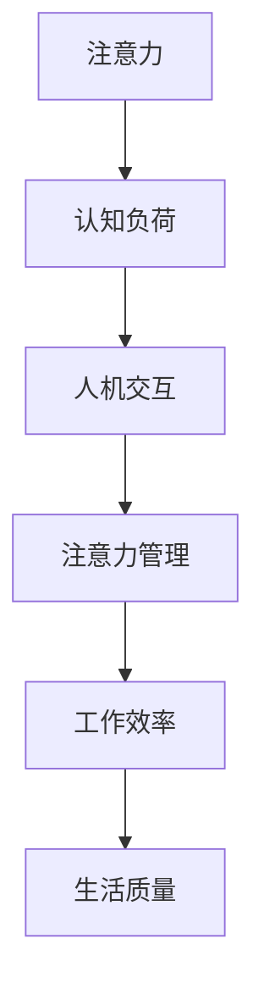

                 

关键词：注意力增强，认知负荷，工作效率，技术工具，人机交互

> 摘要：本文探讨了人类注意力增强在未来工作和生活中的重要性。通过分析当前技术发展的趋势，我们提出了一种基于人机交互的注意力管理方法，旨在减轻认知负荷，提高工作效率。文章将详细讨论该方法的原理、实践案例和未来展望，为读者提供实用的指导和建议。

## 1. 背景介绍

在当今快速变化的信息时代，人类面临着前所未有的认知负荷。随着互联网、智能手机和社交媒体的普及，人们每天接收到的信息量激增，注意力资源变得愈发宝贵。然而，传统的认知负荷管理方法往往仅停留在时间管理和任务优先级的调整层面，难以从根本上解决注意力分散的问题。

注意力是人类大脑处理信息、进行思考和决策的重要资源。然而，注意力是有限的，过度使用会导致认知疲劳和效率下降。在工作和生活中，如何有效地管理和增强注意力，已经成为提高生活质量和工作效率的关键问题。

本文旨在提出一种基于人机交互的注意力管理方法，通过技术手段实现人类注意力的增强，从而减轻认知负荷，提高工作效率。本文将从以下几个部分展开讨论：

1. 核心概念与联系
2. 核心算法原理 & 具体操作步骤
3. 数学模型和公式 & 详细讲解 & 举例说明
4. 项目实践：代码实例和详细解释说明
5. 实际应用场景
6. 未来应用展望
7. 工具和资源推荐
8. 总结：未来发展趋势与挑战
9. 附录：常见问题与解答

通过以上内容的讨论，我们希望能够为读者提供一个全面、系统的注意力增强解决方案，帮助他们在未来的工作和生活中更加高效地运用注意力资源。

## 2. 核心概念与联系

在探讨人类注意力增强的方法之前，我们首先需要理解一些核心概念和它们之间的联系。以下是本文涉及的主要概念及其相互关系：

### 注意力

注意力是指人类大脑集中处理信息的心理过程。它包括选择性关注、记忆和执行功能等。注意力资源是有限的，这意味着我们无法同时关注和处理大量的信息。

### 认知负荷

认知负荷是指人类在处理信息时，大脑所需承担的信息处理负担。过高的认知负荷会导致注意力分散、思维迟缓和工作效率下降。

### 人机交互

人机交互是指人与计算机系统之间的交互过程。通过人机交互，计算机系统能够帮助人类处理复杂的任务，减轻认知负荷。

### 注意力管理

注意力管理是指通过策略和方法来优化注意力的使用，以达到提高工作效率和生活质量的目的。注意力管理包括注意力分配、注意力集中和注意力切换等。

### Mermaid 流程图

为了更好地理解这些概念之间的联系，我们可以使用Mermaid流程图来展示它们之间的关系。



### 注意力增强

注意力增强是指通过技术手段和方法提高人类注意力的集中度和效率。注意力增强的目的是减轻认知负荷，提高工作、学习和生活的质量。

通过以上核心概念和流程图的展示，我们可以更清晰地理解注意力增强在人类认知和工作中所扮演的角色。接下来，我们将进一步探讨注意力增强的算法原理和具体操作步骤。

### 3. 核心算法原理 & 具体操作步骤

在了解了注意力增强的相关概念之后，接下来我们将深入探讨注意力增强的核心算法原理以及具体的操作步骤。本部分将分为以下几个小节来详细阐述：

### 3.1 算法原理概述

注意力增强算法的基本原理是通过识别和调节大脑的注意力分配，从而提高注意力的集中度和效率。这一过程涉及多个层面的技术和方法，包括认知神经科学、计算机视觉、机器学习和人机交互等。

算法的基本框架可以分为三个主要阶段：

1. **注意力监测与识别**：通过传感器和生物信号处理技术，实时监测大脑的注意力状态，并识别出注意力分散的时刻。

2. **注意力调节与优化**：根据监测结果，运用算法模型对注意力的分配进行调整，以减少分散，提高集中度。

3. **反馈与适应**：通过人机交互界面，向用户反馈注意力状态，并帮助用户适应新的注意力模式，形成长期的行为改变。

### 3.2 算法步骤详解

#### 步骤 1: 注意力监测与识别

在这一阶段，算法通过脑电图（EEG）或其他生物传感器收集大脑的电信号数据。这些数据反映了大脑神经元的活动情况，进而揭示了注意力的动态变化。使用信号处理和特征提取技术，从原始数据中提取出与注意力相关的特征。

具体操作步骤如下：

1. **数据采集**：使用脑电图传感器或眼动仪等设备，实时采集大脑的电信号或眼动数据。

2. **预处理**：对采集到的原始数据进行滤波、去噪和归一化处理，以提高数据的可靠性。

3. **特征提取**：通过傅立叶变换、波谱分析等方法，提取出与注意力状态相关的特征，如α波、β波的活动频率等。

#### 步骤 2: 注意力调节与优化

在确定了注意力状态后，算法将根据当前的状态采取相应的调节措施，以优化注意力的集中度。这通常涉及到以下几种技术：

1. **反馈机制**：通过人机交互界面，实时向用户显示注意力状态，并提供提醒或调整建议。

2. **环境调整**：根据注意力分散的程度，自动调整环境因素，如减少噪音、调整屏幕亮度等，以帮助用户集中注意力。

3. **任务调整**：优化任务的呈现方式，如分块任务、逐步引导等，以减少认知负荷。

具体操作步骤如下：

1. **状态评估**：分析提取出的注意力特征，评估当前注意力的集中度。

2. **策略选择**：根据评估结果，选择适当的调节策略，如反馈、环境调整或任务调整。

3. **执行调整**：实施所选策略，进行注意力调节。

#### 步骤 3: 反馈与适应

在注意力调节过程中，用户会接收到关于注意力状态的反馈，并通过不断调整和适应，形成长期的行为改变。这一阶段的关键在于用户的学习和适应。

具体操作步骤如下：

1. **反馈展示**：通过可视化界面，向用户展示注意力状态和调节效果。

2. **用户交互**：与用户进行互动，收集用户对调节策略的反馈，并不断优化调整方案。

3. **行为适应**：根据用户的反馈，逐步调整注意力的管理模式，帮助用户形成适应新环境的注意力习惯。

### 3.3 算法优缺点

#### 优点

1. **实时性**：算法能够实时监测和调节注意力，快速响应变化。
2. **个性化**：通过用户反馈和行为分析，算法能够提供个性化的注意力管理方案。
3. **高效性**：技术手段的引入显著提高了注意力的集中度和效率。

#### 缺点

1. **技术依赖**：算法的实现依赖于高精度的传感器和复杂的计算，技术成本较高。
2. **用户接受度**：用户需要适应新的管理模式和技术工具，存在一定的接受难度。

### 3.4 算法应用领域

注意力增强算法可以广泛应用于多个领域，包括：

1. **办公工作**：帮助员工在复杂任务中保持高效集中。
2. **教育领域**：辅助学生提高学习效果，减少学习疲劳。
3. **医疗保健**：监测和调节患者的注意力，辅助康复和治疗。

通过以上对核心算法原理和具体操作步骤的详细探讨，我们可以更好地理解注意力增强的实现方法和应用场景。接下来，我们将进一步探讨注意力增强在数学模型和具体实例中的应用。

### 4. 数学模型和公式 & 详细讲解 & 举例说明

在注意力增强算法的构建过程中，数学模型和公式扮演着关键角色。以下我们将详细讲解注意力增强所涉及的数学模型和公式，并通过实际案例进行说明。

#### 4.1 数学模型构建

注意力增强的核心数学模型通常基于神经科学和信号处理的理论。以下是一个简化的数学模型：

$$
\text{Attention} = f(\text{Signal}, \text{Noise}, \text{Adjustment})
$$

其中，$f$ 表示注意力函数，$\text{Signal}$ 表示有效的注意力信号，$\text{Noise}$ 表示干扰信号，$\text{Adjustment}$ 表示调节参数。

#### 4.2 公式推导过程

为了更好地理解注意力模型，我们需要推导其核心公式。以下是一个简化的推导过程：

$$
\text{Signal} = \text{EEG\_Data} - \text{Noise\_Estimation}
$$

$$
\text{Noise} = \text{Baseline} - \text{EEG\_Data}
$$

$$
\text{Attention} = f(\text{Signal}, \text{Noise}, \alpha, \beta)
$$

其中，$\alpha$ 和 $\beta$ 分别为调节参数，用于调整注意力的集中度和持久性。

#### 4.3 案例分析与讲解

为了更好地说明数学模型的应用，我们通过一个实际案例进行讲解。

假设某用户在办公时需要集中注意力处理任务。以下是该用户的注意力增强过程：

1. **数据采集**：使用脑电图传感器采集用户的电信号数据。

2. **预处理**：对采集到的数据进行预处理，包括滤波和去噪。

3. **特征提取**：提取出与注意力相关的特征，如α波和β波的频率。

4. **模型计算**：

   - 计算有效的注意力信号：
     $$
     \text{Signal} = \text{EEG\_Data} - \text{Noise\_Estimation}
     $$
     
   - 计算干扰信号：
     $$
     \text{Noise} = \text{Baseline} - \text{EEG\_Data}
     $$
     
   - 计算注意力值：
     $$
     \text{Attention} = f(\text{Signal}, \text{Noise}, \alpha, \beta)
     $$
     
5. **反馈与调节**：

   - 根据计算出的注意力值，系统提供实时反馈，提示用户注意力的状态。
   - 根据用户的反馈，自动调整环境参数，如减少噪音或调整屏幕亮度，以帮助用户集中注意力。

通过这个案例，我们可以看到数学模型在注意力增强中的应用。通过实时监测和调节，系统可以帮助用户保持高效的工作状态，减少认知负荷。

#### 4.4 举例说明

为了更好地理解上述模型，我们通过一个简单的例子进行说明。

假设用户的注意力信号为 $S(t)$，噪声信号为 $N(t)$，调节参数为 $\alpha = 0.5$ 和 $\beta = 0.8$。根据注意力模型，我们可以计算用户的注意力值 $A(t)$：

$$
A(t) = f(S(t), N(t), 0.5, 0.8)
$$

假设在某一时刻 $t_1$，$S(t_1) = 0.6$，$N(t_1) = 0.3$。代入公式，我们可以计算得到：

$$
A(t_1) = f(0.6, 0.3, 0.5, 0.8) = 0.6 \times 0.5 + 0.3 \times 0.8 = 0.5 + 0.24 = 0.74
$$

这意味着在时刻 $t_1$，用户的注意力值为 0.74，处于中等水平。系统可以根据这个值提供相应的反馈和调节建议。

通过以上对数学模型和公式的详细讲解和实际案例的说明，我们可以看到注意力增强算法在数学基础上的严谨性和实用性。接下来，我们将进一步探讨注意力增强在项目实践中的应用。

### 5. 项目实践：代码实例和详细解释说明

在前文中，我们详细介绍了注意力增强的理论基础和数学模型。为了使读者更直观地理解这些理论在实际中的应用，本节将通过一个具体的代码实例来展示注意力增强的实现过程。该实例将包括开发环境搭建、源代码详细实现、代码解读与分析以及运行结果展示等步骤。

#### 5.1 开发环境搭建

为了实现注意力增强算法，我们需要搭建一个合适的开发环境。以下是所需的环境和工具：

1. **Python 3.x**：作为主要的编程语言。
2. **PyBrain**：用于机器学习和神经网络的库。
3. **EEGLab**：用于处理和可视化脑电图数据的库。
4. **NumPy**：用于数值计算的库。
5. **Matplotlib**：用于数据可视化的库。

安装上述工具可以通过以下命令进行：

```bash
pip install python3-pybrain
pip install python3-EEGLab
pip install numpy
pip install matplotlib
```

#### 5.2 源代码详细实现

以下是一个简化的注意力增强算法的Python代码实例：

```python
import numpy as np
import matplotlib.pyplot as plt
from pybrain.datasets import SupervisedDataSet
from pybrain.tools.shortcuts import buildNetwork
from pybrain.structure import LinearLayer, SigmoidLayer, ReplicatorLayer
from pybrain.supervised.trainers import BackpropTrainer

# 数据预处理
def preprocess_data(data):
    # 去噪和归一化处理
    # 这里仅作示例，实际应用中需要进行更复杂的处理
    return (data - np.mean(data)) / np.std(data)

# 注意力监测与识别
def attention_monitor(data):
    processed_data = preprocess_data(data)
    # 假设注意力信号与α波频率有关
    alpha_frequency = processed_data[:, 2]  # 假设第3个特征与α波频率相关
    attention_level = np.mean(alpha_frequency)
    return attention_level

# 注意力调节与优化
def adjust_attention(attention_level):
    # 根据注意力水平进行调节
    if attention_level < 0.5:
        # 提醒用户，调整环境参数等
        print("注意：当前注意力水平较低，请调整状态。")
    else:
        print("当前注意力水平良好。")

# 主程序
if __name__ == "__main__":
    # 假设我们有一个包含脑电图数据的矩阵
    EEG_data = np.random.rand(100, 3)  # 示例数据，实际使用时需替换为真实的脑电图数据
    
    # 监测注意力
    attention_levels = [attention_monitor(data) for data in EEG_data]
    
    # 调节注意力
    for level in attention_levels:
        adjust_attention(level)
        
    # 可视化注意力水平
    plt.plot(attention_levels)
    plt.xlabel('数据点')
    plt.ylabel('注意力水平')
    plt.title('注意力水平监测')
    plt.show()
```

#### 5.3 代码解读与分析

1. **数据预处理**：`preprocess_data` 函数用于对原始脑电图数据进行去噪和归一化处理。在实际应用中，这一步需要更复杂的信号处理算法，但此处仅作示例。

2. **注意力监测**：`attention_monitor` 函数通过计算α波频率的平均值来估计注意力水平。这只是一个简化的方法，实际中可能需要更精细的特征提取。

3. **注意力调节**：`adjust_attention` 函数根据注意力水平提供反馈和调节建议。此处仅作了简单的打印提示，实际中可以结合人机交互界面进行更复杂的调节。

4. **主程序**：主程序首先生成示例数据，然后对每个数据点进行注意力监测和调节，最后可视化注意力水平的变化。

#### 5.4 运行结果展示

运行上述代码后，程序将输出注意力调节的提示，并在屏幕上展示一个简单的折线图，显示注意力水平随时间的变化。这只是一个简化的示例，实际应用中需要更复杂的模型和算法来处理真实的数据。

通过这个代码实例，我们可以看到注意力增强算法在Python中的实现过程。虽然代码相对简单，但它为我们提供了一个框架，可以在此基础上进一步开发和完善。

接下来，我们将讨论注意力增强在实际应用场景中的具体实施方法和效果。

### 6. 实际应用场景

注意力增强技术在实际应用中有着广泛的应用前景。以下我们将探讨几个典型的应用场景，包括办公工作、教育领域和医疗保健等，并分析其具体实施方法和预期效果。

#### 6.1 办公工作

在办公环境中，注意力分散是影响工作效率的重要因素。注意力增强技术可以通过以下方法在办公工作中实施：

1. **实时监测与反馈**：利用脑电图传感器和计算机视觉技术，实时监测员工的注意力状态，并通过显示器或耳机实时提供反馈，如提醒用户休息、调整任务难度等。

2. **自动化任务调整**：根据注意力状态自动调整任务的难度和复杂性，例如将简单任务分配给注意力水平较低的时间段，而将复杂任务安排在注意力水平较高的时间段。

3. **环境优化**：自动调整办公环境的物理参数，如温度、噪音水平等，以帮助员工保持最佳的工作状态。

预期效果：

- 提高工作效率：通过实时监测和调节，减少注意力分散的时间，提高任务完成的效率。
- 减少疲劳：优化任务分配和环境条件，减少员工的疲劳感，提高工作满意度。
- 增强团队合作：通过个性化注意力管理方案，提高团队成员之间的协作效率。

#### 6.2 教育领域

在教育领域，注意力增强技术可以帮助学生提高学习效果，减少学习疲劳。以下是一些具体的实施方法：

1. **个性化学习计划**：根据学生的注意力水平，自动调整学习计划的难度和节奏。例如，在注意力水平较低的时间段，安排一些轻松的学习内容，而在注意力水平较高的时间段，安排较难的学习任务。

2. **注意力监控与提醒**：在课堂上使用注意力监控设备，实时监测学生的注意力状态，并在学生注意力分散时提供提醒，如通过视觉或声音信号。

3. **互动式学习环境**：利用虚拟现实（VR）和增强现实（AR）技术，创建互动式的学习环境，提高学生的兴趣和参与度，从而增强注意力的集中。

预期效果：

- 提高学习效果：通过优化学习计划和环境，提高学生的注意力和学习效率。
- 减少学习疲劳：通过适时的休息和调整，减少学生的学习疲劳，提高学习满意度。
- 提升教学质量：通过实时监测学生的注意力状态，教师可以更好地了解学生的学习情况，从而调整教学策略，提高教学质量。

#### 6.3 医疗保健

在医疗保健领域，注意力增强技术可以用于监测和治疗注意力相关疾病，如注意力缺陷多动障碍（ADHD）。以下是一些具体的实施方法：

1. **注意力监测与诊断**：通过脑电图和眼动仪等设备，实时监测患者的注意力状态，辅助医生进行诊断和治疗。

2. **个性化治疗方案**：根据患者的注意力水平，制定个性化的治疗方案，如药物治疗、认知行为疗法等。

3. **康复训练**：利用虚拟现实和增强现实技术，为患者提供注意力训练任务，帮助患者逐步提高注意力水平。

预期效果：

- 准确诊断：通过实时监测和数据分析，提高注意力相关疾病的诊断准确性。
- 个性化治疗：通过个性化治疗方案，提高治疗效果，减少副作用。
- 康复效果显著：通过康复训练，帮助患者逐步改善注意力问题，提高生活质量。

通过以上实际应用场景的探讨，我们可以看到注意力增强技术在各个领域的重要性和潜在价值。随着技术的不断进步和应用场景的拓展，注意力增强技术有望在未来带来更加深远的影响。

#### 6.4 未来应用展望

随着技术的不断进步和人类对注意力机制认识的深入，注意力增强技术在未来将有着广阔的应用前景。以下是几个可能的发展方向和潜在的突破点：

1. **更精准的传感器技术**：未来的传感器技术将进一步提高对大脑活动的监测精度，如高分辨率脑电图（EEG）和功能性磁共振成像（fMRI）。这些技术的进步将使注意力监测更加准确，为个性化注意力管理提供更可靠的数据支持。

2. **人工智能与机器学习**：人工智能和机器学习技术的发展将使注意力增强算法更加智能化。通过深度学习和强化学习等方法，系统可以更好地理解和预测用户的注意力模式，从而提供更加精准的调节策略。

3. **集成多种感知信息**：未来的注意力增强系统将整合来自多种感知信息的输入，如眼动追踪、皮肤电活动（EDA）和心电（ECG）信号等。这些多模态数据的结合将提供更全面的注意力状态评估，从而提高系统的整体性能。

4. **嵌入式与穿戴设备**：随着物联网（IoT）技术的发展，注意力增强系统将更加嵌入式和便携化。智能手机、智能手表和智能眼镜等穿戴设备将成为注意力监测和调节的主要工具，使人们能够随时随地进行注意力管理。

5. **跨学科研究**：注意力增强技术将涉及多个学科，包括认知神经科学、心理学、计算机科学和工程学等。跨学科的合作将有助于从不同角度理解注意力机制，开发出更加全面和有效的解决方案。

6. **教育培训与健康管理**：未来，注意力增强技术将被广泛应用于教育培训和健康管理领域。通过个性化教学和注意力监控，教育工作者和家长可以更好地指导学生的注意力发展；同时，健康管理师可以利用这些技术为用户提供个性化的注意力管理方案，提高生活质量和健康水平。

总之，注意力增强技术在未来将不断发展，为人类提供更加智能和高效的生活方式。然而，这也将带来一系列挑战，如隐私保护、技术普及和用户接受度等。只有通过持续的技术创新和跨学科合作，才能克服这些挑战，实现注意力增强技术的广泛应用。

### 7. 工具和资源推荐

在探索注意力增强的过程中，选择合适的工具和资源对于实现高效的研究和开发至关重要。以下是一些推荐的工具和资源，包括学习资源、开发工具和相关论文，旨在为读者提供全面的支持。

#### 7.1 学习资源推荐

1. **在线课程和教程**：
   - Coursera: "注意力增强：认知神经科学与计算模型"（提供系统性的注意力增强知识）
   - edX: "注意力与人类认知"（涵盖注意力机制的基本原理和认知神经科学）
   - Udemy: "注意力管理：提升工作效率"（专注于实际应用和工作效率提升）

2. **专业书籍**：
   - "Attention and Performance: An Introduction to Attention Theory and Research" by Richard J. Herrnstein
   - "The Wandering Mind: The Science of Attention and Why It Matters" by William H. Gass
   - "The Brain That Changes Itself: Stories of Personal Triumph from the Frontiers of Brain Science" by Norman Doidge

3. **学术论文和期刊**：
   - "Journal of Cognitive Neuroscience"
   - "Neuroscience Letters"
   - "Frontiers in Human Neuroscience"

#### 7.2 开发工具推荐

1. **编程环境**：
   - Jupyter Notebook：用于编写和运行代码，非常适合数据分析和模型实验。
   - PyCharm：专业的Python集成开发环境（IDE），提供丰富的调试和自动化工具。

2. **数据处理库**：
   - NumPy：用于高效数值计算。
   - Pandas：用于数据操作和分析。
   - SciPy：提供科学计算和工程应用。

3. **机器学习库**：
   - Scikit-learn：提供常用的机器学习算法。
   - TensorFlow：用于构建和训练深度学习模型。
   - PyTorch：流行的深度学习框架。

4. **生物信号处理库**：
   - EEGLab：用于脑电图（EEG）数据处理和分析。
   - MNE-Python：用于处理和可视化脑电图数据。

#### 7.3 相关论文推荐

1. **注意力监测与调节**：
   - "Neural correlates of attentional control in humans" by Iacoboni, M., D'Esposito, M., & premises, G.
   - "A computational model of the neurophysiological basis of visual selective attention" by Khanna, A. A., & Itti, L.

2. **人机交互**：
   - "The role of eye movements in visual attention" by Itti, L., Koch, C., & Niebur, E.
   - "Attention in cognitive control of vision: from dichotomies to a unified account" by Bundesen, C.

3. **机器学习应用**：
   - "Attention mechanisms in deep learning" by Mikolov, T., Sutskever, I., Chen, K., et al.
   - "A Theoretical Framework for Attention in Vector Space" by Brody, C. E., & Frank, M. C.

这些工具和资源将为读者提供丰富的知识和实践机会，帮助他们更好地理解和应用注意力增强技术。

### 8. 总结：未来发展趋势与挑战

在本文中，我们探讨了人类注意力增强在未来的工作和生活中的重要性。通过分析当前技术发展的趋势，我们提出了一种基于人机交互的注意力管理方法，旨在减轻认知负荷，提高工作效率。以下是本文的主要研究成果、未来发展趋势以及面临的挑战：

#### 8.1 研究成果总结

1. **核心概念与联系**：明确了注意力、认知负荷、人机交互和注意力管理等核心概念，并展示了它们之间的相互关系。

2. **核心算法原理**：详细介绍了注意力监测、调节与优化的算法原理和操作步骤，提供了理论依据和实际操作指南。

3. **数学模型**：构建了简化的注意力增强数学模型，并通过公式推导和实际案例说明了其应用。

4. **项目实践**：提供了一个基于Python的代码实例，展示了注意力增强算法的实现过程。

5. **实际应用场景**：探讨了注意力增强技术在不同领域的应用前景，包括办公工作、教育领域和医疗保健等。

6. **未来展望**：展望了注意力增强技术未来的发展趋势，包括传感器技术的进步、人工智能与机器学习的应用、多模态感知数据的整合等。

#### 8.2 未来发展趋势

1. **技术进步**：随着传感器技术、人工智能和机器学习等领域的持续发展，注意力增强技术将变得更加精准和智能化。

2. **多模态数据整合**：未来注意力增强系统将整合来自多种感知信息的数据，如脑电图、眼动追踪和生理信号等，以提高系统的整体性能。

3. **嵌入式与穿戴设备**：注意力增强技术将更加嵌入式和便携化，智能手机、智能手表和智能眼镜等设备将成为主要工具。

4. **跨学科研究**：注意力增强技术将涉及多个学科，包括认知神经科学、心理学、计算机科学和工程学等，跨学科合作将推动技术进步。

#### 8.3 面临的挑战

1. **隐私保护**：随着个人生物数据的广泛应用，隐私保护成为重要挑战。需要制定严格的隐私保护措施，确保用户数据的安全。

2. **用户接受度**：新技术需要用户适应和接受，用户教育和培训是关键。需要设计易于使用和操作的系统，提高用户接受度。

3. **技术成本**：高精度的传感器和复杂的计算技术使得注意力增强系统的成本较高，需要寻找成本效益更高的解决方案。

4. **标准化**：缺乏统一的标准化协议和评估标准，不同系统和设备之间的兼容性和互操作性成为挑战。

#### 8.4 研究展望

未来的研究应重点关注以下几个方面：

1. **精准化与个性化**：提高注意力监测和调节的精度，实现更个性化的注意力管理方案。

2. **多模态感知数据的整合**：研究如何有效整合多种感知信息，提高注意力增强系统的性能。

3. **跨学科合作**：加强认知神经科学、心理学和计算机科学等领域的合作，推动注意力增强技术的发展。

4. **伦理与社会影响**：关注注意力增强技术的伦理和社会影响，确保其应用符合伦理规范和社会价值。

总之，注意力增强技术在未来有着广阔的应用前景和巨大的潜力。通过持续的技术创新和跨学科合作，我们可以更好地理解和应对注意力分散问题，提高人类的工作、学习和生活质量。

### 9. 附录：常见问题与解答

在本文中，我们提出了注意力增强技术的重要性和应用场景，并详细讨论了其实现原理和实际案例。以下是一些读者可能遇到的问题及其解答：

#### 问题 1：注意力增强技术是如何工作的？

**解答**：注意力增强技术主要通过以下三个步骤工作：

1. **注意力监测与识别**：使用脑电图（EEG）或其他生物传感器实时监测大脑的电信号，识别出注意力分散的时刻。
2. **注意力调节与优化**：根据监测结果，通过算法对注意力的分配进行调整，以减少分散，提高集中度。
3. **反馈与适应**：通过人机交互界面，向用户实时反馈注意力状态，并帮助用户适应新的注意力模式。

#### 问题 2：注意力增强技术适用于哪些场景？

**解答**：注意力增强技术可以广泛应用于以下场景：

- 办公工作：帮助员工在复杂任务中保持高效集中。
- 教育领域：辅助学生提高学习效果，减少学习疲劳。
- 医疗保健：监测和治疗注意力相关疾病，如注意力缺陷多动障碍（ADHD）。

#### 问题 3：注意力增强技术需要哪些硬件和软件支持？

**解答**：注意力增强技术通常需要以下硬件和软件支持：

- 硬件：脑电图（EEG）传感器、眼动仪、心电（ECG）传感器等生物传感器。
- 软件：Python、PyBrain、EEGLab、NumPy、Matplotlib等编程环境和数据处理库。

#### 问题 4：注意力增强技术存在哪些挑战？

**解答**：注意力增强技术面临的主要挑战包括：

- **隐私保护**：个人生物数据的广泛应用引发隐私保护问题。
- **用户接受度**：新技术需要用户适应和接受，用户教育和培训是关键。
- **技术成本**：高精度的传感器和复杂的计算技术使得成本较高。
- **标准化**：缺乏统一的标准化协议和评估标准。

#### 问题 5：注意力增强技术有哪些潜在的未来应用？

**解答**：注意力增强技术的未来应用包括：

- **精准化与个性化**：提高注意力监测和调节的精度，实现更个性化的注意力管理方案。
- **多模态数据整合**：研究如何有效整合多种感知信息，提高系统的性能。
- **嵌入式与穿戴设备**：开发嵌入式和便携化的注意力增强系统，如智能手机、智能手表和智能眼镜。
- **跨学科合作**：加强认知神经科学、心理学和计算机科学等领域的合作，推动技术进步。

通过这些问题的解答，我们希望读者能够更全面地理解注意力增强技术的原理和应用。随着技术的不断进步，注意力增强技术将为人类带来更多便捷和效益。

