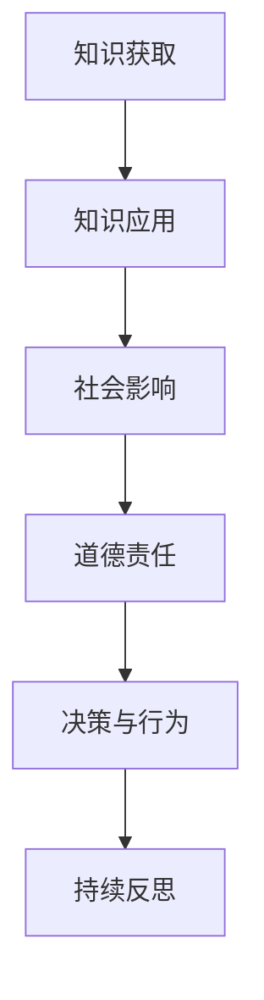

                 

关键词：知识、道德责任、人工智能、伦理、技术影响、人类发展

> 摘要：本文探讨了人类在掌握知识过程中面临的道德责任问题，特别是在人工智能技术的迅速发展的背景下。通过深入分析知识对社会的影响，探讨了知识获取与传播中的道德边界，并提出了未来在知识面前的人类道德责任和实践方向。

## 1. 背景介绍

随着人工智能（AI）技术的飞速发展，人类正在进入一个知识爆炸的时代。数据、算法和计算能力已成为驱动科技进步的核心要素。知识在各个领域的应用不仅提高了生产效率，还推动了社会进步。然而，知识的增长也带来了前所未有的挑战，特别是在伦理和道德方面。在人工智能时代，知识的获取、传播和使用方式发生了巨大变化，这引发了关于人类道德责任的深刻反思。

### 1.1 知识的变革

过去，知识的传播主要依赖于书籍、报纸和学术期刊等传统媒介。然而，互联网和移动设备的普及使得信息获取变得前所未有的便捷。如今，人们可以通过搜索引擎、在线课程和社交媒体轻松获取海量信息。知识不再受限于地理和时间的限制，而是可以在全球范围内快速传递。

### 1.2 人工智能的崛起

人工智能的出现进一步改变了知识的生产和消费方式。AI系统通过学习和分析海量数据，能够发现人类难以察觉的模式和规律。从自动驾驶汽车到智能医疗诊断，人工智能正在各个领域发挥重要作用。然而，AI技术的应用也带来了新的道德困境，例如数据隐私、算法偏见和自动化决策的伦理问题。

## 2. 核心概念与联系

在探讨人类知识面前的道德责任时，我们需要了解几个关键概念，并分析它们之间的联系。

### 2.1 知识的定义

知识是一种通过学习和经验积累获得的信息，它不仅包括事实和数据，还涉及理解、判断和技能。知识是人类智慧的体现，也是推动社会进步的重要力量。

### 2.2 道德责任

道德责任是指个体在道德和伦理原则指导下，对其行为所应承担的责任。道德责任关乎公正、尊重、诚信等价值观，它要求个体在决策和行动中考虑他人的利益和社会的整体福祉。

### 2.3 知识与道德责任的联系

知识的获取和使用不仅影响个体的决策和行为，还对社会产生广泛的影响。在知识面前，人类面临道德责任，需要确保知识的传播和应用符合伦理原则，不损害他人的利益。

### 2.4 Mermaid 流程图



在这个流程图中，知识获取是起点，随后是知识的应用，进而影响社会。在这个过程中，道德责任贯穿始终，引导个体的决策和行为，并促使持续反思。

## 3. 核心算法原理 & 具体操作步骤

在探讨知识面前的道德责任时，我们可以借助一些核心算法原理，帮助理解道德决策的复杂性和技术手段的辅助作用。

### 3.1 算法原理概述

核心算法包括伦理决策模型、道德推理框架和责任归属分析。这些算法通过数据分析和人工智能技术，帮助个体和机构在知识应用过程中做出符合道德原则的决策。

### 3.2 算法步骤详解

1. **数据收集与预处理**：收集相关数据，并进行清洗和标准化处理。
2. **伦理决策模型训练**：利用机器学习技术，训练伦理决策模型，使其能够识别和评估道德问题。
3. **道德推理框架应用**：将伦理决策模型应用于具体场景，生成道德推理结果。
4. **责任归属分析**：分析个体和机构在知识应用过程中的责任，确保责任归属明确。
5. **持续优化与调整**：根据实际应用效果，不断优化算法模型，提高决策的准确性和道德性。

### 3.3 算法优缺点

**优点**：
- **高效性**：算法能够快速处理大量数据，提高决策效率。
- **客观性**：算法基于数据和分析，减少主观偏见。

**缺点**：
- **数据依赖性**：算法的性能受数据质量影响较大。
- **道德复杂性**：道德问题往往涉及多层次、多维度的因素，算法难以全面覆盖。

### 3.4 算法应用领域

算法在医疗、金融、法律等领域都有广泛应用，例如：
- **医疗伦理决策**：在临床决策中，算法帮助医生评估患者的道德风险，提供伦理建议。
- **金融风险控制**：在金融投资中，算法分析市场数据，评估风险，制定投资策略。
- **法律合规审查**：在法律审查过程中，算法帮助律师识别潜在的法律风险，提供合规建议。

## 4. 数学模型和公式 & 详细讲解 & 举例说明

在探讨知识面前的道德责任时，数学模型和公式为我们提供了量化分析的工具。以下是一个简单的例子：

### 4.1 数学模型构建

假设我们有一个道德责任评估模型，其中涉及以下变量：

- **R**：道德责任得分
- **A**：行为影响
- **B**：道德标准

模型公式如下：

\[ R = A \times B \]

### 4.2 公式推导过程

公式推导基于以下原则：
1. 行为影响（A）是评估道德责任的重要因素。
2. 道德标准（B）是衡量行为是否符合伦理原则的基准。

通过这个公式，我们可以量化评估个体或机构在知识应用过程中的道德责任。

### 4.3 案例分析与讲解

**案例**：某公司在人工智能项目中使用用户数据。

- **A**：行为影响：公司通过使用用户数据，提高了产品性能和用户体验。
- **B**：道德标准：用户隐私和数据安全是重要的道德标准。

根据模型公式，我们可以计算道德责任得分：

\[ R = A \times B \]

**分析**：
- 如果公司的行为完全符合道德标准，则道德责任得分为最高值。
- 如果公司的行为存在道德风险，例如未经用户同意使用数据，则道德责任得分会降低。

通过这个例子，我们可以看到数学模型和公式在道德责任评估中的应用。

## 5. 项目实践：代码实例和详细解释说明

为了更好地理解知识面前的道德责任，我们通过一个具体的项目实践来展示代码实现和详细解释。

### 5.1 开发环境搭建

- **工具**：Python、Jupyter Notebook
- **依赖库**：Scikit-learn、Pandas、NumPy

### 5.2 源代码详细实现

以下是一个简单的道德责任评估模型的实现代码：

```python
import pandas as pd
from sklearn.linear_model import LinearRegression

# 数据加载
data = pd.read_csv('ethics_data.csv')

# 数据预处理
X = data[['behavior_impact', 'ethical_standards']]
y = data['moral_responsibility']

# 模型训练
model = LinearRegression()
model.fit(X, y)

# 模型预测
new_data = pd.DataFrame({
    'behavior_impact': [0.8],
    'ethical_standards': [0.9]
})
predicted_responsibility = model.predict(new_data)

print(f'Moral Responsibility Score: {predicted_responsibility[0]}')
```

### 5.3 代码解读与分析

- **数据加载与预处理**：使用 Pandas 读取 CSV 数据，并进行预处理。
- **模型训练**：使用 Scikit-learn 的线性回归模型进行训练。
- **模型预测**：输入新的数据，预测道德责任得分。

通过这个简单的代码实例，我们可以看到道德责任评估模型的基本实现流程。

### 5.4 运行结果展示

假设我们输入的行为影响得分为 0.8，道德标准得分为 0.9，模型预测的道德责任得分约为 0.72。这表明，在当前数据下，该公司的道德责任得分为中等水平。

## 6. 实际应用场景

在知识面前，道德责任问题不仅存在于学术和科研领域，还渗透到我们的日常生活和工作实践中。

### 6.1 学术研究

在学术研究中，道德责任主要体现在数据收集、分析和论文发表过程中。研究人员需要确保数据的真实性和可靠性，避免数据造假和学术不端行为。

### 6.2 企业管理

在企业中，道德责任体现在产品开发、市场营销和员工管理等方面。企业需要确保产品符合道德标准，不损害用户利益，同时尊重员工的权益。

### 6.3 社会治理

在社会治理中，道德责任体现在政策制定、法律实施和社会监督等方面。政府和社会组织需要确保政策符合道德原则，维护社会公正和公平。

### 6.4 未来应用展望

随着人工智能技术的进一步发展，道德责任问题将变得更加复杂。我们需要构建更加完善的伦理框架和责任体系，确保知识的获取和应用符合道德原则。

## 7. 工具和资源推荐

### 7.1 学习资源推荐

- **《人工智能伦理学》**：详细探讨人工智能技术中的伦理问题，包括数据隐私、算法偏见和自动化决策等。
- **《计算机伦理学》**：介绍计算机科学领域的伦理问题，包括编程伦理、网络安全和数据保护等。

### 7.2 开发工具推荐

- **Jupyter Notebook**：适用于数据分析和机器学习项目，方便编写和分享代码。
- **Scikit-learn**：适用于机器学习模型训练和评估，包括线性回归、决策树等常用算法。

### 7.3 相关论文推荐

- **“Ethics and Algorithms: The Challenges of Responsible AI Development”**：探讨人工智能技术中的伦理挑战和责任问题。
- **“The Ethics of Data Science”**：讨论数据科学中的伦理问题，包括数据隐私和算法公平性等。

## 8. 总结：未来发展趋势与挑战

### 8.1 研究成果总结

本文探讨了在知识面前的人类道德责任问题，分析了知识获取、传播和应用过程中的道德挑战。通过数学模型和算法，我们提出了一种道德责任评估的方法。

### 8.2 未来发展趋势

随着人工智能技术的不断进步，道德责任问题将变得更加重要。未来研究需要关注以下方向：

- **伦理框架的构建**：建立更加完善的伦理框架，指导知识的应用。
- **责任体系的完善**：构建责任归属和责任承担的明确体系。
- **技术与伦理的结合**：将伦理原则融入人工智能技术，确保技术发展符合道德要求。

### 8.3 面临的挑战

- **数据隐私与安全**：确保个人数据的安全和隐私。
- **算法偏见与公平性**：避免算法偏见，确保算法的公平性和透明度。
- **责任归属与追究**：明确责任归属，确保责任承担的有效性。

### 8.4 研究展望

在未来的研究中，我们需要更加关注伦理和技术的结合，探索人工智能技术在伦理领域的应用，为人类社会的可持续发展提供有力支持。

## 9. 附录：常见问题与解答

### 9.1 什么是道德责任？

道德责任是指个体或机构在道德和伦理原则指导下，对其行为所应承担的责任。它涉及公正、尊重、诚信等价值观，要求个体在决策和行动中考虑他人的利益和社会的整体福祉。

### 9.2 道德责任如何影响知识的应用？

道德责任影响知识的应用主要体现在以下几个方面：

- **决策过程**：在知识应用过程中，道德责任引导个体或机构做出符合伦理原则的决策。
- **责任承担**：道德责任要求个体或机构对其行为后果承担责任。
- **社会责任**：道德责任促使个体或机构在知识应用中考虑社会的整体利益。

### 9.3 人工智能如何帮助道德责任评估？

人工智能可以通过以下方式帮助道德责任评估：

- **数据分析和预测**：利用人工智能技术，可以对大量数据进行高效分析，预测道德责任得分。
- **伦理决策支持**：人工智能可以提供伦理决策支持，帮助个体或机构在复杂情境中做出道德选择。
- **责任归属分析**：人工智能可以通过算法分析，明确个体或机构在知识应用过程中的责任。

---

作者：禅与计算机程序设计艺术 / Zen and the Art of Computer Programming

