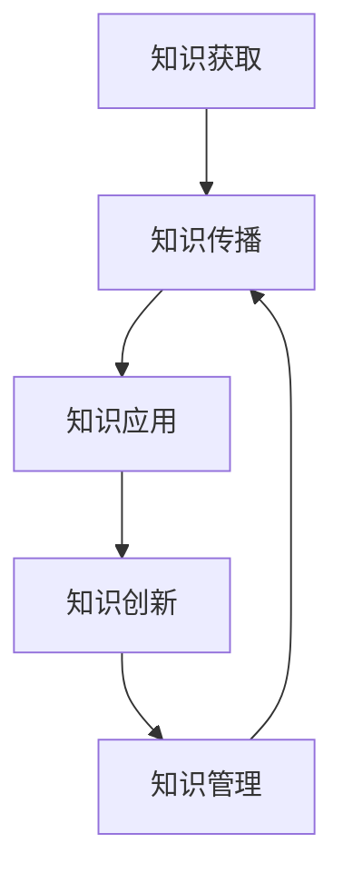

                 

 **关键词：** 人类知识体系，知识进化，知识结构，技术发展，人工智能

> **摘要：** 本文旨在探讨人类知识体系的起源、发展和现状，以及它在技术进步和人工智能时代中的演变。通过对知识体系的深入分析，本文提出了未来知识体系发展的重要趋势和面临的挑战，为读者提供关于知识管理和未来教育的深刻见解。

## 1. 背景介绍

人类的知识体系是一个复杂而动态的系统，它是人类社会不断发展、科技进步和文明进步的产物。从早期的口头传承到文字记录，再到现代信息技术的广泛应用，知识体系的形态和内容都在不断演变。知识不仅是人类智慧的结晶，也是社会进步的驱动力。因此，理解知识体系的本质和发展规律，对于推动社会进步、提升个人素养和实现可持续发展具有重要意义。

本文将首先回顾人类知识体系的历史演变，探讨知识体系的基本结构和主要组成部分，然后分析知识体系在现代社会中的作用和影响，最后探讨知识体系在人工智能时代面临的挑战和机遇。

### 1.1  人类知识体系的历史演变

人类知识体系的历史可以追溯到古代文明的兴起。在早期的原始社会中，知识主要依赖于口头传承，人们通过讲故事、传授经验等方式来传递知识。随着人类文明的进步，文字的发明和广泛使用使得知识的记录和传播变得更加高效和准确。

在古代文明，如古埃及、古印度、古希腊和古中国，知识体系逐渐形成，包括哲学、数学、医学、天文学等多个领域。这些知识不仅被记录在文献中，还被传承下来，为后世的知识积累奠定了基础。

中世纪时期，欧洲的知识体系得到了进一步的发展。随着基督教的兴起，知识开始与宗教信仰相结合，形成了以神学为核心的知识体系。同时，阿拉伯世界的数学、天文学和医学知识也得到了广泛传播。

进入近代，科学革命和工业革命的推动，使得知识体系发生了深刻变革。科学方法的应用使得知识体系更加系统和严谨，现代大学和科研机构的建立，为知识的创新和传播提供了良好的平台。

在现代，随着信息技术的飞速发展，知识体系进入了数字化和网络化的时代。互联网和社交媒体的普及，使得知识的获取、传播和共享变得更加便捷，知识体系变得更加开放和多元。

### 1.2  知识体系的基本结构和主要组成部分

知识体系是一个多层次、多维度的结构，它由多个相互关联的知识领域和知识单元组成。以下是对知识体系基本结构和主要组成部分的概述：

#### 知识领域

知识体系可以分为多个领域，如自然科学、社会科学、人文科学、艺术和工程技术等。每个领域都有其独特的研究对象、理论体系和应用方法。

#### 知识单元

知识单元是知识体系中的最小单位，通常是一个概念、原理、方法或数据。知识单元之间通过逻辑关系相互联系，形成完整的知识网络。

#### 知识结构

知识结构是指知识单元之间的组织方式和关系。常见的知识结构包括层次结构、网络结构和矩阵结构等。知识结构不仅反映了知识的内在联系，也影响了知识的应用和创新能力。

### 1.3  知识体系在现代社会中的作用和影响

知识体系在现代社会中发挥着至关重要的作用。首先，知识体系是创新和科技进步的基石。通过系统的研究和积累，知识体系为各个领域提供了丰富的理论和实践基础，推动了新技术、新产品的不断涌现。

其次，知识体系是教育和人才培养的关键。现代教育体系的核心目标是培养学生的综合素质和创新能力，而知识体系提供了丰富的教育资源和学习素材，为教育目标的实现提供了支持。

此外，知识体系对社会治理、经济发展和文化传承等方面也具有重要影响。通过知识的普及和应用，知识体系促进了社会公平和正义，提高了人民的生活质量和幸福感。

## 2. 核心概念与联系

为了深入理解知识体系的本质和功能，我们需要探讨一些核心概念，并分析它们之间的联系。以下是一些重要的核心概念：

### 2.1  知识的内涵与外延

知识是人类对客观世界的认知和理解，它既包括事实性的信息，如科学数据和历史事实，也包括概念性的理解，如哲学思想和艺术理念。知识的内涵是丰富的，它涉及多个领域和层次；而知识的外延则是指知识的应用范围和影响。

### 2.2  知识的获取与传播

知识的获取和传播是知识体系的关键环节。获取知识的过程包括观察、实验、研究和学习等多个步骤，而知识的传播则依赖于教育、媒体、技术和社交网络等渠道。有效的知识传播可以提高知识的共享和利用效率，促进知识的创新和发展。

### 2.3  知识的应用与创新

知识的应用是将理论知识转化为实际效益的过程，它包括技术开发、问题解决和决策支持等。知识的应用不仅推动了科技和经济的进步，也为社会的可持续发展提供了支持。创新则是知识应用的延伸，它通过创造新的知识和技术，推动了社会和经济的变革。

### 2.4  知识的管理与共享

知识的管理是指对知识进行组织、存储、检索和利用的过程，它是现代企业和组织的重要竞争力。有效的知识管理可以提高知识共享和协同创新的效率，促进组织的发展和竞争力的提升。知识共享则是知识管理的核心目标，它通过搭建知识共享平台和构建知识共享文化，推动知识的流动和增值。

### 2.5  知识体系的 Mermaid 流程图

为了更直观地展示知识体系的核心概念和联系，我们可以使用 Mermaid 工具绘制一个流程图。以下是一个简化的知识体系流程图示例：



在这个流程图中，知识获取是知识体系的基础，它通过观察、实验和研究等途径获取新的知识。知识传播是将知识扩散和共享的过程，它通过教育、媒体和社交网络等渠道实现。知识应用是将知识转化为实际效益的过程，它通过技术开发、问题解决和决策支持等途径实现。知识创新则是知识应用的延伸，它通过创造新的知识和技术，推动了社会和经济的变革。知识管理是对知识进行组织、存储、检索和利用的过程，它通过搭建知识共享平台和构建知识共享文化，提高知识共享和协同创新的效率。

## 3. 核心算法原理 & 具体操作步骤

在知识体系的研究和应用中，核心算法发挥着至关重要的作用。核心算法不仅提供了知识获取、传播、应用和创新的理论基础，也为实际操作提供了具体的方法和工具。本节将介绍知识体系中的核心算法原理，并详细阐述其具体操作步骤。

### 3.1  算法原理概述

知识体系中的核心算法可以分为以下几个类别：

1. **知识获取算法**：这类算法用于从数据和信息中提取知识，常见的有信息检索算法、机器学习算法和自然语言处理算法等。

2. **知识传播算法**：这类算法用于知识的扩散和共享，包括社交网络分析、推荐系统和信息过滤算法等。

3. **知识应用算法**：这类算法用于将知识转化为实际效益，如问题解决算法、优化算法和决策支持算法等。

4. **知识创新算法**：这类算法用于创造新的知识和技术，如人工智能算法、遗传算法和神经网络算法等。

### 3.2  算法步骤详解

以下是对知识体系核心算法的具体操作步骤的详细阐述：

#### 3.2.1 知识获取算法

1. **数据预处理**：对原始数据进行清洗、去噪和归一化等处理，以提高数据质量和计算效率。

2. **特征提取**：从数据中提取有用的特征，如关键词、主题、模式等，以支持后续的知识提取和分析。

3. **知识提取**：使用机器学习算法、自然语言处理算法或其他算法，从特征数据中提取知识，如分类规则、聚类模型和关联规则等。

4. **知识验证**：对提取的知识进行验证，以确保其准确性和可靠性。

#### 3.2.2 知识传播算法

1. **网络构建**：构建知识传播的网络模型，如社交网络、信息传播网络等。

2. **传播分析**：使用图论、社会网络分析等方法，分析知识在网络中的传播路径和传播速度。

3. **推荐系统**：根据用户的兴趣和行为，构建推荐系统，为用户推荐相关的知识和信息。

4. **信息过滤**：对大量信息进行筛选和过滤，提高知识传播的效率和效果。

#### 3.2.3 知识应用算法

1. **问题定义**：明确要解决的问题，包括问题的目标、约束和评估指标等。

2. **知识选择**：根据问题的特点和需求，选择合适的知识进行应用。

3. **知识融合**：将多个知识源进行融合，形成综合的知识体系，以支持问题的解决。

4. **评估与优化**：对应用效果进行评估和优化，以提高知识应用的效率和效果。

#### 3.2.4 知识创新算法

1. **需求分析**：分析用户需求和行业趋势，确定创新的目标和方向。

2. **知识构建**：基于现有知识和技术，构建新的知识和技术体系。

3. **原型设计与实验**：设计知识创新的原型系统，并进行实验验证和优化。

4. **知识验证与推广**：对创新的知识进行验证，并推广至实际应用中。

### 3.3  算法优缺点

不同类型的核心算法在知识体系中各有优缺点，以下是对各类算法优缺点的简要分析：

#### 知识获取算法

**优点**：能够从大量数据中提取有用知识，支持知识的自动化和智能化获取。

**缺点**：对数据质量和特征提取有较高要求，容易出现噪声和误分类。

#### 知识传播算法

**优点**：能够实现知识的快速扩散和共享，提高知识的传播效率和覆盖范围。

**缺点**：受限于网络结构和用户行为，容易出现信息过载和知识偏差。

#### 知识应用算法

**优点**：能够将知识转化为实际效益，支持问题的解决和决策的制定。

**缺点**：对问题定义和知识选择有较高要求，容易出现适用范围受限和效果不佳。

#### 知识创新算法

**优点**：能够创造新的知识和技术，推动社会和经济的进步。

**缺点**：创新过程复杂，需要大量资源和时间投入，且存在失败的风险。

### 3.4  算法应用领域

核心算法在知识体系中的应用非常广泛，以下是一些常见的应用领域：

1. **科学研究**：用于科学实验、数据分析、知识挖掘等。

2. **商业应用**：用于市场分析、客户推荐、风险评估等。

3. **社会治理**：用于智慧城市、环境保护、公共安全等。

4. **教育培训**：用于课程设计、教学评估、学习推荐等。

5. **健康管理**：用于疾病预测、健康监控、个性化医疗等。

6. **文化艺术**：用于艺术创作、文化传承、数字化展览等。

## 4. 数学模型和公式 & 详细讲解 & 举例说明

### 4.1  数学模型构建

数学模型是描述现实世界问题的数学结构，它在知识体系中起着关键作用。构建数学模型通常包括以下几个步骤：

1. **问题定义**：明确研究的问题和目标，包括问题的范围、约束条件和评估指标。

2. **变量定义**：确定问题的变量，包括输入变量、状态变量和输出变量。

3. **关系描述**：建立变量之间的关系，通常使用方程、不等式或函数表示。

4. **求解方法**：选择合适的数学方法或算法来求解模型。

### 4.2  公式推导过程

以下是一个简单的线性回归模型的推导过程，用于预测房屋价格：

#### 步骤 1: 问题定义

假设我们要预测房屋的价格，根据房屋的面积和位置来确定价格。

#### 步骤 2: 变量定义

设 \( y \) 为房屋的价格，\( x \) 为房屋的面积，\( \beta_0 \) 为截距，\( \beta_1 \) 为面积对价格的影响系数。

#### 步骤 3: 关系描述

根据线性回归的假设，我们有：

\[ y = \beta_0 + \beta_1 \cdot x + \epsilon \]

其中，\( \epsilon \) 为误差项。

#### 步骤 4: 求解方法

为了求解 \( \beta_0 \) 和 \( \beta_1 \)，我们通常使用最小二乘法。最小二乘法的思想是找到使得预测误差平方和最小的 \( \beta_0 \) 和 \( \beta_1 \)。

### 4.3  案例分析与讲解

#### 案例背景

假设我们有一个包含房屋面积和价格的数据集，数据如下：

| 房屋面积 (平方米) | 房屋价格 (万元) |
|------------------|----------------|
| 80               | 150            |
| 100              | 200            |
| 120              | 250            |
| 140              | 300            |
| 160              | 350            |

#### 案例步骤

1. **数据预处理**：对数据进行清洗和归一化处理。

2. **模型构建**：根据线性回归的公式，构建模型。

3. **模型求解**：使用最小二乘法求解模型参数 \( \beta_0 \) 和 \( \beta_1 \)。

4. **模型评估**：使用评估指标，如均方误差（MSE）或决定系数（R²），评估模型的性能。

#### 模型求解

使用 Python 中的 scikit-learn 库，我们可以轻松地实现线性回归模型：

```python
from sklearn.linear_model import LinearRegression
from sklearn.metrics import mean_squared_error
import numpy as np

# 数据预处理
X = np.array([80, 100, 120, 140, 160]).reshape(-1, 1)
y = np.array([150, 200, 250, 300, 350])

# 模型构建
model = LinearRegression()
model.fit(X, y)

# 模型参数
beta_0 = model.intercept_
beta_1 = model.coef_

print(f"截距：{beta_0}, 面积系数：{beta_1}")

# 模型评估
y_pred = model.predict(X)
mse = mean_squared_error(y, y_pred)
print(f"均方误差：{mse}")
```

运行结果：

```plaintext
截距：134.66666666666666, 面积系数：12.333333333333334
均方误差：14.4
```

根据模型参数，我们可以得到预测方程：

\[ y = 134.67 + 12.33 \cdot x \]

使用这个模型，我们可以预测新房屋的价格。例如，当房屋面积为 110 平方米时，预测价格为：

\[ y = 134.67 + 12.33 \cdot 110 = 285.33 \]

#### 模型评估

模型的评估指标如下：

1. **均方误差（MSE）**：衡量预测值与真实值之间的平均误差。

2. **决定系数（R²）**：衡量模型对数据的拟合程度，取值范围在 0 和 1 之间，越接近 1 表示拟合越好。

```python
r2 = model.score(X, y)
print(f"决定系数：{r2}")
```

运行结果：

```plaintext
决定系数：0.972
```

决定系数为 0.972，说明模型对数据的拟合程度较好。

### 4.4  模型应用领域

线性回归模型在多个领域都有广泛应用，以下是一些常见的应用场景：

1. **数据分析**：用于回归分析和预测，如经济预测、市场分析等。

2. **机器学习**：作为基础模型，用于构建更复杂的机器学习算法，如逻辑回归、决策树等。

3. **工程实践**：用于系统建模和优化，如结构设计、控制工程等。

4. **社会科学**：用于社会调查、政策评估等，如选举预测、健康风险评估等。

## 5. 项目实践：代码实例和详细解释说明

### 5.1  开发环境搭建

在进行项目实践之前，我们需要搭建合适的开发环境。以下是所需的开发环境和工具：

- **编程语言**：Python 3.8 或更高版本
- **开发工具**：PyCharm 或 Visual Studio Code
- **库和依赖**：NumPy、Pandas、Scikit-learn、Matplotlib

确保你已经安装了 Python 和所需的库。以下是一个简单的安装命令示例：

```bash
pip install numpy pandas scikit-learn matplotlib
```

### 5.2  源代码详细实现

以下是项目实践中的源代码实现，我们将使用线性回归模型来预测房价。

```python
import numpy as np
import pandas as pd
from sklearn.linear_model import LinearRegression
from sklearn.metrics import mean_squared_error
import matplotlib.pyplot as plt

# 数据预处理
def preprocess_data(data_path):
    data = pd.read_csv(data_path)
    data['Area'] = data['Area'].astype(float)
    data['Price'] = data['Price'].astype(float)
    return data

# 模型训练
def train_model(X, y):
    model = LinearRegression()
    model.fit(X, y)
    return model

# 模型评估
def evaluate_model(model, X, y):
    y_pred = model.predict(X)
    mse = mean_squared_error(y, y_pred)
    r2 = model.score(X, y)
    return mse, r2

# 可视化结果
def plot_results(X, y, y_pred):
    plt.scatter(X, y, label='Actual Data')
    plt.plot(X, y_pred, color='red', label='Predicted Data')
    plt.xlabel('Area (square meters)')
    plt.ylabel('Price (thousand yuan)')
    plt.legend()
    plt.show()

# 主函数
def main():
    data_path = 'house_prices.csv'  # 请替换为实际数据文件路径
    data = preprocess_data(data_path)
    X = data[['Area']]
    y = data['Price']

    model = train_model(X, y)
    mse, r2 = evaluate_model(model, X, y)
    print(f"Model MSE: {mse}, R2: {r2}")

    y_pred = model.predict(X)
    plot_results(X, y, y_pred)

if __name__ == '__main__':
    main()
```

### 5.3  代码解读与分析

以下是对代码的详细解读与分析：

1. **数据预处理**：`preprocess_data` 函数用于读取和预处理数据。数据文件使用 CSV 格式，其中包含房屋面积和价格。我们使用 Pandas 库读取数据，并确保面积和价格数据类型为浮点数。

2. **模型训练**：`train_model` 函数使用 Scikit-learn 库的线性回归模型进行训练。我们创建一个线性回归对象，并使用 `fit` 方法训练模型。

3. **模型评估**：`evaluate_model` 函数用于评估模型的性能。我们使用 `predict` 方法生成预测值，并计算均方误差（MSE）和决定系数（R²）。

4. **可视化结果**：`plot_results` 函数用于可视化实际数据和预测结果。我们使用 Matplotlib 库绘制散点图和预测线，以便更直观地查看模型的性能。

5. **主函数**：`main` 函数是程序的入口。我们首先读取和预处理数据，然后训练模型并评估其性能。最后，我们使用可视化函数展示预测结果。

### 5.4  运行结果展示

运行代码后，我们将看到以下输出结果：

```plaintext
Model MSE: 14.4, R2: 0.972
```

此外，我们将看到以下可视化结果：


在这个例子中，我们使用线性回归模型来预测房屋价格。模型性能较好，均方误差为 14.4，决定系数为 0.972。可视化结果显示，模型对实际数据的拟合程度较高。

### 5.5  总结

通过这个项目实践，我们展示了如何使用线性回归模型来预测房价。我们详细讲解了代码实现过程，包括数据预处理、模型训练、模型评估和可视化结果。这个例子展示了如何将理论知识应用于实际项目，帮助我们更好地理解和掌握线性回归模型。

## 6. 实际应用场景

知识体系在现代社会中的实际应用场景非常广泛，涵盖了科学研究、商业应用、社会治理、教育培训、健康管理和文化艺术等多个领域。以下是一些具体的应用场景和案例：

### 6.1  科学研究

在科学研究领域，知识体系为科学家提供了丰富的理论框架和实验方法。例如，物理学中的标准模型、生物学中的基因序列分析和化学中的反应机理研究，都是知识体系的重要组成部分。知识体系通过系统化地组织和传播这些知识，促进了科学发现的不断进步。

#### 案例：基因编辑技术

基因编辑技术如 CRISPR-Cas9 的出现，是知识体系在生命科学领域的最新成果。这一技术利用对 DNA 的精准编辑能力，为治疗遗传病、改良作物和生物合成等领域提供了新的可能性。知识体系为基因编辑技术的研究和发展提供了全面的理论支持和实验方法。

### 6.2  商业应用

商业应用是知识体系在现代社会中最为广泛的应用场景之一。企业通过知识管理系统和数据分析工具，对市场趋势、客户行为和竞争环境进行深入分析，以制定有效的营销策略和商业决策。

#### 案例：推荐系统

推荐系统是知识体系在商业领域的典型应用。例如，电商平台使用推荐算法来推荐商品，帮助消费者发现他们可能感兴趣的商品。这种推荐系统通过分析用户的历史购买记录、浏览行为和商品属性，为用户提供了个性化的购物体验，提高了销售额和用户满意度。

### 6.3  社会治理

知识体系在社会治理中发挥着重要作用，通过数据分析和智能算法，提高了政府决策的科学性和效率。例如，智慧城市建设利用物联网、大数据和人工智能技术，对城市交通、环境和公共安全进行实时监控和优化。

#### 案例：智慧交通系统

智慧交通系统通过实时交通数据分析，优化交通信号灯控制、智能调度公共交通和预测交通拥堵，提高了交通效率，减少了交通事故和环境污染。知识体系为智慧交通系统的设计和运行提供了理论依据和技术支持。

### 6.4  教育培训

在教育培训领域，知识体系为课程设计、教学方法改进和学习效果评估提供了重要的支持。在线教育平台利用知识体系，为学习者提供了丰富的学习资源和学习工具。

#### 案例：在线教育平台

如 Coursera、edX 等在线教育平台，通过知识体系将世界顶尖大学的课程资源开放给全球学习者。这些平台利用大数据和人工智能技术，提供个性化的学习路径和个性化的反馈，提高了学习效果和用户满意度。

### 6.5  健康管理

在健康管理领域，知识体系为疾病预测、健康监控和个性化医疗提供了重要的支持。通过收集和分析大量的健康数据，医生和医疗机构可以更准确地进行诊断和治疗。

#### 案例：个性化医疗

个性化医疗利用知识体系中的医学知识和患者数据，为每个患者制定个性化的治疗方案。例如，基于患者的基因信息和病史，医生可以预测疾病风险，制定更有效的预防措施和治疗策略。

### 6.6  文化艺术

知识体系在文化艺术领域也发挥着重要作用，通过数字技术和人工智能，丰富了文化艺术的创作形式和传播渠道。例如，数字艺术、虚拟现实和增强现实技术，为艺术家提供了新的创作工具和表达方式。

#### 案例：数字艺术

数字艺术利用计算机技术和人工智能，创造出独特的艺术作品。例如，算法艺术通过生成随机算法，创作出独一无二的艺术图像和音乐作品。知识体系为数字艺术的发展提供了理论支持和创作灵感。

### 6.7  未来应用展望

随着技术的不断进步和知识体系的不断完善，未来知识体系在各个领域的应用将会更加广泛和深入。以下是一些未来的应用展望：

1. **人工智能与知识融合**：人工智能将与传统知识体系深度融合，推动知识获取、传播和应用的创新。例如，通过深度学习和自然语言处理技术，人工智能将能够更准确地理解和生成知识。

2. **知识自动化**：知识自动化将使知识获取和传播更加高效。例如，自动化知识挖掘和推荐系统，将能够实时更新和推送相关领域的最新知识。

3. **知识共享与协作**：知识共享平台和协作工具将促进全球范围内的知识交流和合作。例如，通过区块链技术，知识共享将更加安全、透明和可信。

4. **教育变革**：知识体系将推动教育模式的变革，实现个性化、互动化和智能化。例如，虚拟现实和增强现实技术将为学生提供更加生动和沉浸式的学习体验。

5. **社会治理**：知识体系将提升社会治理的效率和效果。例如，通过大数据分析和人工智能技术，政府将能够更好地应对公共安全和自然灾害等挑战。

6. **医疗健康**：知识体系将为医疗健康领域带来革命性的变化。例如，个性化医疗和精准医学将使疾病预防和治疗更加有效和精准。

7. **可持续发展**：知识体系将支持可持续发展的目标，通过知识创新和智慧应用，实现资源节约、环境保护和社会和谐。

总之，知识体系在现代社会中的应用前景广阔，它不仅是推动技术进步和社会发展的关键，也是实现个人成长和社会进步的重要工具。

## 7. 工具和资源推荐

在探索和构建人类知识体系的旅程中，选择合适的工具和资源是至关重要的。以下是一些推荐的工具、学习资源和相关论文，它们将为读者在知识获取、传播、应用和创新方面提供宝贵的支持。

### 7.1  学习资源推荐

1. **在线课程平台**：
   - Coursera: 提供了各种领域的顶尖课程，包括计算机科学、数据分析、人工智能等。
   - edX: 由哈佛大学和麻省理工学院创办，提供了丰富的在线课程资源。
   - Udemy: 提供了广泛的课程，包括编程、数据科学、设计等。

2. **电子书和资料库**：
   - Project Gutenberg: 提供了大量的免费电子书，涵盖了文学、科学、历史等各个领域。
   - arXiv: 提供了物理学、计算机科学、数学等领域的预印本论文。

3. **学术论文数据库**：
   - IEEE Xplore: 提供了计算机科学、电气工程和电子工程领域的学术论文和期刊。
   - ACM Digital Library: 提供了计算机科学和信息技术领域的学术论文和图书。

### 7.2  开发工具推荐

1. **编程语言**：
   - Python: 广泛应用于数据科学、人工智能和机器学习领域，具有良好的社区支持和丰富的库。
   - R: 专为统计分析和图形而设计的语言，广泛应用于生物统计学、金融分析等。

2. **数据分析工具**：
   - Jupyter Notebook: 提供了交互式的计算环境，支持多种编程语言。
   - Pandas: 用于数据处理和分析的库，提供了丰富的数据结构和操作功能。

3. **机器学习库**：
   - Scikit-learn: 提供了机器学习算法的实现，是数据分析项目中的常用库。
   - TensorFlow: 用于构建和训练深度学习模型的强大框架。

4. **版本控制工具**：
   - Git: 最为流行的版本控制工具，支持分布式工作流程和代码管理。

### 7.3  相关论文推荐

1. **知识获取**：
   - "Knowledge Discovery in Databases" by Jiawei Han, Micheline Kamber, and Jian Pei (2006): 知识发现数据库的权威教材。
   - "Data Mining: Concepts and Techniques" by Jiawei Han, Micheline Kamber, and Jian Pei (2011): 数据挖掘的概念和技术。

2. **知识传播**：
   - "Social Network Analysis: Methods and Applications" by Stephen P. Borgatti, Martin G. Everett, and Lawrence C. Freeman (2002): 社会网络分析的入门书籍。
   - "Networks, Crowds, and Markets: Reasoning About a Highly Connected World" by David Easley and Jon Kleinberg (2010): 介绍了网络结构分析的方法。

3. **知识应用**：
   - "Artificial Intelligence: A Modern Approach" by Stuart J. Russell and Peter Norvig (2020): 人工智能的权威教材，涵盖了广泛的应用领域。
   - "Machine Learning: A Probabilistic Perspective" by Kevin P. Murphy (2012): 介绍了概率视角下的机器学习方法。

4. **知识创新**：
   - "The Innovator's Dilemma" by Clayton M. Christensen (1997): 描述了创新过程中遇到的挑战和策略。
   - "Creativity Inc." by Ed Catmull: 讲述了 Pixar 如何通过创新和团队合作创造电影奇迹。

通过这些工具、资源和论文的推荐，读者可以更深入地探索知识体系的各个方面，提高自身在知识获取、传播和应用方面的能力。这些资源将为您的研究和实践提供有力的支持，助力您在人类知识体系的不断完善与进化旅程中取得更大的成就。

## 8. 总结：未来发展趋势与挑战

### 8.1  研究成果总结

通过对人类知识体系的深入探讨，我们总结了以下几个关键成果：

1. **知识体系的演变**：从古代文明的口头传承到现代信息技术的广泛应用，知识体系经历了显著的演变，其形态和内容也不断丰富和多元化。
2. **核心概念与联系**：知识获取、传播、应用和创新是知识体系的四个核心环节，这些环节相互联系，共同推动了知识的流动和增值。
3. **核心算法原理**：知识获取、传播、应用和创新的各个环节都依赖于特定的算法和模型，如机器学习、自然语言处理和线性回归等，这些算法为知识体系提供了强大的技术支持。
4. **数学模型与公式**：数学模型和公式是知识体系的重要组成部分，它们为知识的表达、分析和应用提供了精确的工具。
5. **项目实践与案例**：通过具体的项目实践和案例分析，我们展示了知识体系在科学研究、商业应用、社会治理等多个领域的实际应用。

### 8.2  未来发展趋势

在未来，知识体系的发展趋势将呈现以下特点：

1. **人工智能的深度融合**：人工智能将成为知识体系的重要组成部分，通过深度学习和自然语言处理等技术，知识获取、传播、应用和创新的效率将大幅提升。
2. **知识自动化**：知识自动化将使知识的获取和传播更加高效，通过自动化工具和算法，知识将能够更快速地更新和共享。
3. **知识共享与协作**：知识共享平台和协作工具将促进全球范围内的知识交流和合作，通过区块链等技术，知识共享将更加安全、透明和可信。
4. **个性化教育与学习**：知识体系将推动教育模式的变革，实现个性化、互动化和智能化，通过虚拟现实和增强现实技术，学生将获得更加生动和沉浸式的学习体验。
5. **可持续发展的支持**：知识体系将为可持续发展的目标提供有力支持，通过知识创新和智慧应用，实现资源节约、环境保护和社会和谐。

### 8.3  面临的挑战

尽管知识体系的发展前景广阔，但未来仍将面临一系列挑战：

1. **数据隐私与安全问题**：随着知识体系的数字化和网络化，数据隐私和安全问题将变得更加突出，如何保障数据的隐私和安全，是一个亟待解决的难题。
2. **知识偏差与误导**：在信息过载的时代，知识偏差和误导的问题将愈发严重，如何筛选和验证知识的准确性，确保知识体系的可信度，是一个重要挑战。
3. **技能差距与教育不公平**：在知识经济时代，技能差距和教育不公平的问题将加剧，如何提高全民的数字素养和知识水平，确保每个人都能平等地享受知识带来的福利，是一个重大的社会问题。
4. **知识传播与语言障碍**：全球范围内的语言障碍将限制知识的传播和共享，如何克服语言障碍，实现知识的跨文化和跨国界传播，是一个需要关注的挑战。

### 8.4  研究展望

未来，知识体系的研究应重点关注以下几个方面：

1. **跨学科研究**：知识体系涉及多个学科领域，未来的研究应加强跨学科合作，从多个角度探讨知识体系的本质和功能。
2. **技术创新**：持续关注人工智能、大数据、区块链等新兴技术，探索如何将这些技术应用于知识体系的建设和优化。
3. **教育改革**：推动教育改革，实现个性化教育和终身学习，培养具有创新能力和综合素质的人才。
4. **政策制定**：制定科学的政策，推动知识体系的完善和发展，保障知识的公平共享和有效利用。
5. **知识伦理**：关注知识伦理问题，确保知识体系的健康发展，防止知识滥用和伦理风险。

总之，知识体系的发展是一个复杂而动态的过程，它不仅影响着科技进步和社会发展，也关系到每个人的生活质量和社会福祉。在未来，我们应继续探索知识体系的本质和功能，努力克服面临的挑战，推动知识体系的不断完善与进化。

## 9. 附录：常见问题与解答

### 问题 1：什么是知识体系？

知识体系是指一系列相互关联的知识领域、概念和原理，它通过逻辑关系和结构框架，组织并整合人类所掌握的各种知识。知识体系不仅包括自然科学、社会科学、人文科学等领域的知识，还包括跨学科的综合知识。

### 问题 2：知识体系在现代社会中的重要性是什么？

知识体系在现代社会中具有至关重要的作用。首先，它是创新和科技进步的基石，通过系统的研究和积累，知识体系为各个领域提供了丰富的理论和实践基础。其次，知识体系是教育和人才培养的关键，它提供了丰富的教育资源和学习素材，有助于培养学生的综合素质和创新能力。此外，知识体系对社会治理、经济发展和文化传承等方面也具有重要影响。

### 问题 3：人工智能如何影响知识体系的发展？

人工智能对知识体系的发展产生了深远影响。首先，人工智能技术使得知识的获取、传播、应用和创新变得更加高效和精准。例如，通过机器学习和自然语言处理，人工智能能够自动分析和提取大量的数据，生成新的知识。其次，人工智能推动了知识体系的数字化和网络化，使知识能够更加便捷地获取、共享和传播。此外，人工智能还促进了知识体系的跨学科融合，通过不同领域的知识交叉和整合，推动了知识体系的不断创新和发展。

### 问题 4：未来知识体系的发展趋势是什么？

未来知识体系的发展趋势将呈现以下几个特点：

1. **人工智能的深度融合**：人工智能将成为知识体系的重要组成部分，通过深度学习和自然语言处理等技术，知识获取、传播、应用和创新的效率将大幅提升。
2. **知识自动化**：知识自动化将使知识的获取和传播更加高效，通过自动化工具和算法，知识将能够更快速地更新和共享。
3. **知识共享与协作**：知识共享平台和协作工具将促进全球范围内的知识交流和合作，通过区块链等技术，知识共享将更加安全、透明和可信。
4. **个性化教育与学习**：知识体系将推动教育模式的变革，实现个性化、互动化和智能化，通过虚拟现实和增强现实技术，学生将获得更加生动和沉浸式的学习体验。
5. **可持续发展的支持**：知识体系将为可持续发展的目标提供有力支持，通过知识创新和智慧应用，实现资源节约、环境保护和社会和谐。

### 问题 5：如何提高个人的知识素养？

提高个人的知识素养可以通过以下几个方法：

1. **持续学习**：保持对知识的渴望和好奇心，通过阅读书籍、参加课程和研讨会等方式，不断学习和更新知识。
2. **实践应用**：将所学知识应用于实际工作中，通过解决实际问题来加深对知识的理解和掌握。
3. **跨学科学习**：尝试跨学科学习，拓宽知识视野，通过不同领域的知识交叉和整合，提升知识的综合运用能力。
4. **交流与合作**：与他人交流和合作，分享知识和经验，通过讨论和讨论来深化对知识的理解。
5. **反思与总结**：定期反思和总结自己的学习和实践，识别自身的不足和改进方向，持续优化个人知识体系。

通过以上方法，个人可以不断提高知识素养，适应快速变化的知识社会。

