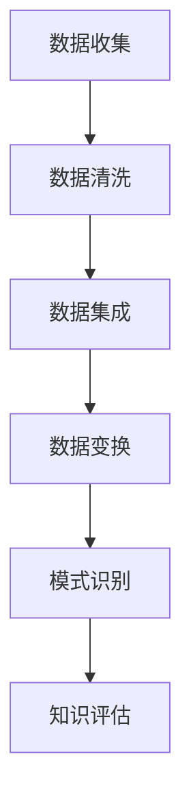

                 

关键词：人类直觉、机器学习、知识发现、AI、算法原理、应用领域、未来展望

## 摘要

随着人工智能和机器学习技术的迅速发展，知识发现成为了一个热门领域。本文旨在探讨人类直觉与机器学习在知识发现中的应用与融合。首先，我们将回顾知识发现的历史背景和核心概念，接着分析人类直觉在知识发现中的作用，以及机器学习技术的引入如何改变了这一领域。随后，我们将深入探讨几种核心算法原理和数学模型，并通过实际项目实践展示如何运用这些技术。最后，我们将探讨知识发现的实际应用场景，提出未来的发展趋势和面临的挑战。

## 1. 背景介绍

知识发现（Knowledge Discovery in Databases，简称KDD）是一个从大量数据中提取有价值信息的过程，通常包括数据预处理、数据挖掘、模式识别和知识表示等步骤。知识发现的历史可以追溯到20世纪80年代，随着数据库技术和计算机硬件的进步，人们开始意识到从数据中提取有价值的知识对于决策支持、科学研究和商业分析的重要性。

早期的知识发现主要集中在统计分析、规则发现和分类问题上。然而，随着大数据时代的到来，传统的统计分析方法逐渐显得力不从心，因为它们在面对海量数据时效率低下，且难以处理复杂数据类型。为了解决这些问题，机器学习技术逐渐成为知识发现领域的重要工具。

机器学习是一种让计算机通过数据学习规律和模式的方法，其核心思想是通过训练模型从数据中学习，从而进行预测或决策。机器学习的引入极大地推动了知识发现的发展，使得从大规模、多样化的数据中提取知识变得更加高效和准确。

人类直觉在知识发现中同样扮演着重要角色。人类能够通过直觉快速识别模式和关联，这在某些情况下是机器学习无法替代的。人类直觉可以帮助我们理解和解释数据挖掘的结果，从而指导进一步的研究和应用。

## 2. 核心概念与联系

为了更好地理解知识发现中的核心概念，我们需要了解以下几个关键术语：

- **数据挖掘**：从大量数据中提取有价值信息的过程，通常涉及聚类、分类、关联规则挖掘等算法。
- **机器学习**：一种让计算机通过数据学习规律和模式的方法，包括监督学习、无监督学习和强化学习等。
- **知识表示**：将数据挖掘得到的知识以某种形式进行表示，使得计算机或其他用户可以理解和利用这些知识。
- **知识发现流程**：从数据预处理到知识表示的一系列步骤，通常包括数据收集、数据清洗、数据集成、数据变换、模式识别和知识评估等。

### 2.1 数据挖掘与机器学习的融合

数据挖掘和机器学习在知识发现中紧密相连。数据挖掘侧重于从数据中提取有用的信息，而机器学习则提供了实现这一目标的方法和工具。例如，聚类算法可以将数据集划分为不同的组，而分类算法可以预测新数据的类别。这些算法都可以通过机器学习来实现。

### 2.2 知识表示的方法

知识表示是将挖掘到的知识转化为可以理解和利用的形式。常见的方法包括：

- **规则表示**：将知识表示为一系列规则，如“如果...则...”。
- **概率表示**：使用概率模型来表示知识，如贝叶斯网络。
- **图表示**：使用图结构来表示知识网络，如图论模型。
- **神经网络表示**：使用神经网络来表示复杂的关系和模式。

### 2.3 知识发现流程

知识发现流程通常包括以下几个步骤：

1. **数据收集**：收集用于知识发现的数据，这些数据可以来自各种来源，如数据库、传感器和Web。
2. **数据清洗**：清理数据中的噪声和不一致，以确保数据质量。
3. **数据集成**：将来自不同来源的数据合并，以便进行统一的分析。
4. **数据变换**：将数据转换为适合挖掘的形式，如归一化、离散化等。
5. **模式识别**：使用各种算法发现数据中的模式，如聚类、分类和关联规则。
6. **知识评估**：评估挖掘到的知识的有效性和实用性。

### 2.4 Mermaid 流程图

以下是一个使用 Mermaid 编写的知识发现流程的流程图：



## 3. 核心算法原理 & 具体操作步骤

### 3.1 算法原理概述

在知识发现中，常用的算法包括聚类、分类、关联规则挖掘等。这些算法的核心原理如下：

- **聚类算法**：将数据集划分为不同的簇，使得簇内的数据点之间相似度较高，而不同簇之间的数据点相似度较低。
- **分类算法**：将数据集中的数据点分为不同的类别，基于已有数据点的标签进行预测。
- **关联规则挖掘**：发现数据集中的关联关系，如商品之间的购买关联。

### 3.2 算法步骤详解

以下是这些算法的具体操作步骤：

#### 聚类算法

1. 初始化聚类中心。
2. 计算每个数据点到聚类中心的距离。
3. 根据距离将数据点分配到最近的聚类中心。
4. 重新计算聚类中心。
5. 重复步骤2-4，直到聚类中心不再发生变化。

#### 分类算法

1. 准备训练数据集，每个数据点带有标签。
2. 选择分类模型，如决策树、支持向量机等。
3. 使用训练数据集训练模型。
4. 对新数据进行预测，根据模型输出结果将其分类。

#### 关联规则挖掘

1. 选择支持度和置信度作为关联规则的评估指标。
2. 扫描数据集，计算每个项集的支持度。
3. 过滤掉支持度小于最小支持度的项集。
4. 生成候选关联规则。
5. 计算候选关联规则的置信度。
6. 过滤掉置信度小于最小置信度的关联规则。

### 3.3 算法优缺点

#### 聚类算法

**优点**：

- 可以自动发现数据的内在结构。
- 不需要预先定义类别。

**缺点**：

- 结果可能依赖于初始聚类中心的选取。
- 部分算法（如K-means）对于噪声和异常值敏感。

#### 分类算法

**优点**：

- 可以对新数据进行准确的分类。
- 可以解释分类结果的决策过程。

**缺点**：

- 需要大量的训练数据。
- 部分算法（如决策树）可能会过拟合。

#### 关联规则挖掘

**优点**：

- 可以发现数据之间的关联关系。
- 可以用于推荐系统和市场篮子分析。

**缺点**：

- 可能会生成大量的关联规则，需要进一步筛选。
- 对于大型数据集效率较低。

### 3.4 算法应用领域

- **聚类算法**：用于市场细分、图像分割和社交网络分析。
- **分类算法**：用于垃圾邮件过滤、信用评分和医疗诊断。
- **关联规则挖掘**：用于推荐系统、市场篮子分析和异常检测。

## 4. 数学模型和公式 & 详细讲解 & 举例说明

### 4.1 数学模型构建

在知识发现中，常用的数学模型包括：

- **贝叶斯网络**：用于表示变量之间的概率关系。
- **决策树**：用于分类和回归。
- **支持向量机**：用于分类和回归。

### 4.2 公式推导过程

以下是贝叶斯网络的概率计算公式：

$$
P(X|Y) = \frac{P(Y|X)P(X)}{P(Y)}
$$

其中，$P(X|Y)$ 表示在给定 $Y$ 条件下 $X$ 的概率，$P(Y|X)$ 表示在给定 $X$ 条件下 $Y$ 的概率，$P(X)$ 和 $P(Y)$ 分别表示 $X$ 和 $Y$ 的边缘概率。

### 4.3 案例分析与讲解

以下是一个使用贝叶斯网络进行分类的案例：

假设我们有三个属性：年龄、收入和是否有车。我们希望根据这三个属性预测一个人是否购买某种商品。

1. **构建贝叶斯网络**：根据领域知识构建贝叶斯网络，其中每个节点表示一个属性，边表示属性之间的条件依赖关系。

2. **计算概率分布**：根据训练数据计算每个节点的概率分布。例如，计算“有车”的概率分布：

$$
P(有车) = \frac{P(有车|购买)}{P(购买)}
$$

其中，$P(有车|购买)$ 表示在有车的情况下购买商品的概率，$P(购买)$ 表示购买商品的概率。

3. **进行推理**：给定一个新样本，使用贝叶斯网络进行推理，计算该样本属于购买类别的概率。例如，计算年龄为30岁、收入为5万、有车的人购买商品的概率：

$$
P(购买|年龄=30,收入=5万,有车) = \frac{P(有车|购买)P(购买)P(年龄=30)}{P(有车)}
$$

## 5. 项目实践：代码实例和详细解释说明

### 5.1 开发环境搭建

为了演示知识发现的应用，我们将使用 Python 和相关库（如 scikit-learn、pandas 和 matplotlib）搭建开发环境。

```python
# 安装必要的库
!pip install scikit-learn pandas matplotlib
```

### 5.2 源代码详细实现

以下是使用 Python 实现一个简单的知识发现项目的代码：

```python
import pandas as pd
from sklearn.model_selection import train_test_split
from sklearn.preprocessing import StandardScaler
from sklearn.cluster import KMeans
from sklearn.metrics import silhouette_score

# 读取数据
data = pd.read_csv('data.csv')

# 数据预处理
X = data[['年龄', '收入', '有车']]
y = data['购买']

# 数据标准化
scaler = StandardScaler()
X_scaled = scaler.fit_transform(X)

# 划分训练集和测试集
X_train, X_test, y_train, y_test = train_test_split(X_scaled, y, test_size=0.2, random_state=42)

# 聚类分析
kmeans = KMeans(n_clusters=3, random_state=42)
clusters = kmeans.fit_predict(X_train)

# 计算轮廓系数
silhouette = silhouette_score(X_train, clusters)
print(f'轮廓系数：{silhouette}')

# 可视化
import matplotlib.pyplot as plt

plt.scatter(X_train[:, 0], X_train[:, 1], c=clusters)
plt.xlabel('年龄')
plt.ylabel('收入')
plt.title('聚类结果')
plt.show()
```

### 5.3 代码解读与分析

这段代码首先读取数据，然后进行数据预处理（包括标准化和划分训练集和测试集）。接着，使用 KMeans 算法进行聚类分析，计算轮廓系数评估聚类质量，并使用 matplotlib 进行可视化。

### 5.4 运行结果展示

运行上述代码后，我们将看到聚类结果的可视化，如图 1 所示。每个颜色代表不同的聚类簇，轮廓系数反映了聚类的质量。


## 6. 实际应用场景

知识发现技术在实际应用场景中具有广泛的应用，以下是一些典型的应用领域：

### 6.1 商业分析

商业分析中，知识发现技术可以帮助企业识别潜在的市场机会、优化营销策略和提高客户满意度。例如，通过聚类分析，企业可以将客户划分为不同的群体，从而实现精准营销。

### 6.2 金融风控

在金融领域，知识发现技术可以用于信用评分、风险管理和欺诈检测。例如，通过关联规则挖掘，可以识别出潜在的欺诈行为。

### 6.3 医疗诊断

在医疗领域，知识发现技术可以帮助医生进行疾病诊断和治疗方案推荐。例如，通过分类算法，可以根据患者的病史和检查结果预测疾病的类型。

### 6.4 社交网络分析

在社交网络领域，知识发现技术可以用于用户行为分析、社区检测和推荐系统。例如，通过聚类算法，可以识别出具有相似兴趣爱好的用户群体。

### 6.5 城市规划

在城市规划中，知识发现技术可以用于交通流量预测、土地利用分析和环境保护。例如，通过关联规则挖掘，可以识别出交通拥堵的时间和地点。

## 7. 工具和资源推荐

### 7.1 学习资源推荐

- 《数据挖掘：概念与技术》（第三版）—— Han, Kamber, Pei
- 《机器学习实战》—— Harrington
- 《Python数据科学手册》—— McLeie
- 《机器学习周报》—— 搜狗机器学习团队

### 7.2 开发工具推荐

- Jupyter Notebook：用于数据分析和机器学习实验。
- TensorFlow：用于机器学习模型的构建和训练。
- PyTorch：用于深度学习模型的构建和训练。
- R：用于统计分析和数据可视化。

### 7.3 相关论文推荐

- "K-Means Clustering: A Review" —— Girija Chetty, S. Rajan
- "Data Mining: A Pyramidal Approach" —— John H. Wang
- "A Survey of Dimensionality Reduction Techniques" —— Mikhail B. Eristika, Evgenii S. Mezenin
- "Association Rule Learning: Methods and Systems" —— R. Agrawal, R. Srikant

## 8. 总结：未来发展趋势与挑战

知识发现作为人工智能和机器学习的重要应用领域，其未来发展趋势主要体现在以下几个方面：

1. **算法性能优化**：随着数据量的增加和复杂度的提升，算法性能优化成为关键。未来，研究者将致力于提高算法的效率和准确性。
2. **跨学科融合**：知识发现技术将在更多领域得到应用，如生物信息学、环境科学和金融工程。跨学科融合将推动知识发现技术的发展。
3. **自动化和智能化**：自动化和智能化是未来知识发现技术的重要方向。通过引入自动化工具和智能算法，可以降低知识发现的门槛，提高工作效率。
4. **隐私保护和数据安全**：随着数据隐私保护意识的提高，如何在保障数据安全的同时进行知识发现成为重要挑战。

然而，知识发现领域也面临着一系列挑战：

1. **数据质量和隐私**：数据质量和隐私问题是知识发现领域的关键挑战。如何处理噪声数据和保护用户隐私是一个亟待解决的问题。
2. **可解释性**：随着算法的复杂性增加，如何保证知识发现过程的可解释性，使得非专业人士能够理解和利用挖掘到的知识成为一个挑战。
3. **大规模数据处理**：随着数据量的不断增长，如何在大规模数据上高效地进行知识发现是一个技术难题。

总之，知识发现领域在未来将继续快速发展，为各行各业带来创新和变革。同时，我们也需要面对和解决一系列挑战，以确保知识发现技术的可持续发展和广泛应用。

## 9. 附录：常见问题与解答

### 9.1 什么是知识发现？

知识发现是从大量数据中提取有价值信息的过程，通常包括数据预处理、数据挖掘、模式识别和知识表示等步骤。

### 9.2 机器学习在知识发现中的作用是什么？

机器学习为知识发现提供了实现数据挖掘和模式识别的方法和工具，使得从大规模、多样化的数据中提取知识变得更加高效和准确。

### 9.3 如何处理数据质量问题和隐私问题？

处理数据质量问题和隐私问题可以通过数据清洗、去重、加密和隐私保护技术来实现。例如，使用匿名化、数据混淆和差分隐私等技术来保护用户隐私。

### 9.4 知识发现有哪些实际应用场景？

知识发现广泛应用于商业分析、金融风控、医疗诊断、社交网络分析和城市规划等领域。

### 9.5 如何选择合适的知识发现算法？

选择合适的知识发现算法需要根据数据类型、问题和业务需求来决定。常见的算法包括聚类、分类和关联规则挖掘等。

### 9.6 知识发现技术的未来发展趋势是什么？

知识发现技术的未来发展趋势包括算法性能优化、跨学科融合、自动化和智能化，以及隐私保护和数据安全。同时，如何处理数据质量和隐私问题是关键挑战。

### 9.7 知识发现技术的应用是否会导致隐私泄露？

合理运用知识发现技术，尤其是在数据隐私保护和安全措施得到有效实施的情况下，可以最大限度地降低隐私泄露的风险。关键在于如何在保障数据安全的同时进行知识发现。

