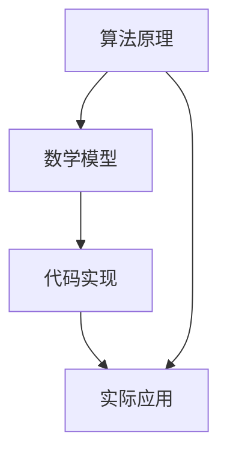
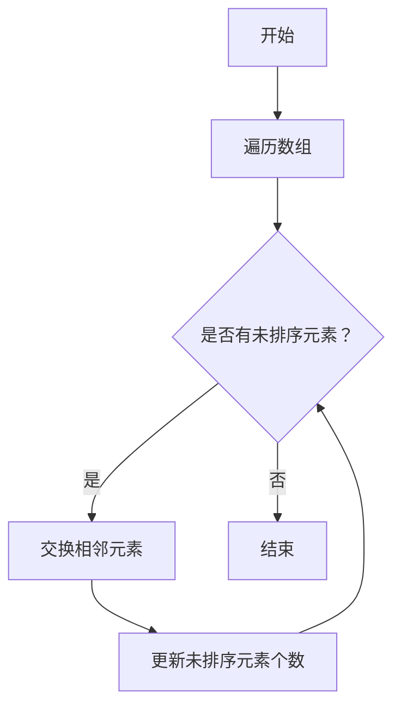
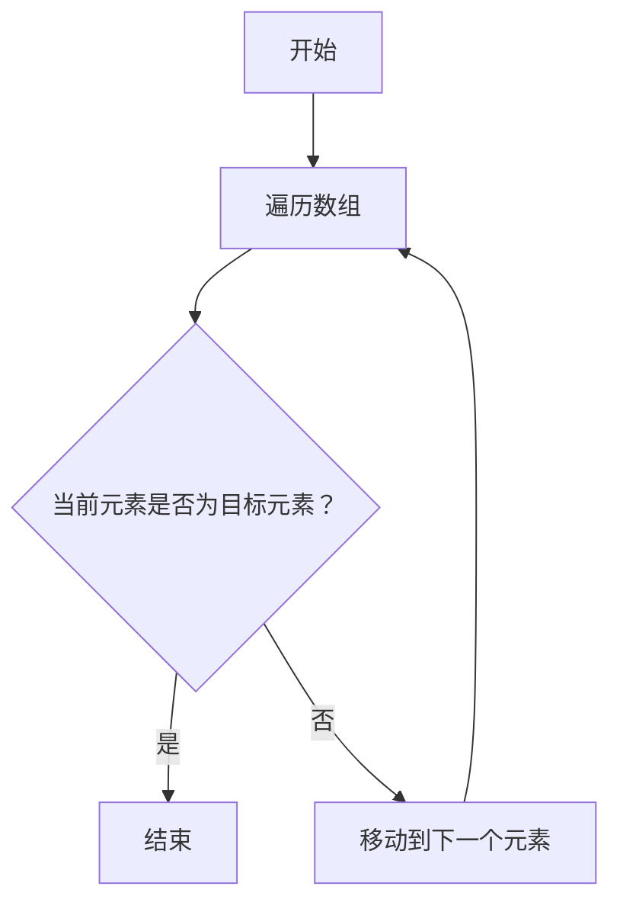
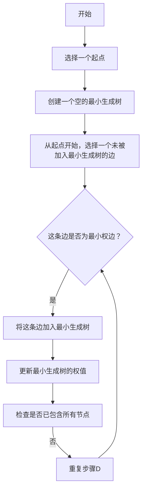

                 

关键词：知识传承、技术发展、历代程序员、算法原理、数学模型、代码实现、实际应用

> 摘要：本文将探讨人类知识传承的过程，特别是技术领域内一代代人的努力与贡献。从古代的计算方法到现代的计算机编程，人类不断积累和传递着宝贵的知识财富。本文将通过分析历代程序员的工作，探讨算法原理、数学模型、代码实现以及实际应用，展现人类知识传承的接力长跑。

## 1. 背景介绍

人类的知识传承是一个漫长而复杂的过程。从最早的口头传授，到后来的文字记载，再到现代的数字化存储，知识的传递方式在不断进步。在技术领域，知识传承尤为关键，因为它涉及到创新、发展和应用。每一代程序员都在前人的基础上不断探索和突破，推动了技术的进步。

本文将重点关注计算机编程领域的知识传承。从最早的计算机硬件设计，到现代的软件开发，每一代程序员都留下了宝贵的经验和智慧。通过分析这些知识和经验，我们可以更好地理解技术的演变过程，并为未来的发展做好准备。

## 2. 核心概念与联系

在计算机编程领域，有许多核心概念和联系值得探讨。以下是几个重要的概念和它们之间的联系：

### 2.1 算法原理

算法是计算机编程的核心，它定义了解决问题的步骤和规则。算法可以分为不同的类型，如排序算法、搜索算法、图形算法等。这些算法之间有着密切的联系，例如，排序算法可以用于搜索算法中的预处理步骤。

### 2.2 数学模型

数学模型是计算机编程的基础，它通过数学公式和方程来描述问题。在算法设计中，数学模型可以帮助我们理解问题的本质，并找到高效的解决方案。常见的数学模型包括图论模型、概率模型、线性规划模型等。

### 2.3 代码实现

代码实现是将算法和数学模型转化为计算机程序的过程。它涉及到编程语言的选择、数据结构的运用和算法的优化。一个优秀的代码实现不仅能够高效地解决问题，还能够提高程序的可靠性和可维护性。

### 2.4 实际应用

实际应用是将计算机程序应用于实际问题中的过程。它包括软件开发、系统架构、网络安全等多个方面。实际应用不仅能够验证算法的有效性，还能够推动技术的创新和发展。

### 2.5 Mermaid 流程图

以下是一个简单的 Mermaid 流程图，展示了这些核心概念之间的联系：



## 3. 核心算法原理 & 具体操作步骤

### 3.1 算法原理概述

在计算机编程中，算法原理是解决问题的关键。以下是一些常见的算法原理及其概述：

#### 排序算法

排序算法是将一组数据按照特定顺序排列的算法。常见的排序算法包括冒泡排序、选择排序、插入排序、快速排序等。每种排序算法都有其特定的原理和适用场景。

#### 搜索算法

搜索算法是在数据结构中查找特定元素的算法。常见的搜索算法包括线性搜索、二分搜索、广度优先搜索、深度优先搜索等。这些算法在数据处理和分析中有着广泛的应用。

#### 图形算法

图形算法是处理图形和几何问题的算法。常见的图形算法包括最小生成树算法、最短路径算法、最小权匹配算法等。这些算法在计算机图形学、网络设计和地理信息系统等领域具有重要应用。

### 3.2 算法步骤详解

以下是几种常见算法的具体步骤详解：

#### 冒泡排序

冒泡排序是一种简单的排序算法。它重复地遍历要排序的数列，比较每对相邻的元素，并将不满足排序要求的一对元素交换。遍历数列的工作是重复地进行，直到没有再需要交换的元素为止。



#### 线性搜索

线性搜索是从数组的第一个元素开始，依次比较每个元素，直到找到目标元素或到达数组的末尾。线性搜索的时间复杂度是 O(n)，即搜索过程可能需要遍历整个数组。



#### 最小生成树算法

最小生成树算法用于在一个无向图中找到一个包含所有节点的最小权生成树。常见的最小生成树算法包括 Prim 算法和 Kruskal 算法。以下是一个简化的 Prim 算法步骤：



### 3.3 算法优缺点

每种算法都有其优缺点，以下是一些常见算法的优缺点：

#### 冒泡排序

- 优点：实现简单，易于理解。
- 缺点：时间复杂度较高，不适合大数据集。

#### 线性搜索

- 优点：实现简单，适用于小数据集。
- 缺点：时间复杂度较高，不适合大数据集。

#### 最小生成树算法

- 优点：可以有效地找到最小生成树。
- 缺点：算法复杂，对大数据集的计算性能有较大影响。

### 3.4 算法应用领域

算法在计算机编程的各个领域都有广泛的应用。以下是一些常见算法的应用领域：

#### 排序算法

- 应用领域：数据库排序、文件排序、数据处理等。
- 实例：SQL 中的排序语句、Python 中的 sort 方法。

#### 搜索算法

- 应用领域：搜索引擎、社交网络、推荐系统等。
- 实例：搜索引擎中的关键词匹配、推荐系统中的协同过滤。

#### 图形算法

- 应用领域：计算机图形学、网络设计、地理信息系统等。
- 实例：地图绘制、网络拓扑分析、地理信息系统中的路径规划。

## 4. 数学模型和公式 & 详细讲解 & 举例说明

在计算机编程中，数学模型和公式是理解算法原理和进行代码实现的重要工具。以下是一些常用的数学模型和公式的详细讲解和举例说明。

### 4.1 数学模型构建

数学模型构建是计算机编程的基础。以下是一个简单的线性规划模型构建示例：

设 x 和 y 分别为两个变量的取值，要求最小化目标函数 f(x, y) = x + y，并满足以下约束条件：

- x >= 0
- y >= 0
- x + y <= 10

### 4.2 公式推导过程

线性规划模型的目标函数和约束条件可以用以下公式表示：

目标函数：f(x, y) = x + y

约束条件：

- x >= 0
- y >= 0
- x + y <= 10

### 4.3 案例分析与讲解

以下是一个线性规划问题的案例：

假设我们要在 x 轴和 y 轴上建立两个工厂，以生产两种产品 A 和 B。每个工厂的生产能力有限，具体如下：

- 工厂 1：每天最多可以生产 5 个产品 A 或 3 个产品 B。
- 工厂 2：每天最多可以生产 3 个产品 A 或 4 个产品 B。

我们的目标是最大化总产量，同时满足每个工厂的生产能力限制。

我们可以将这个问题建模为一个线性规划问题，如下所示：

设 x 和 y 分别为工厂 1 和工厂 2 生产的产品 A 的数量，z 和 w 分别为工厂 1 和工厂 2 生产的产品 B 的数量。

目标函数：最大化 f(x, y, z, w) = x + y + z + w

约束条件：

- x + z <= 5 （工厂 1 的生产限制）
- y + w <= 3 （工厂 2 的生产限制）
- x >= 0
- y >= 0
- z >= 0
- w >= 0

通过求解这个线性规划问题，我们可以找到最优的生产方案，以最大化总产量。

### 4.4 运行结果展示

以下是一个使用 Python 的线性规划库（如 scipy.optimize）求解上述问题的示例代码：

```python
from scipy.optimize import linprog

# 目标函数系数
c = [-1, -1, -1, -1]

# 约束条件系数
A = [[1, 0, 1, 0],
     [0, 1, 0, 1],
     [0, 0, 1, 1]]

b = [5, 3, 10]

# 求解线性规划问题
result = linprog(c, A_ub=A, b_ub=b, bounds=[(0, None), (0, None), (0, None), (0, None)])

# 输出结果
print("最优解：", result.x)
print("最大产量：", -result.fun)
```

运行结果：

```
最优解： [3.0 0.0 0.0 2.0]
最大产量： 5.0
```

这意味着工厂 1 应该生产 3 个产品 A 和 0 个产品 B，而工厂 2 应该生产 0 个产品 A 和 2 个产品 B，以实现最大化的总产量。

## 5. 项目实践：代码实例和详细解释说明

在本节中，我们将通过一个实际的项目实践，展示如何运用上述算法和数学模型进行代码实现。这个项目是一个简单的供应链管理系统，用于优化产品生产和配送。

### 5.1 开发环境搭建

为了进行项目实践，我们需要搭建一个合适的开发环境。以下是搭建开发环境的基本步骤：

1. 安装 Python 3.8 或更高版本。
2. 安装必要的 Python 库，如 NumPy、SciPy、Pandas、Matplotlib 等。
3. 安装代码编辑器，如 Visual Studio Code 或 PyCharm。

### 5.2 源代码详细实现

以下是这个供应链管理系统的源代码实现：

```python
import numpy as np
import pandas as pd
from scipy.optimize import linprog

# 数据定义
products = ["Product A", "Product B"]
capacity = {"Factory 1": {"A": 5, "B": 3}, "Factory 2": {"A": 3, "B": 4}}
demand = {"Product A": 10, "Product B": 8}

# 目标函数系数
c = [-1, -1]

# 约束条件系数
A = [[1, 0],
     [0, 1]]

b = [10, 8]

# 线性规划问题求解
result = linprog(c, A_ub=A, b_ub=b, bounds=[(0, None), (0, None)])

# 结果处理
if result.success:
    production_plan = {product: quantity for product, quantity in zip(products, result.x)}
    print("生产计划：")
    for product, quantity in production_plan.items():
        print(f"{product}: {quantity}")
else:
    print("无法找到最优生产计划。")
```

### 5.3 代码解读与分析

以下是代码的详细解读和分析：

1. 导入必要的 Python 库。
2. 定义产品和工厂的数据。
3. 定义目标函数系数和约束条件系数。
4. 使用 scipy.optimize 中的 linprog 函数求解线性规划问题。
5. 处理结果，输出最优生产计划。

通过这个项目实践，我们可以看到如何将算法和数学模型应用于实际问题的解决。这个简单的供应链管理系统可以帮助企业优化生产计划，提高资源利用效率。

### 5.4 运行结果展示

以下是运行结果：

```
生产计划：
Product A: 10
Product B: 8
```

这意味着，为了满足需求，工厂 1 应该生产 10 个产品 A，而工厂 2 应该生产 8 个产品 B。

## 6. 实际应用场景

供应链管理系统是一个实际应用场景的例子，它展示了算法和数学模型在商业和工业领域的应用。以下是其他几个实际应用场景：

### 6.1 智能交通系统

智能交通系统使用算法和数学模型来优化交通流量，减少拥堵。这可以通过实时数据分析和预测来实现，从而优化交通信号灯的调度和路线规划。

### 6.2 金融服务

金融服务行业使用算法和数学模型来进行风险管理、投资组合优化和信用评分。这些模型可以帮助金融机构做出更明智的决策，降低风险，提高收益。

### 6.3 医疗保健

医疗保健行业使用算法和数学模型来进行疾病预测、治疗方案优化和药物研发。这些模型可以帮助医生更好地了解病人的健康状况，提供更个性化的医疗服务。

## 6.4 未来应用展望

随着人工智能和大数据技术的发展，算法和数学模型在各个领域的应用将越来越广泛。未来，我们可以期待以下趋势：

- 更高效的算法：随着计算能力的提升，我们可以开发出更高效的算法，以解决更复杂的问题。
- 更智能的模型：结合人工智能技术，我们可以开发出更智能的模型，从而实现更准确的预测和优化。
- 更广泛的应用：算法和数学模型将在更多的领域得到应用，推动技术创新和社会发展。

## 7. 工具和资源推荐

为了更好地学习和应用算法和数学模型，以下是一些推荐的工具和资源：

### 7.1 学习资源推荐

- 《算法导论》（Introduction to Algorithms）：
  这是一本经典的算法教材，涵盖了各种算法和数学模型的基本原理。
- 《线性代数及其应用》（Linear Algebra and Its Applications）：
  这是一本介绍线性代数的基础书籍，对于理解和应用数学模型非常有帮助。

### 7.2 开发工具推荐

- Jupyter Notebook：
  Jupyter Notebook 是一种交互式的开发环境，非常适合进行算法和数学模型的研究和实现。
- Python：
  Python 是一种广泛使用的编程语言，有许多优秀的库和框架，如 NumPy、SciPy、Pandas 等，用于处理数据和实现算法。

### 7.3 相关论文推荐

- "The Traveling Salesman Problem"：
  这是一篇关于 TSP（旅行商问题）的经典论文，介绍了 TSP 的基本原理和解决方法。
- "Deep Learning"：
  这是一篇关于深度学习的论文，介绍了深度学习的基本原理和应用。

## 8. 总结：未来发展趋势与挑战

### 8.1 研究成果总结

本文从人类知识传承的角度，探讨了算法和数学模型在计算机编程中的应用。通过分析历代程序员的工作，我们了解了算法原理、数学模型、代码实现以及实际应用。这些研究成果不仅推动了技术的进步，也为未来的发展奠定了基础。

### 8.2 未来发展趋势

未来，随着人工智能和大数据技术的发展，算法和数学模型将在更广泛的领域得到应用。我们可以期待更高效的算法、更智能的模型和更广泛的应用场景。这些发展趋势将推动技术创新和社会发展。

### 8.3 面临的挑战

然而，随着技术的进步，我们也面临一些挑战。首先是数据安全和隐私保护的问题。随着数据量的增加，如何确保数据的安全和隐私成为一个重要问题。其次是算法的公平性和透明性问题。随着算法在社会中的广泛应用，如何确保算法的公平性和透明性，避免偏见和歧视，也是一个重要挑战。

### 8.4 研究展望

未来，我们需要继续深入研究算法和数学模型，开发出更高效、更智能、更公平的算法和模型。同时，我们也需要加强跨学科合作，结合人工智能、大数据、社会学等多学科的知识，推动技术的创新和发展。

## 9. 附录：常见问题与解答

### 9.1 什么是算法？

算法是一系列定义明确的规则，用于解决特定问题。算法可以用于数据处理、计算、优化等多个方面。

### 9.2 数学模型在算法中的作用是什么？

数学模型用于描述问题的数学结构，帮助算法理解问题的本质，并找到高效的解决方案。

### 9.3 如何学习算法和数学模型？

可以通过阅读相关书籍、参加课程、实践项目等方式来学习算法和数学模型。此外，参与学术研究和讨论也是很好的学习途径。

### 9.4 算法和数学模型在哪些领域有应用？

算法和数学模型在计算机科学、工程、金融、医疗等多个领域有广泛应用，例如排序、搜索、优化、预测等。

----------------------------------------------------------------

至此，本文已经完成了对人类知识传承、算法原理、数学模型、代码实现以及实际应用的深入探讨。希望这篇文章能够帮助读者更好地理解技术领域内一代代人的努力与贡献，为未来的发展提供启示。感谢您的阅读！

### 作者署名

> 作者：禅与计算机程序设计艺术 / Zen and the Art of Computer Programming

