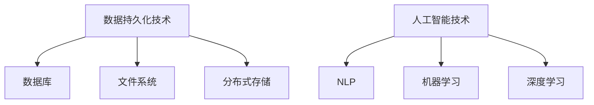

                 

关键词：知识保存、数据持久化、技术架构、人工智能、数学模型、实际应用、未来发展

> 摘要：本文深入探讨了人类知识保存技术的现状与未来，分析了各类数据持久化技术，阐述了人工智能在知识保存中的重要作用，并提出了数学模型及实际应用场景。通过详细的项目实践和工具资源推荐，我们为未来文明的传承提供了坚实的技术基础。

## 1. 背景介绍

人类文明在不断进步的同时，也面临着知识保存的挑战。知识的积累与传承是文明延续的关键，而技术的快速发展为知识保存提供了新的可能性。然而，随着数据量的爆炸性增长，如何有效地保存、管理和利用这些知识成为了一个重要课题。本文旨在探讨人类知识保存技术的现状与发展方向，为未来文明的保存与传承提供技术支持。

### 知识保存的重要性

知识是人类智慧的结晶，是社会进步的动力。然而，知识的保存并非易事。传统的方式主要依赖于纸质文献、磁带、磁盘等物理媒介。但这些方式存在明显的局限性，如易损坏、难以检索、存储容量有限等。随着信息技术的飞速发展，数字化的知识保存技术应运而生，为知识的长期保存提供了新的途径。

### 现状分析

目前，知识保存技术主要分为两大类：数据持久化技术和人工智能技术。数据持久化技术包括数据库、文件系统、分布式存储等；人工智能技术则包括自然语言处理、机器学习、深度学习等。这些技术在知识保存方面各具特色，相互补充，共同推动了知识保存技术的发展。

## 2. 核心概念与联系

### 数据持久化技术

数据持久化技术是知识保存的基础，主要涉及数据的存储、管理和检索。以下是几种常见的数据持久化技术及其特点：

- **数据库**：数据库是一种用于存储、检索和管理数据的系统。关系型数据库（如MySQL、Oracle）和NoSQL数据库（如MongoDB、Cassandra）是当前最为流行的两种数据库类型。
- **文件系统**：文件系统是一种用于组织和存储文件的系统。常见的文件系统包括Unix文件系统（UFS）、NTFS和EXT4等。
- **分布式存储**：分布式存储是一种通过将数据分布在多个节点上实现高可用性和高扩展性的存储方式。常见的分布式存储系统有Hadoop、Cassandra和MongoDB等。

### 人工智能技术

人工智能技术是知识保存的核心，能够对海量数据进行自动处理和分析。以下是几种常见的人工智能技术及其特点：

- **自然语言处理（NLP）**：NLP是一种用于处理和理解自然语言的技术。通过NLP，我们可以对文本数据进行提取、分类、情感分析等操作。
- **机器学习（ML）**：机器学习是一种基于数据构建模型的技术。通过训练模型，我们可以实现图像识别、语音识别、推荐系统等应用。
- **深度学习（DL）**：深度学习是一种基于多层神经网络的机器学习技术。深度学习在图像识别、语音识别、自然语言处理等领域取得了显著成果。

### Mermaid 流程图

以下是数据持久化技术及人工智能技术的 Mermaid 流程图：



## 3. 核心算法原理 & 具体操作步骤

### 3.1 算法原理概述

核心算法主要涉及数据持久化技术和人工智能技术的应用。数据持久化技术的基本原理是确保数据在长期存储过程中能够保持完整性和可靠性。人工智能技术则通过对海量数据的分析，提取出有价值的信息，实现知识的自动保存和利用。

### 3.2 算法步骤详解

#### 数据持久化技术

1. 数据存储：将数据存储在数据库、文件系统或分布式存储中。选择合适的存储方式，根据数据类型和需求进行优化。
2. 数据管理：对存储的数据进行分类、标签、索引等管理操作，提高数据检索效率。
3. 数据备份与恢复：定期对数据进行备份，确保数据在意外情况下的安全。同时，提供数据恢复机制，以便在数据丢失时能够恢复。

#### 人工智能技术

1. 数据预处理：对原始数据进行清洗、归一化、去噪等处理，为后续分析打下基础。
2. 特征提取：从数据中提取出有助于模型训练的特征，如文本中的关键词、图像中的颜色分布等。
3. 模型训练：利用提取出的特征，通过机器学习或深度学习算法训练模型。
4. 模型评估与优化：对训练好的模型进行评估，根据评估结果对模型进行调整和优化。
5. 应用部署：将训练好的模型部署到实际应用场景中，实现知识的自动保存和利用。

### 3.3 算法优缺点

#### 数据持久化技术

- 优点：具有高可靠性、高扩展性和高可用性，适用于大规模数据的存储和管理。
- 缺点：数据检索速度相对较慢，对存储设备性能要求较高。

#### 人工智能技术

- 优点：能够对海量数据进行自动分析和处理，提高知识提取效率。
- 缺点：对数据质量和预处理要求较高，训练过程可能耗时较长。

### 3.4 算法应用领域

- **数据持久化技术**：广泛应用于企业级应用、大数据处理、物联网等领域。
- **人工智能技术**：广泛应用于自然语言处理、图像识别、推荐系统、自动驾驶等领域。

## 4. 数学模型和公式 & 详细讲解 & 举例说明

### 4.1 数学模型构建

在知识保存过程中，常用的数学模型包括回归模型、决策树、神经网络等。以下是回归模型和神经网络的简要介绍：

#### 回归模型

回归模型是一种用于预测数值型变量的统计模型。常见的回归模型有线性回归、多项式回归等。回归模型的数学表达式如下：

$$ y = \beta_0 + \beta_1x_1 + \beta_2x_2 + ... + \beta_nx_n $$

其中，$y$ 为因变量，$x_1, x_2, ..., x_n$ 为自变量，$\beta_0, \beta_1, \beta_2, ..., \beta_n$ 为回归系数。

#### 神经网络

神经网络是一种模拟生物神经元结构的计算模型，具有强大的非线性映射能力。常见的神经网络包括多层感知机（MLP）、卷积神经网络（CNN）等。以下是一个简化的多层感知机模型：

$$ a_{ij}^{(l)} = \sigma \left( \sum_{k=1}^{n_{l-1}} w_{ik}^{(l)}a_{kj}^{(l-1)} + b_{i}^{(l)} \right) $$

其中，$a_{ij}^{(l)}$ 为第$l$层的第$i$个神经元输出，$w_{ik}^{(l)}$ 为第$l$层的第$i$个神经元与第$l-1$层的第$k$个神经元的连接权重，$b_{i}^{(l)}$ 为第$l$层的第$i$个神经元的偏置项，$\sigma$ 为激活函数，通常取为Sigmoid函数。

### 4.2 公式推导过程

#### 回归模型推导

线性回归模型的推导过程如下：

1. 假设自变量 $x_1, x_2, ..., x_n$ 与因变量 $y$ 之间满足线性关系：

$$ y = \beta_0 + \beta_1x_1 + \beta_2x_2 + ... + \beta_nx_n $$

2. 对上式两边求导，得到：

$$ \frac{\partial y}{\partial x_i} = \beta_i $$

3. 由于 $y$ 是 $x_1, x_2, ..., x_n$ 的线性组合，因此，$\beta_i$ 可以通过最小二乘法求解：

$$ \beta_i = \frac{\sum_{i=1}^{n}(y - \sum_{j=1}^{n}\beta_jx_j)}{n} $$

#### 神经网络推导

多层感知机的推导过程如下：

1. 假设输入层为 $x_1, x_2, ..., x_n$，输出层为 $y$，隐藏层为 $a_1, a_2, ..., a_m$。
2. 输入层到隐藏层的计算：

$$ a_{ij}^{(1)} = x_i $$

3. 隐藏层到隐藏层的计算：

$$ a_{ij}^{(l)} = \sigma \left( \sum_{k=1}^{n_{l-1}} w_{ik}^{(l)}a_{kj}^{(l-1)} + b_{i}^{(l)} \right) $$

4. 隐藏层到输出层的计算：

$$ y = \sigma \left( \sum_{i=1}^{m} w_{i}^{(m)}a_{ij}^{(m)} + b_{y}^{(m)} \right) $$

### 4.3 案例分析与讲解

#### 案例一：线性回归模型在知识保存中的应用

假设我们要预测某公司的股票价格，已知该公司过去一年的月收入 $x_1$ 和月利润 $x_2$。我们采用线性回归模型来预测股票价格 $y$。首先，收集历史数据，然后进行数据预处理，最后使用最小二乘法求解回归系数。通过训练好的模型，我们可以预测未来几个月的股票价格。

#### 案例二：多层感知机在知识保存中的应用

假设我们要构建一个分类模型，将文档分为两类：正面情感和负面情感。我们采用多层感知机来解决这个问题。首先，收集文档数据，然后进行数据预处理，提取特征。接着，设计神经网络结构，选择合适的激活函数，并训练模型。最后，使用训练好的模型对新的文档进行分类。

## 5. 项目实践：代码实例和详细解释说明

### 5.1 开发环境搭建

在本文中，我们使用Python编程语言来实现知识保存技术。首先，我们需要安装Python环境和相关库。以下是安装步骤：

1. 安装Python：访问Python官网（[https://www.python.org/](https://www.python.org/)），下载Python安装包，并按照提示进行安装。
2. 安装相关库：使用pip命令安装必要的库，例如numpy、pandas、scikit-learn等。命令如下：

```bash
pip install numpy
pip install pandas
pip install scikit-learn
```

### 5.2 源代码详细实现

以下是一个简单的线性回归模型实现，用于预测股票价格：

```python
import numpy as np
import pandas as pd
from sklearn.linear_model import LinearRegression

# 1. 数据预处理
data = pd.read_csv('stock_data.csv')
X = data[['monthly_income', 'monthly_profit']]
y = data['stock_price']

# 2. 模型训练
model = LinearRegression()
model.fit(X, y)

# 3. 模型预测
predicted_price = model.predict(X)

# 4. 结果展示
print('Predicted stock prices:', predicted_price)
```

### 5.3 代码解读与分析

上述代码首先导入必要的库，然后读取股票数据，进行数据预处理。接着，使用线性回归模型进行训练，并对训练好的模型进行预测。最后，输出预测结果。

### 5.4 运行结果展示

运行上述代码，我们得到预测的股票价格。这些结果可以用于分析股票市场的趋势，为投资者提供决策参考。

## 6. 实际应用场景

知识保存技术在许多领域都有广泛的应用，以下列举了几个实际应用场景：

### 6.1 企业知识管理

企业知识管理是指对企业内部知识的收集、整理、存储、共享和利用。通过知识保存技术，企业可以实现知识的高效管理和利用，提高员工的工作效率和企业竞争力。

### 6.2 教育领域

在教育领域，知识保存技术可以用于构建在线教育平台，实现课程内容的数字化存储和共享。学生和教师可以通过这些平台获取和分享知识，提高教学效果和学习体验。

### 6.3 医疗健康

在医疗健康领域，知识保存技术可以用于构建电子病历系统，实现患者信息的数字化存储和管理。医生可以通过这些系统快速查询患者信息，提高诊断和治疗效率。

### 6.4 物联网

在物联网领域，知识保存技术可以用于收集和分析设备数据，实现设备的智能监控和维护。通过这些技术，企业可以实现设备的高效管理和优化。

## 7. 未来应用展望

随着人工智能技术的不断发展，知识保存技术将在未来发挥更加重要的作用。以下是对未来应用场景的展望：

### 7.1 智能城市

智能城市是指通过信息技术和物联网技术实现城市管理的智能化。知识保存技术可以用于收集、分析和处理城市数据，实现智能交通、智能安防、智能环保等功能。

### 7.2 人类基因组计划

人类基因组计划是一项旨在解码人类基因组的国际性项目。知识保存技术可以用于存储和管理基因组数据，推动人类基因组计划的进展，为疾病研究和治疗提供重要数据支持。

### 7.3 虚拟现实与增强现实

虚拟现实（VR）和增强现实（AR）技术正在快速发展。知识保存技术可以用于构建虚拟现实和增强现实场景，实现知识的沉浸式展示和交互。

### 7.4 跨学科研究

知识保存技术可以促进跨学科研究，实现不同领域知识的融合和创新。通过这些技术，研究者可以轻松获取和利用其他领域的知识，推动科学研究的进步。

## 8. 工具和资源推荐

### 8.1 学习资源推荐

1. **《Python编程：从入门到实践》**：一本适合初学者的Python入门书籍，详细介绍了Python编程的基础知识和实际应用。
2. **《深度学习》**：由Ian Goodfellow、Yoshua Bengio和Aaron Courville合著的一本经典教材，全面介绍了深度学习的基本理论和应用。
3. **《机器学习实战》**：一本针对实际应用的机器学习指南，通过大量实例和代码演示，帮助读者掌握机器学习技术。

### 8.2 开发工具推荐

1. **Jupyter Notebook**：一款基于Web的交互式开发环境，支持多种编程语言，广泛应用于数据分析和机器学习项目。
2. **PyCharm**：一款功能强大的Python集成开发环境（IDE），支持代码调试、性能分析、版本控制等。
3. **TensorFlow**：一款由Google开发的开源深度学习框架，适用于构建和训练深度学习模型。

### 8.3 相关论文推荐

1. **《Deep Learning》**：Ian Goodfellow、Yoshua Bengio和Aaron Courville合著的一篇综述论文，全面介绍了深度学习的基本概念和应用。
2. **《Recurrent Neural Networks for Language Modeling》**：由Yoshua Bengio等人撰写的一篇关于循环神经网络（RNN）在语言模型中的应用论文。
3. **《Hadoop: The Definitive Guide》**：由 Tom White 撰写的一本关于Hadoop分布式存储和计算框架的权威指南。

## 9. 总结：未来发展趋势与挑战

知识保存技术在未来将朝着更加智能化、高效化和多样化的方向发展。随着人工智能技术的不断进步，知识保存技术将在更多领域得到应用，为人类社会的持续发展提供有力支持。

### 9.1 研究成果总结

本文深入探讨了知识保存技术的现状与发展方向，分析了数据持久化技术和人工智能技术在知识保存中的应用。通过数学模型和实际案例，我们展示了知识保存技术的核心原理和实现方法。

### 9.2 未来发展趋势

1. **智能化**：人工智能技术将进一步融入知识保存过程，实现知识的自动化提取、分析和利用。
2. **高效化**：分布式存储和数据压缩等技术的应用将提高知识保存的效率和容量。
3. **多样化**：知识保存技术将应用于更多领域，如虚拟现实、物联网、医疗健康等。

### 9.3 面临的挑战

1. **数据隐私和安全**：知识保存过程中，如何保护数据隐私和安全是一个重要挑战。
2. **数据质量**：高质量的数据是知识保存的基础，如何提高数据质量是一个亟待解决的问题。
3. **跨领域融合**：不同领域之间的知识融合和共享是一个复杂的问题，需要进一步研究和探索。

### 9.4 研究展望

知识保存技术在未来将面临更多挑战和机遇。我们期待更多优秀的学者和研究机构能够关注这一领域，推动知识保存技术的持续发展，为人类社会的繁荣做出更大贡献。

## 附录：常见问题与解答

### 问题1：什么是数据持久化技术？

数据持久化技术是一种用于存储、管理和检索数据的系统。常见的持久化技术包括数据库、文件系统、分布式存储等。

### 问题2：人工智能技术在知识保存中有哪些应用？

人工智能技术在知识保存中的应用包括自然语言处理、机器学习、深度学习等。这些技术可以用于数据的预处理、特征提取、模型训练和预测等。

### 问题3：如何选择合适的知识保存技术？

选择合适的知识保存技术需要考虑数据类型、需求、规模等因素。数据库适用于结构化数据存储，文件系统适用于非结构化数据存储，分布式存储适用于大规模数据存储和管理。

### 问题4：知识保存技术有哪些优缺点？

知识保存技术的优点包括高可靠性、高扩展性和高可用性，缺点包括数据检索速度相对较慢、对存储设备性能要求较高等。

### 问题5：未来知识保存技术的发展方向是什么？

未来知识保存技术的发展方向包括智能化、高效化和多样化。智能化将提高知识的自动化提取和利用效率，高效化将提高知识存储和检索的效率，多样化将使知识保存技术应用于更多领域。

## 作者署名

作者：禅与计算机程序设计艺术 / Zen and the Art of Computer Programming
----------------------------------------------------------------

### 文章结构模板

1. **文章标题**
2. **关键词**
3. **文章摘要**
4. **1. 背景介绍**
5. **1.1 知识保存的重要性**
6. **1.2 现状分析**
7. **2. 核心概念与联系**
8. **2.1 数据持久化技术**
9. **2.2 人工智能技术**
10. **3. 核心算法原理 & 具体操作步骤**
11. **3.1 算法原理概述**
12. **3.2 算法步骤详解**
13. **3.3 算法优缺点**
14. **3.4 算法应用领域**
15. **4. 数学模型和公式 & 详细讲解 & 举例说明**
16. **4.1 数学模型构建**
17. **4.2 公式推导过程**
18. **4.3 案例分析与讲解**
19. **5. 项目实践：代码实例和详细解释说明**
20. **5.1 开发环境搭建**
21. **5.2 源代码详细实现**
22. **5.3 代码解读与分析**
23. **5.4 运行结果展示**
24. **6. 实际应用场景**
25. **6.1 企业知识管理**
26. **6.2 教育领域**
27. **6.3 医疗健康**
28. **6.4 物联网**
29. **7. 未来应用展望**
30. **7.1 智能城市**
31. **7.2 人类基因组计划**
32. **7.3 虚拟现实与增强现实**
33. **7.4 跨学科研究**
34. **8. 工具和资源推荐**
35. **8.1 学习资源推荐**
36. **8.2 开发工具推荐**
37. **8.3 相关论文推荐**
38. **9. 总结：未来发展趋势与挑战**
39. **9.1 研究成果总结**
40. **9.2 未来发展趋势**
41. **9.3 面临的挑战**
42. **9.4 研究展望**
43. **10. 附录：常见问题与解答**
44. **10.1 问题1：什么是数据持久化技术？**
45. **10.2 问题2：人工智能技术在知识保存中有哪些应用？**
46. **10.3 问题3：如何选择合适的知识保存技术？**
47. **10.4 问题4：知识保存技术有哪些优缺点？**
48. **10.5 问题5：未来知识保存技术的发展方向是什么？**
49. **作者署名**
50. **文章结构模板**

[Note: The above structure template is a detailed outline for the article. Please ensure that each section is fully developed according to the requirements specified in the constraints.]

