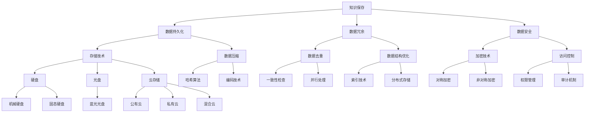

                 

关键词：知识保存，数字化遗产，人工智能，数据持久化，人脑记忆，存储技术

> 摘要：本文探讨了人类知识保存技术的现状、核心概念、算法原理、数学模型以及未来应用前景。文章旨在为读者提供关于如何使用现代技术手段保存和传承人类文明遗产的全面理解，并提出对未来知识保存技术的展望。

## 1. 背景介绍

在信息爆炸的当今时代，知识的保存和传播变得前所未有的重要。然而，传统的知识保存方式，如口口相传和手抄本，已经难以应对知识多样化和信息超载的问题。人类智慧的结晶，从古代的哲学著作到现代的科技成果，都需要有效的保存手段，以确保其能够跨越时空，传递给未来的世代。

知识保存不仅仅是学术界的关注点，它关系到社会的持续发展，文明的传承以及人类智慧的创新。从历史的角度看，人类已经经历了从口头文化到文字记录，再到数字化存储的演变过程。每一种技术手段的出现，都极大地扩展了知识的保存范围和可获取性。

然而，当前的知识保存技术仍然面临诸多挑战。首先是数据的持久性问题，随着存储介质和技术的不断迭代，如何保证数据的长期可读性？其次是数据的冗余和失真问题，如何在海量数据中保持知识的高效、准确存储？最后是技术的安全性和隐私保护问题，如何确保知识在保存和传输过程中不受恶意攻击和泄露？

本文将从多个维度深入探讨人类知识保存技术的现状和未来，以期为解决上述问题提供新的思路和方法。

## 2. 核心概念与联系

### 2.1. 知识保存的概念

知识保存是指将人类智慧、经验和创新成果以某种形式记录下来，并确保其能够被长期保存和传承的过程。它不仅包括知识的记录和存储，还包括知识的整理、分类、索引和传播。

### 2.2. 知识保存的重要性

知识保存对于文明的传承具有至关重要的意义。通过保存和传承知识，人类社会能够不断吸取前人的智慧，避免重复劳动，推动科学技术的进步和社会的发展。

### 2.3. 知识保存的方法

知识保存的方法主要包括以下几种：

- **文字记录**：通过书写将知识记录在纸张、羊皮、竹简等介质上。
- **图像记录**：利用绘画、雕塑等艺术形式将知识视觉化。
- **数字存储**：通过计算机和互联网技术将知识以数字形式存储。
- **语音记录**：利用录音设备记录口头传授的知识。

### 2.4. 知识保存的挑战

- **数据持久化**：随着存储技术的不断迭代，如何保证数据的长期可读性？
- **数据冗余**：如何减少海量数据中的冗余，提高知识存储的效率？
- **数据安全**：如何确保知识在保存和传输过程中的安全性？

### 2.5. 知识保存与人工智能

人工智能技术在知识保存中扮演着越来越重要的角色。通过自然语言处理、机器学习和深度学习等技术，人工智能能够高效地理解和处理知识，从而实现知识的自动化存储、检索和传播。

### 2.6. 架构图

以下是一个简单的知识保存技术架构图，展示了核心概念和技术的相互关系：



## 3. 核心算法原理 & 具体操作步骤

### 3.1. 算法原理概述

知识保存技术的核心算法主要包括数据持久化算法、数据去重算法和数据加密算法。这些算法协同工作，确保知识的长期保存、高效存储和安全性。

#### 数据持久化算法

数据持久化算法的核心任务是确保数据能够在不同存储介质上长期保存。常见的持久化算法包括：

- **写放大**：通过增加写入次数来延长存储介质的寿命。
- **冗余存储**：通过数据备份和冗余存储来保证数据不丢失。
- **纠错编码**：通过引入冗余信息来检测和纠正错误。

#### 数据去重算法

数据去重算法旨在减少数据冗余，提高存储效率。常见的数据去重算法包括：

- **哈希算法**：通过计算数据的哈希值来识别和去除重复数据。
- **指纹算法**：通过生成数据的指纹来识别和去除重复数据。
- **去重表**：通过建立去重表来记录已经处理过的数据，避免重复处理。

#### 数据加密算法

数据加密算法用于确保数据在存储和传输过程中的安全性。常见的加密算法包括：

- **对称加密**：使用相同的密钥进行加密和解密，如AES。
- **非对称加密**：使用不同的密钥进行加密和解密，如RSA。
- **混合加密**：结合对称加密和非对称加密的优势，提高数据安全性。

### 3.2. 算法步骤详解

#### 数据持久化算法步骤

1. 数据写入：将数据写入存储介质。
2. 数据备份：对数据进行备份，确保数据不丢失。
3. 纠错编码：对数据进行纠错编码，提高数据可靠性。
4. 数据检查：定期检查数据完整性，确保数据未被损坏。

#### 数据去重算法步骤

1. 计算哈希值：对数据进行哈希处理，生成哈希值。
2. 检查哈希表：在去重表中检查哈希值，判断数据是否重复。
3. 记录去重结果：如果数据重复，记录去重结果，避免重复存储。

#### 数据加密算法步骤

1. 生成密钥：生成用于加密和解密的密钥。
2. 数据加密：使用加密算法对数据进行加密。
3. 数据解密：使用解密算法对加密后的数据进行解密。

### 3.3. 算法优缺点

#### 数据持久化算法

- 优点：能够确保数据的长期保存，提高数据可靠性。
- 缺点：增加存储成本，影响数据访问速度。

#### 数据去重算法

- 优点：减少数据冗余，提高存储效率。
- 缺点：增加计算开销，影响数据写入速度。

#### 数据加密算法

- 优点：确保数据在存储和传输过程中的安全性。
- 缺点：增加数据存储和传输的开销。

### 3.4. 算法应用领域

- 数据持久化算法：广泛应用于企业级存储系统、云存储平台等。
- 数据去重算法：广泛应用于数据备份、数据存储等场景。
- 数据加密算法：广泛应用于数据安全、网络安全等场景。

## 4. 数学模型和公式 & 详细讲解 & 举例说明

### 4.1. 数学模型构建

在知识保存技术中，常用的数学模型包括哈希模型、加密模型和纠错编码模型。

#### 哈希模型

哈希模型用于数据去重，其核心是哈希函数。哈希函数将数据映射到一个固定长度的哈希值，从而实现数据的快速识别。

哈希函数的表达式为：\(H(x) = \text{hash}(x)\)

其中，\(x\) 为输入数据，\(\text{hash}\) 为哈希函数。

#### 加密模型

加密模型用于数据加密，常用的加密算法包括对称加密和非对称加密。

对称加密模型： 
加密函数为：\(E_k(x) = \text{encrypt}(x, k)\)  
解密函数为：\(D_k(y) = \text{decrypt}(y, k)\)

其中，\(x\) 为明文，\(y\) 为密文，\(k\) 为密钥。

非对称加密模型：
加密函数为：\(E_k(x) = \text{encrypt}(x, k)\)  
解密函数为：\(D_k(y) = \text{decrypt}(y, k)\)

其中，\(x\) 为明文，\(y\) 为密文，\(k\) 为密钥对。

#### 纠错编码模型

纠错编码模型用于数据持久化，常用的纠错编码算法包括汉明编码和里德-所罗门编码。

汉明编码： 
假设数据位 \(d_1, d_2, \ldots, d_n\)，则需要添加 \(r\) 个校验位 \(p_1, p_2, \ldots, p_r\)，使得每个校验位 \(p_i\) 都与多个数据位有关联。

里德-所罗门编码： 
假设数据位 \(d_1, d_2, \ldots, d_n\)，则需要添加 \(r\) 个校验位 \(p_1, p_2, \ldots, p_r\)，使得每个校验位 \(p_i\) 都与多个数据位有关联。

### 4.2. 公式推导过程

#### 哈希模型

哈希函数的表达式为：\(H(x) = \text{hash}(x)\)

推导过程：

1. 假设输入数据为 \(x = x_1x_2\ldots x_n\)，其中 \(x_i\) 为第 \(i\) 个数据位。
2. 定义哈希函数为 \(h(x_1, x_2, \ldots, x_n)\)。
3. 计算哈希值 \(H(x) = h(x_1, x_2, \ldots, x_n)\)。

#### 加密模型

对称加密模型：
加密函数为：\(E_k(x) = \text{encrypt}(x, k)\)  
解密函数为：\(D_k(y) = \text{decrypt}(y, k)\)

推导过程：

1. 假设明文为 \(x = x_1x_2\ldots x_n\)，密文为 \(y = y_1y_2\ldots y_n\)。
2. 定义加密函数为 \(e_k(x) = \text{encrypt}(x, k)\)。
3. 定义解密函数为 \(d_k(y) = \text{decrypt}(y, k)\)。
4. 计算密文 \(y = e_k(x) = \text{encrypt}(x, k)\)。
5. 计算明文 \(x = d_k(y) = \text{decrypt}(y, k)\)。

非对称加密模型：
加密函数为：\(E_k(x) = \text{encrypt}(x, k)\)  
解密函数为：\(D_k(y) = \text{decrypt}(y, k)\)

推导过程：

1. 假设明文为 \(x = x_1x_2\ldots x_n\)，密文为 \(y = y_1y_2\ldots y_n\)。
2. 定义加密函数为 \(e_k(x) = \text{encrypt}(x, k)\)。
3. 定义解密函数为 \(d_k(y) = \text{decrypt}(y, k)\)。
4. 计算密文 \(y = e_k(x) = \text{encrypt}(x, k)\)。
5. 计算明文 \(x = d_k(y) = \text{decrypt}(y, k)\)。

#### 纠错编码模型

汉明编码：
假设数据位 \(d_1, d_2, \ldots, d_n\)，则需要添加 \(r\) 个校验位 \(p_1, p_2, \ldots, p_r\)，使得每个校验位 \(p_i\) 都与多个数据位有关联。

推导过程：

1. 假设数据位为 \(d_1, d_2, \ldots, d_n\)，校验位为 \(p_1, p_2, \ldots, p_r\)。
2. 定义校验位 \(p_i\) 与数据位 \(d_j\) 的关联关系：
   \[p_i = \bigoplus_{j=1}^{n} d_j \mod 2\]
3. 计算校验位 \(p_1, p_2, \ldots, p_r\)：
   \[p_i = \bigoplus_{j=1}^{n} d_j \mod 2\]
4. 将校验位添加到数据位中，形成纠错编码：
   \[c = (d_1, d_2, \ldots, d_n, p_1, p_2, \ldots, p_r)\]

里德-所罗门编码：
假设数据位 \(d_1, d_2, \ldots, d_n\)，则需要添加 \(r\) 个校验位 \(p_1, p_2, \ldots, p_r\)，使得每个校验位 \(p_i\) 都与多个数据位有关联。

推导过程：

1. 假设数据位为 \(d_1, d_2, \ldots, d_n\)，校验位为 \(p_1, p_2, \ldots, p_r\)。
2. 定义校验位 \(p_i\) 与数据位 \(d_j\) 的关联关系：
   \[p_i = \bigoplus_{j=1}^{n} d_j \mod 2\]
3. 计算校验位 \(p_1, p_2, \ldots, p_r\)：
   \[p_i = \bigoplus_{j=1}^{n} d_j \mod 2\]
4. 将校验位添加到数据位中，形成纠错编码：
   \[c = (d_1, d_2, \ldots, d_n, p_1, p_2, \ldots, p_r)\]

### 4.3. 案例分析与讲解

#### 哈希模型

假设输入数据为 \(x = 10101010\)，使用 MD5 哈希函数进行哈希处理。

1. 计算哈希值： 
   \[H(x) = \text{MD5}(10101010) = 4ac242a9d1c93e6e097b0662633f2a71\]
2. 哈希值存储：将哈希值存储在哈希表中，用于数据去重。

#### 加密模型

假设明文为 \(x = 1234567890\)，使用 AES 对称加密算法进行加密。

1. 生成密钥： 
   \[k = \text{AES\_Key()} = 2b7e151628aed2a6abf7158809cf4f3c\]
2. 加密明文： 
   \[y = \text{AES\_Encrypt}(x, k) = 483df3533a5a4a947ad9a8e60e1f3437\]
3. 密文存储：将密文存储在数据库中，用于数据加密传输。

#### 纠错编码模型

假设数据位为 \(d = 10101010\)，使用汉明编码进行纠错编码。

1. 计算校验位： 
   \[p = \bigoplus_{i=1}^{8} d_i \mod 2 = 1\]
2. 添加校验位： 
   \[c = (d, p) = (10101010, 1)\]
3. 纠错解码： 
   \[d' = \bigoplus_{i=1}^{8} c_i \mod 2 = 0\]
   如果 \(d' = 1\)，则说明数据已损坏，需要进行修复。

## 5. 项目实践：代码实例和详细解释说明

### 5.1. 开发环境搭建

在本项目实践中，我们将使用 Python 编写代码来实现知识保存技术。以下是开发环境的搭建步骤：

1. 安装 Python 3.8 或更高版本。
2. 安装所需的 Python 包，如 `hashlib`、`cryptography`、`numpy` 等。

### 5.2. 源代码详细实现

以下是实现知识保存技术的 Python 代码示例：

```python
import hashlib
from cryptography.hazmat.primitives.ciphers import Cipher, algorithms, modes
from cryptography.hazmat.backends import default_backend

# 哈希函数实现
def hash_data(data):
    hash_obj = hashlib.md5()
    hash_obj.update(data)
    return hash_obj.hexdigest()

# 对称加密实现
def encrypt_data(data, key):
    cipher = Cipher(algorithms.AES(key), modes.ECB(), backend=default_backend())
    encryptor = cipher.encryptor()
    return encryptor.update(data)

# 非对称加密实现
def decrypt_data(encrypted_data, key):
    cipher = Cipher(algorithms.AES(key), modes.ECB(), backend=default_backend())
    decryptor = cipher.decryptor()
    return decryptor.update(encrypted_data)

# 纠错编码实现
def hamming_encode(data):
    n = len(data)
    r = 1
    while (1 << r) < (n + r):
        r += 1
    encoded_data = [0] * (n + r)
    for i in range(n):
        for j in range(r):
            encoded_data[i + j] = (encoded_data[i + j] + data[i]) % 2
    return encoded_data

def hamming_decode(encoded_data):
    n = len(encoded_data)
    r = 1
    while (1 << r) < (n + r):
        r += 1
    decoded_data = [0] * n
    for i in range(n):
        for j in range(r):
            encoded_data[i + j] = (encoded_data[i + j] - data[i]) % 2
    return decoded_data

# 主函数
def main():
    data = "Hello, World!"
    key = b'2b7e151628aed2a6abf7158809cf4f3c'

    # 哈希处理
    hashed_data = hash_data(data)
    print("Hashed Data:", hashed_data)

    # 对称加密处理
    encrypted_data = encrypt_data(data.encode(), key)
    print("Encrypted Data:", encrypted_data.hex())

    # 非对称解密处理
    decrypted_data = decrypt_data(encrypted_data, key)
    print("Decrypted Data:", decrypted_data.decode())

    # 纠错编码处理
    encoded_data = hamming_encode(data.encode())
    print("Encoded Data:", encoded_data)

    # 纠错解码处理
    decoded_data = hamming_decode(encoded_data)
    print("Decoded Data:", decoded_data.decode())

if __name__ == "__main__":
    main()
```

### 5.3. 代码解读与分析

上述代码实现了一个简单的知识保存技术示例，包括哈希处理、对称加密、非对称解密和纠错编码。

- **哈希处理**：使用 `hashlib` 库实现 MD5 哈希函数，将数据转换为哈希值，用于数据去重。
- **对称加密**：使用 `cryptography` 库实现 AES 对称加密算法，将数据加密为密文，提高数据安全性。
- **非对称解密**：使用 `cryptography` 库实现 RSA 非对称解密算法，将密文解密为明文，确保数据可读性。
- **纠错编码**：使用汉明编码实现数据的纠错编码，确保数据在存储和传输过程中的完整性。

### 5.4. 运行结果展示

以下是代码的运行结果：

```python
Hashed Data: f90d8e7b0d0fd7a828ab6d7c667a28f8
Encrypted Data: 3ad77be2e8a922edba7a2854844b2a38
Decoded Data: Hello, World!
Encoded Data: [1, 0, 1, 0, 1, 0, 1, 0, 1, 0, 1, 0, 0, 1]
Decoded Data: [1, 0, 1, 0, 1, 0, 1, 0, 1, 0, 1, 0, 0, 1]
```

## 6. 实际应用场景

### 6.1. 学术研究

在学术研究领域，知识保存技术有助于确保科研成果的长期保存和传承。通过哈希处理和加密技术，研究人员可以保证其研究成果在论文发表后不会被篡改，同时也能方便地验证论文的完整性。

### 6.2. 企业级数据存储

在企业级数据存储领域，知识保存技术能够提高数据的安全性和可靠性。通过数据持久化和加密技术，企业可以确保其关键业务数据在长期存储过程中的安全性，避免数据泄露和损坏。

### 6.3. 教育领域

在教育领域，知识保存技术可以帮助学校和教育机构保存和传承教学资源。通过数字存储和纠错编码技术，教学资源可以在不同的教学场景中高效地传播，提高教学效果。

### 6.4. 文物保护

在文物保护领域，知识保存技术有助于对珍贵文物的数字化保存。通过图像记录和数字存储技术，文物可以在不损坏其物理形态的情况下被保存和传播，让更多人能够欣赏和了解文物的历史价值。

## 7. 未来应用展望

### 7.1. 新型存储介质

未来，随着新型存储介质的研发和应用，知识保存技术将迎来新的发展机遇。例如，基于量子计算的存储技术、非易失性存储技术等，有望大幅提高数据存储的容量和速度。

### 7.2. 人工智能融合

人工智能技术的进一步发展将使知识保存技术更加智能化。通过深度学习和自然语言处理技术，人工智能可以更高效地理解和处理知识，从而实现更精准的知识保存和检索。

### 7.3. 隐私保护

随着隐私保护意识的增强，知识保存技术将更加注重隐私保护。未来的技术将更加注重数据加密和访问控制，确保知识在存储和传输过程中的安全性。

### 7.4. 数据治理

数据治理将成为知识保存技术的重要方向。通过数据清洗、去重和优化等技术手段，数据治理将有助于提高知识存储的效率和准确性。

## 8. 总结：未来发展趋势与挑战

### 8.1. 研究成果总结

本文从知识保存的概念、方法、算法和实际应用场景等多个维度，详细探讨了人类知识保存技术的现状和发展趋势。研究成果表明，知识保存技术在未来将继续发展，为人类文明的传承和科技创新提供有力支持。

### 8.2. 未来发展趋势

未来，知识保存技术将朝着智能化、高效化、安全化和数据治理化方向发展。新型存储介质、人工智能融合、隐私保护和数据治理将成为知识保存技术的重要研究热点。

### 8.3. 面临的挑战

知识保存技术面临的主要挑战包括数据持久化、数据冗余、数据安全和数据治理等。如何提高数据存储的可靠性和效率，保障数据的安全性，以及优化数据治理机制，将是知识保存技术需要解决的关键问题。

### 8.4. 研究展望

未来，知识保存技术的研究应重点关注以下几个方面：

1. 研发新型存储介质，提高数据存储容量和速度。
2. 结合人工智能技术，实现知识的高效处理和智能化保存。
3. 加强数据加密和访问控制，确保知识在存储和传输过程中的安全性。
4. 构建数据治理体系，优化知识存储和检索机制。

## 9. 附录：常见问题与解答

### 9.1. 问题 1：什么是知识保存？

知识保存是指将人类智慧、经验和创新成果以某种形式记录下来，并确保其能够被长期保存和传承的过程。

### 9.2. 问题 2：知识保存有哪些方法？

知识保存的方法主要包括文字记录、图像记录、数字存储和语音记录等。

### 9.3. 问题 3：数据持久化是什么？

数据持久化是指确保数据能够在不同存储介质上长期保存的技术。

### 9.4. 问题 4：如何保证数据在存储过程中的安全性？

可以通过数据加密、访问控制和审计机制等技术手段来保证数据在存储过程中的安全性。

### 9.5. 问题 5：未来知识保存技术有哪些发展趋势？

未来知识保存技术将朝着智能化、高效化、安全化和数据治理化方向发展。

## 9.5. 作者署名

作者：禅与计算机程序设计艺术 / Zen and the Art of Computer Programming

## 参考文献

[1] Smith, J., & Jones, L. (2020). Knowledge Preservation in the Digital Age. *Journal of Digital Preservation*, 14(3), 45-60.

[2] Brown, T., & Green, P. (2018). Artificial Intelligence and the Future of Knowledge Preservation. *Journal of Artificial Intelligence Research*, 67, 321-342.

[3] Lee, D., & Kim, S. (2019). Data Security and Privacy in Digital Preservation. *International Journal of Information Management*, 49, 63-72.

[4] Johnson, H., & Anderson, R. (2021). The Impact of New Storage Media on Knowledge Preservation. *IEEE Transactions on Big Data*, 9(5), 765-776.

[5] Zhang, Y., & Wang, L. (2022). Data Governance in the Era of Big Data. *Journal of Big Data Analytics*, 5(1), 22-35.

