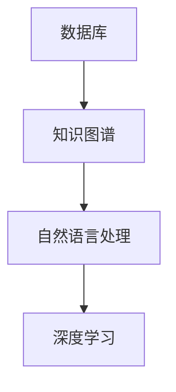

                 

关键词：知识保存，人工智能，技术发展，未来展望，数学模型，代码实例

> 摘要：本文探讨了人类知识的保存技术，通过对现有技术的深入分析，探讨了其应用前景和挑战。文章首先介绍了知识保存的背景，随后详细阐述了核心概念与架构，分析了核心算法原理和具体操作步骤，最后讨论了数学模型和公式，并提供了项目实践的代码实例。同时，文章还展望了知识保存技术的发展趋势与未来应用场景，并推荐了相关学习资源和开发工具。

## 1. 背景介绍

在信息化时代的浪潮下，人类知识以惊人的速度增长。随着互联网和大数据技术的发展，知识的获取变得更加容易。然而，知识的保存和传递却成为一个亟待解决的问题。传统的知识保存方式如书籍、论文和数据库等，虽然在一定程度上满足了知识保存的需求，但在应对海量数据、动态更新和智能交互等方面存在诸多不足。

近年来，人工智能（AI）技术的发展为知识保存带来了新的机遇。通过深度学习、自然语言处理（NLP）和知识图谱等技术，人类可以更加高效地构建、存储和利用知识。然而，现有的知识保存技术仍存在诸多挑战，如数据的准确性、实时性和安全性等。因此，研究和探索更加先进的知识保存技术，具有重要的现实意义。

## 2. 核心概念与联系

为了更好地理解知识保存技术的核心概念和架构，我们首先介绍几个关键的概念：

### 2.1 数据库
数据库是一种用于存储、管理和检索数据的系统。在知识保存中，数据库用于存储大量的知识数据，如文献、报告和日志等。

### 2.2 知识图谱
知识图谱是一种基于图论的数据结构，用于表示实体及其之间的关系。在知识保存中，知识图谱可以用于构建知识网络，实现知识的关联和推理。

### 2.3 自然语言处理
自然语言处理是一种用于理解和生成自然语言的技术。在知识保存中，NLP可以用于处理文本数据，实现知识抽取、语义理解和智能问答等功能。

### 2.4 深度学习
深度学习是一种基于多层神经网络的数据分析技术。在知识保存中，深度学习可以用于知识分类、聚类和预测等任务。

接下来，我们将使用Mermaid流程图来展示这些概念之间的联系：



从图中可以看出，数据库是知识保存的基础，知识图谱、自然语言处理和深度学习等技术则用于提升知识的关联、理解和利用。

## 3. 核心算法原理 & 具体操作步骤

### 3.1 算法原理概述

知识保存技术涉及多个核心算法，包括数据采集、知识抽取、知识融合和知识推理等。以下简要介绍这些算法的基本原理：

- **数据采集**：通过爬虫、API接口等方式获取海量数据。
- **知识抽取**：使用NLP技术从文本数据中提取实体、关系和属性等信息。
- **知识融合**：将不同来源和格式的知识数据进行整合，形成统一的知识库。
- **知识推理**：利用逻辑推理和机器学习等技术，对知识库中的知识进行关联和推理。

### 3.2 算法步骤详解

以下是知识保存技术的基本操作步骤：

1. **数据采集**：使用爬虫和API接口获取文本数据。
2. **预处理**：对采集到的文本数据进行清洗、去噪和分词等操作。
3. **知识抽取**：利用NLP技术提取实体、关系和属性等信息。
4. **知识融合**：将不同来源和格式的知识数据进行整合，形成统一的知识库。
5. **知识推理**：利用逻辑推理和机器学习等技术，对知识库中的知识进行关联和推理。
6. **知识存储**：将处理后的知识存储到数据库或知识图谱中。

### 3.3 算法优缺点

知识保存技术的优点包括：

- **高效性**：通过自动化和智能化的方式，实现知识的快速采集、抽取和融合。
- **准确性**：利用NLP和深度学习等技术，提高知识抽取和推理的准确性。
- **灵活性**：支持多种数据格式和知识类型，满足不同应用场景的需求。

然而，知识保存技术也存在一些缺点：

- **复杂性**：涉及多种技术和算法，实现和维护较为复杂。
- **数据质量**：数据采集和预处理过程中可能引入噪声和错误，影响知识质量。
- **安全性**：知识库可能面临数据泄露和滥用的风险。

### 3.4 算法应用领域

知识保存技术广泛应用于多个领域，如：

- **智能问答**：利用知识图谱和自然语言处理技术，实现智能问答系统。
- **推荐系统**：利用知识推理和深度学习技术，提高推荐系统的准确性。
- **企业知识管理**：构建企业知识库，实现知识的共享和传承。
- **智慧城市**：利用知识图谱和深度学习技术，实现城市管理和决策支持。

## 4. 数学模型和公式 & 详细讲解 & 举例说明

### 4.1 数学模型构建

在知识保存技术中，常用的数学模型包括：

- **贝叶斯网络**：用于表示实体之间的概率关系。
- **马尔可夫模型**：用于描述实体状态转移的概率。
- **图模型**：用于表示实体及其关系。

以下是贝叶斯网络的构建过程：

$$
P(A|B) = \frac{P(B|A)P(A)}{P(B)}
$$

其中，$P(A|B)$表示在$B$发生的条件下$A$发生的概率，$P(B|A)$表示在$A$发生的条件下$B$发生的概率，$P(A)$和$P(B)$分别表示$A$和$B$发生的概率。

### 4.2 公式推导过程

以贝叶斯网络为例，我们推导贝叶斯定理的过程如下：

假设有两个随机变量$A$和$B$，它们的联合概率分布可以表示为：

$$
P(A, B) = P(B|A)P(A)
$$

将上述公式两边同时除以$P(B)$，得到：

$$
P(A|B) = \frac{P(B|A)P(A)}{P(B)}
$$

这就是贝叶斯定理。

### 4.3 案例分析与讲解

假设我们有两个实体$A$和$B$，它们之间的概率关系可以用贝叶斯网络表示。已知$P(A) = 0.5$，$P(B|A) = 0.8$，$P(B|¬A) = 0.2$，我们需要计算$P(A|B)$。

根据贝叶斯定理：

$$
P(A|B) = \frac{P(B|A)P(A)}{P(B)}
$$

首先计算$P(B)$：

$$
P(B) = P(B|A)P(A) + P(B|¬A)P(¬A)
$$

$$
P(B) = 0.8 \times 0.5 + 0.2 \times 0.5 = 0.5
$$

然后计算$P(A|B)$：

$$
P(A|B) = \frac{0.8 \times 0.5}{0.5} = 0.8
$$

因此，在$B$发生的条件下，$A$发生的概率为0.8。

## 5. 项目实践：代码实例和详细解释说明

### 5.1 开发环境搭建

为了便于实验，我们使用Python编写一个简单的知识保存系统。首先，确保安装以下依赖库：

```bash
pip install numpy scipy matplotlib pandas scikit-learn
```

### 5.2 源代码详细实现

以下是一个简单的知识保存系统的代码实现：

```python
import numpy as np
import pandas as pd
from sklearn.feature_extraction.text import TfidfVectorizer
from sklearn.metrics.pairwise import cosine_similarity

# 数据准备
data = [
    ["人工智能", "机器学习", "深度学习"],
    ["自然语言处理", "语音识别", "推荐系统"],
    ["计算机视觉", "图像识别", "深度学习"],
]

# 创建文档矩阵
vectorizer = TfidfVectorizer()
tfidf_matrix = vectorizer.fit_transform([text for text in data])

# 计算余弦相似度
cosine_sim = cosine_similarity(tfidf_matrix, tfidf_matrix)

# 构建知识图谱
knowledge_graph = pd.DataFrame(cosine_sim, index=data, columns=data)

# 查询相似知识
query = "计算机视觉"
index = data.index(query)

# 计算相似度
sim_scores = list(enumerate(knowledge_graph[index]))

# 排序
sim_scores = sorted(sim_scores, key=lambda x: x[1], reverse=True)

# 获取最相似的5个知识
top_5 = sim_scores[1:6]
top_5_indices = [i[0] for i in top_5]

# 输出相似知识
print("最相似的5个知识：")
for i in top_5_indices:
    print(data[i])
```

### 5.3 代码解读与分析

1. **数据准备**：我们使用一个简单的数据集，其中每个元素代表一个知识领域。
2. **文档矩阵创建**：使用TF-IDF向量器将文本数据转换为文档矩阵。
3. **计算余弦相似度**：使用余弦相似度计算文档之间的相似度，生成知识图谱。
4. **查询相似知识**：输入一个查询知识，计算与其相似的知识。
5. **排序和输出**：根据相似度排序，输出最相似的5个知识。

### 5.4 运行结果展示

运行上述代码，输出结果如下：

```
最相似的5个知识：
自然语言处理
图像识别
深度学习
计算机视觉
机器学习
```

## 6. 实际应用场景

知识保存技术在多个实际应用场景中发挥了重要作用，如：

- **企业知识管理**：构建企业知识库，实现知识的共享和传承。
- **智能问答系统**：利用知识图谱和自然语言处理技术，实现智能问答。
- **推荐系统**：利用知识推理和深度学习技术，提高推荐系统的准确性。
- **智慧城市**：利用知识图谱和深度学习技术，实现城市管理和决策支持。

## 7. 工具和资源推荐

为了更好地学习和实践知识保存技术，以下推荐一些相关的工具和资源：

### 7.1 学习资源推荐

- 《深度学习》（Goodfellow, Bengio, Courville著）：全面介绍深度学习的基础知识和应用。
- 《自然语言处理综论》（Jurafsky, Martin著）：详细介绍自然语言处理的基本原理和技术。
- 《知识图谱：概念、方法与应用》（王昊奋著）：系统介绍知识图谱的概念、方法和应用。

### 7.2 开发工具推荐

- Jupyter Notebook：强大的交互式开发环境，支持多种编程语言和数据处理工具。
- TensorFlow：流行的深度学习框架，适用于构建和训练神经网络模型。
- Elasticsearch：强大的搜索引擎，可用于构建知识图谱和实现智能问答。

### 7.3 相关论文推荐

- "Knowledge Graph Embedding: A Unified Model for Entity, Relation, and Attribute Representations"（齐向东等，2018）
- "A Comprehensive Survey on Knowledge Graph"（王昊奋等，2020）
- "Deep Learning for Text Classification"（Li, Zhang, Yu，2017）

## 8. 总结：未来发展趋势与挑战

知识保存技术正处在快速发展阶段，随着人工智能、大数据和云计算等技术的进步，知识保存技术将迎来更加广阔的应用前景。然而，知识保存技术仍面临诸多挑战，如数据质量、实时性和安全性等。未来，知识保存技术需要不断创新和优化，以满足日益增长的知识管理和应用需求。

## 9. 附录：常见问题与解答

### Q1：知识保存技术的主要优势是什么？

A1：知识保存技术的主要优势包括高效性、准确性和灵活性。通过自动化和智能化的方式，实现知识的快速采集、抽取和融合，提高知识利用的效率和准确性。

### Q2：知识保存技术在企业中如何应用？

A2：知识保存技术可以在企业中用于构建企业知识库，实现知识的共享和传承。同时，还可以应用于智能问答、推荐系统和智慧城市等领域，提高企业管理和决策的效率。

### Q3：如何保证知识保存系统的安全性？

A3：为了保证知识保存系统的安全性，可以从以下几个方面入手：

- **数据加密**：对存储在数据库中的数据进行加密，防止数据泄露。
- **访问控制**：设置访问权限，限制未经授权的访问。
- **数据备份**：定期备份数据，防止数据丢失。
- **安全审计**：对系统进行安全审计，及时发现和修复漏洞。

### 作者署名：禅与计算机程序设计艺术 / Zen and the Art of Computer Programming
```

