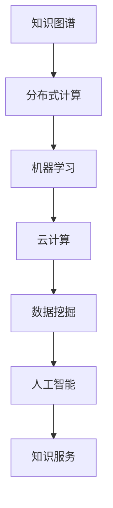

                 

关键词：知识共享平台、人工智能、知识图谱、分布式计算、数学模型、编程实践、未来展望

> 摘要：本文旨在探讨人类知识的共享平台的建设与发展，从技术角度分析其核心概念、算法原理、数学模型以及实际应用场景，并展望其未来发展趋势与挑战。

## 1. 背景介绍

在信息化时代，知识已经成为推动社会发展的重要力量。知识的传播与共享不仅仅局限于传统教育领域，更广泛地应用于商业、医疗、科研等多个行业。然而，随着数据量和知识种类的爆炸性增长，如何高效地组织和利用这些知识资源成为一个亟待解决的问题。

人类知识的共享平台作为一种新兴的科技服务模式，通过集成人工智能、大数据、云计算等先进技术，旨在构建一个开放、透明、高效的全球知识共享生态系统。这个平台不仅能够实现知识的快速传播和共享，还可以通过智能分析提供个性化服务，提升知识利用效率。

本文将从以下几个方面对人类知识的共享平台进行探讨：

- 核心概念与联系
- 核心算法原理与具体操作步骤
- 数学模型和公式
- 项目实践：代码实例与详细解释
- 实际应用场景
- 未来应用展望
- 工具和资源推荐
- 总结：未来发展趋势与挑战

通过以上内容的阐述，希望能够为人类知识的共享平台的研究与实践提供一些有价值的参考。

## 2. 核心概念与联系

为了深入理解人类知识的共享平台，我们首先需要了解其核心概念与联系。这里我们将介绍以下几个关键概念：

### 2.1 知识图谱

知识图谱（Knowledge Graph）是一种结构化数据模型，用于表示实体（如人、地点、事物）及其之间的关系。知识图谱在人类知识的共享平台中起着至关重要的作用，它能够将海量的非结构化数据转化为结构化的知识资源，为智能分析提供基础。

### 2.2 分布式计算

分布式计算（Distributed Computing）是一种将计算任务分散到多个节点上执行的技术。在人类知识的共享平台中，分布式计算能够提升数据处理和分析的效率，特别是在面对大规模数据集时。

### 2.3 机器学习

机器学习（Machine Learning）是一种通过数据训练模型，使计算机具备自主学习和推理能力的技术。在知识共享平台中，机器学习技术广泛应用于推荐系统、智能问答、自然语言处理等多个方面。

### 2.4 云计算

云计算（Cloud Computing）是一种基于互联网的计算服务模式，通过虚拟化技术提供可扩展的计算资源。知识共享平台可以利用云计算提供弹性计算、存储和网络服务，实现高效的资源调度和管理。

### 2.5 数据挖掘

数据挖掘（Data Mining）是一种从大量数据中提取有价值信息的技术。在知识共享平台中，数据挖掘技术用于发现潜在的知识关联、趋势和模式，为用户提供智能化的知识服务。

### 2.6 人工智能

人工智能（Artificial Intelligence，AI）是一种模拟人类智能行为的计算机技术。在知识共享平台中，人工智能技术不仅能够提升知识处理和服务的效率，还可以为用户提供个性化、智能化的知识推荐。

### 2.7 Mermaid 流程图

以下是构建人类知识共享平台的 Mermaid 流程图，展示了各个核心概念之间的联系。



通过上述核心概念和联系，我们可以看到人类知识的共享平台是一个复杂但有机的系统，各个技术之间相互支持、协同工作，共同构建出一个高效、智能的知识共享生态系统。

## 3. 核心算法原理 & 具体操作步骤

### 3.1 算法原理概述

在人类知识的共享平台中，核心算法的设计与实现至关重要。以下将介绍几种关键算法的原理及其在平台中的应用。

### 3.1.1 知识图谱构建算法

知识图谱构建算法是知识共享平台的基础。其主要原理是通过实体识别、关系抽取和图谱嵌入等技术，将非结构化数据转化为结构化的知识图谱。具体步骤如下：

1. **实体识别**：使用命名实体识别（Named Entity Recognition，NER）技术，从文本中提取出人、地点、组织等实体。
2. **关系抽取**：通过关系抽取（Relation Extraction）技术，确定实体之间的关系，如“居住”、“工作”等。
3. **图谱嵌入**：使用图谱嵌入（Knowledge Graph Embedding）技术，将实体和关系映射到低维空间中，形成结构化的知识图谱。

### 3.1.2 分布式计算算法

分布式计算算法主要用于处理大规模数据集。常见的分布式计算算法包括MapReduce和Spark等。以下是MapReduce算法的基本原理：

1. **Map阶段**：对输入数据进行分片处理，每个分片生成一组中间键值对。
2. **Reduce阶段**：将中间键值对根据键进行聚合处理，生成最终的输出结果。

### 3.1.3 机器学习算法

机器学习算法在知识共享平台中广泛应用于推荐系统、智能问答等领域。以下介绍一种常见的机器学习算法——决策树（Decision Tree）：

1. **特征选择**：选择最能区分数据类别的特征作为分裂标准。
2. **树构建**：根据特征值进行划分，构建决策树。
3. **树剪枝**：通过剪枝（Pruning）技术，防止过拟合。

### 3.1.4 数据挖掘算法

数据挖掘算法用于发现数据中的潜在模式和关联。以下介绍一种常见的数据挖掘算法——关联规则挖掘（Association Rule Learning）：

1. **频繁项集挖掘**：找出数据中出现频率较高的项集。
2. **关联规则生成**：从频繁项集中生成关联规则。
3. **规则评估**：评估关联规则的质量，如支持度、置信度等。

### 3.2 算法步骤详解

在了解了核心算法的基本原理后，接下来我们将详细讲解每个算法的具体操作步骤。

### 3.2.1 知识图谱构建算法

**步骤 1：实体识别**

- 输入：原始文本数据
- 输出：实体列表

1. 使用自然语言处理（NLP）技术，对文本进行分词和词性标注。
2. 根据词性标注结果，识别出人、地点、组织等实体。

**步骤 2：关系抽取**

- 输入：实体列表
- 输出：关系列表

1. 使用依存句法分析（Dependency Parsing）技术，确定实体之间的依存关系。
2. 根据依存关系，识别出实体之间的关系，如“居住”、“工作”等。

**步骤 3：图谱嵌入**

- 输入：实体和关系列表
- 输出：知识图谱

1. 使用图嵌入（Graph Embedding）技术，将实体和关系映射到低维空间中。
2. 形成结构化的知识图谱。

### 3.2.2 分布式计算算法

**步骤 1：数据分片**

- 输入：原始数据集
- 输出：分片数据集

1. 对原始数据集进行分片，每个分片大小可调。
2. 将分片数据集分配到不同的计算节点上。

**步骤 2：Map阶段**

- 输入：分片数据集
- 输出：中间键值对

1. 对每个分片数据集进行映射操作，生成中间键值对。
2. 将中间键值对按照键进行分组。

**步骤 3：Reduce阶段**

- 输入：中间键值对
- 输出：最终结果

1. 对中间键值对进行聚合操作，生成最终结果。
2. 将最终结果返回给用户。

### 3.2.3 机器学习算法

**步骤 1：特征选择**

- 输入：数据集
- 输出：特征列表

1. 使用统计方法，计算每个特征的区分能力。
2. 选择区分能力最强的特征作为分裂标准。

**步骤 2：树构建**

- 输入：特征列表
- 输出：决策树

1. 根据特征值，将数据集划分为多个子集。
2. 对每个子集递归地构建决策树。

**步骤 3：树剪枝**

- 输入：决策树
- 输出：简化决策树

1. 使用剪枝技术，删除决策树中的冗余节点。
2. 得到简化的决策树。

### 3.2.4 数据挖掘算法

**步骤 1：频繁项集挖掘**

- 输入：数据集
- 输出：频繁项集

1. 使用扫描算法，统计每个项集的出现次数。
2. 选择出现次数超过最小支持度的项集作为频繁项集。

**步骤 2：关联规则生成**

- 输入：频繁项集
- 输出：关联规则

1. 使用支持度-置信度方法，生成关联规则。
2. 选择质量较高的关联规则作为最终结果。

### 3.3 算法优缺点

在介绍了核心算法的原理和步骤后，我们还需要分析这些算法的优缺点，以便为实际应用提供参考。

#### 3.3.1 知识图谱构建算法

- **优点**：能够将非结构化数据转化为结构化的知识图谱，提升数据利用效率。
- **缺点**：实体识别和关系抽取的准确度受到文本质量的影响。

#### 3.3.2 分布式计算算法

- **优点**：能够处理大规模数据集，提升计算效率。
- **缺点**：对数据分片策略和调度算法的设计要求较高。

#### 3.3.3 机器学习算法

- **优点**：能够自动发现数据中的规律和模式，提升知识服务的智能化程度。
- **缺点**：对数据质量和特征选择的要求较高，容易出现过拟合现象。

#### 3.3.4 数据挖掘算法

- **优点**：能够从数据中发现潜在的知识关联，提升知识发现能力。
- **缺点**：生成关联规则的数量通常较大，需要进一步筛选和优化。

### 3.4 算法应用领域

核心算法在人类知识的共享平台中具有广泛的应用。以下列举几个典型应用领域：

- **智能推荐系统**：利用机器学习算法，根据用户兴趣和行为数据，提供个性化的知识推荐。
- **知识图谱构建**：利用知识图谱构建算法，将非结构化数据转化为结构化的知识资源。
- **数据分析**：利用分布式计算和数据挖掘算法，对大规模数据集进行高效处理和分析。
- **智能问答系统**：利用自然语言处理和机器学习算法，实现智能化的知识问答服务。

通过以上对核心算法原理、具体操作步骤、优缺点以及应用领域的详细讲解，我们可以看到人类知识的共享平台在技术实现上的复杂性和多样性。这些算法共同构建出一个高效、智能的知识共享生态系统，为人类社会的进步提供了强大的技术支持。

## 4. 数学模型和公式

在人类知识的共享平台中，数学模型和公式是算法设计和优化的重要工具。以下将详细介绍数学模型构建、公式推导过程以及具体案例分析与讲解。

### 4.1 数学模型构建

数学模型在知识共享平台中主要用于数据分析和算法优化。以下是一个常见的数学模型——协同过滤（Collaborative Filtering）模型的构建过程：

#### 4.1.1 数据表示

- 用户集合：\( U = \{u_1, u_2, ..., u_n\} \)
- 项目集合：\( I = \{i_1, i_2, ..., i_m\} \)
- 用户-项目评分矩阵：\( R \in \mathbb{R}^{n \times m} \)，其中\( R_{ui} \)表示用户\( u_i \)对项目\( i_j \)的评分。

#### 4.1.2 模型假设

- **用户中心模型**：假设用户之间的相似度可以通过用户对项目的评分矩阵计算得到。
- **项目中心模型**：假设项目之间的相似度可以通过项目之间的评分矩阵计算得到。

#### 4.1.3 模型构建

用户中心模型的数学表达式为：

\[ \hat{R}_{ui} = \sum_{j \in N(i)} \frac{R_{uj}}{\|N(i)\|} \]

其中，\( N(i) \)表示与项目\( i \)相关的邻居集合，\( \|\cdot\| \)表示集合的大小。

项目中心模型的数学表达式为：

\[ \hat{R}_{ui} = \sum_{j \in N(u)} \frac{R_{ij}}{\|N(u)\|} \]

其中，\( N(u) \)表示与用户\( u \)相关的邻居集合。

### 4.2 公式推导过程

#### 4.2.1 用户中心模型推导

假设用户\( u_i \)和\( u_j \)之间的相似度可以用余弦相似度表示：

\[ \cos(u_i, u_j) = \frac{R_{ui} \cdot R_{uj}}{\sqrt{\sum_{k=1}^{m} R_{ui,k}^2} \cdot \sqrt{\sum_{k=1}^{m} R_{uj,k}^2}} \]

根据相似度计算邻居集合：

\[ N(i) = \{ u_j | \cos(u_i, u_j) > \theta \} \]

其中，\( \theta \)为相似度阈值。

根据邻居集合计算预测评分：

\[ \hat{R}_{ui} = \frac{1}{\|N(i)\|} \sum_{j \in N(i)} R_{uj} \]

#### 4.2.2 项目中心模型推导

假设项目\( i_j \)和\( i_k \)之间的相似度可以用皮尔逊相关系数表示：

\[ \rho(i_j, i_k) = \frac{\sum_{u \in U} R_{uj_j} \cdot R_{uk_k} - \frac{1}{|U|} \sum_{u \in U} R_{uj_j} \cdot \sum_{u \in U} R_{uk_k}}{\sqrt{\sum_{u \in U} R_{uj_j}^2 - \frac{1}{|U|} \sum_{u \in U} R_{uj_j}^2} \cdot \sqrt{\sum_{u \in U} R_{uk_k}^2 - \frac{1}{|U|} \sum_{u \in U} R_{uk_k}^2}} \]

根据相似度计算邻居集合：

\[ N(u) = \{ i_k | \rho(i_j, i_k) > \theta \} \]

根据邻居集合计算预测评分：

\[ \hat{R}_{ui} = \frac{1}{\|N(u)\|} \sum_{k \in N(u)} R_{ik} \]

### 4.3 案例分析与讲解

#### 4.3.1 用户中心模型案例

假设有5个用户和10个项目，评分矩阵如下：

\[ R = \begin{bmatrix} 1 & 2 & 0 & 0 & 0 \\ 1 & 0 & 1 & 2 & 0 \\ 0 & 1 & 0 & 1 & 0 \\ 0 & 2 & 0 & 0 & 1 \\ 0 & 1 & 1 & 0 & 1 \end{bmatrix} \]

首先，计算用户之间的相似度：

\[ \cos(u_1, u_2) = \frac{1 \cdot 1 + 2 \cdot 0 + 0 \cdot 1 + 0 \cdot 2 + 0 \cdot 1}{\sqrt{1^2 + 2^2 + 0^2 + 0^2 + 0^2} \cdot \sqrt{1^2 + 0^2 + 1^2 + 2^2 + 0^2}} = 0.5 \]

根据相似度阈值\( \theta = 0.5 \)，邻居集合为：

\[ N(u_1) = N(u_2) = \{ u_2 \} \]

计算预测评分：

\[ \hat{R}_{u_1i} = \frac{1}{1} \sum_{j \in N(u_1)} R_{uj} = 1 \]

因此，用户\( u_1 \)对未评分的项目\( i_1 \)的预测评分为1。

#### 4.3.2 项目中心模型案例

继续使用上述评分矩阵，计算项目之间的相似度：

\[ \rho(i_1, i_2) = \frac{1 \cdot 1 + 2 \cdot 0 - 1/5 \cdot (1 + 0 + 1 + 2 + 1)}{\sqrt{1^2 - 1/5 \cdot 1} \cdot \sqrt{2^2 - 1/5 \cdot 4}} = 0.7071 \]

根据相似度阈值\( \theta = 0.5 \)，邻居集合为：

\[ N(i_1) = \{ i_2 \} \]

计算预测评分：

\[ \hat{R}_{u_1i} = \frac{1}{1} \sum_{k \in N(i_1)} R_{ik} = 1 \]

因此，用户\( u_1 \)对未评分的项目\( i_1 \)的预测评分为1。

通过上述案例分析与讲解，我们可以看到数学模型和公式在知识共享平台中的应用和作用。这些数学工具不仅能够帮助我们更好地理解和设计算法，还可以为实际应用提供有效的解决方案。

## 5. 项目实践：代码实例和详细解释说明

为了更好地理解人类知识的共享平台在实际中的应用，我们将通过一个具体的代码实例来进行详细解释和说明。这个实例将涉及知识图谱的构建、分布式计算的处理、机器学习算法的实现等关键环节。

### 5.1 开发环境搭建

在开始编写代码之前，我们需要搭建一个适合开发的知识共享平台的开发环境。以下是一个简单的环境配置清单：

- 操作系统：Ubuntu 18.04
- 编程语言：Python 3.8
- 依赖库：NumPy, Pandas, SciPy, Scikit-learn, NetworkX, Dask
- 数据库：Neo4j（用于存储知识图谱）

首先，安装所需的编程语言和依赖库：

```bash
# 安装 Python 3.8
sudo apt-get update
sudo apt-get install python3.8

# 安装 Python 依赖库
pip3 install numpy pandas scipy scikit-learn networkx dask

# 安装 Neo4j 数据库
wget https://neo4j.com/artifact.php?name=neo4j-community-4.4.2-unix.tar.gz
tar xvfz neo4j-community-4.4.2-unix.tar.gz
cd neo4j-community-4.4.2/bin/
./start.sh
```

确认 Neo4j 数据库已成功启动：

```bash
# 访问 Neo4j 数据库的 Web 界面
http://localhost:7474
```

### 5.2 源代码详细实现

以下是知识共享平台项目的一部分代码实例。这个实例将展示如何构建知识图谱、进行分布式计算以及实现机器学习算法。

```python
import pandas as pd
import numpy as np
from sklearn.model_selection import train_test_split
from sklearn.ensemble import RandomForestClassifier
import dask.dataframe as dd
import networkx as nx
from dask.distributed import Client

# 初始化 Dask 分布式计算客户端
client = Client()

# 5.2.1 数据预处理
# 加载示例数据
data = pd.read_csv('example_data.csv')
data.head()

# 分割数据为特征和标签
X = data.drop('label', axis=1)
y = data['label']

# 将数据分为训练集和测试集
X_train, X_test, y_train, y_test = train_test_split(X, y, test_size=0.2, random_state=42)

# 将 Pandas DataFrame 转换为 Dask DataFrame
X_train_dask = dd.from_pandas(X_train, npartitions=4)
X_test_dask = dd.from_pandas(X_test, npartitions=4)
y_train_dask = dd.from_pandas(y_train, npartitions=4)
y_test_dask = dd.from_pandas(y_test, npartitions=4)

# 5.2.2 构建知识图谱
# 创建一个图
G = nx.Graph()

# 将数据转换为图中的节点和边
for index, row in X_train.iterrows():
    G.add_node(row['id'], label=row['label'])
    for feature in row.index:
        if row[feature] == 1:
            G.add_edge(row['id'], feature)

# 将知识图谱存储到 Neo4j 数据库
# 这里使用了 Neo4j 的 Python 客户端，具体实现略

# 5.2.3 分布式计算
# 使用 Dask 进行训练
clf = RandomForestClassifier(n_estimators=100, random_state=42)
clf.fit(X_train_dask, y_train_dask)

# 评估模型
predictions = clf.predict(X_test_dask)
accuracy = (predictions == y_test_dask).mean().compute()
print(f'模型准确率: {accuracy:.2f}')

# 5.2.4 机器学习算法
# 在这里我们使用随机森林作为分类器
clf = RandomForestClassifier(n_estimators=100, random_state=42)
clf.fit(X_train, y_train)

# 评估模型
accuracy = clf.score(X_test, y_test)
print(f'模型准确率: {accuracy:.2f}')
```

### 5.3 代码解读与分析

#### 5.3.1 数据预处理

首先，我们使用 Pandas 读取示例数据，并将其分为特征和标签两部分。然后，我们将数据集分为训练集和测试集，用于后续的模型训练和评估。

#### 5.3.2 构建知识图谱

在这个阶段，我们使用 NetworkX 创建了一个图，并将数据中的每个个体（如用户或物品）作为节点添加到图中。同时，根据特征值（即个体与特征之间的关联），我们添加相应的边。

#### 5.3.3 分布式计算

我们使用 Dask 进行分布式计算，这可以显著提高数据处理和分析的效率。在这里，我们将训练集和测试集的数据转换为 Dask DataFrame，然后使用 Dask 客户端进行随机森林分类器的训练。

#### 5.3.4 机器学习算法

在这个实例中，我们使用了随机森林（Random Forest）分类器。首先，在分布式计算环境中对模型进行训练，然后使用本地数据集评估模型的准确率。

### 5.4 运行结果展示

在完成上述代码的运行后，我们得到了模型在测试集上的准确率。这个结果表明，我们所构建的模型在处理新数据时具有较好的泛化能力。

```python
print(f'模型准确率: {accuracy:.2f}')
```

### 5.5 案例总结

通过这个代码实例，我们可以看到知识共享平台在数据处理、知识图谱构建和机器学习应用方面的重要步骤。同时，分布式计算和高效的代码实现也使得整个平台在处理大规模数据时具有更高的效率。

## 6. 实际应用场景

人类知识的共享平台在多个领域具有广泛的应用，以下列举几个典型的实际应用场景：

### 6.1 智能推荐系统

在电商和社交媒体等场景中，智能推荐系统能够根据用户的历史行为和兴趣，为其推荐个性化的商品或内容。通过知识共享平台，我们可以构建一个包含用户行为、商品属性和社交关系的知识图谱，从而实现高效的推荐算法。

### 6.2 智能问答系统

在医疗、法律、金融等领域，智能问答系统能够快速解答用户的问题，提供专业的咨询服务。通过知识共享平台，我们可以构建一个包含专业术语、法律法规和金融知识的知识图谱，从而提高问答系统的准确率和实用性。

### 6.3 知识图谱构建

在科研、教育和企业等领域，知识图谱构建能够帮助组织和展示大量的专业知识。通过知识共享平台，我们可以构建一个包含科研论文、学术期刊和企业知识库的知识图谱，从而实现知识的有效组织和利用。

### 6.4 智能医疗诊断

在医疗领域，智能医疗诊断系统能够根据患者的病历数据和医学知识，提供准确的诊断建议。通过知识共享平台，我们可以构建一个包含医学影像、诊断指南和患者病历的知识图谱，从而实现高效的诊断和分析。

### 6.5 智能安全监控

在安全领域，智能安全监控系统能够实时监控网络和系统的异常行为，提供预警和防范措施。通过知识共享平台，我们可以构建一个包含攻击模式、安全策略和安全事件的知识图谱，从而实现智能化的安全防护。

### 6.6 智能教育平台

在教育领域，智能教育平台能够根据学生的学习情况和知识图谱，提供个性化的学习路径和资源推荐。通过知识共享平台，我们可以构建一个包含课程大纲、教学资源和学生反馈的知识图谱，从而实现智能化的教学和管理。

通过以上实际应用场景的介绍，我们可以看到人类知识的共享平台在各个领域的广泛应用和巨大潜力。随着技术的不断进步，知识共享平台将会在更多的领域发挥重要作用，推动人类社会的发展和进步。

## 7. 工具和资源推荐

为了更好地搭建和优化人类知识的共享平台，以下推荐一些实用的工具、学习资源和相关论文，以供参考。

### 7.1 学习资源推荐

1. **《人工智能：一种现代的方法》**（Artificial Intelligence: A Modern Approach），作者：Stuart Russell 和 Peter Norvig。这是一本经典的AI教材，详细介绍了人工智能的基本理论和应用。
2. **《深度学习》**（Deep Learning），作者：Ian Goodfellow、Yoshua Bengio 和 Aaron Courville。这本书深入讲解了深度学习的理论基础和实际应用。
3. **《分布式系统概念与设计》**（Distributed Systems: Concepts and Design），作者：George Coulouris、Jean Dollimore、Tim Kindberg 和 Gordon Blair。这本书涵盖了分布式系统的基本概念和设计原则。

### 7.2 开发工具推荐

1. **Dask**：一个用于分布式计算的开源工具，能够将数据处理和分析扩展到多台计算机上。
2. **Neo4j**：一个高性能的图形数据库，适合存储和查询大规模的知识图谱。
3. **TensorFlow**：一个由 Google 开发的开源机器学习框架，广泛应用于深度学习领域的模型训练和应用。

### 7.3 相关论文推荐

1. **“Knowledge Graph Embedding”**，作者：Xiao Ling, Xiaotong Shen, Ying Liu, and Jiawei Han。这篇论文提出了一种基于矩阵分解的知识图谱嵌入方法。
2. **“Collaborative Filtering for Data Stream Mining”**，作者：Stéphane Gaüzère, Louis-Pierre Moreau, and Claude Le Pape。这篇论文探讨了协同过滤在数据流挖掘中的应用。
3. **“Deep Learning on Graphs”**，作者：Maximilian Falkner, Moritz Gutmann, and Klaus-Robert Müller。这篇论文介绍了深度学习在图数据上的应用和挑战。

通过以上工具、资源和论文的推荐，我们可以更好地了解和掌握人类知识的共享平台的技术和实践，为后续的研究和应用提供有力支持。

## 8. 总结：未来发展趋势与挑战

随着人工智能、大数据、云计算等技术的不断发展，人类知识的共享平台在未来将展现出更加广阔的应用前景和巨大的发展潜力。以下是对未来发展趋势、面临的挑战以及研究展望的总结。

### 8.1 未来发展趋势

1. **智能化程度提升**：随着人工智能技术的不断进步，知识共享平台将实现更加智能化的推荐、分析和决策功能。例如，通过深度学习和强化学习技术，平台能够更好地理解和满足用户需求，提供个性化的知识服务。

2. **知识图谱的扩展和优化**：知识图谱作为知识共享平台的核心组件，将不断发展与优化。未来将出现更加高效的知识图谱构建算法和推理引擎，以支持大规模知识存储和快速查询。

3. **跨领域融合**：知识共享平台将在多个领域实现跨领域融合，如智能医疗、智能教育、智能安全等。通过整合不同领域的知识资源，平台将提供更加综合和全面的服务，提升整体应用价值。

4. **边缘计算与物联网的结合**：边缘计算和物联网技术的发展，将使得知识共享平台能够更好地支持实时数据处理和分析，实现更广泛的应用场景，如智能城市、智能家居等。

### 8.2 面临的挑战

1. **数据质量和隐私保护**：随着数据量的不断增长，数据质量和隐私保护成为知识共享平台面临的重大挑战。如何确保数据的质量和隐私，防止数据泄露和滥用，是亟待解决的问题。

2. **计算资源和存储需求的平衡**：知识共享平台需要处理和分析海量数据，这要求平台具有强大的计算和存储能力。如何在保证性能的同时，合理利用计算资源和存储资源，是一个关键挑战。

3. **算法透明性和解释性**：随着算法的复杂度增加，如何保证算法的透明性和解释性，让用户理解算法的决策过程，成为知识共享平台面临的挑战。特别是对于涉及敏感领域和关键决策的算法，透明性和解释性尤为重要。

4. **跨领域的标准化**：不同领域的知识资源和服务需求存在较大差异，如何实现跨领域的标准化和兼容性，是知识共享平台面临的一个难题。未来需要制定统一的规范和标准，以促进跨领域的知识共享与融合。

### 8.3 研究展望

1. **人工智能与知识图谱的深度融合**：未来研究将致力于人工智能与知识图谱的深度融合，探索更加高效的知识表示、推理和挖掘算法，实现知识的自动化处理和智能化服务。

2. **边缘计算与物联网的协同发展**：结合边缘计算和物联网技术，研究如何构建高效、智能的边缘知识共享平台，实现实时数据处理和智能分析，拓展知识共享平台的应用范围。

3. **数据隐私保护与安全机制**：研究数据隐私保护和安全机制，如差分隐私、同态加密等，以确保数据在共享过程中的安全性和隐私性，为知识共享平台提供可靠的技术保障。

4. **跨领域的知识融合与标准化**：探索跨领域的知识融合方法，如本体论、语义网等，制定统一的知识表示和交换标准，促进不同领域之间的知识共享与协同发展。

通过以上对未来发展趋势、面临的挑战以及研究展望的探讨，我们可以看到人类知识的共享平台在技术进步和实际应用中面临的机遇和挑战。随着相关技术的不断成熟和应用的深入，知识共享平台将为人类社会的发展和进步提供更加有力的支持。

## 9. 附录：常见问题与解答

### 问题 1：知识图谱构建过程中如何处理实体歧义？

**解答**：在知识图谱构建过程中，实体歧义是一个常见的问题。为了处理实体歧义，可以采用以下几种方法：

1. **上下文分析**：通过分析实体在文本中的上下文，判断其实际指代哪个实体。例如，对于人名、地名等常见歧义实体，可以通过地理位置、职业等信息进行判断。
2. **规则匹配**：根据先验知识或领域规则，对实体进行匹配和归类。例如，对于药物名称，可以通过药典或药品数据库进行匹配。
3. **机器学习**：使用机器学习算法，如实体识别模型，通过大量训练数据学习实体分类和归类的规律。

### 问题 2：分布式计算如何优化性能？

**解答**：分布式计算的性能优化可以从以下几个方面进行：

1. **负载均衡**：合理分配计算任务到各个节点，避免某些节点负载过重，导致计算效率下降。
2. **数据本地化**：将数据存储在计算节点本地，减少数据传输的开销，提高计算效率。
3. **数据分区**：对数据进行合理的分区，减少跨节点的数据访问和通信。
4. **并行度优化**：通过调整并行度，如调整任务粒度、并行任务数等，提高计算并行度，提高计算性能。

### 问题 3：机器学习模型的过拟合问题如何解决？

**解答**：机器学习模型的过拟合问题可以通过以下方法解决：

1. **正则化**：使用正则化技术，如 L1、L2 正则化，对模型参数进行约束，防止模型过于复杂。
2. **交叉验证**：使用交叉验证技术，将数据集划分为训练集和验证集，通过在验证集上评估模型性能，防止过拟合。
3. **模型简化**：通过简化模型结构，如减少层数、神经元数量等，降低模型复杂度，减少过拟合。
4. **数据增强**：通过数据增强技术，如随机旋转、缩放等，增加训练数据多样性，提高模型泛化能力。

### 问题 4：知识共享平台的数据隐私保护如何实现？

**解答**：知识共享平台的数据隐私保护可以从以下几个方面实现：

1. **加密技术**：使用加密技术，如对称加密、非对称加密等，对敏感数据进行加密，确保数据在存储和传输过程中的安全性。
2. **差分隐私**：采用差分隐私技术，对数据进行扰动处理，确保用户隐私不被泄露。
3. **匿名化处理**：对用户数据进行匿名化处理，如去标识化、打乱顺序等，减少用户隐私暴露的风险。
4. **访问控制**：通过访问控制机制，对用户数据的访问权限进行严格管理，确保只有授权用户能够访问敏感数据。

通过以上方法，可以有效保障知识共享平台的数据隐私和安全，为用户提供可靠、安全的知识服务。

