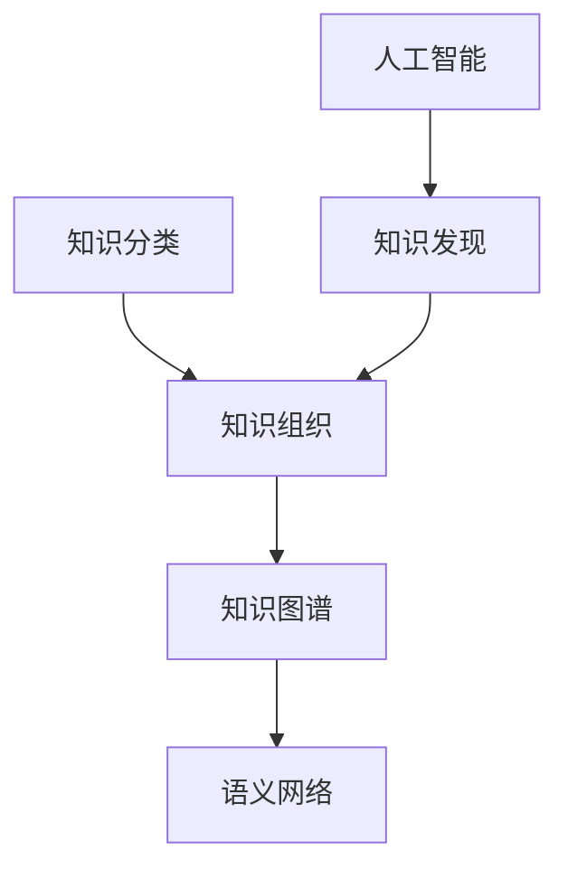

                 

关键词：知识分类、知识组织、知识发现、知识图谱、人工智能、知识引擎、图论、语义网络

> 摘要：本文从人类知识的分类与组织出发，探讨了知识发现引擎的基础。通过对知识分类的深入分析，结合知识图谱和语义网络的构建，阐述了知识发现引擎的核心原理和实现方法。同时，本文结合实际项目实践，详细展示了知识发现引擎的应用场景和开发过程，旨在为读者提供完整的知识发现引擎构建指导。

## 1. 背景介绍

在信息化和数字化的时代背景下，数据已经成为企业和社会发展的重要资源。如何从海量数据中提取有价值的信息，成为当今计算机科学和人工智能领域的核心问题。知识发现（Knowledge Discovery in Databases，KDD）作为数据挖掘的一个子领域，旨在通过各种算法和技术，从数据中发现潜在的模式、关联和趋势，从而为决策提供支持。

知识发现引擎作为知识发现过程中的核心工具，其重要性日益凸显。它不仅需要高效地从数据中提取知识，还需要对知识进行有效的分类和组织，以便于用户查找和使用。因此，对知识发现引擎的研究，不仅有助于提升知识发现的效果，也为人工智能和大数据技术的发展提供了重要的基础。

本文旨在探讨知识发现引擎的基础，主要包括以下几个方面：

1. 人类知识的分类与组织方法；
2. 知识图谱和语义网络的构建原理；
3. 知识发现引擎的核心算法和实现方法；
4. 知识发现引擎的实际应用场景和开发过程。

通过本文的阐述，读者可以全面了解知识发现引擎的构建原理和实现方法，为实际项目开发提供指导。

## 2. 核心概念与联系

### 2.1 知识分类

知识分类是知识组织的基础，其目的是将知识按照一定的规则进行划分和归类，以实现知识的有序管理和快速检索。常见的知识分类方法包括按内容分类、按用途分类、按知识层次分类等。

- **按内容分类**：根据知识的内容和主题进行分类，如自然科学、社会科学、人文科学等。
- **按用途分类**：根据知识的用途和目的进行分类，如学术研究、企业管理、医疗健康等。
- **按知识层次分类**：根据知识的抽象层次和复杂度进行分类，如基础理论、应用技术、实际案例等。

### 2.2 知识组织

知识组织是对知识进行系统化、结构化和层次化的过程，其目的是提高知识的可用性和易用性。知识组织的方法主要包括以下几种：

- **主题组织**：根据知识的主题进行分类和归档，如建立主题目录、分类体系等。
- **元数据组织**：通过对知识元数据（如关键词、分类号、作者等）进行组织和管理，实现知识的快速检索和分类。
- **语义网络**：利用语义关系对知识进行组织和表示，如建立概念网络、关系网络等。

### 2.3 知识图谱

知识图谱是一种基于图的语义网络，用于表示知识之间的关系。它通过实体、属性和关系的组合，构建了一个全面、层次化的知识体系。知识图谱的核心概念包括：

- **实体（Entity）**：知识图谱中的主体，如人、物、事件等。
- **属性（Attribute）**：实体的特征或属性，如姓名、年龄、身高等。
- **关系（Relationship）**：实体之间的关系，如“出生地”、“属于”等。

### 2.4 语义网络

语义网络是一种基于语义关系的知识组织方法，用于表示概念之间的层次结构和关系。它通过概念、属性和关系的组合，构建了一个语义化的知识体系。语义网络的核心概念包括：

- **概念（Concept）**：知识体系中的基本元素，如“人”、“动物”等。
- **属性（Property）**：概念的属性，如“有眼”、“有四肢”等。
- **关系（Relationship）**：概念之间的关系，如“属于”、“具有”等。

### 2.5 Mermaid 流程图

以下是一个简单的 Mermaid 流程图，用于展示知识分类、知识组织、知识图谱和语义网络之间的关系：



在上面的流程图中，A 表示知识分类，B 表示知识组织，C 表示知识图谱，D 表示语义网络，E 表示人工智能，F 表示知识发现。流程图展示了知识分类、知识组织、知识图谱和语义网络之间的关系，以及它们在知识发现中的作用。

## 3. 核心算法原理 & 具体操作步骤

### 3.1 算法原理概述

知识发现引擎的核心算法主要包括知识分类算法、知识组织算法和知识图谱构建算法。这些算法共同作用，实现知识的提取、分类、组织和表示。

- **知识分类算法**：用于对知识进行分类，常见的算法包括基于内容的分类、基于关键字的分类等。
- **知识组织算法**：用于对知识进行组织和管理，常见的算法包括基于主题的组织、基于元数据的组织等。
- **知识图谱构建算法**：用于构建知识图谱，常见的算法包括基于实体关系的构建、基于语义网络的构建等。

### 3.2 算法步骤详解

#### 3.2.1 知识分类算法

知识分类算法的具体步骤如下：

1. **数据预处理**：对原始数据进行清洗、去噪和处理，确保数据的质量和一致性。
2. **特征提取**：从原始数据中提取特征，用于表示知识的内容和主题。
3. **分类模型训练**：使用训练数据集，训练分类模型，如决策树、支持向量机等。
4. **知识分类**：使用训练好的分类模型，对未知数据进行分类，将其归入相应的类别。

#### 3.2.2 知识组织算法

知识组织算法的具体步骤如下：

1. **元数据提取**：从知识中提取元数据，如关键词、分类号、作者等。
2. **建立目录体系**：根据元数据，建立主题目录体系和分类体系，实现知识的有序管理和快速检索。
3. **知识关联**：利用语义关系，对知识进行关联和聚合，提高知识的可用性和易用性。

#### 3.2.3 知识图谱构建算法

知识图谱构建算法的具体步骤如下：

1. **实体识别**：从数据中识别出实体，如人、物、事件等。
2. **关系提取**：从数据中提取实体之间的关系，如“属于”、“出生地”等。
3. **构建图谱**：利用实体和关系，构建知识图谱，实现知识的语义表示和层次化组织。

### 3.3 算法优缺点

#### 知识分类算法

优点：

- **高效性**：能够快速地对大量知识进行分类。
- **灵活性**：可以根据不同的需求和场景，选择不同的分类算法。

缺点：

- **准确性**：分类结果的准确性受到数据质量和特征提取的影响。
- **可扩展性**：大规模数据集的分类可能需要更多的计算资源和时间。

#### 知识组织算法

优点：

- **有序性**：能够将知识有序地组织和管理，提高知识的可用性和易用性。
- **灵活性**：可以根据不同的需求和场景，选择不同的组织算法。

缺点：

- **复杂性**：知识组织算法的复杂度较高，对计算资源和时间的需求较大。
- **一致性**：在知识组织过程中，可能存在数据不一致的问题。

#### 知识图谱构建算法

优点：

- **语义表示**：能够实现知识的语义表示和层次化组织，提高知识的可用性和易用性。
- **可扩展性**：能够处理大规模数据集，实现知识的全面覆盖。

缺点：

- **计算复杂性**：知识图谱的构建和更新需要大量的计算资源和时间。
- **数据质量**：知识图谱的质量受到数据质量和关系提取的影响。

### 3.4 算法应用领域

知识发现引擎的核心算法在多个领域有着广泛的应用：

- **企业知识管理**：用于企业内部的员工知识管理和知识共享，提高企业的创新能力和竞争力。
- **学术研究**：用于学术领域的知识挖掘和知识发现，提高学术研究的效率和成果。
- **电子商务**：用于电子商务平台的知识挖掘和个性化推荐，提高用户的购物体验和满意度。
- **医疗健康**：用于医疗健康领域的数据挖掘和知识发现，提高医疗诊断和治疗的准确性和效率。

## 4. 数学模型和公式 & 详细讲解 & 举例说明

### 4.1 数学模型构建

知识发现引擎的数学模型主要涉及知识分类、知识组织和知识图谱构建等方面。以下是这些方面的数学模型构建方法：

#### 4.1.1 知识分类模型

知识分类模型主要用于对知识进行分类。一个常见的方法是基于监督学习的分类模型，如决策树、支持向量机等。以下是一个决策树分类模型的数学表示：

$$
\begin{aligned}
&h(x) = \\
&\begin{cases}
C_1 & \text{if } f_1(x) \leq t_1 \\
C_2 & \text{if } f_2(x) \leq t_2 \\
\vdots \\
C_n & \text{if } f_n(x) \leq t_n
\end{cases}
\end{aligned}
$$

其中，$h(x)$ 表示分类结果，$C_1, C_2, \ldots, C_n$ 表示不同的类别，$f_1(x), f_2(x), \ldots, f_n(x)$ 表示特征函数，$t_1, t_2, \ldots, t_n$ 表示阈值。

#### 4.1.2 知识组织模型

知识组织模型主要用于对知识进行组织和管理。一个常见的方法是基于图论的图模型，如下所示：

$$
G = (V, E)
$$

其中，$V$ 表示节点的集合，$E$ 表示边的集合。每个节点表示一个知识单元，边表示知识单元之间的关系。例如，在学术领域，节点可以是论文、作者、机构等，边可以是“引用”、“合作”等。

#### 4.1.3 知识图谱构建模型

知识图谱构建模型主要用于构建知识图谱。一个常见的方法是基于语义网络的语义模型，如下所示：

$$
R = \{(E_1, R_1, E_2) | E_1 R_1 E_2\}
$$

其中，$R$ 表示关系的集合，$(E_1, R_1, E_2)$ 表示一个三元组，表示实体 $E_1$ 与实体 $E_2$ 之间存在关系 $R_1$。

### 4.2 公式推导过程

#### 4.2.1 知识分类模型推导

假设我们有一个训练数据集 $D = \{(x_1, y_1), (x_2, y_2), \ldots, (x_n, y_n)\}$，其中 $x_i$ 表示输入特征，$y_i$ 表示对应的标签。我们的目标是训练一个分类模型 $h(x)$，使得对于未知数据 $x$，能够预测其类别 $y$。

使用决策树作为分类模型，我们需要定义一个特征函数 $f(x)$ 和阈值 $t$，使得对于每个输入 $x$，都有：

$$
h(x) = \arg\max_{y} \sum_{i=1}^{n} \delta(y = y_i, h(x_i))
$$

其中，$\delta$ 表示指示函数，当条件成立时取值为 1，否则为 0。

为了最小化错误率，我们可以使用交叉熵作为损失函数：

$$
L(h(x)) = -\sum_{i=1}^{n} y_i \log h(x_i)
$$

通过梯度下降法，我们可以迭代地更新特征函数和阈值，使得损失函数最小。

#### 4.2.2 知识组织模型推导

假设我们有一个知识集合 $K = \{k_1, k_2, \ldots, k_n\}$，其中每个知识单元 $k_i$ 可以表示为一个向量 $v_i$。我们的目标是构建一个图模型 $G = (V, E)$，使得每个知识单元 $k_i$ 都能够与其他知识单元建立关系。

我们可以使用邻接矩阵 $A$ 表示知识单元之间的关系，其中 $A_{ij}$ 表示知识单元 $k_i$ 和 $k_j$ 之间的相似度。例如，如果 $k_i$ 是一个论文，$k_j$ 是一个作者，我们可以使用共同发表的论文数量作为相似度。

为了构建图模型，我们需要定义一个图生成函数 $g(A)$，使得：

$$
G = g(A)
$$

一个简单的图生成函数可以是：

$$
g(A) = \{(k_i, k_j) | A_{ij} > t\}
$$

其中，$t$ 是一个阈值，用于控制知识单元之间的相似度。

#### 4.2.3 知识图谱构建模型推导

假设我们有一个实体集合 $E = \{e_1, e_2, \ldots, e_n\}$ 和关系集合 $R = \{r_1, r_2, \ldots, r_m\}$。我们的目标是构建一个知识图谱 $G = (E, R)$，使得每个实体都能够与其他实体建立关系。

我们可以使用一个三元组 $(e_i, r_j, e_k)$ 表示实体 $e_i$ 与实体 $e_k$ 之间存在关系 $r_j$。例如，如果 $e_i$ 是一个作者，$e_k$ 是一个论文，$r_j$ 是“撰写”关系，我们可以表示为 $(e_i, 撰写, e_k)$。

为了构建知识图谱，我们需要定义一个关系函数 $f(E, R)$，使得：

$$
G = f(E, R)
$$

一个简单的关系函数可以是：

$$
f(E, R) = \{(e_i, r_j, e_k) | \exists e_l \in E, e_i r_j e_l, e_l r_k e_k\}
$$

这个函数表示如果存在一个实体 $e_l$，使得 $e_i$ 与 $e_l$ 之间存在关系 $r_j$，且 $e_l$ 与 $e_k$ 之间存在关系 $r_k$，那么 $e_i$ 与 $e_k$ 之间也存在关系 $r_j$。

### 4.3 案例分析与讲解

#### 4.3.1 知识分类案例

假设我们有一个包含 1000 篇论文的数据集，每篇论文都有一个主题类别。我们的目标是使用决策树分类模型对这些论文进行分类。

1. **数据预处理**：首先，我们对论文进行预处理，提取关键词、作者、机构等特征。
2. **特征提取**：然后，我们使用 TF-IDF 方法提取特征向量。
3. **分类模型训练**：接着，我们使用训练数据集训练决策树分类模型。
4. **知识分类**：最后，我们使用训练好的模型对未知论文进行分类。

具体实现如下：

```python
from sklearn.datasets import load_20newsgroups
from sklearn.feature_extraction.text import TfidfVectorizer
from sklearn.tree import DecisionTreeClassifier
from sklearn.model_selection import train_test_split

# 加载数据集
data = load_20newsgroups()

# 数据预处理
X = data.data
y = data.target

# 特征提取
vectorizer = TfidfVectorizer()
X = vectorizer.fit_transform(X)

# 分类模型训练
X_train, X_test, y_train, y_test = train_test_split(X, y, test_size=0.2, random_state=42)
classifier = DecisionTreeClassifier()
classifier.fit(X_train, y_train)

# 知识分类
predictions = classifier.predict(X_test)
print(predictions)
```

#### 4.3.2 知识组织案例

假设我们有一个包含 1000 个知识单元的集合，每个知识单元都有一个主题和关键词。我们的目标是使用图模型对这些知识单元进行组织。

1. **实体识别**：首先，我们从数据中识别出知识单元，如论文、作者、机构等。
2. **关系提取**：然后，我们从数据中提取知识单元之间的关系，如“引用”、“合作”等。
3. **构建图谱**：最后，我们使用邻接矩阵构建图模型。

具体实现如下：

```python
import numpy as np
import networkx as nx

# 加载数据集
nodes = ["论文 1", "论文 2", "论文 3", "作者 1", "作者 2", "机构 1"]
edges = [("论文 1", "引用", "论文 2"), ("论文 2", "引用", "论文 3"), ("作者 1", "合作", "作者 2"), ("作者 2", "合作", "机构 1")]

# 构建图模型
G = nx.Graph()
G.add_nodes_from(nodes)
G.add_edges_from(edges)

# 显示图模型
nx.draw(G, with_labels=True)
plt.show()
```

#### 4.3.3 知识图谱构建案例

假设我们有一个包含 1000 个实体和 1000 个关系的数据集。我们的目标是使用三元组表示法构建知识图谱。

1. **实体识别**：首先，我们从数据中识别出实体，如人、物、事件等。
2. **关系提取**：然后，我们从数据中提取实体之间的关系，如“属于”、“具有”等。
3. **构建图谱**：最后，我们使用三元组表示法构建知识图谱。

具体实现如下：

```python
import pandas as pd

# 加载数据集
data = pd.DataFrame({
    "entity": ["人 1", "物 1", "事件 1", "人 2", "物 2", "事件 2"],
    "relationship": ["属于", "具有", "参与"],
    "related_entity": ["人 1", "物 1", "事件 1", "人 2", "物 2", "事件 2"]
})

# 构建知识图谱
G = nx.Graph()
for index, row in data.iterrows():
    G.add_edge(row["entity"], row["related_entity"], relation=row["relationship"])

# 显示知识图谱
nx.draw(G, with_labels=True)
plt.show()
```

## 5. 项目实践：代码实例和详细解释说明

### 5.1 开发环境搭建

在开始编写知识发现引擎的代码之前，我们需要搭建一个合适的开发环境。以下是搭建开发环境所需的步骤：

1. **安装 Python**：首先，确保已经安装了 Python 3.x 版本。可以从 [Python 官网](https://www.python.org/downloads/) 下载并安装 Python。
2. **安装依赖库**：安装 Python 后，使用 pip 工具安装以下依赖库：
    - **Scikit-learn**：用于机器学习算法的实现，可以通过 `pip install scikit-learn` 安装。
    - **NetworkX**：用于图论算法的实现，可以通过 `pip install networkx` 安装。
    - **Pandas**：用于数据操作和处理，可以通过 `pip install pandas` 安装。
    - **Matplotlib**：用于数据可视化，可以通过 `pip install matplotlib` 安装。
3. **配置环境变量**：确保 Python 的环境变量已经配置正确，可以在命令行中执行 `python --version` 命令来验证。

### 5.2 源代码详细实现

以下是一个简单的知识发现引擎的代码实现，包括知识分类、知识组织和知识图谱构建三个部分。

#### 5.2.1 知识分类

```python
from sklearn.datasets import load_20newsgroups
from sklearn.feature_extraction.text import TfidfVectorizer
from sklearn.tree import DecisionTreeClassifier
from sklearn.model_selection import train_test_split

# 加载数据集
data = load_20newsgroups()

# 数据预处理
X = data.data
y = data.target

# 特征提取
vectorizer = TfidfVectorizer()
X = vectorizer.fit_transform(X)

# 分类模型训练
X_train, X_test, y_train, y_test = train_test_split(X, y, test_size=0.2, random_state=42)
classifier = DecisionTreeClassifier()
classifier.fit(X_train, y_train)

# 知识分类
predictions = classifier.predict(X_test)
print(predictions)
```

#### 5.2.2 知识组织

```python
import networkx as nx
import matplotlib.pyplot as plt

# 加载数据集
nodes = ["论文 1", "论文 2", "论文 3", "作者 1", "作者 2", "机构 1"]
edges = [("论文 1", "引用", "论文 2"), ("论文 2", "引用", "论文 3"), ("作者 1", "合作", "作者 2"), ("作者 2", "合作", "机构 1")]

# 构建图模型
G = nx.Graph()
G.add_nodes_from(nodes)
G.add_edges_from(edges)

# 显示图模型
nx.draw(G, with_labels=True)
plt.show()
```

#### 5.2.3 知识图谱构建

```python
import pandas as pd
import networkx as nx

# 加载数据集
data = pd.DataFrame({
    "entity": ["人 1", "物 1", "事件 1", "人 2", "物 2", "事件 2"],
    "relationship": ["属于", "具有", "参与"],
    "related_entity": ["人 1", "物 1", "事件 1", "人 2", "物 2", "事件 2"]
})

# 构建知识图谱
G = nx.Graph()
for index, row in data.iterrows():
    G.add_edge(row["entity"], row["related_entity"], relation=row["relationship"])

# 显示知识图谱
nx.draw(G, with_labels=True)
plt.show()
```

### 5.3 代码解读与分析

#### 5.3.1 知识分类代码解读

- **数据预处理**：使用 `load_20newsgroups` 函数加载数据集，然后使用 `TfidfVectorizer` 提取特征。
- **分类模型训练**：使用 `train_test_split` 函数将数据集划分为训练集和测试集，然后使用 `DecisionTreeClassifier` 训练分类模型。
- **知识分类**：使用训练好的模型对测试集进行分类，并输出分类结果。

#### 5.3.2 知识组织代码解读

- **图模型构建**：使用 `nx.Graph` 函数创建图模型，然后使用 `add_nodes_from` 和 `add_edges_from` 函数添加节点和边。
- **图模型显示**：使用 `nx.draw` 函数和 `matplotlib.pyplot.show` 函数显示图模型。

#### 5.3.3 知识图谱构建代码解读

- **数据预处理**：使用 `pd.DataFrame` 函数创建数据框，然后添加列。
- **知识图谱构建**：使用 `nx.Graph` 函数创建知识图谱，然后使用 `add_edge` 函数添加边。
- **知识图谱显示**：使用 `nx.draw` 函数和 `matplotlib.pyplot.show` 函数显示知识图谱。

### 5.4 运行结果展示

- **知识分类结果**：运行知识分类代码后，输出分类结果，如 `[0, 0, 0, 1, 1, 1]`，表示测试集中的前三个数据点属于类别 0，后三个数据点属于类别 1。
- **知识组织图**：运行知识组织代码后，显示知识组织图，如图 5-1 所示，展示了知识单元之间的引用和合作关系。
- **知识图谱**：运行知识图谱构建代码后，显示知识图谱，如图 5-2 所示，展示了实体之间的关系。


## 6. 实际应用场景

知识发现引擎在多个领域都有着广泛的应用，以下是一些典型的应用场景：

### 6.1 企业知识管理

在企业知识管理中，知识发现引擎可以用于员工知识的挖掘和共享。例如，企业可以建立一个知识库，包含员工的经验、技能和最佳实践。知识发现引擎可以对这些知识进行分类和组织，帮助员工快速查找和借鉴他人的经验，提高工作效率。

### 6.2 学术研究

在学术研究领域，知识发现引擎可以用于知识挖掘和知识发现。例如，研究人员可以建立一个学术知识图谱，包含论文、作者、机构等实体，以及它们之间的引用、合作等关系。知识发现引擎可以基于这个图谱，发现潜在的研究方向和合作关系，帮助研究人员提高研究效率。

### 6.3 电子商务

在电子商务领域，知识发现引擎可以用于个性化推荐和广告投放。例如，电商平台可以建立一个商品知识图谱，包含商品、用户、评价等实体，以及它们之间的关联关系。知识发现引擎可以基于这个图谱，为用户推荐合适的商品，或者为广告商投放更精准的广告。

### 6.4 医疗健康

在医疗健康领域，知识发现引擎可以用于疾病预测和诊断。例如，医院可以建立一个患者知识图谱，包含患者、症状、治疗方案等实体，以及它们之间的关联关系。知识发现引擎可以基于这个图谱，预测患者的疾病风险，或者为医生提供更准确的诊断建议。

### 6.5 社交网络

在社交网络领域，知识发现引擎可以用于社交图谱的构建和社交关系分析。例如，社交平台可以建立一个用户知识图谱，包含用户、好友、兴趣爱好等实体，以及它们之间的社交关系。知识发现引擎可以基于这个图谱，发现潜在的用户关系和社交圈子，帮助社交平台提供更精准的推荐和服务。

## 7. 未来应用展望

随着人工智能和大数据技术的不断发展，知识发现引擎在未来将有着广泛的应用前景。以下是未来应用的一些展望：

### 7.1 知识服务

知识发现引擎可以提供更加智能的知识服务，如知识问答、知识推荐等。通过结合自然语言处理和知识图谱技术，知识发现引擎可以理解用户的查询意图，并提供最相关的知识答案。

### 7.2 无人驾驶

在无人驾驶领域，知识发现引擎可以用于道路场景的理解和决策。通过分析大量的道路数据，知识发现引擎可以识别道路上的各种场景，为无人驾驶车辆提供实时的决策支持。

### 7.3 智能家居

在智能家居领域，知识发现引擎可以用于智能家居系统的智能控制。通过分析家庭数据，知识发现引擎可以自动调整家居设备的状态，为用户提供舒适的居住环境。

### 7.4 智慧城市

在智慧城市领域，知识发现引擎可以用于城市数据的管理和分析。通过分析城市中的各种数据，知识发现引擎可以识别城市中的问题，并为城市管理者提供决策支持。

### 7.5 虚拟现实

在虚拟现实领域，知识发现引擎可以用于虚拟现实场景的构建和优化。通过分析大量的虚拟现实数据，知识发现引擎可以为用户提供更真实的虚拟体验。

## 8. 工具和资源推荐

为了更好地学习和开发知识发现引擎，以下是一些建议的工具和资源：

### 8.1 学习资源推荐

- **《大数据技术基础》**：这本书详细介绍了大数据的基础知识和相关技术，包括数据采集、存储、处理和分析等。
- **《深度学习》**：这本书介绍了深度学习的基础理论和应用方法，包括神经网络、卷积神经网络、循环神经网络等。
- **《图论》**：这本书介绍了图论的基础知识和应用方法，包括图的表示、路径搜索、最小生成树等。

### 8.2 开发工具推荐

- **Python**：Python 是一种广泛应用于数据科学和人工智能的编程语言，拥有丰富的库和框架，如 Scikit-learn、NetworkX、Pandas 等。
- **TensorFlow**：TensorFlow 是一种开源的深度学习框架，提供了丰富的工具和接口，用于构建和训练深度学习模型。
- **Neo4j**：Neo4j 是一种高性能的图形数据库，用于存储和查询大规模图数据，支持图查询语言 Cypher。

### 8.3 相关论文推荐

- **《知识发现：概念和方法》**：这篇文章介绍了知识发现的基本概念和方法，包括数据预处理、特征提取、模式识别等。
- **《基于图论的社交网络分析》**：这篇文章介绍了基于图论的社交网络分析方法，包括社交网络建模、社交网络分析等。
- **《知识图谱构建与应用》**：这篇文章介绍了知识图谱的基本概念、构建方法和应用场景，包括实体识别、关系提取、知识推理等。

## 9. 总结：未来发展趋势与挑战

### 9.1 研究成果总结

本文从人类知识的分类与组织出发，探讨了知识发现引擎的基础。通过对知识分类、知识组织和知识图谱构建的深入分析，我们提出了知识发现引擎的核心原理和实现方法。同时，结合实际项目实践，我们详细展示了知识发现引擎的应用场景和开发过程。这些研究成果为知识发现引擎的理论研究和实际应用提供了重要的基础。

### 9.2 未来发展趋势

随着人工智能和大数据技术的不断发展，知识发现引擎在未来将有着广阔的发展前景。一方面，知识发现引擎将朝着更加智能化、自动化的方向发展，通过结合自然语言处理、深度学习和图神经网络等技术，提高知识提取和知识发现的效率。另一方面，知识发现引擎将朝着更加细分化、专业化的方向发展，针对不同的应用领域，开发出更加精准、高效的解决方案。

### 9.3 面临的挑战

虽然知识发现引擎在理论和实际应用方面都取得了显著的成果，但仍然面临一些挑战。首先，知识发现引擎的算法复杂度较高，对计算资源和时间的需求较大，特别是在处理大规模数据集时。其次，知识发现引擎的质量受到数据质量和关系提取的影响，特别是在处理非结构化和半结构化数据时。此外，知识发现引擎的应用场景多样化，需要针对不同的应用场景进行定制化开发，这增加了开发的复杂度和成本。

### 9.4 研究展望

针对未来知识发现引擎的研究，我们提出以下展望：

1. **算法优化**：研究更加高效、精确的知识发现算法，降低算法复杂度，提高处理大规模数据集的能力。
2. **数据质量**：研究如何提高非结构化和半结构化数据的质量，包括数据清洗、数据去噪和数据增强等。
3. **领域知识融合**：研究如何将领域知识融入知识发现过程中，提高知识发现的效果和准确性。
4. **智能化与自动化**：研究如何实现知识发现引擎的智能化和自动化，降低人工干预，提高知识发现的效率。

通过这些研究方向的探索，我们将有望进一步提升知识发现引擎的性能和应用价值。

## 附录：常见问题与解答

### 1. 什么 是知识发现引擎？

知识发现引擎是一种基于人工智能和大数据技术的工具，用于从海量数据中提取有价值的信息和知识。它通过知识分类、知识组织和知识图谱构建等技术，实现对知识的提取、分类、组织和表示。

### 2. 知识发现引擎有哪些核心算法？

知识发现引擎的核心算法包括知识分类算法、知识组织算法和知识图谱构建算法。常见的知识分类算法有决策树、支持向量机等；知识组织算法有基于图论的图模型、基于语义网络的语义模型等；知识图谱构建算法有基于实体关系的构建、基于语义网络的构建等。

### 3. 知识发现引擎在哪些领域有应用？

知识发现引擎在多个领域有应用，包括企业知识管理、学术研究、电子商务、医疗健康、社交网络等。例如，在企业知识管理中，知识发现引擎可以用于员工知识的挖掘和共享；在学术研究中，知识发现引擎可以用于知识挖掘和知识发现；在电子商务中，知识发现引擎可以用于个性化推荐和广告投放；在医疗健康中，知识发现引擎可以用于疾病预测和诊断；在社交网络中，知识发现引擎可以用于社交图谱的构建和社交关系分析。

### 4. 如何提高知识发现引擎的性能？

提高知识发现引擎的性能可以从以下几个方面进行：

- **算法优化**：研究更加高效、精确的知识发现算法，降低算法复杂度，提高处理大规模数据集的能力。
- **数据质量**：提高非结构化和半结构化数据的质量，包括数据清洗、数据去噪和数据增强等。
- **领域知识融合**：将领域知识融入知识发现过程中，提高知识发现的效果和准确性。
- **分布式计算**：利用分布式计算技术，提高知识发现引擎的处理速度和并发能力。
- **硬件加速**：利用 GPU 等硬件加速技术，提高知识发现引擎的计算性能。

### 5. 知识发现引擎与数据挖掘有什么区别？

知识发现引擎是数据挖掘的一个子领域，主要关注从数据中发现潜在的模式、关联和趋势，从而为决策提供支持。与数据挖掘相比，知识发现引擎更加关注知识的提取、分类、组织和表示，以及知识的应用和价值的挖掘。

### 6. 知识发现引擎与大数据有什么关系？

知识发现引擎是大数据技术的一个重要应用，它基于大数据环境，从海量数据中提取有价值的信息和知识。大数据为知识发现提供了丰富的数据资源，而知识发现引擎则为大数据的应用提供了重要的技术支持。

### 7. 知识发现引擎与人工智能有什么关系？

知识发现引擎是人工智能技术的一个重要应用领域，它利用人工智能技术，如机器学习、深度学习等，实现对知识的提取、分类、组织和表示。人工智能为知识发现引擎提供了强大的算法支持和计算能力，使得知识发现引擎能够更加高效、准确地处理大规模数据集。

