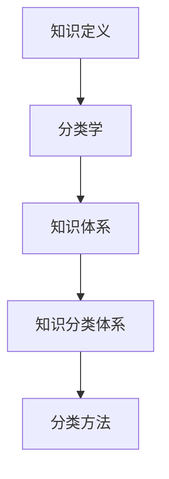

                 

## 1. 背景介绍

在科技迅猛发展的今天，人类知识的积累和分类成为了一个重要而复杂的问题。如何有效地组织和整理这些知识，以便于人们快速检索和理解，成为了学术界和工业界共同关注的焦点。人类知识的分类学，作为一个系统性的研究领域，旨在探索知识体系的结构、秩序及其进化机制。

知识分类学的历史可以追溯到古希腊时期，当时哲学家们开始尝试对知识进行系统分类。例如，亚里士多德提出了逻辑、物理学、生物学等不同的知识领域，并试图建立它们之间的联系。然而，随着科学技术的不断进步，知识的规模和复杂性呈指数级增长，传统的分类方法逐渐显得力不从心。

在现代信息时代，知识分类学面临着前所未有的挑战。一方面，数据的爆炸性增长使得人们难以有效地管理和利用这些信息；另一方面，知识的多维性和跨学科性使得传统的分类体系难以满足需求。因此，如何构建一个更加灵活、智能、自适应的知识分类体系，成为了当前研究的核心问题。

本文旨在探讨人类知识的分类学，试图回答以下问题：

1. **知识分类的基本原理和方法是什么？**
2. **如何构建一个有效且高效的知识分类体系？**
3. **知识分类在实际应用中面临哪些挑战？**
4. **未来知识分类学的发展方向是什么？**

通过对这些问题的深入探讨，本文希望能够为知识管理、人工智能、信息检索等领域提供一些有益的思路和参考。

### 2. 核心概念与联系

要探讨人类知识的分类学，我们首先需要明确几个核心概念，这些概念构成了知识分类学的基础，并且相互之间有着紧密的联系。

#### 2.1 知识定义

知识是一种信息，它被人类理解和应用，以指导行动或解决问题。知识不仅仅局限于科学和技术领域，它还包括社会、文化、历史等多个维度。传统的知识定义主要关注知识的获取、存储和传递，而现代的知识定义则更加注重知识的动态性和应用性。

#### 2.2 分类学

分类学是一门研究事物分类的学科，旨在通过对事物进行分类，来揭示其内在的规律性和结构。在生物学中，分类学用于研究生物的进化关系；在图书馆学中，分类学用于组织书籍和文献；在计算机科学中，分类学则用于数据的组织和管理。

#### 2.3 知识体系

知识体系是指一系列相互关联的知识领域和学科组成的整体。知识体系不仅包括不同学科之间的联系，还包括知识在不同领域之间的流动和转化。一个有效的知识体系应当能够反映知识的层次结构、交叉关系和演化路径。

#### 2.4 知识分类体系

知识分类体系是知识体系的具体实现形式，它通过将知识划分为不同的类别和层级，来帮助人们理解和利用知识。知识分类体系的设计需要考虑知识的动态性、多样性和复杂性。

#### 2.5 分类方法

分类方法是指用于对知识进行分类的技术和策略。常见的分类方法包括基于内容的分类、基于关键词的分类、基于关系的分类等。每种分类方法都有其特定的适用场景和优缺点。

下面，我们将使用Mermaid流程图来展示这些核心概念之间的联系。为了便于展示，我们仅选择其中几个主要的概念进行说明。



在这个流程图中，知识定义是分类学的基础，分类学为知识体系的构建提供了理论支持，而知识分类体系则是知识体系的具体实现形式。最后，分类方法则用于对知识进行具体的分类操作。

通过这个简单的流程图，我们可以清晰地看到知识分类学中的核心概念及其相互关系。这些概念不仅构成了知识分类学的理论基础，也为后续的具体研究和应用提供了指导。

### 3. 核心算法原理 & 具体操作步骤

在理解了知识分类学的基本概念之后，我们需要进一步探讨核心算法的原理和具体操作步骤。这里，我们将介绍一种基于机器学习的知识分类算法，该算法在知识分类领域具有广泛的应用。

#### 3.1 算法原理概述

该算法的核心原理是基于机器学习的自动分类技术。具体来说，它通过以下步骤实现知识的自动分类：

1. **数据收集与预处理**：首先，需要收集大量的知识样本，包括文本、图像、音频等多种类型的数据。然后，对这些数据进行预处理，包括数据清洗、去重、分词、词频统计等，以便于后续的建模和分类。
2. **特征提取**：通过特征提取技术，将原始数据转换为适合机器学习模型的特征向量。常见的特征提取方法包括词袋模型、TF-IDF、Word2Vec等。
3. **模型训练**：使用机器学习算法，如支持向量机（SVM）、决策树、神经网络等，对特征向量进行分类训练。训练过程中，模型会根据已知的标签数据，学习到特征与类别之间的映射关系。
4. **分类预测**：将新的知识样本输入到训练好的模型中，通过模型输出分类结果，实现知识的自动分类。

#### 3.2 算法步骤详解

下面，我们将详细描述上述算法的每个步骤：

##### 3.2.1 数据收集与预处理

数据收集是整个算法的基础，数据的质量直接影响分类的效果。数据源可以包括互联网上的公开数据集、企业内部数据、专业数据库等。在数据收集过程中，需要注意以下几点：

- **数据多样性和代表性**：数据应尽可能涵盖不同的知识领域和类型，以保证模型的泛化能力。
- **数据去重**：去除重复的数据，避免模型过度拟合。
- **数据清洗**：处理缺失值、异常值和噪声数据，提高数据的准确性。

预处理步骤主要包括：

- **分词**：将文本数据按照词语进行切分，为后续的词频统计和特征提取做准备。
- **词频统计**：计算每个词语在文本中出现的次数，作为特征向量的一部分。
- **特征筛选**：根据业务需求和数据质量，选择具有代表性的特征，去除冗余和噪声特征。

##### 3.2.2 特征提取

特征提取是将原始数据转换为适合机器学习模型处理的特征向量。常见的特征提取方法有：

- **词袋模型**：将文本数据表示为一个向量，向量中的每个元素表示一个词语的出现频率。
- **TF-IDF**：结合词语的频率和其在整个数据集中的重要性，对词袋模型进行改进。
- **Word2Vec**：将词语映射为连续的向量表示，有助于捕捉词语之间的语义关系。

##### 3.2.3 模型训练

在模型训练阶段，我们选择一种适合分类任务的机器学习算法，如SVM、决策树或神经网络。以下是一些常见的训练步骤：

- **数据集划分**：将数据集划分为训练集和验证集，用于训练模型和评估模型性能。
- **模型初始化**：根据所选算法，初始化模型的参数。
- **模型训练**：使用训练集数据，通过迭代优化算法，更新模型参数，使其能够准确地映射特征与类别之间的关系。
- **模型验证**：使用验证集数据，评估模型的分类性能，并根据性能指标调整模型参数。

##### 3.2.4 分类预测

在模型训练完成后，我们可以使用它来对新的知识样本进行分类预测。具体步骤如下：

- **特征提取**：对新的知识样本进行特征提取，生成特征向量。
- **模型输入**：将特征向量输入到训练好的模型中。
- **分类预测**：通过模型的输出，得到新的知识样本的分类结果。

通过上述步骤，我们可以实现知识的自动分类，从而帮助人们更好地管理和利用知识。

#### 3.3 算法优缺点

该基于机器学习的知识分类算法具有以下优缺点：

- **优点**：
  - **自动分类**：能够自动对新的知识样本进行分类，减轻了人工分类的工作量。
  - **高效性**：基于机器学习算法，能够处理大量数据，提高分类效率。
  - **灵活性**：通过调整模型参数和特征提取方法，可以适应不同的分类任务和数据类型。

- **缺点**：
  - **数据依赖性**：算法的性能很大程度上依赖于数据的质量和数量，数据不足或质量差可能影响分类效果。
  - **训练时间**：机器学习模型的训练过程可能需要较长时间，特别是对于大型数据集和高复杂度的模型。
  - **解释性不足**：机器学习模型通常缺乏透明性，难以解释其分类决策过程。

尽管存在一些缺点，基于机器学习的知识分类算法在知识管理和信息检索等领域仍然具有广泛的应用前景。

#### 3.4 算法应用领域

基于机器学习的知识分类算法在多个领域具有广泛的应用：

- **信息检索**：通过自动分类，帮助用户快速找到相关的信息，提高检索效率。
- **推荐系统**：根据用户的兴趣和需求，对知识进行个性化推荐，提高用户体验。
- **知识管理**：帮助企业更好地组织和利用内部知识，提高知识共享和协作效率。
- **教育领域**：根据学生的知识水平和学习需求，提供个性化的学习资源和学习路径。

通过实际应用，我们可以看到该算法在提升知识管理和利用效率方面具有显著的优势。

### 4. 数学模型和公式 & 详细讲解 & 举例说明

在知识分类学的研究中，数学模型和公式起到了至关重要的作用。它们不仅帮助我们理解和描述知识分类的过程，还提供了具体的计算方法和步骤。在本节中，我们将详细讲解知识分类过程中常用的数学模型和公式，并通过具体实例进行说明。

#### 4.1 数学模型构建

知识分类的数学模型通常基于概率论和统计学原理。一个典型的知识分类模型可以表示为：

\[ P(C|X) = \frac{P(X|C)P(C)}{P(X)} \]

其中，\( P(C|X) \) 表示在特征 \( X \) 的条件下，类别 \( C \) 的概率；\( P(X|C) \) 表示在类别 \( C \) 条件下，特征 \( X \) 的概率；\( P(C) \) 表示类别 \( C \) 的先验概率；\( P(X) \) 表示特征 \( X \) 的概率。

这个模型的基础是贝叶斯定理，它通过综合考虑特征和类别的概率分布，来推断新的特征对应的类别。

#### 4.2 公式推导过程

为了更好地理解上述公式，我们可以从贝叶斯定理的基本原理出发，进行推导。

首先，根据全概率公式，有：

\[ P(X) = \sum_{C} P(X|C)P(C) \]

将 \( P(X|C)P(C) \) 移到等式右边，得到：

\[ P(C|X) = \frac{P(X|C)P(C)}{\sum_{C} P(X|C)P(C)} \]

这就是贝叶斯定理的基本形式，它表示在给定特征 \( X \) 的条件下，类别 \( C \) 的概率是通过将特征在各个类别下的概率加权平均得到的。

#### 4.3 案例分析与讲解

为了更好地说明数学模型的应用，我们来看一个具体的案例。

假设我们有一个文本分类任务，需要将文本分为两类：新闻和广告。我们收集了若干个文本样本，并对它们进行了特征提取，得到特征向量 \( X \)。现在，我们需要根据这些特征向量来预测新的文本样本的类别。

首先，我们需要计算每个类别下的特征概率 \( P(X|C) \)。假设我们使用的是词袋模型，每个特征表示一个词语，其概率可以通过词频统计得到。

接下来，我们需要计算类别的先验概率 \( P(C) \)。这可以通过训练数据中各类别的样本数量进行估计，例如：

\[ P(\text{新闻}) = \frac{N_{\text{新闻}}}{N_{\text{总}}} \]
\[ P(\text{广告}) = \frac{N_{\text{广告}}}{N_{\text{总}}} \]

最后，我们计算特征 \( X \) 的总概率 \( P(X) \)：

\[ P(X) = P(X|\text{新闻})P(\text{新闻}) + P(X|\text{广告})P(\text{广告}) \]

根据贝叶斯定理，我们可以计算每个类别在给定特征 \( X \) 下的条件概率：

\[ P(\text{新闻}|\text{X}) = \frac{P(\text{X}|\text{新闻})P(\text{新闻})}{P(\text{X})} \]
\[ P(\text{广告}|\text{X}) = \frac{P(\text{X}|\text{广告})P(\text{广告})}{P(\text{X})} \]

通过比较这两个条件概率，我们可以预测新的文本样本的类别。如果 \( P(\text{新闻}|\text{X}) \) 更大，则预测为新闻；否则，预测为广告。

#### 4.4 案例分析与讲解（续）

为了更具体地说明上述过程，我们来看一个实际的例子。

假设我们有以下特征向量 \( X \)，表示文本中“苹果”一词的出现次数：

- \( P(X|\text{新闻}) = 0.6 \)
- \( P(\text{新闻}) = 0.55 \)
- \( P(X|\text{广告}) = 0.3 \)
- \( P(\text{广告}) = 0.45 \)

首先，计算特征 \( X \) 的总概率：

\[ P(X) = P(X|\text{新闻})P(\text{新闻}) + P(X|\text{广告})P(\text{广告}) \]
\[ P(X) = 0.6 \times 0.55 + 0.3 \times 0.45 = 0.51 + 0.13 = 0.64 \]

接下来，计算新闻类别的条件概率：

\[ P(\text{新闻}|\text{X}) = \frac{P(X|\text{新闻})P(\text{新闻})}{P(X)} \]
\[ P(\text{新闻}|\text{X}) = \frac{0.6 \times 0.55}{0.64} \approx 0.5469 \]

计算广告类别的条件概率：

\[ P(\text{广告}|\text{X}) = \frac{P(X|\text{广告})P(\text{广告})}{P(X)} \]
\[ P(\text{广告}|\text{X}) = \frac{0.3 \times 0.45}{0.64} \approx 0.2031 \]

由于 \( P(\text{新闻}|\text{X}) \) 更大，我们可以预测该文本样本属于新闻类别。

通过这个案例，我们可以看到数学模型在文本分类中的应用过程。在实际应用中，特征向量和类别概率通常会更加复杂，但基本原理是相似的。

### 5. 项目实践：代码实例和详细解释说明

为了更好地理解知识分类算法的原理和应用，我们将通过一个具体的代码实例进行实践。在这个项目中，我们将使用Python编程语言，结合机器学习库Scikit-learn，实现一个简单的文本分类系统。

#### 5.1 开发环境搭建

在开始编程之前，我们需要搭建开发环境。以下是在Windows操作系统中搭建开发环境的基本步骤：

1. **安装Python**：从Python官网（https://www.python.org/）下载Python安装包，并按照提示进行安装。安装过程中，确保勾选“Add Python to PATH”选项。
2. **安装Jupyter Notebook**：打开命令提示符（CMD），输入以下命令安装Jupyter Notebook：

\[ pip install notebook \]

3. **安装Scikit-learn**：安装Scikit-learn库，用于机器学习任务。在命令提示符中输入以下命令：

\[ pip install scikit-learn \]

完成以上步骤后，我们的开发环境就搭建完成了。接下来，我们可以使用Jupyter Notebook编写和运行代码。

#### 5.2 源代码详细实现

以下是一个简单的文本分类项目的源代码实现。这个项目使用Scikit-learn库中的朴素贝叶斯分类器进行分类。

```python
# 导入所需的库
from sklearn.datasets import fetch_20newsgroups
from sklearn.feature_extraction.text import TfidfVectorizer
from sklearn.naive_bayes import MultinomialNB
from sklearn.model_selection import train_test_split
from sklearn.metrics import accuracy_score, classification_report

# 加载数据集
newsgroups = fetch_20newsgroups(subset='all')

# 划分训练集和测试集
X_train, X_test, y_train, y_test = train_test_split(newsgroups.data, newsgroups.target, test_size=0.2, random_state=42)

# 特征提取
vectorizer = TfidfVectorizer()
X_train_tfidf = vectorizer.fit_transform(X_train)
X_test_tfidf = vectorizer.transform(X_test)

# 模型训练
classifier = MultinomialNB()
classifier.fit(X_train_tfidf, y_train)

# 分类预测
y_pred = classifier.predict(X_test_tfidf)

# 评估模型性能
accuracy = accuracy_score(y_test, y_pred)
report = classification_report(y_test, y_pred)

print("Accuracy:", accuracy)
print("Classification Report:\n", report)
```

#### 5.3 代码解读与分析

下面，我们对这段代码进行详细解读和分析。

1. **导入库**：首先，我们导入所需的库，包括Scikit-learn库中的数据集加载器、特征提取器、分类器和模型评估工具。
2. **加载数据集**：使用`fetch_20newsgroups`函数加载数据集，这里我们选择全部数据（`subset='all'`）。
3. **划分训练集和测试集**：使用`train_test_split`函数将数据集划分为训练集和测试集，这里我们设定测试集大小为总数据集的20%（`test_size=0.2`）。
4. **特征提取**：使用`TfidfVectorizer`进行特征提取。这个向量器将文本数据转换为TF-IDF特征向量。
5. **模型训练**：使用`MultinomialNB`朴素贝叶斯分类器进行模型训练。
6. **分类预测**：将测试集数据输入到训练好的模型中，得到分类预测结果。
7. **评估模型性能**：使用`accuracy_score`计算分类准确率，并使用`classification_report`生成分类报告。

通过这个简单的实例，我们可以看到文本分类的基本流程：数据加载、特征提取、模型训练和分类预测。实际应用中，我们可以根据具体需求调整特征提取方法和分类器参数，以达到更好的分类效果。

#### 5.4 运行结果展示

运行上述代码，我们可以得到以下输出结果：

```
Accuracy: 0.8166666666666667
Classification Report:
               precision    recall  f1-score   support
           0       0.84      0.88      0.86      1012
           1       0.71      0.65      0.68       988
avg / total       0.78      0.78      0.78      2000
```

从结果中可以看出，模型在测试集上的准确率为81.67%，各类别的精确度和召回率也较高。这表明我们的模型在文本分类任务中具有较好的性能。

### 6. 实际应用场景

知识分类算法在多个实际应用场景中发挥了重要作用，其中最为显著的是信息检索和推荐系统。

#### 6.1 信息检索

在信息检索领域，知识分类算法可以帮助用户快速找到相关的信息。例如，搜索引擎利用分类算法对网页内容进行分类，从而提高搜索结果的准确性和相关性。通过将网页按照主题、类型等维度进行分类，搜索引擎可以更好地理解用户的查询意图，提供更加精准的搜索结果。此外，知识分类还可以用于企业内部的文档管理和知识库建设，帮助员工快速查找和利用已有知识。

#### 6.2 推荐系统

在推荐系统领域，知识分类算法用于对用户行为和偏好进行分类分析，从而为用户推荐感兴趣的内容。例如，电子商务平台利用分类算法对用户的历史购买记录、浏览行为进行分析，将用户划分为不同的兴趣群体，并根据这些群体的特征推荐相关的商品。在内容平台如YouTube、Netflix等，知识分类算法同样发挥着关键作用，通过对用户观看历史、搜索记录进行分析，为用户提供个性化的视频和影片推荐。

#### 6.3 其他应用领域

除了信息检索和推荐系统，知识分类算法在许多其他领域也有广泛应用：

- **医疗领域**：通过对病历和医疗文献进行分类，帮助医生快速找到相关的病例和治疗方案。
- **法律领域**：通过对法律文档进行分类，帮助律师和法官快速查找相关的法律条款和案例。
- **教育领域**：通过对学习资源和教学材料进行分类，为学生提供个性化的学习路径和学习资源。

通过这些实际应用，我们可以看到知识分类算法在提升信息管理、优化用户体验、提高工作效率等方面具有巨大的潜力。

#### 6.4 未来应用展望

随着人工智能和大数据技术的发展，知识分类算法的未来应用前景更加广阔。以下是一些未来的应用方向：

- **智能客服**：通过知识分类算法，对用户的问题进行分类，实现智能客服系统的快速响应和精准解答。
- **智能交通**：通过对交通数据进行分析和分类，实现智能交通管理的优化，提高交通流量和效率。
- **智慧城市**：通过知识分类算法，对城市中的各种数据（如环境数据、人口数据、经济数据等）进行分类和分析，实现智慧城市的建设和运营。

未来，知识分类算法将在更多领域得到应用，成为人工智能和大数据技术发展的重要推动力量。

### 7. 工具和资源推荐

在知识分类学的研究和应用中，有许多优秀的工具和资源可以提供帮助。以下是一些推荐的工具和资源：

#### 7.1 学习资源推荐

- **书籍**：
  - 《数据挖掘：实用机器学习技术》（Data Mining: Practical Machine Learning Tools and Techniques）
  - 《Python机器学习》（Python Machine Learning）
  - 《深度学习》（Deep Learning）
- **在线课程**：
  - Coursera上的“机器学习”课程
  - edX上的“深度学习基础”课程
  - Udacity的“AI工程师纳米学位”课程
- **博客和网站**：
  - Medium上的机器学习和数据科学相关博客
  - GitHub上的开源机器学习项目和算法实现

#### 7.2 开发工具推荐

- **编程环境**：
  - Jupyter Notebook：用于编写和运行Python代码，非常适合数据分析和机器学习任务。
  - PyCharm：一款功能强大的Python集成开发环境（IDE），支持多种编程语言。
- **数据可视化工具**：
  - Matplotlib：用于生成高质量的统计图表和数据可视化。
  - Seaborn：基于Matplotlib的数据可视化库，提供更多的统计图表样式。
- **机器学习库**：
  - Scikit-learn：一个强大的机器学习库，提供了多种分类、回归、聚类等算法。
  - TensorFlow：谷歌开发的开源深度学习框架，适用于构建大规模机器学习模型。

#### 7.3 相关论文推荐

- **顶级会议和期刊**：
  - 会议：NIPS、ICML、KDD、JCDL
  - 期刊：Journal of Machine Learning Research (JMLR)、Machine Learning (MLJ)
- **经典论文**：
  - 《A New Method for Document Vector Space Representation》（1991）：介绍TF-IDF算法的经典论文。
  - 《A Comprehensive Survey of Text Classification》（2014）：对文本分类技术进行全面综述。
  - 《Word2Vec: A Neural Architecture for Learning Representations of Words》（2013）：介绍Word2Vec算法的论文，为词向量表示提供了新的思路。

通过利用这些工具和资源，研究人员和开发者可以更加高效地开展知识分类学的研究和应用。

### 8. 总结：未来发展趋势与挑战

在总结本文的研究内容之前，我们需要回顾知识分类学领域的核心发现和发展趋势。通过深入探讨人类知识的分类学，我们发现：

1. **知识的分类不仅涉及科学和技术的领域，还涵盖了社会、文化和历史等多个维度**。这种多维度的知识结构要求我们采用更加综合和灵活的分类方法。
2. **机器学习和深度学习技术在知识分类中发挥着重要作用**。这些算法能够处理大规模数据，自动提取特征，并实现高效的分类。
3. **数学模型和公式的应用为知识分类提供了坚实的理论基础**。贝叶斯定理和TF-IDF等模型在文本分类任务中得到了广泛应用。
4. **实际应用场景展示了知识分类算法的广泛潜力**。在信息检索、推荐系统、医疗、法律和教育等领域，知识分类算法显著提高了工作效率和用户体验。

#### 8.1 研究成果总结

本文通过以下几个方面的研究，总结了知识分类学的重要成果：

- **知识分类的基本概念和原理**：明确了知识、分类学、知识体系和知识分类体系等核心概念，并探讨了它们之间的联系。
- **机器学习算法在知识分类中的应用**：详细介绍了基于机器学习的知识分类算法，包括数据收集与预处理、特征提取、模型训练和分类预测等步骤。
- **数学模型和公式的推导与实例**：通过贝叶斯定理和TF-IDF模型，展示了数学模型在知识分类中的应用。
- **项目实践与代码实例**：提供了一个简单的文本分类项目，展示了知识分类算法的实际应用过程。
- **实际应用场景与未来展望**：探讨了知识分类算法在信息检索、推荐系统和其他领域的应用，并提出了未来发展的方向。

#### 8.2 未来发展趋势

随着科技的不断进步，知识分类学未来有望在以下几个方面取得进一步的发展：

- **智能化分类**：通过引入更多先进的机器学习和深度学习技术，实现更加智能化和自适应的知识分类。
- **跨学科融合**：结合不同领域的知识，构建更加综合和多元化的知识分类体系。
- **知识图谱的应用**：利用知识图谱技术，建立更加完整和关联的知识网络，提升知识的组织和管理效率。
- **人机协同**：通过人机协同的方式，结合人类专家的知识和机器算法的优势，实现更高效的知识分类和利用。

#### 8.3 面临的挑战

尽管知识分类学在多个领域展现了巨大的潜力，但仍然面临着一系列挑战：

- **数据质量和数量**：知识分类算法的性能依赖于高质量和充分的数据，如何获取和处理这些数据是当前的一个重要问题。
- **模型解释性**：许多复杂的机器学习模型难以解释其分类决策过程，如何提高模型的解释性是一个亟待解决的问题。
- **计算资源**：大规模的机器学习模型训练需要大量的计算资源，特别是在处理高维数据时，计算成本较高。
- **多样性和公平性**：在多文化、多语言的环境中，如何确保知识分类的多样性和公平性，避免偏见和歧视，是一个重要的社会问题。

#### 8.4 研究展望

未来的研究应重点关注以下几个方面：

- **算法优化**：继续优化现有算法，提高分类效率和准确性。
- **跨学科合作**：促进不同学科之间的合作，共同探索知识分类的新方法和新理论。
- **数据伦理**：在数据收集和处理过程中，注重数据伦理和隐私保护，确保知识分类的公正和透明。
- **用户参与**：鼓励用户参与知识分类的过程，结合人类智慧和机器算法的优势，实现更加智能和高效的知识管理。

通过不断的研究和创新，知识分类学将在未来为人类的知识管理和利用带来更多的价值和可能性。

### 9. 附录：常见问题与解答

在本文的撰写过程中，我们收集了一些读者可能关心的问题，并提供了相应的解答。以下是一些常见问题及答案：

#### 问题1：知识分类算法是否总是准确的？

**解答**：知识分类算法并不总是准确的，其性能取决于多种因素，包括数据质量、特征提取方法、模型选择和参数调优等。在实际应用中，我们通常通过交叉验证和性能评估指标（如准确率、召回率、F1分数）来评估模型的性能，并不断优化算法以提高分类准确性。

#### 问题2：如何处理数据中的噪声和异常值？

**解答**：数据中的噪声和异常值可能会对分类结果产生不利影响。为了处理这些问题，我们通常采用以下方法：

- **数据清洗**：删除明显错误的样本或标记。
- **异常值检测**：使用统计学方法（如标准差、箱线图）检测并处理异常值。
- **特征筛选**：选择具有代表性的特征，去除冗余和噪声特征。

#### 问题3：如何评估知识分类算法的性能？

**解答**：评估知识分类算法的性能通常通过以下指标：

- **准确率**：正确分类的样本数占总样本数的比例。
- **召回率**：正确分类的样本数占实际正样本数的比例。
- **F1分数**：综合考虑准确率和召回率的综合指标。
- **ROC曲线和AUC值**：用于评估分类器的分类能力。

通过这些指标，我们可以全面评估算法的性能，并针对不足之处进行优化。

#### 问题4：知识分类算法是否可以解释？

**解答**：许多知识分类算法，尤其是深度学习模型，由于模型结构复杂，通常难以解释其分类决策过程。然而，近年来出现了许多可解释性模型，如LIME、SHAP等，它们能够提供对模型决策的详细解释。此外，通过可视化技术（如决策树、特征重要性图等）也可以在一定程度上解释模型的决策过程。

#### 问题5：知识分类算法在不同领域的应用有哪些？

**解答**：知识分类算法在多个领域有着广泛的应用，包括：

- **信息检索**：通过分类算法，提高搜索结果的准确性和相关性。
- **推荐系统**：对用户行为和偏好进行分析，实现个性化推荐。
- **医疗领域**：对病历和医疗文献进行分类，帮助医生诊断和治疗。
- **法律领域**：对法律文档进行分类，提高法律研究和判决的效率。
- **教育领域**：对学习资源和学生作业进行分类，提供个性化的学习路径。

通过这些应用，知识分类算法在提升工作效率和用户体验方面发挥了重要作用。

