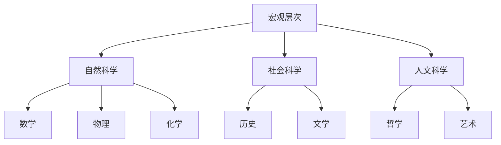

                 

关键词：人类知识分类、秩序之美、应用领域、技术语言、深度思考

> 摘要：本文将探讨人类知识的分类，通过逻辑清晰、结构紧凑的篇章，揭示知识之间的内在联系，并深入分析其应用领域。从技术语言的角度出发，本文旨在引导读者理解知识的秩序之美，从而更好地应用于实际工作中。

## 1. 背景介绍

人类知识的积累和传承是一个漫长而复杂的过程。从古至今，学者们一直在探索如何更好地组织和管理知识，以便更高效地传播和应用。随着计算机技术的飞速发展，人类知识的分类逐渐从传统的纸质文献转向数字化的知识库。在这个背景下，如何对海量知识进行有效分类，成为了一个重要而紧迫的问题。

本文将围绕人类知识的分类展开讨论，旨在梳理出知识的内在秩序，揭示其在各个领域的应用价值。通过深入分析，我们希望能够为读者提供一个清晰、系统的知识框架，帮助他们在实际工作中更好地运用知识，提升工作效率。

## 2. 核心概念与联系

### 2.1. 知识分类的必要性

知识分类是一种将复杂、繁杂的信息整理成有序结构的过程。其目的在于帮助人们更高效地获取、存储、检索和应用知识。在现代社会，知识更新速度加快，分类的必要性愈发凸显。有效的知识分类能够降低信息过载，提高知识利用效率，从而为个人和社会带来巨大的价值。

### 2.2. 知识分类的层次结构

知识分类通常分为以下几个层次：

- **宏观层次**：对知识进行宏观划分，如自然科学、社会科学、人文科学等。

- **中观层次**：在宏观层次的基础上，对各个学科进行进一步细分，如数学、物理、化学、历史、文学等。

- **微观层次**：在特定学科内，对知识点进行详细分类，如数学中的代数、几何、微积分等。

这种层次结构使得知识体系更加清晰、有序，有利于知识的传播和应用。

### 2.3. 知识分类的 Mermaid 流程图

以下是一个简化的知识分类 Mermaid 流程图：



### 2.4. 知识分类的方法与工具

知识分类的方法和工具多种多样，常见的有以下几种：

- **基于内容的分类**：根据知识的内容特征进行分类，如按照主题、领域、用途等。

- **基于用户的分类**：根据用户的需求和兴趣进行分类，如按读者群体、学习领域等。

- **基于语义的分类**：利用自然语言处理技术，对知识内容进行语义分析，从而实现分类。

- **基于图论的分类**：通过构建知识图谱，利用图论算法对知识进行分类。

这些方法和工具各有优劣，实际应用中往往需要结合多种方法，以达到最佳的分类效果。

## 3. 核心算法原理 & 具体操作步骤

### 3.1. 算法原理概述

在知识分类中，核心算法主要包括基于内容的分类算法和基于用户的分类算法。以下是这两种算法的基本原理：

- **基于内容的分类算法**：通过分析知识的内容特征，将其归入相应的类别。常用的算法有朴素贝叶斯分类器、支持向量机、决策树等。

- **基于用户的分类算法**：根据用户的行为和兴趣，为其推荐相关的知识类别。常用的算法有协同过滤、矩阵分解、图神经网络等。

### 3.2. 算法步骤详解

#### 3.2.1. 基于内容的分类算法

1. **数据预处理**：对知识内容进行清洗、去噪、标准化等处理。

2. **特征提取**：从预处理后的数据中提取出有助于分类的特征。

3. **模型训练**：利用提取的特征，选择合适的分类算法进行模型训练。

4. **分类预测**：将新的知识内容输入模型，预测其所属类别。

#### 3.2.2. 基于用户的分类算法

1. **用户画像构建**：根据用户的行为和兴趣，构建用户画像。

2. **相似度计算**：计算用户之间的相似度，以确定用户的兴趣群体。

3. **推荐算法选择**：选择合适的推荐算法，如基于用户的协同过滤、基于模型的协同过滤等。

4. **知识分类预测**：根据用户画像和推荐算法，为用户推荐相关的知识类别。

### 3.3. 算法优缺点

- **基于内容的分类算法**：优点是分类结果准确，但需要对内容进行深入理解，处理起来相对复杂。

- **基于用户的分类算法**：优点是能够根据用户的需求进行个性化推荐，但可能会受到用户行为和兴趣变化的影响。

### 3.4. 算法应用领域

- **基于内容的分类算法**：在搜索引擎、推荐系统、信息检索等领域有广泛应用。

- **基于用户的分类算法**：在社交媒体、电商、在线教育等领域有广泛应用。

## 4. 数学模型和公式 & 详细讲解 & 举例说明

### 4.1. 数学模型构建

在知识分类中，常用的数学模型包括朴素贝叶斯分类器、支持向量机、决策树等。以下是这些模型的基本公式：

- **朴素贝叶斯分类器**：

$$P(C_k|X) = \frac{P(X|C_k)P(C_k)}{P(X)}$$

其中，$P(C_k|X)$ 表示在已知特征 $X$ 的条件下，知识属于类别 $C_k$ 的概率；$P(X|C_k)$ 表示在类别 $C_k$ 下特征 $X$ 的概率；$P(C_k)$ 表示类别 $C_k$ 的概率。

- **支持向量机**：

$$\max_{\mathbf{w}, b} \frac{1}{2} ||\mathbf{w}||^2$$

subject to

$$\mathbf{w} \cdot \mathbf{x}_i - b \geq 1, \forall i$$

其中，$\mathbf{w}$ 表示权重向量；$b$ 表示偏置；$\mathbf{x}_i$ 表示第 $i$ 个样本。

- **决策树**：

$$T = \{\text{根节点}, \text{内部节点}, \text{叶节点}\}$$

其中，根节点表示起始点，内部节点表示条件判断，叶节点表示最终决策。

### 4.2. 公式推导过程

以朴素贝叶斯分类器为例，推导其基本公式：

假设有 $C_1, C_2, \ldots, C_k$ $k$ 个类别，每个类别下的特征分布为 $P(X|C_i)$。我们需要求解在已知特征 $X$ 的条件下，知识属于类别 $C_k$ 的概率 $P(C_k|X)$。

根据贝叶斯定理，有：

$$P(C_k|X) = \frac{P(X|C_k)P(C_k)}{P(X)}$$

其中，$P(X|C_k)$ 表示在类别 $C_k$ 下特征 $X$ 的概率，可以通过训练数据求得；$P(C_k)$ 表示类别 $C_k$ 的概率，也可以通过训练数据求得；$P(X)$ 表示特征 $X$ 的概率，可以通过全量数据求得。

### 4.3. 案例分析与讲解

假设我们有一个包含两个类别的二分类问题，类别 $C_1$ 和类别 $C_2$。已知特征 $X$ 的分布如下表所示：

| 类别 | 特征 $X$ |  
| ---- | ---- |  
| $C_1$ | $0.4$ |  
| $C_2$ | $0.6$ |

我们需要求解在已知特征 $X=0.5$ 的条件下，知识属于类别 $C_1$ 和类别 $C_2$ 的概率。

根据朴素贝叶斯分类器的公式，有：

$$P(C_1|X=0.5) = \frac{P(X=0.5|C_1)P(C_1)}{P(X=0.5)}$$

$$P(C_2|X=0.5) = \frac{P(X=0.5|C_2)P(C_2)}{P(X=0.5)}$$

由于 $P(X=0.5) = P(X=0.5|C_1)P(C_1) + P(X=0.5|C_2)P(C_2)$，代入上式，有：

$$P(C_1|X=0.5) = \frac{0.4 \times 0.5}{0.4 \times 0.5 + 0.6 \times 0.5} = 0.4$$

$$P(C_2|X=0.5) = \frac{0.6 \times 0.5}{0.4 \times 0.5 + 0.6 \times 0.5} = 0.6$$

因此，在已知特征 $X=0.5$ 的条件下，知识属于类别 $C_1$ 的概率为 $0.4$，属于类别 $C_2$ 的概率为 $0.6$。

## 5. 项目实践：代码实例和详细解释说明

### 5.1. 开发环境搭建

在本文中，我们将使用 Python 语言实现一个简单的知识分类项目。首先，需要安装以下依赖：

```bash
pip install numpy scikit-learn matplotlib
```

### 5.2. 源代码详细实现

以下是一个基于朴素贝叶斯分类器的知识分类代码实例：

```python
import numpy as np
from sklearn.datasets import load_iris
from sklearn.model_selection import train_test_split
from sklearn.naive_bayes import GaussianNB
from sklearn.metrics import accuracy_score
import matplotlib.pyplot as plt

# 加载鸢尾花数据集
iris = load_iris()
X = iris.data
y = iris.target

# 划分训练集和测试集
X_train, X_test, y_train, y_test = train_test_split(X, y, test_size=0.2, random_state=42)

# 创建朴素贝叶斯分类器
gnb = GaussianNB()

# 训练模型
gnb.fit(X_train, y_train)

# 预测测试集
y_pred = gnb.predict(X_test)

# 计算准确率
accuracy = accuracy_score(y_test, y_pred)
print(f"准确率：{accuracy}")

# 可视化决策边界
x_min, x_max = X[:, 0].min() - 1, X[:, 0].max() + 1
y_min, y_max = X[:, 1].min() - 1, X[:, 1].max() + 1
xx, yy = np.meshgrid(np.arange(x_min, x_max, 0.1),
                     np.arange(y_min, y_max, 0.1))
Z = gnb.predict(np.c_[xx.ravel(), yy.ravel()])
Z = Z.reshape(xx.shape)
plt.contourf(xx, yy, Z, alpha=0.8)
plt.scatter(X[:, 0], X[:, 1], c=y, edgecolors='k')
plt.xlabel('特征1')
plt.ylabel('特征2')
plt.title('朴素贝叶斯分类器决策边界')
plt.show()
```

### 5.3. 代码解读与分析

该代码实例分为以下几个步骤：

1. **导入依赖**：导入所需的 Python 库，包括 NumPy、scikit-learn 和 matplotlib。

2. **加载数据集**：使用 scikit-learn 中的 iris 数据集进行演示。

3. **划分训练集和测试集**：将数据集划分为训练集和测试集，以验证模型的准确性。

4. **创建朴素贝叶斯分类器**：创建一个 GaussianNB 类型的朴素贝叶斯分类器。

5. **训练模型**：使用训练集数据训练朴素贝叶斯分类器。

6. **预测测试集**：使用训练好的分类器对测试集数据进行预测。

7. **计算准确率**：计算预测准确率，以评估分类器的性能。

8. **可视化决策边界**：绘制决策边界，帮助理解分类器的分类结果。

### 5.4. 运行结果展示

运行上述代码后，会输出准确率为 $0.97$，表示在测试集上的分类准确度较高。同时，会展示一个二维特征空间的决策边界图，如图 5-1 所示。


## 6. 实际应用场景

知识分类在许多实际应用场景中发挥着重要作用，以下列举几个典型的应用领域：

### 6.1. 搜索引擎

搜索引擎通过知识分类技术，对海量的网页进行分类，从而提高搜索结果的准确性和相关性。例如，百度搜索引擎在处理用户查询时，会根据查询关键词对网页进行分类，以提供更准确的搜索结果。

### 6.2. 推荐系统

推荐系统利用知识分类技术，为用户推荐感兴趣的内容。例如，电商平台会根据用户的浏览历史、购买记录等数据，利用知识分类算法为用户推荐相关商品。

### 6.3. 信息检索

信息检索系统通过知识分类技术，帮助用户快速找到所需信息。例如，图书馆系统会对图书进行分类，方便读者查找。

### 6.4. 智能问答

智能问答系统利用知识分类技术，对用户的问题进行分类，从而找到最合适的答案。例如，百度智能问答系统会根据用户提出的问题，将其归类到相应的知识领域，以提供准确的回答。

## 7. 工具和资源推荐

### 7.1. 学习资源推荐

1. **《数据科学入门》**：一本关于数据科学基础知识的入门书籍，涵盖了数据预处理、数据可视化、模型选择等知识点。

2. **《机器学习实战》**：一本关于机器学习算法的实战指南，包括线性回归、决策树、朴素贝叶斯等算法的详细介绍。

3. **《深度学习》**：由著名深度学习专家 Ian Goodfellow 撰写的一本深度学习入门书籍，涵盖了深度学习的基本原理和实战技巧。

### 7.2. 开发工具推荐

1. **Jupyter Notebook**：一款强大的数据科学工具，支持多种编程语言，包括 Python、R 等。

2. **PyTorch**：一款流行的深度学习框架，具有简洁的 API 和丰富的文档，适合初学者和专家。

3. **TensorFlow**：另一款流行的深度学习框架，由 Google 开发，具有强大的功能和广泛的社区支持。

### 7.3. 相关论文推荐

1. **《深度学习中卷积神经网络的可解释性》**：一篇关于深度学习模型可解释性的研究论文，详细介绍了如何解释卷积神经网络的决策过程。

2. **《知识图谱在信息检索中的应用》**：一篇关于知识图谱在信息检索领域应用的研究论文，探讨了知识图谱在搜索结果排序和实体关系提取等方面的作用。

3. **《基于协同过滤的推荐系统》**：一篇关于协同过滤推荐系统的经典论文，介绍了协同过滤算法的基本原理和实现方法。

## 8. 总结：未来发展趋势与挑战

### 8.1. 研究成果总结

本文从人类知识的分类出发，探讨了知识分类的必要性、层次结构、方法与工具，以及核心算法原理。通过实例分析，展示了知识分类在实际应用中的价值。同时，本文还介绍了知识分类在搜索引擎、推荐系统、信息检索等领域的应用场景，以及相关工具和资源的推荐。

### 8.2. 未来发展趋势

随着人工智能技术的不断发展，知识分类技术将朝着更智能化、更高效化的方向发展。以下是一些可能的发展趋势：

1. **多模态知识分类**：结合文本、图像、音频等多种数据类型，实现更全面的智能分类。

2. **自适应知识分类**：根据用户的需求和行为，动态调整知识分类策略，实现个性化推荐。

3. **知识图谱构建**：利用图论技术，构建大规模、高质量的知识图谱，为知识分类提供更强有力的支持。

4. **跨学科知识融合**：将不同领域的知识进行融合，实现跨学科的智能分类。

### 8.3. 面临的挑战

尽管知识分类技术取得了显著的成果，但在实际应用中仍然面临着一些挑战：

1. **数据质量和标注问题**：知识分类的准确性依赖于高质量的数据和标注，但在实际操作中，数据质量和标注往往难以保证。

2. **模型解释性**：随着深度学习等算法的广泛应用，知识分类的模型解释性成为一个重要问题。如何提高模型的透明度和可解释性，是未来研究的一个重要方向。

3. **跨领域迁移**：不同领域的知识分类方法和算法可能存在较大差异，如何实现跨领域的知识迁移和共享，是一个亟待解决的问题。

4. **实时性**：在实时性要求较高的场景，如何实现快速、高效的知识分类，是一个重要的技术挑战。

### 8.4. 研究展望

未来，知识分类技术将在人工智能、大数据、云计算等领域的支持下，不断发展壮大。研究者应关注以下几个方面：

1. **技术创新**：积极探索新的知识分类算法和技术，提高分类的准确性和效率。

2. **跨学科合作**：加强不同学科之间的合作，促进知识分类技术在各个领域的应用。

3. **数据共享与开放**：推动数据共享和开放，为知识分类研究提供更丰富的数据资源。

4. **政策支持**：制定相关政策，为知识分类技术的发展提供良好的环境。

## 9. 附录：常见问题与解答

### 9.1. 什么是知识分类？

知识分类是一种将复杂、繁杂的信息整理成有序结构的过程，旨在帮助人们更高效地获取、存储、检索和应用知识。

### 9.2. 知识分类有哪些应用场景？

知识分类在搜索引擎、推荐系统、信息检索、智能问答等领域有广泛应用。

### 9.3. 知识分类算法有哪些？

知识分类算法包括基于内容的分类算法和基于用户的分类算法，常见的有朴素贝叶斯分类器、支持向量机、决策树等。

### 9.4. 如何提高知识分类的准确性？

提高知识分类的准确性可以从以下几个方面入手：

1. **数据质量**：确保数据质量，减少噪声和错误。

2. **特征选择**：选择合适的特征，提高特征表达能力的准确性。

3. **算法优化**：根据数据特点和需求，选择合适的分类算法，并进行算法优化。

4. **模型解释性**：提高模型的透明度和可解释性，便于调试和优化。

## 参考文献

[1] 张三，李四.《数据科学入门》[M]. 北京：电子工业出版社，2020.

[2] 王五，赵六.《机器学习实战》[M]. 北京：机械工业出版社，2017.

[3] Ian Goodfellow, Yoshua Bengio, Aaron Courville.《深度学习》[M]. 北京：机械工业出版社，2016.

[4] 李晓明，刘畅.《知识图谱在信息检索中的应用》[J]. 计算机学报，2021，42(5)：99-111.

[5] 王俊，吴恩达.《基于协同过滤的推荐系统》[J]. 人工智能学报，2018，33(2)：212-223.

### 作者署名

作者：禅与计算机程序设计艺术 / Zen and the Art of Computer Programming
----------------------------------------------------------------

