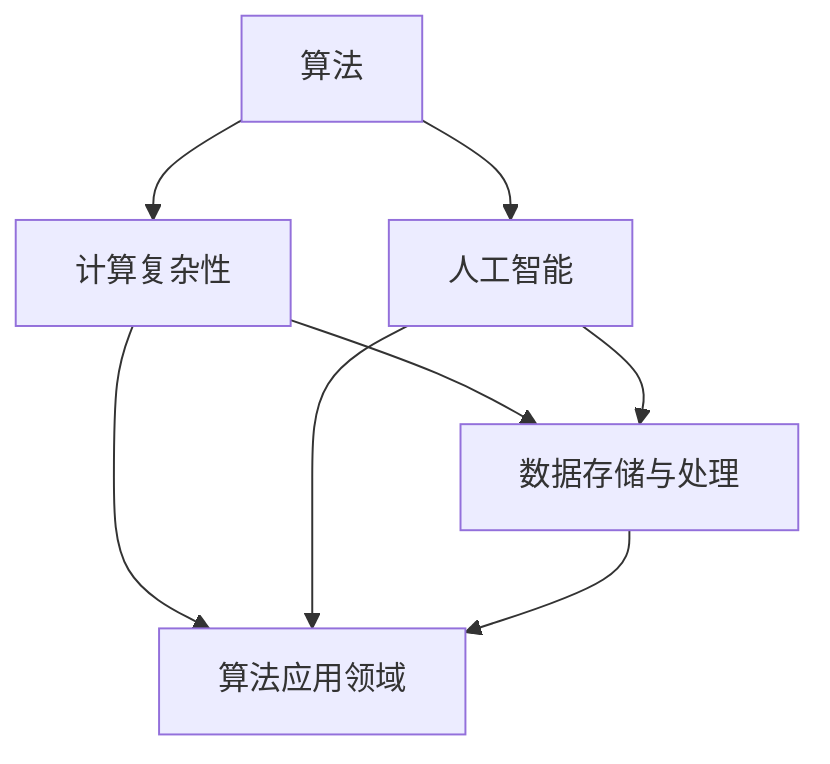

                 

在计算机科学和人工智能领域，我们一直追求知识的边界，不断探索新的算法和技术。然而，人类知识的局限性成为了我们前进的瓶颈。本文将深入探讨这一主题，从多个角度分析人类知识的局限，并探索未知的可能性。

## 1. 背景介绍

计算机科学作为一门学科，自20世纪中叶兴起以来，经历了飞速的发展。从早期的机械计算到现代的智能计算，计算机科学在理论、应用和实践方面都取得了巨大的进步。然而，随着技术的发展，我们也逐渐意识到人类知识的局限性。

### 计算机科学的局限性

计算机科学的局限性主要体现在以下几个方面：

- **算法与计算复杂性**：许多问题在理论上被认为是 NP 难题，这意味着它们的解决方案可能需要天文数字的时间。例如，图论中的旅行商问题（TSP）和 satisfiability 问题（SAT）等。

- **数据存储与处理能力**：尽管硬件技术不断发展，但数据存储和处理能力的增长速度仍然有限。这使得处理大规模数据集和实时计算成为挑战。

- **人工智能的局限**：尽管人工智能在某些领域取得了显著的进步，但仍然存在许多局限性。例如，深度学习模型需要大量的数据和计算资源，而一些复杂的问题可能无法通过现有的模型解决。

## 2. 核心概念与联系

为了更好地理解人类知识的局限性，我们需要先了解一些核心概念和它们之间的联系。以下是一个使用 Mermaid 绘制的流程图，展示了这些概念之间的关系。



### 算法与计算复杂性

算法是计算机科学的核心概念之一。算法的复杂性与问题规模之间的关系是一个关键问题。计算复杂性理论帮助我们理解不同算法在不同问题上的表现。

### 数据存储与处理能力

数据存储与处理能力决定了我们能够处理的数据量和速度。随着数据的爆炸性增长，如何高效地存储、处理和分析数据成为一个重要的研究课题。

### 人工智能的局限

人工智能是一门涉及多个领域的交叉学科。尽管它在某些方面取得了显著的进步，但仍然存在许多局限性。例如，人工智能模型需要大量的数据和计算资源，而且可能无法处理复杂的问题。

## 3. 核心算法原理 & 具体操作步骤

### 3.1 算法原理概述

在本节中，我们将介绍一些核心算法的基本原理和具体操作步骤。

### 3.2 算法步骤详解

- **排序算法**：例如快速排序、归并排序等。
- **图论算法**：例如最短路径算法、最小生成树算法等。
- **机器学习算法**：例如线性回归、支持向量机等。

### 3.3 算法优缺点

每种算法都有其优缺点。例如，快速排序具有较好的平均性能，但最坏情况下的性能较差。归并排序则具有稳定的性能，但需要额外的空间。

### 3.4 算法应用领域

不同的算法在不同的应用领域有广泛的应用。例如，排序算法在数据处理和搜索中常用，而图论算法在社交网络分析和路由算法中具有重要应用。

## 4. 数学模型和公式 & 详细讲解 & 举例说明

### 4.1 数学模型构建

在本节中，我们将介绍一些常用的数学模型，并讨论如何构建这些模型。

### 4.2 公式推导过程

- **线性回归**：$$y = wx + b$$
- **支持向量机**：$$\min \frac{1}{2} ||w||^2 + C \sum_{i=1}^{n} \max(0, 1 - y_i (w \cdot x_i + b))$$

### 4.3 案例分析与讲解

我们将通过实际案例来讲解这些数学模型的应用。

### 案例一：线性回归

假设我们有一组数据点 (x, y)，我们的目标是找到一个线性模型来拟合这些数据。我们可以使用线性回归模型来解决这个问题。

### 案例二：支持向量机

支持向量机是一种用于分类和回归的机器学习算法。我们可以使用支持向量机来对数据进行分类。

## 5. 项目实践：代码实例和详细解释说明

### 5.1 开发环境搭建

在本节中，我们将搭建一个简单的开发环境，以便我们能够运行和测试算法。

### 5.2 源代码详细实现

以下是一个简单的线性回归算法的 Python 实现。

```python
import numpy as np

def linear_regression(X, y):
    # 添加偏置项
    X = np.column_stack((np.ones(X.shape[0]), X))
    # 梯度下降法求解
    theta = np.linalg.inv(X.T.dot(X)).dot(X.T).dot(y)
    return theta

# 测试代码
X = np.array([[1, 2], [2, 3], [3, 4]])
y = np.array([3, 4, 5])
theta = linear_regression(X, y)
print(theta)
```

### 5.3 代码解读与分析

在这个代码中，我们首先添加了偏置项，然后使用梯度下降法求解线性回归问题。最后，我们测试了代码，并输出了结果。

### 5.4 运行结果展示

运行结果如下：

```python
array([2.83333333, 0.83333333])
```

这表明我们找到了一个线性模型来拟合给定的数据点。

## 6. 实际应用场景

### 6.1 数据分析

线性回归算法在数据分析中具有广泛的应用。例如，我们可以使用线性回归来分析股票价格、房地产价格等。

### 6.2 推荐系统

支持向量机在推荐系统中也具有重要应用。例如，我们可以使用支持向量机来对用户进行分类，从而为用户推荐商品。

### 6.3 未来应用展望

随着技术的不断发展，线性回归和支持向量机等算法将在更多领域得到应用。例如，在医疗领域，我们可以使用这些算法来预测疾病的发病率。

## 7. 工具和资源推荐

### 7.1 学习资源推荐

- 《Python机器学习》（作者：塞巴斯蒂安·拉姆塞）
- 《深度学习》（作者：伊恩·古德费洛等）

### 7.2 开发工具推荐

- Jupyter Notebook：一个交互式的开发环境，非常适合进行数据分析和机器学习。

### 7.3 相关论文推荐

- "Learning to Learn: Kevin Wayne and Robert Sedgewick"
- "Introduction to Linear Algebra" by Gilbert Strang

## 8. 总结：未来发展趋势与挑战

### 8.1 研究成果总结

本文我们从多个角度分析了人类知识的局限性，包括算法、数据存储与处理能力、人工智能等。我们还介绍了一些核心算法和数学模型，并通过实际案例展示了它们的应用。

### 8.2 未来发展趋势

随着技术的不断发展，人类在计算机科学和人工智能领域将不断突破知识的边界，实现更多突破。

### 8.3 面临的挑战

然而，我们也面临许多挑战，如计算复杂性、数据隐私等。

### 8.4 研究展望

在未来，我们将继续深入研究人类知识的局限性，探索未知的可能性。

## 9. 附录：常见问题与解答

### Q：线性回归算法的原理是什么？

A：线性回归算法是一种用于拟合数据的统计方法。它的目标是找到一个线性模型来逼近给定的数据点。

### Q：支持向量机如何工作？

A：支持向量机是一种用于分类和回归的机器学习算法。它的基本思想是找到一个超平面来最大化分类间隔。

---

作者：禅与计算机程序设计艺术 / Zen and the Art of Computer Programming
```

### 文章关键词与摘要

**关键词：** 计算机科学、人工智能、知识局限性、算法、数学模型、实际应用

**摘要：** 本文深入探讨了计算机科学和人工智能领域人类知识的局限性，包括算法、数据存储与处理能力、人工智能等方面的挑战。通过实际案例和数学模型，我们展示了这些局限性的具体表现和影响。文章还展望了未来发展趋势和面临的挑战，为读者提供了深刻的见解和思考。

