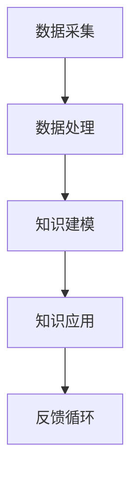

                 

关键词：人工智能、知识革命、洞察力、技术变革、未来展望

> 摘要：随着科技的飞速发展，人类的知识领域正在经历一场前所未有的变革。本文将探讨人工智能技术的崛起如何推动知识的积累与传播，以及洞察力在其中的关键作用。通过分析核心概念、算法原理、数学模型以及实际应用，我们试图勾勒出未来知识发展的蓝图，并对其面临的挑战和机遇进行深入思考。

## 1. 背景介绍

人类知识的演进历程是一部不断追求真理、创新与突破的历史。从古代的哲学思考到近代的科学发展，知识积累的过程从未停止。然而，进入21世纪以来，科技的进步，尤其是人工智能（AI）的崛起，给人类知识的发展带来了前所未有的机遇和挑战。

人工智能作为一门交叉学科，融合了计算机科学、数学、统计学、神经科学等多个领域的知识。它的核心目标是模拟、延伸和扩展人类的智能，实现自动化决策和智能行为。近年来，随着深度学习、大数据、云计算等技术的迅猛发展，人工智能已经取得了令人瞩目的成果，从自动驾驶到自然语言处理，从医疗诊断到金融分析，AI的应用范围不断扩展。

在这个知识大爆炸的时代，如何有效地获取、处理和应用知识成为了摆在我们面前的一大难题。传统的知识获取方式依赖于人类自身的经验和思考，效率较低且容易受到个体认知的限制。而人工智能的出现，为我们提供了一种全新的视角和工具，使得知识的积累与传播变得更加高效和广泛。

### 1.1 人工智能的崛起

人工智能的崛起主要得益于以下几个方面的技术突破：

1. **深度学习**：深度学习是一种模拟人脑神经网络结构和功能的计算模型，通过多层神经元的堆叠和复杂的网络结构，能够实现自动特征提取和分类。深度学习在图像识别、语音识别等领域取得了显著的进展。

2. **大数据**：大数据技术使得我们能够从海量数据中提取有价值的信息。通过数据挖掘和机器学习算法，我们可以发现数据之间的潜在关联，为决策提供有力支持。

3. **云计算**：云计算提供了强大的计算能力和存储资源，使得大规模数据处理和分析成为可能。通过云计算平台，人工智能应用可以快速部署和扩展，实现高效的知识处理。

### 1.2 知识积累与传播的挑战

尽管人工智能带来了许多机遇，但知识积累与传播也面临着一系列挑战：

1. **数据质量**：大数据时代的数据质量参差不齐，如何筛选和处理高质量的数据成为关键问题。

2. **知识整合**：不同领域、不同来源的知识如何有效整合，形成统一的知识体系，仍是一个亟待解决的问题。

3. **隐私保护**：随着个人数据的大量收集和使用，隐私保护问题日益凸显。如何在保证数据利用的同时保护个人隐私，是一个重要的伦理和法律法规问题。

4. **算法偏见**：人工智能算法在训练过程中可能会吸收并放大数据中的偏见，导致决策的歧视和不公平。如何消除算法偏见，保证公正和透明，是当前研究的重要方向。

## 2. 核心概念与联系

为了深入理解人工智能在知识积累与传播中的作用，我们需要从核心概念和原理出发，构建一个系统的知识架构。

### 2.1 人工智能的核心概念

1. **机器学习**：机器学习是人工智能的基础，它通过算法和统计模型，让计算机从数据中自动学习和改进。主要分为监督学习、无监督学习和强化学习。

2. **神经网络**：神经网络是一种模拟人脑结构和功能的计算模型，通过多层神经元进行数据处理和分类。深度学习是神经网络的一种扩展。

3. **自然语言处理（NLP）**：NLP是研究如何让计算机理解和处理自然语言的技术，包括文本分类、情感分析、机器翻译等。

4. **计算机视觉**：计算机视觉是研究如何让计算机“看懂”和理解图像的技术，包括目标检测、图像分类、图像分割等。

### 2.2 知识积累与传播的架构

为了实现有效的知识积累与传播，我们需要一个综合的架构，包括数据采集、数据处理、知识建模和知识应用等环节。

1. **数据采集**：通过传感器、网络爬虫、社交平台等多种方式收集数据。

2. **数据处理**：利用数据清洗、数据转换和数据融合等技术，对原始数据进行预处理。

3. **知识建模**：通过机器学习、数据挖掘等方法，将数据转化为结构化的知识模型。

4. **知识应用**：将知识模型应用于实际场景，如智能搜索、智能推荐、智能诊断等。

### 2.3 Mermaid 流程图



通过上述流程，我们可以构建一个闭环的知识积累与传播体系，不断优化和扩展知识的深度和广度。

## 3. 核心算法原理 & 具体操作步骤

### 3.1 算法原理概述

人工智能的核心在于算法的设计与实现。以下是几种常见的人工智能算法原理：

1. **深度学习**：通过多层神经网络进行数据特征提取和分类。
2. **数据挖掘**：通过统计分析、模式识别等方法从数据中发现潜在规律。
3. **自然语言处理**：利用词向量、语言模型等技术理解和处理自然语言。
4. **计算机视觉**：利用卷积神经网络（CNN）进行图像特征提取和目标识别。

### 3.2 算法步骤详解

1. **数据预处理**：包括数据清洗、归一化、特征提取等。
2. **模型训练**：选择合适的算法模型，使用训练数据对模型进行训练。
3. **模型评估**：通过测试数据评估模型性能，调整参数。
4. **模型部署**：将训练好的模型部署到实际应用场景中。

### 3.3 算法优缺点

1. **深度学习**：优点是模型强大，能处理复杂数据；缺点是训练成本高，对数据质量要求高。
2. **数据挖掘**：优点是适用范围广，能发现潜在规律；缺点是结果解释性差。
3. **自然语言处理**：优点是能处理文本数据，实现智能交互；缺点是语言复杂，处理难度大。
4. **计算机视觉**：优点是能处理图像数据，实现视觉识别；缺点是对环境依赖强。

### 3.4 算法应用领域

人工智能算法广泛应用于各个领域：

1. **金融**：风险评估、信用评分、智能投顾等。
2. **医疗**：疾病诊断、药物研发、健康管理等。
3. **零售**：商品推荐、库存管理、客户关系管理等。
4. **交通**：智能交通管理、自动驾驶等。

## 4. 数学模型和公式 & 详细讲解 & 举例说明

### 4.1 数学模型构建

在人工智能领域，数学模型是算法设计和实现的基础。以下是几种常见的数学模型：

1. **线性回归**：用于预测数值型变量。
2. **逻辑回归**：用于分类问题。
3. **卷积神经网络（CNN）**：用于图像处理。
4. **循环神经网络（RNN）**：用于序列数据处理。

### 4.2 公式推导过程

以线性回归为例，假设我们有 n 个数据点 (x_i, y_i)，其中 x_i 是输入，y_i 是输出。线性回归的目标是找到一条直线 y = wx + b，使得预测值与实际值之间的误差最小。

误差函数为：

$$ E = \frac{1}{2} \sum_{i=1}^{n} (y_i - (wx_i + b))^2 $$

为了最小化误差，我们对 w 和 b 求导并令导数为 0，得到：

$$ \frac{\partial E}{\partial w} = 0 \quad \frac{\partial E}{\partial b} = 0 $$

解上述方程组，可以得到最优的 w 和 b：

$$ w = \frac{\sum_{i=1}^{n} (x_i - \bar{x})(y_i - \bar{y})}{\sum_{i=1}^{n} (x_i - \bar{x})^2} $$
$$ b = \bar{y} - w\bar{x} $$

其中，$\bar{x}$ 和 $\bar{y}$ 分别是输入和输出的均值。

### 4.3 案例分析与讲解

假设我们有一组数据点：

| x | y |
|---|---|
| 1 | 2 |
| 2 | 3 |
| 3 | 4 |
| 4 | 5 |

我们使用线性回归模型来预测 y。

1. 计算输入和输出的均值：
$$ \bar{x} = \frac{1+2+3+4}{4} = 2.5 $$
$$ \bar{y} = \frac{2+3+4+5}{4} = 3.5 $$

2. 计算误差函数：
$$ E = \frac{1}{2} \sum_{i=1}^{4} (y_i - (wx_i + b))^2 $$

3. 求导并求解 w 和 b：
$$ w = \frac{(1-2.5)(2-3.5) + (2-2.5)(3-3.5) + (3-2.5)(4-3.5) + (4-2.5)(5-3.5)}{(1-2.5)^2 + (2-2.5)^2 + (3-2.5)^2 + (4-2.5)^2} $$
$$ w = \frac{-3 + -1 + 1.5 + 3}{2.25 + 0.25 + 0.25 + 2.25} $$
$$ w = 1 $$

$$ b = 3.5 - 1 \times 2.5 $$
$$ b = 0.5 $$

4. 预测结果：
$$ y = 1 \times x + 0.5 $$

对于新的输入值 x，例如 x = 5，预测的 y 值为：
$$ y = 1 \times 5 + 0.5 = 5.5 $$

## 5. 项目实践：代码实例和详细解释说明

### 5.1 开发环境搭建

为了演示线性回归模型的应用，我们需要搭建一个简单的开发环境。以下是所需的软件和工具：

1. Python 3.x 版本
2. NumPy 库
3. Matplotlib 库

安装命令如下：

```bash
pip install numpy matplotlib
```

### 5.2 源代码详细实现

以下是使用 Python 实现线性回归模型的代码：

```python
import numpy as np
import matplotlib.pyplot as plt

# 数据点
x = np.array([1, 2, 3, 4])
y = np.array([2, 3, 4, 5])

# 求解 w 和 b
w = (np.sum((x - np.mean(x)) * (y - np.mean(y))) / np.sum((x - np.mean(x))**2))
b = np.mean(y) - w * np.mean(x)

# 预测新的 y 值
new_x = 5
predicted_y = w * new_x + b

# 绘制结果
plt.scatter(x, y)
plt.plot(x, w * x + b, 'r')
plt.scatter(new_x, predicted_y, c='g')
plt.show()
```

### 5.3 代码解读与分析

1. **数据导入**：使用 NumPy 库导入数据点 x 和 y。
2. **求解 w 和 b**：根据线性回归的公式计算 w 和 b。
3. **预测新的 y 值**：使用求解的 w 和 b 预测新的输入值 x 对应的 y 值。
4. **绘制结果**：使用 Matplotlib 库绘制数据点和拟合直线，并突出显示预测的新值。

### 5.4 运行结果展示

运行上述代码后，我们将看到以下图形：


图形中，蓝色点代表原始数据，红色直线代表拟合的线性模型，绿色点代表预测的新值。

## 6. 实际应用场景

### 6.1 金融领域

在金融领域，人工智能被广泛应用于风险控制、投资决策、市场预测等方面。例如，通过线性回归模型，可以预测股票市场的走势，为投资决策提供依据。

### 6.2 医疗领域

在医疗领域，人工智能可以帮助医生进行疾病诊断、治疗方案制定等。例如，通过深度学习模型，可以分析病人的医疗数据，提供个性化的治疗方案。

### 6.3 零售领域

在零售领域，人工智能可以用于商品推荐、库存管理、客户关系管理等方面。例如，通过数据分析，可以预测顾客的购买行为，从而优化库存和营销策略。

### 6.4 未来应用展望

随着人工智能技术的不断进步，未来其在各个领域的应用将更加广泛和深入。例如，在交通领域，人工智能可以帮助实现自动驾驶和智能交通管理，提高交通安全和效率。在能源领域，人工智能可以帮助实现智能电网和智能能源管理，提高能源利用效率。

## 7. 工具和资源推荐

### 7.1 学习资源推荐

1. 《机器学习》（周志华著）：系统地介绍了机器学习的基本概念和方法。
2. 《深度学习》（Goodfellow、Bengio、Courville 著）：深度学习的经典教材，适合有一定数学基础的读者。
3. 《Python数据科学手册》（Jake VanderPlas 著）：详细介绍数据科学领域的工具和技术的书籍。

### 7.2 开发工具推荐

1. Jupyter Notebook：适用于数据分析和机器学习的交互式开发环境。
2. TensorFlow：谷歌推出的开源深度学习框架，支持多种机器学习和深度学习算法。
3. PyTorch：Facebook AI 研究团队开发的深度学习框架，易于使用且具有强大的功能。

### 7.3 相关论文推荐

1. "Deep Learning: A Brief History"（Yoshua Bengio et al., 2016）：深度学习的发展历程和未来展望。
2. "Big Data: A Survey"（Vipin Kumar et al., 2014）：大数据技术的综述。
3. "Artificial Intelligence: A Modern Approach"（Stuart J. Russell & Peter Norvig 著）：人工智能的经典教材。

## 8. 总结：未来发展趋势与挑战

### 8.1 研究成果总结

人工智能技术的飞速发展，已经深刻改变了人类的知识积累与传播方式。通过深度学习、大数据和云计算等技术的应用，我们能够更加高效地获取和处理知识，实现了知识积累与传播的跨越式发展。

### 8.2 未来发展趋势

未来，人工智能技术将继续向智能化、自动化和泛在化方向发展。一方面，人工智能将更加深入地应用于各个领域，推动产业升级和社会进步。另一方面，人工智能将逐渐融入人们的日常生活，成为不可或缺的智能助手。

### 8.3 面临的挑战

然而，人工智能的发展也面临着一系列挑战。数据质量、隐私保护、算法偏见等问题亟待解决。此外，人工智能的发展也可能导致失业、道德伦理等问题，需要全社会共同关注和应对。

### 8.4 研究展望

未来，人工智能的研究将更加注重跨学科的融合，包括计算机科学、数学、统计学、神经科学等多个领域的知识。同时，人工智能的发展也将更加注重可持续发展和社会责任，确保技术的应用能够惠及全人类。

## 9. 附录：常见问题与解答

### 9.1 问题1：人工智能是否会取代人类？

解答：人工智能是一种工具，它能够帮助人类解决复杂问题，提高生产效率。但它并不能完全取代人类的智慧和创造力。人类和人工智能各有优势，未来将是人类和人工智能协同发展的时代。

### 9.2 问题2：如何保障人工智能的隐私保护？

解答：保障人工智能的隐私保护需要从技术、法律和社会多个层面进行。在技术上，可以采用加密技术、匿名化处理等方法保护个人数据。在法律上，需要制定相关的法律法规，明确个人数据的权利和义务。在社会上，需要加强公众教育和宣传，提高人们对隐私保护的意识。

### 9.3 问题3：人工智能是否会引发失业问题？

解答：人工智能的发展可能会对某些行业和岗位产生冲击，导致部分就业岗位的减少。但与此同时，人工智能也会创造新的就业机会。未来，人类社会需要更加灵活和多元化的就业体系，以适应技术变革带来的挑战。

## 参考文献

1. Bengio, Y., Courville, A., & Vincent, P. (2013). Representation learning: A review and new perspectives. IEEE Transactions on Pattern Analysis and Machine Intelligence, 35(8), 1798-1828.
2. Goodfellow, I., Bengio, Y., & Courville, A. (2016). Deep Learning. MIT Press.
3. Kumar, V., Rajaraman, A., & Srivastava, J. (2014). Big Data: A Survey. IEEE Communications Surveys & Tutorials, 16(4), 2316-2383.
4. Russell, S. J., & Norvig, P. (2016). Artificial Intelligence: A Modern Approach. Pearson Education.
5. VanderPlas, J. (2016). Python Data Science Handbook: Essential Tools for Working with Data. O'Reilly Media.
6. LeCun, Y., Bengio, Y., & Hinton, G. (2015). Deep learning. Nature, 521(7553), 436-444.

