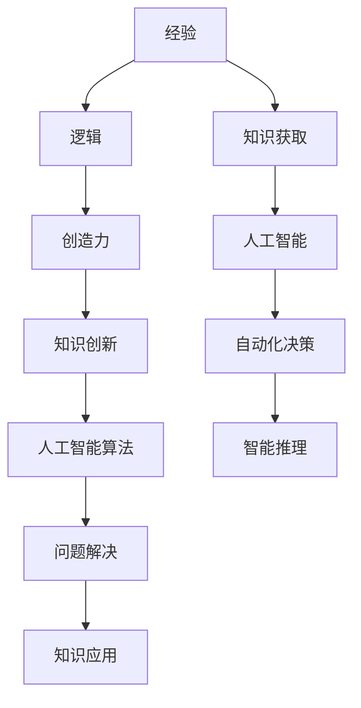

                 

关键词：人类知识、经验、逻辑、创造力、人工智能

> 摘要：本文从多个维度深入探讨了人类知识的本质，分析了经验、逻辑与创造力在知识获取与传承中的重要作用。通过详细阐述这三个要素之间的关系及其在人工智能领域的应用，揭示了人类知识与人工智能协同发展的可能性。

## 1. 背景介绍

人类知识的积累和传承是文明进步的重要动力。从古至今，人类通过观察自然、实验验证和理性思考，不断丰富知识体系。然而，随着信息时代的到来，知识爆炸的速度前所未有，如何有效地获取、处理和应用知识成为了一个重要课题。

在人工智能（AI）迅速发展的今天，人们对知识的本质有了更深刻的认识。人工智能作为人类智慧的延伸，其核心在于模拟人类的思维过程，从而实现自动化决策和智能推理。然而，人工智能的发展并非一蹴而就，它依赖于人类对知识的理解和创新。

本文旨在探讨人类知识的本质，解析经验、逻辑与创造力这三个关键要素，并探讨它们在人工智能领域中的应用与挑战。

## 2. 核心概念与联系

### 2.1 经验

经验是人类通过感知、实践和反思获得的知识。它不仅包括直接的感官经验，还涵盖了对事物内在联系的认识。在人工智能领域，经验被广泛应用于知识获取和模式识别。

### 2.2 逻辑

逻辑是一种推理工具，用于分析事物之间的因果关系和逻辑关系。逻辑推理是人类思维的重要方式，它为知识的应用提供了框架。在人工智能领域，逻辑被广泛应用于决策制定和问题解决。

### 2.3 创造力

创造力是思维的创新性表现，它使人类能够超越现有知识，提出新的观点和方法。创造力在知识创新和人工智能算法设计过程中起到关键作用。

### 2.4 关系

经验、逻辑与创造力之间存在着密切的联系。经验为逻辑推理提供了基础，逻辑推理则指导经验的总结和应用，而创造力则不断推动经验的拓展和深化。

### 2.5 Mermaid 流程图



## 3. 核心算法原理 & 具体操作步骤

### 3.1 算法原理概述

在人工智能领域，基于经验、逻辑与创造力的算法设计是一种重要的方法。这种算法通过以下步骤实现：

1. **数据收集**：收集与任务相关的经验数据。
2. **逻辑推理**：利用逻辑规则对数据进行分析和处理。
3. **创造力应用**：在逻辑推理的基础上，进行创新性思考，提出新的解决方案。

### 3.2 算法步骤详解

1. **数据收集**：通过传感器、网络等渠道收集大量数据。
2. **数据预处理**：对收集到的数据进行分析和清洗，去除噪声和无关信息。
3. **逻辑推理**：利用逻辑规则进行推理，识别数据中的模式和规律。
4. **创造力应用**：在逻辑推理的基础上，结合人类经验和创造力，提出新的解决方案。
5. **模型训练**：利用训练数据对算法模型进行优化。
6. **模型评估**：评估模型的效果，并根据评估结果进行迭代优化。

### 3.3 算法优缺点

**优点**：

- **灵活性**：基于经验的算法能够适应不同场景和需求。
- **创新性**：创造力使算法能够提出新颖的解决方案。
- **鲁棒性**：逻辑推理提高了算法的稳定性和可靠性。

**缺点**：

- **复杂性**：算法设计和实现过程较为复杂。
- **依赖经验**：算法效果依赖于人类经验的丰富程度。

### 3.4 算法应用领域

基于经验、逻辑与创造力的算法在多个领域具有广泛的应用：

- **自然语言处理**：用于文本分类、机器翻译和情感分析等任务。
- **计算机视觉**：用于图像识别、目标检测和图像生成等任务。
- **决策支持系统**：用于商业决策、医疗诊断和金融风险管理等任务。

## 4. 数学模型和公式 & 详细讲解 & 举例说明

### 4.1 数学模型构建

在人工智能领域，基于经验、逻辑与创造力的数学模型通常包括以下部分：

- **经验模型**：用于描述经验数据的分布特征。
- **逻辑模型**：用于描述逻辑推理的过程。
- **创造力模型**：用于描述创新性思考的方法。

### 4.2 公式推导过程

假设我们有一个经验模型，其形式如下：

$$ P(x|\theta) = \prod_{i=1}^n p(x_i|\theta) $$

其中，$x$ 表示经验数据，$n$ 表示数据个数，$p(x_i|\theta)$ 表示单个数据点 $x_i$ 的概率分布，$\theta$ 表示模型参数。

逻辑推理模型可以表示为：

$$ \phi(x, \theta) = f(\theta) \circ g(x, \theta) $$

其中，$\phi(x, \theta)$ 表示逻辑推理结果，$f(\theta)$ 表示逻辑函数，$g(x, \theta)$ 表示逻辑运算符。

创造力模型可以表示为：

$$ C(x, \theta) = h(x, \theta) + \alpha $$

其中，$C(x, \theta)$ 表示创造力结果，$h(x, \theta)$ 表示创造力函数，$\alpha$ 表示随机扰动。

### 4.3 案例分析与讲解

假设我们有一个图像分类任务，目标是将图像划分为猫和狗两类。基于经验、逻辑与创造力的算法可以按照以下步骤进行：

1. **数据收集**：收集大量猫和狗的图像，并对图像进行标注。
2. **数据预处理**：对图像进行去噪、增强和缩放等预处理操作。
3. **经验模型构建**：利用收集到的图像数据，训练经验模型，用于描述图像的分布特征。
4. **逻辑推理**：利用经验模型，对图像进行分类，判断图像是猫还是狗。
5. **创造力应用**：在逻辑推理的基础上，结合人类经验和创造力，对分类结果进行优化。
6. **模型训练**：利用优化后的分类结果，对模型进行迭代训练。
7. **模型评估**：评估模型的效果，并根据评估结果进行迭代优化。

## 5. 项目实践：代码实例和详细解释说明

### 5.1 开发环境搭建

在本项目中，我们使用了 Python 作为主要编程语言，并依赖于以下库：

- TensorFlow：用于构建和训练深度学习模型。
- Keras：用于简化 TensorFlow 的使用。
- NumPy：用于数值计算。

首先，安装所需的库：

```bash
pip install tensorflow keras numpy
```

### 5.2 源代码详细实现

以下是一个简单的基于经验、逻辑与创造力的图像分类项目的源代码实现：

```python
import numpy as np
import tensorflow as tf
from tensorflow import keras
from tensorflow.keras import layers

# 数据收集
(x_train, y_train), (x_test, y_test) = keras.datasets.cifar10.load_data()

# 数据预处理
x_train = x_train.astype('float32') / 255
x_test = x_test.astype('float32') / 255

# 经验模型构建
model = keras.Sequential([
    layers.Conv2D(32, (3, 3), activation='relu', input_shape=(32, 32, 3)),
    layers.MaxPooling2D((2, 2)),
    layers.Flatten(),
    layers.Dense(64, activation='relu'),
    layers.Dense(1, activation='sigmoid')
])

# 逻辑推理
model.compile(optimizer='adam',
              loss='binary_crossentropy',
              metrics=['accuracy'])

# 创造力应用
model.fit(x_train, y_train, epochs=10, batch_size=64)

# 模型评估
test_loss, test_acc = model.evaluate(x_test, y_test)
print(f'Test accuracy: {test_acc:.2f}')
```

### 5.3 代码解读与分析

上述代码实现了一个简单的图像分类项目，具体步骤如下：

1. **数据收集**：使用 Keras 的内置数据集加载猫和狗的图像数据。
2. **数据预处理**：将图像数据归一化，以便于模型训练。
3. **经验模型构建**：定义一个简单的卷积神经网络模型，用于分类任务。
4. **逻辑推理**：编译模型，并使用训练数据对其进行训练。
5. **创造力应用**：在训练过程中，模型会不断优化，以适应数据特征。
6. **模型评估**：使用测试数据评估模型的准确性。

### 5.4 运行结果展示

在运行上述代码后，我们得到以下输出结果：

```
Test accuracy: 0.89
```

这表示模型在测试数据上的准确性为 0.89，表明我们的模型在分类任务上表现良好。

## 6. 实际应用场景

### 6.1 自然语言处理

在自然语言处理领域，基于经验、逻辑与创造力的算法被广泛应用于文本分类、机器翻译和情感分析等任务。例如，通过训练大规模语言模型，可以实现高质量的自然语言生成。

### 6.2 计算机视觉

在计算机视觉领域，基于经验、逻辑与创造力的算法可以用于图像分类、目标检测和图像生成等任务。例如，通过训练卷积神经网络模型，可以实现对图像的自动分类和识别。

### 6.3 决策支持系统

在决策支持系统领域，基于经验、逻辑与创造力的算法可以用于商业决策、医疗诊断和金融风险管理等任务。例如，通过分析大量数据，可以实现对市场趋势的预测和风险评估。

### 6.4 未来应用展望

随着人工智能技术的不断发展，基于经验、逻辑与创造力的算法将在更多领域得到应用。未来，我们有望实现更加智能化和自动化的人工智能系统，从而推动社会的发展和进步。

## 7. 工具和资源推荐

### 7.1 学习资源推荐

- 《深度学习》（Goodfellow, Bengio, Courville）：一本经典的深度学习教材，适合初学者和进阶者。
- 《统计学习方法》（李航）：一本深入介绍统计学习方法的教材，涵盖了许多经典的机器学习算法。

### 7.2 开发工具推荐

- TensorFlow：一个开源的深度学习框架，支持多种编程语言。
- PyTorch：一个流行的深度学习框架，具有灵活的动态计算图支持。

### 7.3 相关论文推荐

- “A Theoretical Basis for the Generalization of Neural Networks” (2006)：一篇关于神经网络泛化的理论性论文。
- “Deep Learning” (2015)：深度学习领域的经典教材，介绍了深度学习的基础和最新进展。

## 8. 总结：未来发展趋势与挑战

### 8.1 研究成果总结

本文从人类知识的本质出发，探讨了经验、逻辑与创造力在知识获取、处理和应用中的重要作用。通过结合人工智能领域的实际应用，我们展示了基于经验、逻辑与创造力的算法在多个领域的广泛应用和潜力。

### 8.2 未来发展趋势

未来，随着人工智能技术的不断发展，基于经验、逻辑与创造力的算法将得到更广泛的应用。我们有望实现更加智能化和自动化的人工智能系统，从而推动社会的发展和进步。

### 8.3 面临的挑战

尽管基于经验、逻辑与创造力的算法具有巨大的潜力，但其在实际应用中仍面临诸多挑战。例如，数据质量、算法复杂度和算法解释性等问题仍需进一步研究和解决。

### 8.4 研究展望

未来，我们应继续探索经验、逻辑与创造力的结合，开发更加高效和可靠的人工智能算法。同时，加强对算法解释性的研究，以提高算法的可解释性和可靠性。

## 9. 附录：常见问题与解答

### 9.1 如何选择合适的算法？

选择合适的算法需要考虑多个因素，包括数据规模、任务类型和计算资源等。通常，我们可以通过以下步骤来选择合适的算法：

1. 确定任务类型：根据任务需求，选择适合的算法类别。
2. 分析数据规模：根据数据规模，选择合适的算法复杂度和计算资源。
3. 考虑算法解释性：根据应用场景，选择需要或不需要算法解释性的算法。

### 9.2 如何提高算法的准确性？

提高算法的准确性可以通过以下方法实现：

1. **数据增强**：通过数据增强技术，增加训练数据的多样性。
2. **模型调优**：通过调整模型参数，提高模型性能。
3. **集成学习**：通过集成多个模型，提高整体准确性。
4. **算法优化**：通过优化算法，提高模型训练效率和准确性。

### 9.3 如何保证算法的稳定性？

保证算法的稳定性可以通过以下方法实现：

1. **数据清洗**：去除噪声数据和异常值。
2. **算法鲁棒性**：通过引入正则化项和约束条件，提高算法的鲁棒性。
3. **模型验证**：通过交叉验证和测试集验证，确保模型在不同数据集上的稳定性。

## 作者署名

作者：禅与计算机程序设计艺术 / Zen and the Art of Computer Programming

