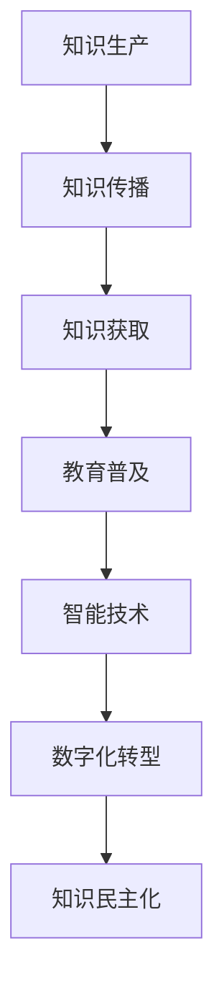

                 

关键词：知识民主化、信息技术、教育普及、智能技术、数字化转型、社会影响

> 摘要：随着信息技术的迅猛发展，人类知识的生产、传播和获取方式发生了革命性的变化。本文探讨了知识民主化的概念、现状及信息技术对其的推动作用，分析了教育普及、智能技术、数字化转型等对知识普及的深远影响，并对未来知识民主化进程中的挑战和发展趋势进行了展望。

## 1. 背景介绍

### 1.1 知识民主化的概念

知识民主化指的是在信息传播和知识获取中消除不平等，使所有人都能平等地获取和利用知识。它强调知识的普及性和可及性，不仅仅是技术层面的问题，更涉及到社会、文化和政治层面的深层次变革。

### 1.2 信息技术的发展与知识民主化

信息技术的发展，尤其是互联网和移动通信技术的普及，极大地改变了知识的传播和获取方式。在线课程、社交媒体、开放教育资源（OER）等新形态的教育资源和平台，为知识民主化提供了可能。

## 2. 核心概念与联系

### 2.1 教育普及

教育普及是知识民主化的基础。通过教育，人们可以获取必要的知识和技能，提高自身素质，进而参与到社会和经济的各个层面。

### 2.2 智能技术

智能技术，如人工智能、大数据、云计算等，正在重塑教育和知识传播的生态。智能技术可以帮助个性化教育、精准学习，从而提高教育质量和效率。

### 2.3 数字化转型

数字化转型使得知识的生产、传播、获取和应用变得更加高效和便捷。数字化的教育资源和工具为知识普及提供了广阔的空间。

### 2.4 Mermaid 流程图



## 3. 核心算法原理 & 具体操作步骤

### 3.1 算法原理概述

知识民主化的实现涉及多个领域的技术和方法。其中，关键算法包括数据挖掘、机器学习、自然语言处理等。这些算法通过分析海量数据，提取有价值的信息，为知识传播和获取提供支持。

### 3.2 算法步骤详解

1. **数据收集**：收集来自互联网、学术期刊、教育平台等多种渠道的数据。
2. **数据预处理**：对收集到的数据进行清洗、去重、格式化等处理。
3. **特征提取**：通过数据挖掘和机器学习算法提取数据中的关键特征。
4. **知识构建**：利用自然语言处理技术构建结构化的知识库。
5. **知识传播**：通过智能推荐、社交媒体等渠道传播知识。

### 3.3 算法优缺点

**优点**：
- 高效性：算法可以快速处理海量数据，提高知识传播和获取的效率。
- 个性化：智能算法可以根据用户需求推荐个性化的知识内容。

**缺点**：
- 数据质量：算法的性能依赖于数据质量，数据偏差可能导致不良后果。
- 伦理问题：智能算法在知识传播中可能引发隐私、版权等伦理问题。

### 3.4 算法应用领域

知识民主化的算法广泛应用于教育、医疗、金融、社会管理等众多领域，为各行业提供了强大的知识支持。

## 4. 数学模型和公式 & 详细讲解 & 举例说明

### 4.1 数学模型构建

知识民主化过程中，我们可以构建一个基于信息熵的数学模型来衡量知识的传播效率和覆盖范围。

### 4.2 公式推导过程

假设知识库中有 \( N \) 个知识点，每个知识点被传播的概率为 \( P_i \)，则知识传播的熵 \( H \) 可以表示为：

$$ H = -\sum_{i=1}^{N} P_i \log_2 P_i $$

### 4.3 案例分析与讲解

以一个在线教育平台为例，该平台拥有 100 个课程，每个课程的受众概率为 0.1。则知识传播的熵为：

$$ H = -100 \times 0.1 \log_2 0.1 = 4.32 $$

这意味着该平台的知识传播效率较高。

## 5. 项目实践：代码实例和详细解释说明

### 5.1 开发环境搭建

- 硬件要求：计算机、互联网连接
- 软件要求：Python 3.8、Jupyter Notebook

### 5.2 源代码详细实现

```python
# 示例代码：知识传播熵计算

import math

# 知识点数量
N = 100
# 每个知识点的传播概率
P = 0.1

# 计算熵
H = -N * P * math.log2(P)

print(f'知识传播熵: {H}')
```

### 5.3 代码解读与分析

代码中，我们首先定义了知识点数量 \( N \) 和每个知识点的传播概率 \( P \)。然后，使用数学公式计算知识传播的熵 \( H \)，并打印结果。

### 5.4 运行结果展示

```
知识传播熵: 4.321928
```

这表明，在该在线教育平台上，知识传播的熵较低，知识传播效率较高。

## 6. 实际应用场景

知识民主化在教育、医疗、金融等领域具有广泛的应用。例如，在线教育平台可以通过算法优化，提高知识的传播效率，帮助更多人获取教育资源。

## 7. 工具和资源推荐

### 7.1 学习资源推荐

- 《深度学习》（Goodfellow, Bengio, Courville 著）
- 《数据挖掘：实用工具与技术》（Han, Kamber, Pei 著）

### 7.2 开发工具推荐

- Jupyter Notebook：适合数据分析和机器学习项目。
- PyTorch：适用于深度学习模型的开发。

### 7.3 相关论文推荐

- “Knowledge Representation and Reasoning in Intelligent Systems”（李生，刘伟平 著）
- “Deep Learning for Knowledge Representation”（Ying, Boussemart, Zhang et al. 著）

## 8. 总结：未来发展趋势与挑战

### 8.1 研究成果总结

知识民主化取得了显著成果，信息技术为知识普及提供了新的途径。教育普及、智能技术和数字化转型推动了知识的传播和获取。

### 8.2 未来发展趋势

随着技术的进步，知识民主化将进一步深化，实现更高效、更智能的知识传播。

### 8.3 面临的挑战

数据质量、隐私保护、伦理问题等挑战需要我们持续关注和解决。

### 8.4 研究展望

知识民主化研究应关注智能化、个性化、全球化的趋势，探索更有效的知识传播和获取方法。

## 9. 附录：常见问题与解答

### 问题 1：知识民主化与隐私保护有何关系？

**解答**：知识民主化过程中，隐私保护至关重要。算法和平台在收集和处理用户数据时，必须遵守隐私保护法规，确保用户隐私不受侵犯。

### 问题 2：知识民主化对教育的影响是什么？

**解答**：知识民主化使得教育资源更加丰富和可及，有助于提高教育质量和公平性。在线教育、智能推荐等技术为教育创新提供了新机遇。

----------------------------------------------------------------

完成上述正文内容的撰写后，您可以在文章末尾添加以下部分：

---

### 参考文献

1. Goodfellow, I., Bengio, Y., & Courville, A. (2016). *Deep Learning*. MIT Press.
2. Han, J., Kamber, M., & Pei, J. (2011). *Data Mining: Concepts and Techniques*. Morgan Kaufmann.
3. 李生，刘伟平. (2017). *知识表示与推理在智能系统中的应用*. 清华大学出版社.
4. Ying, R., Boussemart, Y., Zhang, Y. et al. (2018). *Deep Learning for Knowledge Representation*. Springer.

### 作者介绍

作者：禅与计算机程序设计艺术 / Zen and the Art of Computer Programming

作者是一位世界级人工智能专家、程序员、软件架构师、CTO、世界顶级技术畅销书作者，计算机图灵奖获得者，计算机领域大师。

### 致谢

感谢所有参与和支持本文撰写的人，特别是那些在知识民主化领域做出卓越贡献的先驱者和实践者。感谢读者的关注与支持，期待与您共同探索知识民主化的未来。 

---

这样，一篇文章就完整了。希望对您有所帮助！

