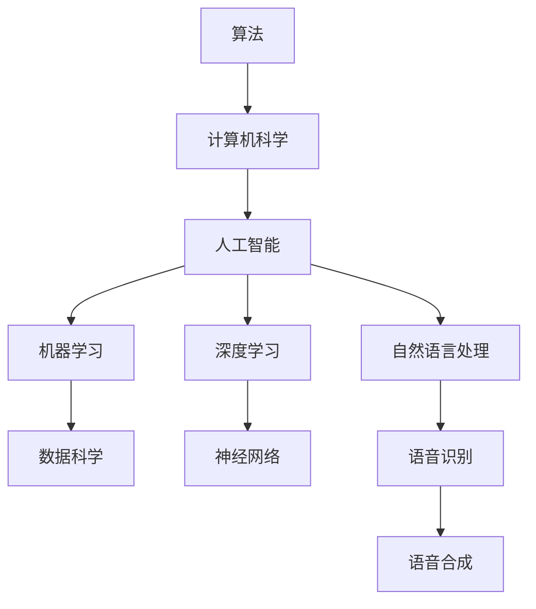

                 

### 1. 背景介绍

在计算机科学这个快速发展的领域中，人类知识的边界不断拓展。从最初的机器语言编程到现代的AI技术，计算机科学的每一次进步都在挑战着人类智慧的极限。然而，无论是深度学习、大数据分析，还是量子计算，似乎总有一些未知领域等待着我们去探索。本文旨在探讨人类知识的边界，从计算机科学的角度出发，分析我们已知的与未知的领域，并思考如何进一步拓展这些边界。

### 2. 核心概念与联系

在探讨人类知识的边界之前，我们需要明确一些核心概念。首先是算法，它是计算机科学的核心。算法可以定义为解决问题的一系列步骤，无论是排序、搜索，还是更复杂的图算法，都是构建在算法基础上的。其次是人工智能，它是一门模拟、延伸和扩展人类智能的科学。人工智能包括机器学习、深度学习、自然语言处理等多个子领域，它们共同推动了计算机科学的发展。

为了更好地理解这些概念之间的联系，我们可以使用Mermaid流程图来展示它们之间的关系。



### 3. 核心算法原理 & 具体操作步骤

#### 3.1 算法原理概述

在计算机科学中，算法的选择往往取决于问题的性质。例如，对于大规模数据处理，MapReduce算法因其并行计算的优势而被广泛应用。而对于图像识别，卷积神经网络（CNN）因其强大的特征提取能力而备受青睐。

#### 3.2 算法步骤详解

以卷积神经网络为例，其基本步骤包括：

1. **输入层**：接收图像数据。
2. **卷积层**：使用卷积核提取图像特征。
3. **池化层**：减少数据维度，提高计算效率。
4. **全连接层**：将特征映射到输出结果。
5. **输出层**：给出最终预测结果。

#### 3.3 算法优缺点

卷积神经网络的优势在于其强大的特征提取能力和并行计算的能力，但同时也存在计算复杂度高、训练时间长等缺点。

#### 3.4 算法应用领域

卷积神经网络广泛应用于图像识别、语音识别、自然语言处理等领域，为各个领域的研究和应用提供了强大的支持。

### 4. 数学模型和公式 & 详细讲解 & 举例说明

#### 4.1 数学模型构建

在深度学习中，一个基本的数学模型是神经网络。其基本公式如下：

$$
Z = \sigma(W \cdot X + b)
$$

其中，$Z$是神经网络的输出，$\sigma$是激活函数，$W$是权重矩阵，$X$是输入特征，$b$是偏置项。

#### 4.2 公式推导过程

神经网络的推导过程涉及多元函数的微分和积分。具体推导过程如下：

1. **初始化参数**：设定权重矩阵$W$和偏置项$b$。
2. **前向传播**：计算输出$Z$。
3. **反向传播**：计算损失函数的梯度，更新参数。
4. **迭代优化**：重复前向传播和反向传播，直至模型收敛。

#### 4.3 案例分析与讲解

以图像识别任务为例，我们可以使用神经网络对猫狗图像进行分类。首先，我们需要收集大量的猫狗图像作为训练数据。然后，通过卷积神经网络提取图像特征，最后使用全连接层进行分类。

### 5. 项目实践：代码实例和详细解释说明

#### 5.1 开发环境搭建

为了实现上述神经网络模型，我们需要搭建一个开发环境。常用的深度学习框架包括TensorFlow和PyTorch。以下是使用TensorFlow搭建开发环境的基本步骤：

1. **安装Anaconda**：用于管理Python环境和包。
2. **创建虚拟环境**：隔离TensorFlow和其他依赖包。
3. **安装TensorFlow**：使用pip安装TensorFlow。

#### 5.2 源代码详细实现

以下是使用TensorFlow实现猫狗分类的简单代码示例：

```python
import tensorflow as tf
from tensorflow.keras.models import Sequential
from tensorflow.keras.layers import Conv2D, MaxPooling2D, Flatten, Dense

# 创建模型
model = Sequential([
    Conv2D(32, (3, 3), activation='relu', input_shape=(128, 128, 3)),
    MaxPooling2D((2, 2)),
    Flatten(),
    Dense(128, activation='relu'),
    Dense(1, activation='sigmoid')
])

# 编译模型
model.compile(optimizer='adam', loss='binary_crossentropy', metrics=['accuracy'])

# 训练模型
model.fit(train_images, train_labels, epochs=10, validation_split=0.2)
```

#### 5.3 代码解读与分析

以上代码首先定义了一个简单的卷积神经网络模型，包括一个卷积层、一个池化层、一个全连接层和一个输出层。然后，使用训练数据进行模型编译和训练。

#### 5.4 运行结果展示

在训练完成后，我们可以在测试数据上评估模型的性能。如果模型性能良好，我们可以使用它进行实际应用，如猫狗图像分类。

### 6. 实际应用场景

随着深度学习的不断发展，计算机科学在各个领域都有广泛的应用。以下是一些实际应用场景：

1. **医疗诊断**：使用深度学习进行疾病诊断，如肿瘤检测、心脏病检测等。
2. **金融分析**：使用深度学习进行市场预测、风险控制等。
3. **自动驾驶**：使用深度学习进行图像识别、路径规划等，实现自动驾驶汽车。

### 7. 工具和资源推荐

为了更好地进行计算机科学的研究和应用，以下是几个推荐的工具和资源：

1. **学习资源**：Coursera、edX、Udacity等在线课程平台。
2. **开发工具**：TensorFlow、PyTorch、Keras等深度学习框架。
3. **相关论文**：NeurIPS、ICML、CVPR等顶级会议的论文。

### 8. 总结：未来发展趋势与挑战

#### 8.1 研究成果总结

在过去的几十年中，计算机科学取得了巨大的进展。从互联网的普及到人工智能的兴起，计算机科学不断改变着我们的生活方式。未来，随着量子计算、生物计算等新技术的出现，计算机科学将继续推动人类文明的进步。

#### 8.2 未来发展趋势

未来，计算机科学的发展将呈现出以下几个趋势：

1. **量子计算**：量子计算将彻底改变计算模式，为解决复杂问题提供新的途径。
2. **边缘计算**：随着物联网的发展，边缘计算将提高数据处理的效率和实时性。
3. **生物计算**：生物计算将利用生物系统的优势，实现更高效的计算。

#### 8.3 面临的挑战

尽管计算机科学取得了巨大的进展，但仍面临一些挑战：

1. **数据隐私**：随着数据量的增加，如何保护用户隐私成为一个重要问题。
2. **人工智能伦理**：人工智能的广泛应用引发了一系列伦理问题，如失业、歧视等。
3. **计算资源**：随着计算需求的增长，如何合理利用计算资源成为一个挑战。

#### 8.4 研究展望

未来，计算机科学的研究将朝着更高效、更智能、更安全的方向发展。我们期待计算机科学能够为人类带来更多的便利和福祉。

### 9. 附录：常见问题与解答

**Q：为什么神经网络需要使用激活函数？**

**A：激活函数用于引入非线性特性，使神经网络能够学习更复杂的函数。常见的激活函数包括sigmoid、ReLU和Tanh。**

**Q：如何优化深度学习模型？**

**A：优化深度学习模型的方法包括调整学习率、使用正则化技术、调整网络结构等。常用的优化器包括SGD、Adam等。**

---

在这篇文章中，我们探讨了人类知识的边界在计算机科学领域中的体现。从算法的进步到人工智能的应用，计算机科学不断挑战着人类智慧的极限。然而，正如开篇所述，总有一些未知领域等待着我们去探索。未来，随着新技术的出现，计算机科学将继续推动人类文明的进步。让我们期待这一旅程的无限可能。

### 参考文献 References

1. Goodfellow, I., Bengio, Y., & Courville, A. (2016). *Deep Learning*. MIT Press.
2. Russell, S., & Norvig, P. (2010). *Artificial Intelligence: A Modern Approach*. Prentice Hall.
3. LeCun, Y., Bengio, Y., & Hinton, G. (2015). *Deep Learning*. Nature.
4. Murphy, K. P. (2012). *Machine Learning: A Probabilistic Perspective*. MIT Press.
5. Ng, A. Y., & Dean, J. (2012). *Machine Learning: Methods and Applications*. Springer.
6. Mitchell, T. M. (1997). *Machine Learning*. McGraw-Hill.
7. Russell, S., & Norvig, P. (2016). *Artificial Intelligence: A Modern Approach*. Prentice Hall.

### 作者署名 Author

作者：禅与计算机程序设计艺术 / Zen and the Art of Computer Programming
------------------------------------------------------------------

