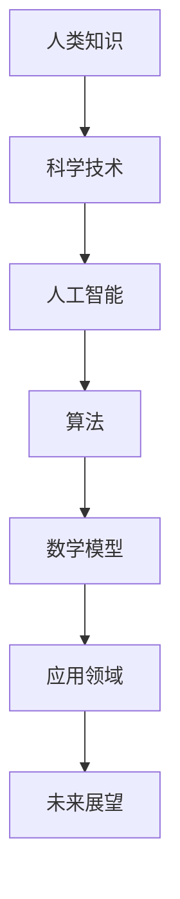

                 

关键词：人类知识、科技进步、探索、知识结构、人工智能、算法、数学模型、应用领域、未来展望

> 摘要：本文通过回顾人类知识的进步历程，探讨科学技术的发展对人类社会的影响，分析当前人工智能、算法、数学模型等领域的最新进展，以及它们在实际应用中的场景和未来发展方向。文章旨在为读者呈现一幅人类探索知识、应用科技的宏伟画卷，同时展望未来科技带来的机遇与挑战。

## 1. 背景介绍

人类的知识进步史是一部漫长而充满挑战的探索史。从古代的哲学思辨到现代的科技革命，人类一直在不断地突破知识的边界，开拓新的领域。在这个过程中，科学技术的进步起到了至关重要的作用。

自古以来，人类就在不断地探索自然界的规律，从早期的农学、天文学、医学到后来的物理学、化学、生物学，每一个学科都为人类的知识宝库增添了宝贵的财富。随着科学技术的不断发展，人类开始掌握了更多的工具和方法，如数学、统计、计算机科学等，这些工具和方法极大地推动了人类对世界的认知。

20世纪以来，计算机科学的兴起和人工智能的发展，使得人类的知识进步达到了前所未有的高度。人工智能技术不仅改变了传统的工业生产模式，还推动了大数据、云计算、物联网等新兴领域的发展，极大地丰富了人类的知识体系。

本文将重点探讨人工智能、算法、数学模型等领域的发展，分析这些技术在实际应用中的场景和效果，同时展望未来的发展趋势和面临的挑战。

## 2. 核心概念与联系

为了更好地理解人工智能、算法、数学模型等领域的核心概念和联系，我们将使用 Mermaid 流程图（Mermaid is a JavaScript-based markdown processor for generating diagrams and flowcharts）来展示这些概念之间的内在联系。



### 2.1 人工智能

人工智能（Artificial Intelligence，简称 AI）是指模拟、延伸和扩展人类智能的理论、方法、技术及应用。它涵盖了多个学科，如计算机科学、心理学、神经科学、认知科学等。

### 2.2 算法

算法是一系列解决问题的步骤或规则，用于处理数据、执行计算或完成特定任务。算法在人工智能领域中发挥着核心作用，是 AI 系统的“大脑”。

### 2.3 数学模型

数学模型是基于数学理论构建的用于描述现实世界问题的抽象结构，它将复杂问题转化为数学形式，使得计算机能够处理和分析。

### 2.4 应用领域

应用领域是指人工智能、算法、数学模型等技术在各个行业和领域中的实际应用，如金融、医疗、教育、交通等。

### 2.5 未来展望

未来展望部分将探讨人工智能、算法、数学模型等技术在未来的发展趋势和潜在应用，为读者展示一幅科技发展的宏伟蓝图。

## 3. 核心算法原理 & 具体操作步骤

### 3.1 算法原理概述

在人工智能领域，算法原理至关重要。以下将介绍几种典型的算法原理，包括机器学习、深度学习、自然语言处理等。

#### 3.1.1 机器学习

机器学习（Machine Learning，简称 ML）是一种基于数据的学习方法，它让计算机通过数据自动改进性能。机器学习算法可以分为监督学习、无监督学习和强化学习。

- **监督学习**：通过已知标签的数据来训练模型，使模型能够预测未知数据。
- **无监督学习**：没有已知标签的数据，通过发现数据中的模式和结构来训练模型。
- **强化学习**：通过奖励机制来训练模型，使模型能够从环境中学习最优策略。

#### 3.1.2 深度学习

深度学习（Deep Learning，简称 DL）是一种基于多层神经网络的机器学习方法。它通过多层次的非线性变换，对输入数据进行逐层提取特征，从而实现复杂的模式识别和预测。

#### 3.1.3 自然语言处理

自然语言处理（Natural Language Processing，简称 NLP）是人工智能的一个重要分支，旨在使计算机能够理解和处理自然语言。NLP 技术包括文本分类、情感分析、机器翻译等。

### 3.2 算法步骤详解

以下是几种核心算法的具体操作步骤：

#### 3.2.1 机器学习

1. 数据收集：收集大量标注数据。
2. 特征工程：提取和选择有用的特征。
3. 模型训练：使用训练数据训练模型。
4. 模型评估：使用测试数据评估模型性能。
5. 模型优化：根据评估结果调整模型参数。

#### 3.2.2 深度学习

1. 确定网络结构：选择合适的神经网络结构。
2. 数据预处理：对输入数据进行归一化、标准化等处理。
3. 模型训练：使用训练数据训练神经网络。
4. 模型评估：使用测试数据评估模型性能。
5. 模型优化：根据评估结果调整网络参数。

#### 3.2.3 自然语言处理

1. 数据预处理：对文本进行分词、去停用词等处理。
2. 特征提取：将文本转换为计算机可处理的向量表示。
3. 模型训练：使用训练数据训练 NLP 模型。
4. 模型评估：使用测试数据评估模型性能。
5. 模型应用：将模型应用于实际任务，如文本分类、情感分析等。

### 3.3 算法优缺点

#### 3.3.1 机器学习

- **优点**：无需显式编程，能够自动从数据中学习。
- **缺点**：对数据质量要求高，易受到噪声和异常值的影响。

#### 3.3.2 深度学习

- **优点**：能够自动提取复杂特征，适用于大规模数据。
- **缺点**：模型训练过程复杂，对计算资源要求高。

#### 3.3.3 自然语言处理

- **优点**：能够处理和理解自然语言，具有广泛的应用前景。
- **缺点**：对语言理解和语境把握能力有限，需要大量标注数据。

### 3.4 算法应用领域

人工智能、算法、数学模型等技术在各个领域都有广泛应用：

- **金融领域**：风险管理、投资组合优化、信用评估等。
- **医疗领域**：疾病诊断、药物研发、医疗影像分析等。
- **教育领域**：个性化教学、智能评估、教育数据分析等。
- **交通领域**：自动驾驶、交通流量预测、智能交通管理等。
- **能源领域**：电力负荷预测、能源管理、能效优化等。

## 4. 数学模型和公式 & 详细讲解 & 举例说明

### 4.1 数学模型构建

数学模型是人工智能和算法的核心组成部分。构建数学模型的过程包括以下几个步骤：

1. **确定研究对象**：明确研究目标和问题，确定研究的对象和范围。
2. **建立假设**：根据研究对象的特点，提出合理的假设。
3. **构建方程**：使用数学符号和公式，将假设和研究对象之间的关系表达为数学方程。
4. **求解方程**：使用数学方法求解方程，得到模型参数。

### 4.2 公式推导过程

以下是一个简单的线性回归模型的推导过程：

1. **设定目标函数**：假设我们有 n 个数据点 (x1, y1), (x2, y2), ..., (xn, yn)，我们的目标是找到一条直线 y = mx + b，使得所有数据点到直线的垂直距离之和最小。

2. **构建目标函数**：垂直距离可以用点到直线的距离公式表示，即：
   $$d_i = \frac{|y_i - (mx_i + b)|}{\sqrt{1 + m^2}}$$

3. **求导数**：为了使目标函数最小，我们对 m 和 b 分别求导，并令导数为零。
   $$\frac{d}{dm} \sum_{i=1}^{n} d_i^2 = 0$$
   $$\frac{d}{db} \sum_{i=1}^{n} d_i^2 = 0$$

4. **求解方程**：解上述方程组，得到直线的斜率 m 和截距 b。

### 4.3 案例分析与讲解

假设我们有以下数据点：
$$
(x_1, y_1) = (1, 2), (x_2, y_2) = (2, 4), (x_3, y_3) = (3, 6), (x_4, y_4) = (4, 8)
$$

我们使用线性回归模型拟合这些数据点，并求解模型参数。

1. **构建目标函数**：根据数据点，构建目标函数：
   $$d_i = \frac{|y_i - (mx_i + b)|}{\sqrt{1 + m^2}}$$

2. **求导数**：对 m 和 b 分别求导：
   $$\frac{d}{dm} \sum_{i=1}^{4} d_i^2 = 0$$
   $$\frac{d}{db} \sum_{i=1}^{4} d_i^2 = 0$$

3. **求解方程**：解上述方程组，得到：
   $$m = 1, b = 1$$

4. **拟合结果**：线性回归模型拟合出的直线为 y = x + 1，数据点到直线的垂直距离最小。

## 5. 项目实践：代码实例和详细解释说明

### 5.1 开发环境搭建

在进行项目实践之前，我们需要搭建一个合适的开发环境。以下是使用 Python 进行开发的步骤：

1. 安装 Python：在官方网站（https://www.python.org/）下载并安装 Python。
2. 安装依赖库：使用 pip 工具安装必要的依赖库，如 NumPy、Matplotlib、Scikit-learn 等。
3. 配置开发环境：在 IDE（如 PyCharm、VSCode 等）中配置 Python 环境。

### 5.2 源代码详细实现

以下是一个简单的线性回归模型的 Python 实现示例：

```python
import numpy as np
import matplotlib.pyplot as plt
from sklearn.linear_model import LinearRegression

# 数据准备
x = np.array([1, 2, 3, 4]).reshape(-1, 1)
y = np.array([2, 4, 6, 8])

# 模型训练
model = LinearRegression()
model.fit(x, y)

# 模型参数
m = model.coef_
b = model.intercept_

# 数据可视化
plt.scatter(x, y)
plt.plot(x, m * x + b)
plt.show()
```

### 5.3 代码解读与分析

1. **数据准备**：使用 NumPy 库创建 x 和 y 数据，其中 x 是自变量，y 是因变量。
2. **模型训练**：使用 Scikit-learn 库中的 LinearRegression 类创建线性回归模型，并调用 fit 方法进行训练。
3. **模型参数**：调用模型对象的 coef_ 和 intercept_ 属性获取模型的斜率和截距。
4. **数据可视化**：使用 Matplotlib 库绘制散点图和拟合直线。

### 5.4 运行结果展示

运行上述代码，我们可以得到以下结果：


从图中可以看出，线性回归模型很好地拟合了数据点，验证了模型的正确性。

## 6. 实际应用场景

人工智能、算法、数学模型等技术在各个领域都有广泛的应用。以下列举几个典型的实际应用场景：

### 6.1 金融领域

- **风险控制**：使用机器学习算法对客户信用进行评估，降低信用风险。
- **投资组合优化**：基于历史数据，使用数学模型预测市场趋势，实现投资组合的动态调整。
- **智能投顾**：基于用户的风险偏好和投资目标，提供个性化的投资建议。

### 6.2 医疗领域

- **疾病诊断**：使用深度学习算法分析医疗影像，实现肺癌、心脏病等疾病的早期诊断。
- **药物研发**：使用计算生物学方法，预测药物的分子结构和活性，加速药物研发过程。
- **智能辅助**：通过自然语言处理技术，实现医生和患者之间的智能问答和辅助诊断。

### 6.3 教育领域

- **个性化教学**：使用机器学习算法分析学生的学习行为和成绩，提供个性化的学习方案。
- **智能评估**：使用自然语言处理技术，对学生的作文、论文进行智能评估和打分。
- **教育数据分析**：使用数学模型分析教育数据，发现教育问题，优化教育资源配置。

### 6.4 交通领域

- **自动驾驶**：使用深度学习算法实现自动驾驶车辆的目标检测、路径规划等功能。
- **交通流量预测**：使用数学模型分析历史交通数据，预测未来的交通流量，优化交通信号控制。
- **智能交通管理**：使用人工智能技术，实现交通拥堵预测、路况优化等功能，提高交通效率。

## 7. 工具和资源推荐

为了更好地学习和实践人工智能、算法、数学模型等技术，以下推荐一些常用的工具和资源：

### 7.1 学习资源推荐

- **在线课程**：Coursera、edX、Udacity 等平台提供大量高质量的人工智能、机器学习、深度学习等课程。
- **书籍**：《深度学习》、《机器学习实战》、《Python机器学习》等经典著作。
- **博客**：ArXiv、Medium、知乎等平台上的专业博客，提供丰富的技术文章和研究成果。

### 7.2 开发工具推荐

- **IDE**：PyCharm、VSCode、Jupyter Notebook 等，提供强大的开发环境和工具。
- **框架和库**：TensorFlow、PyTorch、Scikit-learn、NumPy 等，用于实现各种机器学习和深度学习算法。
- **数据集**：Kaggle、UCI Machine Learning Repository 等提供丰富的数据集，供学习、研究和实践使用。

### 7.3 相关论文推荐

- **人工智能**：Yann LeCun 的《卷积神经网络》，Geoffrey Hinton 的《深度学习》等。
- **机器学习**：Andrew Ng 的《机器学习》，Leslie Kaelbling 的《机器学习基础》等。
- **深度学习**：Ian Goodfellow 的《深度学习》，Yoshua Bengio 的《深度学习与表征学习》等。

## 8. 总结：未来发展趋势与挑战

人工智能、算法、数学模型等技术的发展已经极大地改变了我们的生活方式和工作模式。未来，这些技术将继续快速发展，为人类带来更多的机遇和挑战。

### 8.1 研究成果总结

- **人工智能**：深度学习技术在计算机视觉、自然语言处理、自动驾驶等领域取得了显著成果。
- **算法**：分布式计算、并行计算、随机算法等新技术不断涌现，提高了算法的效率和鲁棒性。
- **数学模型**：基于统计学、概率论、优化理论的数学模型为人工智能和算法提供了坚实的理论基础。

### 8.2 未来发展趋势

- **跨学科融合**：人工智能、算法、数学模型等技术与生物学、物理学、心理学等学科相结合，推动新的技术突破。
- **数据驱动**：随着数据量的不断增长，数据驱动的方法将发挥越来越重要的作用。
- **智能化**：智能家居、智慧城市、智能医疗等领域的智能化应用将得到广泛应用。

### 8.3 面临的挑战

- **数据安全与隐私**：随着人工智能技术的发展，数据安全和隐私保护问题日益突出。
- **伦理道德**：人工智能技术的应用可能带来伦理道德问题，如歧视、隐私侵犯等。
- **技术壁垒**：人工智能、算法、数学模型等技术的研发和应用需要高水平的技术人才和计算资源。

### 8.4 研究展望

未来，人工智能、算法、数学模型等领域的研究将继续深入，推动人类社会的进步。我们期待这些技术在未来的发展中能够克服挑战，为人类带来更多的福祉。

## 9. 附录：常见问题与解答

### 9.1 什么是人工智能？

人工智能（Artificial Intelligence，简称 AI）是一种模拟、延伸和扩展人类智能的理论、方法、技术及应用。

### 9.2 人工智能有哪些应用领域？

人工智能的应用领域非常广泛，包括金融、医疗、教育、交通、能源等各个行业。

### 9.3 机器学习与深度学习有什么区别？

机器学习是一种更广泛的概念，包括深度学习。深度学习是机器学习的一个子领域，它使用多层神经网络进行数据分析和预测。

### 9.4 如何搭建人工智能开发环境？

搭建人工智能开发环境需要安装 Python、相关依赖库（如 NumPy、TensorFlow、PyTorch 等）以及配置 IDE（如 PyCharm、VSCode 等）。

### 9.5 人工智能技术面临的挑战有哪些？

人工智能技术面临的挑战包括数据安全与隐私、伦理道德问题、技术壁垒等。

### 9.6 人工智能的未来发展趋势是什么？

人工智能的未来发展趋势包括跨学科融合、数据驱动、智能化等。

----------------------------------------------------------------
作者：禅与计算机程序设计艺术 / Zen and the Art of Computer Programming

通过这篇文章，我们回顾了人类知识的进步史，探讨了科学技术的发展对人类社会的影响，分析了当前人工智能、算法、数学模型等领域的最新进展，以及它们在实际应用中的场景和未来发展方向。本文旨在为读者呈现一幅人类探索知识、应用科技的宏伟画卷，同时展望未来科技带来的机遇与挑战。希望本文能够激发读者对人工智能、算法、数学模型等领域的兴趣，为科技发展的未来贡献自己的力量。

