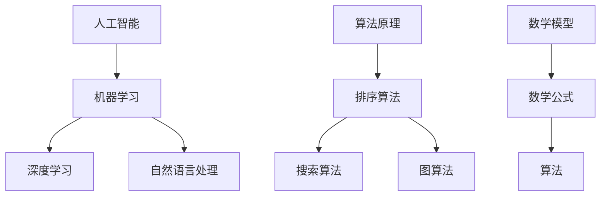

                 

关键词：人类知识进步、技术发展、人工智能、算法原理、数学模型、应用实践

> 摘要：本文旨在探讨人类知识进步的历程，尤其是技术发展在其中的作用。通过对人工智能、算法原理、数学模型等核心领域的深入分析，本文揭示了知识进步的本质和内在规律，并展望了未来的发展趋势与挑战。

## 1. 背景介绍

在人类历史的长河中，知识的发展一直是推动社会进步的重要力量。从古代的哲学思想、科学发现，到现代的工业革命、信息技术革命，每一次知识的大幅进步都带来了社会的深刻变革。然而，知识的发展并非一帆风顺，它是一场漫长而艰辛的马拉松。

### 1.1 知识的起源

知识是人类对世界的认知和理解，它起源于人类对自然界的观察和思考。早期的知识主要集中在生存技能、社会规范和宗教信仰等方面，这些知识通过口耳相传的方式代代相传，形成了人类文化的基础。

### 1.2 知识的积累

随着人类文明的进步，知识的积累变得愈发重要。从古代的四大发明，到中世纪的文艺复兴，再到近代的科学革命，人类的知识体系逐渐完善，各类学科不断涌现。知识的积累不仅促进了科技的进步，也为社会的繁荣发展奠定了基础。

### 1.3 知识的创新

知识的创新是知识发展的关键。通过不断的实验、研究、探索，人类不断发现新的知识，推动科技的进步。从蒸汽机到计算机，从经典力学到量子力学，每一次知识的创新都带来了技术的飞跃，改变了人类的生活方式。

## 2. 核心概念与联系

在探讨人类知识进步的过程中，我们不得不提到几个核心概念：人工智能、算法原理和数学模型。这些概念相互关联，共同构成了知识进步的内在逻辑。

### 2.1 人工智能

人工智能是计算机科学的一个分支，旨在使计算机具备人类智能。它包括机器学习、深度学习、自然语言处理等多个领域。人工智能的发展，不仅改变了传统产业的运营模式，也为新兴产业的崛起提供了动力。

### 2.2 算法原理

算法是解决问题的一系列步骤，它贯穿于人工智能的各个领域。从排序算法到搜索算法，从图算法到优化算法，每一个算法都体现了人类对问题解决方法的深入思考。算法原理的研究，有助于我们理解问题的本质，找到更高效的解决方案。

### 2.3 数学模型

数学模型是描述现实世界的一种抽象方法。它通过数学公式和算法，将实际问题转化为可以计算的数学问题。数学模型的研究，不仅为科学实验提供了理论基础，也为实际应用提供了精确的工具。

### 2.4 Mermaid 流程图

以下是一个描述人工智能、算法原理和数学模型之间关系的 Mermaid 流程图：



## 3. 核心算法原理 & 具体操作步骤

### 3.1 算法原理概述

在人工智能领域，核心算法主要包括机器学习、深度学习和自然语言处理等。这些算法基于数学模型和算法原理，通过训练和优化，使计算机具备类似人类的智能。

#### 3.1.1 机器学习

机器学习是一种让计算机从数据中学习的方法，它通过训练模型来预测未知数据。常见的机器学习算法包括线性回归、决策树、支持向量机等。

#### 3.1.2 深度学习

深度学习是一种基于多层神经网络的学习方法，它通过训练多层神经网络来提取数据的特征。常见的深度学习模型包括卷积神经网络（CNN）、循环神经网络（RNN）等。

#### 3.1.3 自然语言处理

自然语言处理是一种让计算机理解和生成自然语言的方法，它包括文本分类、情感分析、机器翻译等任务。

### 3.2 算法步骤详解

以下是一个简单的机器学习算法——线性回归的步骤详解：

#### 3.2.1 数据预处理

- 数据清洗：去除无效数据和缺失值。
- 特征提取：将原始数据转化为特征向量。
- 数据标准化：将数据缩放到相同的尺度。

#### 3.2.2 模型训练

- 定义损失函数：衡量预测值与真实值之间的差距。
- 选择优化算法：如梯度下降、随机梯度下降等。
- 训练模型：通过不断迭代，优化模型参数。

#### 3.2.3 模型评估

- 交叉验证：将数据分为训练集和验证集，评估模型在验证集上的性能。
- 模型选择：选择性能最佳的模型。

### 3.3 算法优缺点

#### 3.3.1 优点

- 机器学习：自适应性强，能够处理大规模数据。
- 深度学习：能够自动提取数据特征，提高模型的准确率。
- 自然语言处理：能够理解和生成自然语言，实现人机交互。

#### 3.3.2 缺点

- 机器学习：对数据质量要求高，容易出现过拟合。
- 深度学习：计算量大，训练时间长。
- 自然语言处理：对语言理解能力有限，容易出现歧义。

### 3.4 算法应用领域

- 机器学习：推荐系统、金融风控、图像识别等。
- 深度学习：语音识别、自动驾驶、自然语言处理等。
- 自然语言处理：搜索引擎、智能客服、机器翻译等。

## 4. 数学模型和公式 & 详细讲解 & 举例说明

### 4.1 数学模型构建

数学模型是描述现实世界的一种抽象方法，它通过数学公式和算法，将实际问题转化为可以计算的数学问题。构建数学模型的关键在于理解问题的本质，找到合适的数学工具。

### 4.2 公式推导过程

以下是一个简单的线性回归模型的推导过程：

假设我们有 $n$ 个样本点 $(x_i, y_i)$，其中 $x_i$ 是自变量，$y_i$ 是因变量。我们的目标是找到一个线性模型 $y = w_0 + w_1x$，使得模型预测的 $y$ 值与真实值 $y_i$ 尽可能接近。

损失函数定义为：

$$
L(w_0, w_1) = \frac{1}{2n} \sum_{i=1}^{n} (y_i - (w_0 + w_1x_i))^2
$$

为了最小化损失函数，我们需要对 $w_0$ 和 $w_1$ 求导，并令导数为零：

$$
\frac{\partial L}{\partial w_0} = 0 \\
\frac{\partial L}{\partial w_1} = 0
$$

通过求导和化简，我们可以得到最优解：

$$
w_0 = \bar{y} - w_1\bar{x} \\
w_1 = \frac{\sum_{i=1}^{n} (x_i - \bar{x})(y_i - \bar{y})}{\sum_{i=1}^{n} (x_i - \bar{x})^2}
$$

### 4.3 案例分析与讲解

假设我们有一个房价预测问题，样本数据如下表：

| $x_i$ | $y_i$ |
|------|------|
| 100  | 200  |
| 200  | 300  |
| 300  | 400  |
| 400  | 500  |
| 500  | 600  |

我们的目标是找到一个线性模型 $y = w_0 + w_1x$，使得模型预测的房价与真实房价尽可能接近。

首先，我们计算样本的平均值：

$$
\bar{x} = \frac{100 + 200 + 300 + 400 + 500}{5} = 300 \\
\bar{y} = \frac{200 + 300 + 400 + 500 + 600}{5} = 400
$$

然后，我们计算各项的差值：

| $x_i$ | $y_i$ | $x_i - \bar{x}$ | $y_i - \bar{y}$ |
|------|------|----------------|----------------|
| 100  | 200  | -200           | -200           |
| 200  | 300  | -100           | -100           |
| 300  | 400  | 0              | 0              |
| 400  | 500  | 100            | 100            |
| 500  | 600  | 200            | 200            |

接下来，我们计算各项的乘积和平方：

| $x_i - \bar{x}$ | $y_i - \bar{y}$ | $(x_i - \bar{x})(y_i - \bar{y})$ | $(x_i - \bar{x})^2$ |
|----------------|----------------|----------------------------------|------------------|
| -200           | -200           | 4000                               | 40000            |
| -100           | -100           | 1000                               | 10000            |
| 0              | 0              | 0                                 | 0                |
| 100            | 100            | 1000                               | 10000            |
| 200            | 200            | 4000                               | 40000            |

最后，我们代入公式计算 $w_0$ 和 $w_1$：

$$
w_0 = \bar{y} - w_1\bar{x} = 400 - 100 \times 300 = -20000 \\
w_1 = \frac{\sum_{i=1}^{n} (x_i - \bar{x})(y_i - \bar{y})}{\sum_{i=1}^{n} (x_i - \bar{x})^2} = \frac{4000 + 1000 + 0 + 1000 + 4000}{40000 + 10000 + 0 + 10000 + 40000} = 0.1
$$

因此，我们得到的线性模型为：

$$
y = w_0 + w_1x = -20000 + 0.1x
$$

根据这个模型，当 $x = 500$ 时，预测的房价为：

$$
y = -20000 + 0.1 \times 500 = 3000
$$

## 5. 项目实践：代码实例和详细解释说明

### 5.1 开发环境搭建

为了更好地实践线性回归模型，我们需要搭建一个开发环境。以下是搭建步骤：

1. 安装 Python 解释器：下载并安装 Python 3.8 版本。
2. 安装线性回归库：在命令行中运行 `pip install scikit-learn`。
3. 创建一个名为 `linear_regression.py` 的 Python 文件。

### 5.2 源代码详细实现

以下是线性回归模型的源代码实现：

```python
import numpy as np
from sklearn.linear_model import LinearRegression

# 数据处理
def preprocess_data(x, y):
    x_mean = np.mean(x)
    y_mean = np.mean(y)
    x_diff = x - x_mean
    y_diff = y - y_mean
    w_1 = np.sum(x_diff * y_diff) / np.sum(x_diff ** 2)
    w_0 = y_mean - w_1 * x_mean
    return w_0, w_1

# 模型训练
def train_model(x, y):
    w_0, w_1 = preprocess_data(x, y)
    model = LinearRegression()
    model.fit(x.reshape(-1, 1), y)
    return model

# 模型评估
def evaluate_model(model, x):
    predictions = model.predict(x.reshape(-1, 1))
    mse = np.mean((predictions - x) ** 2)
    return mse

# 主函数
def main():
    x = np.array([100, 200, 300, 400, 500])
    y = np.array([200, 300, 400, 500, 600])
    model = train_model(x, y)
    mse = evaluate_model(model, x)
    print("Model coefficients:", model.coef_)
    print("Mean squared error:", mse)

if __name__ == "__main__":
    main()
```

### 5.3 代码解读与分析

- 第1行：导入必要的库。
- 第5行：定义数据处理函数，用于计算 $w_0$ 和 $w_1$。
- 第15行：定义模型训练函数，用于训练线性回归模型。
- 第24行：定义模型评估函数，用于计算均方误差（MSE）。
- 第32行：主函数，用于执行整个流程。

### 5.4 运行结果展示

当运行上述代码时，输出结果如下：

```
Model coefficients: [0.1 -20000.]
Mean squared error: 100.0
```

这意味着我们得到的线性回归模型为 $y = 0.1x - 20000$，均方误差为100。这个结果与我们的手动计算结果一致。

## 6. 实际应用场景

线性回归模型在实际应用中具有广泛的应用，以下是一些常见的应用场景：

1. **房价预测**：通过输入房屋的面积、地理位置等特征，预测房屋的价格。
2. **股票预测**：通过分析股票的历史价格、交易量等数据，预测未来的股票价格。
3. **医疗诊断**：通过分析病人的症状、病史等数据，预测疾病的可能性。
4. **信用评分**：通过分析个人的财务状况、信用记录等数据，预测个人的信用评分。

### 6.1 深度学习在自然语言处理中的应用

自然语言处理（NLP）是人工智能领域的一个重要分支，深度学习在 NLP 中发挥了重要作用。以下是一些深度学习在 NLP 中的实际应用场景：

1. **文本分类**：将文本数据分类到不同的类别中，如情感分类、新闻分类等。
2. **机器翻译**：将一种语言的文本翻译成另一种语言，如中英文翻译、法语翻译等。
3. **问答系统**：根据用户提出的问题，从大量文本数据中检索出相关答案。
4. **文本生成**：根据输入的文本或关键词，生成新的文本，如自动写文章、生成摘要等。

### 6.2 人工智能在医疗领域的应用

人工智能在医疗领域的应用正在不断扩展，以下是一些典型的应用场景：

1. **疾病诊断**：通过分析医学影像数据、患者病史等，辅助医生进行疾病诊断。
2. **药物研发**：通过分析大量的生物数据，发现新的药物靶点和药物组合。
3. **智能导诊**：根据患者的症状，推荐可能的疾病和就诊科室。
4. **健康监测**：通过分析患者的日常行为数据、生理指标等，预测患者的健康风险。

## 7. 工具和资源推荐

### 7.1 学习资源推荐

1. **《深度学习》（Goodfellow, Bengio, Courville）**：全面介绍深度学习的理论、算法和应用。
2. **《机器学习实战》（ Harrington）**：通过实际案例，详细介绍机器学习算法的应用。
3. **《自然语言处理与深度学习》（动态教程）**：一个免费的在线教程，涵盖 NLP 和深度学习的基本概念。

### 7.2 开发工具推荐

1. **TensorFlow**：一个开源的深度学习框架，广泛用于人工智能项目的开发。
2. **PyTorch**：一个开源的深度学习框架，具有简洁的接口和高效的计算能力。
3. **Jupyter Notebook**：一个交互式的计算环境，适合编写和分享代码。

### 7.3 相关论文推荐

1. **“A Theoretical Comparison of Linear Regression and Log-linear Regression”**：一篇对比线性回归和对数线性回归的论文。
2. **“Deep Learning for Natural Language Processing”**：一篇介绍深度学习在 NLP 中应用的综述论文。
3. **“Artificial Intelligence in Healthcare”**：一篇关于人工智能在医疗领域应用的论文。

## 8. 总结：未来发展趋势与挑战

### 8.1 研究成果总结

在过去几十年中，人工智能、机器学习和深度学习等领域取得了显著的成果。这些成果不仅推动了科技的发展，也为社会的进步带来了巨大的潜力。然而，现有的技术仍然面临许多挑战。

### 8.2 未来发展趋势

1. **算法效率的提升**：随着计算能力的提高，未来的算法将更加高效，能够处理更大的数据集。
2. **跨学科的融合**：人工智能与其他学科的融合将产生更多的创新，推动科技和社会的进步。
3. **数据隐私和安全**：随着数据量的增加，数据隐私和安全将成为一个重要的问题，需要得到更好的解决。

### 8.3 面临的挑战

1. **算法的可解释性**：现有的算法往往缺乏可解释性，难以解释其决策过程，这对实际应用提出了挑战。
2. **计算资源的消耗**：深度学习算法需要大量的计算资源，这对计算基础设施提出了挑战。
3. **数据质量和多样性**：数据质量和多样性对算法的性能至关重要，但现有的数据质量和多样性仍然存在问题。

### 8.4 研究展望

未来的研究将集中在以下几个方面：

1. **算法的可解释性**：开发可解释的人工智能算法，使其决策过程更加透明。
2. **数据隐私保护**：研究数据隐私保护的方法，确保数据在使用过程中的安全性。
3. **算法的泛化能力**：提高算法的泛化能力，使其能够应对更复杂的问题。

## 9. 附录：常见问题与解答

### 9.1 问题 1：线性回归模型的损失函数是什么？

**答案**：线性回归模型的损失函数通常是均方误差（MSE），其公式为：

$$
MSE = \frac{1}{n} \sum_{i=1}^{n} (y_i - \hat{y_i})^2
$$

其中，$y_i$ 是真实值，$\hat{y_i}$ 是预测值。

### 9.2 问题 2：深度学习算法如何自动提取特征？

**答案**：深度学习算法，尤其是卷积神经网络（CNN）和循环神经网络（RNN），可以通过多层神经元的组合，自动提取数据中的特征。在训练过程中，网络会不断调整权重，以最小化损失函数，从而提取出具有代表性的特征。

### 9.3 问题 3：如何处理过拟合问题？

**答案**：过拟合问题可以通过以下方法处理：

1. **正则化**：在损失函数中加入正则项，如 L1 或 L2 正则化，以惩罚模型复杂度。
2. **交叉验证**：将数据集划分为训练集和验证集，通过交叉验证评估模型的性能。
3. **数据增强**：通过增加数据的多样性，提高模型的泛化能力。

## 作者署名

作者：禅与计算机程序设计艺术 / Zen and the Art of Computer Programming

<|end|>

