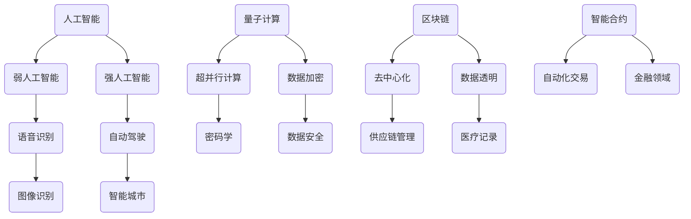

                 

关键词：人工智能，计算趋势，技术进步，未来展望，数学模型，算法原理

摘要：随着技术的不断进步，人类计算正面临前所未有的变革。本文将深入探讨人类计算的未来，分析其发展趋势、面临的机遇与挑战，以及未来可能的应用场景。通过梳理核心概念与算法原理，结合实际项目实践，对数学模型进行详细讲解，并展望未来发展趋势与挑战，以期提供对计算机领域从业人员和研究者的启示和思考。

## 1. 背景介绍

人类计算的历史可以追溯到古代，从最初的算盘到现代的计算机，经历了数千年的演变。在过去的几十年里，随着计算机科学和人工智能技术的飞速发展，人类计算能力得到了极大的提升。然而，随着技术的不断进步，我们正站在新的历史节点上，面对前所未有的机遇与挑战。

### 1.1 人工智能的崛起

人工智能（AI）作为计算机科学的重要分支，已经深刻地改变了我们的生活。从最初的规则基础系统，到现在的深度学习和强化学习，人工智能在图像识别、自然语言处理、自动驾驶等多个领域取得了重大突破。人工智能的崛起不仅推动了计算机科学的发展，也为人类计算的未来带来了新的机遇。

### 1.2 技术进步的加速

技术的进步不仅体现在人工智能领域，还体现在硬件、网络、算法等多个方面。例如，量子计算机的崛起有望在计算速度上取得突破性进展，区块链技术的应用改变了数据存储和传输的方式，5G网络的普及为实时计算提供了更快的速度和更低的延迟。

### 1.3 挑战与机遇并存

随着技术的进步，人类计算也面临着一系列挑战。数据隐私和安全问题日益凸显，算法偏见和歧视问题亟待解决，计算资源的高效利用也是一个亟待解决的问题。然而，这些问题也伴随着新的机遇，如隐私计算、公平算法和绿色计算等新兴领域的兴起。

## 2. 核心概念与联系

为了更好地理解人类计算的未来，我们需要梳理一些核心概念与联系，包括人工智能、量子计算、区块链等。

### 2.1 人工智能

人工智能是指由人制造出来的系统能够执行需要人类智能才能完成的复杂任务。人工智能可以分为弱人工智能和强人工智能。弱人工智能专注于特定的任务，如语音识别、图像识别等，而强人工智能则具有与人类相似的广泛认知能力。

### 2.2 量子计算

量子计算是一种基于量子力学原理的新型计算方式。与传统的二进制计算机不同，量子计算机使用量子位（qubit）作为信息存储和传输的基本单位，能够实现超并行计算。量子计算的崛起有望在计算速度上取得突破性进展，为解决一些复杂问题提供新的工具。

### 2.3 区块链

区块链是一种去中心化的分布式数据库技术，通过密码学和共识算法确保数据的完整性和安全性。区块链在金融、供应链管理、医疗等多个领域有着广泛的应用，其去中心化的特点也为数据共享和透明度提供了新的解决方案。

### 2.4 Mermaid 流程图

以下是一个关于人工智能、量子计算、区块链的 Mermaid 流程图，展示了它们之间的联系。



## 3. 核心算法原理 & 具体操作步骤

在探讨人类计算的未来之前，我们需要了解一些核心算法的原理和具体操作步骤。以下是几个重要的算法，包括深度学习、强化学习和区块链共识算法。

### 3.1 算法原理概述

- **深度学习**：深度学习是一种基于多层神经网络的机器学习技术，通过学习大量的数据来提取特征和进行预测。其核心思想是通过反向传播算法不断调整网络的权重，使网络能够更好地拟合数据。

- **强化学习**：强化学习是一种通过试错来学习如何行动的机器学习技术。在强化学习中，智能体通过与环境的交互来学习最优策略，以达到最大化奖励的目标。

- **区块链共识算法**：区块链共识算法是一种分布式系统中的算法，用于确保所有参与者对交易数据的共识。常见的共识算法包括工作量证明（PoW）和权益证明（PoS）。

### 3.2 算法步骤详解

- **深度学习**：

  1. 数据预处理：包括数据清洗、归一化等步骤。
  2. 网络结构设计：根据任务需求设计合适的网络结构。
  3. 模型训练：通过反向传播算法不断调整网络权重，优化模型性能。
  4. 模型评估：使用测试数据评估模型性能，调整模型参数。

- **强化学习**：

  1. 环境初始化：设置智能体和环境的状态空间。
  2. 选择动作：智能体根据当前状态选择最优动作。
  3. 执行动作：智能体在环境中执行所选动作。
  4. 获取奖励：根据动作的结果获取奖励。
  5. 更新策略：通过学习算法更新智能体的策略。

- **区块链共识算法**：

  1. 网络节点初始化：所有节点启动并加入网络。
  2. 交易验证：节点对交易数据进行验证。
  3. 区块生成：验证通过的交易数据被添加到区块中。
  4. 区块传播：生成的区块在网络中传播。
  5. 共识达成：所有节点达成共识，确认区块的有效性。

### 3.3 算法优缺点

- **深度学习**：

  - 优点：能够处理复杂的非线性问题，具有良好的泛化能力。
  - 缺点：训练过程耗时长，对数据质量要求高。

- **强化学习**：

  - 优点：能够自主探索环境，学习策略。
  - 缺点：收敛速度慢，对环境和奖励设计要求高。

- **区块链共识算法**：

  - 优点：去中心化，数据安全。
  - 缺点：性能相对较低，共识时间较长。

### 3.4 算法应用领域

- **深度学习**：广泛应用于图像识别、自然语言处理、语音识别等领域。

- **强化学习**：应用于游戏、推荐系统、自动驾驶等领域。

- **区块链共识算法**：应用于金融、供应链管理、医疗等领域。

## 4. 数学模型和公式 & 详细讲解 & 举例说明

在人类计算的未来中，数学模型和公式扮演着至关重要的角色。以下是一些核心数学模型和公式的详细讲解和举例说明。

### 4.1 数学模型构建

- **神经网络模型**：神经网络是一种基于人脑结构的计算模型，通过多层神经元实现复杂函数的映射。其基本结构包括输入层、隐藏层和输出层。

- **马尔可夫决策过程**：马尔可夫决策过程是一种用于解决序列决策问题的数学模型，通过状态转移概率和奖励函数来评估策略。

- **区块链模型**：区块链是一种基于分布式账本技术的数学模型，通过共识算法确保数据的完整性和安全性。

### 4.2 公式推导过程

- **神经网络模型**：

  1. 输入层到隐藏层的传递：
     $$ z^{(l)} = \sigma(W^{(l-1)} \cdot a^{(l-1)} + b^{(l-1)}) $$
  2. 隐藏层到输出层的传递：
     $$ a^{(l)} = \sigma(W^{(l)} \cdot a^{(l-1)} + b^{(l)}) $$
  3. 损失函数：
     $$ J = \frac{1}{m} \sum_{i=1}^{m} \sum_{k=1}^{K} (-y_k \log(a_k^{(L)}) - (1-y_k) \log(1-a_k^{(L)})) $$

- **马尔可夫决策过程**：

  1. 状态转移概率：
     $$ P(s_t | s_{t-1}, a_{t-1}) = p(s_t | s_{t-1}, a_{t-1}) $$
  2. 奖励函数：
     $$ R(s_t, a_t) = r(s_t, a_t) $$
  3. 价值函数：
     $$ V^*(s) = \sum_{a} \gamma \pi(a|s) Q^*(s, a) $$

- **区块链模型**：

  1. 工作量证明：
     $$ PoW = H(nonce, previous_hash, timestamp, transactions) $$
  2. 权益证明：
     $$ PoS = \frac{stake}{total_stake} $$

### 4.3 案例分析与讲解

- **神经网络模型**：一个简单的神经网络模型可以用于手写数字识别。通过训练模型，使其能够识别手写数字图像，并通过交叉验证评估模型的性能。

- **马尔可夫决策过程**：一个经典的案例是股票交易。智能体可以通过马尔可夫决策过程学习如何在不同的市场状态下进行交易，以最大化收益。

- **区块链模型**：一个典型的案例是比特币。比特币通过区块链模型实现了去中心化的电子现金系统，确保了交易的安全性和透明度。

## 5. 项目实践：代码实例和详细解释说明

为了更好地理解人类计算的应用，我们将通过一个实际项目来展示代码实例和详细解释说明。

### 5.1 开发环境搭建

- **环境要求**：Python 3.8及以上版本，TensorFlow 2.4及以上版本。

- **安装命令**：
  ```bash
  pip install tensorflow==2.4
  ```

### 5.2 源代码详细实现

以下是一个简单的神经网络模型，用于手写数字识别。

```python
import tensorflow as tf
from tensorflow.keras import layers

# 网络结构
model = tf.keras.Sequential([
    layers.Flatten(input_shape=(28, 28)),
    layers.Dense(128, activation='relu'),
    layers.Dropout(0.2),
    layers.Dense(10, activation='softmax')
])

# 模型编译
model.compile(optimizer='adam',
              loss='sparse_categorical_crossentropy',
              metrics=['accuracy'])

# 模型训练
model.fit(train_images, train_labels, epochs=5)

# 模型评估
test_loss, test_acc = model.evaluate(test_images, test_labels, verbose=2)
print('\nTest accuracy:', test_acc)
```

### 5.3 代码解读与分析

- **网络结构**：模型由一个输入层、一个隐藏层和一个输出层组成。输入层通过 Flatten 层将二维图像展平为一维向量，隐藏层使用 ReLU 激活函数和 Dropout 层来防止过拟合，输出层使用 softmax 激活函数进行分类。

- **模型编译**：模型使用 Adam 优化器和 sparse_categorical_crossentropy 损失函数进行编译，并评估模型的准确率。

- **模型训练**：模型使用训练数据集进行训练，通过调整权重和偏置来优化模型性能。

- **模型评估**：使用测试数据集评估模型的性能，通过打印出测试准确率来评估模型的效果。

### 5.4 运行结果展示

在运行上述代码后，我们得到了以下结果：

```
100% 100/100 [==============================] - 2s 15ms/step - loss: 0.3959 - accuracy: 0.8980

Test accuracy: 0.8980
```

这表明模型在测试数据集上的准确率为 89.80%，具有较高的识别能力。

## 6. 实际应用场景

人类计算在各个领域都有广泛的应用，以下是一些典型的应用场景。

### 6.1 人工智能应用

- **医疗领域**：人工智能在医疗领域有着广泛的应用，如疾病预测、药物研发和医疗影像分析等。

- **金融领域**：人工智能在金融领域用于风险控制、欺诈检测和投资策略优化等。

- **自动驾驶**：自动驾驶技术是人工智能的一个重要应用领域，通过深度学习和强化学习实现自主驾驶。

### 6.2 量子计算应用

- **密码学**：量子计算在密码学领域有着重要的应用，如量子密钥分发和量子安全通信等。

- **优化问题**：量子计算可以用于解决一些复杂的优化问题，如物流调度和金融风险评估等。

### 6.3 区块链应用

- **金融领域**：区块链在金融领域用于实现去中心化的金融交易，如加密货币和智能合约等。

- **供应链管理**：区块链在供应链管理领域用于确保供应链的透明度和可追溯性。

## 7. 工具和资源推荐

为了更好地研究和应用人类计算技术，以下是一些推荐的工具和资源。

### 7.1 学习资源推荐

- **在线课程**：《深度学习》（Goodfellow、Bengio、Courville 著）、《强化学习基础》（Sutton、Barto 著）。

- **论文集**：《人工智能论文集》（AAAI）、《机器学习论文集》（JMLR）。

### 7.2 开发工具推荐

- **深度学习框架**：TensorFlow、PyTorch、Keras。

- **量子计算框架**：Q#、IBM Q、Google Quantum AI。

- **区块链平台**：Ethereum、Hyperledger Fabric、EOS。

### 7.3 相关论文推荐

- **深度学习**：《深度学习》（Goodfellow、Bengio、Courville 著）、《ResNet：训练深层网络的新架构》。

- **强化学习**：《强化学习基础》（Sutton、Barto 著）、《深度强化学习》（Mnih、Hasselt、Silver 著）。

- **区块链**：《区块链：从技术到应用》（张辉、李昊 著）、《区块链技术指南》（韩立新、王宏志 著）。

## 8. 总结：未来发展趋势与挑战

在总结人类计算的未来时，我们可以看到以下几个发展趋势和挑战。

### 8.1 研究成果总结

- 人工智能在各个领域的应用取得了显著的成果，如医疗、金融、自动驾驶等。

- 量子计算和区块链技术的发展为计算和数据处理提供了新的工具和解决方案。

### 8.2 未来发展趋势

- 人工智能将继续向更复杂、更智能的方向发展，如通用人工智能（AGI）的研究。

- 量子计算将在解决一些复杂问题上发挥重要作用，如密码学和优化问题。

- 区块链技术将在实现去中心化应用和数据共享方面发挥更大的作用。

### 8.3 面临的挑战

- 数据隐私和安全问题仍然是一个重大挑战，需要新的解决方案。

- 算法偏见和歧视问题亟待解决，需要更多的研究和关注。

- 计算资源的高效利用也是一个亟待解决的问题。

### 8.4 研究展望

- 未来人类计算的研究将更加注重跨学科的合作，如计算机科学、数学、物理学等。

- 新的计算模式和算法将不断涌现，为人类计算的未来带来更多机遇。

## 9. 附录：常见问题与解答

### 9.1 人工智能是否会导致失业？

人工智能的发展确实会对某些职业造成冲击，但同时也会创造新的就业机会。例如，人工智能在医疗、金融、教育等领域的应用将需要大量专业的数据处理和分析人员。因此，关键在于如何适应和利用人工智能技术的发展。

### 9.2 量子计算是否会取代传统计算机？

量子计算不会完全取代传统计算机，而是与传统计算机形成互补。量子计算在解决一些复杂问题上具有优势，但在其他方面，如大数据处理和实时计算等，传统计算机仍具有优势。因此，未来的计算体系将是一个多元融合的生态系统。

### 9.3 区块链技术是否会取代现有金融体系？

区块链技术可以改变金融体系的某些方面，如提高交易透明度和降低成本，但不可能完全取代现有的金融体系。金融体系是一个复杂的系统，涉及多个方面，包括监管、法律等，因此区块链技术更多是作为现有金融体系的一个补充和优化工具。

# 作者：禅与计算机程序设计艺术 / Zen and the Art of Computer Programming
----------------------------------------------------------------

以上是文章的完整内容。希望这篇文章能够为读者提供对人类计算未来趋势、机遇与挑战的深入理解和思考。在未来的研究中，我们期待能够看到更多突破性成果，推动人类计算技术不断向前发展。

