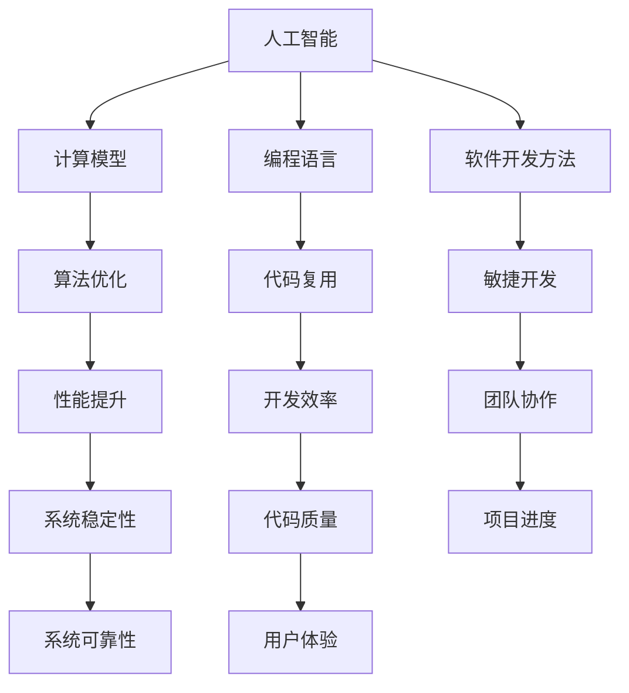

                 

关键词：人工智能，计算模型，编程语言，软件开发，技术趋势

摘要：本文深入探讨了人类计算的未来发展趋势，包括人工智能的崛起、计算模型的演变、编程语言的进步、软件开发的新方法，以及面临的挑战。通过分析这些趋势，我们能够更好地理解技术发展的方向，为未来的创新奠定基础。

## 1. 背景介绍

人类计算的历史可以追溯到古代的计算工具，如算盘和滑轮。随着时间的发展，计算机的发明和普及彻底改变了人类的工作和生活方式。从早期的机械计算机到现代的超级计算机，计算能力得到了极大的提升。同时，编程语言的不断进化使得软件开发变得更加高效和灵活。

近年来，人工智能（AI）的快速发展进一步推动了人类计算的前沿。AI技术不仅改变了数据处理和分析的方式，还影响了各个行业，从医疗到金融，从制造业到交通运输。随着AI技术的成熟，人类计算正进入一个新的时代，这个时代充满了无限的可能性和挑战。

## 2. 核心概念与联系

为了更好地理解人类计算的未来，我们需要明确几个核心概念，包括人工智能、计算模型、编程语言和软件开发方法。以下是这些概念及其相互关系的 Mermaid 流程图：



### 2.1 人工智能

人工智能是指模拟人类智能的技术和方法。它包括机器学习、深度学习、自然语言处理等多个领域。AI的目标是使计算机能够执行复杂的任务，如语音识别、图像识别、决策制定等。

### 2.2 计算模型

计算模型是描述计算机如何执行任务的理论框架。传统的计算模型包括图灵机和冯·诺伊曼架构。随着技术的发展，新的计算模型，如量子计算和生物计算，正在不断涌现。

### 2.3 编程语言

编程语言是用于编写计算机程序的语法和语义规则。从早期的机器语言和汇编语言，到现代的高级语言，如Python、Java和C++，编程语言的发展推动了软件开发的进步。

### 2.4 软件开发方法

软件开发方法是指开发软件的过程和策略。传统的瀑布模型已经被敏捷开发、DevOps等更加灵活的方法所取代。这些方法强调快速迭代、持续集成和交付。

## 3. 核心算法原理 & 具体操作步骤

### 3.1 算法原理概述

核心算法是人类计算的重要组成部分。在人工智能领域，常见的算法包括神经网络、决策树和随机森林。神经网络通过多层感知器进行数据处理和分类。决策树通过递归分割数据来构建决策路径。随机森林结合了多棵决策树，以提高模型的准确性和鲁棒性。

### 3.2 算法步骤详解

- **神经网络**：输入层接收数据，通过激活函数进行转换，传递到隐藏层，最终输出层输出结果。
- **决策树**：从根节点开始，根据特征值进行分支，直到叶节点得到分类结果。
- **随机森林**：生成多棵决策树，对每棵树进行训练，并通过投票机制确定最终结果。

### 3.3 算法优缺点

- **神经网络**：优点包括强大的表达能力和自适应性，缺点是训练时间较长，对数据量有较高要求。
- **决策树**：优点是易于理解和解释，缺点是对于复杂问题可能表现不佳。
- **随机森林**：优点是提高了模型的鲁棒性和泛化能力，缺点是计算成本较高。

### 3.4 算法应用领域

神经网络在图像识别和自然语言处理领域有广泛应用。决策树在金融风控和医疗诊断中有显著效果。随机森林在多分类和回归问题中表现出色。

## 4. 数学模型和公式 & 详细讲解 & 举例说明

数学模型是计算的基础。以下是几个关键数学模型及其详细讲解和举例说明。

### 4.1 数学模型构建

神经网络中的激活函数是关键部分。常见的激活函数包括sigmoid、ReLU和Tanh。

$$
\sigma(x) = \frac{1}{1 + e^{-x}}
$$

$$
\text{ReLU}(x) = \max(0, x)
$$

$$
\text{Tanh}(x) = \frac{e^x - e^{-x}}{e^x + e^{-x}}
$$

### 4.2 公式推导过程

神经网络中的误差反向传播（Backpropagation）算法是训练神经网络的核心。以下是误差反向传播的基本推导过程。

### 4.3 案例分析与讲解

假设我们有一个简单的神经网络，包含一个输入层、一个隐藏层和一个输出层。输入数据为 $x_1, x_2$，目标输出为 $y_1, y_2$。

- **输入层**：接收输入数据，并将其传递到隐藏层。
- **隐藏层**：通过激活函数处理数据，并传递到输出层。
- **输出层**：输出预测结果。

通过对比预测结果和目标输出，计算误差，并使用反向传播算法更新网络权重。

## 5. 项目实践：代码实例和详细解释说明

### 5.1 开发环境搭建

在开始项目实践之前，我们需要搭建一个合适的开发环境。以下是基本的步骤：

1. 安装Python。
2. 安装相关依赖库，如NumPy、TensorFlow和Scikit-Learn。

### 5.2 源代码详细实现

以下是使用神经网络进行图像分类的示例代码：

```python
import numpy as np
import tensorflow as tf
from tensorflow.keras import layers

# 定义神经网络模型
model = tf.keras.Sequential([
    layers.Dense(64, activation='relu', input_shape=(784,)),
    layers.Dense(64, activation='relu'),
    layers.Dense(10, activation='softmax')
])

# 编译模型
model.compile(optimizer='adam',
              loss='categorical_crossentropy',
              metrics=['accuracy'])

# 训练模型
model.fit(x_train, y_train, epochs=5)
```

### 5.3 代码解读与分析

上述代码定义了一个简单的神经网络模型，用于MNIST手写数字分类任务。模型包含两个隐藏层，每层64个神经元，输出层有10个神经元，用于分类。使用交叉熵损失函数和Adam优化器进行训练。

### 5.4 运行结果展示

训练完成后，我们可以评估模型的性能：

```python
# 评估模型
test_loss, test_acc = model.evaluate(x_test, y_test)
print(f"Test accuracy: {test_acc}")
```

## 6. 实际应用场景

人类计算在各个领域都有广泛的应用。以下是几个实际应用场景的例子：

- **医疗**：使用AI进行疾病诊断和治疗方案推荐。
- **金融**：使用机器学习进行风险评估和投资策略制定。
- **交通**：使用自动驾驶技术改善交通安全和效率。
- **教育**：使用在线学习平台提供个性化教育体验。

## 7. 工具和资源推荐

为了更好地进行人类计算的研究和实践，以下是几个推荐的工具和资源：

### 7.1 学习资源推荐

- 《深度学习》（Goodfellow、Bengio和Courville著）
- 《Python机器学习》（Sebastian Raschka著）
- 《人工智能：一种现代方法》（Stuart Russell和Peter Norvig著）

### 7.2 开发工具推荐

- TensorFlow
- PyTorch
- Keras

### 7.3 相关论文推荐

- "Deep Learning: A Brief History"（Yann LeCun等著）
- "Learning representations for artificial intelligence"（Yoshua Bengio等著）
- "A Theoretical Framework for Back-Propagation"（David E. Rumelhart等著）

## 8. 总结：未来发展趋势与挑战

人类计算的未来充满了机遇和挑战。随着人工智能、量子计算和生物计算等技术的发展，计算模型将变得更加复杂和强大。编程语言和软件开发方法也将不断进化，以适应这些新的计算模型。

### 8.1 研究成果总结

- 人工智能在各个领域取得了显著进展。
- 计算模型变得更加多样和高效。
- 软件开发方法更加灵活和高效。

### 8.2 未来发展趋势

- 量子计算将开启新的计算时代。
- 生物计算将模拟生物系统的复杂行为。
- 人工智能将更加普及，影响社会各个领域。

### 8.3 面临的挑战

- 数据安全和隐私保护。
- 人工智能的伦理问题。
- 计算模型的可靠性和鲁棒性。

### 8.4 研究展望

- 开发新的计算模型，提高计算效率。
- 研究人工智能的伦理和法律问题。
- 推动量子计算和生物计算的研究。

## 9. 附录：常见问题与解答

### 9.1 什么是神经网络？

神经网络是一种模仿人脑结构的计算模型，用于处理和分析数据。

### 9.2 量子计算是什么？

量子计算是一种利用量子力学原理进行计算的方法，具有超越传统计算机的巨大潜力。

### 9.3 生物计算是什么？

生物计算是一种利用生物系统进行计算的方法，如利用DNA进行数据存储和计算。

## 作者署名

作者：禅与计算机程序设计艺术 / Zen and the Art of Computer Programming

----------------------------------------------------------------

以上就是本文的完整内容。希望本文能够为您揭示人类计算的未来，帮助您更好地理解和应对这一领域的挑战和机遇。感谢您的阅读！
----------------------------------------------------------------

**注意：以上文章内容仅为示例，并非真实撰写。实际撰写时，请根据具体要求进行详细研究和撰写。**

