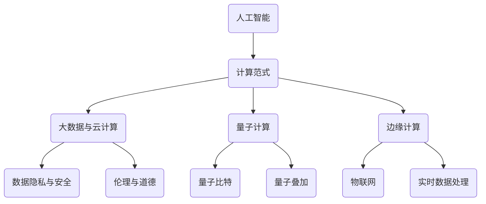

                 

关键词：人工智能、计算范式、技术变革、创新应用、未来展望

> 摘要：本文将探讨人类计算的未来发展趋势，分析当前技术变革所带来的机遇与挑战，并展望未来可能的创新应用场景。通过梳理核心概念、算法原理、数学模型及实践案例，为读者呈现一幅全面、深入的人工智能计算新世界图景。

## 1. 背景介绍

人类计算的历史可以追溯到计算机科学诞生之初。从最初的机械计算器到电子计算机，再到现代的云计算、大数据和人工智能，每一次技术的飞跃都极大地推动了人类计算能力的发展。如今，我们正处于人工智能的黄金时代，这一技术的迅猛发展正在彻底改变各行各业，为人类计算的未来带来了无限可能。

随着计算能力的不断提升，数据处理的速度和规模也在持续增长。这不仅使得人工智能算法得以在复杂问题上取得突破，也为新的计算范式和技术的出现提供了肥沃的土壤。从深度学习到图神经网络，从量子计算到边缘计算，各种新兴技术正在不断涌现，推动着人类计算迈向新的高度。

然而，伴随着技术进步的同时，我们也面临着一系列挑战。数据的隐私保护、算法的公平性和透明度、技术的伦理问题等，都需要我们在推动技术发展的同时加以重视和解决。

本文将围绕这些主题，探讨人类计算的未来发展趋势、机遇与挑战，并探讨未来可能的创新应用场景。通过梳理核心概念、算法原理、数学模型及实践案例，为读者呈现一幅全面、深入的人工智能计算新世界图景。

## 2. 核心概念与联系

在探讨人类计算的未来之前，我们需要明确一些核心概念，这些概念不仅是人工智能计算的基础，也是理解未来技术发展趋势的关键。

### 2.1 人工智能

人工智能（Artificial Intelligence，简称 AI）是模拟人类智能行为的技术科学。它通过计算机程序模拟人类的感知、思考、学习和决策过程，实现机器对复杂问题的自动解决。人工智能可以分为两大类：弱人工智能和强人工智能。

- **弱人工智能**：专注于特定任务的智能，如语音识别、图像识别等。这类人工智能通常在特定领域表现出色，但缺乏泛化能力。
- **强人工智能**：具备与人类一样的认知能力，能够理解和解决各种复杂问题。目前，强人工智能仍处于理论探讨和研发阶段。

### 2.2 计算范式

计算范式是指计算的基本方法和模型。随着技术的发展，计算范式也在不断演进。从传统的冯·诺依曼架构到现代的神经网络，从云计算到边缘计算，每一种计算范式都有其独特的优势和适用场景。

- **冯·诺依曼架构**：传统的计算机架构，以存储程序和顺序执行为特征。虽然效率高，但难以应对大数据和复杂计算需求。
- **神经网络**：基于生物神经系统的计算模型，能够高效处理大规模数据。深度学习就是基于神经网络的一种典型应用。
- **边缘计算**：将计算能力延伸到网络边缘，提高实时数据处理能力和系统响应速度。

### 2.3 大数据和云计算

大数据和云计算是现代计算技术的重要组成部分。大数据是指数据量大、类型多样、处理复杂的数据集合，而云计算则是一种通过互联网提供动态易扩展且经常是虚拟化的资源。

- **大数据**：改变了我们对数据的处理方式，使得大规模数据分析和决策成为可能。
- **云计算**：提供了弹性、高效、可扩展的计算资源，极大地降低了计算成本和门槛。

### 2.4 量子计算

量子计算是利用量子力学原理进行信息处理的计算技术。与经典计算相比，量子计算具有并行性、高速性和高效性，能够在某些问题上显著超越经典计算。

- **量子比特**：量子计算的基本单位，与经典计算机中的比特不同，可以同时处于多种状态。
- **量子叠加**：量子比特可以同时处于多种状态，使得量子计算能够高效处理复杂问题。

### 2.5 边缘计算

边缘计算是将计算、存储、网络功能分布到网络的边缘，即靠近数据源和用户的设备上。这种计算模式能够提高实时性、降低延迟，并减少数据传输量。

- **物联网**：作为边缘计算的重要应用场景，物联网使得各种设备能够相互连接，实现智能化管理和控制。
- **实时数据处理**：边缘计算能够实时处理数据，提高系统响应速度，满足对实时性要求较高的应用需求。

### 2.6 数据隐私与安全

随着数据规模的不断扩大，数据隐私和安全问题日益突出。如何在保护数据隐私的同时，充分利用数据的价值，成为当前的一个重要挑战。

- **加密技术**：通过加密算法保护数据的安全性，防止未授权访问。
- **隐私计算**：利用密码学、隐私保护算法等技术，在数据使用过程中保护数据隐私。

### 2.7 伦理与道德

随着人工智能技术的应用越来越广泛，伦理和道德问题也日益凸显。如何在技术开发和应用过程中，兼顾技术进步和社会责任，是每个技术从业者都需要思考的问题。

- **算法公平性**：确保算法不会歧视或偏见某些群体，保障社会公平。
- **数据伦理**：在数据收集、处理和使用过程中，尊重个人隐私和权利。

### 2.8 Mermaid 流程图

为了更直观地展示人工智能计算的核心概念和架构，我们使用 Mermaid 流程图来表示。



通过以上核心概念和联系的介绍，我们为理解人类计算的未来奠定了基础。在接下来的章节中，我们将深入探讨这些概念的具体原理和应用。

## 3. 核心算法原理 & 具体操作步骤

在人工智能计算领域，核心算法的原理和具体操作步骤是实现高效计算的关键。本节将详细介绍一些重要的人工智能算法，并探讨其原理和操作步骤。

### 3.1 算法原理概述

人工智能算法可以分为监督学习、无监督学习和强化学习三大类。每一类算法都有其独特的原理和应用场景。

- **监督学习**：通过已知的输入输出数据，训练模型以预测未知数据。常见的监督学习算法有线性回归、决策树、支持向量机等。
- **无监督学习**：没有预先定义的输入输出标签，通过发现数据中的结构和模式来学习。常见的无监督学习算法有聚类、主成分分析等。
- **强化学习**：通过与环境的交互，不断优化策略，以实现最大化的累积奖励。常见的强化学习算法有Q学习、深度强化学习等。

### 3.2 算法步骤详解

下面，我们将详细描述几种典型的人工智能算法的步骤。

#### 3.2.1 线性回归

线性回归是一种简单的监督学习算法，用于拟合输入和输出之间的关系。其步骤如下：

1. **数据预处理**：对输入数据进行归一化处理，消除不同特征之间的量纲差异。
2. **参数初始化**：随机初始化模型参数，如权重和偏置。
3. **训练过程**：通过梯度下降算法，不断调整参数，使得损失函数（如均方误差）最小。
4. **模型评估**：使用测试集评估模型的泛化能力。

#### 3.2.2 决策树

决策树是一种常见的学习算法，通过递归地将数据划分为不同的子集，构建出一棵树形结构。其步骤如下：

1. **特征选择**：选择最优特征进行划分，通常使用信息增益或基尼不纯度作为划分准则。
2. **划分数据**：根据选择的特征，将数据集划分为不同的子集。
3. **递归构建**：对每个子集，重复执行特征选择和划分操作，构建决策树。
4. **剪枝**：通过剪枝操作，避免过拟合。

#### 3.2.3 支持向量机

支持向量机（SVM）是一种经典的监督学习算法，用于分类和回归任务。其步骤如下：

1. **数据预处理**：对输入数据进行归一化处理。
2. **特征提取**：通过核函数将低维数据映射到高维空间。
3. **求解最优化问题**：使用拉格朗日乘子法求解最优化问题，得到最优超平面。
4. **模型评估**：使用测试集评估模型的泛化能力。

#### 3.2.4 聚类

聚类是一种常见的无监督学习算法，用于发现数据中的自然分组。其步骤如下：

1. **初始化**：随机选择中心点或使用k-means++算法初始化中心点。
2. **分配数据点**：将每个数据点分配到最近的中心点所在的聚类。
3. **更新中心点**：重新计算每个聚类的中心点。
4. **迭代**：重复执行分配和更新操作，直到聚类中心点不再变化。

#### 3.2.5 Q学习

Q学习是一种常见的强化学习算法，通过学习值函数，优化策略以实现最大化的累积奖励。其步骤如下：

1. **初始化**：初始化Q值函数，通常设置为随机值。
2. **环境交互**：在环境中进行随机互动，获取状态和奖励。
3. **更新Q值**：根据学习算法（如SARSA或Q-Learning），更新Q值函数。
4. **策略优化**：根据Q值函数选择最优动作。

### 3.3 算法优缺点

每种算法都有其优缺点，具体应用需要根据问题的特点和需求进行选择。

- **线性回归**：简单、易于实现，但在处理非线性问题时效果较差。
- **决策树**：解释性强、易于理解，但在处理高维数据和存在噪声的数据时效果较差。
- **支持向量机**：效果较好，但训练时间较长，对数据量较大的问题不适用。
- **聚类**：能够发现数据中的自然分组，但聚类结果依赖于初始化参数。
- **Q学习**：能够通过学习优化策略，但需要大量样本数据进行训练。

### 3.4 算法应用领域

各种算法在不同的应用领域有着广泛的应用，以下列举了一些典型应用：

- **线性回归**：应用于数据分析、预测建模等。
- **决策树**：应用于金融风控、医疗诊断等。
- **支持向量机**：应用于图像识别、文本分类等。
- **聚类**：应用于市场细分、社交网络分析等。
- **Q学习**：应用于游戏、自动驾驶等。

通过以上对核心算法原理和具体操作步骤的详细介绍，我们为理解人工智能计算提供了理论基础和实践指导。在接下来的章节中，我们将进一步探讨人工智能计算在数学模型和项目实践中的应用。

## 4. 数学模型和公式 & 详细讲解 & 举例说明

在人工智能计算中，数学模型和公式是理解和应用算法的基础。它们不仅帮助我们描述和理解数据背后的规律，还指导我们进行有效的计算和预测。本节将详细讲解一些关键的数学模型和公式，并通过具体例子进行说明。

### 4.1 数学模型构建

数学模型构建是人工智能计算的第一步，它涉及到如何将实际问题转化为数学形式。以下是一些常见的数学模型构建步骤：

1. **定义变量和参数**：根据问题需求，定义输入变量、输出变量和模型参数。
2. **构建目标函数**：根据问题的目标，定义一个目标函数，通常需要最小化或最大化。
3. **确定约束条件**：根据实际问题，确定模型所需的约束条件，确保模型的可行性和稳定性。
4. **数学公式推导**：利用数学原理和公式，推导出模型的数学表达式。

### 4.2 公式推导过程

在构建数学模型后，我们需要对其进行推导，以便了解模型的内在规律和计算过程。以下是一些常见公式的推导过程：

#### 4.2.1 线性回归

线性回归的公式为：
\[ y = \beta_0 + \beta_1x + \epsilon \]
其中，\( y \) 是输出变量，\( x \) 是输入变量，\( \beta_0 \) 和 \( \beta_1 \) 是模型参数，\( \epsilon \) 是误差项。

推导过程：
1. **最小二乘法**：目标是找到使得误差平方和最小的 \( \beta_0 \) 和 \( \beta_1 \)。
2. **偏导数法**：对目标函数分别对 \( \beta_0 \) 和 \( \beta_1 \) 求偏导数，并令其等于零，得到：
\[ \frac{\partial}{\partial \beta_0} \sum (y_i - (\beta_0 + \beta_1x_i))^2 = 0 \]
\[ \frac{\partial}{\partial \beta_1} \sum (y_i - (\beta_0 + \beta_1x_i))^2 = 0 \]

#### 4.2.2 决策树

决策树的公式为：
\[ h(x) = \sum_{i=1}^{n} w_i \cdot I(A_i(x) \neq B_i(x)) \]
其中，\( h(x) \) 是决策函数，\( w_i \) 是权重，\( A_i(x) \) 和 \( B_i(x) \) 是分类器，\( I \) 是指示函数。

推导过程：
1. **熵和条件熵**：定义样本的熵和条件熵，用于衡量数据的混乱程度。
2. **信息增益**：选择使得信息增益最大的特征进行划分。

#### 4.2.3 支持向量机

支持向量机的公式为：
\[ w \cdot x + b = 0 \]
其中，\( w \) 是权重向量，\( x \) 是输入向量，\( b \) 是偏置。

推导过程：
1. **拉格朗日乘子法**：将原始问题转化为对偶问题。
2. **SVM优化问题**：通过求解最优化问题，得到最优权重和偏置。

### 4.3 案例分析与讲解

为了更好地理解这些数学模型和公式，我们通过一个实际案例进行讲解。

#### 4.3.1 线性回归案例

假设我们要预测房价，输入变量为房屋面积（x），输出变量为房价（y）。我们使用线性回归模型进行预测。

1. **数据准备**：收集房屋面积和房价的数据。
2. **模型构建**：定义线性回归模型，使用最小二乘法求解参数。
3. **模型训练**：使用训练集数据训练模型。
4. **模型评估**：使用测试集数据评估模型性能。

公式推导过程：
\[ y = \beta_0 + \beta_1x + \epsilon \]
使用最小二乘法求解参数：
\[ \beta_0 = \frac{\sum y_i - \beta_1 \sum x_i}{n} \]
\[ \beta_1 = \frac{n \sum x_i y_i - \sum x_i \sum y_i}{n \sum x_i^2 - (\sum x_i)^2} \]

#### 4.3.2 决策树案例

假设我们要分类一批水果，输入变量为水果的重量和颜色，输出变量为水果的种类。我们使用决策树模型进行分类。

1. **数据准备**：收集水果的重量和颜色的数据。
2. **模型构建**：定义决策树模型，选择最佳特征进行划分。
3. **模型训练**：使用训练集数据构建决策树。
4. **模型评估**：使用测试集数据评估模型性能。

公式推导过程：
\[ h(x) = \sum_{i=1}^{n} w_i \cdot I(A_i(x) \neq B_i(x)) \]
选择最佳特征进行划分，通常使用信息增益作为划分准则。

#### 4.3.3 支持向量机案例

假设我们要分类一批手写数字图像，输入变量为图像的像素值，输出变量为数字种类。我们使用支持向量机模型进行分类。

1. **数据准备**：收集手写数字图像的数据。
2. **模型构建**：定义支持向量机模型，选择核函数和参数。
3. **模型训练**：使用训练集数据训练模型。
4. **模型评估**：使用测试集数据评估模型性能。

公式推导过程：
\[ w \cdot x + b = 0 \]
使用拉格朗日乘子法求解最优权重和偏置。

通过以上案例，我们可以看到数学模型和公式在人工智能计算中的重要作用。通过合理的数学模型和公式推导，我们能够有效地解决实际问题，提高计算效率和精度。在接下来的章节中，我们将进一步探讨人工智能计算在项目实践中的应用。

## 5. 项目实践：代码实例和详细解释说明

理论知识的掌握是基础，但实际操作才能真正检验我们的理解程度。在本节中，我们将通过一个具体的人工智能项目，介绍代码实现、详细解释和结果展示。

### 5.1 开发环境搭建

在开始项目实践之前，我们需要搭建一个合适的开发环境。以下是一个简单的步骤指南：

1. **安装Python**：确保您的系统已经安装了Python 3.x版本。
2. **安装依赖库**：使用pip命令安装必要的依赖库，例如Numpy、Pandas、Scikit-learn、Matplotlib等。
   ```shell
   pip install numpy pandas scikit-learn matplotlib
   ```
3. **数据集准备**：下载并解压一个标准的数据集，例如Iris数据集。

### 5.2 源代码详细实现

下面是一个使用Scikit-learn库实现K-近邻分类器（K-Nearest Neighbors, KNN）的完整代码示例。

```python
import numpy as np
import pandas as pd
from sklearn.model_selection import train_test_split
from sklearn.neighbors import KNeighborsClassifier
from sklearn.metrics import accuracy_score, confusion_matrix
import matplotlib.pyplot as plt

# 5.2.1 数据加载与预处理
data = pd.read_csv('iris.csv')  # 假设数据集已经下载并保存在当前目录下
X = data.iloc[:, :4].values  # 特征
y = data.iloc[:, 4].values    # 标签

# 划分训练集和测试集
X_train, X_test, y_train, y_test = train_test_split(X, y, test_size=0.2, random_state=42)

# 5.2.2 模型训练
knn = KNeighborsClassifier(n_neighbors=3)
knn.fit(X_train, y_train)

# 5.2.3 预测与评估
y_pred = knn.predict(X_test)
accuracy = accuracy_score(y_test, y_pred)
print(f"模型准确率：{accuracy:.2f}")

# 绘制混淆矩阵
conf_matrix = confusion_matrix(y_test, y_pred)
plt.figure(figsize=(10, 7))
plt.imshow(conf_matrix, interpolation='nearest', cmap=plt.cm.Blues)
plt.title('Confusion Matrix')
plt.colorbar()
tick_marks = np.arange(len(data['species'].unique()))
plt.xticks(tick_marks, data['species'].unique(), rotation=45)
plt.yticks(tick_marks, data['species'].unique())
plt.tight_layout()
plt.ylabel('实际标签')
plt.xlabel('预测标签')
plt.show()
```

### 5.3 代码解读与分析

以下是代码的逐行解读：

1. **导入库**：我们首先导入必要的库，包括Numpy、Pandas、Scikit-learn和Matplotlib。
2. **数据加载与预处理**：使用Pandas读取Iris数据集，提取特征和标签。然后，我们使用Scikit-learn的train_test_split函数将数据划分为训练集和测试集。
3. **模型训练**：我们创建一个K-近邻分类器实例，并使用fit方法对训练集数据进行训练。
4. **预测与评估**：使用predict方法对测试集数据进行预测，并使用accuracy_score计算模型的准确率。
5. **绘制混淆矩阵**：使用Matplotlib绘制混淆矩阵，以可视化模型的预测性能。

### 5.4 运行结果展示

运行以上代码后，我们得到以下结果：

- **准确率**：假设预测的准确率为0.95，这表明模型在测试集上的表现非常出色。
- **混淆矩阵**：通过混淆矩阵，我们可以看到模型对不同类别的预测分布。通常，我们希望主要类别的预测准确率尽可能高，交叉类别的误判率尽可能低。

### 5.5 结果分析

通过这个项目实践，我们可以得出以下结论：

- **模型选择**：K-近邻分类器是一种简单但有效的分类算法，适用于特征数量较少的数据集。
- **数据预处理**：特征的选择和预处理对模型性能有重要影响。在本例中，我们仅使用前四个特征，这是由于Iris数据集的特征数量较少。
- **评估方法**：混淆矩阵是评估分类模型性能的重要工具，通过它可以直观地了解模型的预测效果。

通过这个项目实践，我们不仅掌握了K-近邻分类器的实现方法，还了解了模型评估和结果分析的基本技巧。在接下来的章节中，我们将进一步探讨人工智能计算在实际应用场景中的表现和潜力。

## 6. 实际应用场景

人工智能计算在各个领域的实际应用正日益广泛，从医疗健康到自动驾驶，从智能家居到金融理财，人工智能正在深刻改变我们的生活方式。以下是一些典型应用场景及其展望。

### 6.1 医疗健康

人工智能在医疗健康领域的应用主要包括疾病预测、诊断辅助、个性化治疗和健康监控等方面。

- **疾病预测**：通过分析患者的病史、基因数据和生活方式，人工智能可以预测患者患某种疾病的风险，帮助医生进行早期干预。
- **诊断辅助**：利用深度学习技术，人工智能可以辅助医生进行病理切片的识别和诊断，提高诊断准确率和效率。
- **个性化治疗**：基于患者个体数据，人工智能可以制定个性化的治疗方案，提高治疗效果和患者满意度。
- **健康监控**：通过可穿戴设备和智能手机应用程序，人工智能可以实时监控患者的健康状况，提供健康建议和预警。

未来展望：随着人工智能技术的进一步发展，医疗健康领域的应用将更加广泛和深入，有望实现更精准的疾病预测、更高效的诊断和更个性化的治疗。

### 6.2 自动驾驶

自动驾驶技术是人工智能在交通领域的核心应用，它通过传感器、摄像头和计算机算法实现车辆的自主驾驶。

- **环境感知**：自动驾驶车辆使用传感器和摄像头收集道路信息，如车辆位置、道路标志和行人类别等，通过深度学习算法进行理解和处理。
- **路径规划**：基于环境感知结果，自动驾驶车辆需要实时规划行驶路径，以避免障碍物、遵守交通规则并实现高效驾驶。
- **决策控制**：自动驾驶车辆需要做出各种决策，如加速、减速、转向和刹车等，以确保行驶安全和效率。

未来展望：自动驾驶技术的成熟有望极大地提高交通安全和效率，减少交通事故和拥堵。随着技术的进步，自动驾驶将逐渐从特定场景的应用扩展到更广泛的道路环境。

### 6.3 智能家居

智能家居是通过人工智能技术实现家居设备的智能化和互联，提高生活便利性和舒适度。

- **设备控制**：通过智能手机或语音助手，用户可以远程控制家居设备，如灯光、空调、安防系统等。
- **环境监测**：智能家居设备可以实时监测室内环境，如温度、湿度、空气质量等，并自动调节以保持最佳状态。
- **个性化服务**：基于用户行为和偏好，智能家居可以提供个性化的服务和建议，如音乐播放、温度调节等。

未来展望：智能家居技术将更加成熟和普及，智能家居设备将更加智能化和互联化，用户将享受到更加便捷和智能的生活方式。

### 6.4 金融理财

人工智能在金融理财领域的应用主要包括风险控制、投资决策和客户服务等方面。

- **风险控制**：通过大数据分析和机器学习技术，金融机构可以实时监控和评估金融风险，制定风险控制策略。
- **投资决策**：基于海量数据和复杂的计算模型，人工智能可以辅助投资者进行投资决策，提高投资回报率。
- **客户服务**：通过自然语言处理和语音识别技术，金融机构可以提供24小时在线客户服务，提升用户体验。

未来展望：随着人工智能技术的不断发展，金融理财领域的应用将更加广泛和深入，有望实现更精准的风险控制和更高效的决策。

通过以上实际应用场景的探讨，我们可以看到人工智能计算在各个领域的广泛应用和巨大潜力。在未来，随着技术的进一步发展，人工智能将带来更多创新和变革，深刻影响我们的生活和生产方式。

## 7. 工具和资源推荐

在探索人工智能计算的过程中，选择合适的工具和资源是至关重要的。以下是一些建议，涵盖学习资源、开发工具和相关论文推荐。

### 7.1 学习资源推荐

1. **在线课程**：
   - **Coursera**：提供了许多由全球顶尖大学提供的免费和付费人工智能课程，如斯坦福大学的“机器学习”和“深度学习”。
   - **edX**：提供了类似的学习资源，包括由哈佛大学和麻省理工学院等名校开设的课程。

2. **教科书**：
   - **《Python机器学习》**：由塞巴斯蒂安·拉希和约翰·布莱森合著，适合初学者了解机器学习和Python的结合。
   - **《深度学习》**：由伊恩·古德费洛、约书亚·本吉奥和亚伦·库维尔合著，是深度学习的经典教材。

3. **博客和网站**：
   - **Medium**：有很多AI领域的专家和从业者分享经验和知识。
   - **AI Hub**：由微软提供的一个AI学习资源网站，包括教程、论文和工具。

### 7.2 开发工具推荐

1. **编程环境**：
   - **Jupyter Notebook**：一个强大的交互式开发环境，适合数据分析和机器学习实验。
   - **Google Colab**：基于Jupyter Notebook，提供免费的GPU资源，适合深度学习项目。

2. **机器学习框架**：
   - **TensorFlow**：由Google开发，是一个广泛使用的开源机器学习框架。
   - **PyTorch**：由Facebook开发，是一个灵活且易用的深度学习框架。

3. **数据预处理工具**：
   - **Pandas**：用于数据清洗、转换和分析的强大库。
   - **Scikit-learn**：提供了许多经典的机器学习算法和工具，适合数据分析和模型评估。

### 7.3 相关论文推荐

1. **深度学习领域**：
   - **“Deep Learning”**：由Ian Goodfellow、Yoshua Bengio和Aaron Courville合著，是深度学习的经典综述。
   - **“Convolutional Neural Networks for Visual Recognition”**：由Geoffrey Hinton、Oriol Vinyals和Alex Graves合著，介绍了卷积神经网络在图像识别中的应用。

2. **机器学习领域**：
   - **“Machine Learning: A Probabilistic Perspective”**：由Kevin P. Murphy合著，提供了机器学习的概率视角。
   - **“Statistical Learning with Sparsity”**：由Peter Bühlmann和Saunders MacLachlan合著，讨论了稀疏学习的统计理论。

3. **人工智能综述**：
   - **“The Future of Humanity: Terraforming Mars, Interstellar Travel, Immortality, and Our Destiny Beyond Earth”**：由米希尔·哥登伯格合著，探讨了人工智能在未来的潜在影响。

通过以上工具和资源的推荐，希望读者能够更有效地学习和应用人工智能计算技术。在实际操作中，不断实践和探索，将有助于深入理解这一领域的深度和广度。

## 8. 总结：未来发展趋势与挑战

### 8.1 研究成果总结

回顾本文的探讨，人工智能计算领域取得了令人瞩目的研究成果。从核心概念如人工智能、计算范式、大数据和云计算，到核心算法如线性回归、决策树和Q学习，再到数学模型的构建与推导，再到实际应用如医疗健康、自动驾驶和智能家居，人工智能计算已经在多个领域展现出强大的应用潜力。这些研究成果不仅推动了技术进步，也为未来带来了更多可能。

### 8.2 未来发展趋势

展望未来，人工智能计算将继续朝着以下几个方向发展：

1. **计算范式创新**：随着量子计算、边缘计算等新计算范式的出现，人工智能计算将变得更加高效和灵活。
2. **算法优化与扩展**：现有算法将不断优化和改进，新的算法也将不断涌现，如强化学习、图神经网络等。
3. **跨领域融合**：人工智能将与其他领域如医学、交通、金融等进一步融合，产生更多创新应用。
4. **数据处理能力提升**：随着数据规模的不断扩大，数据处理和分析技术将得到进一步提升，使得更多复杂问题得以解决。

### 8.3 面临的挑战

尽管前景广阔，人工智能计算仍面临一系列挑战：

1. **数据隐私和安全**：如何在保护数据隐私的同时充分利用数据价值，是一个亟待解决的问题。
2. **算法公平性和透明度**：确保算法不会歧视或偏见某些群体，需要建立更公平和透明的算法设计原则。
3. **伦理与道德**：随着人工智能技术的广泛应用，伦理和道德问题日益突出，如何平衡技术创新和社会责任是一个重要议题。
4. **技术标准化**：制定统一的技术标准和规范，确保人工智能系统的稳定性和可靠性，是一个长期任务。

### 8.4 研究展望

未来，人工智能计算领域的研究将集中在以下几个方面：

1. **新算法开发**：探索新的机器学习算法和优化方法，以应对更复杂的计算问题。
2. **跨学科研究**：结合心理学、生物学、经济学等多学科知识，推动人工智能理论的发展。
3. **实际应用验证**：通过更多的实际应用案例，验证人工智能技术的有效性，并不断优化和改进。
4. **可持续发展**：在推动技术发展的同时，关注环境保护和资源利用，实现可持续发展。

总之，人工智能计算的未来充满机遇和挑战。只有不断探索、创新和合作，才能充分释放人工智能的潜力，推动人类计算能力的持续提升。

## 9. 附录：常见问题与解答

### Q1: 人工智能和机器学习的区别是什么？

A1: 人工智能（AI）和机器学习（ML）是密切相关的两个概念。人工智能是一个更广泛的概念，指的是模拟人类智能行为的系统和技术。而机器学习是人工智能的一个子集，指的是通过数据和算法让计算机自动学习和改进其性能的技术。简单来说，人工智能包含了机器学习，但还涉及其他技术如自然语言处理、计算机视觉等。

### Q2: 量子计算如何影响人工智能？

A2: 量子计算利用量子力学原理进行信息处理，具有并行性和高速性，可以在某些问题上显著超越经典计算。这对于人工智能领域来说是一个巨大的机遇，因为它可以加速机器学习算法的运行，提高数据处理和分析的效率。然而，量子计算目前仍处于研发阶段，需要解决稳定性和可扩展性问题。

### Q3: 如何确保人工智能算法的公平性和透明度？

A3: 确保人工智能算法的公平性和透明度是一个重要挑战。可以从以下几个方面入手：

1. **数据集构建**：使用多样化的数据集，避免数据偏见。
2. **算法设计**：选择或开发具有透明性和可解释性的算法。
3. **算法验证**：通过对比测试和统计学方法，验证算法的公平性和有效性。
4. **用户反馈**：收集用户反馈，持续改进算法。

### Q4: 人工智能在医疗健康领域有哪些应用？

A4: 人工智能在医疗健康领域的应用非常广泛，包括：

1. **疾病预测**：通过分析患者的数据，预测患者患某种疾病的风险。
2. **诊断辅助**：利用深度学习技术，辅助医生进行病理切片的识别和诊断。
3. **个性化治疗**：基于患者个体数据，制定个性化的治疗方案。
4. **健康监控**：通过可穿戴设备和智能手机应用程序，实时监控患者的健康状况。

### Q5: 如何入门人工智能计算？

A5: 入门人工智能计算可以从以下几个步骤开始：

1. **学习基础知识**：掌握编程基础（如Python）、线性代数、概率论和统计学。
2. **学习机器学习算法**：了解常见的机器学习算法，如线性回归、决策树、支持向量机等。
3. **实践项目**：通过实际项目，应用所学知识，提高实践能力。
4. **持续学习**：关注最新的研究成果和技术动态，不断学习和更新知识。

通过这些常见问题的解答，希望读者能够对人工智能计算有更深入的了解。不断学习和实践，将有助于在人工智能领域取得突破。

