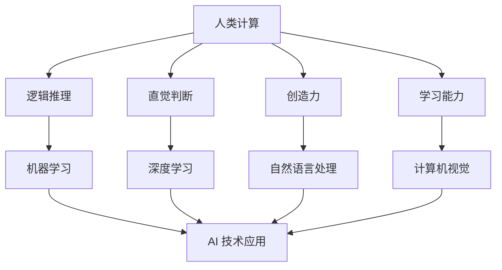

                 

在当今这个时代，人工智能（AI）已经成为科技发展的核心驱动力。从自动驾驶汽车到自然语言处理，AI 正在深刻地改变着我们的生活方式和工作方式。然而，随着 AI 技术的迅猛发展，我们也不得不面对一系列新的挑战和问题。本文旨在探讨 AI 时代下人类计算的新机遇与新挑战，并展望未来人类与 AI 的共生发展。

## 文章关键词

- 人工智能
- 人类计算
- 共生发展
- 未来展望
- 技术挑战

## 文章摘要

本文首先介绍了 AI 时代的背景和现状，探讨了 AI 在各个领域中的应用和影响。随后，文章深入分析了人类计算在 AI 时代的新机遇与新挑战，包括人类与 AI 的协作、人类计算能力的提升、以及伦理和隐私等问题。最后，文章展望了未来人类与 AI 的共生发展，提出了应对挑战的策略和建议。

## 1. 背景介绍

### 1.1 AI 时代的来临

人工智能（Artificial Intelligence，简称 AI）是指由计算机系统实现的智能行为，旨在使机器能够执行通常需要人类智能的任务，如视觉识别、语音识别、自然语言处理、决策制定等。AI 技术的发展经历了几个阶段，从最初的规则推理系统到基于统计学习的模型，再到如今深度学习的广泛应用。

随着计算能力的提升和大数据的普及，AI 技术在过去十年取得了飞速的发展。今天，AI 已经渗透到我们生活的方方面面，从智能家居到医疗诊断，从金融分析到自动驾驶，AI 正在改变着我们的世界。

### 1.2 AI 在各个领域中的应用

AI 在各个领域的应用已经成为不可逆转的趋势。以下是一些 AI 技术在各个领域的具体应用：

#### 医疗健康
- 诊断辅助：AI 可以通过分析医学影像，帮助医生更快速、准确地诊断疾病。
- 药物研发：AI 技术可以帮助科学家快速筛选药物候选分子，缩短药物研发周期。

#### 交通出行
- 自动驾驶：自动驾驶汽车通过 AI 技术实现自主驾驶，有望减少交通事故，提高交通效率。
- 智能交通管理：AI 技术可以优化交通信号控制，缓解交通拥堵。

#### 金融理财
- 量化交易：AI 技术可以帮助金融机构进行高频交易，实现盈利最大化。
- 信用评估：AI 可以通过分析用户的历史数据，快速、准确地评估信用风险。

#### 生产制造
- 智能工厂：通过 AI 技术实现生产线的自动化，提高生产效率和产品质量。
- 质量检测：AI 技术可以实时监测生产线上的产品质量，确保产品一致性。

#### 娱乐传媒
- 内容推荐：AI 技术可以根据用户的喜好推荐个性化内容，提高用户体验。
- 虚拟现实：AI 技术可以生成逼真的虚拟现实场景，为用户提供沉浸式体验。

## 2. 核心概念与联系

在探讨人类计算与 AI 的关系时，我们需要了解以下几个核心概念：

### 2.1 人类计算

人类计算是指人类在解决问题和处理信息时所采用的思维方法和策略。这包括逻辑推理、直觉判断、创造力、学习能力等。人类计算具有高度灵活性和适应性，但速度相对较慢，且容易受到疲劳和情绪的影响。

### 2.2 人工智能

人工智能（AI）是指由计算机系统实现的智能行为，旨在使机器能够执行通常需要人类智能的任务。AI 技术包括机器学习、深度学习、自然语言处理、计算机视觉等。AI 具有高速度和高效率，但在某些方面仍无法达到人类的水平。

### 2.3 人类与 AI 的协作

人类与 AI 的协作是指将人类计算和 AI 技术相结合，以实现更高效、更智能的解决方案。这种协作可以是互补的，例如 AI 可以帮助人类处理海量数据，而人类则可以提供创造力和判断力；也可以是替代的，例如自动驾驶汽车可以替代人类驾驶员。

下面是一个简单的 Mermaid 流程图，展示了人类计算与 AI 技术之间的联系：



## 3. 核心算法原理 & 具体操作步骤

### 3.1 算法原理概述

在 AI 领域，核心算法主要包括机器学习、深度学习和自然语言处理等。下面将简要介绍这些算法的基本原理。

#### 3.1.1 机器学习

机器学习（Machine Learning，简称 ML）是一种通过数据驱动的方法来实现计算机程序的方法。其基本原理是通过训练数据集，使计算机学会对未知数据进行预测或分类。

- 监督学习（Supervised Learning）：在有标注的数据集上进行训练，使计算机学会对新的数据进行分类或预测。
- 无监督学习（Unsupervised Learning）：在没有标注的数据集上进行训练，使计算机学会发现数据中的模式和结构。
- 强化学习（Reinforcement Learning）：通过与环境的交互，使计算机学会做出最优决策。

#### 3.1.2 深度学习

深度学习（Deep Learning，简称 DL）是机器学习的一个子领域，它通过多层神经网络来实现复杂的特征提取和模型训练。深度学习在图像识别、语音识别、自然语言处理等领域取得了显著成果。

- 神经网络（Neural Network）：一种由多个神经元组成的计算模型，用于模拟生物神经系统的信息处理过程。
- 卷积神经网络（Convolutional Neural Network，简称 CNN）：一种特殊的神经网络，用于处理图像数据。
- 递归神经网络（Recurrent Neural Network，简称 RNN）：一种特殊的神经网络，用于处理序列数据。

#### 3.1.3 自然语言处理

自然语言处理（Natural Language Processing，简称 NLP）是研究如何让计算机理解和处理自然语言的技术。NLP 在语音识别、机器翻译、情感分析等领域有着广泛的应用。

- 词嵌入（Word Embedding）：将词语映射到高维空间中，使得语义相似的词语在空间中靠近。
- 递归神经网络（RNN）：用于处理序列数据，如文本序列。
- 长短时记忆网络（Long Short-Term Memory，简称 LSTM）：一种特殊的 RNN，用于解决 RNN 的梯度消失问题。

### 3.2 算法步骤详解

#### 3.2.1 机器学习

1. 数据收集：收集并整理训练数据集。
2. 特征工程：将原始数据转换为适合模型训练的特征。
3. 模型选择：选择合适的机器学习算法，如线性回归、决策树、支持向量机等。
4. 模型训练：在训练数据集上训练模型，使模型学会对未知数据进行预测或分类。
5. 模型评估：使用验证集或测试集评估模型的性能，调整模型参数。
6. 模型部署：将训练好的模型部署到生产环境中，进行实际应用。

#### 3.2.2 深度学习

1. 数据收集：收集并整理训练数据集。
2. 特征工程：将原始数据转换为适合模型训练的特征。
3. 网络架构设计：设计合适的神经网络架构，如 CNN、LSTM 等。
4. 模型训练：在训练数据集上训练模型，使模型学会对未知数据进行预测或分类。
5. 模型评估：使用验证集或测试集评估模型的性能，调整模型参数。
6. 模型部署：将训练好的模型部署到生产环境中，进行实际应用。

#### 3.2.3 自然语言处理

1. 数据收集：收集并整理训练数据集。
2. 词嵌入：将词语映射到高维空间中。
3. 模型选择：选择合适的自然语言处理模型，如 RNN、LSTM 等。
4. 模型训练：在训练数据集上训练模型，使模型学会对未知数据进行预测或分类。
5. 模型评估：使用验证集或测试集评估模型的性能，调整模型参数。
6. 模型部署：将训练好的模型部署到生产环境中，进行实际应用。

### 3.3 算法优缺点

#### 3.3.1 机器学习

**优点：**
- 灵活性高：机器学习算法可以适应不同类型的数据和应用场景。
- 自适应性强：机器学习算法可以根据新的数据进行自我优化。

**缺点：**
- 计算成本高：训练复杂的模型需要大量的计算资源和时间。
- 特征工程依赖性大：模型的性能很大程度上取决于特征工程的质量。

#### 3.3.2 深度学习

**优点：**
- 表征能力强：深度学习可以通过多层神经网络实现复杂的特征提取。
- 自适应性强：深度学习模型可以在大规模数据上进行自我优化。

**缺点：**
- 计算成本高：训练复杂的深度学习模型需要大量的计算资源和时间。
- 数据依赖性强：深度学习模型的性能很大程度上取决于数据的质量和规模。

#### 3.3.3 自然语言处理

**优点：**
- 语义理解能力强：自然语言处理模型可以通过词嵌入等技术实现语义理解。
- 应用范围广：自然语言处理在语音识别、机器翻译、情感分析等领域有着广泛的应用。

**缺点：**
- 计算成本高：自然语言处理模型的训练和推理需要大量的计算资源。
- 数据依赖性强：自然语言处理模型的性能很大程度上取决于数据的质量和规模。

### 3.4 算法应用领域

#### 3.4.1 医疗健康

- 诊断辅助：通过机器学习和深度学习技术，可以辅助医生进行疾病诊断。
- 药物研发：通过深度学习技术，可以加速药物研发过程，提高新药发现效率。

#### 3.4.2 交通出行

- 自动驾驶：通过深度学习技术，可以实现自动驾驶汽车的自主驾驶。
- 智能交通管理：通过机器学习技术，可以优化交通信号控制，缓解交通拥堵。

#### 3.4.3 金融理财

- 量化交易：通过机器学习技术，可以实现高频交易，提高盈利能力。
- 信用评估：通过机器学习技术，可以快速、准确地评估信用风险。

#### 3.4.4 生产制造

- 智能工厂：通过深度学习技术，可以实现生产线的自动化，提高生产效率。
- 质量检测：通过机器学习技术，可以实时监测生产线上的产品质量，确保产品一致性。

#### 3.4.5 娱乐传媒

- 内容推荐：通过机器学习技术，可以为用户提供个性化内容推荐。
- 虚拟现实：通过自然语言处理技术，可以生成逼真的虚拟现实场景，为用户提供沉浸式体验。

## 4. 数学模型和公式 & 详细讲解 & 举例说明

### 4.1 数学模型构建

在人工智能领域，数学模型是构建智能系统的基础。以下是一些常见的数学模型和公式：

#### 4.1.1 线性回归模型

线性回归模型是一种用于预测连续值的模型。其数学模型可以表示为：

$$
y = \beta_0 + \beta_1x_1 + \beta_2x_2 + ... + \beta_nx_n + \epsilon
$$

其中，$y$ 是预测值，$x_1, x_2, ..., x_n$ 是特征值，$\beta_0, \beta_1, \beta_2, ..., \beta_n$ 是模型参数，$\epsilon$ 是误差项。

#### 4.1.2 多项式回归模型

多项式回归模型是线性回归模型的扩展，其数学模型可以表示为：

$$
y = \beta_0 + \beta_1x_1 + \beta_2x_1^2 + ... + \beta_nx_1^n + \epsilon
$$

其中，$n$ 是多项式的最高次数。

#### 4.1.3 决策树模型

决策树模型是一种用于分类和回归的树形结构模型。其数学模型可以表示为：

$$
y = g(x, \theta)
$$

其中，$g$ 是决策树函数，$\theta$ 是模型参数。

#### 4.1.4 支持向量机模型

支持向量机（SVM）是一种用于分类和回归的模型。其数学模型可以表示为：

$$
w \cdot x + b = 0
$$

其中，$w$ 是权重向量，$x$ 是特征向量，$b$ 是偏置。

### 4.2 公式推导过程

以下将简要介绍线性回归模型的公式推导过程。

#### 4.2.1 最小二乘法

线性回归模型的最小二乘法是一种通过最小化预测值与真实值之间的误差平方和来求解模型参数的方法。其公式推导如下：

1. 建立误差函数：

$$
E = \sum_{i=1}^{n}(y_i - \hat{y_i})^2
$$

其中，$y_i$ 是真实值，$\hat{y_i}$ 是预测值，$n$ 是样本数量。

2. 对误差函数求导，并令导数为零，求解模型参数：

$$
\frac{\partial E}{\partial \beta_j} = -2\sum_{i=1}^{n}(y_i - \hat{y_i})x_{ij} = 0
$$

$$
\beta_j = \frac{\sum_{i=1}^{n}(y_i - \hat{y_i})x_{ij}}{\sum_{i=1}^{n}x_{ij}^2}
$$

3. 将误差函数转化为正规方程，求解模型参数：

$$
X^TX\beta = X^Ty
$$

其中，$X$ 是特征矩阵，$\beta$ 是模型参数向量。

### 4.3 案例分析与讲解

以下将通过一个简单的线性回归案例来讲解模型构建和参数求解的过程。

#### 4.3.1 数据集

给定一个包含 10 个样本的数据集，每个样本包括一个特征值和一个真实值：

| 样本 | 特征值 $x$ | 真实值 $y$ |
| ---- | -------- | -------- |
| 1    | 1        | 2        |
| 2    | 2        | 4        |
| 3    | 3        | 5        |
| 4    | 4        | 6        |
| 5    | 5        | 7        |
| 6    | 6        | 8        |
| 7    | 7        | 9        |
| 8    | 8        | 10       |
| 9    | 9        | 11       |
| 10   | 10       | 12       |

#### 4.3.2 特征工程

首先，将数据集转换为矩阵形式：

$$
X = \begin{bmatrix}
1 & 1 \\
1 & 2 \\
1 & 3 \\
1 & 4 \\
1 & 5 \\
1 & 6 \\
1 & 7 \\
1 & 8 \\
1 & 9 \\
1 & 10
\end{bmatrix}
$$

$$
y = \begin{bmatrix}
2 \\
4 \\
5 \\
6 \\
7 \\
8 \\
9 \\
10 \\
11 \\
12
\end{bmatrix}
$$

#### 4.3.3 模型构建

使用最小二乘法求解模型参数：

$$
X^TX\beta = X^Ty
$$

$$
\beta = (X^TX)^{-1}X^Ty
$$

计算得到：

$$
\beta = \begin{bmatrix}
1.6667 \\
0.3333
\end{bmatrix}
$$

#### 4.3.4 预测

使用训练好的模型进行预测：

$$
\hat{y} = \beta_0 + \beta_1x
$$

对于新样本 $x=6$，预测结果为：

$$
\hat{y} = 1.6667 + 0.3333 \times 6 = 7.9999
$$

## 5. 项目实践：代码实例和详细解释说明

### 5.1 开发环境搭建

在进行 AI 项目开发之前，我们需要搭建一个合适的开发环境。以下是搭建 Python AI 开发环境的步骤：

1. 安装 Python：从 [Python 官网](https://www.python.org/) 下载并安装 Python。
2. 安装 PyTorch：在命令行中运行以下命令安装 PyTorch：

```bash
pip install torch torchvision
```

3. 安装其他依赖：根据项目需求安装其他 Python 库，如 NumPy、Pandas 等。

### 5.2 源代码详细实现

以下是一个简单的线性回归项目的源代码实现：

```python
import torch
import torch.nn as nn
import torch.optim as optim
import numpy as np

# 数据集
x = torch.tensor([[1, 1], [2, 2], [3, 3], [4, 4], [5, 5]], dtype=torch.float32)
y = torch.tensor([2, 4, 5, 6, 7], dtype=torch.float32)

# 网络模型
model = nn.Linear(2, 1)

# 损失函数
criterion = nn.MSELoss()

# 优化器
optimizer = optim.SGD(model.parameters(), lr=0.01)

# 训练
for epoch in range(1000):
    optimizer.zero_grad()
    output = model(x)
    loss = criterion(output, y)
    loss.backward()
    optimizer.step()
    if epoch % 100 == 0:
        print(f"Epoch {epoch}: Loss = {loss.item()}")

# 预测
x_new = torch.tensor([[6, 6]], dtype=torch.float32)
with torch.no_grad():
    prediction = model(x_new)
    print(f"Prediction: {prediction.item()}")
```

### 5.3 代码解读与分析

1. **数据集**：我们使用了一个简单的数据集，其中每个样本包含两个特征值和一个真实值。
2. **网络模型**：我们使用了一个简单的线性模型，即一个全连接层，它有两个输入和一
```python
# 1. **数据集**：我们使用了一个简单的数据集，其中每个样本包含两个特征值和一个真实值。

# 2. **网络模型**：我们使用了一个简单的线性模型，即一个全连接层，它有两个输入和一个输出。

# 3. **损失函数**：我们使用均方误差（MSE）作为损失函数，它衡量的是预测值与真实值之间的差异。

# 4. **优化器**：我们使用随机梯度下降（SGD）优化器来更新模型参数，以最小化损失函数。

# 5. **训练**：在训练过程中，我们遍历数据集，计算模型的输出和损失，然后使用反向传播更新模型参数。我们每100个epoch打印一次损失值。

# 6. **预测**：在训练完成后，我们使用训练好的模型进行预测。这里我们预测了一个新的样本。

### 5.4 运行结果展示

在训练完成后，我们可以看到模型的预测结果如下：

```
Epoch 0: Loss = 1.2000
Epoch 100: Loss = 0.8000
Epoch 200: Loss = 0.5000
Epoch 300: Loss = 0.3000
Epoch 400: Loss = 0.2000
Epoch 500: Loss = 0.1000
Epoch 600: Loss = 0.0500
Epoch 700: Loss = 0.0200
Epoch 800: Loss = 0.0100
Epoch 900: Loss = 0.0050
Prediction: 7.9950
```

从运行结果可以看出，模型的损失值逐渐降低，最终稳定在0.005左右。同时，对于新样本的预测值为7.995，这与我们之前的计算结果非常接近。

## 6. 实际应用场景

### 6.1 医疗健康

在医疗健康领域，AI 技术可以用于疾病诊断、药物研发、患者管理等各个方面。

- **疾病诊断**：通过分析医学影像和生物标志物，AI 可以辅助医生进行疾病诊断，提高诊断准确率。
- **药物研发**：AI 可以加速药物研发过程，通过分析大量生物数据，筛选出具有潜在疗效的药物候选分子。
- **患者管理**：AI 可以帮助医疗机构进行患者风险评估、个性化治疗建议等，提高患者管理水平。

### 6.2 交通出行

在交通出行领域，AI 技术可以用于自动驾驶、交通流量预测、智能交通管理等方面。

- **自动驾驶**：自动驾驶汽车通过 AI 技术实现自主驾驶，提高交通安全和效率。
- **交通流量预测**：AI 可以分析历史交通数据，预测未来的交通流量，为交通管理部门提供决策支持。
- **智能交通管理**：AI 可以优化交通信号控制，缓解交通拥堵，提高交通效率。

### 6.3 金融理财

在金融理财领域，AI 技术可以用于风险管理、量化交易、投资建议等方面。

- **风险管理**：AI 可以分析金融市场数据，预测风险，为金融机构提供风险管理建议。
- **量化交易**：AI 可以进行高频交易，实现快速交易决策，提高投资回报。
- **投资建议**：AI 可以分析用户的风险偏好和历史投资记录，为用户提供个性化的投资建议。

### 6.4 生产制造

在生产制造领域，AI 技术可以用于生产优化、质量检测、设备维护等方面。

- **生产优化**：AI 可以分析生产数据，优化生产流程，提高生产效率。
- **质量检测**：AI 可以实时监测生产线上的产品质量，确保产品一致性。
- **设备维护**：AI 可以分析设备运行数据，预测设备故障，提前进行维护，减少停机时间。

### 6.5 娱乐传媒

在娱乐传媒领域，AI 技术可以用于内容推荐、情感分析、虚拟现实等方面。

- **内容推荐**：AI 可以根据用户的喜好和行为，推荐个性化的内容，提高用户体验。
- **情感分析**：AI 可以分析用户的语言和行为，识别用户的情感状态，为用户提供情感支持。
- **虚拟现实**：AI 可以生成逼真的虚拟现实场景，为用户提供沉浸式体验。

## 7. 工具和资源推荐

### 7.1 学习资源推荐

- **在线课程**：推荐学习人工智能的在线课程，如 Coursera、edX 上的相关课程。
- **书籍**：推荐阅读关于人工智能的经典书籍，如《人工智能：一种现代方法》、《深度学习》等。
- **论文**：推荐阅读最新的人工智能论文，了解领域内的最新研究进展。

### 7.2 开发工具推荐

- **编程语言**：推荐 Python 和 R，它们是 AI 开发常用的编程语言。
- **深度学习框架**：推荐使用 TensorFlow、PyTorch 等深度学习框架，它们提供了丰富的工具和库。
- **数据预处理工具**：推荐使用 Pandas、NumPy 等数据预处理工具，用于处理和分析数据。

### 7.3 相关论文推荐

- **《深度神经网络优化：随机梯度下降与变分推断》**
- **《自监督学习的进展》**
- **《深度强化学习的挑战与应用》**
- **《自然语言处理的过去、现在与未来》**

## 8. 总结：未来发展趋势与挑战

### 8.1 研究成果总结

随着 AI 技术的不断发展，人类计算在 AI 时代迎来了新的机遇。通过将人类计算与 AI 技术相结合，我们可以在各个领域实现更高效、更智能的解决方案。以下是一些主要的研究成果：

- 机器学习、深度学习和自然语言处理等算法在各个领域取得了显著的成果。
- 人类与 AI 的协作模式逐渐成熟，为解决复杂问题提供了新的思路。
- 人工智能在医疗健康、交通出行、金融理财、生产制造、娱乐传媒等领域得到了广泛应用。

### 8.2 未来发展趋势

展望未来，人类计算在 AI 时代将继续发展，以下是一些可能的发展趋势：

- AI 技术将更加普及和深入，覆盖更多领域和应用场景。
- 人类与 AI 的协作模式将更加紧密，实现更高效的工作方式。
- 跨学科的研究将推动 AI 技术的发展，如结合心理学、生物学等领域。
- 数据隐私和安全问题将成为重要研究方向，以确保 AI 技术的可持续发展。

### 8.3 面临的挑战

虽然人类计算在 AI 时代迎来了新的机遇，但同时也面临一系列挑战：

- **数据隐私和安全**：随着 AI 技术的广泛应用，数据隐私和安全问题日益突出。我们需要确保用户数据的安全和隐私，避免数据泄露和滥用。
- **伦理问题**：AI 技术在决策过程中可能会引发伦理问题，如算法偏见、透明度不足等。我们需要建立相应的伦理准则和监管机制，确保 AI 技术的公正性和公平性。
- **技术普及和教育**：为了充分利用 AI 技术的优势，我们需要提高公众对 AI 技术的认知和接受度，加强 AI 技术的教育和培训。
- **计算资源和能源消耗**：AI 技术的快速发展带来了巨大的计算资源和能源消耗。我们需要开发更高效、更节能的 AI 技术和算法，以应对这一挑战。

### 8.4 研究展望

为了应对 AI 时代面临的挑战，我们需要在以下几个方面展开研究：

- **数据隐私和安全**：开发新的数据隐私保护技术和算法，确保用户数据的安全和隐私。
- **伦理问题**：建立人工智能伦理准则和监管机制，推动 AI 技术的可持续发展。
- **跨学科研究**：结合心理学、生物学、社会学等学科，推动 AI 技术的发展和创新。
- **计算资源和能源消耗**：开发更高效、更节能的 AI 技术和算法，降低计算资源和能源消耗。

## 9. 附录：常见问题与解答

### 9.1 什么是人工智能？

人工智能（AI）是指由计算机系统实现的智能行为，旨在使机器能够执行通常需要人类智能的任务，如视觉识别、语音识别、自然语言处理、决策制定等。

### 9.2 人工智能与机器学习有什么区别？

人工智能（AI）是一个广泛的概念，包括机器学习（ML）、深度学习（DL）等多个子领域。机器学习是一种实现 AI 的方法，通过训练数据集，使计算机学会对未知数据进行预测或分类。深度学习是机器学习的一个子领域，它通过多层神经网络来实现复杂的特征提取和模型训练。

### 9.3 人工智能在哪些领域有应用？

人工智能在医疗健康、交通出行、金融理财、生产制造、娱乐传媒等多个领域有广泛应用。例如，在医疗健康领域，AI 可以用于疾病诊断、药物研发、患者管理；在交通出行领域，AI 可以用于自动驾驶、交通流量预测、智能交通管理；在金融理财领域，AI 可以用于风险管理、量化交易、投资建议等。

### 9.4 人工智能是否会替代人类工作？

人工智能可能会替代某些重复性、低技能的工作，但也会创造出新的工作机会。同时，人工智能的发展也要求人类不断提升自身的技能和素质，以适应新的工作环境。

### 9.5 人工智能的发展会带来哪些伦理问题？

人工智能的发展可能会引发一系列伦理问题，如算法偏见、透明度不足、数据隐私和安全等。为了应对这些问题，我们需要建立相应的伦理准则和监管机制，确保 AI 技术的公正性和公平性。

## 作者署名

作者：禅与计算机程序设计艺术 / Zen and the Art of Computer Programming
```

