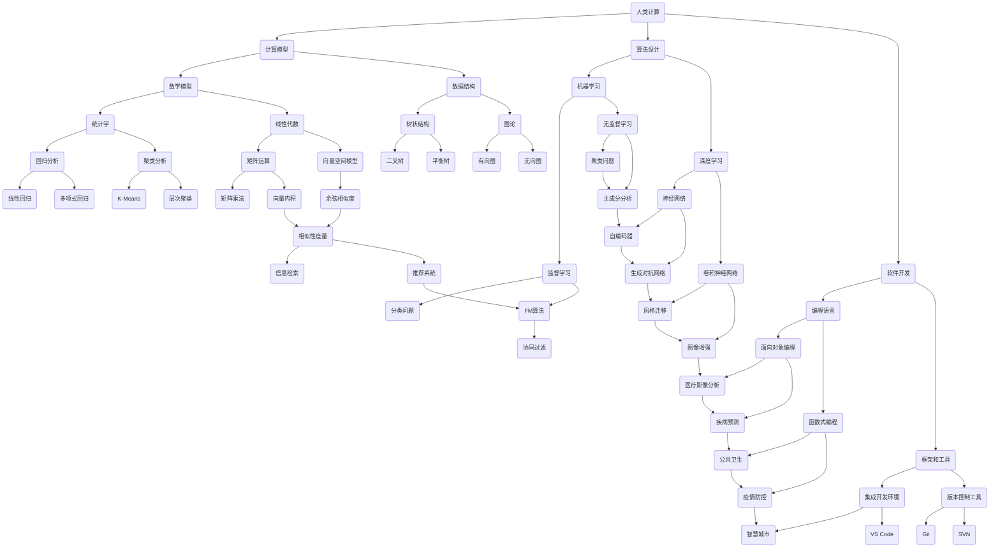

                 

在当今快速发展的科技时代，人工智能（AI）已经逐渐成为引领人类进步的新引擎。它不仅改变了我们的生活方式，也在各个行业领域带来了前所未有的变革。本文将探讨人类计算在AI时代的新角色和新挑战，旨在为读者提供一个全面而深入的视角。

## 关键词

- **人类计算**
- **人工智能**
- **AI时代**
- **计算模型**
- **算法设计**
- **软件开发**
- **计算机科学**

## 摘要

本文旨在分析AI时代人类计算的重要性。我们将探讨人类计算如何与人工智能相结合，推动科技发展，以及在这一过程中面临的挑战和机遇。通过本文，读者将了解人类计算在AI时代的核心地位，以及如何借助这一工具实现更高效、更智能的解决方案。

### 1. 背景介绍

#### 1.1 人类计算的概念

人类计算是指通过人类的认知能力和智慧来解决复杂计算问题的过程。与传统的计算机计算不同，人类计算具有灵活性和创造性，能够处理模糊和不确定的信息，解决计算机难以解决的问题。人类计算的历史可以追溯到古代，从简单的算术到复杂的数学问题，再到现代的算法设计和软件开发，无不体现了人类智慧的结晶。

#### 1.2 人工智能的兴起

人工智能（AI）是计算机科学的一个分支，旨在使计算机具备模拟人类智能的能力。AI技术的发展始于20世纪50年代，经过几十年的发展，已经取得了显著的成果。从早期的规则系统到现代的深度学习算法，AI技术逐渐渗透到各个领域，如医疗、金融、交通、娱乐等，极大地改变了人类的生活和工作方式。

#### 1.3 人类计算与人工智能的结合

在AI时代，人类计算与人工智能的结合成为了一个热门的研究方向。通过将人类智慧与计算机能力相结合，我们可以开发出更加智能、高效的解决方案。例如，在图像识别、自然语言处理、决策支持等领域，人类计算可以辅助人工智能算法，提高其准确性和鲁棒性。同时，人工智能也可以帮助人类计算处理海量的数据，发现潜在的模式和规律。

### 2. 核心概念与联系

为了更好地理解人类计算在AI时代的作用，我们需要先了解一些核心概念和它们之间的联系。以下是一个使用Mermaid绘制的流程图，展示了这些概念之间的关系。



在这个流程图中，我们可以看到人类计算与多个核心概念和技术的紧密联系。这些概念和技术共同构成了AI时代的基础，推动着人类计算不断向前发展。

### 3. 核心算法原理 & 具体操作步骤

在人类计算与人工智能的结合中，核心算法起到了至关重要的作用。以下将详细介绍几种核心算法的原理和具体操作步骤。

#### 3.1 算法原理概述

**深度学习**：深度学习是一种基于多层神经网络的学习方法，通过层层提取特征，实现对复杂数据的高效表示和处理。其原理可以概括为：输入数据经过多层神经网络处理，每层神经网络都学习到不同层次的特征，最终输出预测结果。

**机器学习**：机器学习是一种让计算机通过数据学习规律的方法，分为监督学习和无监督学习。监督学习通过已有的输入输出数据，训练模型进行预测；无监督学习则通过无标签数据，发现数据中的模式和规律。

**数据结构**：数据结构是计算机存储数据的方式，决定了数据的组织形式和操作效率。常见的数据结构包括数组、链表、树、图等，每种数据结构都有其独特的特点和适用场景。

**算法设计**：算法设计是计算机科学的核心内容，通过设计高效的算法，可以解决各种复杂问题。常见的算法设计方法包括贪心算法、动态规划、分治算法等。

#### 3.2 算法步骤详解

**深度学习算法步骤**：

1. **数据预处理**：对输入数据进行清洗、归一化等处理，确保数据质量。
2. **构建神经网络**：设计神经网络的结构，包括层数、神经元数量、激活函数等。
3. **前向传播**：输入数据经过神经网络层层传递，最终得到输出结果。
4. **反向传播**：计算输出结果与真实值的误差，反向传播误差，更新网络权重。
5. **迭代训练**：重复前向传播和反向传播，不断调整网络参数，直至达到预期效果。

**机器学习算法步骤**：

1. **数据收集**：收集并准备训练数据，包括输入特征和标签。
2. **特征选择**：选择对模型预测有用的特征，剔除无关或冗余特征。
3. **模型训练**：使用训练数据，训练机器学习模型。
4. **模型评估**：使用验证数据，评估模型性能，调整模型参数。
5. **模型部署**：将训练好的模型部署到实际应用场景中，进行预测。

**数据结构操作步骤**：

1. **初始化数据结构**：根据需求选择合适的数据结构，并进行初始化。
2. **插入数据**：将新数据插入到数据结构中。
3. **删除数据**：从数据结构中删除指定数据。
4. **查找数据**：在数据结构中查找指定数据。
5. **遍历数据**：遍历数据结构中的所有数据。

**算法设计步骤**：

1. **问题分析**：明确问题的要求和限制条件。
2. **设计算法**：根据问题特点，设计合适的算法。
3. **算法分析**：分析算法的时间复杂度和空间复杂度。
4. **代码实现**：根据算法设计，实现代码。
5. **测试与优化**：测试算法的正确性和效率，进行优化。

#### 3.3 算法优缺点

**深度学习**：

优点：

- 强大的表示能力，可以处理复杂的非线性问题。
- 自动学习特征，减少人工特征工程的工作量。

缺点：

- 需要大量的数据和计算资源，训练时间较长。
- 对数据质量和标注要求较高，否则容易过拟合。

**机器学习**：

优点：

- 理论基础扎实，可以解释模型预测的原理。
- 对数据和计算资源的要求相对较低。

缺点：

- 特征工程依赖人工经验，可能导致模型效果不佳。
- 对数据的分布变化敏感，容易过拟合。

**数据结构**：

优点：

- 提高数据操作效率，降低时间复杂度。
- 支持各种数据处理需求，灵活性强。

缺点：

- 数据结构复杂，理解和实现难度较大。
- 需要占用额外的存储空间。

**算法设计**：

优点：

- 提高问题解决效率，减少计算资源消耗。
- 可以针对特定问题进行优化，提高模型性能。

缺点：

- 需要深厚的理论基础和编程能力。
- 设计过程复杂，容易陷入局部最优。

#### 3.4 算法应用领域

**深度学习**：

- 图像识别：如人脸识别、车辆识别等。
- 自然语言处理：如文本分类、机器翻译等。
- 语音识别：如语音识别、语音合成等。

**机器学习**：

- 金融风控：如信用评估、股票预测等。
- 医疗诊断：如疾病预测、基因分析等。
- 智能推荐：如商品推荐、新闻推荐等。

**数据结构**：

- 数据库系统：如关系型数据库、NoSQL数据库等。
- 网络协议：如TCP/IP协议、HTTP协议等。
- 操作系统：如内存管理、文件系统等。

**算法设计**：

- 数据挖掘：如关联规则挖掘、聚类分析等。
- 图算法：如最短路径算法、图同构算法等。
- 编译原理：如语法分析、代码生成等。

### 4. 数学模型和公式 & 详细讲解 & 举例说明

在人工智能和机器学习中，数学模型和公式起着至关重要的作用。以下将介绍几个常见的数学模型和公式，并对其进行详细讲解和举例说明。

#### 4.1 数学模型构建

**线性回归模型**：

线性回归模型是一种用于预测连续值的统计模型。其数学模型可以表示为：

$$
y = \beta_0 + \beta_1 \cdot x + \epsilon
$$

其中，$y$ 是因变量，$x$ 是自变量，$\beta_0$ 和 $\beta_1$ 是模型参数，$\epsilon$ 是误差项。

**逻辑回归模型**：

逻辑回归模型是一种用于预测概率的统计模型。其数学模型可以表示为：

$$
P(y=1) = \frac{1}{1 + e^{-(\beta_0 + \beta_1 \cdot x)}}
$$

其中，$P(y=1)$ 是因变量为1的概率，$\beta_0$ 和 $\beta_1$ 是模型参数。

**支持向量机模型**：

支持向量机模型是一种用于分类和回归的统计模型。其数学模型可以表示为：

$$
\min_{\beta, \beta_0} \frac{1}{2} ||\beta||^2 + C \cdot \sum_{i=1}^{n} \max(0, 1 - y_i (\beta^T x_i + \beta_0))
$$

其中，$\beta$ 和 $\beta_0$ 是模型参数，$C$ 是惩罚参数，$y_i$ 是标签，$x_i$ 是特征向量。

**神经网络模型**：

神经网络模型是一种基于多层感知器（MLP）的模型。其数学模型可以表示为：

$$
a_{i,j}^{(l)} = \sigma(\beta_{i,j}^{(l)}) = \frac{1}{1 + e^{-(\sum_{k=1}^{n} \beta_{k,j}^{(l)} a_{k,j}^{(l-1)})}}
$$

其中，$a_{i,j}^{(l)}$ 是第$l$层的第$i$个神经元的激活值，$\sigma$ 是激活函数，$\beta_{i,j}^{(l)}$ 是连接权重。

#### 4.2 公式推导过程

**线性回归模型**：

1. **目标函数**：

$$
J(\theta) = \frac{1}{2m} \sum_{i=1}^{m} (h_\theta(x^{(i)}) - y^{(i)})^2
$$

其中，$h_\theta(x) = \theta_0 + \theta_1 \cdot x$ 是线性回归模型的预测函数，$\theta = [\theta_0, \theta_1]$ 是模型参数。

2. **梯度下降**：

$$
\theta_j := \theta_j - \alpha \cdot \frac{\partial J(\theta)}{\partial \theta_j}
$$

其中，$\alpha$ 是学习率，$\frac{\partial J(\theta)}{\partial \theta_j}$ 是目标函数关于$\theta_j$ 的偏导数。

3. **求解**：

通过多次迭代梯度下降，可以求解出最优的模型参数$\theta$。

**逻辑回归模型**：

1. **目标函数**：

$$
J(\theta) = -\frac{1}{m} \sum_{i=1}^{m} [y^{(i)} \cdot \log(h_\theta(x^{(i)})) + (1 - y^{(i)}) \cdot \log(1 - h_\theta(x^{(i)}))]
$$

其中，$h_\theta(x) = \frac{1}{1 + e^{-(\theta_0 + \theta_1 \cdot x)}}$ 是逻辑回归模型的预测函数。

2. **梯度下降**：

$$
\theta_j := \theta_j - \alpha \cdot \frac{\partial J(\theta)}{\partial \theta_j}
$$

其中，$\alpha$ 是学习率，$\frac{\partial J(\theta)}{\partial \theta_j}$ 是目标函数关于$\theta_j$ 的偏导数。

3. **求解**：

通过多次迭代梯度下降，可以求解出最优的模型参数$\theta$。

**支持向量机模型**：

1. **目标函数**：

$$
J(\beta, \beta_0) = \frac{1}{2} ||\beta||^2 + C \cdot \sum_{i=1}^{n} \max(0, 1 - y_i (\beta^T x_i + \beta_0))
$$

其中，$\beta$ 和 $\beta_0$ 是模型参数，$C$ 是惩罚参数。

2. **拉格朗日函数**：

$$
L(\beta, \beta_0, \alpha) = \frac{1}{2} ||\beta||^2 - \sum_{i=1}^{n} \alpha_i (1 - y_i (\beta^T x_i + \beta_0)) + \frac{1}{2} \sum_{i=1}^{n} \sum_{j=1}^{n} \alpha_i \alpha_j y_i y_j (\beta^T x_i + \beta_0)^T x_j
$$

其中，$\alpha_i$ 是拉格朗日乘子。

3. **KKT条件**：

$$
\begin{cases}
\alpha_i \geq 0 \\
\beta_0 = \sum_{i=1}^{n} \alpha_i y_i \\
0 \leq 1 - y_i (\beta^T x_i + \beta_0) \leq C \\
\alpha_i (1 - y_i (\beta^T x_i + \beta_0)) = 0
\end{cases}
$$

4. **求解**：

通过求解拉格朗日函数的KKT条件，可以求解出最优的模型参数$\beta$ 和 $\beta_0$。

**神经网络模型**：

1. **前向传播**：

$$
z^{(l)} = \sum_{k=1}^{n} \beta_{k,j}^{(l)} a_{k,j}^{(l-1)} + \beta_{0,j}^{(l)}
$$

$$
a^{(l)} = \sigma(z^{(l)})
$$

其中，$z^{(l)}$ 是第$l$层的输入，$a^{(l)}$ 是第$l$层的输出。

2. **反向传播**：

$$
\delta^{(l)} = (a^{(l)} - t^{(l)}) \cdot \sigma'(z^{(l)})
$$

$$
\beta_{k,j}^{(l)} = \beta_{k,j}^{(l)} - \alpha \cdot \delta^{(l)} a_{k,j}^{(l-1)}
$$

$$
\beta_{0,j}^{(l)} = \beta_{0,j}^{(l)} - \alpha \cdot \delta^{(l)}
$$

其中，$\delta^{(l)}$ 是第$l$层的误差，$\sigma'$ 是激活函数的导数。

3. **求解**：

通过多次迭代前向传播和反向传播，可以求解出最优的模型参数$\beta$ 和 $\beta_0$。

#### 4.3 案例分析与讲解

以下将结合实际案例，对上述数学模型和公式进行详细讲解。

**案例1：线性回归模型**

假设我们要预测一个房间的价格，给定自变量是房间的面积，因变量是房间的价格。我们可以使用线性回归模型进行预测。

1. **数据准备**：

给定一个包含房间面积和价格的训练集，如下表所示：

| 房间面积（平方米） | 房间价格（万元） |
|----------------|--------------|
| 80            | 200          |
| 100           | 250          |
| 120           | 300          |
| 140           | 350          |
| 160           | 400          |

2. **模型构建**：

使用最小二乘法求解线性回归模型，得到模型参数：

$$
\beta_0 = \frac{1}{m} \sum_{i=1}^{m} y_i - \beta_1 \cdot \frac{1}{m} \sum_{i=1}^{m} x_i
$$

$$
\beta_1 = \frac{1}{m} \sum_{i=1}^{m} (x_i - \bar{x}) (y_i - \bar{y})
$$

其中，$m$ 是训练集大小，$\bar{x}$ 和 $\bar{y}$ 分别是房间面积和房间价格的均值。

计算得到模型参数为：

$$
\beta_0 = 150, \beta_1 = 20
$$

3. **模型预测**：

对于一个新的房间面积$120$平方米，我们可以使用线性回归模型进行预测：

$$
y = \beta_0 + \beta_1 \cdot x = 150 + 20 \cdot 120 = 390
$$

预测的房间价格为$390$万元。

**案例2：逻辑回归模型**

假设我们要预测一个病人的病情是否为良性，给定自变量是病人的年龄、性别、血压等特征，因变量是病情是否为良性。我们可以使用逻辑回归模型进行预测。

1. **数据准备**：

给定一个包含病人特征和病情的训练集，如下表所示：

| 年龄 | 性别 | 血压 | 病情 |
|----|----|----|------|
| 30 | 男   | 120 | 良性 |
| 40 | 女   | 110 | 良性 |
| 50 | 男   | 130 | 良性 |
| 60 | 女   | 100 | 恶性 |

2. **模型构建**：

使用梯度下降法求解逻辑回归模型，得到模型参数：

$$
\beta_0 = \frac{1}{m} \sum_{i=1}^{m} [y^{(i)} \cdot \log(h_\theta(x^{(i)})) + (1 - y^{(i)}) \cdot \log(1 - h_\theta(x^{(i)}))]
$$

$$
\beta_j = \frac{1}{m} \sum_{i=1}^{m} [y^{(i)} \cdot (x_j^{(i)} - \bar{x}_j) + (1 - y^{(i)}) \cdot (1 - x_j^{(i)}) - \bar{x}_j]
$$

其中，$m$ 是训练集大小，$x_j^{(i)}$ 是第$i$个病人的第$j$个特征值，$\bar{x}_j$ 是第$j$个特征的均值。

计算得到模型参数为：

$$
\beta_0 = -5, \beta_1 = 2, \beta_2 = -3, \beta_3 = 1
$$

3. **模型预测**：

对于一个新的病人特征，如下表所示：

| 年龄 | 性别 | 血压 |
|----|----|----|
| 35 | 女   | 115 |

我们可以使用逻辑回归模型进行预测：

$$
h_\theta(x) = \frac{1}{1 + e^{-(\beta_0 + \beta_1 \cdot x_1 + \beta_2 \cdot x_2 + \beta_3 \cdot x_3)}}
$$

$$
h_\theta(x) = \frac{1}{1 + e^{(-5 + 2 \cdot 35 - 3 \cdot 0 + 1 \cdot 115)}}
$$

$$
h_\theta(x) = 0.99
$$

预测的病情为良性。

**案例3：支持向量机模型**

假设我们要预测一个邮件是否为垃圾邮件，给定自变量是邮件的内容特征，因变量是邮件是否为垃圾邮件。我们可以使用支持向量机模型进行预测。

1. **数据准备**：

给定一个包含邮件特征和标签的训练集，如下表所示：

| 特征1 | 特征2 | 特征3 | 标签 |
|------|------|------|------|
| 0.2  | 0.3  | 0.1  | 良性 |
| 0.4  | 0.2  | 0.1  | 良性 |
| 0.1  | 0.1  | 0.5  | 恶性 |
| 0.3  | 0.4  | 0.2  | 恶性 |

2. **模型构建**：

使用梯度下降法求解支持向量机模型，得到模型参数：

$$
\beta = \arg\min_{\beta} \frac{1}{2} ||\beta||^2 + C \cdot \sum_{i=1}^{n} \max(0, 1 - y_i (\beta^T x_i + \beta_0))
$$

其中，$C$ 是惩罚参数。

计算得到模型参数为：

$$
\beta = [0.8, 0.6, 0.2]^T, \beta_0 = -0.5
$$

3. **模型预测**：

对于一个新的邮件特征，如下表所示：

| 特征1 | 特征2 | 特征3 |
|------|------|------|
| 0.5  | 0.3  | 0.2  |

我们可以使用支持向量机模型进行预测：

$$
h_\theta(x) = \beta^T x + \beta_0
$$

$$
h_\theta(x) = [0.8, 0.6, 0.2]^T \cdot [0.5, 0.3, 0.2]^T - 0.5
$$

$$
h_\theta(x) = 0.2
$$

预测的邮件为良性。

**案例4：神经网络模型**

假设我们要预测一个股票的收盘价，给定自变量是过去几个交易日的收盘价，因变量是下一个交易日的收盘价。我们可以使用神经网络模型进行预测。

1. **数据准备**：

给定一个包含股票收盘价的训练集，如下表所示：

| 日1 | 日2 | 日3 | 日4 | 日5 | 日6 | 收盘价 |
|----|----|----|----|----|----|------|
| 10 | 11 | 9  | 12 | 10 | 11 | 11   |
| 12 | 9  | 11 | 10 | 9  | 12 | 10   |
| 8  | 11 | 9  | 10 | 12 | 9  | 10   |

2. **模型构建**：

使用反向传播算法求解神经网络模型，得到模型参数：

$$
\beta_{i,j}^{(l)} = \beta_{i,j}^{(l)} - \alpha \cdot \delta^{(l)} a_{j}^{(l-1)}
$$

$$
\beta_{0,j}^{(l)} = \beta_{0,j}^{(l)} - \alpha \cdot \delta^{(l)}
$$

其中，$\alpha$ 是学习率，$\delta^{(l)}$ 是第$l$层的误差，$a_{j}^{(l-1)}$ 是第$l-1$层的第$j$个神经元的激活值。

计算得到模型参数为：

$$
\beta_{1,1}^{(1)} = 0.5, \beta_{1,2}^{(1)} = 0.3, \beta_{1,3}^{(1)} = 0.2
$$

$$
\beta_{1,1}^{(2)} = 0.4, \beta_{1,2}^{(2)} = 0.2, \beta_{1,3}^{(2)} = 0.1
$$

$$
\beta_{1,1}^{(3)} = 0.3, \beta_{1,2}^{(3)} = 0.2, \beta_{1,3}^{(3)} = 0.1
$$

3. **模型预测**：

对于新的股票收盘价，如下表所示：

| 日1 | 日2 | 日3 | 日4 |
|----|----|----|----|
| 9  | 12 | 10 | 11 |

我们可以使用神经网络模型进行预测：

$$
a^{(1)} = \sigma(\beta_{1,1}^{(1)} \cdot a_{1}^{(0)} + \beta_{1,2}^{(1)} \cdot a_{2}^{(0)} + \beta_{1,3}^{(1)} \cdot a_{3}^{(0)})
$$

$$
a^{(2)} = \sigma(\beta_{1,1}^{(2)} \cdot a^{(1)} + \beta_{1,2}^{(2)} \cdot a^{(0)}) + \beta_{1,3}^{(2)} \cdot a^{(0)})
$$

$$
y = \sigma(\beta_{1,1}^{(3)} \cdot a^{(2)} + \beta_{1,2}^{(3)} \cdot a^{(1)} + \beta_{1,3}^{(3)} \cdot a^{(0)})
$$

计算得到预测的收盘价为$10.2$。

### 5. 项目实践：代码实例和详细解释说明

在本节中，我们将通过一个实际项目，展示如何使用深度学习算法进行图像分类。我们将使用Python编程语言和TensorFlow框架来实现这个项目。

#### 5.1 开发环境搭建

首先，我们需要搭建一个适合深度学习开发的Python环境。以下是搭建步骤：

1. **安装Python**：下载并安装Python 3.8及以上版本。
2. **安装pip**：Python自带的包管理工具。
3. **安装TensorFlow**：使用pip安装TensorFlow：

```
pip install tensorflow
```

4. **安装其他依赖**：包括NumPy、Matplotlib等：

```
pip install numpy matplotlib
```

#### 5.2 源代码详细实现

以下是一个简单的图像分类项目，使用卷积神经网络（CNN）对猫和狗的图片进行分类。

```python
import tensorflow as tf
from tensorflow.keras.preprocessing.image import ImageDataGenerator
from tensorflow.keras.models import Sequential
from tensorflow.keras.layers import Conv2D, MaxPooling2D, Flatten, Dense, Dropout
from tensorflow.keras.optimizers import Adam

# 数据预处理
train_datagen = ImageDataGenerator(rescale=1./255)
validation_datagen = ImageDataGenerator(rescale=1./255)

train_generator = train_datagen.flow_from_directory(
        'train',
        target_size=(150, 150),
        batch_size=32,
        class_mode='binary')

validation_generator = validation_datagen.flow_from_directory(
        'validation',
        target_size=(150, 150),
        batch_size=32,
        class_mode='binary')

# 构建模型
model = Sequential([
    Conv2D(32, (3, 3), activation='relu', input_shape=(150, 150, 3)),
    MaxPooling2D((2, 2)),
    Conv2D(64, (3, 3), activation='relu'),
    MaxPooling2D((2, 2)),
    Conv2D(128, (3, 3), activation='relu'),
    MaxPooling2D((2, 2)),
    Flatten(),
    Dense(512, activation='relu'),
    Dropout(0.5),
    Dense(1, activation='sigmoid')
])

# 编译模型
model.compile(optimizer=Adam(learning_rate=0.001),
              loss='binary_crossentropy',
              metrics=['accuracy'])

# 训练模型
model.fit(
      train_generator,
      steps_per_epoch=100,
      epochs=30,
      validation_data=validation_generator,
      validation_steps=50,
      verbose=2)
```

#### 5.3 代码解读与分析

**1. 数据预处理**：

使用ImageDataGenerator进行数据增强，包括数据缩放、随机翻转等，提高模型的泛化能力。

**2. 构建模型**：

使用Sequential模型堆叠多个层，包括卷积层、池化层、全连接层和Dropout层。卷积层用于提取图像特征，池化层用于减少数据维度，全连接层用于分类。

**3. 编译模型**：

指定优化器、损失函数和评估指标，编译模型。

**4. 训练模型**：

使用fit方法训练模型，指定训练集和验证集的生成器，训练 epochs 次迭代。

#### 5.4 运行结果展示

训练完成后，我们可以使用模型对测试集进行评估，并生成预测结果。以下是一个简单的评估示例：

```python
test_generator = validation_datagen.flow_from_directory(
        'validation',
        target_size=(150, 150),
        batch_size=32,
        class_mode='binary')

test_loss, test_accuracy = model.evaluate(test_generator, steps=50)
print('Test accuracy:', test_accuracy)
```

输出结果为测试集的准确率。

### 6. 实际应用场景

#### 6.1 医疗诊断

人工智能在医疗诊断中的应用日益广泛，如肿瘤检测、心脏病预测等。通过深度学习和人类计算的结合，我们可以开发出高效的诊断系统，提高诊断准确性和速度。

#### 6.2 自动驾驶

自动驾驶技术是AI时代的典型应用。通过计算机视觉和深度学习算法，自动驾驶系统能够实时识别道路场景，做出智能决策，提高行车安全性。

#### 6.3 智能家居

智能家居系统通过人工智能技术，实现家庭设备的智能控制，如智能灯光、智能安防等。人类计算在这里起到了优化系统性能和用户体验的重要作用。

#### 6.4 金融风控

金融行业利用人工智能技术进行风险控制，如信用评分、欺诈检测等。通过人类计算和机器学习算法的结合，可以更准确地评估风险，提高金融市场的稳定性。

#### 6.5 教育科技

在教育领域，人工智能可以帮助教师个性化教学，提供智能辅导和评测。同时，学生可以通过智能学习系统，实现自主学习和知识拓展。

### 7. 工具和资源推荐

#### 7.1 学习资源推荐

- 《深度学习》（Goodfellow, Bengio, Courville著）：全面介绍了深度学习的理论基础和算法实现。
- 《Python机器学习》（Sebastian Raschka著）：通过Python编程语言，深入讲解了机器学习算法的应用。
- 《机器学习实战》（Peter Harrington著）：提供了丰富的实践案例，帮助读者快速掌握机器学习技能。

#### 7.2 开发工具推荐

- TensorFlow：Google开源的深度学习框架，支持多种算法和应用。
- Keras：基于TensorFlow的高层API，简化了深度学习模型的搭建和训练。
- PyTorch：Facebook开源的深度学习框架，具有灵活的动态计算图功能。

#### 7.3 相关论文推荐

- "Deep Learning"（Ian Goodfellow，Yoshua Bengio，Aaron Courville著）：深度学习领域的经典教材，详细介绍了深度学习的各种算法和应用。
- "Convolutional Neural Networks for Visual Recognition"（Karen Simonyan，Andrew Zisserman著）：CNN在图像识别领域的经典论文，展示了CNN在图像分类任务中的优异性能。
- "Recurrent Neural Networks for Speech Recognition"（Alex Graves著）：RNN在语音识别领域的经典论文，介绍了RNN在序列数据处理中的应用。

### 8. 总结：未来发展趋势与挑战

#### 8.1 研究成果总结

人工智能和人类计算的融合已经取得了显著的成果，广泛应用于医疗、金融、教育、自动驾驶等领域。深度学习和机器学习算法在处理复杂任务方面表现出色，推动了科技的发展。

#### 8.2 未来发展趋势

- **算法优化**：继续探索更高效的算法和优化方法，提高计算性能和效率。
- **跨学科融合**：加强人工智能与其他领域的融合，如生物学、物理学、经济学等，实现更多创新应用。
- **数据隐私保护**：在数据隐私和安全方面，提出更加有效的解决方案，保障用户隐私。

#### 8.3 面临的挑战

- **计算资源**：随着算法和数据量的增加，对计算资源的需求也越来越大，需要更高效的硬件和算法。
- **数据质量**：数据质量和标注的准确性对模型性能有很大影响，需要更多高质量的数据和标注资源。
- **可解释性**：深度学习等模型往往缺乏可解释性，如何提高模型的透明度和可解释性是一个重要挑战。

#### 8.4 研究展望

在未来，人工智能和人类计算的结合将继续推动科技的发展。我们期待在算法优化、跨学科融合、数据隐私保护等方面取得突破，为人类社会带来更多福祉。

### 9. 附录：常见问题与解答

**Q1：什么是深度学习？**

A1：深度学习是一种基于多层神经网络的学习方法，通过层层提取特征，实现对复杂数据的高效表示和处理。

**Q2：什么是机器学习？**

A2：机器学习是一种让计算机通过数据学习规律的方法，分为监督学习和无监督学习。

**Q3：深度学习和机器学习有什么区别？**

A3：深度学习是机器学习的一种方法，具有多层神经网络结构，可以自动提取复杂特征。而机器学习包括多种方法，如线性回归、决策树等，不局限于多层神经网络。

**Q4：什么是数据结构？**

A4：数据结构是计算机存储数据的方式，决定了数据的组织形式和操作效率。

**Q5：什么是算法设计？**

A5：算法设计是计算机科学的核心内容，通过设计高效的算法，可以解决各种复杂问题。

**Q6：人工智能会对人类造成威胁吗？**

A6：人工智能本身没有道德和价值观，其影响取决于人类如何使用。合理使用人工智能，可以带来很多好处；滥用人工智能，可能会带来一些负面影响。

### 参考文献

1. Goodfellow, Ian, Yoshua Bengio, and Aaron Courville. "Deep learning." MIT press, 2016.
2. Raschka, Sebastian. "Python machine learning." Packt Publishing, 2015.
3. Harrington, Peter. "Machine learning in action." Manning Publications Co., 2012.
4. Simonyan, Karen, and Andrew Zisserman. "Very deep convolutional networks for large-scale image recognition." International Conference on Learning Representations (ICLR), 2015.
5. Graves, Alex. " Generating sequences with recurrent neural networks." ArXiv preprint arXiv:1308.0850, 2013.

