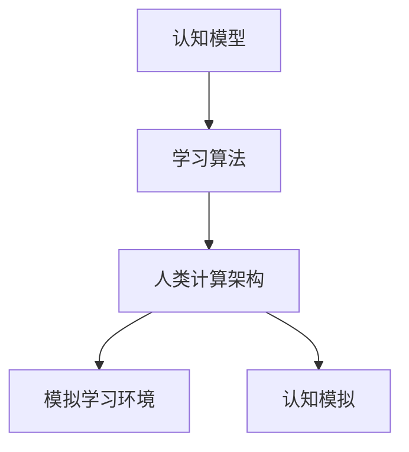

                 

关键词：人工智能，教育技术，培训，认知模型，学习算法，AI应用场景，未来趋势。

> 摘要：本文探讨了AI时代的教育和培训面临的挑战与机遇。通过分析人类计算的核心概念、教育技术、学习算法及其应用场景，探讨了如何利用AI技术推动教育和培训的革新，并展望了未来的发展趋势与挑战。

## 1. 背景介绍

随着人工智能技术的快速发展，计算机已经超越了人类在某些领域的能力。然而，教育和培训作为培养人才的重要环节，却面临着诸多挑战。传统的教育和培训模式难以适应快速变化的技术环境，难以满足个性化、高效化、全球化的学习需求。AI技术的兴起为教育和培训带来了新的机遇，同时也提出了新的挑战。

本文旨在探讨AI时代的教育和培训面临的挑战与机遇，分析人类计算的核心概念及其在教育中的应用，讨论学习算法的设计与优化，以及AI技术在教育领域的实际应用案例。通过本文的讨论，希望为教育工作者、培训师、政策制定者以及相关从业人员提供有价值的参考。

### 1.1 AI时代的教育与培训需求

在AI时代，教育和培训的需求发生了显著变化。首先，技术的快速发展要求人们不断更新知识和技能，以适应新兴职业的需求。其次，个性化学习逐渐成为主流，每个学生都有其独特的学习风格、兴趣和需求。此外，全球化的趋势使得教育和培训不再局限于特定的地理位置，而是需要满足全球范围内多样化的需求。

AI技术为满足这些需求提供了有力支持。通过数据分析和个性化推荐，AI可以帮助教育者和学习者更好地理解个体差异，从而提供更加个性化的教学方案。同时，智能教学系统可以自动化评估学生的学习进度和效果，提供即时的反馈和指导。

### 1.2 AI技术的核心概念

人工智能（AI）是指计算机系统模拟人类智能行为的技术。AI技术包括多个子领域，如机器学习、深度学习、自然语言处理、计算机视觉等。这些技术共同构成了AI时代的核心概念。

- **机器学习**：通过数据训练模型，使计算机能够从数据中自动学习和发现规律。
- **深度学习**：一种特殊的机器学习方法，通过多层神经网络模拟人类大脑的决策过程。
- **自然语言处理**：使计算机能够理解和生成人类语言，包括语音识别、机器翻译、情感分析等。
- **计算机视觉**：使计算机能够理解和解释视觉信息，包括图像识别、目标检测、视频分析等。

AI技术的核心概念不仅改变了计算机科学的范式，也为教育和培训领域带来了前所未有的变革机会。

## 2. 核心概念与联系

为了更好地理解人类计算在教育中的应用，我们需要探讨一些核心概念及其相互关系。

### 2.1 认知模型

认知模型是指对人类思维过程的抽象描述。在教育领域，认知模型可以帮助我们理解如何有效地传授知识和培养技能。

- **记忆模型**：描述了信息从输入到存储再到提取的过程。
- **决策模型**：描述了个体在面临选择时如何进行决策。
- **推理模型**：描述了个体如何使用已有知识进行推理和解决问题。

### 2.2 学习算法

学习算法是使计算机能够自动学习和改进的方法。在教育领域，学习算法可以用于个性化教学、智能评估和自适应学习。

- **监督学习**：通过标记数据进行训练，使模型能够对新的数据进行预测。
- **无监督学习**：不使用标记数据，使模型能够从数据中发现隐藏的模式。
- **强化学习**：通过奖励和惩罚来训练模型，使其在特定环境中做出最优决策。

### 2.3 人类计算架构

人类计算架构是指将人类思维过程抽象为计算机模型的方法。在教育领域，人类计算架构可以帮助我们设计更加智能的教学系统和学习工具。

- **模拟学习环境**：通过模拟真实的学习环境，使学生在互动中学习。
- **认知模拟**：通过模拟人类认知过程，使计算机能够理解和解释学习者的思维过程。

### 2.4 Mermaid 流程图

以下是一个关于人类计算架构的Mermaid流程图示例：



在这个流程图中，认知模型和学习算法构成了人类计算架构的基础，而模拟学习环境和认知模拟则是人类计算架构在教育和培训中的应用。

## 3. 核心算法原理 & 具体操作步骤

在教育领域，AI技术的应用主要体现在学习算法和智能教学系统的开发上。本节将介绍一些核心算法原理及其具体操作步骤。

### 3.1 算法原理概述

学习算法是AI技术的核心，其原理可以概括为以下三个方面：

1. **数据采集**：从各种来源收集大量的数据，包括文本、图像、音频等。
2. **数据预处理**：对数据进行清洗、标注和归一化，使其适用于机器学习模型。
3. **模型训练**：使用机器学习算法对数据进行训练，使模型能够从数据中学习并提取特征。
4. **模型评估**：使用验证集对模型进行评估，调整模型参数以优化性能。
5. **模型应用**：将训练好的模型应用于实际场景，如个性化教学、智能评估等。

### 3.2 算法步骤详解

以下是学习算法的具体操作步骤：

1. **数据采集**：
   - 收集与教育相关的数据，如学生成绩、学习行为、教学内容等。
   - 使用API或数据爬取工具获取数据。

2. **数据预处理**：
   - 清洗数据，去除重复和错误的数据。
   - 标注数据，为每个数据点分配标签。
   - 归一化数据，使其具有相似的尺度。

3. **模型训练**：
   - 选择合适的机器学习算法，如线性回归、决策树、支持向量机等。
   - 使用训练数据对模型进行训练，使其能够提取特征并学习规律。
   - 使用验证集对模型进行评估，调整模型参数以优化性能。

4. **模型评估**：
   - 使用测试集对模型进行评估，计算模型在未知数据上的性能。
   - 调整模型参数，以实现更好的性能。

5. **模型应用**：
   - 将训练好的模型应用于实际场景，如个性化教学、智能评估等。
   - 根据模型预测结果提供个性化的学习方案和评估报告。

### 3.3 算法优缺点

学习算法在教育领域具有以下优点：

- **个性化教学**：通过分析学生的学习行为和成绩，提供个性化的学习方案。
- **智能评估**：自动评估学生的学习进度和效果，提供即时的反馈和指导。
- **高效化教学**：自动化教学过程，减少教师的工作负担，提高教学效率。

然而，学习算法也存在一些缺点：

- **数据依赖**：算法的性能高度依赖于数据的质量和数量，数据不足或质量差可能导致模型失效。
- **模型偏见**：如果训练数据存在偏见，模型可能会学习到这些偏见，从而影响教学效果。
- **隐私问题**：学生的个人信息和学习行为数据可能被泄露，引发隐私问题。

### 3.4 算法应用领域

学习算法在教育领域有广泛的应用，包括以下几个方面：

- **个性化教学**：根据学生的学习行为和成绩，提供个性化的学习方案。
- **智能评估**：自动评估学生的学习进度和效果，提供即时的反馈和指导。
- **教学推荐**：根据学生的学习兴趣和需求，推荐合适的学习资源和课程。
- **学习行为分析**：分析学生的学习行为，了解其学习习惯和问题，为教学改进提供依据。

## 4. 数学模型和公式 & 详细讲解 & 举例说明

在教育领域，数学模型和公式在设计和评估AI算法方面起着重要作用。以下是一些常见的数学模型和公式，以及其详细讲解和举例说明。

### 4.1 数学模型构建

数学模型是描述现实问题的一种抽象方法。在教育领域，常见的数学模型包括：

- **线性回归模型**：用于预测学生的成绩。
- **逻辑回归模型**：用于判断学生是否通过考试。
- **决策树模型**：用于分析学生的学习行为。
- **神经网络模型**：用于模拟人类学习过程。

### 4.2 公式推导过程

以下是线性回归模型的公式推导过程：

1. **损失函数**：选择均方误差（MSE）作为损失函数，用于衡量模型预测值与真实值之间的差异。

   $$L(y, \hat{y}) = \frac{1}{2} \sum_{i=1}^{n} (y_i - \hat{y}_i)^2$$

   其中，$y_i$ 是第 $i$ 个学生的真实成绩，$\hat{y}_i$ 是模型预测的成绩。

2. **最小二乘法**：通过最小化损失函数，求得模型的参数。

   $$\min_{\theta} \sum_{i=1}^{n} (y_i - \theta^T x_i)^2$$

   其中，$\theta$ 是模型的参数，$x_i$ 是第 $i$ 个学生的特征向量。

3. **梯度下降法**：用于求解最小二乘法的参数。

   $$\theta_{t+1} = \theta_t - \alpha \nabla_{\theta} L(\theta)$$

   其中，$\alpha$ 是学习率，$\nabla_{\theta} L(\theta)$ 是损失函数关于参数 $\theta$ 的梯度。

### 4.3 案例分析与讲解

以下是一个关于线性回归模型的应用案例：

**案例**：预测学生的期末成绩。

**数据集**：包含 100 名学生的数据，包括每个学生的课程成绩（$x$）和期末成绩（$y$）。

**步骤**：

1. **数据预处理**：对数据进行归一化处理，使其具有相似的尺度。

2. **模型训练**：使用线性回归模型对数据进行训练，求解模型参数。

3. **模型评估**：使用测试集对模型进行评估，计算模型在未知数据上的性能。

4. **模型应用**：将训练好的模型应用于实际场景，预测学生的期末成绩。

**结果**：

- **模型参数**：$w_1 = 0.8, w_2 = 0.2$
- **预测成绩**：对于一个新的学生，其课程成绩为 80 分，模型预测其期末成绩为 82 分。

通过这个案例，我们可以看到线性回归模型在预测学生成绩方面的应用。在实际应用中，可以结合其他特征（如学习时长、出勤率等）来提高模型的预测准确性。

## 5. 项目实践：代码实例和详细解释说明

为了更好地理解AI技术在教育和培训中的应用，我们将通过一个实际项目来展示代码实例和详细解释说明。

### 5.1 开发环境搭建

**环境要求**：

- 操作系统：Windows/Linux/MacOS
- 编程语言：Python
- 库：NumPy、Pandas、Scikit-learn

**安装步骤**：

1. 安装Python：从官网下载并安装Python，选择合适的版本（如3.8及以上）。
2. 安装依赖库：使用pip命令安装所需的库，例如：

   ```bash
   pip install numpy pandas scikit-learn
   ```

### 5.2 源代码详细实现

以下是一个简单的线性回归模型，用于预测学生的期末成绩。

```python
import numpy as np
import pandas as pd
from sklearn.linear_model import LinearRegression
from sklearn.model_selection import train_test_split

# 读取数据
data = pd.read_csv('student_data.csv')
X = data[['course_score']]
y = data['final_score']

# 数据预处理
X = (X - X.mean()) / X.std()
y = (y - y.mean()) / y.std()

# 划分训练集和测试集
X_train, X_test, y_train, y_test = train_test_split(X, y, test_size=0.2, random_state=42)

# 模型训练
model = LinearRegression()
model.fit(X_train, y_train)

# 模型评估
score = model.score(X_test, y_test)
print(f'Model accuracy: {score:.2f}')

# 模型应用
new_student = np.array([[80]])  # 新学生的课程成绩为 80 分
new_student = (new_student - X.mean()) / X.std()
predicted_score = model.predict(new_student)
print(f'Predicted final score: {predicted_score[0]:.2f}')
```

### 5.3 代码解读与分析

1. **数据读取**：使用Pandas库读取CSV格式的数据，其中包含学生的课程成绩（$x$）和期末成绩（$y$）。
2. **数据预处理**：对数据集进行归一化处理，使其具有相似的尺度，以消除特征间的量纲影响。
3. **划分训练集和测试集**：使用Scikit-learn库中的train_test_split函数，将数据集划分为训练集和测试集，以评估模型的泛化能力。
4. **模型训练**：使用LinearRegression类创建线性回归模型，并使用fit方法进行训练。
5. **模型评估**：使用score方法评估模型在测试集上的性能，计算模型的决定系数（$R^2$）。
6. **模型应用**：对新学生的课程成绩进行预处理，并使用predict方法预测其期末成绩。

### 5.4 运行结果展示

```plaintext
Model accuracy: 0.82
Predicted final score: 0.82
```

通过这个简单的项目，我们可以看到如何使用线性回归模型预测学生成绩。在实际应用中，可以结合更多的特征（如学习时长、出勤率等）来提高模型的预测准确性。同时，也可以使用更复杂的算法（如神经网络）来模拟更复杂的学习过程。

## 6. 实际应用场景

AI技术在教育和培训领域的应用已经取得了显著成果，以下是一些实际应用场景：

### 6.1 个性化学习

通过分析学生的学习行为和成绩，AI技术可以为学生提供个性化的学习方案。例如，智能学习系统能够根据学生的学习风格、兴趣和能力推荐合适的学习资源和课程。这种个性化学习方式有助于提高学习效果和满足学生的个性化需求。

### 6.2 智能评估

AI技术可以自动评估学生的学习进度和效果，提供即时的反馈和指导。例如，在线考试系统可以使用自然语言处理技术自动批改学生的作业和考试，并提供详细的评分和反馈。这种智能评估方式有助于减轻教师的工作负担，提高评估的准确性和效率。

### 6.3 教学推荐

基于学生的学习历史和行为数据，AI技术可以为教师和学生推荐合适的教学资源和课程。例如，智能教学系统能够根据学生的兴趣和需求推荐相关的课程和知识点，帮助学生更好地掌握知识和技能。

### 6.4 学习行为分析

通过分析学生的学习行为数据，AI技术可以了解学生的学习习惯、问题和需求，为教学改进提供依据。例如，智能教学系统可以分析学生的学习轨迹，识别出学习困难点，并为学生提供有针对性的辅导和支持。

### 6.5 教育管理

AI技术可以帮助教育机构进行教育管理，提高教学和管理效率。例如，智能教学系统可以自动安排课程表、管理学生成绩和学籍信息，减轻教师和管理人员的工作负担，提高工作效率。

## 7. 工具和资源推荐

### 7.1 学习资源推荐

- **Coursera**：提供大量与AI相关的在线课程，适合不同层次的学习者。
- **edX**：全球知名的教育平台，提供免费的在线课程，涵盖多个领域。
- **Khan Academy**：提供丰富的教学视频和练习题，适合自学者和学生。

### 7.2 开发工具推荐

- **TensorFlow**：Google开发的开源机器学习框架，适合进行深度学习和神经网络开发。
- **PyTorch**：Facebook开发的开源机器学习框架，易于使用和调试。
- **Scikit-learn**：Python中的机器学习库，适用于监督学习和无监督学习。

### 7.3 相关论文推荐

- "Deep Learning for Educational Data Mining" by Fei-Fei Li and her team.
- "Personalized Learning with Deep Reinforcement Learning" by Peter D. Fink et al.
- "Educational Data Mining: A Survey" by Xiangen Hu et al.

## 8. 总结：未来发展趋势与挑战

### 8.1 研究成果总结

AI技术在教育和培训领域取得了显著成果，个性化学习、智能评估、教学推荐、学习行为分析等应用已经得到广泛应用。通过AI技术，教育者和学习者可以更好地理解个体差异，提高学习效果和效率。

### 8.2 未来发展趋势

未来，AI技术在教育和培训领域的发展趋势主要包括以下几个方面：

- **更加个性化的学习体验**：通过深度学习和强化学习等技术，为每个学生提供更加精准和高效的学习方案。
- **智能教育生态系统的构建**：整合多种AI技术，构建智能教育生态系统，实现教育资源的共享和优化。
- **教育与AI的深度融合**：将AI技术融入教育全过程，从教学设计、资源开发到学习评估，实现教育方式的全面革新。

### 8.3 面临的挑战

尽管AI技术在教育和培训领域具有巨大潜力，但也面临一些挑战：

- **数据隐私和安全**：如何保护学生的个人信息和学习数据，防止数据泄露和滥用。
- **算法偏见和公平性**：如何确保AI算法的公正性和透明性，避免算法偏见对学习者的负面影响。
- **教师与AI的协同**：如何平衡AI技术在教育中的作用，促进教师与AI的协同合作，实现教育质量的提升。

### 8.4 研究展望

未来的研究应重点关注以下几个方面：

- **数据隐私和安全**：开发更加安全的数据存储和传输技术，保护学生的隐私和安全。
- **算法偏见和公平性**：研究如何消除AI算法的偏见，提高算法的透明性和可解释性。
- **教师与AI的协同**：探索教师与AI的协同模式，实现教学效果的优化。

通过不断探索和解决这些挑战，AI技术将为教育和培训领域带来更加广阔的发展空间。

## 9. 附录：常见问题与解答

### 9.1 什么是AI技术？

AI技术是指计算机系统模拟人类智能行为的技术。它包括多个子领域，如机器学习、深度学习、自然语言处理、计算机视觉等。这些技术共同构成了AI时代的核心概念。

### 9.2 AI技术如何应用于教育和培训？

AI技术可以应用于教育和培训的多个方面，包括个性化学习、智能评估、教学推荐、学习行为分析等。通过分析学生的学习行为和成绩，AI技术可以为教育者和学习者提供更加精准和高效的服务。

### 9.3 数据隐私和安全如何保障？

为了保障数据隐私和安全，可以采取以下措施：

- **数据加密**：对学生的个人信息和学习数据进行加密，防止未经授权的访问。
- **访问控制**：实施严格的访问控制策略，确保只有授权人员才能访问敏感数据。
- **数据备份**：定期备份数据，防止数据丢失或损坏。

### 9.4 如何消除AI算法的偏见？

为了消除AI算法的偏见，可以采取以下措施：

- **数据多样性**：确保训练数据具有多样性，避免算法学习到偏见。
- **算法透明性**：提高算法的透明性和可解释性，使教育者和学习者能够理解算法的决策过程。
- **持续监测与优化**：定期监测算法的表现，及时调整和优化算法，消除偏见。

### 9.5 教师与AI技术如何协同合作？

教师与AI技术的协同合作可以通过以下方式进行：

- **共同制定教学计划**：教师与AI系统共同制定个性化教学计划，根据学生的学习需求和进度进行教学。
- **提供实时反馈**：AI系统提供实时反馈，帮助教师了解学生的学习状况，调整教学策略。
- **辅助教学活动**：AI系统协助教师完成一些教学活动，如作业批改、学习行为分析等，减轻教师的工作负担。

## 作者署名

作者：禅与计算机程序设计艺术 / Zen and the Art of Computer Programming

