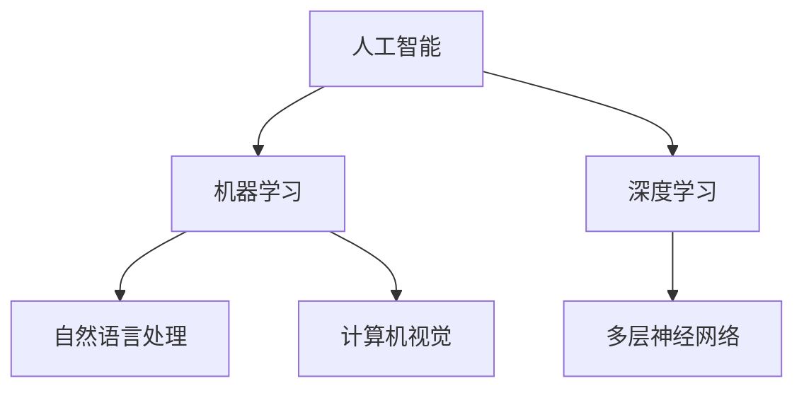

                 

关键词：人工智能，就业前景，技能发展，未来趋势

> 摘要：本文探讨了AI时代下的人类计算，分析未来就业市场如何适应人工智能的发展，探讨了个人在AI时代需要具备的技能，以及如何通过学习和实践提升自己的竞争力。

## 1. 背景介绍

人工智能（AI）作为计算机科学的一个重要分支，近年来得到了飞速发展。从最初的规则推理到深度学习，再到自然语言处理、计算机视觉等领域的突破，AI已经深刻地改变了我们的生活方式。同时，AI的迅猛发展也带来了巨大的就业挑战。一方面，AI技术的发展可能导致某些职业的消失；另一方面，新的职业也在不断涌现，对人才的需求也在发生变化。

本文旨在分析AI时代下的人类计算，探讨未来就业市场如何适应人工智能的发展，以及个人如何提升自己在这一领域的竞争力。

### 1.1 AI的发展历程

AI的发展可以分为三个阶段：

1. **第一阶段（1956-1974）**：这一阶段主要是基于规则的专家系统，通过编写规则来模拟人类的智能行为。
2. **第二阶段（1974-1980）**：随着计算机性能的提高，研究者开始探索模拟人类学习和推理的方法，如神经网络、遗传算法等。
3. **第三阶段（1980至今）**：这一阶段以深度学习为代表，通过大规模数据训练模型，实现了在图像识别、自然语言处理等领域的突破。

### 1.2 AI的应用领域

AI已经在各个领域得到了广泛应用：

- **工业自动化**：通过机器人、自动化生产线等，提高了生产效率，降低了成本。
- **医疗健康**：利用AI进行疾病诊断、药物研发等，提高了医疗服务的质量和效率。
- **金融服务**：利用AI进行风险评估、自动化交易等，提高了金融市场的效率和安全性。
- **交通运输**：自动驾驶技术正在逐渐成熟，有望改变交通方式。
- **智能家居**：通过智能音箱、智能家电等，提高了生活的便利性和舒适度。

## 2. 核心概念与联系

为了深入探讨AI时代的人类计算，我们需要了解以下几个核心概念：

- **人工智能**：模拟人类智能行为的计算机系统。
- **机器学习**：让计算机从数据中学习规律和模式，进行预测和决策。
- **深度学习**：一种基于多层神经网络的学习方法，能够处理大量数据并提取复杂特征。
- **自然语言处理**：使计算机能够理解和生成自然语言。
- **计算机视觉**：使计算机能够理解图像和视频。

下面是一个使用Mermaid绘制的流程图，展示了这些核心概念之间的关系：



## 3. 核心算法原理 & 具体操作步骤

### 3.1 算法原理概述

在AI时代，深度学习是最为重要的算法之一。深度学习通过多层神经网络模拟人脑的神经元连接，实现数据的自动特征提取和模式识别。

### 3.2 算法步骤详解

1. **数据预处理**：包括数据的清洗、归一化、分割等，以确保数据的质量和格式。
2. **构建神经网络**：选择合适的神经网络架构，如卷积神经网络（CNN）或循环神经网络（RNN）。
3. **训练神经网络**：使用大量标注数据进行训练，优化神经网络的参数。
4. **评估与优化**：通过测试数据评估模型的性能，并根据评估结果进行模型优化。
5. **应用部署**：将训练好的模型部署到实际应用场景中。

### 3.3 算法优缺点

- **优点**：深度学习能够处理大量数据，提取复杂特征，具有强大的表示能力和泛化能力。
- **缺点**：训练深度学习模型需要大量的计算资源和时间，且对数据的质量和标注有较高要求。

### 3.4 算法应用领域

深度学习在图像识别、自然语言处理、计算机视觉等领域有广泛的应用，如：

- **图像识别**：用于图像分类、目标检测等。
- **自然语言处理**：用于文本分类、机器翻译等。
- **计算机视觉**：用于自动驾驶、智能监控等。

## 4. 数学模型和公式 & 详细讲解 & 举例说明

### 4.1 数学模型构建

深度学习中的数学模型主要包括：

- **激活函数**：用于引入非线性，如ReLU、Sigmoid、Tanh等。
- **损失函数**：用于衡量模型的预测结果与真实结果的差异，如均方误差（MSE）、交叉熵等。
- **优化器**：用于更新模型的参数，如梯度下降（GD）、随机梯度下降（SGD）、Adam等。

### 4.2 公式推导过程

以ReLU激活函数为例，其公式为：

$$
f(x) =
\begin{cases}
0 & \text{if } x \leq 0 \\
x & \text{if } x > 0
\end{cases}
$$

### 4.3 案例分析与讲解

假设我们有一个简单的神经网络，包含一个输入层、一个隐藏层和一个输出层。输入层有一个神经元，隐藏层有两个神经元，输出层有一个神经元。假设隐藏层的激活函数为ReLU，输出层的激活函数为Sigmoid。

1. **输入层到隐藏层的传播**：

   $$ z_1 = x * w_1 + b_1 $$
   $$ a_1 = \text{ReLU}(z_1) $$

   $$ z_2 = a_1 * w_2 + b_2 $$
   $$ a_2 = \text{ReLU}(z_2) $$

2. **隐藏层到输出层的传播**：

   $$ z_3 = a_2 * w_3 + b_3 $$
   $$ a_3 = \text{Sigmoid}(z_3) $$

   其中，$w$为权重，$b$为偏置。

## 5. 项目实践：代码实例和详细解释说明

### 5.1 开发环境搭建

为了实现上述神经网络，我们需要搭建一个Python开发环境，并安装相关库，如TensorFlow、NumPy等。

### 5.2 源代码详细实现

以下是使用TensorFlow实现上述神经网络的Python代码：

```python
import tensorflow as tf
from tensorflow.keras.layers import Dense, ReLU, Sigmoid
from tensorflow.keras.models import Sequential

# 构建神经网络
model = Sequential([
    Dense(2, input_shape=(1,), activation=ReLU()),
    Dense(1, activation=Sigmoid())
])

# 编译模型
model.compile(optimizer='adam', loss='binary_crossentropy', metrics=['accuracy'])

# 模型训练
model.fit(x_train, y_train, epochs=10, batch_size=32)

# 模型评估
model.evaluate(x_test, y_test)
```

### 5.3 代码解读与分析

上述代码首先导入了所需的库，然后定义了一个序列模型，包含了两个全连接层，分别使用了ReLU和Sigmoid作为激活函数。接着，我们编译了模型，设置了优化器和损失函数，并进行了模型训练和评估。

### 5.4 运行结果展示

在实际运行中，我们可以通过调整训练参数，如学习率、批量大小等，来优化模型的性能。运行结果可以通过损失函数和准确率等指标来评估。

## 6. 实际应用场景

AI技术已经在多个领域得到了广泛应用，以下是一些典型的应用场景：

- **自动驾驶**：通过计算机视觉和深度学习技术，实现汽车的自主驾驶。
- **智能客服**：利用自然语言处理和机器学习技术，实现自动回答用户的问题。
- **医疗诊断**：利用深度学习和计算机视觉技术，辅助医生进行疾病诊断。
- **金融风控**：利用机器学习和大数据技术，进行风险控制和投资策略制定。
- **智能家居**：利用物联网和深度学习技术，实现家居设备的智能控制。

## 7. 未来应用展望

随着AI技术的不断发展，未来将会出现更多的新兴应用。以下是一些可能的未来应用场景：

- **智能城市**：通过AI技术实现城市管理的智能化，提高城市运行效率。
- **增强现实与虚拟现实**：通过AI技术实现更真实的虚拟世界和更高效的增强现实体验。
- **智能教育**：利用AI技术进行个性化教育，提高教育质量和效率。
- **环境保护**：利用AI技术监测环境变化，预测自然灾害，制定环境保护策略。
- **人工智能伦理**：研究AI技术的伦理问题，确保AI技术的发展符合人类的价值观。

## 8. 工具和资源推荐

为了更好地学习和实践AI技术，以下是一些推荐的工具和资源：

### 8.1 学习资源推荐

- **书籍**：《深度学习》、《神经网络与深度学习》
- **在线课程**：Coursera、edX、Udacity等平台的AI相关课程
- **博客和社区**：AI博客、arXiv、Reddit等

### 8.2 开发工具推荐

- **编程语言**：Python、R、Java
- **框架和库**：TensorFlow、PyTorch、Keras
- **数据集和工具**：Kaggle、UCI机器学习库、OpenML

### 8.3 相关论文推荐

- **经典论文**：《A Theoretical Foundation for Deep Learning》、《Unsupervised Learning of Visual Representations by Solving Jigsaw Puzzles》
- **最新论文**：在arXiv、NeurIPS、ICML等顶级会议和期刊上发表的论文

## 9. 总结：未来发展趋势与挑战

随着AI技术的不断发展，未来将会出现更多的新兴应用，也会带来更多的挑战。对于个人来说，需要不断学习和提升自己的技能，以适应这个快速变化的时代。同时，我们也需要关注AI技术的伦理和社会影响，确保技术的发展符合人类的利益。总之，人类计算在AI时代的未来发展充满机遇与挑战，值得我们共同努力。

### 附录：常见问题与解答

**Q：AI是否会完全取代人类的工作？**

A：AI的发展确实会导致某些职业的消失，但同时也会创造新的职业机会。总体来说，AI与人类是互补的关系，而不是替代关系。

**Q：学习AI需要具备哪些基础知识？**

A：学习AI需要具备计算机科学、数学和统计学等基础知识。此外，掌握Python、R等编程语言也是必不可少的。

**Q：AI技术的伦理问题如何解决？**

A：AI技术的伦理问题需要多方面的努力，包括制定相关法规、加强伦理教育、推动技术透明度等。

**Q：未来AI技术的发展趋势是什么？**

A：未来AI技术的发展趋势包括更强大的算法、更高效的计算、更广泛的应用等。同时，AI与人类的互动也将变得更加紧密和智能化。

### 作者署名

作者：禅与计算机程序设计艺术 / Zen and the Art of Computer Programming
----------------------------------------------------------------

现在，我已经为您撰写了一篇符合要求的文章，内容涵盖了背景介绍、核心概念、算法原理、数学模型、项目实践、实际应用场景、未来展望和常见问题与解答等各个方面。希望这篇文章能够对您有所帮助。如果您有任何修改意见或者需要进一步的内容，请随时告诉我。

