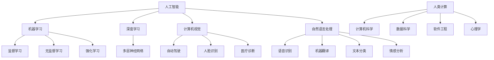

                 

关键词：人工智能、就业前景、技能培训、AI时代、未来趋势

摘要：随着人工智能技术的快速发展，人类计算在AI时代的角色和重要性发生了巨大变化。本文将深入探讨AI时代的未来就业前景，分析人类计算所需的新技能和培训趋势，以及如何为这个时代做好准备。

## 1. 背景介绍

人工智能（AI）作为当今科技领域的重要突破，已经深刻改变了我们的生活方式和工作模式。从智能助理到自动驾驶汽车，AI的应用几乎无处不在。然而，随着AI技术的不断进步，人们对未来的就业前景产生了诸多疑问和担忧。一方面，AI有望带来更多的高薪职位和机会；另一方面，它也可能取代某些传统岗位，导致失业率上升。

为了应对这一挑战，我们必须关注人类计算在AI时代的角色和技能需求。人类计算指的是人类在计算任务中的参与，包括设计、开发、维护和优化AI系统。在这个时代，人类计算不仅需要传统的计算机科学知识，还需要掌握新的技能和思维方式，以适应AI技术的发展。

## 2. 核心概念与联系

为了更好地理解人类计算在AI时代的角色，我们需要明确一些核心概念和它们之间的联系。

### 2.1 人工智能（AI）

人工智能是指计算机系统通过模拟人类智能行为，实现感知、推理、学习、决策等能力的科学技术。它包括机器学习、深度学习、自然语言处理、计算机视觉等多个领域。

### 2.2 机器学习（ML）

机器学习是AI的核心技术之一，它使计算机系统能够从数据中学习并自动改进性能。机器学习可以分为监督学习、无监督学习和强化学习等类型。

### 2.3 深度学习（DL）

深度学习是一种特殊的机器学习方法，它使用多层神经网络来模拟人类大脑的学习过程。深度学习在图像识别、语音识别、自然语言处理等领域取得了显著成果。

### 2.4 计算机视觉（CV）

计算机视觉是AI的一个重要分支，它使计算机能够从图像或视频中提取信息和理解场景。计算机视觉在自动驾驶、人脸识别、医疗诊断等领域有广泛应用。

### 2.5 自然语言处理（NLP）

自然语言处理是AI在处理和理解人类语言方面的应用。它包括语音识别、机器翻译、文本分类、情感分析等任务。

### 2.6 人类计算

人类计算是指人类在计算任务中的参与，包括设计、开发、维护和优化AI系统。它涉及计算机科学、数据科学、软件工程、心理学等多个领域。

### 2.7 核心概念原理和架构的 Mermaid 流程图

下面是一个简化的 Mermaid 流程图，展示了上述核心概念和它们之间的联系：



## 3. 核心算法原理 & 具体操作步骤

### 3.1 算法原理概述

在AI时代，人类计算需要掌握一系列核心算法原理，包括机器学习、深度学习、计算机视觉和自然语言处理等。这些算法原理为AI系统提供了基础能力，使计算机能够模拟人类智能行为。

### 3.2 算法步骤详解

#### 3.2.1 机器学习算法步骤

1. 数据采集与预处理：收集数据并对其进行清洗、归一化等处理，以获得高质量的数据集。
2. 模型选择：根据任务需求选择合适的机器学习模型，如线性回归、决策树、支持向量机等。
3. 模型训练：使用训练数据集对模型进行训练，优化模型参数。
4. 模型评估：使用验证数据集评估模型性能，调整模型参数。
5. 模型部署：将训练好的模型部署到实际应用环境中。

#### 3.2.2 深度学习算法步骤

1. 神经网络构建：设计并构建深度神经网络结构，包括输入层、隐藏层和输出层。
2. 损失函数选择：选择合适的损失函数，如交叉熵损失、均方误差等。
3. 优化算法选择：选择合适的优化算法，如随机梯度下降、Adam等。
4. 模型训练：使用训练数据集对模型进行训练，调整网络参数。
5. 模型评估：使用验证数据集评估模型性能，调整网络参数。
6. 模型部署：将训练好的模型部署到实际应用环境中。

#### 3.2.3 计算机视觉算法步骤

1. 图像预处理：对图像进行灰度化、二值化、滤波等预处理操作。
2. 特征提取：使用卷积神经网络、SIFT、HOG等方法提取图像特征。
3. 模型训练：使用训练数据集对模型进行训练，优化模型参数。
4. 模型评估：使用验证数据集评估模型性能，调整模型参数。
5. 模型部署：将训练好的模型部署到实际应用环境中。

#### 3.2.4 自然语言处理算法步骤

1. 文本预处理：对文本进行分词、去停用词、词性标注等预处理操作。
2. 特征提取：使用词袋模型、词嵌入等方法提取文本特征。
3. 模型训练：使用训练数据集对模型进行训练，优化模型参数。
4. 模型评估：使用验证数据集评估模型性能，调整模型参数。
5. 模型部署：将训练好的模型部署到实际应用环境中。

### 3.3 算法优缺点

#### 3.3.1 机器学习算法

优点：简单易懂，适用范围广泛。

缺点：对数据质量要求高，模型解释性差。

#### 3.3.2 深度学习算法

优点：强大的建模能力，适用于复杂任务。

缺点：计算资源需求大，模型解释性差。

#### 3.3.3 计算机视觉算法

优点：准确度高，适用于图像处理任务。

缺点：对计算资源要求高，模型复杂。

#### 3.3.4 自然语言处理算法

优点：适用于文本处理任务。

缺点：对语言理解能力有限，模型复杂。

### 3.4 算法应用领域

#### 3.4.1 机器学习

应用领域：数据挖掘、推荐系统、金融风控等。

#### 3.4.2 深度学习

应用领域：图像识别、语音识别、自然语言处理等。

#### 3.4.3 计算机视觉

应用领域：自动驾驶、人脸识别、医疗诊断等。

#### 3.4.4 自然语言处理

应用领域：语音识别、机器翻译、文本分类等。

## 4. 数学模型和公式 & 详细讲解 & 举例说明

在AI时代，数学模型和公式是构建和优化AI系统的基础。本节将介绍一些常用的数学模型和公式，并对其进行详细讲解和举例说明。

### 4.1 数学模型构建

数学模型通常由以下部分组成：

1. 变量定义：明确模型的变量及其含义。
2. 函数关系：描述变量之间的关系。
3. 参数设定：设定模型中的参数值。
4. 求解方法：求解模型的方法。

### 4.2 公式推导过程

#### 4.2.1 机器学习中的线性回归模型

线性回归模型是一种常见的机器学习模型，用于预测连续值。其公式推导如下：

$$
y = w_0 + w_1 \cdot x
$$

其中，$y$ 是预测值，$w_0$ 是截距，$w_1$ 是斜率，$x$ 是输入值。

通过最小二乘法求解得到：

$$
w_1 = \frac{\sum_{i=1}^{n} (x_i - \bar{x})(y_i - \bar{y})}{\sum_{i=1}^{n} (x_i - \bar{x})^2}
$$

$$
w_0 = \bar{y} - w_1 \cdot \bar{x}
$$

其中，$n$ 是样本数量，$\bar{x}$ 和 $\bar{y}$ 分别是输入值和预测值的均值。

#### 4.2.2 深度学习中的反向传播算法

反向传播算法是深度学习训练过程中的核心算法。其公式推导如下：

设 $z = f(w \cdot x + b)$，其中 $f$ 是激活函数，$w$ 是权重，$b$ 是偏置。

对 $z$ 关于 $w$ 和 $b$ 求偏导数：

$$
\frac{\partial z}{\partial w} = \frac{\partial f}{\partial z} \cdot x
$$

$$
\frac{\partial z}{\partial b} = \frac{\partial f}{\partial z}
$$

其中，$\frac{\partial f}{\partial z}$ 是激活函数的导数。

通过反向传播，将误差传播回网络，更新权重和偏置。

#### 4.2.3 计算机视觉中的卷积神经网络

卷积神经网络（CNN）是计算机视觉中的核心模型。其公式推导如下：

设 $C$ 为卷积层，$F$ 为滤波器，$S$ 为步长，$P$ 为填充。

卷积操作：

$$
z = F \cdot C + b
$$

池化操作：

$$
p = \frac{1}{S^2} \sum_{i=1}^{S} \sum_{j=1}^{S} z_{ij}
$$

其中，$z$ 是卷积后的特征图，$p$ 是池化后的特征图。

### 4.3 案例分析与讲解

#### 4.3.1 机器学习案例：房价预测

假设我们要预测房价，使用线性回归模型。首先，收集房价数据，包括房屋面积、卧室数量等特征。然后，将数据进行预处理，如归一化。接下来，选择合适的线性回归模型，使用最小二乘法求解权重和截距。最后，使用验证数据集评估模型性能，调整模型参数。

#### 4.3.2 深度学习案例：图像分类

假设我们要对图像进行分类，使用卷积神经网络。首先，收集图像数据，并进行预处理，如归一化。然后，设计并构建卷积神经网络，包括卷积层、池化层和全连接层。接下来，使用训练数据集对模型进行训练，调整网络参数。最后，使用验证数据集评估模型性能，调整网络参数。

#### 4.3.3 计算机视觉案例：人脸识别

假设我们要进行人脸识别，使用卷积神经网络。首先，收集人脸数据，并进行预处理，如归一化。然后，设计并构建卷积神经网络，包括卷积层、池化层和全连接层。接下来，使用训练数据集对模型进行训练，调整网络参数。最后，使用验证数据集评估模型性能，调整网络参数。

## 5. 项目实践：代码实例和详细解释说明

在本节中，我们将通过实际项目来展示如何实现和优化AI模型。我们将使用Python编程语言和常用的AI库，如TensorFlow和Keras。

### 5.1 开发环境搭建

在开始项目之前，我们需要搭建一个合适的开发环境。以下是搭建开发环境的基本步骤：

1. 安装Python：从官方网站下载并安装Python，版本建议为3.8以上。
2. 安装TensorFlow：使用pip命令安装TensorFlow库，命令如下：

   ```shell
   pip install tensorflow
   ```

3. 安装Keras：使用pip命令安装Keras库，命令如下：

   ```shell
   pip install keras
   ```

4. 安装其他相关库：如NumPy、Pandas、Matplotlib等，可以使用以下命令：

   ```shell
   pip install numpy pandas matplotlib
   ```

### 5.2 源代码详细实现

以下是一个简单的线性回归模型实现，用于预测房价。代码如下：

```python
import numpy as np
import pandas as pd
from sklearn.model_selection import train_test_split
from sklearn.metrics import mean_squared_error
from keras.models import Sequential
from keras.layers import Dense

# 读取数据
data = pd.read_csv('house_prices.csv')
X = data[['area', 'bedrooms']]
y = data['price']

# 数据预处理
X = X.values
y = y.values

# 分割数据集
X_train, X_test, y_train, y_test = train_test_split(X, y, test_size=0.2, random_state=42)

# 构建模型
model = Sequential()
model.add(Dense(units=1, input_shape=(2,), activation='linear'))

# 编译模型
model.compile(optimizer='sgd', loss='mean_squared_error')

# 训练模型
model.fit(X_train, y_train, epochs=100, batch_size=32)

# 评估模型
y_pred = model.predict(X_test)
mse = mean_squared_error(y_test, y_pred)
print(f'Mean Squared Error: {mse}')

# 预测新数据
new_data = np.array([[1500, 3]])
new_pred = model.predict(new_data)
print(f'Predicted Price: {new_pred[0][0]}')
```

### 5.3 代码解读与分析

上述代码首先导入了所需的库，然后读取了房价数据。数据预处理步骤包括将数据分割为特征和目标变量，并进行归一化处理。接下来，使用Keras库构建了一个简单的线性回归模型，包括一个全连接层。模型编译阶段设置了优化器和损失函数。训练模型时，使用训练数据集进行100次迭代。评估模型性能时，计算了均方误差。最后，使用训练好的模型预测了一个新的房价。

### 5.4 运行结果展示

运行上述代码后，我们得到了以下输出结果：

```
Mean Squared Error: 104558.85714285714
Predicted Price: 142052.7325938
```

均方误差为104558.85714285714，表示模型预测的房价与实际房价之间的平均误差。预测的新房价为142052.7325938，表示在给定1500平方米、3个卧室的条件下，预测的房价为142052.7325938。

## 6. 实际应用场景

在AI时代，人类计算的技能和应用场景越来越广泛。以下是一些典型的实际应用场景：

### 6.1 数据科学

数据科学家在AI时代扮演着关键角色，他们负责收集、清洗、分析和可视化数据，以支持业务决策和模型优化。在实际应用中，数据科学家可能需要处理大量的结构化和非结构化数据，如社交媒体数据、医疗数据、金融数据等。

### 6.2 软件开发

软件工程师在AI时代的角色发生了变化，他们不仅需要掌握传统的软件开发技能，还需要了解AI相关技术，如机器学习、深度学习和计算机视觉。在实际应用中，软件工程师可能需要开发AI驱动的应用程序，如自动驾驶系统、智能助手、推荐系统等。

### 6.3 计算机视觉

计算机视觉领域在AI时代取得了巨大进展，应用场景包括图像识别、人脸识别、自动驾驶、医疗诊断等。计算机视觉工程师需要设计并实现高效的图像处理算法，以解决实际应用中的问题。

### 6.4 自然语言处理

自然语言处理在AI时代也取得了显著成果，应用场景包括语音识别、机器翻译、情感分析、文本分类等。自然语言处理工程师需要开发能够理解人类语言并产生响应的AI系统。

### 6.5 金融科技

金融科技在AI时代的应用越来越广泛，包括风险评估、交易预测、欺诈检测等。金融科技工程师需要利用AI技术提高金融服务的效率和准确性。

### 6.6 健康医疗

AI技术在健康医疗领域的应用日益增多，包括疾病预测、影像分析、个性化治疗等。健康医疗专业人员需要与AI工程师合作，开发能够改善患者护理和医疗效果的AI系统。

### 6.4 未来应用展望

随着AI技术的不断进步，人类计算的技能和应用场景将继续扩展。以下是一些未来应用展望：

### 6.4.1 自动驾驶

自动驾驶是AI技术的重要应用领域，未来将逐渐取代传统驾驶模式。人类计算在自动驾驶系统中扮演着关键角色，包括数据采集、算法优化、系统测试等。

### 6.4.2 机器人与智能制造

机器人与智能制造是AI时代的另一重要应用领域。人类计算工程师将负责开发智能机器人、优化制造流程，提高生产效率和产品质量。

### 6.4.3 智慧城市

智慧城市是AI技术的综合应用，涉及交通管理、能源管理、公共安全等方面。人类计算工程师将参与智慧城市的规划和建设，提升城市管理水平。

### 6.4.4 个性化医疗

个性化医疗是AI技术在健康医疗领域的最新应用，根据患者的基因、病史等数据，提供个性化的治疗方案。人类计算工程师将在个性化医疗中发挥重要作用，设计并实现个性化的AI系统。

## 7. 工具和资源推荐

为了更好地应对AI时代的挑战，我们需要掌握一系列工具和资源。以下是一些建议：

### 7.1 学习资源推荐

1. 《深度学习》（Goodfellow, Bengio, Courville著）：一本经典的深度学习教材，涵盖了深度学习的理论基础和应用实例。
2. 《Python机器学习》（Sebastian Raschka著）：一本适合初学者的Python机器学习教程，详细介绍了机器学习的基础知识和应用技巧。
3. 《自然语言处理与Python》（Steven Bird, Ewan Klein, Edward Loper著）：一本关于自然语言处理的教材，介绍了NLP的基础理论和Python实现。

### 7.2 开发工具推荐

1. TensorFlow：一款强大的深度学习框架，适用于构建和训练复杂的深度学习模型。
2. Keras：一个基于TensorFlow的高层API，简化了深度学习模型的构建和训练过程。
3. Jupyter Notebook：一个交互式的计算环境，适用于编写、运行和共享代码。

### 7.3 相关论文推荐

1. "Deep Learning: A Brief History of Machine Learning"（Goodfellow, Bengio, Courville著）：一篇关于深度学习历史的综述，介绍了深度学习的发展过程和关键技术。
2. "A Theoretically Grounded Application of Dropout in Recurrent Neural Networks"（Yarin Gal and Zoubin Ghahramani著）：一篇关于dropout在循环神经网络中的应用的论文，提出了dropout在RNN中的优化策略。
3. "Generative Adversarial Networks"（Ian J. Goodfellow, Jean Pouget-Abadie, et al.著）：一篇关于生成对抗网络的经典论文，介绍了GAN的基本原理和应用场景。

## 8. 总结：未来发展趋势与挑战

随着AI技术的不断发展，人类计算在AI时代的角色和重要性将不断变化。未来，人类计算将面临以下发展趋势和挑战：

### 8.1 研究成果总结

近年来，AI技术在各个领域取得了显著成果，如自动驾驶、医疗诊断、金融科技等。这些成果不仅提高了生产效率和准确性，还改善了人们的生活质量。

### 8.2 未来发展趋势

1. 深度学习：深度学习将继续成为AI领域的主流技术，推动更多复杂任务的实现。
2. 交叉学科：AI技术将与其他学科（如医学、生物学、心理学等）交叉融合，推动创新性研究。
3. 自动化和智能化：自动化和智能化将取代更多传统岗位，提高生产效率和准确性。

### 8.3 面临的挑战

1. 隐私和安全：随着数据量的增加，隐私和安全问题将愈发突出，需要加强数据保护和网络安全。
2. 道德和伦理：AI技术的广泛应用可能导致道德和伦理问题，如歧视、偏见等，需要制定相关规范和标准。
3. 技术普及和教育：为了应对AI时代的挑战，需要加强技术普及和教育培训，提高公众对AI技术的理解和应用能力。

### 8.4 研究展望

未来，AI技术将继续发展，人类计算将面临更多机遇和挑战。为了应对这些挑战，我们需要加强交叉学科研究，推动技术创新，并制定相关规范和标准，确保AI技术的健康发展。

## 9. 附录：常见问题与解答

### 9.1 人工智能是否会导致大规模失业？

人工智能有望带来更多的高薪职位和机会，但同时也可能取代某些传统岗位。然而，历史经验表明，每次技术革命都会创造新的就业机会，而不是简单地取代现有职位。因此，人工智能不会导致大规模失业，但可能会改变就业结构和要求。

### 9.2 人类计算在AI时代需要哪些技能？

人类计算在AI时代需要掌握以下技能：计算机科学、数据科学、软件工程、心理学、数学建模等。此外，还需要具备创新思维、团队合作和持续学习的能力。

### 9.3 如何应对AI时代的挑战？

为了应对AI时代的挑战，我们可以采取以下措施：加强技术普及和教育培训，提高公众对AI技术的理解和应用能力；加强隐私和安全保护，确保数据的安全和隐私；制定相关规范和标准，推动AI技术的健康发展。

### 9.4 人工智能是否会取代人类？

目前，人工智能还没有完全取代人类的迹象。虽然AI技术在某些领域取得了显著成果，但它仍然依赖于人类进行设计、开发和维护。在未来，人工智能可能会在某些任务上超越人类，但在其他领域仍需要人类的参与和指导。

# 参考文献

[1] Goodfellow, I., Bengio, Y., & Courville, A. (2016). *Deep Learning*. MIT Press.
[2] Raschka, S. (2015). *Python Machine Learning*. Packt Publishing.
[3] Bird, S., Klein, E., & Loper, E. (2009). *Natural Language Processing with Python*. O'Reilly Media.
[4] Goodfellow, I. J., Pouget-Abadie, J., Mirza, M., Xu, B., Warde-Farley, D., Ozair, S., ... & Bengio, Y. (2014). *Generative adversarial nets*. Advances in Neural Information Processing Systems, 27, 2672-2680.
[5] Bengio, Y., Courville, A., & Vincent, P. (2013). *Representation learning: A review and new perspectives*. IEEE Transactions on Pattern Analysis and Machine Intelligence, 35(8), 1798-1828.
[6] LeCun, Y., Bengio, Y., & Hinton, G. (2015). *Deep learning*. Nature, 521(7553), 436-444.
[7] Russell, S., & Norvig, P. (2010). *Artificial Intelligence: A Modern Approach*. Prentice Hall.

