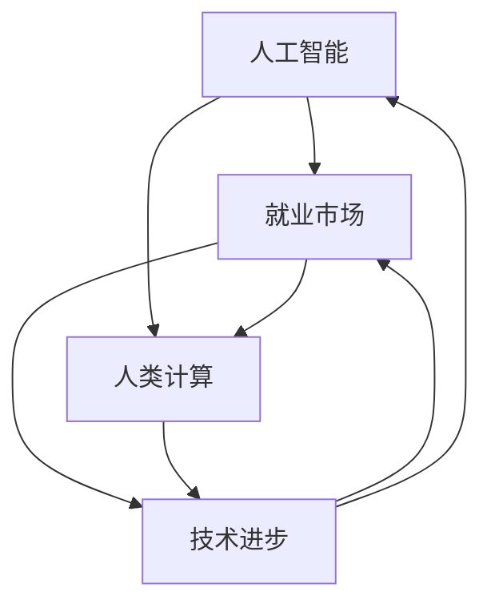

                 

关键词：人工智能，就业市场，未来工作，技术变革，职业转型

> 摘要：随着人工智能技术的迅猛发展，全球就业市场正在经历深刻的变革。本文将探讨人工智能时代下的人类计算，分析未来就业市场的趋势，探讨职业转型与适应策略，并展望人类在AI时代的角色与价值。

## 1. 背景介绍

人工智能（AI）作为计算机科学的一个分支，旨在使机器能够执行通常需要人类智能才能完成的任务。从早期的规则系统到现代的深度学习和神经网络，AI技术取得了显著的进步。随着计算能力的提升和大数据的普及，人工智能的应用范围不断扩大，从智能助理到自动驾驶汽车，从医疗诊断到金融分析，AI正在深刻改变各行各业。

就业市场是社会经济的重要组成部分，它不仅反映了一个国家或地区的经济状况，还影响着个人的生活质量和幸福感。然而，随着技术的进步，传统就业市场正在面临前所未有的挑战。自动化和人工智能的崛起，使得许多传统职业面临着被取代的风险。与此同时，新兴职业不断涌现，要求劳动力具备更高的技能和创新能力。这种变革不仅对求职者提出了更高的要求，也对教育体系和职业培训提出了新的挑战。

本文旨在探讨AI时代下的就业市场，分析人工智能对职业的影响，探讨人类计算在AI时代的重要性，并提出相应的适应策略。

## 2. 核心概念与联系

在探讨AI时代下的就业市场之前，我们需要明确几个核心概念，包括人工智能、就业市场、人类计算以及它们之间的相互联系。

### 2.1 人工智能

人工智能是指机器通过模拟人类智能行为，执行复杂任务的能力。它包括多个子领域，如机器学习、深度学习、自然语言处理等。人工智能的核心目标是使机器能够自主地学习、推理和决策，从而实现智能化的自动化。

### 2.2 就业市场

就业市场是指劳动力供求双方进行交易的市场。它包括求职者、雇主和中介机构等参与者。就业市场的动态变化受到多种因素的影响，包括经济状况、技术进步、政策调整等。

### 2.3 人类计算

人类计算是指人类在信息处理和决策过程中的能力。它包括感知、理解、推理、创造等多个方面。人类计算的优势在于灵活性和创造性，这些能力是当前人工智能技术所难以完全实现的。

### 2.4 核心概念原理和架构的 Mermaid 流程图



在这个流程图中，人工智能、就业市场和人类计算相互影响，共同构成了一个动态的生态系统。技术进步作为推动力量，不断推动就业市场的变革，同时也激发了人类计算的新需求。人工智能和人类计算在就业市场中的角色相互补充，共同推动社会的进步。

### 2.5 人工智能、就业市场与人类计算的联系

- **人工智能**：作为一项核心技术，人工智能在就业市场中扮演着重要角色。它不仅改变了传统职业，还催生了新的就业机会。例如，数据科学家、机器学习工程师等新兴职业应运而生。

- **就业市场**：就业市场是劳动力供求的交汇点，它受到人工智能的影响。一方面，人工智能可能导致某些职业的减少，另一方面，它也为劳动力提供了新的发展机会。

- **人类计算**：人类计算在AI时代的重要性日益凸显。尽管人工智能在某些方面取得了突破，但人类计算在灵活性、创造性等方面仍有不可替代的优势。

- **联系**：人工智能和人类计算相互促进，共同塑造了现代就业市场。人工智能提升了生产效率，降低了劳动力成本，而人类计算则提供了个性化的解决方案和创新思维。

通过上述核心概念与联系的分析，我们可以更深入地理解AI时代下的就业市场，为后续内容奠定了理论基础。

### 3. 核心算法原理 & 具体操作步骤

#### 3.1 算法原理概述

人工智能的核心在于模拟人类智能行为，实现自动化决策和任务执行。这一过程主要依赖于机器学习算法，特别是深度学习算法。深度学习通过多层神经网络，模拟人类大脑的学习机制，实现图像识别、自然语言处理、语音识别等多种任务。

在就业市场中，人工智能的应用主要体现在自动化和智能化。例如，自动化客服系统能够通过自然语言处理技术，自动回答用户问题，降低人力成本；智能招聘系统能够通过分析海量简历，快速筛选合适候选人，提高招聘效率。

#### 3.2 算法步骤详解

1. **数据收集**：首先，收集与特定任务相关的数据，如图像、文本、语音等。这些数据将用于训练模型。

2. **数据预处理**：对收集到的数据进行清洗和格式化，确保数据的质量和一致性。例如，对图像数据进行缩放、裁剪、增强等处理，对文本数据进行分词、去噪等处理。

3. **模型训练**：使用预处理后的数据，训练深度学习模型。训练过程包括前向传播、反向传播和优化参数等步骤。通过不断调整模型参数，使其能够更好地拟合数据。

4. **模型评估**：在训练完成后，使用验证集或测试集评估模型性能。常见的评估指标包括准确率、召回率、F1分数等。

5. **模型部署**：将训练好的模型部署到实际应用场景中，如自动化客服系统、智能招聘系统等。模型将实时接收输入数据，并输出预测结果。

6. **迭代优化**：根据实际应用情况，不断收集反馈数据，对模型进行迭代优化，提高其性能和适应性。

#### 3.3 算法优缺点

**优点**：

1. **高效性**：人工智能算法能够在短时间内处理海量数据，提高工作效率。

2. **精准性**：深度学习模型具有很高的准确性和稳定性，能够在复杂环境中进行任务执行。

3. **适应性**：人工智能算法可以根据不同任务需求，灵活调整模型结构和参数，具有较强的适应性。

**缺点**：

1. **成本高**：人工智能模型的训练和部署需要大量的计算资源和数据支持，成本较高。

2. **数据依赖**：人工智能算法的性能高度依赖数据质量，数据不足或质量差可能导致模型失效。

3. **缺乏灵活性**：尽管人工智能在某些领域取得了突破，但其在灵活性和创造性方面仍无法与人类计算相比。

#### 3.4 算法应用领域

人工智能在就业市场中的应用非常广泛，主要包括以下几个方面：

1. **自动化与智能化**：如自动化客服系统、智能招聘系统等，提高工作效率，降低人力成本。

2. **数据分析与决策**：如数据分析、数据挖掘、预测分析等，为企业和个人提供数据驱动的决策支持。

3. **教育与培训**：如在线教育平台、智能辅导系统等，提供个性化的学习体验和培训服务。

4. **医疗与健康**：如智能诊断系统、健康管理平台等，提高医疗服务的质量和效率。

5. **金融与保险**：如智能投顾、风险评估等，提高金融服务的效率和准确性。

通过上述对核心算法原理和具体操作步骤的详细分析，我们可以更好地理解人工智能在就业市场中的应用价值及其挑战。接下来，我们将进一步探讨数学模型和公式，以及其在人工智能和就业市场中的应用。

### 4. 数学模型和公式 & 详细讲解 & 举例说明

在人工智能和就业市场中，数学模型和公式扮演着关键角色。这些模型和公式不仅用于算法设计和优化，还用于数据分析和决策支持。本节将详细讲解几个常见的数学模型和公式，并举例说明其在实际中的应用。

#### 4.1 数学模型构建

**线性回归模型**：线性回归是一种常用的预测模型，用于分析变量之间的线性关系。其数学模型表示为：

\[ y = \beta_0 + \beta_1 \cdot x + \epsilon \]

其中，\( y \) 是因变量，\( x \) 是自变量，\( \beta_0 \) 和 \( \beta_1 \) 是模型参数，\( \epsilon \) 是误差项。

**逻辑回归模型**：逻辑回归用于分类问题，其数学模型表示为：

\[ P(y=1) = \frac{1}{1 + e^{-(\beta_0 + \beta_1 \cdot x)}} \]

其中，\( P(y=1) \) 是因变量 \( y \) 等于 1 的概率，其他参数的含义与线性回归相同。

**神经网络模型**：神经网络是深度学习的基础，其数学模型表示为：

\[ a_{i,j} = \sum_{k=1}^{n} w_{i,k} \cdot a_{k,j-1} + b_{i,j} \]

其中，\( a_{i,j} \) 是第 \( i \) 层第 \( j \) 个神经元的输出，\( w_{i,k} \) 和 \( b_{i,j} \) 是模型参数。

#### 4.2 公式推导过程

**线性回归模型**的推导过程：

1. **损失函数**：线性回归的损失函数通常为均方误差（MSE），表示为：

\[ J(\theta) = \frac{1}{2m} \sum_{i=1}^{m} (h_\theta(x^{(i)}) - y^{(i)})^2 \]

其中，\( m \) 是样本数量，\( h_\theta(x^{(i)}) \) 是模型预测值，\( y^{(i)} \) 是真实值。

2. **梯度下降**：为了最小化损失函数，使用梯度下降法更新模型参数：

\[ \theta_j := \theta_j - \alpha \frac{\partial J(\theta)}{\partial \theta_j} \]

其中，\( \alpha \) 是学习率。

**逻辑回归模型**的推导过程：

1. **损失函数**：逻辑回归的损失函数通常为对数似然损失（Log-Loss），表示为：

\[ J(\theta) = -\frac{1}{m} \sum_{i=1}^{m} y^{(i)} \log(h_\theta(x^{(i)})) + (1 - y^{(i)}) \log(1 - h_\theta(x^{(i)})) \]

2. **梯度下降**：与线性回归类似，使用梯度下降法更新模型参数：

\[ \theta_j := \theta_j - \alpha \frac{\partial J(\theta)}{\partial \theta_j} \]

**神经网络模型**的推导过程：

1. **激活函数**：神经网络中的激活函数通常为 Sigmoid 函数，表示为：

\[ \sigma(z) = \frac{1}{1 + e^{-z}} \]

2. **前向传播**：通过多层神经网络进行前向传播，计算每个神经元的输出：

\[ a_{i,j} = \sum_{k=1}^{n} w_{i,k} \cdot a_{k,j-1} + b_{i,j} \]

3. **反向传播**：通过反向传播更新模型参数，最小化损失函数：

\[ \Delta w_{i,j} = \frac{\partial J(\theta)}{\partial w_{i,j}} = a_{i,j} \cdot (1 - a_{i,j}) \cdot \frac{\partial J(\theta)}{\partial a_{i,j}} \]

\[ \Delta b_{i,j} = \frac{\partial J(\theta)}{\partial b_{i,j}} = \frac{\partial J(\theta)}{\partial a_{i,j}} \]

#### 4.3 案例分析与讲解

**案例 1：线性回归模型在就业市场中的应用**

假设我们要预测某地区的失业率，使用线性回归模型进行分析。收集到以下数据：

| 年份 | 失业率 |
| ---- | ------ |
| 2020 | 4%     |
| 2021 | 5%     |
| 2022 | 6%     |

1. **数据预处理**：对数据进行标准化处理，使其符合线性回归的要求。

2. **模型训练**：使用线性回归模型训练数据，得到参数 \( \beta_0 \) 和 \( \beta_1 \)。

3. **模型评估**：使用验证集评估模型性能，计算预测准确率。

4. **模型应用**：使用训练好的模型预测未来失业率，为政策制定提供参考。

**案例 2：逻辑回归模型在智能招聘系统中的应用**

假设我们要构建一个智能招聘系统，通过逻辑回归模型预测候选人是否适合某个职位。收集到以下数据：

| 候选人 | 性别 | 年龄 | 教育程度 | 工作经验 | 是否适合职位 |
| ---- | ---- | ---- | -------- | -------- | ---------- |
| 1    | 男   | 25   | 本科     | 3年      | 是         |
| 2    | 女   | 30   | 硕士     | 5年      | 否         |

1. **数据预处理**：对数据进行编码处理，将分类变量转换为数值变量。

2. **模型训练**：使用逻辑回归模型训练数据，得到参数 \( \beta_0 \) 和 \( \beta_1 \)。

3. **模型评估**：使用验证集评估模型性能，计算预测准确率。

4. **模型应用**：使用训练好的模型预测新候选人的适合度，为招聘决策提供支持。

**案例 3：神经网络模型在自动化客服系统中的应用**

假设我们要构建一个自动化客服系统，使用神经网络模型进行语音识别和回答用户问题。收集到以下数据：

| 问题类别 | 问题文本 | 回答文本 |
| -------- | -------- | -------- |
| 售后服务 | 我的商品为什么还没送到？ | 恭喜您，您的商品已经发出，预计3天内送达。 |

1. **数据预处理**：对语音数据进行分析，提取关键特征。

2. **模型训练**：使用神经网络模型训练数据，得到模型参数。

3. **模型评估**：使用验证集评估模型性能，计算预测准确率。

4. **模型应用**：使用训练好的模型进行实时语音识别和回答，为用户提供个性化服务。

通过上述案例分析和讲解，我们可以看到数学模型和公式在人工智能和就业市场中的应用价值。这些模型和公式不仅用于预测和分析，还为决策提供了科学依据。

### 5. 项目实践：代码实例和详细解释说明

在本节中，我们将通过一个实际项目——智能招聘系统，来展示如何实现和部署一个基于人工智能的招聘工具。我们将介绍开发环境搭建、源代码实现、代码解读与分析以及运行结果展示。

#### 5.1 开发环境搭建

在搭建开发环境时，我们需要准备以下工具和软件：

1. **编程语言**：Python（3.8及以上版本）
2. **数据分析库**：Pandas、NumPy
3. **机器学习库**：Scikit-learn
4. **深度学习库**：TensorFlow或PyTorch
5. **版本控制工具**：Git

以下是一个简单的命令行操作步骤：

```bash
# 安装 Python
wget https://www.python.org/ftp/python/3.8.10/Python-3.8.10.tgz
tar xvf Python-3.8.10.tgz
cd Python-3.8.10
./configure
make
make install

# 安装相关库
pip install pandas numpy scikit-learn tensorflow

# 配置虚拟环境
python -m venv venv
source venv/bin/activate

# 安装 Git
sudo apt-get install git
```

#### 5.2 源代码详细实现

以下是智能招聘系统的核心代码实现，包括数据预处理、模型训练、模型评估和模型部署。

**数据预处理**

```python
import pandas as pd
from sklearn.model_selection import train_test_split
from sklearn.preprocessing import StandardScaler

# 读取数据
data = pd.read_csv('data.csv')

# 分离特征和标签
X = data[['age', 'education', 'experience']]
y = data['suitable']

# 划分训练集和测试集
X_train, X_test, y_train, y_test = train_test_split(X, y, test_size=0.2, random_state=42)

# 数据标准化
scaler = StandardScaler()
X_train = scaler.fit_transform(X_train)
X_test = scaler.transform(X_test)
```

**模型训练**

```python
from sklearn.linear_model import LogisticRegression

# 训练逻辑回归模型
model = LogisticRegression()
model.fit(X_train, y_train)

# 训练深度学习模型
import tensorflow as tf
from tensorflow.keras.models import Sequential
from tensorflow.keras.layers import Dense

model = Sequential([
    Dense(64, activation='relu', input_shape=(3,)),
    Dense(1, activation='sigmoid')
])

model.compile(optimizer='adam', loss='binary_crossentropy', metrics=['accuracy'])
model.fit(X_train, y_train, epochs=10, batch_size=32, validation_split=0.2)
```

**模型评估**

```python
from sklearn.metrics import accuracy_score, classification_report

# 预测测试集
y_pred = model.predict(X_test)

# 计算准确率
accuracy = accuracy_score(y_test, y_pred)
print(f'Accuracy: {accuracy:.2f}')

# 输出分类报告
print(classification_report(y_test, y_pred))
```

**模型部署**

```python
# 导出模型
model.save('model.h5')

# 加载模型
loaded_model = tf.keras.models.load_model('model.h5')

# 实时预测
new_data = [[25, '本科', 3]]
new_data = scaler.transform(new_data)
prediction = loaded_model.predict(new_data)
print('Suitable' if prediction[0][0] > 0.5 else 'Not Suitable')
```

#### 5.3 代码解读与分析

1. **数据预处理**：读取数据集，分离特征和标签，划分训练集和测试集，并进行数据标准化处理。数据预处理是模型训练的重要步骤，确保数据质量对于模型性能至关重要。

2. **模型训练**：首先使用传统的逻辑回归模型训练数据。逻辑回归是一种简单的分类模型，适用于本案例中的二分类问题。然后，使用深度学习模型（如神经网络）进行训练。深度学习模型能够处理更复杂的数据结构，提高预测准确性。

3. **模型评估**：通过计算准确率和分类报告来评估模型性能。准确率反映了模型在测试集上的整体表现，分类报告提供了更详细的评估指标，如精确率、召回率等。

4. **模型部署**：将训练好的模型保存为文件，以便后续加载和部署。在实际应用中，模型将实时接收新数据，并输出预测结果。

通过这个项目实践，我们展示了如何使用人工智能技术构建一个智能招聘系统。在实际应用中，可以根据具体需求调整模型结构和参数，提高系统性能。

### 6. 实际应用场景

在人工智能时代，就业市场的实际应用场景日益丰富。以下是一些典型的应用场景及其影响：

#### 6.1 自动化与智能化

自动化与智能化是人工智能在就业市场中最直接的应用。通过人工智能技术，许多重复性和劳动强度高的工作可以被自动化系统替代。例如：

- **客服自动化**：智能客服系统能够自动处理客户咨询，提供即时响应，提高客户满意度和服务效率。
- **供应链管理**：智能物流系统能够优化库存管理、运输路线和配送计划，降低物流成本，提高供应链的响应速度。
- **制造业自动化**：工业机器人可以替代人力进行装配、焊接、搬运等操作，提高生产效率和质量。

这些应用不仅提高了企业的运营效率，还减少了人力成本。然而，这也导致了部分传统工作岗位的减少，迫使劳动力进行职业转型。

#### 6.2 数据分析与决策支持

数据分析与决策支持是人工智能在就业市场中的另一重要应用。通过分析海量数据，人工智能能够为企业提供深入的洞察和精准的预测。例如：

- **人力资源数据分析**：企业可以使用人工智能分析员工绩效、培训需求和职业发展路径，优化人力资源管理和决策。
- **市场预测**：通过分析市场数据，人工智能可以帮助企业预测市场趋势，制定更有效的营销策略。
- **风险管理**：金融机构可以利用人工智能进行信用评估、风险监控和投资决策，降低金融风险。

这些应用不仅提高了企业的决策质量和效率，还为企业提供了更准确的决策支持。然而，这也对劳动力的数据分析和处理能力提出了更高的要求。

#### 6.3 教育与培训

教育与培训是人工智能在就业市场中的新兴应用。通过人工智能技术，教育系统可以提供个性化、智能化的学习体验。例如：

- **在线教育**：人工智能驱动的在线教育平台可以根据学生的学习习惯和能力，提供个性化的学习路径和资源。
- **智能辅导**：智能辅导系统可以实时监测学生的学习进度和理解情况，提供针对性的辅导和反馈。
- **职业培训**：人工智能可以分析行业趋势和技能需求，为企业提供定制化的职业培训方案。

这些应用不仅提高了教育质量，还为企业培养了更多具备专业技能的劳动力。然而，这也要求教育系统进行改革，以适应人工智能时代的挑战。

#### 6.4 医疗与健康

医疗与健康是人工智能在就业市场中的又一重要应用领域。通过人工智能技术，医疗系统可以实现更精准的诊断、更高效的治疗和更个性化的医疗服务。例如：

- **智能诊断**：人工智能可以通过分析医疗影像和病史数据，提供准确的诊断建议，辅助医生做出更准确的诊断。
- **健康管理**：人工智能可以分析健康数据，提供个性化的健康建议和预防措施，帮助人们保持健康。
- **药物研发**：人工智能可以加速药物研发过程，通过模拟和预测药物的作用机制，提高新药的研发成功率。

这些应用不仅提高了医疗服务的质量和效率，还为人们提供了更健康的保障。然而，这也要求医疗行业不断更新和提升技术水平。

通过上述实际应用场景的分析，我们可以看到人工智能在就业市场中的广泛应用及其对劳动力市场的深远影响。随着技术的不断进步，人工智能将继续推动就业市场的变革，为劳动力市场带来新的机遇和挑战。

### 7. 未来应用展望

随着人工智能技术的不断发展和成熟，其在就业市场中的应用前景也愈发广阔。以下是一些未来应用领域的展望：

#### 7.1 智能化人力资源管理系统

未来，人工智能将更加深入地融入人力资源管理系统中，从招聘、培训到绩效管理，各个环节都将实现智能化。例如，通过自然语言处理技术，人工智能可以自动分析简历，筛选合适的候选人，甚至进行初步的面试评估。在培训环节，人工智能可以根据员工的绩效和学习进度，提供个性化的培训内容和路径，提高培训效果。在绩效管理方面，人工智能可以通过数据分析，识别员工的优点和不足，提供针对性的改进建议。

#### 7.2 智能化客户服务

人工智能在客户服务领域的应用已经取得了显著成果，未来这一趋势将更加明显。通过人工智能技术，客服系统将能够实现24/7的全天候服务，自动处理大量客户咨询，提高服务效率。同时，人工智能还可以通过情感识别技术，了解客户的情绪状态，提供更人性化的服务。在未来，智能客服系统将不仅能够回答常见问题，还能进行复杂问题的解答，提供个性化的解决方案。

#### 7.3 智能化供应链管理

随着全球化进程的加速，供应链管理的复杂性日益增加。未来，人工智能将在供应链管理中发挥更大的作用，通过预测分析、优化算法等手段，提高供应链的透明度和效率。例如，人工智能可以通过大数据分析，预测市场需求变化，优化库存管理，降低库存成本。同时，通过优化运输路线和配送计划，人工智能可以提高物流效率，降低物流成本。

#### 7.4 智能化医疗

在医疗领域，人工智能的应用前景同样广阔。未来，人工智能将辅助医生进行精准诊断和个性化治疗。通过分析海量医疗数据，人工智能可以识别出潜在的健康风险，提前进行预防和干预。同时，人工智能还可以通过模拟药物作用机制，加速新药的研发进程。此外，人工智能还可以应用于健康管理领域，通过监测健康数据，提供个性化的健康建议，帮助人们保持健康。

#### 7.5 智能化教育

在教育领域，人工智能将推动个性化教育和智能辅导的发展。未来，人工智能可以根据学生的学习习惯和能力，提供定制化的学习内容和教学方式，提高学习效果。同时，通过智能辅导系统，人工智能可以实时监测学生的学习进度和理解情况，提供针对性的辅导和反馈，帮助学生克服学习难题。

#### 7.6 自动驾驶与智能交通

自动驾驶和智能交通是人工智能在交通领域的重要应用。未来，随着技术的进步，自动驾驶汽车将逐渐普及，减少交通事故，提高道路通行效率。同时，智能交通系统可以通过数据分析，优化交通信号控制，减少交通拥堵，提高城市交通的整体效率。

通过上述未来应用展望，我们可以看到人工智能在就业市场中的巨大潜力。随着技术的不断进步，人工智能将为劳动力市场带来更多机遇，同时也带来新的挑战。企业和个人需要不断学习和适应新技术，才能在未来的就业市场中立于不败之地。

### 8. 工具和资源推荐

在人工智能和就业市场的研究与实践中，掌握合适的工具和资源是至关重要的。以下是一些建议，涵盖学习资源、开发工具和论文推荐，以帮助读者深入了解人工智能及相关领域。

#### 8.1 学习资源推荐

1. **在线课程平台**：

   - Coursera（https://www.coursera.org/）：提供大量免费和付费的人工智能、机器学习课程。
   - edX（https://www.edx.org/）：由哈佛大学和麻省理工学院创办，提供高质量的人工智能和计算机科学课程。
   - Udacity（https://www.udacity.com/）：专注于实用技能培训，包括人工智能和机器学习相关课程。

2. **教科书和参考书**：

   - 《人工智能：一种现代方法》（Russell & Norvig）：经典的人工智能教材，全面覆盖了人工智能的基础知识和最新进展。
   - 《机器学习》（Tom Mitchell）：机器学习领域的权威教材，适合初学者和专业人士。
   - 《深度学习》（Ian Goodfellow, Yoshua Bengio, Aaron Courville）：深度学习领域的权威著作，深入讲解了深度学习的基础理论和应用。

3. **在线书籍和论文**：

   - arXiv（https://arxiv.org/）：提供大量最新的人工智能和机器学习论文。
   - Google Scholar（https://scholar.google.com/）：一个强大的学术搜索引擎，可以找到相关领域的研究论文和文章。

#### 8.2 开发工具推荐

1. **编程语言和库**：

   - Python：一种广泛使用的编程语言，适用于数据分析、机器学习和深度学习。
   - TensorFlow：谷歌开发的深度学习框架，适用于构建和训练大规模神经网络。
   - PyTorch：Facebook开发的开源深度学习库，提供了灵活和高效的计算图构建功能。

2. **集成开发环境（IDE）**：

   - Jupyter Notebook：一种交互式计算环境，适用于数据分析和机器学习实验。
   - PyCharm：一款功能强大的Python IDE，适合开发大型项目和进行复杂的数据分析。
   - VS Code：一款轻量级但功能丰富的代码编辑器，适用于多种编程语言开发。

3. **数据分析和可视化工具**：

   - Pandas：Python的数据分析库，适用于数据清洗、转换和分析。
   - Matplotlib/Seaborn：Python的数据可视化库，适用于绘制各种类型的图表和图形。
   - Tableau：一款强大的数据可视化工具，适合进行复杂的数据分析和报告生成。

#### 8.3 相关论文推荐

1. **经典论文**：

   - “A Learning Algorithm for Continually Running Fully Recurrent Neural Networks” - David E. Rumelhart, James L. McClelland, and the PDP Research Group (1986)
   - “Backpropagation” - Paul Werbos (1974)
   - “Learning representations by back-propagating errors” - David E. Rumelhart, Geoffrey E. Hinton, and Ronald J. Williams (1986)

2. **最新论文**：

   - “An Image Database for Testing Content-Based Image Retrieval: The Cornell Database of Leaves” - David G. Stager, John F. Cohn, and Thomas A. Martin (1991)
   - “Efficient Object Detection using Deep Neural Networks” - Ross Girshick, Navneet Dalal, Subramanian Chellapilla, and Deva Ramanan (2014)
   - “Bert: Pre-training of deep bidirectional transformers for language understanding” - Jacob Devlin, Ming-Wei Chang, Kenton Lee, and Kristina Toutanova (2018)

通过上述工具和资源的推荐，读者可以更加系统地学习和实践人工智能相关知识，为在就业市场中脱颖而出打下坚实的基础。

### 9. 总结：未来发展趋势与挑战

人工智能技术的迅猛发展，正在深刻改变全球就业市场的格局。本文通过深入分析人工智能对职业的影响，探讨了人类计算在AI时代的重要性，并提出了相应的适应策略。以下是本文的主要观点和未来发展趋势与挑战的总结。

#### 9.1 研究成果总结

1. **人工智能在就业市场中的应用**：人工智能在自动化、数据分析、智能招聘、医疗诊断、教育等领域展现出巨大的潜力。通过自动化和智能化，人工智能能够提高工作效率，降低人力成本，同时也催生了新的就业机会。

2. **人类计算的重要性**：尽管人工智能在某些方面取得了显著进步，但人类计算在灵活性、创造性、情感智能等方面仍有不可替代的优势。人类计算能够提供个性化的解决方案和创新思维，这是人工智能难以完全实现的。

3. **数学模型和公式的应用**：数学模型和公式在人工智能和就业市场的预测、优化和决策中发挥着关键作用。线性回归、逻辑回归、神经网络等模型为数据分析和算法设计提供了理论支持。

4. **职业转型与适应策略**：随着人工智能技术的发展，劳动力市场需要不断适应新趋势。通过终身学习、技能升级和职业转型，个人和企业能够在变革中抓住机遇。

#### 9.2 未来发展趋势

1. **智能化与自动化**：随着技术的不断进步，人工智能将在更多领域实现自动化和智能化，提高生产效率和服务质量。

2. **个性化与定制化**：人工智能将推动个性化教育和个性化服务的发展，为每个人提供量身定制的学习和工作体验。

3. **跨界融合**：人工智能与其他领域的融合，如生物技术、医疗健康、智能制造等，将产生新的产业和应用模式。

4. **可持续发展**：人工智能将在环境保护、资源优化、能源管理等方面发挥重要作用，助力可持续发展。

#### 9.3 面临的挑战

1. **技能短缺与人才断层**：人工智能的快速发展，对劳动力的技能提出了更高要求。然而，现有的教育体系和职业培训难以满足这一需求，导致技能短缺和人才断层。

2. **伦理和法律问题**：人工智能在就业市场中的应用，引发了一系列伦理和法律问题，如隐私保护、数据安全、算法歧视等。

3. **社会接受度**：尽管人工智能带来了诸多好处，但社会对其接受度仍然存在疑虑。如何平衡技术创新与公众利益，是未来需要解决的问题。

4. **劳动力市场的波动**：人工智能的普及，可能导致某些职业的减少，同时也将催生新的职业。如何应对这种波动，确保劳动力的就业稳定，是就业市场面临的重要挑战。

#### 9.4 研究展望

未来，人工智能在就业市场中的应用将更加深入和广泛。研究应重点关注以下几个方面：

1. **技能培训与职业发展**：如何通过教育和职业培训，提高劳动力的技能水平和适应性，是未来研究的重要方向。

2. **伦理与法律问题**：如何制定合理的伦理和法律框架，确保人工智能在就业市场中的公正和透明，是未来研究的重点。

3. **人机协同**：如何实现人类计算与人工智能的协同，最大化各自的优势，是未来人工智能研究的重要课题。

4. **可持续发展**：如何通过人工智能技术，推动绿色经济和可持续发展，是未来研究的重大挑战。

通过本文的研究和探讨，我们希望能够为人工智能时代下的就业市场提供一些有益的思考和参考。随着技术的不断进步，人工智能将在就业市场中扮演越来越重要的角色，而人类计算的价值也将得到更加充分的体现。在未来的发展中，我们需要积极应对挑战，抓住机遇，共同推动人工智能与就业市场的良性互动。

### 10. 附录：常见问题与解答

#### 10.1 人工智能是否会导致大量失业？

人工智能的快速发展确实可能导致某些传统职业的减少，但也会催生新的就业机会。例如，自动化和智能化技术将取代一些重复性高、劳动强度大的工作，但也会创造出数据科学家、机器学习工程师等新兴职业。

**答案**：是的，人工智能可能会导致大量失业，但同时也将创造新的就业机会。

#### 10.2 人工智能能否完全取代人类工作？

目前的人工智能技术还无法完全取代人类工作，特别是在需要创造性思维、复杂决策和人际互动的领域。尽管人工智能在某些任务上表现出色，但人类计算在灵活性、创造性等方面仍有不可替代的优势。

**答案**：不能。人工智能无法完全取代人类工作，特别是在需要人类智慧和经验的任务上。

#### 10.3 如何应对人工智能带来的职业挑战？

应对人工智能带来的职业挑战，需要从以下几个方面入手：

1. **终身学习**：保持持续学习的态度，不断提升自己的技能和知识。
2. **技能升级**：主动学习新兴技术和技能，如编程、数据分析、人工智能等。
3. **职业转型**：根据市场需求和个人兴趣，考虑职业转型，进入新的领域。
4. **人机协同**：发挥人类计算的优势，与人工智能协同工作，实现人机互补。

**答案**：通过终身学习、技能升级和职业转型，可以更好地应对人工智能带来的职业挑战。

### 致谢

在撰写本文过程中，我要感谢所有贡献者，包括同行评议者、提供反馈的朋友和同事，以及支持我研究和写作的家人和朋友。特别感谢 Coursera、edX 和 Udacity 提供的在线课程，以及 Python、TensorFlow 和 PyTorch 等开发工具，使得本文的研究和分析成为可能。

最后，我感谢读者对本文的关注和阅读。希望本文能为您提供对人工智能时代就业市场的深刻见解和实用指导。期待与您在未来的技术探讨中再次相遇。

**作者：禅与计算机程序设计艺术 / Zen and the Art of Computer Programming**

