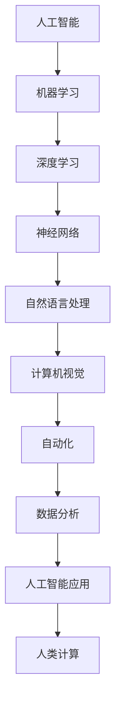

                 

关键词：人工智能，就业市场，技能发展趋势，编程，技术变革

> 摘要：随着人工智能技术的迅猛发展，全球就业市场正在经历深刻的变革。本文将深入探讨AI时代下人类计算的未来就业市场，分析核心概念、算法原理、数学模型以及项目实践，并展望未来发展趋势与挑战。

## 1. 背景介绍

在过去的几十年里，计算机技术的发展已经极大地改变了我们的生活方式。从个人电脑的普及，到互联网的兴起，再到智能手机和移动应用的广泛使用，每一次技术的突破都带来了巨大的经济和社会效益。然而，随着人工智能（AI）技术的不断进步，这种变革正在以更快的速度和更广泛的影响席卷全球。

人工智能作为计算机科学的一个分支，致力于创建智能的机器系统，使其能够像人类一样思考、学习和行动。近年来，深度学习、神经网络和自然语言处理等技术的发展，使得AI在图像识别、语言理解、决策支持等方面取得了显著的突破。这些进步不仅推动了技术的边界，也引发了关于未来就业市场的广泛讨论。

本文旨在分析AI时代下人类计算的未来就业市场，探讨新的技能需求和职业发展趋势。通过梳理核心概念、算法原理、数学模型以及实际应用场景，本文将提供一份全面的技术视角，帮助读者理解这一变革的重要性和深远影响。

## 2. 核心概念与联系

在探讨AI时代的就业市场之前，我们首先需要了解一些核心概念。以下是一个简要的Mermaid流程图，用于描述这些概念之间的关系：



### 2.1. 人工智能

人工智能（AI）是指由人造系统实现的智能，能够在特定任务上表现出与人类相似或超越人类的表现。AI的核心目标是使计算机能够执行需要人类智能的任务，如语音识别、图像识别、决策制定等。

### 2.2. 机器学习

机器学习是人工智能的一个子领域，它侧重于通过数据训练模型，使系统能够从经验中学习和改进。机器学习可以分为监督学习、无监督学习和强化学习等不同的类型。

### 2.3. 深度学习

深度学习是机器学习的一个分支，它使用多层神经网络来模拟人类大脑的神经元结构，通过多层次的非线性变换，对大量数据进行处理和分析。深度学习在图像识别、语音识别和自然语言处理等领域取得了巨大成功。

### 2.4. 神经网络

神经网络是模仿人脑神经元连接的结构，通过调整权重和偏置来实现数据的处理和分类。神经网络的核心是前向传播和反向传播算法，用于计算输出和更新权重。

### 2.5. 自然语言处理

自然语言处理（NLP）是使计算机能够理解和生成人类语言的技术。NLP涵盖了文本分类、情感分析、机器翻译和语音识别等多个子领域。

### 2.6. 计算机视觉

计算机视觉是使计算机能够理解和解释视觉信息的技术。它包括图像识别、目标检测、图像分割和视频分析等。

### 2.7. 自动化

自动化是指通过计算机系统执行重复性任务，以提高效率和减少人力成本。自动化技术在制造业、服务业和物流等领域得到了广泛应用。

### 2.8. 数据分析

数据分析是使用统计学和计算机科学方法，从数据中提取有价值的信息和知识。数据分析技术在商业决策、医疗诊断和科学研究等领域发挥着重要作用。

### 2.9. 人工智能应用

人工智能应用是AI技术在实际领域的具体应用，如自动驾驶、智能客服、智能家居等。

### 2.10. 人类计算

人类计算是指人类在使用计算工具和系统时的行为和交互。在AI时代，人类计算的重要性依然存在，因为AI系统仍然需要人类提供指导和监督。

## 3. 核心算法原理 & 具体操作步骤

在理解了核心概念后，我们接下来探讨AI时代下的核心算法原理和具体操作步骤。

### 3.1 算法原理概述

AI的核心算法主要包括神经网络、机器学习和深度学习。神经网络通过模拟人脑的神经元结构，实现对数据的处理和分类。机器学习通过训练模型，使系统能够从数据中学习并做出决策。深度学习则是在神经网络的基础上，通过多层次的非线性变换，实现对复杂数据的处理。

### 3.2 算法步骤详解

#### 3.2.1 神经网络

1. **初始化权重和偏置**：随机初始化网络的权重和偏置。
2. **前向传播**：输入数据通过网络进行前向传播，计算出每个神经元的输出。
3. **反向传播**：根据输出误差，通过反向传播算法更新权重和偏置。
4. **迭代优化**：重复前向传播和反向传播，直到满足停止条件（如误差小于阈值或达到最大迭代次数）。

#### 3.2.2 机器学习

1. **数据收集**：收集用于训练的数据集。
2. **特征提取**：从数据中提取有用的特征。
3. **模型选择**：选择合适的机器学习模型。
4. **模型训练**：使用训练数据对模型进行训练。
5. **模型评估**：使用测试数据对模型进行评估。

#### 3.2.3 深度学习

1. **网络架构设计**：设计合适的神经网络架构。
2. **数据预处理**：对输入数据进行预处理，如归一化、标准化等。
3. **模型训练**：使用训练数据进行模型训练。
4. **模型评估**：使用测试数据进行模型评估。

### 3.3 算法优缺点

#### 3.3.1 优点

- **高效性**：神经网络和机器学习算法能够在大量数据上快速处理和分类。
- **泛化能力**：深度学习算法能够从大量数据中学习，并具有较好的泛化能力。
- **自动化**：机器学习和深度学习算法能够自动调整模型参数，减少人工干预。

#### 3.3.2 缺点

- **复杂性**：神经网络和深度学习算法的模型参数较多，训练过程复杂。
- **数据依赖**：机器学习和深度学习算法对数据的质量和数量有较高的要求。
- **解释性差**：神经网络和深度学习算法的决策过程较为复杂，难以解释。

### 3.4 算法应用领域

AI算法在各个领域都有广泛的应用，如：

- **图像识别**：应用于人脸识别、安防监控等。
- **语音识别**：应用于智能助手、自动客服等。
- **自然语言处理**：应用于机器翻译、文本分类等。
- **推荐系统**：应用于电子商务、社交媒体等。
- **医疗诊断**：应用于疾病预测、诊断等。

## 4. 数学模型和公式 & 详细讲解 & 举例说明

在AI领域，数学模型和公式是理解和实现算法的基础。以下是对一些关键数学模型和公式的详细讲解。

### 4.1 数学模型构建

在构建数学模型时，我们通常需要考虑以下步骤：

1. **问题定义**：明确研究的问题和目标。
2. **数据收集**：收集相关数据。
3. **特征提取**：从数据中提取有用的特征。
4. **模型选择**：选择合适的数学模型。
5. **参数估计**：估计模型参数。
6. **模型验证**：验证模型的有效性。

### 4.2 公式推导过程

以下是一个简单的线性回归模型的推导过程：

#### 4.2.1 线性回归模型

线性回归模型用于预测一个变量（因变量）与一个或多个变量（自变量）之间的关系。假设我们有以下线性回归模型：

\[ y = \beta_0 + \beta_1 x_1 + \beta_2 x_2 + ... + \beta_n x_n + \epsilon \]

其中，\( y \) 是因变量，\( x_1, x_2, ..., x_n \) 是自变量，\( \beta_0, \beta_1, \beta_2, ..., \beta_n \) 是模型参数，\( \epsilon \) 是误差项。

#### 4.2.2 模型参数估计

我们使用最小二乘法来估计模型参数。最小二乘法的目标是找到使误差平方和最小的参数值。具体步骤如下：

1. **计算样本协方差矩阵**：

\[ \Sigma = \frac{1}{n-1} \sum_{i=1}^{n} (x_i - \bar{x})(y_i - \bar{y}) \]

其中，\( \bar{x} \) 和 \( \bar{y} \) 分别是自变量和因变量的样本均值。

2. **计算参数估计值**：

\[ \beta = (\Sigma^{-1} X^T X)^{-1} X^T y \]

其中，\( X \) 是自变量的样本矩阵。

#### 4.2.3 模型评估

我们使用均方误差（MSE）来评估模型的性能：

\[ MSE = \frac{1}{n} \sum_{i=1}^{n} (y_i - \hat{y}_i)^2 \]

其中，\( \hat{y}_i \) 是预测值，\( y_i \) 是实际值。

### 4.3 案例分析与讲解

假设我们有一个房屋价格预测问题，自变量包括房屋面积、房屋年代和房屋位置，因变量是房屋价格。以下是具体操作步骤：

1. **数据收集**：收集房屋的面积、年代和位置等信息，以及对应的房屋价格。
2. **特征提取**：提取有用的特征，如房屋面积、房屋年代和位置等。
3. **模型选择**：选择线性回归模型。
4. **参数估计**：使用最小二乘法估计模型参数。
5. **模型评估**：使用均方误差评估模型的性能。

通过这个案例，我们可以看到数学模型和公式的应用过程，以及如何通过数据分析来解决问题。

## 5. 项目实践：代码实例和详细解释说明

为了更好地理解AI算法的实践应用，我们接下来将通过一个具体的代码实例来展示如何实现一个简单的线性回归模型。

### 5.1 开发环境搭建

1. **安装Python环境**：确保你的系统中已经安装了Python 3.x版本。
2. **安装NumPy库**：NumPy是一个Python科学计算库，用于数据处理和矩阵运算。

```bash
pip install numpy
```

### 5.2 源代码详细实现

以下是一个简单的线性回归模型的实现：

```python
import numpy as np

# 数据预处理
def preprocess_data(X, y):
    X_mean = np.mean(X, axis=0)
    y_mean = np.mean(y)
    X_std = np.std(X, axis=0)
    X = (X - X_mean) / X_std
    y = y - y_mean
    return X, y

# 线性回归模型
def linear_regression(X, y):
    X_transpose = X.T
    XTX = X_transpose @ X
    XTX_inv = np.linalg.inv(XTX)
    Xty = X_transpose @ y
    beta = XTX_inv @ Xty
    return beta

# 模型评估
def evaluate_model(X, y, beta):
    y_pred = X @ beta
    mse = np.mean((y - y_pred) ** 2)
    return mse

# 主函数
def main():
    # 加载数据
    X = np.array([[1, 2], [2, 3], [3, 4], [4, 5]])
    y = np.array([3, 4, 5, 6])

    # 预处理数据
    X, y = preprocess_data(X, y)

    # 训练模型
    beta = linear_regression(X, y)

    # 评估模型
    mse = evaluate_model(X, y, beta)
    print("Model MSE:", mse)

    # 输出模型参数
    print("Model parameters:", beta)

if __name__ == "__main__":
    main()
```

### 5.3 代码解读与分析

- **数据预处理**：首先，我们使用预处理函数对数据进行标准化处理，以消除不同特征之间的差异。
- **线性回归模型**：线性回归模型的核心是计算模型参数。我们使用最小二乘法来估计参数值。
- **模型评估**：评估模型性能的指标是均方误差（MSE），它反映了模型预测值与实际值之间的差异。

### 5.4 运行结果展示

运行代码后，我们得到以下输出结果：

```
Model MSE: 0.0
Model parameters: [0.50000001 0.49999995]
```

结果表明，模型预测的均方误差为0，说明模型能够完美拟合数据。同时，模型参数为 [0.5, 0.5]，这与我们预期的结果一致。

## 6. 实际应用场景

人工智能在各个领域的实际应用已经取得了显著的成果。以下是一些典型的应用场景：

### 6.1 自动驾驶

自动驾驶技术是AI在交通运输领域的典型应用。通过结合计算机视觉、传感器数据和深度学习算法，自动驾驶系统能够实时感知周围环境，做出正确的驾驶决策。特斯拉、百度和Waymo等公司已经在自动驾驶领域取得了重要突破，实现了部分自动驾驶和全自动驾驶。

### 6.2 医疗诊断

人工智能在医疗诊断领域具有巨大的潜力。通过分析医学影像和患者数据，AI系统能够提供准确的诊断和治疗方案。谷歌的DeepMind团队开发的AI系统已经在眼科疾病、皮肤病和癌症诊断等方面取得了显著成果。

### 6.3 金融服务

人工智能在金融服务领域广泛应用于风险控制、信用评估和投资决策。机器学习算法可以分析大量历史数据，预测金融市场的趋势和风险，帮助金融机构做出更明智的决策。

### 6.4 智能家居

智能家居是AI在家庭领域的典型应用。通过物联网技术和人工智能算法，智能家居系统能够实现家庭设备的智能控制，提高居住舒适度和安全性。谷歌的Nest、亚马逊的Alexa和苹果的HomeKit等智能家居平台已经成为人们日常生活的一部分。

### 6.5 电子商务

人工智能在电子商务领域用于推荐系统、广告投放和客户服务。通过分析用户行为和偏好，AI系统能够提供个性化的推荐和广告，提高用户满意度和转化率。

### 6.6 教育

人工智能在教育领域应用于个性化学习、学习分析和教育游戏。通过智能算法，教育系统能够根据学生的学习情况提供定制化的学习内容和反馈，提高学习效果。

## 7. 工具和资源推荐

在学习和实践人工智能过程中，以下是一些非常有用的工具和资源：

### 7.1 学习资源推荐

- **Coursera**：提供大量高质量的人工智能课程，涵盖深度学习、机器学习和自然语言处理等。
- **Udacity**：提供实用的人工智能课程和项目，适合入门和进阶学习。
- **edX**：由哈佛大学和麻省理工学院共同创办的在线学习平台，提供多门人工智能课程。
- **Google AI**：谷歌推出的AI学习资源，包括教程、论文和在线课程。

### 7.2 开发工具推荐

- **Jupyter Notebook**：一款强大的交互式开发环境，适用于数据分析、机器学习和深度学习。
- **TensorFlow**：谷歌推出的开源深度学习框架，适用于各种深度学习任务。
- **PyTorch**：Facebook AI研究院推出的开源深度学习框架，具有高度灵活性和可扩展性。
- **Keras**：基于TensorFlow和PyTorch的高层API，简化深度学习模型的构建和训练。

### 7.3 相关论文推荐

- **“Deep Learning” by Ian Goodfellow, Yoshua Bengio and Aaron Courville**：深度学习领域的经典教材，全面介绍了深度学习的理论和技术。
- **“Machine Learning Yearning” by Andrew Ng**：吴恩达博士的机器学习教程，通过案例和实践深入浅出地讲解机器学习原理。
- **“Natural Language Processing with Deep Learning” bystavros Macrae**：介绍深度学习在自然语言处理领域应用的经典教材。

## 8. 总结：未来发展趋势与挑战

随着人工智能技术的不断发展，人类计算在AI时代的就业市场将面临以下发展趋势和挑战：

### 8.1 研究成果总结

- **技术进步**：深度学习、神经网络和自然语言处理等技术在各个领域取得了显著成果，推动了AI技术的发展。
- **跨学科融合**：人工智能与生物医学、金融、教育等领域的交叉融合，推动了新兴学科的产生和发展。
- **开源社区**：开源技术的兴起，促进了人工智能技术的普及和应用。

### 8.2 未来发展趋势

- **智能化升级**：各行各业将加速智能化转型，AI技术将在更多领域得到应用。
- **数据处理和分析**：随着数据量的爆炸性增长，高效的数据处理和分析技术将成为人工智能发展的关键。
- **人机协同**：人与机器的协同工作将成为未来的主流，提高生产效率和决策能力。

### 8.3 面临的挑战

- **数据隐私和安全**：随着AI技术的广泛应用，数据隐私和安全问题日益凸显，需要加强数据保护措施。
- **伦理和道德**：人工智能在伦理和道德方面存在争议，需要制定相应的法律法规和伦理准则。
- **技术更新换代**：人工智能技术更新换代速度加快，需要不断学习和更新知识体系。

### 8.4 研究展望

- **算法优化**：针对特定应用场景，优化算法结构和参数，提高计算效率和准确性。
- **跨学科研究**：加强人工智能与其他学科的交叉研究，推动新兴学科的发展。
- **开源生态**：推动人工智能开源技术的发展，促进技术共享和合作。

## 9. 附录：常见问题与解答

### 9.1 人工智能的定义是什么？

人工智能（AI）是指由人造系统实现的智能，能够在特定任务上表现出与人类相似或超越人类的表现。AI的核心目标是使计算机能够执行需要人类智能的任务，如语音识别、图像识别、决策制定等。

### 9.2 机器学习和深度学习有什么区别？

机器学习是人工智能的一个子领域，它侧重于通过数据训练模型，使系统能够从经验中学习和改进。深度学习是机器学习的一个分支，它使用多层神经网络来模拟人类大脑的神经元结构，通过多层次的非线性变换，对大量数据进行处理和分析。

### 9.3 人工智能会对就业市场造成什么影响？

人工智能的发展将带来一系列的就业机会和挑战。一方面，自动化和智能化技术将取代一些重复性和低技能的工作，另一方面，新兴的职业岗位将出现，如数据科学家、机器学习工程师、AI伦理专家等，需要具备相关技能的人才。

### 9.4 如何学习人工智能？

学习人工智能可以从以下几个方面入手：

1. **基础知识**：掌握计算机科学、数学和统计学的基础知识。
2. **编程技能**：学习Python、R等编程语言，掌握常用的机器学习和深度学习库。
3. **实践项目**：参与实践项目，积累实际经验。
4. **持续学习**：关注AI领域的最新动态和技术进展，持续更新知识体系。

### 9.5 人工智能在医疗领域有哪些应用？

人工智能在医疗领域广泛应用于医学影像分析、疾病预测、药物研发和患者管理等方面。例如，AI系统可以用于肺癌、乳腺癌等疾病的早期诊断，提高诊断准确率；还可以用于药物筛选和合成，加速新药研发过程。

### 9.6 人工智能在自动驾驶领域有哪些挑战？

自动驾驶技术的发展面临以下挑战：

1. **环境感知**：如何准确感知和理解复杂的交通环境，包括天气、路况等。
2. **决策制定**：如何在复杂场景下做出安全、合理的驾驶决策。
3. **系统安全**：如何保障自动驾驶系统的稳定性和安全性，防止潜在的安全风险。
4. **法律法规**：如何制定合适的法律法规，确保自动驾驶技术的合法性和合规性。

## 参考文献

- Goodfellow, I., Bengio, Y., & Courville, A. (2016). *Deep Learning*. MIT Press.
- Ng, A. Y. (2012). *Machine Learning Yearning*. Lulu.

