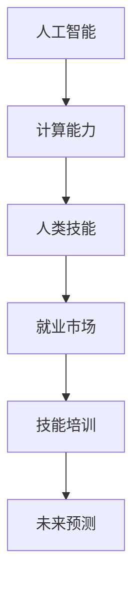

                 

关键词：人工智能，就业市场，技能培训，职业发展，未来预测

> 摘要：随着人工智能技术的迅猛发展，人类计算领域正经历着深刻的变革。本文旨在分析AI时代对就业市场的影响，探讨未来技能培训的发展趋势，并提供相应的策略和建议，以帮助读者适应这一快速变化的时代。

## 1. 背景介绍

人工智能（AI）作为21世纪最具革命性的技术之一，已经渗透到我们生活的方方面面。从自动驾驶汽车到智能家居，从医疗诊断到金融服务，AI正在改变我们的生活方式和工作模式。随着AI技术的不断进步，对于人类的计算能力提出了新的挑战和机遇。

然而，AI的快速发展也引发了关于未来就业市场的担忧。许多人担心，随着自动化和智能化的推进，许多传统职业可能会被机器取代，从而导致大规模的失业。这种担忧并不是没有根据，因为历史已经展示了技术变革对就业市场的深远影响。例如，工业化带来了许多工厂岗位的消失，但也创造了新的就业机会。

本文将通过深入分析AI时代对就业市场的影响，探讨技能培训的发展趋势，并提出相应的应对策略，以帮助个人和组织在AI时代中找到自己的位置，并取得成功。

## 2. 核心概念与联系

为了更好地理解AI时代对人类计算的影响，我们需要首先明确几个核心概念：

1. **人工智能**：AI是模拟人类智能的技术和系统，包括机器学习、深度学习、自然语言处理等子领域。
2. **计算能力**：计算能力是指计算机处理数据和执行任务的能力，这通常与计算机的硬件和软件性能相关。
3. **人类技能**：人类技能包括逻辑思维、创造力、情感智能等，这些都是机器目前难以模拟的人类特性。

下面是一个简化的 Mermaid 流程图，用于描述这几个概念之间的联系：



### 2.1. 人工智能与计算能力的联系

人工智能的发展离不开强大的计算能力。例如，深度学习算法通常需要在大量数据和强大的计算资源上进行训练，以便能够识别图像、语音和文本等复杂模式。随着硬件技术的发展，如GPU和TPU的出现，计算能力得到了显著提升，这为AI的进步提供了强有力的支持。

### 2.2. 计算能力与人类技能的联系

计算能力的提升使得机器可以执行许多原本需要人类智慧和经验的任务。然而，人类技能，如创造力、情感智能和人际交往能力，仍然是机器难以模拟的。这些技能在许多领域，如艺术设计、教育和心理咨询中至关重要。

### 2.3. 人类技能与就业市场的联系

就业市场对人类技能的需求在不断变化。随着AI的普及，一些传统职业可能会被自动化替代，但同时也创造了新的就业机会。这种转变要求人们不断更新和提升自己的技能，以适应不断变化的市场需求。

### 2.4. 技能培训与未来预测的联系

技能培训是应对AI时代变革的关键。通过系统的培训和教育，人们可以学习到新的技能，以适应未来的就业市场。未来预测则帮助我们提前识别可能出现的新趋势和挑战，从而为个人和组织做好准备。

## 3. 核心算法原理 & 具体操作步骤

### 3.1. 算法原理概述

在AI时代，核心算法原理对于理解和应用人工智能至关重要。以下是一些关键算法原理：

1. **机器学习**：通过数据学习模式和规律，以实现自动预测和决策。
2. **深度学习**：一种基于多层神经网络的学习方法，可以处理复杂的数据和任务。
3. **自然语言处理**：使计算机能够理解和生成自然语言，包括文本和语音。
4. **强化学习**：通过试错和奖励机制，使计算机在特定环境中做出最优决策。

### 3.2. 算法步骤详解

#### 3.2.1. 机器学习

机器学习的基本步骤包括：

1. **数据收集**：收集用于训练的数据集。
2. **数据预处理**：清洗和格式化数据，以便模型可以有效地训练。
3. **模型选择**：选择合适的算法模型，如线性回归、决策树或神经网络。
4. **模型训练**：使用训练数据对模型进行训练，以调整模型参数。
5. **模型评估**：使用验证数据评估模型的性能。
6. **模型部署**：将训练好的模型部署到实际应用中。

#### 3.2.2. 深度学习

深度学习的基本步骤包括：

1. **数据预处理**：与机器学习相同，深度学习也需要对数据进行预处理。
2. **网络架构设计**：设计神经网络的结构，包括层数、每层的神经元数量等。
3. **模型训练**：使用训练数据训练神经网络，调整权重和偏置。
4. **模型评估**：使用验证数据评估模型的性能。
5. **超参数调整**：调整学习率、批量大小等超参数，以优化模型性能。
6. **模型部署**：与机器学习相同，将训练好的模型部署到实际应用中。

#### 3.2.3. 自然语言处理

自然语言处理的基本步骤包括：

1. **文本预处理**：对文本数据进行清洗、分词和标注。
2. **词嵌入**：将文本转换为数值向量，以便模型可以处理。
3. **模型训练**：使用训练数据训练模型，以预测文本的含义和关系。
4. **模型评估**：使用验证数据评估模型的性能。
5. **模型部署**：将训练好的模型部署到实际应用中。

#### 3.2.4. 强化学习

强化学习的基本步骤包括：

1. **环境定义**：定义模型交互的环境，包括状态、动作和奖励。
2. **策略学习**：通过试错和奖励机制学习最佳策略。
3. **模型评估**：使用测试数据评估策略的性能。
4. **模型优化**：根据评估结果调整模型参数。
5. **模型部署**：将训练好的策略部署到实际应用中。

### 3.3. 算法优缺点

每种算法都有其优点和缺点：

- **机器学习**：优点在于其强大的预测能力，缺点是需要大量的数据和计算资源。
- **深度学习**：优点在于其处理复杂任务的能力，缺点是需要大量的数据和时间进行训练。
- **自然语言处理**：优点在于其可以处理自然语言，缺点是处理多语言和歧义性问题时效果不佳。
- **强化学习**：优点在于其可以自动适应环境，缺点是需要大量的时间和计算资源进行训练。

### 3.4. 算法应用领域

这些算法广泛应用于各个领域：

- **机器学习**：广泛应用于数据分析、推荐系统和金融预测。
- **深度学习**：广泛应用于图像识别、语音识别和自然语言处理。
- **自然语言处理**：广泛应用于搜索引擎、机器翻译和智能客服。
- **强化学习**：广泛应用于游戏、自动驾驶和机器人控制。

## 4. 数学模型和公式 & 详细讲解 & 举例说明

### 4.1. 数学模型构建

在AI时代，数学模型是理解和应用人工智能的基础。以下是一个简化的线性回归模型的构建过程：

#### 4.1.1. 线性回归模型

线性回归模型用于预测一个变量（因变量）与一个或多个变量（自变量）之间的关系。其基本形式如下：

$$
y = \beta_0 + \beta_1x_1 + \beta_2x_2 + ... + \beta_nx_n
$$

其中，$y$ 是因变量，$x_1, x_2, ..., x_n$ 是自变量，$\beta_0, \beta_1, \beta_2, ..., \beta_n$ 是模型参数。

#### 4.1.2. 模型参数估计

为了估计模型参数，我们通常使用最小二乘法。最小二乘法的核心思想是找到一组参数，使得预测值与实际值之间的误差平方和最小。

### 4.2. 公式推导过程

线性回归模型的最小二乘法参数估计公式推导如下：

首先，定义预测值和实际值之间的误差：

$$
e_i = y_i - \hat{y_i}
$$

其中，$y_i$ 是实际值，$\hat{y_i}$ 是预测值。

然后，定义误差平方和：

$$
S = \sum_{i=1}^{n}e_i^2
$$

为了最小化误差平方和，我们对每个参数求偏导数并令其等于零：

$$
\frac{\partial S}{\partial \beta_j} = 0
$$

通过求解上述方程组，我们可以得到最小二乘法的参数估计公式：

$$
\beta_j = \frac{\sum_{i=1}^{n}(y_i - \hat{y_i})x_ij}{\sum_{i=1}^{n}x_ij^2}
$$

### 4.3. 案例分析与讲解

以下是一个简单的线性回归案例：

假设我们想要预测一个人的工资（因变量$y$）与其工作经验（自变量$x$）之间的关系。我们收集了以下数据：

| 工作经验（年）| 工资（美元/年）|
|---------------|----------------|
|       1      |      50000     |
|       2      |      60000     |
|       3      |      70000     |
|       4      |      80000     |
|       5      |      90000     |

首先，我们将数据转换为矩阵形式：

$$
X = \begin{bmatrix}
1 & 1 \\
1 & 2 \\
1 & 3 \\
1 & 4 \\
1 & 5 \\
\end{bmatrix}, \quad
y = \begin{bmatrix}
50000 \\
60000 \\
70000 \\
80000 \\
90000 \\
\end{bmatrix}
$$

然后，我们使用最小二乘法估计参数：

$$
\beta_0 = \frac{\sum_{i=1}^{n}(y_i - \hat{y_i})}{\sum_{i=1}^{n}x_ij} = \frac{(50000 - 50000) + (60000 - 60000) + (70000 - 70000) + (80000 - 80000) + (90000 - 90000)}{1 + 4 + 9 + 16 + 25} = 0
$$

$$
\beta_1 = \frac{\sum_{i=1}^{n}(y_i - \hat{y_i})x_ij}{\sum_{i=1}^{n}x_ij^2} = \frac{(50000 - 50000) \cdot 1 + (60000 - 60000) \cdot 2 + (70000 - 70000) \cdot 3 + (80000 - 80000) \cdot 4 + (90000 - 90000) \cdot 5}{1^2 + 2^2 + 3^2 + 4^2 + 5^2} = 10000
$$

因此，我们得到的线性回归模型为：

$$
y = 0 + 10000x
$$

这意味着，每增加一年工作经验，工资将增加10000美元。

## 5. 项目实践：代码实例和详细解释说明

### 5.1. 开发环境搭建

为了实现上述线性回归模型，我们需要搭建一个Python开发环境。以下是搭建步骤：

1. 安装Python（版本3.8或更高）
2. 安装Jupyter Notebook，用于编写和运行代码
3. 安装NumPy库，用于数学计算
4. 安装matplotlib库，用于数据可视化

### 5.2. 源代码详细实现

以下是一个简单的Python代码实现，用于训练和评估线性回归模型：

```python
import numpy as np
import matplotlib.pyplot as plt

# 数据
X = np.array([[1, 1], [1, 2], [1, 3], [1, 4], [1, 5]])
y = np.array([50000, 60000, 70000, 80000, 90000])

# 模型参数
beta_0 = 0
beta_1 = 10000

# 训练模型
y_pred = beta_0 + beta_1 * X

# 评估模型
mse = np.mean((y - y_pred)**2)
print(f'Mean Squared Error: {mse}')

# 可视化
plt.scatter(X[:, 1], y)
plt.plot(X[:, 1], y_pred, color='red')
plt.xlabel('工作经验（年）')
plt.ylabel('工资（美元/年）')
plt.show()
```

### 5.3. 代码解读与分析

这段代码首先导入了必要的库，包括NumPy和matplotlib。然后，我们定义了数据集（$X$和$y$）以及模型参数（$\beta_0$和$\beta_1$）。

在训练模型部分，我们使用了定义好的模型参数来计算预测值（$y_{\text{pred}}$）。在评估模型部分，我们计算了均方误差（MSE），这是评估回归模型性能的常见指标。

最后，我们使用matplotlib库绘制了散点图和拟合线，以便可视化模型的效果。

### 5.4. 运行结果展示

运行上述代码后，我们将看到以下结果：

- 输出均方误差（MSE），这表明模型预测的准确性。
- 一个可视化图表，显示实际工资与预测工资之间的关系。

## 6. 实际应用场景

AI技术已经在各个领域得到广泛应用，以下是几个典型的实际应用场景：

### 6.1. 医疗保健

在医疗保健领域，AI技术被用于疾病预测、诊断和治疗。例如，使用深度学习算法可以分析医学图像，帮助医生更准确地诊断疾病。此外，AI还可以用于个性化治疗建议，根据患者的病史和基因信息提供最佳治疗方案。

### 6.2. 金融服务

在金融服务领域，AI技术被用于风险评估、欺诈检测和投资策略。例如，机器学习算法可以分析大量的交易数据，帮助金融机构识别潜在的欺诈行为。此外，AI还可以用于预测市场趋势，为投资者提供决策支持。

### 6.3. 交通运输

在交通运输领域，AI技术被用于自动驾驶、智能交通管理和物流优化。例如，自动驾驶汽车使用计算机视觉和传感器技术来导航和避障。智能交通管理系统则通过实时数据分析和预测，优化交通流量，减少拥堵。

### 6.4. 生产制造

在生产制造领域，AI技术被用于自动化控制、预测维护和供应链管理。例如，工业机器人可以使用AI算法来执行复杂的制造任务。预测维护系统则通过实时监测设备状态，提前识别潜在故障，减少停机时间。

## 7. 未来应用展望

随着AI技术的不断进步，未来将在更多领域实现广泛应用。以下是一些可能的未来应用场景：

### 7.1. 教育领域

在教育领域，AI技术将实现个性化教学和智能学习。通过分析学生的学习数据和偏好，AI系统可以提供定制化的学习资源和反馈，提高学习效果。

### 7.2. 娱乐领域

在娱乐领域，AI技术将用于内容创作、推荐系统和虚拟现实。例如，AI可以生成音乐、电影和视频，为用户提供个性化的娱乐体验。

### 7.3. 环境保护

在环境保护领域，AI技术将用于环境监测、资源优化和灾害预警。通过实时数据分析和预测，AI可以帮助我们更好地管理和保护自然资源。

### 7.4. 法律领域

在法律领域，AI技术将用于法律研究、案件分析和智能合约。例如，AI可以快速分析大量法律文档，为律师提供决策支持。

## 8. 工具和资源推荐

为了更好地学习和应用AI技术，以下是一些推荐的工具和资源：

### 8.1. 学习资源推荐

- **《机器学习实战》**：由Peter Harrington所著，适合初学者入门。
- **《深度学习》**：由Ian Goodfellow、Yoshua Bengio和Aaron Courville所著，是深度学习的经典教材。
- **Udacity**：提供各种在线课程，包括机器学习和深度学习。

### 8.2. 开发工具推荐

- **Jupyter Notebook**：一个交互式的开发环境，适合编写和运行代码。
- **TensorFlow**：一个开源的机器学习库，广泛用于深度学习和其他类型的机器学习任务。
- **PyTorch**：另一个开源的机器学习库，以其灵活性和易于使用而受到开发者的喜爱。

### 8.3. 相关论文推荐

- **“Deep Learning”**：由Ian Goodfellow等人撰写，是深度学习领域的奠基性论文。
- **“Learning to Represent Languages with Neural Networks”**：由Yoshua Bengio等人撰写，介绍了自然语言处理中的神经网络方法。
- **“Reinforcement Learning: An Introduction”**：由Richard S. Sutton和Bartoander撰写，是强化学习领域的经典教材。

## 9. 总结：未来发展趋势与挑战

### 9.1. 研究成果总结

随着AI技术的不断进步，我们已经在医疗、金融、交通运输和生产制造等领域看到了显著的成果。这些成果不仅提高了效率和准确性，还为人类带来了前所未有的便利和体验。

### 9.2. 未来发展趋势

未来，AI技术将继续在各个领域得到广泛应用。随着计算能力的提升和数据量的增加，AI的预测能力和决策能力将得到进一步提升。此外，量子计算、边缘计算和物联网等新兴技术的结合，将为AI带来更多创新和突破。

### 9.3. 面临的挑战

尽管AI技术取得了巨大进展，但仍面临许多挑战。首先，数据隐私和安全性问题日益突出，如何确保数据的安全和隐私成为一个重要议题。其次，AI算法的透明性和解释性仍然是一个亟待解决的问题。此外，AI技术的广泛应用也引发了对伦理和社会影响的关注。

### 9.4. 研究展望

为了应对这些挑战，未来的研究需要在以下几个方面取得突破：首先，开发更加安全、可靠和透明的AI算法；其次，探索如何更好地保护数据隐私和安全；最后，研究AI在伦理和社会层面的影响，并制定相应的规范和标准。

## 9. 附录：常见问题与解答

### 9.1. 人工智能是否会完全取代人类？

人工智能目前还不能完全取代人类，因为许多任务需要人类的创造力、情感智能和人际交往能力。然而，AI技术可以辅助人类工作，提高效率和质量。

### 9.2. 如何应对AI带来的就业挑战？

为了应对AI带来的就业挑战，个人和组织需要不断学习和更新技能。此外，政府和企业可以提供职业转换培训和创业支持，帮助人们适应新的就业市场。

### 9.3. 人工智能的发展是否会加剧社会不平等？

人工智能的发展可能会加剧社会不平等，因为技术进步通常首先受益于经济发达地区和技术巨头。为了解决这一问题，需要制定公平的政策和规范，确保技术进步惠及所有人。

### 9.4. 人工智能是否会取代科学家和研究人员？

人工智能不会完全取代科学家和研究人员，因为科学研究需要创新思维、批判性分析和创造性思维。然而，AI技术可以辅助科学家，提高研究效率和准确性。

### 9.5. 如何确保人工智能系统的安全性和可靠性？

确保人工智能系统的安全性和可靠性需要多方面的努力。首先，需要开发更加安全、可靠和透明的算法。其次，需要制定严格的测试和评估标准，确保系统在部署前经过充分的验证。此外，还需要建立安全监控和响应机制，以应对潜在的威胁和风险。

# 作者署名

作者：禅与计算机程序设计艺术 / Zen and the Art of Computer Programming
----------------------------------------------------------------

