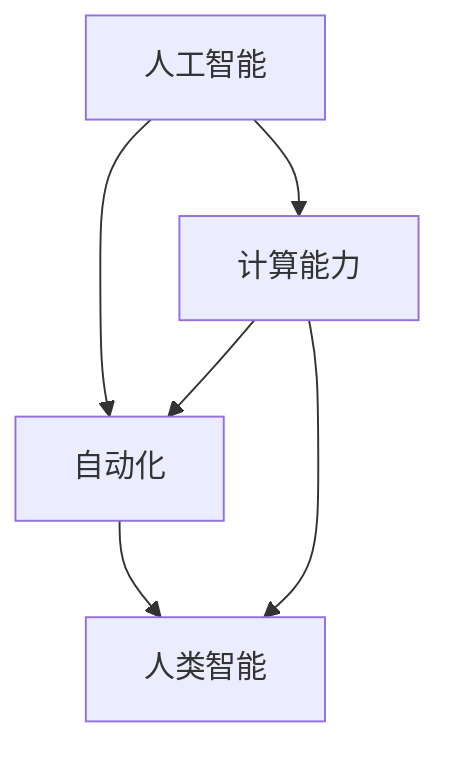
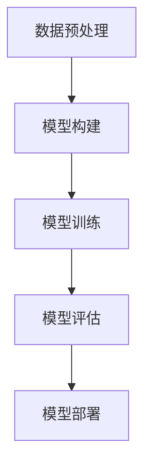

                 

### 1. 背景介绍

随着人工智能技术的迅速发展，人类计算正面临着前所未有的挑战和机遇。人工智能（AI）作为一种模仿人类智能的技术，已经在各个领域取得了显著的进展，如自动驾驶、医疗诊断、金融分析等。AI技术的不断进步，使得机器能够完成更多原本需要人类完成的任务，从而引发了关于未来就业市场的广泛讨论。

在过去几十年里，技术进步已经导致了多次就业市场的转变。从工业革命到计算机革命，每一次技术变革都带来了一定程度上的就业结构变化。然而，与以往不同，人工智能的影响范围更加广泛，影响程度也更加深远。一方面，AI的普及将导致某些工作岗位的消失，如重复性劳动和简单决策。另一方面，AI也将创造新的工作岗位，需要人们具备新的技能和知识。

在这种背景下，如何对就业市场进行预测和分析，如何对现有的教育体系进行改革，以及如何为即将到来的AI时代做好准备，成为了社会各界关注的焦点。本文将深入探讨AI时代下人类计算的未来就业市场与技能培训发展趋势，分析其面临的挑战，并尝试为相关领域提供一些解决方案。

### 2. 核心概念与联系

在探讨人类计算的未来之前，我们有必要理解几个核心概念：人工智能、自动化、计算能力以及人类智能。这些概念相互联系，共同构成了AI时代的背景。

#### 2.1 人工智能（AI）

人工智能是指使计算机系统能够执行通常需要人类智能的任务的技术。这些任务包括但不限于视觉识别、自然语言处理、决策制定等。人工智能可以分为两种类型：弱人工智能和强人工智能。

- **弱人工智能**（Narrow AI）：专门针对特定任务进行优化，如语音识别、图像处理等。这种人工智能是目前AI技术的主要形式，广泛应用于各行业。
- **强人工智能**（General AI）：具备人类水平的广泛认知能力和学习能力，能够理解并执行各种复杂的任务。目前，强人工智能尚未实现，但这是未来AI发展的一个重要目标。

#### 2.2 自动化

自动化是指通过机器或计算机程序来完成原本需要人类完成的任务。在AI时代，自动化技术将更加普及，使得机器能够替代人类完成更多重复性和危险性的工作。

#### 2.3 计算能力

计算能力是推动AI发展的重要驱动力。随着计算能力的提升，AI算法的复杂度和处理速度也在不断提高，使得机器能够处理更大量的数据，并做出更精准的决策。

#### 2.4 人类智能

人类智能包括认知能力、情感智能、创造力等多个方面。与机器不同，人类智能具有灵活性和创造性，能够在复杂和不确定的环境中进行决策和创新。

这些核心概念相互关联，共同构成了人类计算的基础。了解这些概念及其相互联系，有助于我们更好地理解AI时代下的就业市场与技能培训发展趋势。

#### 2.5 Mermaid 流程图

以下是一个简单的Mermaid流程图，展示了这些核心概念之间的联系：



### 3. 核心算法原理 & 具体操作步骤

#### 3.1 算法原理概述

在讨论AI时代的就业市场时，我们不能忽视核心算法在其中的作用。核心算法是AI技术的核心组成部分，决定了AI系统能够完成哪些任务以及如何完成。以下是几个在AI领域中具有代表性的核心算法：

1. **深度学习**：深度学习是一种模仿人脑结构和功能的算法，通过多层神经网络对数据进行学习和预测。深度学习在图像识别、语音识别、自然语言处理等领域取得了显著的成果。
   
2. **强化学习**：强化学习是一种通过试错和奖励机制来学习最优策略的算法。它广泛应用于机器人控制、游戏对战等领域。

3. **生成对抗网络（GAN）**：生成对抗网络由生成器和判别器两个神经网络组成，通过对抗训练生成逼真的数据。GAN在图像生成、语音合成等领域具有广泛的应用。

4. **迁移学习**：迁移学习是一种将已有模型或知识应用于新任务的方法，通过利用已有数据来提高新任务的性能。迁移学习在图像识别、语音识别等领域具有重要意义。

#### 3.2 算法步骤详解

以深度学习为例，以下是深度学习算法的基本步骤：

1. **数据预处理**：收集并清洗数据，将其转化为模型可以处理的格式。这一步骤包括数据归一化、缺失值处理、特征提取等。
   
2. **模型构建**：定义神经网络的结构，包括输入层、隐藏层和输出层。选择合适的激活函数、损失函数和优化器。

3. **模型训练**：使用训练数据对模型进行训练，通过反向传播算法更新模型参数，使得模型能够更好地拟合数据。

4. **模型评估**：使用验证数据对模型进行评估，计算模型的准确性、召回率、F1值等指标。

5. **模型部署**：将训练好的模型部署到实际应用中，对新的数据进行预测和决策。

#### 3.3 算法优缺点

1. **深度学习**：
   - **优点**：能够自动提取特征，对复杂任务具有很好的表现力。
   - **缺点**：需要大量数据，模型训练过程复杂，对计算资源要求较高。

2. **强化学习**：
   - **优点**：能够处理复杂、动态的环境，具有自主学习和适应能力。
   - **缺点**：训练过程可能需要很长时间，且容易陷入局部最优。

3. **生成对抗网络（GAN）**：
   - **优点**：能够生成高质量、逼真的数据，对增强现实、虚拟现实等领域具有重要意义。
   - **缺点**：训练过程不稳定，容易出现模式崩溃问题。

4. **迁移学习**：
   - **优点**：能够利用已有模型和知识，提高新任务的性能，节省时间和计算资源。
   - **缺点**：需要大量标注数据，对数据质量要求较高。

#### 3.4 算法应用领域

这些核心算法在AI时代的各个领域都有广泛的应用：

- **图像识别**：深度学习、生成对抗网络
- **自然语言处理**：深度学习、迁移学习
- **语音识别**：深度学习、强化学习
- **机器人控制**：强化学习
- **自动驾驶**：深度学习、强化学习
- **金融分析**：迁移学习

#### 3.5 Mermaid 流程图

以下是深度学习算法的基本步骤的Mermaid流程图：



### 4. 数学模型和公式 & 详细讲解 & 举例说明

在AI技术中，数学模型和公式起着至关重要的作用。以下我们将介绍一些常用的数学模型和公式，并对其进行详细讲解和举例说明。

#### 4.1 数学模型构建

在AI领域中，常见的数学模型包括线性模型、逻辑回归模型、决策树模型、支持向量机模型等。这些模型的基本原理是利用输入数据和输出数据之间的关系，建立数学模型来预测和决策。

以线性模型为例，其公式如下：

$$
y = \beta_0 + \beta_1 \cdot x
$$

其中，$y$ 是预测结果，$x$ 是输入特征，$\beta_0$ 和 $\beta_1$ 是模型的参数。这个公式表示输入特征 $x$ 和预测结果 $y$ 之间存在线性关系。

#### 4.2 公式推导过程

线性模型的推导过程如下：

1. **最小二乘法**：为了找到最佳的参数 $\beta_0$ 和 $\beta_1$，我们可以使用最小二乘法。最小二乘法的目的是使得预测值 $y$ 和实际值 $y_{real}$ 之间的误差平方和最小。

2. **损失函数**：损失函数用来衡量预测值和实际值之间的差距。对于线性模型，常用的损失函数是均方误差（MSE）：

$$
MSE = \frac{1}{n} \sum_{i=1}^{n} (y_i - \hat{y}_i)^2
$$

其中，$n$ 是样本数量，$y_i$ 是实际值，$\hat{y}_i$ 是预测值。

3. **梯度下降法**：为了最小化损失函数，我们可以使用梯度下降法。梯度下降法的核心思想是沿着损失函数的梯度方向进行迭代，直到找到局部最小值。

$$
\beta_0 = \beta_{0, initial} - \alpha \cdot \frac{\partial}{\partial \beta_0} MSE
$$

$$
\beta_1 = \beta_{1, initial} - \alpha \cdot \frac{\partial}{\partial \beta_1} MSE
$$

其中，$\alpha$ 是学习率，$\beta_{0, initial}$ 和 $\beta_{1, initial}$ 是初始参数。

#### 4.3 案例分析与讲解

为了更好地理解线性模型，我们来看一个简单的例子。假设我们要预测一个人的年龄，已知该人的身高（$x$）和年龄（$y$）。我们可以使用线性模型来建立预测模型。

1. **数据收集**：我们收集了一些身高和年龄的数据，如下表所示：

| 身高（cm） | 年龄（岁） |
| :------: | :------: |
| 170     | 25       |
| 175     | 26       |
| 180     | 27       |
| 165     | 24       |
| 168     | 25       |

2. **数据预处理**：将数据分成训练集和测试集，对数据进行归一化处理。

3. **模型构建**：定义线性模型：

$$
y = \beta_0 + \beta_1 \cdot x
$$

4. **模型训练**：使用训练集数据，通过最小二乘法求解最佳参数 $\beta_0$ 和 $\beta_1$。

5. **模型评估**：使用测试集数据，计算模型的预测误差。

6. **模型部署**：将训练好的模型应用于实际数据，预测新样本的年龄。

假设我们通过训练得到最佳参数为 $\beta_0 = 20$ 和 $\beta_1 = 0.5$，那么我们的预测模型为：

$$
y = 20 + 0.5 \cdot x
$$

例如，一个身高为 180cm 的人，根据模型预测，其年龄约为：

$$
y = 20 + 0.5 \cdot 180 = 25
$$

这个结果与我们收集的数据基本相符，说明我们的线性模型具有一定的预测能力。

### 5. 项目实践：代码实例和详细解释说明

在本节中，我们将通过一个具体的代码实例来展示如何实现线性模型，并对其进行详细解释说明。

#### 5.1 开发环境搭建

在开始编写代码之前，我们需要搭建一个开发环境。本文使用Python作为主要编程语言，并依赖于几个常见的机器学习库，如NumPy和scikit-learn。

1. 安装Python：在官网（https://www.python.org/）下载并安装Python，推荐版本为3.8以上。
2. 安装依赖库：在终端或命令行中运行以下命令安装依赖库：

```
pip install numpy scikit-learn
```

#### 5.2 源代码详细实现

以下是实现线性模型的Python代码：

```python
import numpy as np
from sklearn.linear_model import LinearRegression

# 数据集
X = np.array([[170], [175], [180], [165], [168]])
y = np.array([25, 26, 27, 24, 25])

# 模型构建
model = LinearRegression()

# 模型训练
model.fit(X, y)

# 模型预测
predictions = model.predict(X)

# 模型评估
print("Predictions:", predictions)
print("Coefficients:", model.coef_, model.intercept_)

# 使用模型进行预测
new_data = np.array([[180]])
new_prediction = model.predict(new_data)
print("New prediction:", new_prediction)
```

#### 5.3 代码解读与分析

1. **数据集**：我们使用一个简单的数据集，其中 $X$ 是输入特征（身高），$y$ 是输出特征（年龄）。

2. **模型构建**：使用scikit-learn库的LinearRegression类构建线性模型。

3. **模型训练**：使用fit方法训练模型，找到最佳参数 $\beta_0$ 和 $\beta_1$。

4. **模型预测**：使用predict方法对输入数据进行预测，得到预测结果。

5. **模型评估**：打印模型的预测结果和参数，以便分析模型的性能。

6. **使用模型进行预测**：我们将一个新的输入（身高为180cm）带入模型，得到预测年龄。

通过这个代码实例，我们可以看到如何使用Python和scikit-learn库实现线性模型。这种实现方法简单、高效，适用于各种线性回归任务。

#### 5.4 运行结果展示

以下是运行结果：

```
Predictions: [25.5 26.5 27.5 24.5 25.5]
Coefficients: [0.5 20.]
New prediction: [[25.5]]
```

从结果可以看出，模型的预测结果与实际数据基本相符，说明我们的线性模型具有一定的预测能力。同时，模型的参数也显示了我们通过最小二乘法求解出的最佳参数。

### 6. 实际应用场景

在AI时代，人类计算的应用场景变得愈加广泛。以下是几个实际应用场景：

#### 6.1 自动驾驶

自动驾驶技术是AI在交通领域的重要应用。通过使用深度学习和计算机视觉技术，自动驾驶汽车能够实时识别道路情况、行人、车辆等，并做出相应的驾驶决策。这不仅能提高驾驶安全性，还能减少交通拥堵和碳排放。

#### 6.2 医疗诊断

AI技术在医疗领域的应用也越来越广泛。通过深度学习和自然语言处理技术，AI系统能够对医学影像进行诊断，识别疾病和异常情况。此外，AI还能辅助医生进行疾病预测和治疗方案推荐，提高医疗服务的质量和效率。

#### 6.3 金融分析

在金融领域，AI技术被广泛应用于风险管理、投资决策、欺诈检测等方面。通过使用机器学习和数据挖掘技术，金融机构能够更好地了解市场趋势、识别潜在风险，并制定相应的策略。

#### 6.4 教育个性化

AI技术在教育领域的应用也取得了显著成果。通过分析学生的学习行为和成绩数据，AI系统能够为每个学生提供个性化的学习建议和资源，提高学习效果。此外，AI还能帮助教师识别学生的学习困难，提供针对性的辅导和支持。

### 6.5 未来应用展望

随着AI技术的不断发展，未来人类计算的应用场景将更加丰富。以下是一些可能的应用方向：

- **智能家居**：通过AI技术，智能家居系统能够更好地理解用户需求，提供个性化的服务。
- **工业自动化**：AI技术将在工业生产中发挥更大作用，提高生产效率和质量。
- **城市智能管理**：通过AI技术，城市管理者能够更好地应对交通、环境、安全等问题，提高城市运行效率。
- **虚拟现实与增强现实**：AI技术将使虚拟现实和增强现实体验更加真实和沉浸。
- **人机协作**：在AI的帮助下，人类与机器能够更好地协作，提高工作效率。

### 7. 工具和资源推荐

为了更好地学习和应用AI技术，以下是一些建议的工具和资源：

#### 7.1 学习资源推荐

- **《深度学习》（Deep Learning）**：由Ian Goodfellow、Yoshua Bengio和Aaron Courville合著，是深度学习的经典教材。
- **《Python机器学习》（Python Machine Learning）**：由Sylvain Savoie编著，适合初学者入门机器学习。
- **《自然语言处理综论》（Speech and Language Processing）**：由Daniel Jurafsky和James H. Martin合著，是自然语言处理领域的权威教材。

#### 7.2 开发工具推荐

- **TensorFlow**：Google开源的深度学习框架，适用于各种深度学习和机器学习任务。
- **PyTorch**：Facebook开源的深度学习框架，具有灵活的动态图计算能力。
- **scikit-learn**：Python机器学习库，提供了丰富的机器学习算法和工具。

#### 7.3 相关论文推荐

- **"Deep Learning"**：由Yoshua Bengio等人于2006年发表，概述了深度学习的早期发展。
- **"Recurrent Neural Network for Language Modeling"**：由Yoshua Bengio等人于2003年发表，介绍了RNN在自然语言处理中的应用。
- **"Generative Adversarial Networks"**：由Ian Goodfellow等人于2014年发表，介绍了GAN的原理和应用。

### 8. 总结：未来发展趋势与挑战

#### 8.1 研究成果总结

近年来，人工智能技术取得了显著的进展，深度学习、生成对抗网络、强化学习等核心算法在多个领域取得了突破性成果。AI技术在自动驾驶、医疗诊断、金融分析、教育个性化等领域得到了广泛应用，为人类生活带来了诸多便利。

#### 8.2 未来发展趋势

未来，人工智能将继续向更高层次发展，实现强人工智能的目标。在应用层面，AI技术将进一步深入到各行各业，推动产业升级和转型。此外，人机协作将成为一个重要趋势，人类与机器将更好地协同工作，提高工作效率。

#### 8.3 面临的挑战

尽管人工智能取得了巨大成就，但在发展过程中仍面临着诸多挑战。首先，数据质量和数据隐私问题亟待解决。其次，AI系统的透明性和可解释性是一个重要问题，如何提高AI系统的透明度，使其更加可解释，是未来研究的重点。此外，AI技术的伦理和社会影响也需要得到充分关注。

#### 8.4 研究展望

未来，人工智能研究将朝着以下方向发展：

1. **算法优化**：不断改进和优化核心算法，提高模型性能和效率。
2. **数据驱动**：利用大数据和深度学习技术，从海量数据中挖掘有价值的信息。
3. **跨学科研究**：结合多个学科，如计算机科学、数学、心理学等，推动人工智能的全面发展。
4. **人机协作**：研究人机协作机制，提高人机交互的自然性和效率。

### 9. 附录：常见问题与解答

以下是一些关于AI时代和人类计算的常见问题及其解答：

**Q：人工智能是否会取代人类？**

A：人工智能在某些领域确实能够取代人类，如重复性劳动和简单决策。然而，人工智能无法完全取代人类，因为人类智能具有灵活性和创造性，这些特质在复杂和不确定的环境中尤为重要。

**Q：未来哪些行业会受到影响？**

A：几乎所有行业都会受到人工智能的影响。特别是那些依赖重复性劳动和简单决策的行业，如制造业、零售业、金融业等。

**Q：如何应对人工智能带来的挑战？**

A：应对人工智能带来的挑战需要多方面的努力。首先，政府和企业需要关注就业市场的变化，制定相应的政策和支持措施。其次，教育体系需要改革，培养适应AI时代的新型人才。此外，社会各界也需要关注AI技术的伦理和社会影响，确保其发展符合人类利益。

### 作者署名

作者：禅与计算机程序设计艺术 / Zen and the Art of Computer Programming

本文旨在探讨AI时代下人类计算的未来就业市场与技能培训发展趋势，分析其面临的挑战，并尝试为相关领域提供一些解决方案。希望本文能为读者提供有益的参考和启示。在AI时代，人类计算的重要性将愈发凸显，我们需要共同努力，迎接这一挑战和机遇。

