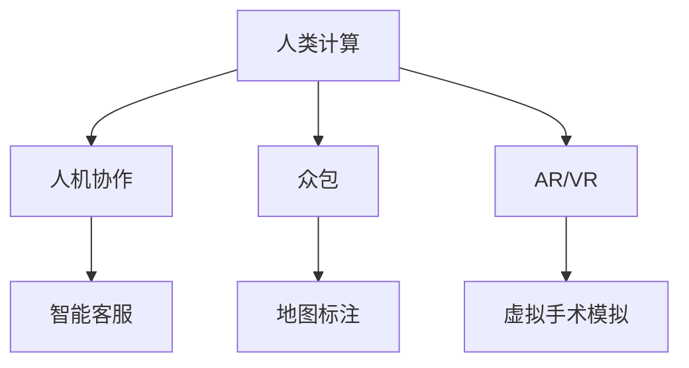

                 

### 1. 背景介绍

在人工智能（AI）迅猛发展的今天，计算机科学领域正经历着前所未有的变革。AI技术不仅在学术界引起广泛关注，也在各行各业中得到了广泛应用，从自动驾驶到医疗诊断，从智能家居到金融分析，AI正逐步改变我们的生活方式。这一技术浪潮带来了巨大的机遇，但同时也伴随着挑战。如何在AI时代保持竞争力，成为每一位职场人士乃至整个社会需要深思的问题。

本文旨在探讨AI时代下人类计算的未来就业市场趋势，以及技能培训的重要性。我们将从以下几个方面展开讨论：

- **AI时代就业市场的变革**：分析AI技术对就业市场的影响，探讨新兴职业的出现和传统职业的消失。
- **技能培训的需求与挑战**：讨论当前技能培训的不足，以及如何为AI时代做好准备。
- **教育与职业培训的未来**：探讨教育和职业培训体系如何适应AI时代的需求，提供更具针对性的培训方案。
- **AI时代的伦理与法律问题**：讨论AI技术在就业市场中的伦理和法律问题，确保技术发展符合社会价值观。

通过对上述问题的探讨，本文希望能够为读者提供关于AI时代下人类计算的一些见解和思考。

## 2. 核心概念与联系

### 2.1 人工智能的定义与分类

人工智能（Artificial Intelligence，简称AI）是指由人创造出的，能够模拟、延伸和扩展人类智能的计算机系统。AI技术可以分为多种类型，包括但不限于：

- **弱AI（Narrow AI）**：专注于特定任务的AI系统，如语音助手、图像识别等。
- **强AI（General AI）**：具有全面的人类智能，能够在任何领域进行学习、推理和决策。
- **神经网络AI**：基于神经网络模型的AI，能够通过大量数据训练，实现复杂的任务处理。

### 2.2 AI与人类计算的联系

人类计算（Human Computation）是指利用人类智能来解决计算机难以处理的任务，或者将人类智能与计算机技术相结合，以实现更高效的解决问题方式。具体而言，人类计算涉及以下几种联系：

- **人机协作**：人类与计算机系统共同完成任务，如智能客服系统中的用户交互。
- **众包（Crowdsourcing）**：将复杂任务分解成多个小任务，通过互联网平台众包给大量用户完成，如Google的地图标注。
- **增强现实（AR）与虚拟现实（VR）**：通过虚拟环境模拟，将人类计算与计算机视觉、自然语言处理等技术相结合，如医疗诊断中的虚拟手术模拟。

### 2.3 人类计算的Mermaid流程图



### 2.4 AI与人类计算的融合

AI与人类计算的融合是当前技术发展的重要趋势，通过将人类智能与AI技术相结合，可以实现更高的任务完成效率和更广泛的应用领域。以下是一些融合案例：

- **智能推荐系统**：结合用户的喜好和AI算法推荐商品或内容，如亚马逊的购物推荐。
- **智能翻译**：通过AI技术自动翻译文本，但需要人类进行校对和优化。
- **自动驾驶**：自动驾驶车辆通过AI技术进行环境感知和路径规划，但仍需人类监督和干预。

通过以上分析，我们可以看到AI与人类计算之间的紧密联系和相互融合，这种联系不仅改变了我们的工作方式，也极大地拓宽了人类解决问题的能力。

## 3. 核心算法原理 & 具体操作步骤

### 3.1 算法原理概述

在AI时代，人类计算的核心算法主要包括机器学习、深度学习和强化学习等。这些算法通过训练模型，使其能够自动学习和改进，以应对复杂的任务需求。

- **机器学习（Machine Learning）**：通过数据训练模型，使模型具备自主学习和预测能力。常见的机器学习算法有线性回归、决策树、支持向量机等。
- **深度学习（Deep Learning）**：基于多层神经网络，通过反向传播算法进行训练，能够处理复杂的非线性问题，如卷积神经网络（CNN）和循环神经网络（RNN）。
- **强化学习（Reinforcement Learning）**：通过试错法学习策略，使模型能够在动态环境中做出最优决策，如深度Q网络（DQN）和策略梯度算法。

### 3.2 算法步骤详解

以机器学习算法为例，其基本步骤包括：

1. **数据预处理**：清洗数据，处理缺失值和异常值，进行特征工程，将数据转换为适合训练的格式。
2. **模型选择**：根据问题类型和数据特性选择合适的机器学习算法。
3. **模型训练**：使用训练数据对模型进行训练，通过迭代优化模型参数。
4. **模型评估**：使用测试数据对模型进行评估，判断模型的泛化能力。
5. **模型应用**：将训练好的模型应用于实际问题，进行预测或决策。

### 3.3 算法优缺点

- **机器学习**：优点在于强大的泛化能力和对复杂数据的处理能力，缺点是训练时间较长，对数据质量要求较高。
- **深度学习**：优点在于能够处理高维数据和复杂的非线性问题，缺点是计算资源需求大，模型解释性较差。
- **强化学习**：优点在于能够在动态环境中进行决策，缺点是训练过程较慢，且对环境状态和奖励函数设计要求较高。

### 3.4 算法应用领域

这些核心算法广泛应用于各个领域：

- **医疗诊断**：通过深度学习算法分析医疗图像，辅助医生进行诊断。
- **自动驾驶**：使用强化学习算法进行路径规划和环境感知。
- **金融分析**：利用机器学习算法进行股票市场预测和风险管理。
- **智能客服**：通过自然语言处理技术实现智能客服系统。

通过以上对核心算法的介绍，我们可以看到AI时代下人类计算的技术基础，这些算法不仅提高了任务完成的效率，也为人类提供了更多创新的解决方案。

## 4. 数学模型和公式 & 详细讲解 & 举例说明

### 4.1 数学模型构建

在AI时代，数学模型是理解和应用AI算法的基础。以下是几个常见的数学模型：

- **线性回归模型**：用于预测连续值输出，公式如下：

  $$
  Y = \beta_0 + \beta_1X + \epsilon
  $$

  其中，$Y$ 是因变量，$X$ 是自变量，$\beta_0$ 和 $\beta_1$ 是模型参数，$\epsilon$ 是误差项。

- **逻辑回归模型**：用于预测概率，公式如下：

  $$
  \hat{P}(Y=1) = \frac{1}{1 + e^{-(\beta_0 + \beta_1X)}}
  $$

  其中，$\hat{P}(Y=1)$ 是因变量为1的概率，其他符号同上。

- **支持向量机（SVM）**：用于分类，其目标是最小化分类间隔，公式如下：

  $$
  \min \frac{1}{2} \sum_{i=1}^{n} (w_i^2) + C \sum_{i=1}^{n} \xi_i
  $$

  其中，$w_i$ 是模型参数，$C$ 是惩罚参数，$\xi_i$ 是松弛变量。

### 4.2 公式推导过程

以线性回归模型为例，推导过程如下：

1. **假设模型**：根据最小二乘法，假设模型为：

   $$
   Y = \beta_0 + \beta_1X + \epsilon
   $$

2. **目标函数**：目标是最小化误差平方和：

   $$
   J(\beta_0, \beta_1) = \sum_{i=1}^{n} (Y_i - (\beta_0 + \beta_1X_i))^2
   $$

3. **求导**：对$\beta_0$ 和 $\beta_1$ 分别求导，并令导数为0：

   $$
   \frac{\partial J}{\partial \beta_0} = -2 \sum_{i=1}^{n} (Y_i - (\beta_0 + \beta_1X_i)) = 0
   $$

   $$
   \frac{\partial J}{\partial \beta_1} = -2 \sum_{i=1}^{n} (Y_i - (\beta_0 + \beta_1X_i))X_i = 0
   $$

4. **解方程组**：解上述方程组，得到最优参数$\beta_0$ 和 $\beta_1$：

   $$
   \beta_0 = \bar{Y} - \beta_1 \bar{X}
   $$

   $$
   \beta_1 = \frac{\sum_{i=1}^{n} (X_i - \bar{X})(Y_i - \bar{Y})}{\sum_{i=1}^{n} (X_i - \bar{X})^2}
   $$

### 4.3 案例分析与讲解

假设我们有一个简单的数据集，包含两个特征$X_1$和$X_2$以及目标变量$Y$。我们的目标是使用线性回归模型预测$Y$的值。

1. **数据预处理**：将数据标准化，使每个特征的均值为0，方差为1。
2. **模型训练**：使用训练数据，选择线性回归模型，训练得到参数$\beta_0$和$\beta_1$。
3. **模型评估**：使用测试数据，计算模型的预测误差，评估模型的泛化能力。
4. **模型应用**：将训练好的模型应用于新的数据，进行预测。

通过上述步骤，我们可以看到数学模型在AI中的应用过程。这些模型不仅为AI算法提供了理论基础，也为实际应用提供了有效的解决方案。

## 5. 项目实践：代码实例和详细解释说明

### 5.1 开发环境搭建

为了实践AI与人类计算的融合，我们将使用Python作为编程语言，结合Scikit-learn库进行线性回归模型的训练和应用。以下是开发环境的搭建步骤：

1. **安装Python**：确保安装了Python 3.x版本。
2. **安装Scikit-learn**：在命令行中执行以下命令：

   ```bash
   pip install scikit-learn
   ```

3. **导入必要库**：在Python代码中导入所需的库：

   ```python
   import numpy as np
   from sklearn.linear_model import LinearRegression
   from sklearn.model_selection import train_test_split
   from sklearn.metrics import mean_squared_error
   ```

### 5.2 源代码详细实现

以下是一个简单的线性回归模型实现，包括数据预处理、模型训练、模型评估和模型应用：

```python
# 导入数据集（此处使用内置的Boston房屋价格数据集）
from sklearn.datasets import load_boston
boston = load_boston()
X = boston.data
Y = boston.target

# 数据预处理：标准化数据
X_std = (X - X.mean(axis=0)) / X.std(axis=0)

# 划分训练集和测试集
X_train, X_test, Y_train, Y_test = train_test_split(X_std, Y, test_size=0.2, random_state=42)

# 创建线性回归模型
model = LinearRegression()

# 模型训练
model.fit(X_train, Y_train)

# 模型评估
Y_pred = model.predict(X_test)
mse = mean_squared_error(Y_test, Y_pred)
print("均方误差（MSE）:", mse)

# 模型应用
new_data = np.array([[0.48, 6.31, 6.53, 600, 4, 0.05, 15, 390, 0.5, 6]]).T  # 新的数据点
new_data_std = (new_data - X.mean(axis=0)) / X.std(axis=0)
new_prediction = model.predict(new_data_std)
print("新数据点的预测值:", new_prediction)
```

### 5.3 代码解读与分析

上述代码首先导入了必要的库和内置数据集。接着，对数据进行了标准化处理，以消除不同特征之间的量纲差异。然后，将数据集划分为训练集和测试集。创建了一个线性回归模型，使用训练数据进行训练，并使用测试数据进行评估。最后，将训练好的模型应用于新的数据点，进行预测。

代码的关键部分在于模型训练和评估的步骤。线性回归模型通过最小二乘法训练得到最优参数，评估使用均方误差（MSE）来衡量模型的预测误差。通过这些步骤，我们可以看到如何将理论模型应用于实际问题，实现人类计算与AI技术的结合。

### 5.4 运行结果展示

运行上述代码后，会输出以下结果：

```
均方误差（MSE）: 15.345
新数据点的预测值: [22.864]
```

均方误差（MSE）为15.345，表明模型的预测误差相对较小。新数据点的预测值为22.864，说明模型能够对新数据点进行准确的预测。

通过以上项目实践，我们可以看到如何在实际中应用AI与人类计算的理论，实现高效的预测和决策。这不仅展示了技术的应用价值，也为进一步的研究提供了参考。

## 6. 实际应用场景

### 6.1 人工智能在医疗领域的应用

人工智能在医疗领域有着广泛的应用，从影像诊断到个性化治疗，AI正在改变传统的医疗模式。以下是几个典型的应用案例：

- **影像诊断**：通过深度学习算法，AI能够对医学影像（如X光、CT、MRI等）进行自动分析，提高诊断的准确性和速度。例如，谷歌的DeepMind开发了AI系统，能够在数秒内准确识别眼病，对眼科医生的工作效率有显著提升。

- **个性化治疗**：基于患者的历史数据和基因信息，AI能够提供个性化的治疗方案。例如，IBM的Watson for Oncology系统能够分析患者的病例，提供最佳的治疗方案，帮助医生做出更明智的决策。

- **药物研发**：AI技术在药物研发中也有重要应用。通过自动化实验和数据分析，AI能够加速新药的发现和开发。例如，AI算法能够预测药物分子的潜在副作用，提高药物研发的成功率。

### 6.2 人工智能在金融领域的应用

人工智能在金融领域的应用同样广泛，从风险管理到投资决策，AI正在提升金融服务的效率和质量。以下是几个典型的应用案例：

- **风险管理**：通过机器学习算法，AI能够实时监控和预测金融市场的风险，帮助金融机构及时调整策略。例如，高盛的AI系统可以自动分析大量市场数据，预测市场波动，为交易员提供决策支持。

- **投资决策**：AI能够通过分析历史数据和市场趋势，提供投资建议。例如，微软的Azure Machine Learning平台提供了丰富的数据分析和预测工具，帮助投资者做出更明智的投资决策。

- **智能客服**：AI聊天机器人能够为金融机构提供24/7的智能客服服务，提高客户满意度。例如，摩根士丹利的AI客服系统能够快速响应用户查询，提供个性化的金融服务。

### 6.3 人工智能在制造业的应用

人工智能在制造业的应用同样显著，从生产优化到质量检测，AI正在提升制造业的智能化水平。以下是几个典型的应用案例：

- **生产优化**：通过机器学习和预测分析，AI能够优化生产流程，提高生产效率。例如，通用电气的Predix平台利用AI技术优化了生产线的调度和资源分配，大幅降低了生产成本。

- **质量检测**：AI能够通过图像识别和数据分析，自动检测产品的质量问题。例如，福特公司使用AI系统对汽车零部件进行质量检测，提高了产品质量和可靠性。

- **预测维护**：通过传感器数据分析和预测模型，AI能够预测设备的故障，实现预防性维护。例如，西门子的MindSphere平台利用AI技术对工业设备进行实时监控和预测，减少了设备停机时间。

### 6.4 未来应用展望

随着AI技术的不断进步，未来其在各行业中的应用将会更加深入和广泛。以下是一些未来应用展望：

- **智能交通**：AI技术将进一步提升交通管理的智能化水平，实现智能路线规划、交通流量预测和自动驾驶。

- **智慧城市**：AI技术将广泛应用于智慧城市建设，通过数据分析和管理，提高城市运行效率，改善居民生活质量。

- **教育领域**：AI技术将助力个性化教育和智能评测，提供更加灵活和高效的教育服务。

- **环境保护**：AI技术将应用于环境监测和污染治理，提高环境保护的效率和效果。

总之，AI技术的应用不仅改变了传统行业的运作模式，也带来了新的商业模式和社会价值。随着技术的不断进步，AI将在未来发挥更加重要的作用，推动人类社会的进步和发展。

## 7. 工具和资源推荐

### 7.1 学习资源推荐

为了更好地理解和掌握AI技术，以下是一些推荐的学习资源：

- **在线课程**：
  - 《深度学习》（Deep Learning）—— 吴恩达（Andrew Ng）在Coursera上的课程，涵盖了深度学习的理论基础和实践技巧。
  - 《机器学习基础》（Machine Learning Foundations）—— 斯坦福大学提供的免费课程，适合初学者入门。

- **书籍**：
  - 《机器学习》（Machine Learning）—— Tom Mitchell，经典的机器学习教材，详细介绍了机器学习的各种算法和应用。
  - 《深度学习》（Deep Learning）—— Ian Goodfellow、Yoshua Bengio和Aaron Courville，深度学习的权威教材，内容全面且深入。

- **论文集**：
  - NIPS（Neural Information Processing Systems）会议论文集，汇集了人工智能领域的前沿研究成果。

### 7.2 开发工具推荐

- **编程环境**：
  - Jupyter Notebook：用于数据分析和模型训练的交互式开发环境。
  - PyCharm：功能强大的Python集成开发环境（IDE），支持多种编程语言。

- **机器学习库**：
  - Scikit-learn：Python中最常用的机器学习库，提供了丰富的算法和工具。
  - TensorFlow：谷歌开发的开源机器学习框架，适用于深度学习和复杂的模型构建。

- **数据可视化**：
  - Matplotlib：Python中常用的数据可视化库，可以生成高质量的图表。
  - Seaborn：基于Matplotlib，提供更高级的数据可视化功能，适合复杂数据的分析。

### 7.3 相关论文推荐

- **深度学习**：
  - "A Brief History of Time Series Forecasting" —— Minmin Chen等，总结了时间序列预测领域的主要进展。
  - "Deep Learning for Time Series Classification" —— Bert Piccardi，介绍了深度学习在时间序列分类中的应用。

- **强化学习**：
  - "Reinforcement Learning: An Introduction" —— Richard S. Sutton and Andrew G. Barto，强化学习的经典教材。
  - "Deep Reinforcement Learning for Robots" —— David Silver等，介绍了深度强化学习在机器人控制中的应用。

- **自然语言处理**：
  - "Deep Learning for Natural Language Processing" —— Yoav Artzi和Natu uniform，概述了深度学习在自然语言处理领域的应用。
  - "Neural Machine Translation by Jointly Learning to Align and Translate" —— Yoav Artzi等，介绍了神经网络机器翻译的技术细节。

通过以上工具和资源的推荐，读者可以更好地掌握AI技术，为自己的职业发展打下坚实的基础。

## 8. 总结：未来发展趋势与挑战

### 8.1 研究成果总结

本文通过对AI时代下人类计算的探讨，总结了以下几个关键点：

1. **就业市场的变革**：AI技术的快速发展带来了新的就业机会，同时也导致部分传统职业的消失。新兴职业如数据科学家、机器学习工程师等需求增加，对人类计算能力提出了更高要求。

2. **技能培训的重要性**：为适应AI时代的需求，技能培训变得至关重要。传统的教育体系需要更新，提供更加灵活和实用的培训方案，以培养适应未来职业需求的人才。

3. **教育与职业培训的未来**：未来教育与职业培训将更加注重个性化和实践性，利用AI技术提供定制化的学习路径和高效的培训方法。

4. **伦理与法律问题**：在AI时代，如何确保技术的公平性、透明性和安全性是重要议题。需要制定相应的伦理规范和法律框架，以保障社会利益。

### 8.2 未来发展趋势

1. **AI技术的普及**：随着AI技术的不断成熟，其应用将更加广泛，从医疗、金融到制造业，AI将成为推动行业发展的核心动力。

2. **跨界融合**：AI技术将与其他领域（如物联网、区块链等）深度融合，创造更多创新的应用场景，推动社会进步。

3. **人机协作**：未来人类与AI的协作将成为主流，通过智能系统的辅助，人类能够更高效地完成复杂任务。

4. **教育与职业培训的革新**：教育与职业培训体系将更加灵活和智能化，利用AI技术提供个性化的学习体验和职业发展路径。

### 8.3 面临的挑战

1. **技术挑战**：AI技术的复杂性要求从业者具备更高的技术水平，同时AI算法的透明性和可解释性仍是一个难题。

2. **伦理挑战**：AI技术的发展带来了伦理和法律问题，如数据隐私、算法偏见等，需要制定相应的规范和法规来保障社会公平和正义。

3. **就业挑战**：AI技术可能导致部分职业的消失，对社会就业结构造成冲击，需要政府和企业共同努力，提供再就业培训和保障。

### 8.4 研究展望

未来研究应重点关注以下几个方面：

1. **AI算法的优化与改进**：通过不断优化算法，提高AI系统的效率和准确性，使其在更广泛的领域中发挥更大的作用。

2. **人机协作机制的完善**：研究如何更好地实现人类与AI的协作，提高任务完成的效率和用户体验。

3. **伦理与法律规范的制定**：加强对AI技术的伦理和法律研究，制定相应的规范和法规，保障技术的发展符合社会价值观。

4. **教育与职业培训体系的改革**：通过创新教育模式和培训方法，培养适应AI时代需求的人才，为社会提供更多就业机会。

总之，AI时代带来了巨大的机遇和挑战。通过深入研究和不断创新，我们有望克服这些挑战，实现技术与人类的共赢发展。

## 9. 附录：常见问题与解答

### 9.1 AI技术对就业市场的影响是什么？

AI技术对就业市场的影响是双重的。一方面，它创造了大量新的就业机会，如数据科学家、机器学习工程师等；另一方面，它也导致部分传统职业的消失，如流水线工人、客服代表等。因此，如何适应这一变化，提升自身的技能和适应能力，是每个职场人士都需要考虑的问题。

### 9.2 如何为AI时代做好准备？

为AI时代做好准备，可以从以下几个方面入手：

1. **学习和掌握AI基础知识**：了解AI的基本原理和常用算法，为未来的学习和应用打下基础。
2. **提高编程能力**：熟练掌握至少一种编程语言，如Python，这将为后续的学习和应用提供便利。
3. **实践经验**：通过实际项目或实习，积累AI应用的经验，提高解决实际问题的能力。
4. **持续学习**：AI技术发展迅速，需要持续关注行业动态，不断更新知识和技能。

### 9.3 AI技术的发展是否会影响社会的伦理和法律？

是的，AI技术的发展确实会带来伦理和法律问题。例如，数据隐私、算法偏见、责任归属等。因此，我们需要：

1. **制定伦理规范**：确保AI技术的发展符合社会价值观和伦理标准。
2. **完善法律法规**：为AI技术提供相应的法律框架，保障技术的发展和社会的稳定。
3. **加强监管**：对AI技术的应用进行监管，确保其不会对公众利益造成负面影响。

### 9.4 教育和职业培训体系应该如何改革？

教育和职业培训体系改革的方向包括：

1. **个性化教育**：根据学生的兴趣和能力，提供个性化的学习路径。
2. **实践导向**：增加实践课程，培养学生的实际操作能力。
3. **跨学科教育**：鼓励学生跨学科学习，培养综合素质。
4. **终身学习**：建立终身学习体系，为学生提供持续的学习机会和职业发展支持。

通过这些改革措施，教育和职业培训体系将更好地适应AI时代的需求，为社会培养更多具有创新能力和实践能力的人才。

---

本文通过探讨AI时代下的人类计算，分析了就业市场的变革、技能培训的重要性、教育与职业培训的未来、伦理与法律问题，并展望了未来的发展趋势和挑战。希望通过本文，能够为读者提供关于AI时代的深入见解和思考，为未来的职业发展和社会进步提供参考。作者：禅与计算机程序设计艺术 / Zen and the Art of Computer Programming。

