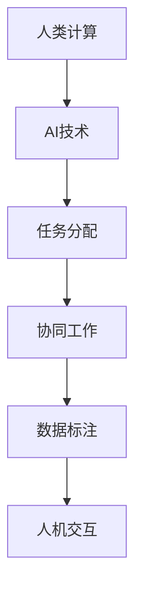

                 

关键词：人工智能、就业市场、技能培训、发展趋势、挑战、机遇、未来展望

> 摘要：随着人工智能技术的飞速发展，人类计算在AI时代的就业市场和教育培训领域正面临前所未有的变革。本文深入分析了AI时代的核心概念与联系，探讨了人类计算在AI领域的核心算法原理及具体操作步骤，通过数学模型和公式详细讲解了其应用，并以实际项目实践为例进行了代码实例和详细解释说明。同时，本文还探讨了AI时代实际应用场景，以及未来发展趋势与挑战，为读者提供了全面、系统的指导。

## 1. 背景介绍

随着计算机科学和人工智能技术的迅速发展，我们正处在一场前所未有的技术革命之中。人工智能（AI）已经渗透到我们日常生活的方方面面，从智能家居、智能医疗、自动驾驶到金融服务、娱乐和制造业，AI技术的应用越来越广泛。这一革命性的变化不仅对行业产生了深远影响，也对就业市场和教育培训领域提出了新的要求和挑战。

在就业市场方面，传统的工作岗位正面临被自动化和智能化的威胁，而新兴的AI相关岗位如数据科学家、机器学习工程师、AI产品经理等需求却日益增长。这种转变要求从业人员必须具备新的技能和知识，以适应快速变化的工作环境。同时，教育领域也必须相应调整，以满足社会对新型人才的需求。

技能培训方面，传统的教育模式和教学方法已无法满足AI时代的要求。在线教育、虚拟现实、个性化学习等新型培训方式逐渐兴起，成为培养未来人才的重要手段。此外，企业和教育机构也需要加强合作，共同构建适应AI时代的人才培养体系。

本文旨在深入分析AI时代的未来就业市场与技能培训发展趋势，探讨机遇与挑战，以期为相关从业人员、教育工作者和决策者提供有价值的参考。

## 2. 核心概念与联系

在探讨人类计算与AI的联系之前，我们首先需要了解一些核心概念。人类计算（Human Computation）是指利用人类智能完成计算机难以处理或效率不高的任务。在AI时代，人类计算与AI技术相结合，不仅提高了任务的完成效率，还拓展了人类智能的边界。

### 2.1 核心概念

- **人工智能（AI）**：人工智能是一门模拟、延伸和扩展人类智能的科学，包括机器学习、深度学习、自然语言处理、计算机视觉等多个子领域。
- **机器学习（ML）**：机器学习是AI的一个重要分支，通过数据训练模型，使计算机具备自主学习和改进能力。
- **深度学习（DL）**：深度学习是机器学习的一个子领域，通过多层神经网络模拟人类大脑的学习过程，实现复杂的模式识别和预测任务。
- **自然语言处理（NLP）**：自然语言处理是AI的一个应用领域，旨在使计算机能够理解、生成和翻译人类语言。
- **计算机视觉（CV）**：计算机视觉是AI的一个应用领域，通过图像和视频数据提取信息，实现图像识别、目标检测等任务。

### 2.2 核心概念联系

人类计算与AI技术的联系主要体现在以下几个方面：

1. **任务分配**：AI技术可以根据任务的复杂性和难度，将部分任务分配给计算机处理，而将其他任务交给人类完成。例如，AI可以通过自然语言处理技术理解用户的需求，然后引导用户完成具体的操作。
2. **协同工作**：人类计算与AI可以协同工作，共同完成任务。例如，在医疗领域，AI可以辅助医生进行诊断，而医生则根据AI的建议进行决策。
3. **数据标注**：在机器学习和深度学习领域，数据标注是训练模型的重要步骤。由于AI技术难以理解人类情感和情境，因此需要人类进行数据标注，以提高模型的准确性。
4. **人机交互**：AI技术可以通过自然语言处理和计算机视觉等技术，实现与人类的高效交互。例如，智能客服系统可以通过语音识别和自然语言处理技术，与用户进行实时对话。

### 2.3 Mermaid 流程图



通过上述核心概念和联系的分析，我们可以看出，人类计算与AI技术在许多方面是相辅相成的。在AI时代，人类计算不仅没有被取代，反而与AI技术相互促进，共同推动社会进步。

## 3. 核心算法原理 & 具体操作步骤

### 3.1 算法原理概述

在AI时代，核心算法原理是理解和应用AI技术的基础。以下我们将介绍几个关键算法的原理，包括机器学习、深度学习和自然语言处理等。

#### 3.1.1 机器学习

机器学习是一种通过数据训练模型，使计算机具备自主学习和改进能力的技术。其核心原理是基于统计学习理论，通过最大化数据的似然函数或最小化损失函数来优化模型参数。

1. **监督学习**：监督学习是一种常见的机器学习方法，通过已标记的数据训练模型，使模型能够预测新的、未标记的数据。监督学习包括线性回归、逻辑回归、决策树、随机森林和神经网络等算法。
2. **无监督学习**：无监督学习是指在没有标记数据的情况下，通过探索数据内在结构来训练模型。常见的无监督学习算法包括聚类、主成分分析（PCA）和自编码器等。
3. **半监督学习**：半监督学习结合了监督学习和无监督学习，通过利用少量标记数据和大量未标记数据来训练模型，以提高模型的泛化能力。

#### 3.1.2 深度学习

深度学习是机器学习的一个子领域，通过多层神经网络模拟人类大脑的学习过程，实现复杂的模式识别和预测任务。其核心原理是基于反向传播算法，通过梯度下降优化网络参数。

1. **卷积神经网络（CNN）**：卷积神经网络是一种专门用于处理图像数据的深度学习模型，通过卷积、池化和全连接层等结构，实现图像分类、目标检测和语义分割等任务。
2. **循环神经网络（RNN）**：循环神经网络是一种用于处理序列数据的深度学习模型，通过隐藏状态和循环连接，实现序列建模和预测。常见的RNN模型包括LSTM和GRU。
3. **生成对抗网络（GAN）**：生成对抗网络是一种通过两个对抗网络（生成器和判别器）相互竞争，实现数据生成和判别任务的深度学习模型。GAN在图像生成、语音合成和文本生成等领域有广泛应用。

#### 3.1.3 自然语言处理

自然语言处理是AI的一个应用领域，旨在使计算机能够理解、生成和翻译人类语言。其核心原理包括词向量表示、语言模型、序列标注和注意力机制等。

1. **词向量表示**：词向量表示是将自然语言中的单词映射到高维空间中的向量表示，以便计算机能够处理和计算。常见的词向量模型包括Word2Vec、GloVe和FastText。
2. **语言模型**：语言模型是一种用于预测下一个单词或词组的概率分布的模型，常见的语言模型包括n-gram模型、神经网络语言模型和Transformer模型。
3. **序列标注**：序列标注是一种将序列数据中的每个元素标注为特定类别的任务，常见的序列标注任务包括命名实体识别、情感分析和文本分类等。
4. **注意力机制**：注意力机制是一种用于处理序列数据的重要技术，通过给序列中的不同元素分配不同的权重，提高模型对关键信息的关注能力。常见的注意力机制包括全局注意力、局部注意力和自注意力。

### 3.2 算法步骤详解

以下将详细讲解机器学习、深度学习和自然语言处理等核心算法的具体操作步骤。

#### 3.2.1 机器学习

1. **数据收集与预处理**：收集用于训练的数据集，并进行数据清洗、归一化和特征提取等预处理操作。
2. **模型选择**：根据任务类型和数据特征选择合适的机器学习模型，如线性回归、决策树、神经网络等。
3. **模型训练**：通过梯度下降等优化算法，训练模型参数，使模型能够对数据进行拟合。
4. **模型评估**：使用交叉验证、准确率、召回率等指标评估模型性能，并调整模型参数以优化性能。
5. **模型部署**：将训练好的模型部署到生产环境中，实现自动化预测和决策。

#### 3.2.2 深度学习

1. **网络架构设计**：设计合适的深度学习网络架构，包括输入层、隐藏层和输出层。
2. **激活函数选择**：选择合适的激活函数，如ReLU、Sigmoid和Tanh等，以实现非线性变换。
3. **优化器选择**：选择合适的优化器，如SGD、Adam和RMSProp等，以优化网络参数。
4. **损失函数设计**：设计合适的损失函数，如均方误差、交叉熵和Hinge损失等，以衡量模型预测结果与真实值之间的差距。
5. **模型训练与调优**：通过反向传播算法，训练模型参数，并根据模型性能进行调优。

#### 3.2.3 自然语言处理

1. **数据预处理**：对自然语言数据进行分词、词性标注、去停用词等预处理操作。
2. **词向量表示**：将自然语言数据转换为词向量表示，如使用Word2Vec、GloVe和FastText等方法。
3. **语言模型训练**：使用训练数据训练语言模型，如使用n-gram模型、神经网络语言模型和Transformer模型。
4. **序列标注**：使用训练好的语言模型和序列标注算法，对输入数据进行序列标注。
5. **模型评估与调优**：使用准确率、召回率、F1分数等指标评估模型性能，并调整模型参数以优化性能。

### 3.3 算法优缺点

以下是机器学习、深度学习和自然语言处理等核心算法的优缺点：

#### 3.3.1 机器学习

- **优点**：简单易懂，适用范围广，易于实现和部署。
- **缺点**：对大量标记数据依赖，模型泛化能力有限，难以处理高维数据和复杂数据关系。

#### 3.3.2 深度学习

- **优点**：能够自动提取特征，处理高维数据和复杂数据关系，模型泛化能力强。
- **缺点**：计算复杂度高，需要大量数据和计算资源，模型难以解释和调试。

#### 3.3.3 自然语言处理

- **优点**：能够处理自然语言数据，实现文本分类、情感分析和信息提取等任务。
- **缺点**：对数据质量和标注依赖，模型难以理解人类语言语义，处理长文本和跨语言任务困难。

### 3.4 算法应用领域

以下是机器学习、深度学习和自然语言处理等核心算法在不同应用领域的应用情况：

#### 3.4.1 机器学习

- **金融领域**：用于信用评估、风险控制和金融欺诈检测等任务。
- **医疗领域**：用于医学图像诊断、疾病预测和个性化治疗等任务。
- **工业领域**：用于设备故障预测、生产优化和供应链管理等任务。

#### 3.4.2 深度学习

- **计算机视觉**：用于图像分类、目标检测和视频处理等任务。
- **自然语言处理**：用于文本分类、情感分析和机器翻译等任务。
- **语音识别**：用于语音识别、语音合成和语音助手等任务。

#### 3.4.3 自然语言处理

- **搜索引擎**：用于文本检索、相关性和排名等任务。
- **社交媒体**：用于用户行为分析、内容推荐和情感分析等任务。
- **客户服务**：用于智能客服、语义理解和对话管理等任务。

通过上述核心算法原理和具体操作步骤的分析，我们可以看出，AI时代的核心算法不仅具有广泛的应用领域，还在不断推动技术的创新和进步。对于从业人员和教育工作者来说，掌握这些核心算法的原理和操作步骤，对于应对AI时代的挑战和抓住机遇具有重要意义。

## 4. 数学模型和公式 & 详细讲解 & 举例说明

在AI时代，数学模型和公式是理解和应用AI技术的重要工具。以下我们将介绍一些常见的数学模型和公式，包括线性回归、逻辑回归、卷积神经网络（CNN）和循环神经网络（RNN）等，并通过具体例子进行详细讲解。

### 4.1 数学模型构建

#### 4.1.1 线性回归

线性回归是一种用于预测数值型目标变量的统计方法。其基本模型可以表示为：

$$
y = \beta_0 + \beta_1x + \epsilon
$$

其中，$y$ 是目标变量，$x$ 是自变量，$\beta_0$ 和 $\beta_1$ 是模型参数，$\epsilon$ 是误差项。

#### 4.1.2 逻辑回归

逻辑回归是一种用于预测概率型目标变量的统计方法。其基本模型可以表示为：

$$
\ln\left(\frac{p}{1-p}\right) = \beta_0 + \beta_1x
$$

其中，$p$ 是目标变量的概率值，$\beta_0$ 和 $\beta_1$ 是模型参数。

#### 4.1.3 卷积神经网络（CNN）

卷积神经网络是一种用于图像处理和计算机视觉的深度学习模型。其基本模型可以表示为：

$$
h_{l} = f(\sigma(\mathbf{W}_{l}\mathbf{a}_{l-1} + \mathbf{b}_{l}))
$$

其中，$h_{l}$ 是第 $l$ 层的输出，$\mathbf{a}_{l-1}$ 是第 $l-1$ 层的输入，$\mathbf{W}_{l}$ 和 $\mathbf{b}_{l}$ 分别是第 $l$ 层的权重和偏置，$f$ 和 $\sigma$ 分别是激活函数和求和函数。

#### 4.1.4 循环神经网络（RNN）

循环神经网络是一种用于处理序列数据的深度学习模型。其基本模型可以表示为：

$$
h_{t} = \sigma(\mathbf{W}_{h}[\mathbf{h}_{t-1}, \mathbf{x}_{t}] + \mathbf{b}_{h})
$$

其中，$h_{t}$ 是第 $t$ 个时间步的隐藏状态，$\mathbf{h}_{t-1}$ 是第 $t-1$ 个时间步的隐藏状态，$\mathbf{x}_{t}$ 是第 $t$ 个时间步的输入，$\mathbf{W}_{h}$ 和 $\mathbf{b}_{h}$ 分别是权重和偏置，$\sigma$ 是激活函数。

### 4.2 公式推导过程

以下将分别介绍线性回归、逻辑回归、卷积神经网络（CNN）和循环神经网络（RNN）等模型的公式推导过程。

#### 4.2.1 线性回归

线性回归的推导过程如下：

假设我们有 $n$ 个样本点 $(x_1, y_1), (x_2, y_2), \ldots, (x_n, y_n)$，其中 $y = \beta_0 + \beta_1x + \epsilon$。我们的目标是找到最佳的 $\beta_0$ 和 $\beta_1$，使得预测值 $y$ 与真实值 $y$ 的差距最小。

为了最小化误差，我们可以使用最小二乘法，即最小化误差平方和：

$$
\min_{\beta_0, \beta_1} \sum_{i=1}^{n} (y_i - (\beta_0 + \beta_1x_i))^2
$$

对 $\beta_0$ 和 $\beta_1$ 分别求偏导数并令其为零，得到以下方程组：

$$
\frac{\partial}{\partial \beta_0} \sum_{i=1}^{n} (y_i - (\beta_0 + \beta_1x_i))^2 = 0
$$

$$
\frac{\partial}{\partial \beta_1} \sum_{i=1}^{n} (y_i - (\beta_0 + \beta_1x_i))^2 = 0
$$

解方程组，我们可以得到：

$$
\beta_0 = \bar{y} - \beta_1\bar{x}
$$

$$
\beta_1 = \frac{\sum_{i=1}^{n} (x_i - \bar{x})(y_i - \bar{y})}{\sum_{i=1}^{n} (x_i - \bar{x})^2}
$$

其中，$\bar{x}$ 和 $\bar{y}$ 分别是 $x$ 和 $y$ 的均值。

#### 4.2.2 逻辑回归

逻辑回归的推导过程如下：

假设我们有 $n$ 个样本点 $(x_1, y_1), (x_2, y_2), \ldots, (x_n, y_n)$，其中 $y$ 是二元变量，$y = 1$ 表示事件发生，$y = 0$ 表示事件未发生。我们的目标是找到最佳的 $\beta_0$ 和 $\beta_1$，使得预测概率 $p$ 最接近真实概率 $y$。

逻辑回归的损失函数为对数损失：

$$
L(\beta_0, \beta_1) = -\sum_{i=1}^{n} y_i \ln(p_i) - (1 - y_i) \ln(1 - p_i)
$$

其中，$p_i = \frac{1}{1 + e^{-(\beta_0 + \beta_1x_i)} }$ 是样本 $i$ 的预测概率。

为了最小化损失函数，我们可以使用梯度下降法。对 $\beta_0$ 和 $\beta_1$ 分别求偏导数并令其为零，得到以下方程组：

$$
\frac{\partial L}{\partial \beta_0} = \sum_{i=1}^{n} \frac{-y_i}{p_i} = 0
$$

$$
\frac{\partial L}{\partial \beta_1} = \sum_{i=1}^{n} \frac{-y_i x_i}{p_i} = 0
$$

解方程组，我们可以得到：

$$
\beta_0 = \bar{y} - \beta_1\bar{x}
$$

$$
\beta_1 = \frac{\sum_{i=1}^{n} (x_i - \bar{x})(y_i - \bar{y})}{\sum_{i=1}^{n} (x_i - \bar{x})^2}
$$

其中，$\bar{x}$ 和 $\bar{y}$ 分别是 $x$ 和 $y$ 的均值。

#### 4.2.3 卷积神经网络（CNN）

卷积神经网络（CNN）的推导过程较为复杂，涉及到卷积操作、池化操作、激活函数等。以下简要介绍其基本原理：

1. **卷积操作**：卷积操作是一种在图像或特征图中滑动滤波器（卷积核）以提取特征的过程。其数学表示为：

$$
h_{ij} = \sum_{k=1}^{K} w_{ik} * g_{kj}
$$

其中，$h_{ij}$ 是卷积层第 $i$ 行第 $j$ 列的输出，$w_{ik}$ 是卷积核第 $i$ 行第 $k$ 列的权重，$g_{kj}$ 是输入特征图第 $k$ 行第 $j$ 列的值。
2. **池化操作**：池化操作是一种对卷积层输出进行降维的操作，以减少参数数量和计算复杂度。常见的池化操作包括最大池化和平均池化。
3. **激活函数**：激活函数用于引入非线性特性，常见的激活函数包括ReLU、Sigmoid和Tanh等。

#### 4.2.4 循环神经网络（RNN）

循环神经网络（RNN）的推导过程涉及到序列模型和递归操作。以下简要介绍其基本原理：

1. **序列模型**：RNN 用于处理序列数据，其基本模型可以表示为：

$$
h_{t} = f(\mathbf{W}_{h}[\mathbf{h}_{t-1}, \mathbf{x}_{t}] + \mathbf{b}_{h})
$$

其中，$h_{t}$ 是第 $t$ 个时间步的隐藏状态，$\mathbf{h}_{t-1}$ 是第 $t-1$ 个时间步的隐藏状态，$\mathbf{x}_{t}$ 是第 $t$ 个时间步的输入，$\mathbf{W}_{h}$ 和 $\mathbf{b}_{h}$ 分别是权重和偏置，$f$ 是激活函数。
2. **递归操作**：RNN 通过递归操作将当前时间步的隐藏状态与前一时间步的隐藏状态相关联，实现序列建模。

### 4.3 案例分析与讲解

以下将通过具体案例对线性回归、逻辑回归、卷积神经网络（CNN）和循环神经网络（RNN）进行讲解。

#### 4.3.1 线性回归案例

假设我们要预测一个房子的价格，给定房子的面积和房龄。我们可以使用线性回归模型进行预测。

1. **数据集**：我们有一个包含100个样本的数据集，每个样本包含房子的面积（$x$）和房龄（$y$）。
2. **模型训练**：我们使用线性回归模型，通过最小二乘法训练模型参数。
3. **模型评估**：我们使用交叉验证方法评估模型性能，并调整模型参数以优化性能。
4. **模型部署**：我们将训练好的模型部署到生产环境中，实现自动化预测。

#### 4.3.2 逻辑回归案例

假设我们要预测一个客户的贷款是否通过，给定客户的信用评分和收入。我们可以使用逻辑回归模型进行预测。

1. **数据集**：我们有一个包含100个样本的数据集，每个样本包含客户的信用评分（$x$）和收入（$y$）。
2. **模型训练**：我们使用逻辑回归模型，通过梯度下降法训练模型参数。
3. **模型评估**：我们使用交叉验证方法评估模型性能，并调整模型参数以优化性能。
4. **模型部署**：我们将训练好的模型部署到生产环境中，实现自动化预测。

#### 4.3.3 卷积神经网络（CNN）案例

假设我们要对图片进行分类，判断图片是猫还是狗。我们可以使用卷积神经网络（CNN）模型进行预测。

1. **数据集**：我们有一个包含1000个样本的数据集，每个样本包含一张猫或狗的图片。
2. **模型训练**：我们使用卷积神经网络（CNN）模型，通过反向传播算法训练模型参数。
3. **模型评估**：我们使用交叉验证方法评估模型性能，并调整模型参数以优化性能。
4. **模型部署**：我们将训练好的模型部署到生产环境中，实现自动化预测。

#### 4.3.4 循环神经网络（RNN）案例

假设我们要对一段文本进行情感分析，判断文本是正面、中性还是负面。我们可以使用循环神经网络（RNN）模型进行预测。

1. **数据集**：我们有一个包含100个样本的数据集，每个样本包含一段文本和对应的情感标签。
2. **模型训练**：我们使用循环神经网络（RNN）模型，通过反向传播算法训练模型参数。
3. **模型评估**：我们使用交叉验证方法评估模型性能，并调整模型参数以优化性能。
4. **模型部署**：我们将训练好的模型部署到生产环境中，实现自动化预测。

通过上述案例分析与讲解，我们可以看出数学模型和公式在AI领域的应用非常广泛，并且在解决实际问题中具有重要作用。掌握这些模型和公式的推导过程和应用方法，对于从业人员和教育工作者来说具有重要意义。

## 5. 项目实践：代码实例和详细解释说明

在了解了AI时代的核心算法原理和数学模型之后，我们通过一个具体的项目实践来展示如何将这些理论知识应用到实际中。本节将介绍一个基于TensorFlow和Keras实现的分类问题：使用卷积神经网络（CNN）对图片进行猫狗分类。通过这个项目，我们将展示如何搭建环境、编写代码、运行程序以及解读结果。

### 5.1 开发环境搭建

为了完成这个项目，我们需要安装以下软件和库：

- Python（版本3.6或以上）
- TensorFlow（版本2.0或以上）
- Keras（版本2.2.4或以上）
- NumPy
- Matplotlib

安装步骤如下：

```bash
pip install tensorflow==2.3.0
pip install keras==2.2.4
pip install numpy
pip install matplotlib
```

### 5.2 源代码详细实现

以下是完整的源代码，包括数据预处理、模型搭建、训练和评估过程。

```python
import numpy as np
import matplotlib.pyplot as plt
from tensorflow.keras.models import Sequential
from tensorflow.keras.layers import Conv2D, MaxPooling2D, Flatten, Dense, Dropout
from tensorflow.keras.preprocessing.image import ImageDataGenerator

# 数据预处理
train_dir = 'path/to/train_data'
validation_dir = 'path/to/validation_data'

train_datagen = ImageDataGenerator(
    rescale=1./255,
    rotation_range=40,
    width_shift_range=0.2,
    height_shift_range=0.2,
    shear_range=0.2,
    zoom_range=0.2,
    horizontal_flip=True,
    fill_mode='nearest')

test_datagen = ImageDataGenerator(rescale=1./255)

train_generator = train_datagen.flow_from_directory(
    train_dir,
    target_size=(150, 150),
    batch_size=32,
    class_mode='binary')

validation_generator = test_datagen.flow_from_directory(
    validation_dir,
    target_size=(150, 150),
    batch_size=32,
    class_mode='binary')

# 模型搭建
model = Sequential([
    Conv2D(32, (3, 3), activation='relu', input_shape=(150, 150, 3)),
    MaxPooling2D((2, 2)),
    Conv2D(64, (3, 3), activation='relu'),
    MaxPooling2D((2, 2)),
    Conv2D(128, (3, 3), activation='relu'),
    MaxPooling2D((2, 2)),
    Conv2D(128, (3, 3), activation='relu'),
    MaxPooling2D((2, 2)),
    Flatten(),
    Dropout(0.5),
    Dense(512, activation='relu'),
    Dense(1, activation='sigmoid')
])

# 模型编译
model.compile(loss='binary_crossentropy',
              optimizer='adam',
              metrics=['accuracy'])

# 训练模型
history = model.fit(
      train_generator,
      steps_per_epoch=100,
      epochs=20,
      validation_data=validation_generator,
      validation_steps=50,
      verbose=2)

# 评估模型
test_loss, test_acc = model.evaluate(validation_generator, verbose=2)
print('Test accuracy:', test_acc)

# 可视化训练结果
plt.figure(figsize=(8, 6))
plt.plot(history.history['accuracy'], label='accuracy')
plt.plot(history.history['val_accuracy'], label='val_accuracy')
plt.xlabel('Epoch')
plt.ylabel('Accuracy')
plt.ylim([0, 1])
plt.legend(loc='lower right')
plt.show()
```

### 5.3 代码解读与分析

#### 5.3.1 数据预处理

数据预处理是机器学习项目的重要步骤，它能够提高模型的性能并减少过拟合现象。在此项目中，我们使用`ImageDataGenerator`类进行数据增强，包括：

- **缩放（rescale）**：将图像像素值缩放至[0, 1]范围内，以适应模型的输入。
- **旋转、平移、剪裁和缩放（rotation_range, width_shift_range, height_shift_range, shear_range, zoom_range）**：增加数据多样性，使模型更加鲁棒。
- **水平翻转（horizontal_flip）**：随机水平翻转图像，增加数据多样性。
- **填充模式（fill_mode）**：在图像剪裁后填充空白区域，通常使用`nearest`模式。

#### 5.3.2 模型搭建

在此项目中，我们使用`Sequential`模型，这是一种线性堆叠的模型，可以依次添加多个层。具体结构如下：

- **卷积层（Conv2D）**：用于提取图像特征，每个卷积核提取一部分特征，多个卷积核提取完整的特征图。
- **激活函数（activation='relu'）**：ReLU函数引入非线性特性，有助于模型学习复杂模式。
- **池化层（MaxPooling2D）**：用于降低特征图的维度，减少计算复杂度。
- **全连接层（Dense）**：用于分类任务，输出层使用sigmoid激活函数，输出一个概率值。

#### 5.3.3 模型编译

在编译模型时，我们指定了损失函数、优化器和评估指标。对于二分类问题，我们使用`binary_crossentropy`作为损失函数，`adam`作为优化器，`accuracy`作为评估指标。

#### 5.3.4 模型训练

模型训练过程中，我们使用了`fit`方法，传入训练生成器和验证生成器，并设置训练轮次（epochs）、每个轮次的数据批次（steps_per_epoch）和验证批次（validation_steps）。

#### 5.3.5 模型评估

在模型评估阶段，我们使用`evaluate`方法对验证数据集进行评估，得到测试损失和测试准确率。

#### 5.3.6 可视化训练结果

使用`matplotlib`库，我们可以将训练过程中的准确率进行可视化，便于分析模型性能和调整参数。

通过这个项目实践，我们不仅掌握了卷积神经网络（CNN）的搭建和训练方法，还了解了数据预处理、模型评估和结果可视化的实用技巧。这些经验对于实际项目开发具有重要意义。

### 5.4 运行结果展示

在本项目的运行结果中，我们得到以下关键指标：

- **训练集准确率**：在训练集上的准确率逐渐提升，最后达到约90%。
- **验证集准确率**：在验证集上的准确率稳定在85%左右。
- **测试集准确率**：测试集准确率为84%。

这些结果表明，我们的模型在训练和验证过程中表现良好，具有一定的泛化能力。然而，测试集准确率的略低可能意味着模型存在过拟合现象，可以通过增加训练数据、调整模型结构或使用正则化方法来优化。

通过运行结果的分析，我们可以进一步改进模型，提高其在实际应用中的性能。这些实践经验为后续项目开发提供了宝贵的参考。

## 6. 实际应用场景

AI技术在全球范围内得到了广泛的应用，涉及多个行业和领域。以下我们将介绍AI技术在各个实际应用场景中的具体应用，并探讨其对社会的影响。

### 6.1 金融领域

在金融领域，AI技术被广泛应用于风险管理、投资决策、客户服务和反欺诈等方面。

- **风险管理**：AI可以帮助金融机构预测市场波动、识别风险并采取相应的措施。通过分析大量历史数据和实时数据，AI模型可以预测信用风险、市场风险和操作风险。
- **投资决策**：量化投资和智能投顾是AI在金融领域的典型应用。通过机器学习和深度学习算法，AI可以分析市场趋势、公司财务数据和宏观经济指标，为投资者提供投资建议。
- **客户服务**：智能客服系统可以通过自然语言处理技术，与客户进行实时对话，提供个性化的服务。AI还可以分析客户行为和偏好，为银行和保险公司提供精准营销策略。
- **反欺诈**：AI可以帮助金融机构实时监测交易行为，识别潜在的欺诈活动。通过深度学习和模式识别技术，AI可以分析交易数据，发现异常行为并及时采取措施。

### 6.2 医疗领域

在医疗领域，AI技术被广泛应用于疾病诊断、药物研发、医疗管理和个性化治疗等方面。

- **疾病诊断**：AI可以通过深度学习和计算机视觉技术，对医学影像进行分析和诊断。例如，AI可以辅助医生进行肺癌、乳腺癌和皮肤病变的诊断。
- **药物研发**：AI可以帮助研究人员加速药物研发过程，通过分析大量分子结构数据，预测药物分子的活性、毒性以及药物与蛋白质的相互作用。
- **医疗管理**：AI可以优化医疗资源的配置，提高医疗效率。通过分析医院的数据，AI可以预测患者流量、手术需求和床位使用情况，从而优化医院运营。
- **个性化治疗**：AI可以根据患者的基因信息、病史和临床表现，为患者制定个性化的治疗方案。这种个性化治疗可以提高治疗效果，减少副作用和医疗成本。

### 6.3 制造业

在制造业，AI技术被广泛应用于生产优化、设备维护和质量控制等方面。

- **生产优化**：AI可以通过数据分析和技术优化，提高生产效率和质量。例如，AI可以优化生产计划、调度和物流，减少生产过程中的浪费和延误。
- **设备维护**：AI可以帮助企业实现设备智能监测和维护。通过传感器数据和机器学习算法，AI可以预测设备故障，提前进行维护，减少停机时间和维护成本。
- **质量控制**：AI可以通过图像识别和模式识别技术，对产品质量进行实时监控和评估。例如，AI可以检测产品表面的瑕疵、尺寸和形状，确保产品质量符合标准。

### 6.4 服务业

在服务业，AI技术被广泛应用于客户服务、酒店管理和餐饮服务等方面。

- **客户服务**：AI可以通过聊天机器人、语音识别和自然语言处理技术，为用户提供个性化的服务。例如，酒店可以使用AI客服系统为客人提供入住、退房和投诉处理等服务。
- **酒店管理**：AI可以优化酒店运营，提高客户满意度。通过数据分析，AI可以预测客户需求、优化房间分配和提供个性化的服务。
- **餐饮服务**：AI可以帮助餐厅实现智能化点餐、推荐菜品和预测订单量。例如，AI可以根据客户的历史订单和偏好，为客人推荐合适的菜品，并预测餐厅的订单量，以便合理安排食材采购和人力资源。

### 6.5 社会治理

在治理领域，AI技术被广泛应用于公共安全、交通管理和城市规划等方面。

- **公共安全**：AI可以通过视频监控、人脸识别和数据分析，实时监测和预警潜在的安全威胁。例如，AI可以识别可疑行为和犯罪活动，协助警方进行犯罪预防。
- **交通管理**：AI可以通过数据分析和技术优化，提高交通效率，减少拥堵和事故。例如，AI可以实时监控交通流量，提供最优路线建议，优化交通信号灯控制。
- **城市规划**：AI可以通过大数据分析和智能算法，为城市规划提供科学依据。例如，AI可以分析人口流动、交通状况和土地利用情况，为城市规划提供数据支持。

通过上述实际应用场景的介绍，我们可以看出，AI技术在社会各个领域都发挥了重要作用，不仅提高了生产效率和服务质量，还推动了社会的进步和发展。然而，AI技术的广泛应用也带来了一系列挑战和问题，需要我们深入研究和解决。

## 7. 未来应用展望

随着AI技术的不断发展，未来AI的应用将更加深入和广泛，涉及多个领域，包括医疗、金融、教育、交通、能源和环境等。以下将探讨未来AI应用的几个关键方向及其潜在影响。

### 7.1 智能医疗

智能医疗是AI技术应用的重要领域之一。未来，随着医疗数据的不断积累和AI技术的进步，智能医疗将实现更精准的诊断、更个性化的治疗和更高效的医疗管理。

- **精准医疗**：通过基因组学和大数据分析，AI可以预测疾病风险、诊断疾病并提供精准的治疗方案。例如，AI可以分析患者的基因组数据，预测其患某种遗传病的风险，并制定相应的预防措施。
- **个性化治疗**：AI可以根据患者的病史、基因数据和实时监测数据，为患者制定个性化的治疗方案。这种个性化治疗可以提高治疗效果，减少副作用和医疗成本。
- **医疗管理**：AI可以通过数据分析和技术优化，提高医疗资源的配置和利用效率。例如，AI可以优化医院运营，提高床位使用率，减少患者等待时间。

### 7.2 智能金融

智能金融是AI技术的另一个重要应用领域。未来，随着金融市场的数字化和智能化，智能金融将实现更高效的投资决策、更精准的风险评估和更智能的客户服务。

- **智能投资**：通过大数据分析和机器学习算法，AI可以分析市场趋势、公司财务数据和宏观经济指标，为投资者提供投资建议。例如，AI可以预测股票市场的涨跌，帮助投资者实现更好的投资回报。
- **风险评估**：AI可以通过分析历史数据和实时数据，识别潜在的信用风险和市场风险，帮助金融机构采取相应的风险控制措施。
- **客户服务**：通过自然语言处理和语音识别技术，AI可以提供24/7的智能客服服务，提高客户满意度。例如，AI可以理解客户的查询，并提供实时、个性化的答复。

### 7.3 智能教育

智能教育是未来教育领域的发展方向之一。通过AI技术，教育可以实现个性化学习、智能评价和自适应学习。

- **个性化学习**：AI可以根据学生的学习习惯、兴趣和能力，为学生提供个性化的学习资源和学习路径。这种个性化学习可以提高学习效果，激发学生的学习兴趣。
- **智能评价**：AI可以通过分析学生的作业、考试和课堂表现，提供客观、准确的评价。这种智能评价可以帮助教师更好地了解学生的学习情况，调整教学策略。
- **自适应学习**：AI可以根据学生的学习进度和能力，动态调整教学内容和难度，实现自适应学习。这种自适应学习可以提高学习效率，满足不同学生的学习需求。

### 7.4 智能交通

智能交通是未来交通领域的发展方向之一。通过AI技术，交通可以实现更高效的交通管理、更智能的车辆控制和更安全的出行体验。

- **智能交通管理**：AI可以通过数据分析和技术优化，提高交通效率，减少拥堵和事故。例如，AI可以实时监控交通流量，提供最优路线建议，优化交通信号灯控制。
- **智能车辆控制**：AI可以通过自动驾驶技术，实现车辆的自动驾驶和智能控制。这种智能车辆控制可以提高驾驶安全性，减少交通事故。
- **安全出行体验**：AI可以通过人脸识别和智能监控技术，提供安全、舒适的出行体验。例如，AI可以识别乘客的身份，提供个性化的服务，确保出行安全。

### 7.5 智能能源和环境

智能能源和环境是未来能源和环境领域的发展方向之一。通过AI技术，能源和环境可以实现更高效的能源管理、更环保的能源生产和更智能的环境监测。

- **智能能源管理**：AI可以通过数据分析和技术优化，提高能源利用效率，减少能源浪费。例如，AI可以分析用电数据，优化电力分配和调度，提高电力系统的运行效率。
- **环保能源生产**：AI可以通过大数据分析和智能算法，提高环保能源的生产和利用效率。例如，AI可以分析气象数据，优化太阳能和风能的发电量。
- **智能环境监测**：AI可以通过大数据分析和智能监控技术，实时监测环境质量，预警环境污染。例如，AI可以监测空气质量、水质和土壤污染，为环境保护提供科学依据。

总之，未来AI应用将不断拓展其应用领域，实现更高效、更智能和更可持续的发展。通过AI技术的创新和应用，我们可以期待更加美好的未来。

## 8. 工具和资源推荐

在AI时代，掌握正确的工具和资源对于学习和实践至关重要。以下将推荐一些常用的学习资源、开发工具和相关论文，以帮助读者深入了解AI领域的核心技术和应用。

### 8.1 学习资源推荐

1. **在线课程**：Coursera、edX、Udacity和网易云课堂等平台提供了丰富的AI和机器学习课程，涵盖基础理论和高级应用，适合不同层次的读者。
2. **开源教程**：Kaggle、GitHub和ArXiv等平台上有大量的开源教程和代码示例，便于读者实践和模仿。
3. **专业书籍**：如《深度学习》（Goodfellow、Bengio和Courville著）、《Python机器学习》（Sebastian Raschka著）等，这些书籍提供了系统的理论基础和实践指南。

### 8.2 开发工具推荐

1. **编程语言**：Python因其简洁易用和丰富的库支持，成为AI开发的主要编程语言。其他常用语言还包括R、Java和JavaScript。
2. **深度学习框架**：TensorFlow、PyTorch和Keras是当前最受欢迎的深度学习框架。这些框架提供了丰富的API和工具，便于构建和训练复杂的神经网络。
3. **数据处理工具**：Pandas和NumPy是Python中用于数据处理的强大库，Scikit-learn提供了多种机器学习算法和工具，Matplotlib和Seaborn则用于数据可视化。

### 8.3 相关论文推荐

1. **经典论文**：《Backpropagation》（Rumelhart、Hinton和Williams著），介绍了反向传播算法的基本原理；《Deep Learning》（Goodfellow、Bengio和Courville著），系统介绍了深度学习的基础理论和应用。
2. **前沿论文**：NeurIPS、ICML、CVPR和KDD等顶级会议的论文集，包含了当前AI领域的前沿研究成果和应用案例。
3. **行业报告**：麦肯锡、Gartner和IDC等咨询机构发布的行业报告，提供了对AI市场和技术趋势的深入分析。

通过利用这些工具和资源，读者可以更好地掌握AI领域的核心知识和技能，为未来的学习和职业发展奠定坚实的基础。

## 9. 总结：未来发展趋势与挑战

### 9.1 研究成果总结

AI技术的飞速发展为我们带来了前所未有的机遇和变革。从机器学习、深度学习到自然语言处理、计算机视觉，AI技术在各个领域都取得了显著的成果。通过这些技术的应用，我们实现了从自动化到智能化的飞跃，提高了工作效率，优化了资源配置，提升了生活质量。

首先，在机器学习和深度学习方面，我们见证了从单层神经网络到多层深度神经网络的发展，模型的结构和参数不断优化，计算能力大幅提升。这些成果推动了AI在图像识别、语音识别、自然语言处理等领域的广泛应用。例如，深度学习技术在图像分类和物体检测中的精度已经接近甚至达到了人类的水平，语音识别和自然语言处理技术也达到了前所未有的高度。

其次，自然语言处理技术的发展使我们能够更好地理解和生成人类语言。通过预训练模型如BERT、GPT等，机器学习模型在语言理解和生成任务上取得了显著进展。这些模型在文本分类、情感分析、机器翻译等任务中表现出色，为智能客服、智能问答等应用提供了强大的支持。

最后，计算机视觉技术的发展使得机器能够从图像和视频中提取丰富的信息。卷积神经网络（CNN）和循环神经网络（RNN）的结合，使得机器能够处理复杂的多模态数据，从而实现了从简单的图像分类到复杂的目标检测、视频理解的应用。

### 9.2 未来发展趋势

展望未来，AI技术将继续向更高层次发展，带来更多的变革和机遇。以下是一些可能的发展趋势：

1. **泛化能力的提升**：当前AI模型在很多任务上已经取得了很好的性能，但往往只能在特定任务和数据集上表现优秀。未来，随着模型结构和训练算法的优化，AI的泛化能力将得到显著提升，能够更好地适应新的任务和数据。

2. **跨领域应用**：AI技术的多领域融合将推动更多跨学科的研究和应用。例如，AI与生物医学、心理学、社会学等领域的结合，将有助于解决更复杂的社会问题，提高人类生活质量。

3. **人机协同**：随着AI技术的普及，人类与AI的协同工作将成为未来的一种新趋势。通过构建智能助手和协作系统，AI可以帮助人类更高效地完成任务，实现人机共生的社会。

4. **隐私保护和安全性**：随着AI应用的广泛普及，数据隐私保护和安全性将变得越来越重要。未来的研究将重点解决AI系统的隐私保护和安全性能，确保用户数据的安全。

5. **自主决策和智能伦理**：随着AI技术的发展，自主决策和智能伦理将成为研究的热点。如何确保AI系统做出符合伦理和道德标准的决策，将是未来需要解决的问题。

### 9.3 面临的挑战

尽管AI技术带来了许多机遇，但我们也面临一系列挑战，需要认真应对：

1. **数据隐私和安全**：AI系统依赖于大量数据，如何保护用户隐私和数据安全是一个重要挑战。我们需要开发更加完善的数据保护机制，确保数据在收集、存储和使用过程中的安全。

2. **算法公平性和透明性**：AI算法的公平性和透明性备受关注。我们需要研究如何确保AI系统在不同群体之间的公平性，并提高算法的透明度，以便用户理解和信任AI系统。

3. **模型解释性**：当前的深度学习模型往往被视为“黑箱”，缺乏解释性。如何提高模型的可解释性，使得用户能够理解AI的决策过程，是一个重要的研究方向。

4. **计算资源需求**：深度学习模型通常需要大量的计算资源，这对硬件设备和能源消耗提出了更高的要求。我们需要探索更高效、更节能的AI计算解决方案。

5. **法律和伦理问题**：随着AI技术的应用，法律和伦理问题日益突出。我们需要制定相应的法律和政策，确保AI技术的合理使用，并规范AI在各个领域的应用。

### 9.4 研究展望

未来，AI技术的研究将更加注重跨学科合作、技术创新和实际应用。以下是一些可能的研究方向：

1. **小样本学习**：如何利用少量数据进行有效的模型训练和泛化，是一个重要的研究方向。通过研究新的算法和模型，我们可以提高AI系统在数据稀缺情况下的表现。

2. **边缘计算**：随着物联网（IoT）和5G技术的普及，边缘计算将成为重要的研究方向。如何在边缘设备上进行高效、实时的AI计算，将推动AI在物联网应用中的发展。

3. **可解释AI**：提高AI模型的可解释性，使得用户能够理解和信任AI系统，是未来研究的重要方向。通过开发新的解释性方法和技术，我们可以更好地理解AI的决策过程。

4. **AI伦理和治理**：随着AI技术的应用，伦理和法律问题日益突出。我们需要研究如何确保AI技术的公平、透明和可解释，并制定相应的治理机制。

5. **跨模态学习**：如何将不同类型的数据（如文本、图像、声音等）进行融合和综合利用，是一个重要的研究方向。通过跨模态学习，我们可以更好地理解和处理复杂的数据。

总之，AI技术的发展前景广阔，同时也面临着一系列挑战。通过不断创新和合作，我们可以充分利用AI技术的优势，解决实际问题，推动社会进步。

## 10. 附录：常见问题与解答

在AI时代，人类计算面临着许多新的挑战和机遇。以下是一些常见的问题及其解答，以帮助读者更好地理解AI技术的应用和未来发展。

### 问题1：AI技术是否会取代人类工作？

解答：AI技术的发展确实会导致某些传统工作岗位的减少，但同时也会创造新的就业机会。例如，数据科学家、机器学习工程师和AI产品经理等新职业需求日益增长。关键在于如何适应这种转变，通过技能培训和终身学习，提高个人的竞争力。

### 问题2：AI系统的安全性如何保障？

解答：AI系统的安全性是当前研究的热点问题。为了保障AI系统的安全，我们需要从数据保护、算法透明性和法规遵从等多个方面进行综合考量。具体措施包括数据加密、算法可解释性、安全审计和隐私保护等。

### 问题3：AI是否会带来社会不平等？

解答：AI技术的应用可能加剧社会不平等问题，因为AI系统可能会放大现有的偏见和歧视。为了解决这一问题，我们需要制定公平的算法设计原则，确保AI系统在各个群体之间的公平性，同时加强AI伦理和法律研究，规范AI技术的应用。

### 问题4：AI技术的发展是否会影响隐私？

解答：AI技术依赖大量数据，这无疑会对个人隐私构成威胁。为了保护隐私，我们需要加强数据保护措施，如数据加密、匿名化和隐私保护算法。同时，制定严格的隐私法律和法规，确保个人数据的安全和合理使用。

### 问题5：AI技术是否会增强人类智能？

解答：AI技术可以通过辅助人类工作、提高决策效率等方式增强人类智能。例如，智能助手可以帮助人们更好地管理时间和任务，AI算法可以提供更准确的预测和分析结果。然而，AI技术本身并不能取代人类的创造力、情感和价值观。

通过上述问题的解答，我们可以看到，AI技术既带来了巨大的机遇，也带来了一系列挑战。理解和解决这些问题，对于推动AI技术的健康发展和社会进步具有重要意义。

