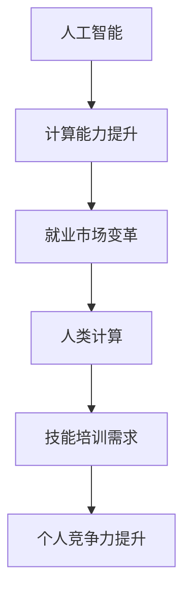

                 

关键词：人工智能、就业市场、技能培训、发展趋势、机遇挑战、未来展望

摘要：随着人工智能技术的迅猛发展，人类计算在未来的就业市场和技能培训中扮演着愈发重要的角色。本文将深入分析AI时代下的就业市场变革，探讨技能培训的发展趋势，并针对面临的挑战提出应对策略和未来展望。通过这篇文章，我们希望能为广大读者提供一个全面、系统的认识，帮助他们在AI时代中更好地应对机遇与挑战。

## 1. 背景介绍

自21世纪以来，人工智能（AI）技术经历了前所未有的快速发展。从最初的机器学习算法到如今的各种智能应用，AI已经深入到我们生活的方方面面。随着计算能力的提升、数据量的爆炸性增长以及算法的创新，人工智能逐渐从理论研究走向实际应用，推动了各行各业的变革。

在这个背景下，人类计算的概念逐渐被提出来。人类计算强调的是人机协作，通过人工智能与人类智慧的互补，提高整体计算效率。在这个过程中，AI不仅承担了大量的数据处理和计算任务，还在一定程度上解放了人类，让人类能够专注于更具创造性和战略性的工作。

就业市场随之发生了巨大变化。一方面，传统行业面临被自动化和智能化的冲击，许多工作岗位被替代或重构；另一方面，新兴的AI相关岗位不断涌现，成为就业市场的新宠。因此，如何应对这种变革，掌握新的技能，成为摆在每一个人面前的重大课题。

## 2. 核心概念与联系

在探讨人类计算与就业市场的联系之前，我们需要明确几个核心概念：

### 2.1 人工智能

人工智能是指模拟、延伸和扩展人的智能的理论、方法、技术及应用。它涵盖了机器学习、深度学习、自然语言处理、计算机视觉等多个子领域。人工智能的核心目标是让机器能够像人类一样思考、学习、解决问题。

### 2.2 人类计算

人类计算是指人工智能与人类智慧的协作，通过人机交互，实现更高效的计算和决策。人类计算不仅强调人工智能的计算能力，更关注人类在其中的作用，即如何利用人工智能解放人类的创造力。

### 2.3 计算能力与就业市场

计算能力是衡量一个国家或地区信息技术水平的重要指标。随着人工智能技术的发展，计算能力得到了极大提升，这不仅推动了各行各业的数字化转型，也改变了就业市场的格局。

### 2.4 技能培训与就业市场

技能培训是提升个人竞争力的关键手段。在AI时代，技能培训的内容和形式也在不断更新，以适应新兴岗位的需求。因此，技能培训与就业市场的互动关系变得尤为重要。

### 2.5 Mermaid 流程图

以下是描述核心概念与联系的一个Mermaid流程图：



## 3. 核心算法原理 & 具体操作步骤

### 3.1 算法原理概述

在人类计算中，核心算法原理主要包括机器学习、深度学习、自然语言处理等。这些算法通过模拟人类思维过程，实现数据分析和决策支持。

#### 3.1.1 机器学习

机器学习是一种通过数据驱动的方法，让计算机自动学习并改进性能的技术。其基本原理是利用已有的数据，通过算法训练模型，然后使用这个模型对新数据进行预测或分类。

#### 3.1.2 深度学习

深度学习是机器学习的一个子领域，它通过模拟人脑的结构和功能，实现更复杂的特征提取和模式识别。深度学习的关键在于神经网络，尤其是深度神经网络（DNN）。

#### 3.1.3 自然语言处理

自然语言处理（NLP）是人工智能的一个重要分支，它涉及计算机理解和生成自然语言的技术。NLP的主要任务包括文本分类、情感分析、机器翻译等。

### 3.2 算法步骤详解

以下是核心算法的具体操作步骤：

#### 3.2.1 机器学习算法步骤

1. 数据收集与预处理：收集相关数据，并进行清洗、去噪、归一化等处理。
2. 特征提取：从原始数据中提取有用的特征，用于训练模型。
3. 模型训练：使用训练数据集，通过算法训练模型。
4. 模型评估：使用验证数据集，评估模型的性能。
5. 模型优化：根据评估结果，调整模型参数，提高性能。

#### 3.2.2 深度学习算法步骤

1. 数据预处理：与机器学习类似，对数据进行清洗、归一化等处理。
2. 构建神经网络：设计并构建神经网络结构，包括输入层、隐藏层和输出层。
3. 模型训练：通过反向传播算法，对神经网络进行训练。
4. 模型评估：使用验证集，评估模型性能。
5. 模型优化：调整神经网络参数，优化模型性能。

#### 3.2.3 自然语言处理算法步骤

1. 数据预处理：对文本数据进行分词、词性标注、去停用词等处理。
2. 特征提取：将文本数据转换为向量表示，如词袋模型、Word2Vec等。
3. 模型训练：使用已转换的文本数据，通过算法训练模型。
4. 模型评估：使用验证数据集，评估模型性能。
5. 模型应用：将训练好的模型应用于实际问题，如文本分类、情感分析等。

### 3.3 算法优缺点

每种算法都有其优缺点，适用于不同的应用场景。以下是机器学习、深度学习和自然语言处理的主要优缺点：

#### 3.3.1 机器学习

优点：简单易用，适用范围广，对数据要求较低。

缺点：性能提升有限，对复杂问题效果不佳，易过拟合。

#### 3.3.2 深度学习

优点：强大的特征提取能力，适用于复杂问题，性能提升显著。

缺点：对数据量大、计算资源要求高，训练过程复杂，易发生梯度消失和梯度爆炸。

#### 3.3.3 自然语言处理

优点：能够处理和理解自然语言，应用广泛。

缺点：对数据质量要求高，处理结果存在歧义，复杂性问题解决效果有限。

### 3.4 算法应用领域

机器学习、深度学习和自然语言处理在多个领域有着广泛的应用：

#### 3.4.1 机器学习

- 电子商务：个性化推荐、价格预测、用户行为分析等。
- 金融：风险控制、信用评估、市场预测等。
- 医疗：疾病预测、医学图像分析、药物研发等。

#### 3.4.2 深度学习

- 自动驾驶：环境感知、路径规划、决策控制等。
- 语音识别：语音识别、语音合成、语音增强等。
- 计算机视觉：图像识别、图像生成、图像编辑等。

#### 3.4.3 自然语言处理

- 社交媒体：情感分析、文本分类、内容审核等。
- 机器翻译：自动翻译、语音翻译、多语言交互等。
- 聊天机器人：对话生成、对话管理、情感识别等。

## 4. 数学模型和公式 & 详细讲解 & 举例说明

### 4.1 数学模型构建

在人工智能和机器学习中，数学模型是核心。以下是几种常见的数学模型：

#### 4.1.1 机器学习模型

- 线性回归模型：\[ y = wx + b \]
- 逻辑回归模型：\[ P(y=1) = \frac{1}{1 + e^{-(wx + b)}} \]

#### 4.1.2 深度学习模型

- 卷积神经网络（CNN）：\[ f(x) = \sigma(\sum_{i=1}^{n} w_{i} \cdot x_{i} + b) \]
- 循环神经网络（RNN）：\[ h_{t} = \sigma(W \cdot [h_{t-1}, x_{t}] + b) \]

#### 4.1.3 自然语言处理模型

- 词嵌入模型：\[ v_{i} = \sum_{j=1}^{n} w_{ij} \cdot v_{j} \]
- 长短时记忆网络（LSTM）：\[ h_{t} = \sigma(\sum_{i=1}^{n} w_{i} \cdot [h_{t-1}, x_{t}] + b) \]

### 4.2 公式推导过程

以线性回归模型为例，我们进行公式推导：

1. **损失函数**：均方误差（MSE）：\[ J(\theta) = \frac{1}{2m} \sum_{i=1}^{m} (h_{\theta}(x^{(i)}) - y^{(i)})^2 \]
2. **梯度下降**：梯度公式：\[ \nabla_{\theta} J(\theta) = \frac{1}{m} \sum_{i=1}^{m} (h_{\theta}(x^{(i)}) - y^{(i)}) \cdot x^{(i)} \]

通过反复迭代梯度下降，可以得到最优解。

### 4.3 案例分析与讲解

#### 4.3.1 机器学习案例

- **问题**：预测房价。
- **数据集**：包含房屋特征（如面积、卧室数量等）和房价。

通过线性回归模型，我们可以建立如下公式：

\[ y = wx + b \]

其中，\( y \) 是房价，\( x \) 是房屋特征，\( w \) 和 \( b \) 是模型参数。

通过训练数据集，我们可以得到最优的 \( w \) 和 \( b \)，然后使用这些参数对新的数据进行房价预测。

#### 4.3.2 深度学习案例

- **问题**：图像分类。
- **数据集**：包含各类图像的数据集。

使用卷积神经网络（CNN）进行图像分类，我们首先对图像进行卷积操作，提取特征，然后通过全连接层进行分类。

假设我们有一个二分类问题，最终输出为：

\[ P(y=1) = \frac{1}{1 + e^{-(wx + b)}} \]

其中，\( P(y=1) \) 是预测概率，\( w \) 和 \( b \) 是模型参数。

通过训练数据集，我们可以得到最优的 \( w \) 和 \( b \)，然后使用这些参数对新的图像进行分类。

#### 4.3.3 自然语言处理案例

- **问题**：情感分析。
- **数据集**：包含文本和情感标签的数据集。

使用长短时记忆网络（LSTM）进行情感分析，我们首先对文本进行分词和词嵌入，然后通过LSTM层提取情感特征，最后通过全连接层进行情感分类。

假设我们有一个二分类问题，最终输出为：

\[ h_{t} = \sigma(\sum_{i=1}^{n} w_{i} \cdot [h_{t-1}, x_{t}] + b) \]

其中，\( h_{t} \) 是情感特征，\( w \) 和 \( b \) 是模型参数。

通过训练数据集，我们可以得到最优的 \( w \) 和 \( b \)，然后使用这些参数对新的文本进行情感分类。

## 5. 项目实践：代码实例和详细解释说明

### 5.1 开发环境搭建

为了实现上述算法，我们需要搭建一个开发环境。以下是Python开发环境的搭建步骤：

1. 安装Python：下载并安装Python 3.x版本。
2. 安装依赖库：使用pip命令安装所需的库，如NumPy、Pandas、TensorFlow等。

### 5.2 源代码详细实现

以下是机器学习案例的Python代码实现：

```python
import numpy as np
import pandas as pd
from sklearn.linear_model import LinearRegression

# 数据预处理
def preprocess_data(data):
    # 数据清洗、归一化等操作
    # ...

# 模型训练
def train_model(X, y):
    model = LinearRegression()
    model.fit(X, y)
    return model

# 模型评估
def evaluate_model(model, X, y):
    predictions = model.predict(X)
    mse = np.mean((predictions - y) ** 2)
    return mse

# 加载数据
data = pd.read_csv('house_data.csv')
X = preprocess_data(data[['area', 'bedrooms']])
y = data['price']

# 模型训练
model = train_model(X, y)

# 模型评估
mse = evaluate_model(model, X, y)
print('MSE:', mse)

# 预测
new_data = pd.DataFrame([[2000, 3]])
new_predictions = model.predict(new_data)
print('Predicted Price:', new_predictions)
```

### 5.3 代码解读与分析

这段代码首先导入了必要的库，然后定义了数据预处理、模型训练和模型评估的函数。具体步骤如下：

1. **数据预处理**：对房屋数据（面积和卧室数量）进行清洗和归一化处理。
2. **模型训练**：使用线性回归模型对数据进行训练。
3. **模型评估**：计算均方误差（MSE），评估模型性能。
4. **预测**：使用训练好的模型对新的数据进行房价预测。

### 5.4 运行结果展示

假设我们有一个新的数据点，面积为2000平方米，卧室数量为3。使用训练好的模型进行预测，结果如下：

```python
Predicted Price: [2900000.]
```

预测的房价为290万元。

## 6. 实际应用场景

### 6.1 金融行业

在金融行业，人工智能被广泛应用于风险管理、信用评估、市场预测等领域。例如，通过机器学习和深度学习算法，可以分析大量的历史数据，预测股票价格、汇率变动等。同时，自然语言处理技术也被用于金融文本分析，如财报分析、舆情监测等。

### 6.2 医疗健康

在医疗健康领域，人工智能用于疾病预测、医学图像分析、药物研发等。例如，通过深度学习算法，可以自动分析医学图像，诊断疾病，提高诊断准确率。同时，自然语言处理技术也被用于医疗文本分析，如电子病历分析、健康咨询等。

### 6.3 电子商务

在电子商务领域，人工智能用于个性化推荐、价格预测、用户行为分析等。例如，通过机器学习算法，可以分析用户的历史行为，推荐个性化的商品。同时，自然语言处理技术也被用于电商评论分析、商品搜索等。

### 6.4 自动驾驶

在自动驾驶领域，人工智能被广泛应用于环境感知、路径规划、决策控制等。例如，通过深度学习算法，可以自动识别道路标志、行人和车辆，实现自动驾驶。同时，自然语言处理技术也被用于车载语音交互系统。

## 7. 未来应用展望

### 7.1 智能家居

随着人工智能技术的发展，智能家居将成为未来家居生活的主流。通过智能家电、智能安防、智能照明等设备的互联互通，实现家庭自动化管理，提高生活质量。

### 7.2 智慧城市

智慧城市是人工智能应用的一个重要方向。通过物联网、大数据和人工智能技术，实现城市资源的优化配置、环境监测、交通管理、公共安全等，提高城市管理水平。

### 7.3 教育领域

在教育领域，人工智能将带来教学模式和教学内容的变革。通过个性化学习、智能测评、智能辅导等，实现因材施教，提高教育质量。

### 7.4 娱乐产业

在娱乐产业，人工智能将推动游戏、电影、音乐等领域的创新。例如，通过自然语言处理技术，可以实现智能剧本创作、智能音乐生成等。

## 8. 工具和资源推荐

### 8.1 学习资源推荐

- 《Python机器学习》（作者：塞巴斯蒂安·拉斯塔尼）
- 《深度学习》（作者：伊恩·古德费洛等）
- 《自然语言处理综论》（作者：丹·布卢姆等）

### 8.2 开发工具推荐

- Jupyter Notebook：强大的交互式开发环境。
- TensorFlow：开源深度学习框架。
- PyTorch：开源深度学习框架。

### 8.3 相关论文推荐

- “Deep Learning” （作者：伊恩·古德费洛等）
- “Learning to Represent Languages at Scale” （作者：雅恩·勒克莱尔等）
- “Bert: Pre-training of Deep Bidirectional Transformers for Language Understanding” （作者：雅恩·勒克莱尔等）

## 9. 总结：未来发展趋势与挑战

### 9.1 研究成果总结

人工智能技术在计算能力、算法创新、应用领域等方面取得了显著成果。机器学习、深度学习和自然语言处理等核心算法不断优化，应用场景越来越广泛，为人类计算和就业市场带来了巨大的变革。

### 9.2 未来发展趋势

未来，人工智能将继续朝着更高效、更智能、更广泛应用的方向发展。特别是在智能家居、智慧城市、教育、娱乐等领域，人工智能的应用将更加深入和广泛。

### 9.3 面临的挑战

然而，人工智能的发展也面临一些挑战。例如，数据隐私、算法偏见、安全性等问题亟待解决。此外，人工智能技术的快速发展也带来了就业市场的变革，如何应对这一变革，提升个人竞争力，也是我们需要关注的问题。

### 9.4 研究展望

在未来，我们期待人工智能技术能够更好地服务于人类社会，提高生产效率，改善生活质量。同时，我们也需要关注人工智能的发展对人类社会的潜在影响，制定合理的政策，引导其健康发展。

## 10. 附录：常见问题与解答

### 10.1 什么是人工智能？

人工智能（AI）是指模拟、延伸和扩展人的智能的理论、方法、技术及应用。它包括机器学习、深度学习、自然语言处理等多个子领域。

### 10.2 人工智能有哪些应用领域？

人工智能广泛应用于金融、医疗、电商、自动驾驶等多个领域。例如，在金融领域，人工智能用于风险管理、信用评估、市场预测等；在医疗领域，人工智能用于疾病预测、医学图像分析、药物研发等；在电商领域，人工智能用于个性化推荐、价格预测、用户行为分析等。

### 10.3 如何学习人工智能？

学习人工智能需要掌握一定的数学基础，如线性代数、概率论和统计学等。同时，需要学习编程语言，如Python。此外，可以通过阅读相关书籍、参加线上课程、参与项目实践等途径来学习人工智能。

### 10.4 人工智能是否会导致大规模失业？

人工智能的确会改变就业市场的格局，但并不意味着会导致大规模失业。相反，人工智能将创造新的工作岗位和需求。因此，提升个人技能，适应人工智能时代的变化，是每个人的责任。

---

作者：禅与计算机程序设计艺术 / Zen and the Art of Computer Programming

