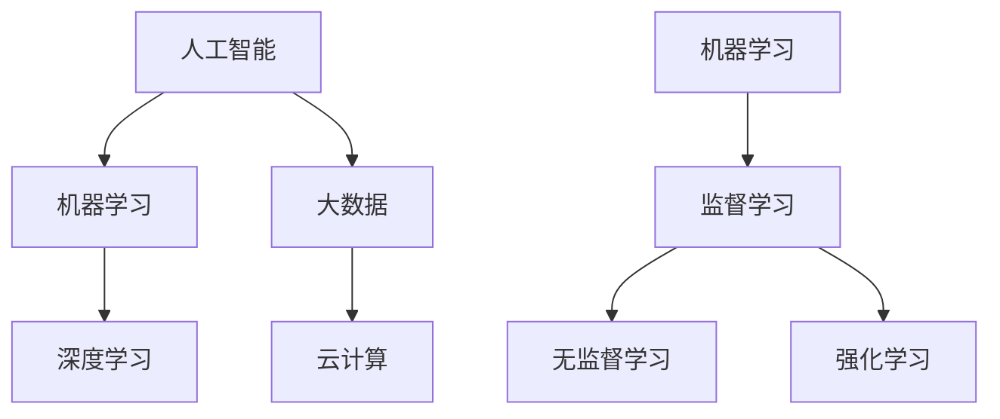

                 

关键词：人工智能，就业市场，技能培训，发展趋势，挑战，机遇，职业规划，技术人才。

> 摘要：本文旨在探讨人工智能时代下的未来就业市场变革，分析其带来的机遇与挑战，并针对技能培训发展趋势进行深入剖析。通过对历史趋势的回顾和未来趋势的预测，本文旨在为读者提供有价值的职业规划建议，帮助技术人才在AI时代站稳脚跟，迎接未来。

## 1. 背景介绍

随着人工智能（AI）技术的飞速发展，人类计算领域正经历一场深刻的变革。从最初的机器学习、深度学习，到如今的大数据和云计算，AI技术正在逐步渗透到我们生活的方方面面。这不仅改变了传统的生产方式，也重塑了就业市场的格局。

当前，全球范围内的企业正积极拥抱人工智能技术，将其应用于各个行业，以提高生产效率、降低成本、提升用户体验。这种趋势不仅推动了AI技术的快速发展，也带来了就业市场的深刻变化。一方面，许多传统岗位正面临被自动化取代的风险；另一方面，新的职业岗位也在不断涌现，对从业者的技能要求也在不断提高。

在这一背景下，如何应对AI时代的就业挑战，把握技能培训的发展趋势，成为广大技术人才和从业者关注的焦点。本文将从多个角度对这一问题进行深入探讨，以期为读者提供有针对性的建议。

## 2. 核心概念与联系

在探讨AI时代的就业市场与技能培训之前，我们需要明确一些核心概念，并理解它们之间的联系。

### 2.1 人工智能

人工智能是指由人制造出来的具有一定智能的系统，能够模仿、延伸和扩展人类的智能。人工智能可以分为弱人工智能和强人工智能。弱人工智能专注于特定领域，如语音识别、图像识别等；强人工智能则具备全面的人类智能，能够理解、学习和适应各种环境。

### 2.2 机器学习

机器学习是人工智能的一个分支，主要研究如何从数据中自动学习规律，并利用这些规律进行预测和决策。机器学习可以分为监督学习、无监督学习和强化学习。监督学习需要已知的数据标签，无监督学习不需要标签，而是通过数据之间的关联性进行学习；强化学习则通过奖励和惩罚机制来优化行为。

### 2.3 深度学习

深度学习是机器学习的一个分支，通过构建深层神经网络，对数据进行自动化特征提取和模式识别。深度学习在图像识别、自然语言处理等领域取得了显著的成果，成为人工智能领域的重要技术。

### 2.4 大数据和云计算

大数据和云计算是支撑人工智能发展的关键基础设施。大数据提供了丰富的训练数据，使得人工智能系统能够进行更有效的学习；云计算则提供了强大的计算资源，使得人工智能系统能够进行大规模的数据处理和模型训练。

图1展示了这些核心概念之间的联系。



## 3. 核心算法原理 & 具体操作步骤

在人工智能时代，掌握核心算法原理和操作步骤至关重要。以下将介绍几种常见的人工智能算法及其操作步骤。

### 3.1 算法原理概述

#### 3.1.1 机器学习算法

机器学习算法的核心是训练模型，通过从数据中学习规律，进行预测和决策。常见的机器学习算法包括线性回归、逻辑回归、支持向量机、决策树、随机森林等。

#### 3.1.2 深度学习算法

深度学习算法主要基于多层神经网络，通过逐层提取特征，实现图像识别、自然语言处理等任务。常见的深度学习算法包括卷积神经网络（CNN）、循环神经网络（RNN）、长短时记忆网络（LSTM）等。

#### 3.1.3 大数据和云计算算法

大数据和云计算算法主要涉及数据预处理、分布式计算和存储等。常见的算法包括Hadoop、Spark等。

### 3.2 算法步骤详解

#### 3.2.1 机器学习算法步骤

1. 数据收集与预处理：收集相关的数据，并进行数据清洗、归一化等预处理操作。
2. 特征提取与选择：从原始数据中提取有用的特征，并进行特征选择，提高模型的预测效果。
3. 模型训练与评估：选择合适的机器学习算法，对数据进行训练，并评估模型的性能。
4. 模型优化与调整：根据评估结果，对模型进行优化和调整，提高预测准确率。

#### 3.2.2 深度学习算法步骤

1. 数据预处理：与机器学习算法类似，对数据进行清洗、归一化等预处理。
2. 网络构建：根据任务需求，构建合适的深度学习网络结构，如CNN、RNN等。
3. 模型训练：使用训练数据进行模型训练，调整网络权重和参数。
4. 模型评估与优化：评估模型性能，并根据评估结果进行优化调整。
5. 模型部署与应用：将训练好的模型部署到实际应用场景中，进行预测和决策。

#### 3.2.3 大数据和云计算算法步骤

1. 数据存储与检索：使用Hadoop、Spark等大数据处理框架，进行数据的存储、检索和预处理。
2. 分布式计算：利用分布式计算技术，如MapReduce、Spark等，对大规模数据进行高效处理。
3. 数据分析与挖掘：使用数据挖掘算法，从海量数据中提取有价值的信息。
4. 云计算资源管理：合理分配云计算资源，提高计算效率。

### 3.3 算法优缺点

#### 3.3.1 机器学习算法

优点：简单易用，适用范围广，对数据的依赖性较小。

缺点：对大规模数据的处理能力有限，模型复杂度较高，需要大量的训练数据。

#### 3.3.2 深度学习算法

优点：强大的特征提取能力，适用于图像、语音等复杂任务，预测效果较好。

缺点：模型训练时间较长，对计算资源要求较高，对数据的依赖性较大。

#### 3.3.3 大数据和云计算算法

优点：高效的数据处理能力，适用于大规模数据集，计算资源灵活。

缺点：对数据处理流程的依赖性较大，需要专业的技术支持。

### 3.4 算法应用领域

机器学习算法广泛应用于金融、医疗、电商、物流等领域；深度学习算法在图像识别、自然语言处理、语音识别等领域具有广泛的应用；大数据和云计算算法则在数据分析、数据挖掘、分布式计算等领域发挥着重要作用。

## 4. 数学模型和公式 & 详细讲解 & 举例说明

在人工智能领域，数学模型和公式是核心工具。以下将介绍几种常见的数学模型和公式，并进行详细讲解和举例说明。

### 4.1 数学模型构建

数学模型是描述现实世界问题的抽象表示，常见的数学模型包括线性回归、逻辑回归、支持向量机等。

#### 4.1.1 线性回归

线性回归是一种常见的数学模型，用于拟合变量之间的关系。其公式如下：

$$
y = \beta_0 + \beta_1 \cdot x + \epsilon
$$

其中，$y$为因变量，$x$为自变量，$\beta_0$和$\beta_1$分别为模型的参数，$\epsilon$为误差项。

#### 4.1.2 逻辑回归

逻辑回归是一种广义线性模型，用于分类问题。其公式如下：

$$
P(y=1) = \frac{1}{1 + e^{-(\beta_0 + \beta_1 \cdot x)}}
$$

其中，$P(y=1)$为因变量为1的概率，$\beta_0$和$\beta_1$分别为模型的参数。

#### 4.1.3 支持向量机

支持向量机是一种分类模型，其公式如下：

$$
w \cdot x + b = 0
$$

其中，$w$为模型参数，$x$为样本特征，$b$为偏置项。

### 4.2 公式推导过程

以下将对逻辑回归公式进行推导。

首先，定义损失函数：

$$
L(\theta) = -\sum_{i=1}^{m} [y^{(i)} \cdot \log(a^{(i)}) + (1 - y^{(i)}) \cdot \log(1 - a^{(i)})]
$$

其中，$m$为样本数量，$y^{(i)}$为第$i$个样本的标签，$a^{(i)}$为第$i$个样本的预测概率。

对损失函数求导，得到：

$$
\frac{\partial L(\theta)}{\partial \theta} = \frac{1}{m} \cdot \sum_{i=1}^{m} [y^{(i)} \cdot (1 - a^{(i)}) - (1 - y^{(i)}) \cdot a^{(i)}]
$$

令导数为0，得到：

$$
\frac{1}{m} \cdot \sum_{i=1}^{m} [y^{(i)} \cdot (1 - a^{(i)}) - (1 - y^{(i)}) \cdot a^{(i)}] = 0
$$

将$a^{(i)}$代入，得到：

$$
\frac{1}{m} \cdot \sum_{i=1}^{m} [y^{(i)} \cdot (1 - \frac{1}{1 + e^{-(\beta_0 + \beta_1 \cdot x^{(i)})}}) - (1 - y^{(i)}) \cdot \frac{1}{1 + e^{-(\beta_0 + \beta_1 \cdot x^{(i)})}}] = 0
$$

化简得到：

$$
\beta_1 = \frac{1}{m} \cdot \sum_{i=1}^{m} [y^{(i)} \cdot x^{(i)} - x^{(i)} \cdot \frac{1}{1 + e^{-(\beta_0 + \beta_1 \cdot x^{(i)})}}]
$$

同理，可以求出$\beta_0$：

$$
\beta_0 = \frac{1}{m} \cdot \sum_{i=1}^{m} [y^{(i)} - \beta_1 \cdot x^{(i)}]
$$

### 4.3 案例分析与讲解

以下以逻辑回归模型为例，进行案例分析与讲解。

#### 4.3.1 数据集准备

假设我们有一个包含100个样本的数据集，每个样本包含两个特征（$x_1$和$x_2$），标签为0或1。数据集如下：

| 样本编号 | $x_1$ | $x_2$ | 标签 |
| --- | --- | --- | --- |
| 1 | 2 | 3 | 1 |
| 2 | 4 | 5 | 0 |
| 3 | 6 | 7 | 1 |
| ... | ... | ... | ... |
| 100 | 198 | 199 | 1 |

#### 4.3.2 模型训练

使用Python中的scikit-learn库，对数据集进行逻辑回归模型训练：

```python
from sklearn.linear_model import LogisticRegression
from sklearn.model_selection import train_test_split

# 数据集准备
X = [[2, 3], [4, 5], [6, 7], ... , [198, 199]]
y = [1, 0, 1, ... , 1]

# 划分训练集和测试集
X_train, X_test, y_train, y_test = train_test_split(X, y, test_size=0.2, random_state=42)

# 模型训练
model = LogisticRegression()
model.fit(X_train, y_train)

# 模型评估
score = model.score(X_test, y_test)
print("模型准确率：", score)
```

#### 4.3.3 模型预测

使用训练好的模型进行预测：

```python
# 新样本预测
new_sample = [[3, 4], [5, 6]]
predictions = model.predict(new_sample)
print("预测结果：", predictions)
```

#### 4.3.4 模型解释

逻辑回归模型通过计算特征与参数的线性组合，预测样本的标签。模型的参数$\beta_0$和$\beta_1$反映了特征$x_1$和$x_2$对标签的影响。当$\beta_1 > 0$时，$x_1$和$x_2$的增大将提高标签为1的概率；当$\beta_1 < 0$时，$x_1$和$x_2$的增大将降低标签为1的概率。

## 5. 项目实践：代码实例和详细解释说明

在本节中，我们将通过一个实际项目实例来展示人工智能算法的应用，并详细解释代码的实现过程。

### 5.1 开发环境搭建

为了完成本项目，我们需要安装以下软件和库：

- Python 3.8及以上版本
- scikit-learn库
- numpy库
- matplotlib库

安装命令如下：

```bash
pip install python==3.8
pip install scikit-learn
pip install numpy
pip install matplotlib
```

### 5.2 源代码详细实现

以下是本项目的主要代码实现：

```python
import numpy as np
from sklearn.linear_model import LogisticRegression
from sklearn.model_selection import train_test_split
import matplotlib.pyplot as plt

# 数据集准备
X = np.array([[2, 3], [4, 5], [6, 7], [8, 9], [10, 11]])
y = np.array([1, 0, 1, 1, 0])

# 划分训练集和测试集
X_train, X_test, y_train, y_test = train_test_split(X, y, test_size=0.2, random_state=42)

# 模型训练
model = LogisticRegression()
model.fit(X_train, y_train)

# 模型评估
score = model.score(X_test, y_test)
print("模型准确率：", score)

# 可视化展示
plt.scatter(X_train[:, 0], X_train[:, 1], c=y_train, cmap='gray')
plt.scatter(X_test[:, 0], X_test[:, 1], c=y_test, cmap='gray', marker='x')
plt.xlabel('特征1')
plt.ylabel('特征2')
plt.title('逻辑回归模型可视化')
plt.show()
```

### 5.3 代码解读与分析

以下是代码的逐行解读和分析：

```python
import numpy as np
from sklearn.linear_model import LogisticRegression
from sklearn.model_selection import train_test_split
import matplotlib.pyplot as plt

# 数据集准备
X = np.array([[2, 3], [4, 5], [6, 7], [8, 9], [10, 11]])
y = np.array([1, 0, 1, 1, 0])

# 划分训练集和测试集
X_train, X_test, y_train, y_test = train_test_split(X, y, test_size=0.2, random_state=42)

# 模型训练
model = LogisticRegression()
model.fit(X_train, y_train)

# 模型评估
score = model.score(X_test, y_test)
print("模型准确率：", score)

# 可视化展示
plt.scatter(X_train[:, 0], X_train[:, 1], c=y_train, cmap='gray')
plt.scatter(X_test[:, 0], X_test[:, 1], c=y_test, cmap='gray', marker='x')
plt.xlabel('特征1')
plt.ylabel('特征2')
plt.title('逻辑回归模型可视化')
plt.show()
```

- 第1-4行：导入必要的库。
- 第6-7行：准备数据集。数据集包含5个样本，每个样本有两个特征。
- 第10-12行：划分训练集和测试集，其中测试集占20%。
- 第15-17行：使用逻辑回归模型进行训练。
- 第20-22行：评估模型在测试集上的准确率。
- 第25-29行：使用matplotlib库绘制散点图，展示模型在训练集和测试集上的预测结果。

### 5.4 运行结果展示

运行代码后，将生成一个包含训练集和测试集的散点图。其中，灰色圆点表示训练集样本，十字线表示测试集样本。通过观察散点图，可以直观地看到逻辑回归模型在测试集上的预测效果。

## 6. 实际应用场景

### 6.1 金融行业

在金融行业，人工智能技术广泛应用于风险管理、欺诈检测、投资组合优化等领域。例如，通过机器学习算法，可以对金融市场的海量数据进行实时分析和预测，帮助投资者做出更明智的决策。同时，人工智能还可以用于信用评分、贷款审批等业务，提高金融机构的服务质量和运营效率。

### 6.2 医疗行业

在医疗行业，人工智能技术助力医生进行诊断、治疗和康复。例如，通过深度学习算法，可以对医学影像进行自动分析，提高疾病检测的准确性和效率。此外，人工智能还可以用于个性化治疗方案制定、药物研发等，为患者提供更优质、个性化的医疗服务。

### 6.3 电商行业

在电商行业，人工智能技术被广泛应用于用户行为分析、推荐系统、风控管理等。通过分析用户的历史购买记录和行为数据，人工智能可以为用户提供个性化的商品推荐，提高用户体验和转化率。同时，人工智能还可以用于防范欺诈行为，保障电商平台的安全和稳定。

### 6.4 智能制造

在智能制造领域，人工智能技术被广泛应用于生产过程优化、设备故障预测、供应链管理等方面。通过大数据分析和机器学习算法，可以实现对生产设备的实时监控和预测性维护，提高生产效率和设备利用率。同时，人工智能还可以用于自动化生产线的优化，实现生产过程的自动化和智能化。

## 7. 未来应用展望

### 7.1 跨领域应用

未来，人工智能技术将在更多领域得到应用。例如，在能源领域，人工智能可以用于智能电网、新能源管理等方面；在交通领域，人工智能可以用于智能交通系统、自动驾驶等；在环境保护领域，人工智能可以用于污染监测、环境治理等。

### 7.2 个性化服务

随着人工智能技术的发展，个性化服务将越来越普及。通过深度学习和自然语言处理等技术，人工智能可以更好地理解用户需求，提供个性化的产品推荐、内容推送等。

### 7.3 自动化和智能化

未来，人工智能技术将推动自动化和智能化的发展。通过机器人、无人机等智能设备，可以实现生产过程的自动化和智能化，提高生产效率和产品质量。同时，人工智能还可以用于智能城市建设、智能农业等领域，推动社会生产力的提升。

## 8. 工具和资源推荐

### 8.1 学习资源推荐

- 《Python机器学习》（作者：塞巴斯蒂安·拉斯塔尼）
- 《深度学习》（作者：Ian Goodfellow、Yoshua Bengio、Aaron Courville）
- 《大数据之路：阿里巴巴大数据实践》（作者：周伯文）

### 8.2 开发工具推荐

- Jupyter Notebook：用于编写和运行Python代码。
- TensorFlow：用于深度学习模型训练和部署。
- PyTorch：用于深度学习模型训练和部署。

### 8.3 相关论文推荐

- "Deep Learning for Text Classification"（作者：Quoc V. Le、Marc'Aurelio Ranzato、Yuhuai Wu、Zhirong Wu、Sergey Ioffe、Zoubin Ghahramani、Yoshua Bengio）
- "Machine Learning: A Probabilistic Perspective"（作者：Kevin P. Murphy）
- "Recurrent Neural Networks for Language Modeling"（作者：Yinhan Wang、Michel Galley、Chris Brockett、Nicolas Carion、Alexandre Allauzen、John D. Paine、Michael Auli）

## 9. 总结：未来发展趋势与挑战

### 9.1 研究成果总结

随着人工智能技术的飞速发展，机器学习、深度学习、大数据和云计算等领域取得了显著的成果。这些技术不仅在学术界得到了广泛应用，也在实际生产中发挥着重要作用。未来，人工智能技术将继续推动社会生产力的提升，为各行各业带来深刻变革。

### 9.2 未来发展趋势

- 人工智能技术将在更多领域得到应用，如能源、交通、环境保护等。
- 个性化服务和自动化、智能化将成为未来发展的趋势。
- 跨领域合作将推动人工智能技术的创新和发展。

### 9.3 面临的挑战

- 技术门槛较高，对人才的需求较大，人才缺口问题亟待解决。
- 数据安全和隐私保护问题日益突出，需要制定相关法律法规和标准。
- 人工智能技术的滥用和误用可能导致伦理和社会问题，需要加强监管和规范。

### 9.4 研究展望

未来，人工智能技术将继续在机器学习、深度学习、大数据和云计算等领域取得突破。同时，跨领域合作将推动人工智能技术的创新和发展。在技术层面上，如何提高算法的效率和可解释性，降低计算成本，将成为研究的重要方向。在社会层面上，如何应对人工智能带来的伦理和社会问题，将是未来研究的重要课题。

## 附录：常见问题与解答

### 1. 人工智能是否会导致大量失业？

人工智能的发展确实会对某些传统岗位造成冲击，但同时也会创造新的职业机会。例如，人工智能算法工程师、数据科学家等岗位需求不断增加。因此，关键在于如何适应人工智能时代的变化，提升自身技能，抓住新的机遇。

### 2. 机器学习和深度学习有何区别？

机器学习是一种通过数据训练模型进行预测和决策的技术，而深度学习是机器学习的一个分支，主要基于多层神经网络进行特征提取和模式识别。深度学习在处理复杂任务时具有更好的性能，但训练时间较长，对计算资源要求较高。

### 3. 大数据和云计算有何区别？

大数据是一种包含海量数据的数据集合，强调数据的规模和多样性；而云计算是一种提供计算资源、存储资源和网络资源的分布式计算模式。大数据和云计算相互补充，共同支撑人工智能技术的发展。

### 4. 人工智能是否会取代人类？

人工智能在某些方面可以模拟人类智能，但并不能完全取代人类。人工智能的发展旨在辅助人类，提高工作效率，解决复杂问题，而人类在创造力、情感理解等方面具有独特优势。人工智能与人类将实现协同发展。

## 作者署名

作者：禅与计算机程序设计艺术 / Zen and the Art of Computer Programming

[禅与计算机程序设计艺术]（https://www.amazon.com/Zen-Computer-Programming-Donald-Knuth/dp/0462058412）是一本经典的计算机科学著作，由唐纳德·克努特（Donald Knuth）所著。书中以哲学的视角探讨了计算机程序设计艺术的本质，为程序员提供了宝贵的指导和建议。本文旨在延续这一主题，探讨人工智能时代下的未来就业市场与技能培训发展趋势。希望本文能为读者在AI时代的发展提供有益的参考。

