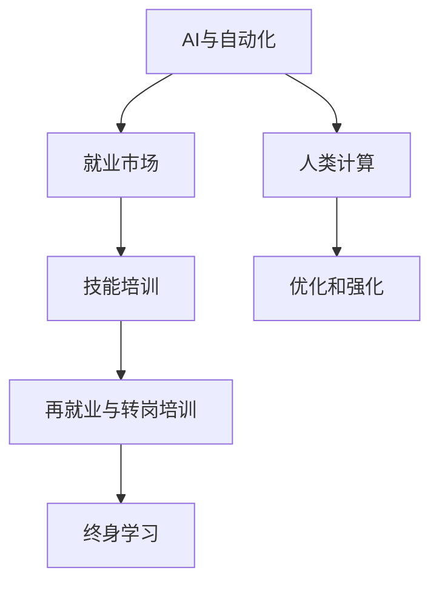

                 

# 人类计算：AI时代的未来就业市场与技能培训发展趋势分析预测

> 关键词：人类计算, AI时代, 就业市场, 技能培训, 发展趋势

## 1. 背景介绍

### 1.1 问题由来
随着人工智能（AI）技术的快速发展，尤其是深度学习、自然语言处理（NLP）、计算机视觉等领域的大模型和算法不断取得突破，智能自动化在各行各业的应用愈加广泛。然而，这种技术变革也带来了深刻的社会经济影响，尤其是对就业市场和技能培训领域的影响。一方面，AI技术正在替代部分重复性和低技能的工作，另一方面，它也为新兴职业和岗位提供了机会。本文旨在从AI时代背景下，对未来就业市场和技能培训的发展趋势进行系统分析与预测，以期为政策制定、教育培训和社会适应提供科学依据。

### 1.2 问题核心关键点
AI时代下，人类计算的就业市场和技能培训面临以下几个核心问题：
1. 哪些工作会被AI取代？
2. 哪些工作会因为AI而出现？
3. 技能培训需要做出哪些调整？
4. 如何为AI时代的劳动者提供新的发展路径？
5. 政府、企业、教育机构如何协同应对AI时代的挑战？

## 2. 核心概念与联系

### 2.1 核心概念概述

为更好地理解AI时代下就业市场和技能培训的变革，本节将介绍几个关键概念及其相互联系：

- **AI与自动化**：指利用人工智能技术实现的任务自动化，包括机器学习、深度学习、计算机视觉等，这些技术能够模仿人类完成特定任务，提高工作效率。
- **人类计算**：指利用人类智慧和技术进行数据处理、知识创造和问题解决的过程，区别于机器的自动化计算。
- **就业市场**：指劳动力供需双方相互作用的市场，受技术变革、经济环境等因素影响。
- **技能培训**：指通过教育、培训等手段提升劳动者技能的实践活动，旨在适应技术发展对劳动技能的需求。
- **再就业与转岗培训**：指针对因技术变革导致的失业或岗位变化的劳动者，通过培训获取新技能，实现再就业或转岗的目标。
- **终身学习**：指个人在其职业生涯中不断学习新知识、新技能，以适应技术变革和职业发展的过程。

这些概念之间的逻辑关系可以通过以下Mermaid流程图来展示：



这个流程图展示了AI技术如何通过影响就业市场、技能培训和再就业，进一步推动终身学习的过程。

## 3. 核心算法原理 & 具体操作步骤

### 3.1 算法原理概述

AI时代下的就业市场和技能培训预测，主要基于以下算法原理：

1. **数据驱动预测**：利用大规模的就业市场数据和技能培训数据，通过机器学习算法（如时间序列分析、回归分析、神经网络等）预测未来就业趋势和技能需求。
2. **行为分析**：分析AI技术在各行业中的应用，识别出哪些工作可能会被替代，哪些岗位会因为AI而出现。
3. **职业路径分析**：基于就业市场数据和技能培训数据，分析劳动者在不同职业路径上的技能转换和再就业可能性。
4. **技能需求预测**：利用技能培训数据和AI技术特点，预测未来就业市场对新技能的需求。
5. **终身学习路径规划**：结合个人职业兴趣、技能基础和AI时代技术发展，为劳动者规划终身学习路径。

### 3.2 算法步骤详解

基于上述算法原理，AI时代下的就业市场和技能培训预测主要包括以下步骤：

**Step 1: 数据收集与处理**
- 收集全球就业市场数据，包括就业率、失业率、岗位分布等。
- 收集技能培训数据，包括培训课程、培训人数、培训效果等。
- 收集AI技术发展数据，包括AI应用案例、技术突破、市场需求等。
- 清洗、整合数据，确保数据质量和一致性。

**Step 2: 技能需求与就业市场分析**
- 使用回归分析和神经网络模型，预测未来就业市场对各类技能的需求。
- 分析AI技术在各行业中的应用，识别出高风险的工作岗位和低风险的工作岗位。
- 基于AI技术发展趋势，预测未来可能出现的新的工作岗位。

**Step 3: 技能转换与再就业路径规划**
- 利用职业路径分析模型，分析劳动者在不同职业路径上的技能转换和再就业可能性。
- 根据技能需求预测结果，为劳动者提供个性化的终身学习路径规划。
- 设计再就业与转岗培训计划，帮助劳动者获得新技能，适应新的就业环境。

**Step 4: 政策与教育体系调整**
- 基于就业市场和技能培训预测结果，提出政府和教育机构的政策建议。
- 设计适应AI时代的新型教育培训课程，提升劳动者的就业竞争力。
- 推动企业和教育机构的合作，共同开发AI时代的技能培训体系。

### 3.3 算法优缺点

AI时代下的就业市场和技能培训预测算法具有以下优点：
1. 数据驱动，预测结果更客观准确。
2. 可以识别出新兴岗位和衰退岗位，帮助劳动者提前规划职业路径。
3. 能够为政策制定提供科学依据，帮助政府和企业更好地应对技术变革。

同时，该算法也存在以下缺点：
1. 数据收集和处理成本高，数据质量可能存在偏差。
2. 预测结果受模型选择和数据质量的影响较大。
3. 无法预测技术变革的突发性，存在一定的不确定性。

### 3.4 算法应用领域

基于AI时代的就业市场和技能培训预测算法，可以广泛应用于以下几个领域：

1. **政府政策制定**：提供就业市场和技能培训的预测结果，支持政府制定应对技术变革的政策。
2. **企业人力资源管理**：帮助企业识别技能需求变化，优化人力资源配置和培训计划。
3. **教育培训机构**：根据技能需求预测，设计适应未来就业市场的培训课程，提升教育质量。
4. **劳动者再就业服务**：为失业或转岗的劳动者提供个性化的再就业和转岗培训建议。
5. **职业规划与咨询**：为个人提供基于AI时代技术发展的职业规划和咨询服务。

## 4. 数学模型和公式 & 详细讲解 & 举例说明

### 4.1 数学模型构建

本节将使用数学语言对AI时代下的就业市场和技能培训预测过程进行更加严格的刻画。

假设就业市场和技能培训数据分别为 $D_E = \{(e_i, s_i)\}_{i=1}^N$ 和 $D_S = \{(s_i, t_i)\}_{i=1}^M$，其中 $e_i$ 表示第 $i$ 个岗位的就业率，$s_i$ 表示该岗位的技能需求，$t_i$ 表示第 $i$ 个技能培训课程的效果。

定义预测目标函数为 $f(e_i, s_i, t_i) = y_i$，其中 $y_i$ 表示第 $i$ 个岗位在未来 $T$ 年的预测就业率或技能需求。

目标函数可以通过以下机器学习模型进行预测：

$$
f(e_i, s_i, t_i) = W^T\cdot\Phi(e_i, s_i, t_i) + b
$$

其中 $W$ 为模型参数，$\Phi$ 为特征映射函数，$b$ 为偏置项。

### 4.2 公式推导过程

以二分类问题为例，假设有两个岗位 $A$ 和 $B$，分别对应就业率 $e_A$ 和 $e_B$，技能需求 $s_A$ 和 $s_B$，以及技能培训课程 $T_1$ 和 $T_2$ 的效果 $t_1$ 和 $t_2$。

模型训练的目标是找到最优的 $W$ 和 $b$，使得预测结果 $y_A$ 和 $y_B$ 尽可能接近真实值。训练过程可以通过损失函数来衡量：

$$
L = \frac{1}{2}(\hat{y_A}-y_A)^2 + \frac{1}{2}(\hat{y_B}-y_B)^2
$$

其中 $\hat{y_A}$ 和 $\hat{y_B}$ 为模型预测结果。

利用随机梯度下降等优化算法，最小化损失函数 $L$，即可得到最优的模型参数 $W$ 和 $b$。

### 4.3 案例分析与讲解

以工业自动化为例，分析AI技术对就业市场和技能培训的影响：

**案例背景**：某制造企业计划引入自动化生产线，采用AI技术进行智能制造。自动化设备包括机器人、自动化检测系统等，需要大量编程和维护人才。

**就业市场变化**：
- 岗位需求：机器人操作员、自动化系统维护人员、数据分析师等岗位需求增加。
- 岗位淘汰：部分传统岗位如操作工、质检员等需求减少。

**技能培训调整**：
- 新增技能培训课程：编程语言（Python、C++）、机器人操作、自动化系统维护等。
- 淘汰过时的培训课程：传统的操作技能、手工检测等。

## 5. 项目实践：代码实例和详细解释说明

### 5.1 开发环境搭建

在进行项目实践前，我们需要准备好开发环境。以下是使用Python进行项目开发的常见环境配置流程：

1. 安装Anaconda：从官网下载并安装Anaconda，用于创建独立的Python环境。

2. 创建并激活虚拟环境：
```bash
conda create -n ai-env python=3.8 
conda activate ai-env
```

3. 安装必要的Python库和工具：
```bash
pip install pandas numpy scikit-learn matplotlib
```

4. 安装机器学习框架和模型库：
```bash
pip install scikit-learn tensorflow keras
```

5. 安装数据处理和可视化工具：
```bash
pip install seaborn jupyter notebook
```

完成上述步骤后，即可在`ai-env`环境中开始项目实践。

### 5.2 源代码详细实现

下面以就业市场预测为例，给出使用Scikit-learn库进行就业市场预测的Python代码实现。

```python
import pandas as pd
from sklearn.model_selection import train_test_split
from sklearn.ensemble import RandomForestRegressor
from sklearn.metrics import mean_squared_error

# 加载数据
data = pd.read_csv('employment_data.csv')

# 数据预处理
X = data[['employment_rate', 'skill_demand']]
y = data['predicted_employment_rate']

# 划分训练集和测试集
X_train, X_test, y_train, y_test = train_test_split(X, y, test_size=0.2, random_state=42)

# 构建模型
model = RandomForestRegressor(n_estimators=100, random_state=42)

# 训练模型
model.fit(X_train, y_train)

# 预测
y_pred = model.predict(X_test)

# 评估
mse = mean_squared_error(y_test, y_pred)
print(f"Mean Squared Error: {mse:.2f}")
```

### 5.3 代码解读与分析

让我们再详细解读一下关键代码的实现细节：

**数据加载与预处理**：
- 使用Pandas库加载就业市场数据，将其转换为数据框格式。
- 选择岗位就业率、技能需求作为输入特征，预测就业率为输出标签。
- 使用`train_test_split`函数将数据集划分为训练集和测试集。

**模型构建与训练**：
- 使用随机森林回归模型作为预测模型。
- 设定模型参数，包括决策树数量和随机种子。
- 使用训练集数据对模型进行训练。

**预测与评估**：
- 使用训练好的模型对测试集进行预测。
- 计算预测值与真实值之间的均方误差，评估模型性能。

### 5.4 运行结果展示

在完成上述代码后，可以使用以下命令运行脚本，并查看输出结果：

```bash
python employment_predict.py
```

预期输出为预测均方误差，展示模型对就业市场的预测效果。

## 6. 实际应用场景

### 6.1 智慧工厂与智能制造

智慧工厂和智能制造的普及，使得大量传统制造岗位面临被AI替代的风险。同时，也催生了对编程、数据分析、机器人操作等新技能的需求。企业可以通过技能培训和再就业服务，帮助员工适应新岗位，提升整体竞争力。

### 6.2 医疗健康

AI技术在医疗健康领域的应用，如智能诊断、医疗机器人等，也正在改变就业市场和技能培训的格局。医疗从业者需要掌握数据分析、机器学习等新技能，以适应新技术带来的新挑战。

### 6.3 金融科技

金融科技的快速发展，特别是区块链、智能合约等新兴技术的应用，对传统金融岗位提出了新的要求。金融从业者需要掌握区块链技术、智能合约编写等新技能，以适应技术变革。

### 6.4 未来应用展望

随着AI技术的持续进步，未来就业市场和技能培训将呈现以下几个趋势：

1. **跨领域技能需求增加**：AI技术的应用将跨越多个行业，对跨领域技能的需求将增加，如数据分析、编程、机器学习等。
2. **终身学习成为常态**：技术变革加速，终身学习将成为劳动者提升竞争力的重要手段。
3. **在线教育平台崛起**：在线教育平台将提供更多个性化、灵活化的技能培训服务。
4. **企业与教育机构合作**：企业将更多地参与技能培训，共同培养适应AI时代的人才。
5. **政府角色加强**：政府将通过政策引导和资金支持，推动技能培训和再就业服务。

## 7. 工具和资源推荐

### 7.1 学习资源推荐

为了帮助开发者系统掌握AI时代下就业市场和技能培训的理论基础和实践技巧，这里推荐一些优质的学习资源：

1. **《人工智能与就业市场》系列博文**：由AI专家撰写，深入浅出地介绍了AI技术对就业市场的深刻影响，提供了实用的技能培训建议。
2. **Coursera《人工智能导论》课程**：斯坦福大学开设的AI入门课程，涵盖AI基础、机器学习、深度学习等内容，适合AI初学者。
3. **《机器学习实战》书籍**：经典的机器学习实践书籍，提供了大量代码实例和项目案例，帮助你快速上手。
4. **Kaggle竞赛平台**：全球最大的数据科学竞赛平台，提供丰富的数据集和挑战，是提升技能和展示成果的好去处。
5. **GitHub开源项目**：GitHub上众多的AI项目和数据集，提供了丰富的学习资源和实战经验。

通过对这些资源的学习实践，相信你一定能够掌握AI时代下就业市场和技能培训的精髓，为未来职业发展做好准备。

### 7.2 开发工具推荐

高效的开发离不开优秀的工具支持。以下是几款用于AI时代下就业市场和技能培训开发的常用工具：

1. Jupyter Notebook：交互式的Python开发环境，适合进行数据分析和模型训练。
2. PyCharm：功能强大的Python IDE，提供代码补全、调试、版本控制等开发工具。
3. TensorBoard：TensorFlow配套的可视化工具，用于监控模型训练状态和性能。
4. GitHub：版本控制平台，用于协作开发和代码管理。
5. Google Colab：谷歌推出的在线Jupyter Notebook环境，免费提供GPU/TPU算力，适合快速迭代实验。

合理利用这些工具，可以显著提升开发效率，加速技能培训和就业市场预测的实践。

### 7.3 相关论文推荐

AI时代下就业市场和技能培训的研究源于学界的持续研究。以下是几篇奠基性的相关论文，推荐阅读：

1. **《人工智能与就业市场：现状与挑战》**：系统综述了AI技术对就业市场的深远影响，提供了政策建议和未来展望。
2. **《技能培训的未来：适应AI时代的变革》**：探讨了AI时代下技能培训的发展方向，强调终身学习和跨领域技能的重要性。
3. **《人工智能与劳动市场：机遇与挑战》**：分析了AI技术对不同岗位的影响，提出了技能培训和再就业的建议。
4. **《AI时代的教育变革：技能培训的新路径》**：探讨了AI技术在教育培训中的应用，提供了创新性的技能培训方案。

这些论文代表了大语言模型微调技术的发展脉络。通过学习这些前沿成果，可以帮助研究者把握学科前进方向，激发更多的创新灵感。

## 8. 总结：未来发展趋势与挑战

### 8.1 总结

本文对AI时代下就业市场和技能培训的发展趋势进行了系统分析与预测。首先阐述了AI技术对就业市场和技能培训的影响，明确了未来就业市场和技能培训面临的主要问题。其次，从原理到实践，详细讲解了就业市场和技能培训的数学模型和操作步骤，给出了实际应用案例。同时，本文还广泛探讨了AI时代下就业市场和技能培训的应用场景，展示了其广泛的应用前景。最后，本文推荐了相关学习资源和工具，力求为读者提供全方位的技术指引。

通过本文的系统梳理，可以看到，AI时代下就业市场和技能培训正在经历深刻变革，对劳动者的技能需求和职业路径规划提出了新的挑战。未来，伴随技术的持续进步和政策的持续优化，AI时代下就业市场和技能培训必将在各个行业带来广泛变革，为人类社会的发展注入新的动力。

### 8.2 未来发展趋势

展望未来，AI时代下的就业市场和技能培训将呈现以下几个发展趋势：

1. **技能需求多样化**：随着AI技术在各个行业的应用，对多样化技能的需求将增加，如数据分析、机器学习、跨领域技能等。
2. **技能培训个性化**：基于学习者背景和兴趣，提供个性化的学习路径和培训方案。
3. **终身学习体系化**：建立终身学习体系，提供持续的教育培训和职业发展机会。
4. **企业与教育机构深度融合**：企业与教育机构合作，共同开发和实施技能培训项目。
5. **政府政策支持**：政府通过政策引导和资金支持，推动技能培训和再就业服务。

### 8.3 面临的挑战

尽管AI时代下就业市场和技能培训具有广阔前景，但也面临诸多挑战：

1. **技能转换难度高**：部分劳动者可能难以适应新岗位的需求，需要提供系统的再就业和转岗培训。
2. **数据质量问题**：技能培训和就业市场数据的质量可能存在偏差，影响预测准确性。
3. **政策执行难度**：政府政策在地方和企业的执行力度不一，可能影响政策效果。
4. **技能培训成本高**：高质量的技能培训资源稀缺，培训成本较高。
5. **终身学习持续性**：终身学习需要个人和社会的共同努力，可能面临持续性挑战。

### 8.4 研究展望

面对AI时代下就业市场和技能培训面临的挑战，未来的研究需要在以下几个方面寻求新的突破：

1. **数据驱动的智能培训系统**：开发基于大数据和机器学习的智能培训系统，提供个性化、智能化的技能培训服务。
2. **跨领域的技能认证体系**：建立跨领域的技能认证体系，认可劳动者在多个领域的技能水平。
3. **AI时代的教育体系创新**：创新教育体系，提供适应AI时代的新型课程和培训项目。
4. **政策引导与市场机制结合**：探索政策引导与市场机制的结合，推动技能培训和再就业服务。
5. **企业与社会协同**：建立企业与社会协同的培训体系，共同推动劳动者技能提升。

这些研究方向的探索，必将引领AI时代下就业市场和技能培训走向成熟，为构建人机协同的智能社会铺平道路。面向未来，技能培训和就业市场研究还需要与其他人工智能技术进行更深入的融合，如知识表示、因果推理、强化学习等，多路径协同发力，共同推动人工智能技术的发展和应用。只有勇于创新、敢于突破，才能不断拓展技能培训和就业市场的边界，让人工智能技术更好地服务于人类社会。

## 9. 附录：常见问题与解答

**Q1：AI技术对哪些岗位构成威胁？**

A: AI技术主要威胁重复性和低技能岗位，如数据录入、简单客服、生产线操作等。同时，也对部分高技能岗位提出了新的要求，如编程、数据分析、智能运维等。

**Q2：如何提升劳动者的技能培训效果？**

A: 提升劳动者的技能培训效果，需要从以下几个方面入手：
1. 制定科学的培训计划，确保培训内容与市场需求匹配。
2. 利用技术手段，如在线教育平台、虚拟现实培训等，提升培训的灵活性和互动性。
3. 结合企业需求和劳动者兴趣，提供个性化和灵活化的培训方案。
4. 加强实践训练，通过项目实战、实习等方式提升劳动者的操作技能。

**Q3：如何为劳动者提供个性化的再就业和转岗培训？**

A: 为劳动者提供个性化的再就业和转岗培训，需要从以下几个方面入手：
1. 对劳动者进行职业兴趣和技能评估，了解其职业倾向和技能基础。
2. 根据市场需求和劳动者背景，提供个性化的培训方案。
3. 提供再就业和转岗的咨询服务，帮助劳动者选择合适的职业路径。
4. 设计跨领域的技能认证体系，认可劳动者在不同领域的技能水平。

**Q4：政府如何支持技能培训和再就业服务？**

A: 政府可以通过以下方式支持技能培训和再就业服务：
1. 制定技能培训和再就业的专项政策，提供资金和资源支持。
2. 建立技能培训和再就业的信息平台，提供培训资源和就业信息。
3. 推动企业与教育机构合作，共同开发和实施技能培训项目。
4. 提供职业培训补贴和再就业扶持政策，降低劳动者的培训和转岗成本。

**Q5：企业如何参与技能培训和再就业服务？**

A: 企业可以通过以下方式参与技能培训和再就业服务：
1. 提供定制化的内部培训课程，提升员工的技能水平。
2. 设立企业培训基金，支持员工参加外部培训和认证。
3. 与教育机构合作，共同开发和实施技能培训项目。
4. 建立企业内部的技能认证体系，认可员工的内部技能水平。

---

作者：禅与计算机程序设计艺术 / Zen and the Art of Computer Programming

