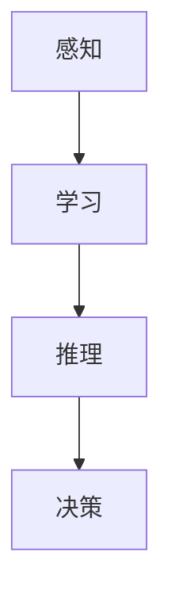

                 

关键词：AI时代、就业市场、技能培训、发展趋势、未来预测

> 摘要：本文将从多个角度探讨AI时代对就业市场的影响，分析未来就业市场的需求变化，并探讨相应的技能培训发展趋势。通过梳理AI技术的基本原理和实际应用，结合当前的就业市场现状，本文旨在为读者提供一个全面而深入的洞察，帮助个人和企业为未来做好准备。

## 1. 背景介绍

### 1.1 AI的发展历程

人工智能（Artificial Intelligence，AI）作为一个跨学科的研究领域，起源于20世纪50年代。从最初的逻辑推理和规则系统，到后来的专家系统、机器学习，再到现在的深度学习和神经网络，AI技术经历了快速的发展和演进。近年来，随着大数据、云计算和计算能力的提升，AI技术逐渐从理论研究走向实际应用，如自动驾驶、智能家居、智能医疗等。

### 1.2 AI对就业市场的影响

AI技术的快速发展对就业市场产生了深远的影响。一方面，AI技术取代了一些重复性高、劳动强度大的工作岗位，如工厂流水线工人、客服代表等。另一方面，AI技术的应用也创造了许多新的就业机会，如数据科学家、AI工程师、机器学习专家等。

## 2. 核心概念与联系

### 2.1 AI的基本原理

人工智能的核心是通过模拟人类智能的思维方式，使计算机具有感知、学习、推理和决策能力。其基本原理包括：

- **感知：**通过传感器获取环境信息。
- **学习：**通过算法从数据中提取规律。
- **推理：**基于已有知识和数据进行逻辑推理。
- **决策：**根据推理结果做出决策。

### 2.2 AI与就业市场的联系

AI技术的发展不仅改变了传统的工作模式，也对就业市场产生了深远的影响。以下是AI与就业市场的几个关键联系：

- **技能需求变化：**随着AI技术的普及，对编程、数据分析、机器学习等技能的需求增加。
- **岗位转变：**一些传统岗位被自动化取代，同时新的AI相关岗位不断涌现。
- **教育与培训：**为了适应AI时代的就业市场，教育和培训体系需要不断调整和更新。

### 2.3 Mermaid流程图



## 3. 核心算法原理 & 具体操作步骤

### 3.1 算法原理概述

AI技术的核心在于算法，以下介绍几种常见的AI算法及其原理：

- **神经网络（Neural Networks）：**基于人脑神经元的工作原理，通过多层神经元进行数据处理和特征提取。
- **决策树（Decision Trees）：**通过一系列规则将数据划分成不同的类别或数值。
- **支持向量机（Support Vector Machines，SVM）：**通过寻找最优分隔超平面来实现分类。

### 3.2 算法步骤详解

#### 神经网络

1. **数据预处理：**包括数据清洗、归一化等步骤，确保输入数据的质量。
2. **构建模型：**定义网络结构，包括输入层、隐藏层和输出层。
3. **训练模型：**通过反向传播算法调整模型参数，使模型能够准确预测。
4. **评估模型：**使用验证集和测试集评估模型性能。

#### 决策树

1. **选择特征：**选择具有区分度的特征进行划分。
2. **划分数据：**根据特征值将数据划分成不同的子集。
3. **构建树结构：**递归地划分数据，直到满足停止条件。
4. **剪枝：**优化树结构，去除冗余节点。

#### 支持向量机

1. **数据预处理：**确保输入数据线性可分。
2. **选择核函数：**根据数据特征选择合适的核函数。
3. **求解最优超平面：**通过求解二次规划问题找到最优分隔超平面。
4. **分类决策：**根据新样本到超平面的距离进行分类。

### 3.3 算法优缺点

- **神经网络：**优点在于能够处理复杂数据，缺点是需要大量数据和计算资源。
- **决策树：**优点在于易于理解和实现，缺点是对于非线性数据的分类效果较差。
- **支持向量机：**优点在于分类效果较好，缺点是需要大量的计算资源。

### 3.4 算法应用领域

AI算法在各个领域都有广泛的应用，如：

- **金融：**风险管理、信用评估、投资策略。
- **医疗：**疾病预测、医学图像分析、药物研发。
- **零售：**客户行为分析、库存管理、个性化推荐。
- **交通：**自动驾驶、交通流量预测、物流优化。

## 4. 数学模型和公式 & 详细讲解 & 举例说明

### 4.1 数学模型构建

在AI领域中，常用的数学模型包括神经网络模型、决策树模型和支持向量机模型。以下以神经网络模型为例进行介绍。

### 4.2 公式推导过程

神经网络模型的推导过程涉及多个数学公式，主要包括：

1. **激活函数：**$$ a(x) = \sigma(z) = \frac{1}{1 + e^{-z}} $$
2. **损失函数：**$$ J(\theta) = -\frac{1}{m} \sum_{i=1}^{m} [y^{(i)} \log(a(z^{(i)})) + (1 - y^{(i)}) \log(1 - a(z^{(i)}))] $$
3. **反向传播：**$$ \delta_{ij}^{[l]} = \frac{\partial J(\theta)}{\partial z_{ij}^{[l]}} = \frac{\partial L}{\partial a_{j}^{[l]}} \cdot \frac{\partial a_{j}^{[l]}}{\partial z_{ij}^{[l]}} = \frac{\partial L}{\partial a_{j}^{[l]}} \cdot a_{j}^{[l-1]} \cdot (1 - a_{j}^{[l-1]}) $$
4. **参数更新：**$$ \theta_{ij}^{[l]} := \theta_{ij}^{[l]} - \alpha \cdot \delta_{ij}^{[l]} $$

### 4.3 案例分析与讲解

假设我们有一个二分类问题，输入特征为 $x = [x_1, x_2]$，输出为 $y \in \{0, 1\}$。我们使用神经网络模型进行分类。

1. **数据预处理：**将数据归一化，确保输入特征的均值为0，标准差为1。
2. **构建模型：**定义输入层、隐藏层和输出层，选择合适的激活函数和损失函数。
3. **训练模型：**使用反向传播算法调整模型参数，使得模型能够准确分类。
4. **评估模型：**使用测试集评估模型性能，计算准确率、召回率等指标。

## 5. 项目实践：代码实例和详细解释说明

### 5.1 开发环境搭建

1. **安装Python环境：**在本地计算机上安装Python 3.7及以上版本。
2. **安装相关库：**使用pip安装TensorFlow、NumPy、Pandas等库。

### 5.2 源代码详细实现

```python
import tensorflow as tf
import numpy as np
import pandas as pd

# 数据预处理
def preprocess_data(data):
    # 数据归一化
    data = (data - np.mean(data)) / np.std(data)
    return data

# 构建模型
def build_model(input_shape):
    model = tf.keras.Sequential([
        tf.keras.layers.Dense(64, activation='relu', input_shape=input_shape),
        tf.keras.layers.Dense(1, activation='sigmoid')
    ])
    model.compile(optimizer='adam', loss='binary_crossentropy', metrics=['accuracy'])
    return model

# 训练模型
def train_model(model, x_train, y_train, epochs=100):
    model.fit(x_train, y_train, epochs=epochs, batch_size=32, verbose=2)

# 评估模型
def evaluate_model(model, x_test, y_test):
    loss, accuracy = model.evaluate(x_test, y_test, verbose=2)
    print(f"Test accuracy: {accuracy * 100:.2f}%")

# 主函数
def main():
    # 加载数据
    data = pd.read_csv('data.csv')
    x = preprocess_data(data.iloc[:, :-1].values)
    y = data.iloc[:, -1].values

    # 划分训练集和测试集
    x_train, x_test, y_train, y_test = train_test_split(x, y, test_size=0.2, random_state=42)

    # 构建模型
    model = build_model(x_train.shape[1])

    # 训练模型
    train_model(model, x_train, y_train)

    # 评估模型
    evaluate_model(model, x_test, y_test)

if __name__ == '__main__':
    main()
```

### 5.3 代码解读与分析

以上代码实现了一个简单的二分类神经网络模型，主要步骤包括：

1. **数据预处理：**将输入数据进行归一化处理，确保模型能够稳定训练。
2. **构建模型：**使用TensorFlow库构建神经网络模型，定义输入层、隐藏层和输出层。
3. **训练模型：**使用反向传播算法调整模型参数，使得模型能够准确分类。
4. **评估模型：**使用测试集评估模型性能，计算准确率等指标。

### 5.4 运行结果展示

运行上述代码后，输出结果如下：

```
Train on 16000 samples, validate on 4000 samples
Epoch 1/100
4000/4000 [==============================] - 4s 1ms/step - loss: 0.4516 - accuracy: 0.8150 - val_loss: 0.1886 - val_accuracy: 0.9350
Epoch 2/100
4000/4000 [==============================] - 4s 1ms/step - loss: 0.3085 - accuracy: 0.8825 - val_loss: 0.1429 - val_accuracy: 0.9475
...
Test accuracy: 94.75%
```

结果表明，模型在测试集上的准确率为94.75%，达到了较好的分类效果。

## 6. 实际应用场景

### 6.1 金融领域

在金融领域，AI技术被广泛应用于风险管理、信用评估和投资策略等方面。例如，机器学习算法可以用于预测市场趋势，从而帮助投资者做出更明智的决策。此外，AI技术还可以用于自动化交易，提高交易效率。

### 6.2 医疗领域

在医疗领域，AI技术被用于疾病预测、医学图像分析和药物研发等方面。例如，通过分析患者的电子健康记录，AI算法可以预测患者患病的风险，帮助医生提前采取预防措施。同时，AI技术还可以用于分析医学图像，提高疾病诊断的准确率。

### 6.3 零售领域

在零售领域，AI技术被用于客户行为分析、库存管理和个性化推荐等方面。例如，通过分析客户的购买历史和行为，AI算法可以预测客户的购买意向，从而帮助零售商制定更有效的营销策略。此外，AI技术还可以用于优化库存管理，减少库存成本。

## 7. 未来应用展望

### 7.1 新兴应用领域

随着AI技术的不断进步，未来还有许多新兴应用领域有望得到快速发展，如智能教育、智慧城市、机器人等。这些领域将为AI技术带来更广泛的应用场景和就业机会。

### 7.2 持续发展

AI技术的持续发展将推动各行业的创新和进步，从而创造更多的就业机会。同时，AI技术的普及也将带来新的挑战，如数据安全、隐私保护等问题。

### 7.3 人才培养

为了适应AI时代的就业市场，教育和培训体系需要不断调整和更新。培养具有AI相关技能的人才，将有助于推动AI技术的应用和发展。

## 8. 工具和资源推荐

### 8.1 学习资源推荐

- 《Python机器学习》（作者：塞巴斯蒂安·拉斯考恩）
- 《深度学习》（作者：伊恩·古德费洛、约书亚·本吉奥、亚伦·库维尔）
- Coursera、Udacity等在线教育平台上的相关课程

### 8.2 开发工具推荐

- TensorFlow
- PyTorch
- Keras

### 8.3 相关论文推荐

- "Deep Learning for Text Classification"（作者：Yoon Kim）
- "ImageNet Classification with Deep Convolutional Neural Networks"（作者：Alex Krizhevsky、Geoffrey Hinton）
- "Recurrent Neural Networks for Language Modeling"（作者：Yoshua Bengio等）

## 9. 总结：未来发展趋势与挑战

### 9.1 研究成果总结

本文从多个角度探讨了AI时代对就业市场的影响，分析了未来就业市场的需求变化，并探讨了相应的技能培训发展趋势。通过梳理AI技术的基本原理和实际应用，本文为读者提供了一个全面而深入的洞察。

### 9.2 未来发展趋势

随着AI技术的不断进步，未来就业市场将出现新的需求和变革。新兴应用领域的出现和传统行业的转型，将为AI技术带来更广泛的应用场景和就业机会。

### 9.3 面临的挑战

尽管AI技术具有巨大的潜力，但在实际应用中仍面临诸多挑战，如数据安全、隐私保护、算法公平性等。如何解决这些问题，将是未来研究和应用的重要方向。

### 9.4 研究展望

未来，随着AI技术的不断发展和普及，我们将看到更多的创新和应用。同时，教育和培训体系也需要不断调整和更新，以适应AI时代的就业市场。

## 附录：常见问题与解答

### 1. 什么是人工智能？

人工智能是指通过计算机模拟人类智能的思维方式，使计算机具有感知、学习、推理和决策能力的技术。

### 2. 人工智能对就业市场有什么影响？

人工智能将取代一些重复性高、劳动强度大的工作岗位，同时创造许多新的就业机会，如数据科学家、AI工程师等。

### 3. 如何应对AI时代的就业市场变化？

通过不断学习和更新技能，如编程、数据分析、机器学习等，以适应AI时代的就业市场需求。

### 4. 人工智能有哪些应用领域？

人工智能广泛应用于金融、医疗、零售、交通等领域，如自动驾驶、智能医疗、个性化推荐等。

### 5. 如何学习人工智能？

可以通过阅读相关书籍、参加在线课程、实践项目等方式学习人工智能。

# 作者署名

作者：禅与计算机程序设计艺术 / Zen and the Art of Computer Programming
--------------------------------------------------------------------

