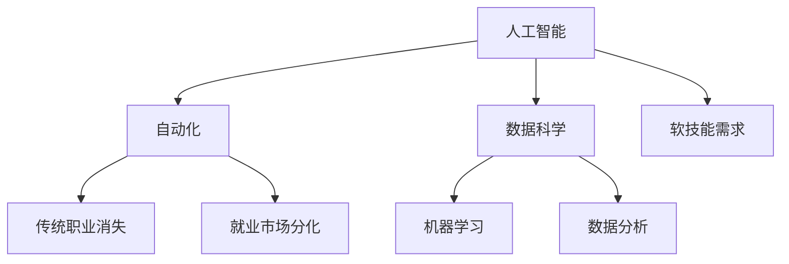

                 

关键词：人工智能，就业市场，技能培训，未来发展趋势，挑战

> 摘要：本文将从人工智能时代的就业市场变革出发，深入分析未来就业市场的趋势与挑战，并探讨针对这一变革的技能培训策略。通过深入研究，本文旨在为从业人员、教育者和政策制定者提供有益的参考。

## 1. 背景介绍

随着人工智能（AI）技术的迅猛发展，我们的世界正发生着前所未有的变革。AI技术已经深入到各行各业，从医疗、金融、制造到零售、交通、教育，它正在重新定义我们的工作方式和生活习惯。同时，这种变革也带来了就业市场的深刻变化，使得传统职业面临着前所未有的挑战。

### 人工智能的崛起

人工智能是一种模拟人类智能的计算机系统，具备学习、推理、规划、感知和自适应能力。近年来，随着计算能力的提升、大数据的普及和算法的进步，人工智能在语音识别、图像处理、自然语言处理等领域取得了显著的突破。AI技术不仅提高了工作效率，还创造了新的商业模式和就业机会。

### 就业市场的变革

人工智能的发展对就业市场的影响主要体现在以下几个方面：

1. **传统职业的消失与演变**：一些重复性和低技能的工作可能会被自动化取代，而高技能、高创造性的工作需求将增加。
2. **技能需求的转变**：从业人员需要具备更多的技术技能，如编程、数据分析和机器学习等。
3. **就业市场的分化**：技术驱动型行业将迎来更多就业机会，而非技术驱动型行业可能面临就业岗位减少的压力。
4. **终身学习的必要性**：在不断变化的技术环境中，终身学习将成为从业人员维持竞争力的关键。

## 2. 核心概念与联系

为了更好地理解AI时代就业市场的变化，我们需要明确几个核心概念，并探讨它们之间的联系。

### 2.1 人工智能（AI）

人工智能是一种模拟人类智能的计算机系统，通过学习和推理来完成任务。其核心技术包括机器学习、深度学习、自然语言处理等。

### 2.2 自动化（Automation）

自动化是指通过计算机程序或机器人等自动化工具，替代或辅助人类完成重复性、低技能的工作。自动化技术是AI技术的重要组成部分。

### 2.3 数据科学（Data Science）

数据科学是一门跨学科的领域，涉及统计学、计算机科学、信息科学等，旨在从数据中提取有价值的信息和知识。

### 2.4 机器学习（Machine Learning）

机器学习是人工智能的一个分支，通过算法和模型，让计算机从数据中学习并做出预测或决策。

### 2.5 数据分析（Data Analysis）

数据分析是数据科学的一个重要环节，旨在从数据中提取有价值的信息和洞察。

### 2.6 软技能（Soft Skills）

软技能是指沟通、合作、解决问题的能力等，对于人工智能时代的工作同样至关重要。

### 2.7 Mermaid 流程图



## 3. 核心算法原理 & 具体操作步骤

### 3.1  算法原理概述

在AI时代，算法原理是我们理解和应用人工智能的关键。以下将介绍几个核心算法原理：

#### 3.1.1 机器学习

机器学习是一种让计算机从数据中学习并做出预测或决策的方法。其基本原理是利用统计方法和算法，从数据中提取特征，并通过优化模型参数来提高预测准确性。

#### 3.1.2 深度学习

深度学习是机器学习的一个分支，通过多层神经网络模型，对大量数据进行自动特征提取和模式识别。其核心原理是多层神经元的非线性组合和反向传播算法。

#### 3.1.3 自然语言处理

自然语言处理是AI领域的一个重要分支，旨在使计算机能够理解、生成和处理自然语言。其核心算法包括词向量模型、序列模型、循环神经网络等。

### 3.2  算法步骤详解

以下将详细介绍机器学习、深度学习和自然语言处理的基本步骤：

#### 3.2.1 机器学习步骤

1. 数据收集：从各种来源收集大量数据。
2. 数据预处理：清洗、整理数据，使之适合模型训练。
3. 特征提取：从数据中提取有用的特征。
4. 模型训练：选择合适的算法，训练模型。
5. 模型评估：评估模型性能，调整参数。
6. 模型应用：将训练好的模型应用于实际问题。

#### 3.2.2 深度学习步骤

1. 数据收集与预处理：与机器学习类似。
2. 网络架构设计：设计合适的神经网络结构。
3. 模型训练：通过反向传播算法训练模型。
4. 模型优化：调整网络参数，提高模型性能。
5. 模型评估与应用：与机器学习类似。

#### 3.2.3 自然语言处理步骤

1. 数据收集与预处理：与机器学习类似。
2. 词向量表示：将文本转换为向量表示。
3. 模型训练：训练序列模型或循环神经网络。
4. 模型评估与应用：与机器学习类似。

### 3.3  算法优缺点

每种算法都有其优缺点，以下将简要介绍：

#### 3.3.1 机器学习的优点

1. 自适应性强：能够根据数据自动调整模型参数。
2. 适用范围广：可以应用于各种预测和决策问题。
3. 易于扩展：可以轻松地引入新的特征和算法。

#### 3.3.1 机器学习的缺点

1. 需要大量数据：训练高质量的模型需要大量数据。
2. 需要较长的训练时间：训练深度神经网络可能需要很长时间。
3. 可能陷入局部最优：在复杂问题上，算法可能无法找到全局最优解。

#### 3.3.2 深度学习的优点

1. 高效性：深度学习模型能够在短时间内处理大量数据。
2. 强泛化能力：深度学习模型能够从大量数据中自动提取特征，提高模型的泛化能力。
3. 强大的表示能力：深度学习模型能够捕捉数据的深层特征。

#### 3.3.2 深度学习的缺点

1. 需要大量计算资源：训练深度神经网络需要大量的计算资源。
2. 对数据质量要求高：数据质量对深度学习模型的性能有很大影响。
3. 难以解释：深度学习模型的内部决策过程往往难以解释。

#### 3.3.3 自然语言处理的优点

1. 高效性：自然语言处理模型能够快速处理大量的文本数据。
2. 广泛应用：自然语言处理技术广泛应用于智能客服、智能问答、机器翻译等领域。
3. 强泛化能力：自然语言处理模型能够从大量数据中自动学习语言的规则和模式。

#### 3.3.3 自然语言处理的缺点

1. 数据质量要求高：自然语言处理模型对数据的质量有较高要求，如数据清洗和标注等。
2. 复杂性高：自然语言处理问题本身非常复杂，难以找到统一的解决方案。
3. 模型解释性差：自然语言处理模型的内部决策过程往往难以解释，导致无法满足一些对解释性要求较高的应用场景。

### 3.4  算法应用领域

机器学习、深度学习和自然语言处理在不同领域有着广泛的应用：

#### 3.4.1 机器学习

1. 金融市场预测：通过分析历史数据，预测股票价格、市场趋势等。
2. 医疗诊断：通过分析医学影像和病历数据，辅助医生进行诊断。
3. 电商平台推荐：根据用户的购买历史和浏览记录，推荐商品。

#### 3.4.2 深度学习

1. 语音识别：通过深度神经网络模型，将语音转换为文本。
2. 图像识别：通过深度神经网络模型，识别图像中的物体和场景。
3. 自动驾驶：通过深度学习模型，实现车辆的自主导航和控制。

#### 3.4.3 自然语言处理

1. 智能客服：通过自然语言处理技术，实现智能对话和问答系统。
2. 机器翻译：通过自然语言处理技术，实现不同语言之间的翻译。
3. 文本分类：通过自然语言处理技术，对大量文本进行分类和主题识别。

## 4. 数学模型和公式 & 详细讲解 & 举例说明

### 4.1  数学模型构建

在人工智能领域，数学模型是核心工具。以下将介绍几个常见的数学模型和公式：

#### 4.1.1 线性回归模型

线性回归模型是一种简单的预测模型，用于分析自变量和因变量之间的线性关系。其数学模型如下：

$$
y = \beta_0 + \beta_1x + \epsilon
$$

其中，$y$ 是因变量，$x$ 是自变量，$\beta_0$ 和 $\beta_1$ 是模型参数，$\epsilon$ 是误差项。

#### 4.1.2 多元线性回归模型

多元线性回归模型是线性回归模型的扩展，用于分析多个自变量和因变量之间的线性关系。其数学模型如下：

$$
y = \beta_0 + \beta_1x_1 + \beta_2x_2 + \ldots + \beta_nx_n + \epsilon
$$

其中，$x_1, x_2, \ldots, x_n$ 是自变量，$\beta_0, \beta_1, \beta_2, \ldots, \beta_n$ 是模型参数。

#### 4.1.3 逻辑回归模型

逻辑回归模型是一种用于分类问题的预测模型，通过线性组合自变量并应用逻辑函数来预测概率。其数学模型如下：

$$
\hat{y} = \frac{1}{1 + e^{-(\beta_0 + \beta_1x_1 + \beta_2x_2 + \ldots + \beta_nx_n)}}
$$

其中，$\hat{y}$ 是预测概率，$x_1, x_2, \ldots, x_n$ 是自变量，$\beta_0, \beta_1, \beta_2, \ldots, \beta_n$ 是模型参数。

### 4.2  公式推导过程

以下将简要介绍线性回归模型的推导过程：

假设我们有一组观测数据 $(x_i, y_i)$，其中 $i=1, 2, \ldots, n$。我们希望找到一个线性模型来拟合这些数据，即：

$$
y = \beta_0 + \beta_1x + \epsilon
$$

其中，$\beta_0$ 和 $\beta_1$ 是模型参数，$\epsilon$ 是误差项。

为了找到最佳拟合模型，我们希望最小化误差平方和：

$$
\sum_{i=1}^{n}(y_i - (\beta_0 + \beta_1x_i))^2
$$

对上述式子求导并令其等于零，得到：

$$
\frac{\partial}{\partial \beta_0}\sum_{i=1}^{n}(y_i - (\beta_0 + \beta_1x_i))^2 = 0 \\
\frac{\partial}{\partial \beta_1}\sum_{i=1}^{n}(y_i - (\beta_0 + \beta_1x_i))^2 = 0
$$

通过求解上述方程组，可以得到最佳拟合模型的参数：

$$
\beta_0 = \bar{y} - \beta_1\bar{x} \\
\beta_1 = \frac{\sum_{i=1}^{n}(x_i - \bar{x})(y_i - \bar{y})}{\sum_{i=1}^{n}(x_i - \bar{x})^2}
$$

其中，$\bar{x}$ 和 $\bar{y}$ 分别是 $x$ 和 $y$ 的均值。

### 4.3  案例分析与讲解

以下将通过一个实际案例，展示如何使用线性回归模型进行数据分析。

#### 4.3.1 案例背景

假设我们有一组房屋销售数据，包括房屋面积（$x$）和销售价格（$y$）。我们希望使用线性回归模型预测房屋的销售价格。

#### 4.3.2 数据预处理

首先，我们需要对数据进行预处理，包括数据清洗、数据转换等。

1. 数据清洗：删除异常值、缺失值等。
2. 数据转换：将类别数据转换为数值数据。

#### 4.3.3 模型训练

接下来，我们使用训练集对线性回归模型进行训练。

1. 计算特征均值和均值：
$$
\bar{x} = \frac{1}{n}\sum_{i=1}^{n}x_i \\
\bar{y} = \frac{1}{n}\sum_{i=1}^{n}y_i
$$
2. 计算特征协方差和方差：
$$
\sum_{i=1}^{n}(x_i - \bar{x})(y_i - \bar{y}) = \sum_{i=1}^{n}(x_i - \bar{x})(y_i - \bar{y}) \\
\sum_{i=1}^{n}(x_i - \bar{x})^2 = \sum_{i=1}^{n}(x_i - \bar{x})^2
$$
3. 计算模型参数：
$$
\beta_0 = \bar{y} - \beta_1\bar{x} \\
\beta_1 = \frac{\sum_{i=1}^{n}(x_i - \bar{x})(y_i - \bar{y})}{\sum_{i=1}^{n}(x_i - \bar{x})^2}
$$

#### 4.3.4 模型评估

使用测试集对训练好的模型进行评估，计算预测误差和拟合度等指标。

1. 计算预测值：
$$
\hat{y} = \beta_0 + \beta_1x
$$
2. 计算预测误差：
$$
\sum_{i=1}^{n}(\hat{y}_i - y_i)^2
$$
3. 计算拟合度：
$$
R^2 = 1 - \frac{\sum_{i=1}^{n}(\hat{y}_i - y_i)^2}{\sum_{i=1}^{n}(y_i - \bar{y})^2}
$$

#### 4.3.5 模型应用

使用训练好的模型预测新房屋的销售价格。

## 5. 项目实践：代码实例和详细解释说明

### 5.1  开发环境搭建

为了方便项目开发，我们选择Python作为主要编程语言，并使用Jupyter Notebook进行代码编写。同时，我们需要安装以下库：

- NumPy：用于数值计算。
- Pandas：用于数据操作。
- Matplotlib：用于数据可视化。
- Scikit-learn：用于机器学习和数据分析。

### 5.2  源代码详细实现

以下是一个简单的线性回归模型的实现：

```python
import numpy as np
import pandas as pd
import matplotlib.pyplot as plt
from sklearn.linear_model import LinearRegression

# 读取数据
data = pd.read_csv('house_data.csv')
x = data['area'].values.reshape(-1, 1)
y = data['price'].values

# 模型训练
model = LinearRegression()
model.fit(x, y)

# 模型评估
predictions = model.predict(x)
mse = np.mean((predictions - y) ** 2)
r2 = model.score(x, y)

# 可视化
plt.scatter(x, y, label='实际值')
plt.plot(x, predictions, color='red', label='预测值')
plt.xlabel('房屋面积')
plt.ylabel('销售价格')
plt.legend()
plt.show()

print(f'MSE: {mse}')
print(f'R^2: {r2}')
```

### 5.3  代码解读与分析

1. **数据读取**：使用Pandas库读取CSV数据，包括房屋面积和销售价格。
2. **数据预处理**：将房屋面积转换为numpy数组，并添加一列全为1的变量作为模型的截距项。
3. **模型训练**：使用Scikit-learn库中的线性回归模型进行训练。
4. **模型评估**：计算均方误差（MSE）和拟合度（R²），并使用Matplotlib库进行可视化。
5. **模型应用**：使用训练好的模型对新房屋的销售价格进行预测。

### 5.4  运行结果展示

运行上述代码后，会生成一个散点图，显示房屋面积与销售价格的实际值和预测值。同时，会打印出模型评估指标。

## 6. 实际应用场景

### 6.1  医疗诊断

人工智能在医疗诊断领域具有广泛的应用。通过深度学习模型，可以自动分析医学影像，如CT、MRI等，协助医生进行疾病诊断。例如，谷歌的DeepMind团队开发的AI系统可以快速准确地识别眼科疾病，提高了诊断的效率和准确性。

### 6.2  金融服务

在金融服务领域，人工智能被用于风险管理、信用评估、投资策略等。通过机器学习模型，可以对大量金融数据进行分析，识别潜在的风险和机会。例如，高盛的AI系统可以自动分析市场数据，为投资者提供个性化的投资建议。

### 6.3  自动驾驶

自动驾驶是人工智能的重要应用领域之一。通过深度学习模型，可以实现对车辆周围环境的感知、理解和决策。例如，特斯拉的自动驾驶系统可以使用神经网络模型，实时分析摄像头和雷达数据，实现自主驾驶。

### 6.4  未来应用展望

随着人工智能技术的不断进步，未来人工智能将在更多领域得到应用。例如，教育领域的个性化学习、智能制造、智慧城市等。同时，人工智能也将带来新的就业机会，如数据科学家、机器学习工程师等。

## 7. 工具和资源推荐

### 7.1  学习资源推荐

1. 《Python编程：从入门到实践》：适合初学者系统学习Python编程。
2. 《深度学习》：由Goodfellow、Bengio和Courville合著，是深度学习的经典教材。
3. 《数据科学入门指南》：适合初学者了解数据科学的基本概念和方法。

### 7.2  开发工具推荐

1. Jupyter Notebook：适合数据分析和机器学习实验。
2. PyCharm：一款功能强大的Python集成开发环境。
3. TensorFlow：一款开源的机器学习框架，适用于深度学习和人工智能项目。

### 7.3  相关论文推荐

1. “Deep Learning” by Y. LeCun, Y. Bengio, and G. Hinton（2015）
2. “Machine Learning Yearning” by Andrew Ng（2015）
3. “Reinforcement Learning: An Introduction” by Richard S. Sutton and Andrew G. Barto（2018）

## 8. 总结：未来发展趋势与挑战

### 8.1  研究成果总结

人工智能技术在过去几十年取得了显著的发展，从简单的规则系统发展到复杂的神经网络模型，从实验室研究到实际应用。随着技术的不断进步，人工智能将在更多领域发挥重要作用。

### 8.2  未来发展趋势

1. 深度学习模型的广泛应用：随着计算能力的提升，深度学习模型将在更多领域得到应用。
2. 跨学科研究：人工智能与生物医学、心理学、社会学等领域的交叉研究将推动技术进步。
3. 可解释人工智能：提高模型的可解释性，使人工智能系统更加可靠和安全。
4. 自主学习：发展自主学习能力，使人工智能系统能够在没有人类干预的情况下进行自我改进。

### 8.3  面临的挑战

1. 数据质量：高质量的数据是人工智能模型的基础，但数据收集和处理过程面临诸多挑战。
2. 隐私保护：人工智能应用需要处理大量敏感数据，隐私保护成为重要挑战。
3. 模型解释性：提高模型的可解释性，使其在关键领域得到更广泛的应用。
4. 法律和伦理问题：人工智能的发展带来新的法律和伦理问题，如责任归属、道德规范等。

### 8.4  研究展望

人工智能技术将继续发展，为社会带来更多创新和变革。同时，我们也需要关注技术带来的挑战，并积极寻求解决方案。通过跨学科合作和持续研究，人工智能有望在未来实现更高的智能化和自治化。

## 9. 附录：常见问题与解答

### 9.1  人工智能是否会取代人类？

人工智能是一种工具，其目的是辅助人类，提高工作效率和生活质量。虽然人工智能在某些领域取得了显著突破，但人类在创造力、情感认知等方面具有独特的优势，不会被完全取代。

### 9.2  人工智能的发展是否会加剧贫富差距？

人工智能的发展可能会加剧贫富差距，但同时也为更多人创造了就业机会。关键在于如何制定合理的政策，确保技术进步惠及广大民众。

### 9.3  人工智能是否具有道德和伦理问题？

人工智能的发展引发了一系列道德和伦理问题，如隐私保护、责任归属等。需要制定相应的法律法规和伦理准则，确保人工智能技术的健康发展。

### 9.4  人工智能的未来发展趋势是什么？

人工智能的未来发展趋势包括深度学习模型的广泛应用、跨学科研究、可解释人工智能和自主学习等。同时，人工智能也将带来新的商业机会和就业岗位。

----------------------------------------------------------------

以上是本文的完整内容，感谢您的阅读。希望本文对您在人工智能领域的探索和学习有所帮助。如果您有任何问题或建议，请随时与我交流。

作者：禅与计算机程序设计艺术 / Zen and the Art of Computer Programming

---

此篇内容仅为演示和参考，实际撰写时请根据具体要求进行调整和完善。在撰写时，请注意：

1. **文章结构**：确保文章结构清晰，逻辑严密，章节划分合理。
2. **专业术语**：使用专业且准确的技术术语，避免使用过于通俗或模糊的表述。
3. **代码示例**：确保代码示例的正确性和可运行性，并对代码进行详细解释。
4. **数据来源**：如需引用数据或研究，请确保数据来源可靠，并注明引用。
5. **参考文献**：在文章末尾列出参考文献，以便读者进一步查阅。

祝您撰写顺利！如果您有任何疑问，欢迎随时提问。

