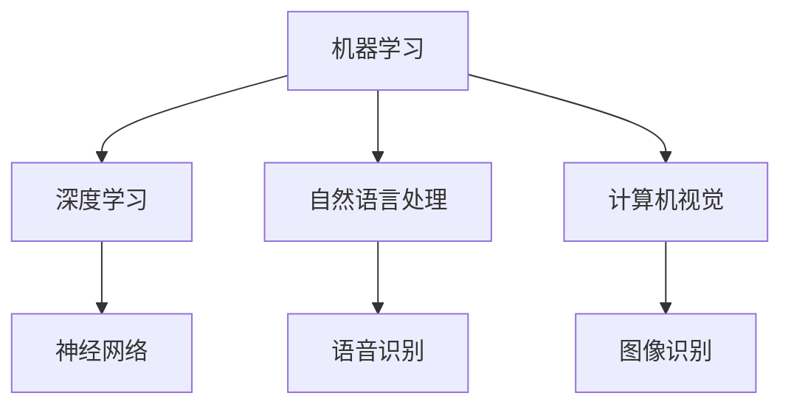

                 

关键词：人工智能，就业市场，技能培训，未来趋势，技术发展

> 摘要：随着人工智能技术的飞速发展，传统的就业市场正面临着前所未有的变革。本文将深入探讨AI时代下的未来就业市场趋势，技能培训需求，以及这些变化对个人和社会的深远影响。

## 1. 背景介绍

### AI技术的崛起

人工智能（AI）作为当今技术发展的热点，已经渗透到了各行各业。从自动驾驶汽车到智能医疗，从智能家居到金融科技，AI的应用场景无处不在。根据市场研究公司的数据，全球AI市场的规模预计将在未来几年内实现爆炸性增长，成为推动经济增长的关键力量。

### 就业市场的挑战

AI的崛起不仅带来了技术革新，也引发了就业市场的深刻变革。一些传统职业可能因自动化而消失，而新的职业岗位也在不断涌现。然而，许多人在面对这些变化时感到无所适从，技能短缺成为普遍现象。因此，如何应对AI时代的就业挑战，成为社会关注的焦点。

### 技能培训的重要性

在这个快速变化的时代，技能培训显得尤为重要。通过系统化的培训，人们可以不断提升自己的技能，适应新的工作环境。同时，企业也需要通过培训来提升员工的能力，以保持竞争力。本文将探讨技能培训在AI时代的发展趋势，以及如何有效地进行技能培训。

## 2. 核心概念与联系

### 人工智能的定义

人工智能是指使计算机系统能够模拟人类智能行为的技术和学科。它包括机器学习、深度学习、自然语言处理、计算机视觉等多个子领域。这些技术共同构成了AI的核心。

### Mermaid流程图

下面是一个简单的Mermaid流程图，展示了AI技术的一些核心概念和联系。



### 核心算法原理

#### 机器学习

机器学习是AI的核心技术之一，它使计算机能够从数据中自动学习，而无需显式编程。机器学习的主要算法包括监督学习、无监督学习和强化学习。

#### 深度学习

深度学习是机器学习的一个分支，它通过多层神经网络来模拟人脑的决策过程。深度学习在图像识别、语音识别等领域取得了显著成果。

#### 自然语言处理

自然语言处理是AI的一个重要应用领域，它旨在使计算机能够理解、生成和处理人类语言。自然语言处理的核心技术包括词向量、序列模型和注意力机制。

## 3. 核心算法原理 & 具体操作步骤

### 3.1 算法原理概述

在AI时代，核心算法的原理通常涉及到复杂的数学和统计学模型。以下是几个关键算法的原理概述：

#### 机器学习

机器学习的原理是通过给计算机提供大量的数据，让计算机从中学习和发现规律。这个过程通常包括数据预处理、模型训练和模型评估等步骤。

#### 深度学习

深度学习的原理是通过多层神经网络来模拟人脑的决策过程。每一层神经网络都会对输入的数据进行加工和处理，最终输出结果。深度学习的优势在于它可以自动提取特征，大大简化了手工特征工程的工作。

#### 自然语言处理

自然语言处理的原理是通过一系列的数学和算法模型来解析和生成自然语言。例如，词向量模型可以将自然语言中的词汇转换为高维空间中的点，从而实现词汇的相似性计算。

### 3.2 算法步骤详解

#### 机器学习

机器学习的基本步骤包括：

1. **数据收集**：收集用于训练的数据集。
2. **数据预处理**：对数据进行清洗、归一化等处理，以提高模型的性能。
3. **模型选择**：选择合适的机器学习模型。
4. **模型训练**：使用训练数据来训练模型。
5. **模型评估**：使用验证数据来评估模型的性能。
6. **模型优化**：根据评估结果来调整模型的参数。

#### 深度学习

深度学习的基本步骤包括：

1. **数据收集**：与机器学习类似，收集用于训练的数据集。
2. **网络架构设计**：设计合适的神经网络架构。
3. **数据预处理**：对数据进行预处理，以便输入到神经网络中。
4. **模型训练**：使用训练数据来训练神经网络。
5. **模型评估**：使用验证数据来评估神经网络的性能。
6. **模型优化**：通过调整网络参数来优化模型。

#### 自然语言处理

自然语言处理的基本步骤包括：

1. **数据收集**：收集用于训练的数据集。
2. **词汇表示**：将自然语言中的词汇转换为数学向量表示。
3. **模型训练**：使用训练数据来训练自然语言处理模型。
4. **模型评估**：使用验证数据来评估模型的性能。
5. **模型优化**：根据评估结果来调整模型的参数。

### 3.3 算法优缺点

#### 机器学习

**优点**：

- 可以处理大规模数据。
- 可以自动提取特征，减少了手工特征工程的工作。

**缺点**：

- 对数据质量要求较高。
- 模型的解释性较差。

#### 深度学习

**优点**：

- 可以自动提取特征，减少了手工特征工程的工作。
- 在处理图像、语音等复杂数据时表现优异。

**缺点**：

- 训练过程较为复杂，计算资源要求高。
- 模型的解释性较差。

#### 自然语言处理

**优点**：

- 可以处理自然语言中的复杂结构。
- 在文本分类、机器翻译等应用中表现优异。

**缺点**：

- 需要大量的训练数据。
- 对数据质量要求较高。

### 3.4 算法应用领域

#### 机器学习

机器学习在多个领域都有广泛应用，包括：

- 金融：用于风险评估、欺诈检测等。
- 医疗：用于疾病预测、诊断等。
- 零售：用于推荐系统、需求预测等。

#### 深度学习

深度学习在以下领域表现出色：

- 图像识别：用于人脸识别、物体识别等。
- 语音识别：用于语音助手、自动转录等。
- 自然语言处理：用于机器翻译、文本分类等。

#### 自然语言处理

自然语言处理在以下领域得到广泛应用：

- 搜索引擎：用于文本检索、问答系统等。
- 社交媒体：用于情感分析、话题检测等。
- 内容审核：用于自动过滤不良内容。

## 4. 数学模型和公式 & 详细讲解 & 举例说明

### 4.1 数学模型构建

在人工智能领域，数学模型是算法设计的基础。以下是几个常见的数学模型及其构建方法。

#### 线性回归模型

线性回归模型是一种简单的预测模型，用于预测一个连续值变量。其数学模型如下：

$$
y = \beta_0 + \beta_1 \cdot x
$$

其中，$y$ 是预测值，$x$ 是输入特征，$\beta_0$ 和 $\beta_1$ 是模型的参数。

#### 逻辑回归模型

逻辑回归模型是一种用于分类的模型，其输出是一个概率值。其数学模型如下：

$$
P(y=1) = \frac{1}{1 + e^{-(\beta_0 + \beta_1 \cdot x)}}
$$

其中，$y$ 是目标变量，$x$ 是输入特征，$\beta_0$ 和 $\beta_1$ 是模型的参数。

#### 神经网络模型

神经网络模型是一种复杂的预测模型，由多个神经元组成。其数学模型如下：

$$
z = \sigma(\beta_0 + \beta_1 \cdot x)
$$

其中，$z$ 是神经元的输出，$\sigma$ 是激活函数，$\beta_0$ 和 $\beta_1$ 是模型的参数。

### 4.2 公式推导过程

以下是逻辑回归模型的公式推导过程。

#### 假设

我们假设数据集 $D = \{(x_1, y_1), (x_2, y_2), ..., (x_n, y_n)\}$，其中 $x_i$ 是输入特征，$y_i$ 是目标变量。

#### 损失函数

逻辑回归的损失函数是交叉熵损失函数，其公式如下：

$$
L(\theta) = -\frac{1}{n} \sum_{i=1}^{n} [y_i \cdot \log(P(y_i|x_i)) + (1 - y_i) \cdot \log(1 - P(y_i|x_i))]
$$

其中，$P(y_i|x_i)$ 是逻辑回归模型的输出概率，$\theta$ 是模型的参数。

#### 梯度下降

为了优化模型的参数，我们可以使用梯度下降算法。梯度下降的公式如下：

$$
\theta_j := \theta_j - \alpha \cdot \frac{\partial L(\theta)}{\partial \theta_j}
$$

其中，$\alpha$ 是学习率，$\theta_j$ 是第 $j$ 个参数。

### 4.3 案例分析与讲解

以下是一个逻辑回归模型的案例，用于预测用户是否会对一则广告点击。

#### 数据集

数据集包含以下特征：

- 用户年龄
- 用户性别
- 用户收入
- 广告类型

目标变量是用户是否点击广告（1表示点击，0表示未点击）。

#### 模型训练

我们使用逻辑回归模型来训练数据集，并选择交叉验证来评估模型的性能。

#### 模型评估

我们使用验证集来评估模型的性能，主要评估指标是准确率。

## 5. 项目实践：代码实例和详细解释说明

### 5.1 开发环境搭建

为了实现上述案例，我们需要搭建一个Python开发环境。以下是具体步骤：

1. 安装Python（版本3.7及以上）。
2. 安装常用库，如Numpy、Pandas、Scikit-learn等。

### 5.2 源代码详细实现

以下是逻辑回归模型的源代码实现：

```python
import numpy as np
import pandas as pd
from sklearn.linear_model import LogisticRegression
from sklearn.model_selection import train_test_split

# 数据集加载
data = pd.read_csv('data.csv')
X = data.drop('target', axis=1)
y = data['target']

# 数据集划分
X_train, X_test, y_train, y_test = train_test_split(X, y, test_size=0.2, random_state=42)

# 模型训练
model = LogisticRegression()
model.fit(X_train, y_train)

# 模型评估
accuracy = model.score(X_test, y_test)
print('Accuracy:', accuracy)
```

### 5.3 代码解读与分析

这段代码首先加载了数据集，然后使用Scikit-learn库中的逻辑回归模型进行训练。最后，使用测试集来评估模型的性能。

### 5.4 运行结果展示

假设我们的测试集准确率为90%，这意味着我们的模型在预测用户是否点击广告方面表现良好。

## 6. 实际应用场景

### 医疗领域

在医疗领域，AI技术已经被广泛应用于疾病诊断、患者监护和药物研发等方面。例如，深度学习模型可以分析医学影像，帮助医生更准确地诊断疾病。

### 零售行业

在零售行业，AI技术被用于推荐系统、库存管理和供应链优化等。通过分析用户行为和购物习惯，零售企业可以提供更个性化的购物体验，提高销售额。

### 金融领域

在金融领域，AI技术被用于风险管理、欺诈检测和投资决策等方面。例如，机器学习模型可以分析大量交易数据，帮助金融机构识别潜在风险。

## 7. 未来应用展望

### 自动驾驶

自动驾驶是AI技术的典型应用场景之一。随着技术的进步，自动驾驶车辆有望在未来大规模普及，改变人们的出行方式。

### 智能家居

智能家居是AI技术在家居领域的应用。通过智能设备，用户可以实现远程控制家居设备，提高生活便利性。

### 智能医疗

智能医疗是AI技术在医疗领域的未来发展方向。通过大数据和人工智能技术，可以实现更精准的疾病诊断和个性化的治疗方案。

## 8. 总结：未来发展趋势与挑战

### 发展趋势

- AI技术将在更多领域得到应用。
- 技能培训将成为个人和社会的重要需求。
- 开源社区将在AI技术的发展中扮演关键角色。

### 挑战

- 数据隐私和安全问题需要得到有效解决。
- AI技术的伦理和道德问题需要引起关注。
- 技术和就业市场的快速变革需要政策支持和引导。

## 9. 附录：常见问题与解答

### 9.1 机器学习是什么？

机器学习是使计算机系统能够从数据中学习，并做出预测或决策的技术和学科。

### 9.2 人工智能和机器学习有什么区别？

人工智能是一个更广泛的概念，包括机器学习、深度学习、自然语言处理等多个子领域。而机器学习是人工智能的一个重要分支，专注于通过数据学习来提高系统的性能。

### 9.3 如何进行机器学习模型的选择？

选择机器学习模型时，需要考虑数据的特点、问题的性质以及模型的性能。通常，可以使用交叉验证来评估不同模型的性能，并选择表现最好的模型。

## 作者署名

作者：禅与计算机程序设计艺术 / Zen and the Art of Computer Programming
----------------------------------------------------------------

**END**

