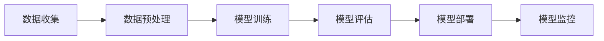

                 

关键词：人工智能，就业市场，技能发展，未来趋势，职业转型，技术技能

摘要：随着人工智能技术的飞速发展，人类计算领域正经历着深刻的变革。本文从人工智能的崛起、就业市场的变迁、技能发展的新需求以及职业转型的挑战等多个方面，探讨了AI时代未来就业市场的趋势与技能发展的方向。通过对核心算法原理的深入解析，结合数学模型和项目实践的实例，文章旨在为读者提供关于如何应对AI时代挑战的实用指导。

## 1. 背景介绍

人工智能（AI）作为现代科技的前沿领域，已经在过去几十年中取得了令人瞩目的成就。从最早的专家系统到深度学习的崛起，AI技术的进步极大地推动了各行各业的创新与变革。随着大数据、云计算、物联网等技术的发展，AI的应用场景不断扩展，从自动驾驶到智能医疗，从金融分析到智能制造，AI正逐渐渗透到我们生活的方方面面。

在这样的背景下，就业市场也发生了显著的变化。传统的职业角色和技能需求正在被重新定义，许多新兴的职业岗位应运而生。然而，与此同时，也带来了前所未有的挑战，尤其是在技能需求和职业转型方面。面对AI时代的到来，如何适应新的就业市场趋势，提升自身的技能水平，成为每个人都必须认真思考的问题。

本文将从以下几个方面展开讨论：

1. **核心概念与联系**：介绍AI时代的关键概念及其相互关系，通过Mermaid流程图展示AI系统的架构。
2. **核心算法原理 & 具体操作步骤**：详细解析人工智能的核心算法，包括算法原理、步骤、优缺点以及应用领域。
3. **数学模型和公式 & 详细讲解 & 举例说明**：讲解AI中的数学模型和公式，结合案例进行分析。
4. **项目实践：代码实例和详细解释说明**：通过实际项目实践，展示AI算法的应用。
5. **实际应用场景**：探讨AI在各个行业中的应用场景，以及未来的发展前景。
6. **工具和资源推荐**：推荐学习和开发AI所需的重要工具和资源。
7. **总结：未来发展趋势与挑战**：总结研究成果，分析未来发展趋势和面临的挑战。

## 2. 核心概念与联系

### 2.1 人工智能的定义

人工智能（Artificial Intelligence，简称AI）是指由人制造出来的系统能够模拟、延伸和扩展人类的智能行为。AI系统通过学习、推理、规划、感知和自然语言处理等技术，实现自动化决策和行动。

### 2.2 机器学习

机器学习（Machine Learning，简称ML）是AI的核心组成部分，它使得计算机系统能够从数据中学习并做出预测或决策。机器学习的方法包括监督学习、无监督学习和强化学习。

#### 2.2.1 监督学习

监督学习（Supervised Learning）是一种最常用的机器学习方法，它通过已标记的训练数据来训练模型，使得模型能够对新数据进行预测。例如，分类问题和回归问题都是监督学习的典型应用。

#### 2.2.2 无监督学习

无监督学习（Unsupervised Learning）不需要已标记的训练数据，主要任务是发现数据中的模式和结构。聚类和降维是无监督学习的两种常见方法。

#### 2.2.3 强化学习

强化学习（Reinforcement Learning）是通过试错来学习如何实现特定目标的方法。它通过奖励机制来引导模型做出最优决策。

### 2.3 深度学习

深度学习（Deep Learning，简称DL）是一种特殊的机器学习方法，它通过多层神经网络来提取数据的高级特征。深度学习在图像识别、语音识别和自然语言处理等领域取得了显著成果。

#### 2.3.1 神经网络

神经网络（Neural Network，简称NN）是深度学习的基础，它由大量相互连接的神经元组成，通过学习输入和输出之间的关系来实现复杂的函数映射。

#### 2.3.2 卷积神经网络

卷积神经网络（Convolutional Neural Network，简称CNN）是一种专门用于处理图像数据的神经网络，它通过卷积操作提取图像的特征。

#### 2.3.3 递归神经网络

递归神经网络（Recurrent Neural Network，简称RNN）是一种能够处理序列数据的神经网络，它通过递归连接来记忆序列信息。

### 2.4 自然语言处理

自然语言处理（Natural Language Processing，简称NLP）是AI的一个分支，它专注于使计算机能够理解、生成和处理人类语言。NLP在文本分类、情感分析、机器翻译等领域有广泛的应用。

#### 2.4.1 词嵌入

词嵌入（Word Embedding）是将文本中的词语映射到高维向量空间的技术，它有助于计算机理解和处理自然语言。

#### 2.4.2 语音识别

语音识别（Speech Recognition）是将语音信号转换为文本的技术，它广泛应用于语音助手、自动字幕生成等领域。

### 2.5 AI系统的架构

AI系统的架构通常包括数据收集、数据预处理、模型训练、模型评估和模型部署等环节。以下是一个简单的Mermaid流程图，展示了AI系统的基本架构：



通过这个架构，我们可以看到，一个完整的AI系统需要经过多个环节的协同工作，才能实现预期的功能。

## 3. 核心算法原理 & 具体操作步骤

### 3.1 算法原理概述

在人工智能领域，核心算法原理的理解至关重要。以下是几种主要的人工智能算法原理：

#### 3.1.1 深度学习算法

深度学习算法基于多层神经网络，通过逐层提取数据特征，实现从简单到复杂的特征转换。主要算法包括：

- **前向传播（Forward Propagation）**：在神经网络中，输入通过前向传播从输入层流向输出层，每个节点都进行加权求和处理。

- **反向传播（Back Propagation）**：通过计算输出误差，反向传播误差到前一层，更新每个神经元的权重。

#### 3.1.2 机器学习算法

机器学习算法包括监督学习和无监督学习，其中监督学习算法主要分为以下几类：

- **线性回归（Linear Regression）**：通过建立输入和输出之间的线性关系来预测结果。

- **逻辑回归（Logistic Regression）**：用于分类问题，通过将线性回归的输出映射到概率空间。

- **决策树（Decision Tree）**：通过一系列的决策规则对数据集进行分割，每个节点代表一个特征，每个分支代表一个可能的值。

#### 3.1.3 强化学习算法

强化学习算法通过试错和反馈来学习最优策略，主要算法包括：

- **Q-学习（Q-Learning）**：通过更新Q值来选择最优动作。

- **深度强化学习（Deep Reinforcement Learning）**：结合深度学习，用于解决复杂的环境问题。

### 3.2 算法步骤详解

以下是深度学习算法的详细步骤：

#### 3.2.1 数据预处理

- **数据清洗**：去除噪声数据和缺失值。
- **数据归一化**：将数据缩放到相同范围，便于模型训练。
- **数据增强**：通过旋转、缩放、裁剪等方法增加数据多样性。

#### 3.2.2 模型构建

- **选择合适的模型架构**：如CNN、RNN等。
- **初始化参数**：随机初始化权重和偏置。
- **定义损失函数**：如交叉熵损失、均方误差等。
- **定义优化器**：如随机梯度下降、Adam等。

#### 3.2.3 模型训练

- **前向传播**：计算模型的预测输出。
- **计算损失**：通过损失函数计算预测输出与实际输出之间的差异。
- **反向传播**：更新模型参数，减少损失。
- **迭代训练**：重复上述步骤，直至达到预定训练次数或收敛条件。

#### 3.2.4 模型评估

- **验证集评估**：在验证集上评估模型性能。
- **测试集评估**：在测试集上评估模型泛化能力。

### 3.3 算法优缺点

#### 3.3.1 深度学习算法

**优点**：

- **强大的特征提取能力**：能够自动提取高层次的特征。
- **广泛的适用性**：适用于图像、语音、文本等多种类型的数据。

**缺点**：

- **计算资源消耗大**：训练深度学习模型通常需要大量的计算资源和时间。
- **数据需求高**：深度学习算法对大量高质量的数据有很高的需求。

#### 3.3.2 机器学习算法

**优点**：

- **计算资源消耗小**：相比深度学习，机器学习算法通常更轻量。
- **可解释性高**：如决策树模型，可以直观地理解模型的决策过程。

**缺点**：

- **特征工程复杂**：需要手动设计特征。
- **性能提升有限**：对于复杂问题，机器学习算法的性能提升有限。

#### 3.3.3 强化学习算法

**优点**：

- **适应性强**：能够通过不断学习适应动态环境。
- **灵活性高**：可以解决非静态的决策问题。

**缺点**：

- **收敛速度慢**：需要大量的交互和数据。
- **复杂度较高**：理解和实现较为困难。

### 3.4 算法应用领域

深度学习算法广泛应用于图像识别、语音识别、自然语言处理等领域。例如：

- **图像识别**：通过CNN实现自动人脸识别、物体检测等。
- **语音识别**：通过深度学习实现语音转文字。
- **自然语言处理**：通过RNN和Transformer实现机器翻译、文本生成等。

机器学习算法则广泛应用于推荐系统、风控模型、客户关系管理等领域。例如：

- **推荐系统**：通过协同过滤和矩阵分解实现个性化推荐。
- **风控模型**：通过逻辑回归和决策树实现信用评估。
- **客户关系管理**：通过聚类分析实现客户细分。

强化学习算法则在游戏、机器人、自动驾驶等领域有广泛应用。例如：

- **游戏**：通过深度Q网络实现游戏的智能AI。
- **机器人**：通过深度强化学习实现自主导航和任务执行。
- **自动驾驶**：通过深度强化学习实现自动驾驶控制。

## 4. 数学模型和公式 & 详细讲解 & 举例说明

在人工智能领域，数学模型和公式是理解和实现算法的核心。以下我们将详细介绍几个关键数学模型和公式，并通过具体案例进行说明。

### 4.1 数学模型构建

数学模型是人工智能算法的理论基础，它将现实世界的问题转化为数学问题。以下是几种常见的数学模型：

#### 4.1.1 线性回归模型

线性回归模型用于预测一个连续值输出，其公式如下：

\[ y = \beta_0 + \beta_1 \cdot x \]

其中，\( y \) 是预测值，\( x \) 是输入值，\( \beta_0 \) 和 \( \beta_1 \) 是模型参数。

#### 4.1.2 逻辑回归模型

逻辑回归模型用于预测一个二元输出，其公式如下：

\[ P(y=1) = \frac{1}{1 + e^{-(\beta_0 + \beta_1 \cdot x)}} \]

其中，\( P(y=1) \) 是输出为1的概率，\( e \) 是自然底数。

#### 4.1.3 卷积神经网络模型

卷积神经网络（CNN）是深度学习的一种重要模型，用于图像识别和分类。其核心操作是卷积和池化。以下是一个简单的CNN模型公式：

\[ f(x) = \sigma(\hat{W} \cdot x + b) \]

其中，\( f(x) \) 是卷积操作的结果，\( \hat{W} \) 是卷积核，\( x \) 是输入图像，\( \sigma \) 是激活函数（如Sigmoid或ReLU），\( b \) 是偏置。

### 4.2 公式推导过程

#### 4.2.1 线性回归公式的推导

线性回归模型的推导过程如下：

假设我们有n个训练样本\( (x_1, y_1), (x_2, y_2), \ldots, (x_n, y_n) \)，我们的目标是找到最佳拟合直线，使得预测值\( \hat{y} \)与真实值\( y \)之间的误差最小。

首先，我们定义损失函数（均方误差）：

\[ J(\beta_0, \beta_1) = \frac{1}{2} \sum_{i=1}^{n} (\hat{y}_i - y_i)^2 \]

然后，我们对损失函数分别对\( \beta_0 \)和\( \beta_1 \)求导：

\[ \frac{\partial J}{\partial \beta_0} = \sum_{i=1}^{n} (\hat{y}_i - y_i) \]

\[ \frac{\partial J}{\partial \beta_1} = \sum_{i=1}^{n} (x_i \cdot (\hat{y}_i - y_i)) \]

令导数等于0，得到最佳拟合直线：

\[ \beta_0 = \frac{1}{n} \sum_{i=1}^{n} y_i - \beta_1 \cdot \frac{1}{n} \sum_{i=1}^{n} x_i \]

\[ \beta_1 = \frac{1}{n} \sum_{i=1}^{n} (x_i - \bar{x}) \cdot (y_i - \bar{y}) \]

其中，\( \bar{x} \) 和 \( \bar{y} \) 分别是输入和输出的均值。

#### 4.2.2 逻辑回归公式的推导

逻辑回归模型的推导过程如下：

同样，我们有n个训练样本\( (x_1, y_1), (x_2, y_2), \ldots, (x_n, y_n) \)，我们的目标是找到最佳拟合直线，使得预测概率\( P(y=1) \)与真实值\( y \)之间的误差最小。

定义损失函数（交叉熵损失）：

\[ J(\beta_0, \beta_1) = -\sum_{i=1}^{n} y_i \cdot \log(P(y=1)) + (1 - y_i) \cdot \log(1 - P(y=1)) \]

对损失函数分别对\( \beta_0 \)和\( \beta_1 \)求导：

\[ \frac{\partial J}{\partial \beta_0} = \sum_{i=1}^{n} (y_i - P(y=1)) \]

\[ \frac{\partial J}{\partial \beta_1} = \sum_{i=1}^{n} (x_i \cdot (y_i - P(y=1))) \]

令导数等于0，得到最佳拟合概率：

\[ P(y=1) = \frac{1}{1 + e^{-(\beta_0 + \beta_1 \cdot x)}} \]

### 4.3 案例分析与讲解

#### 4.3.1 线性回归案例

假设我们有一组数据，输入\( x \)和输出\( y \)如下：

\[ (1, 2), (2, 4), (3, 6), (4, 8) \]

我们的目标是找到线性回归模型\( y = \beta_0 + \beta_1 \cdot x \)。

首先，我们计算输入和输出的均值：

\[ \bar{x} = \frac{1 + 2 + 3 + 4}{4} = 2.5 \]

\[ \bar{y} = \frac{2 + 4 + 6 + 8}{4} = 5 \]

然后，我们使用推导出的公式计算\( \beta_0 \)和\( \beta_1 \)：

\[ \beta_0 = \bar{y} - \beta_1 \cdot \bar{x} = 5 - 2 \cdot 2.5 = -2.5 \]

\[ \beta_1 = \frac{1}{4} \sum_{i=1}^{4} (x_i - \bar{x}) \cdot (y_i - \bar{y}) = \frac{1}{4} ((1 - 2.5) \cdot (2 - 5) + (2 - 2.5) \cdot (4 - 5) + (3 - 2.5) \cdot (6 - 5) + (4 - 2.5) \cdot (8 - 5)) = 2 \]

最终，我们得到线性回归模型：

\[ y = -2.5 + 2 \cdot x \]

#### 4.3.2 逻辑回归案例

假设我们有一组数据，输入\( x \)和输出\( y \)如下：

\[ (1, 0), (2, 1), (3, 1), (4, 1) \]

我们的目标是找到逻辑回归模型\( P(y=1) = \frac{1}{1 + e^{-(\beta_0 + \beta_1 \cdot x)}} \)。

首先，我们计算输入和输出的均值：

\[ \bar{x} = \frac{1 + 2 + 3 + 4}{4} = 2.5 \]

\[ \bar{y} = \frac{0 + 1 + 1 + 1}{4} = 0.75 \]

然后，我们使用推导出的公式计算\( \beta_0 \)和\( \beta_1 \)：

\[ P(y=1) = \frac{1}{1 + e^{-(\beta_0 + \beta_1 \cdot x)}} = 0.75 \]

对公式两边取对数：

\[ \beta_0 + \beta_1 \cdot x = \ln(0.75) \]

由于数据点只有一个，我们无法直接计算\( \beta_0 \)和\( \beta_1 \)的精确值，但我们可以通过调整模型参数，使得预测概率尽可能接近实际值。例如，我们可以假设\( \beta_0 = 0 \)，然后调整\( \beta_1 \)：

\[ \beta_1 \cdot x = \ln(0.75) \]

\[ \beta_1 = \frac{\ln(0.75)}{x} = \frac{\ln(0.75)}{2.5} \approx -0.239 \]

最终，我们得到逻辑回归模型：

\[ P(y=1) = \frac{1}{1 + e^{-(0 + (-0.239) \cdot x)}} \]

## 5. 项目实践：代码实例和详细解释说明

为了更好地理解人工智能算法的应用，我们将通过一个实际项目来展示深度学习算法的开发过程。这个项目是一个简单的图像分类任务，目标是使用卷积神经网络（CNN）对猫和狗的图片进行分类。

### 5.1 开发环境搭建

在开始项目之前，我们需要搭建开发环境。以下是所需的软件和工具：

- Python 3.8及以上版本
- TensorFlow 2.6及以上版本
- Keras 2.6及以上版本
- Matplotlib 3.5及以上版本
- OpenCV 4.5及以上版本

首先，确保安装上述依赖库：

```bash
pip install tensorflow==2.6
pip install keras==2.6
pip install matplotlib==3.5
pip install opencv-python==4.5
```

### 5.2 源代码详细实现

以下是项目的源代码实现，我们将逐步解释每一部分的功能。

#### 5.2.1 数据集准备

```python
import tensorflow as tf
from tensorflow.keras.preprocessing.image import ImageDataGenerator

# 加载并预处理数据集
train_datagen = ImageDataGenerator(rescale=1./255)
validation_datagen = ImageDataGenerator(rescale=1./255)

train_data = train_datagen.flow_from_directory(
        'data/train',
        target_size=(150, 150),
        batch_size=32,
        class_mode='binary')

validation_data = validation_datagen.flow_from_directory(
        'data/validation',
        target_size=(150, 150),
        batch_size=32,
        class_mode='binary')
```

这段代码使用Keras的ImageDataGenerator来加载和预处理数据集。我们指定了数据集的路径，数据集中的每个文件夹代表一个类别。这里，我们将图片缩放到150x150的尺寸，并将像素值缩放到[0, 1]的范围内。

#### 5.2.2 构建模型

```python
from tensorflow.keras.models import Sequential
from tensorflow.keras.layers import Conv2D, MaxPooling2D, Flatten, Dense, Dropout

# 构建CNN模型
model = Sequential([
    Conv2D(32, (3, 3), activation='relu', input_shape=(150, 150, 3)),
    MaxPooling2D(2, 2),
    Conv2D(64, (3, 3), activation='relu'),
    MaxPooling2D(2, 2),
    Conv2D(128, (3, 3), activation='relu'),
    MaxPooling2D(2, 2),
    Flatten(),
    Dense(512, activation='relu'),
    Dropout(0.5),
    Dense(1, activation='sigmoid')
])

model.compile(optimizer='adam',
              loss='binary_crossentropy',
              metrics=['accuracy'])
```

这段代码定义了一个简单的CNN模型，包括卷积层、最大池化层、全连接层和dropout层。我们使用ReLU作为激活函数，并使用Adam优化器和二分类的sigmoid激活函数。

#### 5.2.3 训练模型

```python
# 训练模型
history = model.fit(
      train_data,
      steps_per_epoch=100,
      epochs=30,
      validation_data=validation_data,
      validation_steps=50,
      verbose=2)
```

这段代码使用训练数据集训练模型，并设置每个epoch的迭代次数和训练集的批大小。我们还将验证数据集用于模型评估，并设置验证集的迭代次数。

#### 5.3 代码解读与分析

#### 5.3.1 数据集准备

数据集准备是深度学习项目的基础。在这里，我们使用了ImageDataGenerator来自动完成数据增强、标签处理和批量处理。通过缩放图像和批量处理，我们可以提高模型的泛化能力。

#### 5.3.2 模型构建

在构建模型时，我们选择了简单的CNN结构。卷积层用于提取图像特征，池化层用于减少计算量和参数数量，全连接层用于分类。通过dropout层，我们防止了过拟合。

#### 5.3.3 训练模型

训练模型是整个项目的关键步骤。通过多次迭代，模型会不断调整参数，以最小化损失函数并提高准确率。在这里，我们使用了训练集和验证集来评估模型性能。

### 5.4 运行结果展示

在训练完成后，我们可以通过以下代码展示模型的运行结果：

```python
import matplotlib.pyplot as plt

# 绘制训练和验证集的准确率
plt.figure(figsize=(10, 5))
plt.subplot(1, 2, 1)
plt.plot(history.history['accuracy'], label='Accuracy')
plt.plot(history.history['val_accuracy'], label='Validation Accuracy')
plt.xlabel('Epochs')
plt.ylabel('Accuracy')
plt.legend()

# 绘制训练和验证集的损失函数
plt.subplot(1, 2, 2)
plt.plot(history.history['loss'], label='Loss')
plt.plot(history.history['val_loss'], label='Validation Loss')
plt.xlabel('Epochs')
plt.ylabel('Loss')
plt.legend()

plt.show()
```

通过这两个图表，我们可以直观地看到模型的训练过程和性能表现。通常，我们希望模型的准确率在训练过程中逐渐提高，而损失函数逐渐减小。

## 6. 实际应用场景

人工智能（AI）技术在各个行业中的应用已经越来越广泛，它不仅改变了传统的工作方式，也带来了新的商业机会和挑战。以下是一些典型应用场景及未来的发展前景：

### 6.1 医疗保健

在医疗保健领域，AI被广泛应用于疾病诊断、治疗规划、药物发现和患者监护等方面。例如，通过深度学习算法，AI可以分析医学影像，如X光、CT和MRI，帮助医生更准确地诊断疾病。AI还可以通过分析患者的电子健康记录，提供个性化的治疗建议和药物推荐。未来，随着大数据和计算能力的提升，AI将在个性化医疗、精准医疗和远程医疗等方面发挥更加重要的作用。

### 6.2 金融服务

在金融服务领域，AI被用于风险管理、信用评分、投资分析和客户服务等方面。例如，通过机器学习算法，银行可以更准确地评估客户的信用风险，从而减少欺诈和坏账的风险。AI聊天机器人则可以提供24/7的客户支持，提高客户满意度和运营效率。随着金融科技的发展，AI将在智能投顾、区块链和加密货币等领域发挥更大的作用。

### 6.3 交通运输

在交通运输领域，AI被应用于自动驾驶、交通流量管理和物流优化等方面。自动驾驶技术是AI在交通运输领域的重要应用，它可以减少交通事故、提高运输效率和降低运营成本。例如，Waymo和特斯拉等公司已经在自动驾驶技术上取得了显著进展。此外，AI还可以通过分析实时交通数据，优化交通信号控制和路线规划，从而缓解城市交通拥堵问题。未来，随着5G和物联网的发展，AI将在智慧交通和智慧城市中发挥更大的作用。

### 6.4 消费品行业

在消费品行业，AI被用于客户关系管理、供应链优化和个性化推荐等方面。通过分析消费者的购买行为和偏好数据，AI可以帮助企业实现精准营销和个性化推荐，提高客户满意度和忠诚度。例如，亚马逊和阿里巴巴等电商平台已经广泛采用了AI技术来优化购物体验。此外，AI还可以通过预测市场需求和库存水平，帮助生产企业优化供应链管理，减少库存成本和提高运营效率。

### 6.5 未来应用展望

未来，随着人工智能技术的不断进步，它将在更多领域得到应用。以下是一些可能的发展方向：

- **智能制造**：AI将在智能制造中发挥更大的作用，通过智能传感器和机器人实现生产过程的自动化和智能化。
- **能源管理**：AI可以帮助优化能源生产和消费，实现能源的可持续发展。
- **教育**：AI可以提供个性化的教育服务，帮助学生更好地学习和提高学习效果。
- **环境保护**：AI可以用于监测环境变化，预测和减少环境污染。

总之，人工智能技术的广泛应用将极大地改变我们的生活方式和工作方式，带来前所未有的机遇和挑战。企业和个人都需要积极适应这一变化，不断提升自身的技能和创新能力，以在AI时代保持竞争力。

## 7. 工具和资源推荐

为了更好地学习和实践人工智能（AI）技术，以下是推荐的工具和资源：

### 7.1 学习资源推荐

1. **在线课程**：
   - [Coursera](https://www.coursera.org/)：提供由顶尖大学和公司提供的免费和付费课程，涵盖机器学习、深度学习和AI伦理等领域。
   - [edX](https://www.edx.org/)：哈佛大学、麻省理工学院等世界知名高校提供的免费课程。
   - [Udacity](https://www.udacity.com/)：提供实战项目驱动的课程，适合初学者和专业人士。

2. **图书**：
   - 《深度学习》（Ian Goodfellow、Yoshua Bengio和Aaron Courville 著）：深度学习的经典教材。
   - 《Python机器学习》（Sebastian Raschka 和 Vahid Mirjalili 著）：针对Python编程和机器学习的入门指南。
   - 《人工智能：一种现代方法》（Stuart Russell 和 Peter Norvig 著）：全面介绍人工智能理论和应用的经典书籍。

3. **在线文档和教程**：
   - [TensorFlow官方文档](https://www.tensorflow.org/tutorials)：TensorFlow的官方教程，适合初学者和进阶者。
   - [Keras官方文档](https://keras.io/)：Keras的高层次API文档，适合快速入门和实践。

### 7.2 开发工具推荐

1. **集成开发环境（IDE）**：
   - [Visual Studio Code](https://code.visualstudio.com/)：轻量级且功能强大的文本编辑器，支持多种编程语言和框架。
   - [PyCharm](https://www.jetbrains.com/pycharm/)：专业的Python IDE，提供丰富的工具和插件。

2. **数据预处理工具**：
   - [Pandas](https://pandas.pydata.org/)：Python的数据操作和分析库，适用于数据处理和分析。
   - [NumPy](https://numpy.org/)：Python的科学计算库，提供多维数组对象和矩阵运算。

3. **机器学习框架**：
   - [TensorFlow](https://www.tensorflow.org/)：谷歌开发的开源机器学习框架，适用于各种机器学习和深度学习任务。
   - [PyTorch](https://pytorch.org/)：由Facebook开发的开源机器学习库，提供灵活的动态计算图和强大的深度学习支持。

### 7.3 相关论文推荐

1. **《深度神经网络优化算法综述》（2019）**：详细介绍了深度学习中常用的优化算法。
2. **《Transformer：一种新的序列到序列模型架构》（2017）**：介绍了Transformer模型，为后来的自然语言处理模型奠定了基础。
3. **《强化学习与深度学习结合综述》（2020）**：探讨了深度强化学习在不同领域的应用和发展趋势。

通过这些工具和资源，您可以更有效地学习和实践AI技术，为未来的职业发展打下坚实的基础。

## 8. 总结：未来发展趋势与挑战

### 8.1 研究成果总结

人工智能（AI）技术在过去的几十年中取得了飞速的发展，从最初的简单规则系统到如今的深度学习和强化学习，AI已经展示了其强大的计算和智能能力。研究成果涵盖了多个领域，包括图像识别、自然语言处理、机器翻译、自动驾驶和医疗诊断等。这些突破不仅提升了AI系统的性能，也带来了前所未有的商业和社会价值。

### 8.2 未来发展趋势

在未来，AI技术将继续向更高层次和更广泛的应用领域发展。以下是一些主要趋势：

1. **AI硬件和软件的协同进化**：随着量子计算、边缘计算和新型存储技术的发展，AI硬件将变得更加高效和强大，同时，AI软件也将不断优化，以充分利用这些硬件的优势。

2. **AI伦理和透明度的提升**：随着AI技术的普及，对其伦理和透明度的要求也将越来越高。未来，我们将看到更多的研究和规范，以确保AI系统的公平性、可解释性和可控性。

3. **跨学科的融合**：AI技术将与生物科学、心理学、哲学等领域深度融合，推动人类对智能的本质和认知的理解。

4. **泛在AI**：AI将从专业领域走向日常生活的各个角落，实现真正的“泛在AI”，从而提升人类生活的便捷性和质量。

### 8.3 面临的挑战

尽管AI技术发展迅速，但仍然面临诸多挑战：

1. **数据质量和隐私**：AI系统的性能很大程度上依赖于高质量的数据。然而，数据质量和隐私问题仍然是重大挑战。如何在确保隐私的前提下，获取和利用数据，是当前AI领域亟待解决的问题。

2. **算法偏见和公平性**：AI系统在训练过程中可能吸收并放大社会偏见，导致决策的不公平。如何设计公平、无偏的算法，确保AI系统的决策透明和公正，是一个重要的研究方向。

3. **模型解释性和可解释性**：深度学习模型具有强大的性能，但其“黑盒”性质使得其决策过程难以解释。如何提高模型的解释性，使其能够为人类所理解和信任，是一个重要的挑战。

4. **技术安全和风险管理**：随着AI技术的广泛应用，技术安全和风险管理问题也日益突出。如何确保AI系统的安全性，防止恶意攻击和误用，是亟待解决的问题。

### 8.4 研究展望

未来，AI研究将继续朝着以下几个方向发展：

1. **强化学习和决策优化**：强化学习在复杂环境中的决策能力有待提升，未来研究将致力于解决其收敛速度慢、复杂度高等问题。

2. **自监督学习和无监督学习**：随着数据量的增加，自监督学习和无监督学习将在数据稀缺的情况下发挥重要作用。

3. **人机协同**：未来，AI将与人类更加紧密地协作，实现人机协同，提高工作效率和创造力。

4. **跨领域应用**：AI技术将在更多领域得到应用，从智能制造到智能城市，从精准医疗到环境保护，AI将成为推动社会进步的重要力量。

总之，AI时代的到来不仅带来了巨大的机遇，也提出了严峻的挑战。只有通过不断的研究和创新，才能充分发挥AI的潜力，为人类社会带来更加美好的未来。

## 9. 附录：常见问题与解答

在本文中，我们探讨了AI时代的就业市场趋势、技能发展以及核心算法原理。为了方便读者更好地理解和应用这些知识，以下是关于本文的一些常见问题及其解答：

### Q1. 什么是人工智能（AI）？
**A1.** 人工智能是指由人制造出来的系统能够模拟、延伸和扩展人类的智能行为。它通过学习、推理、规划、感知和自然语言处理等技术来实现自动化决策和行动。

### Q2. 人工智能的核心算法有哪些？
**A2.** 人工智能的核心算法包括机器学习、深度学习、强化学习等。机器学习通过算法从数据中学习，深度学习通过多层神经网络提取数据特征，强化学习通过试错来学习最优策略。

### Q3. 机器学习和深度学习的主要区别是什么？
**A3.** 机器学习是一种更广泛的领域，包括监督学习、无监督学习和强化学习等方法。深度学习是机器学习的一种特殊方法，它通过多层神经网络来提取数据的高级特征。

### Q4. 什么是自然语言处理（NLP）？
**A4.** 自然语言处理是人工智能的一个分支，它专注于使计算机能够理解、生成和处理人类语言。NLP在文本分类、情感分析、机器翻译等领域有广泛应用。

### Q5. 如何开始学习人工智能？
**A5.** 可以通过以下步骤开始学习人工智能：
   - **基础知识**：学习Python编程和线性代数、概率论等数学基础知识。
   - **在线课程和教材**：参加在线课程，如Coursera、edX、Udacity等，或阅读《深度学习》、《Python机器学习》等书籍。
   - **实践项目**：通过实际项目练习，如使用TensorFlow或PyTorch等框架实现模型。

### Q6. AI在医疗保健领域有哪些应用？
**A6.** AI在医疗保健领域的应用包括疾病诊断、治疗规划、药物发现和患者监护等。例如，AI可以分析医学影像帮助医生诊断疾病，通过分析电子健康记录提供个性化治疗建议。

### Q7. 人工智能面临的伦理问题是什么？
**A7.** 人工智能面临的伦理问题包括数据隐私、算法偏见、决策透明性等。例如，AI系统可能基于不公正的数据训练而生成有偏见的决策，或者其内部决策过程难以解释。

通过以上常见问题与解答，希望读者能够更好地理解人工智能及其应用，为未来的学习和职业发展做好准备。作者：禅与计算机程序设计艺术 / Zen and the Art of Computer Programming。

