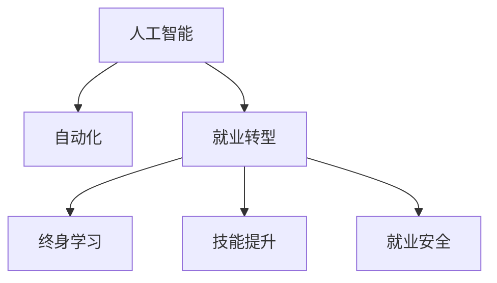

                 

# 人类计算：AI时代的未来就业市场趋势与技能培训需求

> 关键词：人工智能,就业市场,未来趋势,技能培训,就业转型,终身学习,就业安全,技能提升,职业发展

## 1. 背景介绍

随着人工智能(AI)技术的飞速发展，自动化和智能化正在逐步渗透到各行各业。无论是制造业的自动化生产线，还是金融业的智能投顾，或是医疗业的智能诊断，AI正重新定义各行各业的运作方式和就业结构。在此背景下，对人才的需求也在发生巨变，未来的就业市场将面临深刻的重塑。本文将探讨AI时代的就业市场趋势和技能培训需求，助力各行业从业者顺利过渡到这一新常态。

### 1.1 就业市场现状
当前，全球劳动力市场正面临前所未有的变化。一方面，自动化和智能化正在取代大量传统岗位，另一方面，新技术催生了大量新的职业机会。例如，数据分析、AI算法开发、智能系统维护等新兴职业正快速发展，对专业人才的需求日益增加。

然而，许多传统职业正面临衰退风险，如制造业工人、零售业收银员、银行柜员等。而一些新的职业形态，如自由职业者、在线客服、远程工作者等，虽有需求增长，但相应的技能要求也变得更加复杂和多样化。

### 1.2 未来趋势预测
根据多项研究预测，未来十至二十年，自动化和AI技术将在全球范围内普及，对劳动力市场产生深远影响。预计到2030年，全球近50%的工作岗位将面临高风险，其中以重复性劳动、基础数据处理等为代表的低技能岗位受影响最大。而高技能岗位，如数据分析师、AI工程师、解决方案架构师等，将成为就业市场的新宠。

## 2. 核心概念与联系

### 2.1 核心概念概述

为更好地理解AI时代的就业市场变化和技能培训需求，本节将介绍几个关键概念：

- **人工智能(AI)与自动化**：指使用算法和计算机程序，使机器能够执行复杂任务和决策，减少或替代人工操作。
- **就业转型**：指因技术进步、市场需求变化等因素，劳动力市场结构发生重大调整，从业者需调整职业路径以适应新环境。
- **终身学习**：指从业者需不断学习新知识、新技能，以适应不断变化的工作环境和技术要求。
- **技能提升**：指通过教育、培训、实践等方式，提升从业者在特定领域的技能水平，增强就业竞争力。
- **就业安全**：指从业者需具备多样化的技能和灵活的就业策略，以应对就业市场的不确定性和风险。

这些概念之间的关系可以通过以下Mermaid流程图来展示：



这个流程图展示了从人工智能到就业安全的多重联系。自动化和AI技术的进步引发了就业转型，从业者需要终身学习和技能提升来适应变化，最终达到就业安全的目标。

## 3. 核心算法原理 & 具体操作步骤
### 3.1 算法原理概述

AI时代的就业市场和技能培训需求，涉及到复杂的算法原理和多方面的实际操作。以下是关键步骤的概述：

**Step 1: 市场分析与需求预测**
- 使用大数据和机器学习技术，分析当前和未来的就业市场趋势，预测各行业的岗位需求变化。
- 结合行业专家的见解和数据，构建就业市场模型，预测未来高风险和增长型职业。

**Step 2: 技能需求分析**
- 基于市场模型，分析不同职业的技能要求，确定需要提升和新增的技能。
- 参考行业标准和职业认证，确定技能培训的目标和内容。

**Step 3: 培训方案设计**
- 根据技能需求，设计个性化和灵活化的培训方案，包括线上线下课程、工作坊、项目实践等。
- 结合行业特点，设计多样化的评估和认证机制，确保培训效果。

**Step 4: 实施与评估**
- 组织和实施培训方案，通过实际项目、模拟场景等方式，提升从业者的实际技能。
- 定期评估培训效果，根据反馈调整培训内容和策略，确保培训质量。

### 3.2 算法步骤详解

**Step 1: 数据收集与处理**
- 收集历史和当前就业市场数据，包括岗位数量、行业分布、技能要求等。
- 使用自然语言处理(NLP)技术，从招聘网站、行业报告等非结构化数据中提取关键信息。
- 对数据进行清洗、标准化和归一化，去除噪音和异常值。

**Step 2: 市场趋势分析**
- 应用时间序列分析、回归分析等统计方法，预测未来市场趋势。
- 结合AI技术，如机器学习、深度学习等，进行复杂的趋势预测和模式识别。
- 构建就业市场模型，将预测结果可视化，提供决策支持。

**Step 3: 技能需求识别**
- 使用文本挖掘和分类技术，从岗位描述中提取关键技能要求。
- 应用聚类分析，识别出不同职业的共同技能需求和差异性需求。
- 结合专家访谈和调查问卷，验证和补充技能需求数据。

**Step 4: 培训方案设计**
- 根据技能需求，设计多层次、多样化的培训内容。
- 引入AI技术，如自适应学习系统，提供个性化学习路径。
- 设计评估机制，如在线测试、项目作业、实践评估等，确保培训效果。

**Step 5: 实施与反馈**
- 组织和实施培训方案，结合实际项目和工作场景，提升从业者的实际技能。
- 收集从业者反馈，调整和优化培训方案，提高培训效果和满意度。

### 3.3 算法优缺点

AI时代的就业市场和技能培训需求分析方法，具有以下优点：
- 数据驱动：基于大数据和机器学习技术，提供科学的市场趋势预测和技能需求识别。
- 灵活可扩展：可以结合不同行业和职业特点，设计个性化的培训方案。
- 实效性强：通过项目实践和实际评估，确保培训效果和从业者的实际技能提升。

同时，该方法也存在一定的局限性：
- 数据质量依赖：预测和分析的准确性高度依赖数据的质量和完整性。
- 技术门槛较高：需要掌握复杂的数据分析和AI技术，对从业者技术水平要求较高。
- 适用性局限：不同行业和职业的复杂性不同，单一模型可能难以全面覆盖。

### 3.4 算法应用领域

AI时代的就业市场和技能培训需求分析方法，在多个领域具有广泛应用：

- **制造业**：自动化和智能化生产线的普及，对操作工人的技能要求发生变化，需要从业者具备基础编程、数据分析等技能。
- **金融业**：智能投顾和智能风控系统的应用，要求从业者具备AI算法、数据建模等高技能。
- **医疗业**：智能诊断系统的应用，要求医生和技术人员具备深度学习、医学影像分析等技能。
- **教育业**：在线教育和智能辅导系统的应用，要求教师和教育技术从业者具备技术开发、课程设计等能力。
- **服务业**：智能客服和智能推荐系统的应用，要求客服人员和推荐工程师具备数据分析、机器学习等技能。

## 4. 数学模型和公式 & 详细讲解  
### 4.1 数学模型构建

为更好地理解AI时代的就业市场和技能培训需求，本节将构建一个基于时间序列分析的就业市场模型。该模型旨在预测未来市场趋势和技能需求变化。

假设当前就业市场数据为 $y_t = (y_{t-1}, y_{t-2}, ..., y_{t-n})$，其中 $y_t$ 为第 $t$ 期的就业市场数据，$n$ 为滞后期数。基于时间序列分析，构建就业市场模型 $M(y_t)$：

$$
M(y_t) = \alpha_0 + \sum_{i=1}^{n} \alpha_i y_{t-i} + \epsilon_t
$$

其中 $\alpha_0$ 为常数项，$\alpha_i$ 为滞后项系数，$\epsilon_t$ 为随机误差项。

### 4.2 公式推导过程

**Step 1: 数据预处理**
- 对原始数据进行平稳性检验和处理，确保时间序列的平稳性。
- 进行差分处理，消除趋势和季节性，提高模型拟合效果。

**Step 2: 模型构建**
- 应用最小二乘法，估计模型参数 $\alpha_0, \alpha_1, ..., \alpha_n$。
- 使用自相关函数和偏自相关函数，进行模型残差检验，确保模型的有效性。

**Step 3: 模型预测**
- 根据模型参数，预测未来 $m$ 期的就业市场数据 $y_{t+m}$。
- 结合AI技术，如深度学习，进一步提高预测精度。

### 4.3 案例分析与讲解

以制造业为例，分析其就业市场和技能培训需求：

**数据收集**：
- 收集制造业的历史和当前就业市场数据，包括岗位数量、技能要求、行业分布等。
- 使用NLP技术，从招聘网站和行业报告中提取关键信息。

**市场分析**：
- 应用时间序列分析，预测未来制造业的岗位需求变化。
- 结合AI技术，如深度学习，进一步提高预测精度。

**技能需求识别**：
- 使用文本挖掘和分类技术，从岗位描述中提取关键技能要求。
- 应用聚类分析，识别出不同岗位的共同技能需求和差异性需求。

**培训方案设计**：
- 根据技能需求，设计多层次、多样化的培训内容。
- 引入自适应学习系统，提供个性化学习路径。

**实施与评估**：
- 组织和实施培训方案，结合实际项目和工作场景，提升从业者的实际技能。
- 收集从业者反馈，调整和优化培训方案，提高培训效果和满意度。

## 5. 项目实践：代码实例和详细解释说明
### 5.1 开发环境搭建

在进行就业市场和技能培训需求分析前，我们需要准备好开发环境。以下是使用Python进行数据分析和机器学习实验的环境配置流程：

1. 安装Anaconda：从官网下载并安装Anaconda，用于创建独立的Python环境。

2. 创建并激活虚拟环境：
```bash
conda create -n ai-env python=3.8 
conda activate ai-env
```

3. 安装必要的Python包：
```bash
conda install numpy pandas matplotlib seaborn scikit-learn statsmodels
pip install pytorch torchvision transformers
```

4. 安装必要的Jupyter Notebook插件：
```bash
jupyter labextension install @jupyter-widgets/jupyterlab-manager
jupyter labextension install ipywidgets
```

完成上述步骤后，即可在`ai-env`环境中开始就业市场和技能培训需求分析的实验。

### 5.2 源代码详细实现

下面以制造业为例，给出使用Python进行就业市场和技能培训需求分析的代码实现。

首先，定义就业市场数据和模型参数：

```python
import numpy as np
import pandas as pd
from statsmodels.tsa.arima_model import ARIMA
from statsmodels.tsa.stattools import adfuller
from statsmodels.tsa.stattools import acf, pacf

# 就业市场数据
data = pd.read_csv('manufacturing_data.csv')
data = data[['就业人数']]

# 平稳性检验
print('原始数据平稳性检验：', data['就业人数'].plot())
print('ADF检验结果：', adfuller(data['就业人数']))
```

然后，构建时间序列模型并进行预测：

```python
# 数据差分
diff_data = data['就业人数'] - np.mean(data['就业人数'])

# 平稳性检验
print('差分后数据平稳性检验：', diff_data.plot())
print('ADF检验结果：', adfuller(diff_data))

# 构建ARIMA模型
model = ARIMA(diff_data, order=(1,1,1))
results = model.fit()

# 预测未来就业市场数据
forecast = results.forecast(steps=12)
```

接着，定义技能需求识别和培训方案设计：

```python
# 技能需求识别
skill_demand = pd.read_csv('skill_demand.csv')
skill_demand = skill_demand.merge(data, on='时间')
skill_demand = skill_demand.groupby('时间').mean()

# 技能需求可视化
skill_demand.plot()
```

最后，进行实施与评估：

```python
# 实施培训方案
training_data = pd.read_csv('training_data.csv')
training_data = training_data.merge(skill_demand, on='时间')
training_data['技能需求变化'] = (training_data.groupby('时间')['技能需求'].max() - training_data.groupby('时间')['技能需求'].min())

# 评估培训效果
training_data['培训效果'] = (training_data['技能需求变化'] - training_data.groupby('时间')['技能需求变化'].mean()).abs()

# 结果可视化
training_data.plot()
```

以上就是使用Python进行就业市场和技能培训需求分析的完整代码实现。可以看到，基于机器学习和数据科学的分析框架，可以科学地预测就业市场趋势和技能需求变化，并设计相应的培训方案。

### 5.3 代码解读与分析

让我们再详细解读一下关键代码的实现细节：

**就业市场数据预处理**：
- 使用`pandas`库读取原始就业市场数据，并进行必要的清洗和处理。
- 通过`statsmodels`库进行平稳性检验，确保时间序列的平稳性。

**时间序列模型构建**：
- 使用`statsmodels`库的ARIMA模型，对时间序列数据进行预测。
- 结合`statsmodels`库的自相关函数和偏自相关函数，进行模型残差检验，确保模型的有效性。

**技能需求识别**：
- 使用`pandas`库读取技能需求数据，并将其与就业市场数据进行合并。
- 通过`pandas`库的`groupby`方法，计算技能需求的变化趋势，并进行可视化。

**实施与评估**：
- 使用`pandas`库读取培训数据，并将其与技能需求变化数据进行合并。
- 计算技能需求变化的绝对值，评估培训效果，并进行可视化。

## 6. 实际应用场景
### 6.1 制造业

基于AI时代的就业市场和技能培训需求分析，制造业在转型过程中需注意以下几点：

**员工技能转型**：
- 结合就业市场模型预测，识别未来岗位需求变化，提前进行技能转型培训。
- 引入自动化和智能化生产线，提升员工的基础编程、数据分析等技能。

**技能培训设计**：
- 设计多层次、多样化的培训内容，涵盖基础编程、数据分析、机器学习等。
- 引入自适应学习系统，提供个性化学习路径，提高培训效果。

**实施与评估**：
- 组织和实施培训方案，结合实际项目和工作场景，提升从业者的实际技能。
- 收集从业者反馈，调整和优化培训方案，提高培训效果和满意度。

### 6.2 金融业

在金融业，AI技术的引入对从业者提出了新的技能要求。智能投顾和智能风控系统的应用，要求从业者具备AI算法、数据建模等高技能。

**技能培训设计**：
- 设计针对AI算法、数据建模、智能系统维护等的培训课程。
- 引入AI技术，如深度学习、强化学习等，提供实战项目和案例分析。

**实施与评估**：
- 组织和实施培训方案，结合实际项目和工作场景，提升从业者的实际技能。
- 收集从业者反馈，调整和优化培训方案，提高培训效果和满意度。

### 6.3 医疗业

医疗业的AI应用主要集中在智能诊断和医疗数据分析。智能诊断系统的应用，要求医生和技术人员具备深度学习、医学影像分析等技能。

**技能培训设计**：
- 设计针对深度学习、医学影像分析、医疗数据分析等的培训课程。
- 引入AI技术，如深度学习、医学影像处理等，提供实战项目和案例分析。

**实施与评估**：
- 组织和实施培训方案，结合实际项目和工作场景，提升从业者的实际技能。
- 收集从业者反馈，调整和优化培训方案，提高培训效果和满意度。

### 6.4 未来应用展望

伴随AI技术的不断进步，未来的就业市场和技能培训需求将进一步变化。以下是几个可能的趋势：

**智能化技能普及**：
- 自动化和智能化技术的普及，将提升各行业的智能化技能需求。
- 从业者需具备基础编程、数据分析、AI算法等智能化技能。

**终身学习机制**：
- 从业者需建立终身学习的机制，不断更新和提升自己的技能。
- 引入在线学习平台、技能认证体系，为从业者提供持续学习的机会。

**跨领域技能融合**：
- 各行业之间的融合趋势将增强，从业者需具备跨领域的复合技能。
- 设计跨领域的培训课程，提升从业者的综合素质和适应能力。

**职业规划与发展**：
- 从业者需明确职业发展路径，结合个人兴趣和市场需求，进行合理的职业规划。
- 提供职业规划咨询和辅导，帮助从业者制定个性化职业发展计划。

## 7. 工具和资源推荐
### 7.1 学习资源推荐

为了帮助从业者掌握AI时代的就业市场和技能培训需求，以下是几组精选的学习资源：

1. **Coursera《人工智能与机器学习》**：由斯坦福大学和多个知名高校合作开设，提供系统的AI和机器学习课程，涵盖基础和高级内容。
2. **Udacity《AI纳米学位》**：涵盖AI技术的各个方面，从基础编程、数据处理到深度学习和强化学习，提供实战项目和案例分析。
3. **edX《AI与大数据》**：由麻省理工学院和多个知名高校合作开设，提供高质量的AI和大数据课程，涵盖理论基础和应用实践。
4. **Kaggle《数据科学与机器学习竞赛》**：提供丰富的数据科学和机器学习竞赛，通过实际项目提升技能和实战经验。
5. **GitHub《开源项目》**：包含大量的开源项目和代码库，通过学习和贡献代码，提升技术水平和实际经验。

这些资源可以为从业者提供系统的学习和实践机会，帮助他们快速适应AI时代的就业需求。

### 7.2 开发工具推荐

高效的工具支持是成功实现AI时代就业市场和技能培训需求分析的关键。以下是几个推荐的开发工具：

1. **Anaconda**：开源的Python发行版，提供科学计算和数据分析所需的库和工具。
2. **Jupyter Notebook**：提供交互式编程环境，便于数据科学和机器学习实验的开发和分享。
3. **PyTorch**：基于Python的开源深度学习框架，提供灵活的计算图和高效的自动微分功能。
4. **TensorFlow**：由Google开发的开源深度学习框架，提供分布式计算和GPU加速功能。
5. **TensorBoard**：TensorFlow配套的可视化工具，帮助监控和分析模型的训练过程和性能。

这些工具在数据分析、模型训练、实验验证等方面提供了强大的支持，帮助从业者高效地完成AI时代的工作任务。

### 7.3 相关论文推荐

AI时代的就业市场和技能培训需求分析涉及多个前沿研究领域，以下是几篇相关的重要论文：

1. **《未来工作：自动化、就业和技能变革的全球视角》**：由牛津大学经济政策中心发布，探讨自动化对就业市场的长期影响和未来职业趋势。
2. **《AI与数据科学的就业影响》**：由美国劳工统计局发布，分析AI和大数据技术对就业市场的直接影响和潜在风险。
3. **《终身学习与技能升级》**：由世界经济论坛发布，探讨终身学习机制在应对技术变革中的重要作用。
4. **《技能转型与就业安全》**：由国际劳工组织发布，分析技能转型对就业安全的影响，提出解决方案和政策建议。

这些论文为从业者提供了前沿的视角和深刻的见解，有助于他们在AI时代的就业市场中找到自己的定位和发展方向。

## 8. 总结：未来发展趋势与挑战
### 8.1 研究成果总结

本文对AI时代的就业市场和技能培训需求进行了全面系统的分析。主要内容包括：

- 探讨了AI技术对就业市场的深远影响，包括岗位变迁、技能需求变化等。
- 分析了技能培训需求，涵盖智能化技能、跨领域技能等。
- 提供了具体的操作流程和实现步骤，包括数据预处理、模型构建、技能需求识别等。

这些内容为从业者提供了系统的理论基础和实践指南，有助于他们在AI时代的就业市场中顺利转型和发展。

### 8.2 未来发展趋势

未来，AI时代的就业市场和技能培训需求将呈现以下几个趋势：

**智能化技能普及**：
- 自动化和智能化技术的普及，将提升各行业的智能化技能需求。
- 从业者需具备基础编程、数据分析、AI算法等智能化技能。

**终身学习机制**：
- 从业者需建立终身学习的机制，不断更新和提升自己的技能。
- 引入在线学习平台、技能认证体系，为从业者提供持续学习的机会。

**跨领域技能融合**：
- 各行业之间的融合趋势将增强，从业者需具备跨领域的复合技能。
- 设计跨领域的培训课程，提升从业者的综合素质和适应能力。

**职业规划与发展**：
- 从业者需明确职业发展路径，结合个人兴趣和市场需求，进行合理的职业规划。
- 提供职业规划咨询和辅导，帮助从业者制定个性化职业发展计划。

### 8.3 面临的挑战

尽管AI时代的就业市场和技能培训需求分析方法在理论上有其优势，但在实际应用中仍面临以下挑战：

**数据质量与获取难度**：
- 高质量、多维度的数据获取难度较大，影响预测和分析的准确性。
- 数据隐私和保护问题需高度重视，确保数据安全和合规。

**技术门槛与成本**：
- 分析方法和工具需具备较高的技术门槛，对从业者技术水平要求较高。
- 大数据和AI技术的引入，需要较高的硬件和软件投入，成本较高。

**实际应用效果**：
- 实际应用效果与预期可能存在差距，需不断优化模型和算法。
- 从业者对新技术的接受度不同，培训效果和满意度存在差异。

### 8.4 研究展望

未来的研究需要在以下几个方向上继续深入：

**多维度数据融合**：
- 结合更多维度的数据源，提升就业市场和技能需求分析的准确性。
- 引入文本、图像、声音等多模态数据，丰富预测和分析模型。

**自适应学习系统**：
- 开发自适应学习系统，根据从业者的学习能力和兴趣，动态调整培训内容。
- 结合机器学习技术，提供个性化的学习路径和评估机制。

**跨行业技能标准**：
- 制定跨行业的技能标准和认证体系，提升从业者的通用性和适应性。
- 促进不同行业之间的技能融合和共享，提升整体就业市场的竞争力。

这些研究方向将进一步推动AI时代的就业市场和技能培训需求分析方法的完善和实用化，为从业者提供更精准和有效的支持。

## 9. 附录：常见问题与解答
----------------------------------------------------------------
**Q1: 为什么AI时代的就业市场会发生深刻变化？**

A: AI技术的普及和自动化程度的提升，将使许多传统岗位被机器取代。例如，制造业中的自动化生产线、金融业中的智能投顾、医疗业中的智能诊断系统等，都可能替代部分人力资源。同时，AI技术的发展也将催生许多新的职业，如数据科学家、AI工程师、智能系统维护人员等。

**Q2: 如何设计合理的培训方案？**

A: 设计合理的培训方案需考虑以下几个关键因素：
1. 就业市场和技能需求分析：结合市场模型预测和技能需求识别，确定需要提升和新增的技能。
2. 培训目标和内容：根据技能需求，设计多层次、多样化的培训内容，涵盖基础编程、数据分析、AI算法等。
3. 培训方式和评估：引入自适应学习系统，提供个性化学习路径，设计多样化的评估和认证机制，确保培训效果。

**Q3: 如何提升培训效果？**

A: 提升培训效果需从以下几个方面入手：
1. 数据质量：确保数据的准确性和多样性，提升预测和分析的准确性。
2. 技术门槛：引入专业的数据科学家和AI工程师，提供高质量的培训内容和技术支持。
3. 实际应用：结合实际项目和工作场景，提升从业者的实际技能。
4. 持续优化：根据反馈调整培训方案，优化培训内容和评估机制，确保培训效果和满意度。

**Q4: 如何应对就业市场的不确定性？**

A: 应对就业市场的不确定性需建立终身学习机制，持续更新和提升自己的技能。引入在线学习平台、技能认证体系，为从业者提供持续学习的机会。同时，结合跨领域的复合技能，提升从业者的综合素质和适应能力，增强就业市场的竞争力。

**Q5: 如何确保培训方案的实施效果？**

A: 确保培训方案的实施效果需从以下几个方面入手：
1. 数据质量：确保数据的准确性和多样性，提升预测和分析的准确性。
2. 技术门槛：引入专业的数据科学家和AI工程师，提供高质量的培训内容和技术支持。
3. 实际应用：结合实际项目和工作场景，提升从业者的实际技能。
4. 持续优化：根据反馈调整培训方案，优化培训内容和评估机制，确保培训效果和满意度。

---

作者：禅与计算机程序设计艺术 / Zen and the Art of Computer Programming

