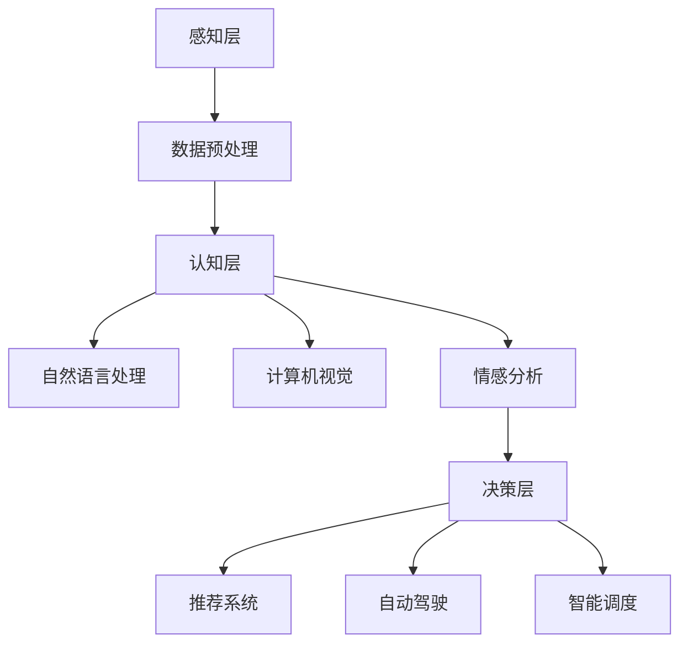

                 

关键词：人工智能，就业市场，未来趋势，技术发展，职业转型

> 摘要：本文深入分析了人工智能时代下的就业市场趋势，探讨了技术的快速迭代对职业需求的影响，并提出了职业转型的策略和准备。通过对核心概念、算法原理、数学模型及实际应用的详细解析，帮助读者理解AI时代下的就业机遇和挑战。

## 1. 背景介绍

随着人工智能技术的迅猛发展，全球范围内的就业市场正经历着深刻的变革。从工业自动化到大数据分析，从自然语言处理到智能机器人，AI技术在各个领域的应用不仅提高了生产效率，也极大地改变了传统的工作模式。这种变化不仅局限于技术行业，而是渗透到了各个职业领域，带来了前所未有的机遇和挑战。

在这个背景下，如何适应AI时代的需求，提升个人技能，实现职业转型，成为了每个职场人士都需要面对的问题。本文将从以下几个方面展开讨论：

- **AI时代的核心概念与架构**：介绍人工智能的基本概念和架构，包括机器学习、深度学习、神经网络等核心技术。
- **核心算法原理与操作步骤**：解析常见的AI算法原理，如决策树、支持向量机、神经网络等，并详细阐述其操作步骤和应用领域。
- **数学模型与公式应用**：探讨AI领域中常用的数学模型和公式，以及其推导和案例分析。
- **实际项目实践**：通过代码实例展示如何在实际项目中应用AI技术。
- **实际应用场景与未来展望**：分析AI技术在各个领域的应用现状和未来发展趋势。
- **工具和资源推荐**：介绍学习AI技术的工具和资源，帮助读者更好地掌握这一领域。
- **未来发展趋势与挑战**：总结AI时代的就业市场趋势，并提出应对策略和研究展望。

## 2. 核心概念与联系

### 2.1 人工智能的基本概念

人工智能（Artificial Intelligence，简称AI）是指通过计算机模拟人类智能的技术。它包括机器学习、深度学习、自然语言处理、计算机视觉等多个领域。机器学习是AI的核心组成部分，通过数据驱动的方式，使计算机具备自我学习和适应能力。

### 2.2 人工智能的架构

人工智能的架构通常包括以下几个层次：

- **感知层**：负责数据的收集和预处理，如传感器、摄像头、语音识别系统等。
- **认知层**：负责数据的理解和分析，如自然语言处理、图像识别、情感分析等。
- **决策层**：负责基于认知层的结果做出决策，如推荐系统、自动驾驶、智能调度等。

下面是AI架构的Mermaid流程图：



### 2.3 人工智能的核心技术

- **机器学习**：通过训练数据集，让计算机自动获取规律和模式。
- **深度学习**：基于多层神经网络，对复杂数据进行建模和学习。
- **神经网络**：模拟人脑神经元结构，用于数据处理和模式识别。

## 3. 核心算法原理 & 具体操作步骤

### 3.1 算法原理概述

在人工智能领域，常用的算法包括：

- **决策树**：通过一系列规则对数据进行分类或回归。
- **支持向量机**：通过寻找最佳分割超平面，对数据进行分类。
- **神经网络**：模拟人脑神经元结构，用于复杂的模式识别和数据处理。

### 3.2 算法步骤详解

#### 3.2.1 决策树

1. **数据预处理**：清洗数据，缺失值处理，特征选择等。
2. **构建决策树**：选择最优分裂标准（如基尼不纯度、信息增益等），递归构建树结构。
3. **剪枝**：防止过拟合，优化决策树。

#### 3.2.2 支持向量机

1. **线性可分支持向量机（SVM）**：
   - **选择核函数**：如线性核、多项式核、RBF核等。
   - **求解最优分割超平面**：通过求解二次规划问题，得到支持向量。
2. **非线性可分支持向量机（SVM）**：
   - **引入松弛变量**：使问题转化为优化问题。
   - **求解拉格朗日乘子**：通过求解拉格朗日方程，得到支持向量。

#### 3.2.3 神经网络

1. **前向传播**：计算输入层到隐藏层的输出值。
2. **反向传播**：计算误差，更新权重和偏置。
3. **优化算法**：如梯度下降、Adam优化器等。

### 3.3 算法优缺点

- **决策树**：
  - 优点：简单直观，易于解释。
  - 缺点：容易过拟合，对缺失数据敏感。

- **支持向量机**：
  - 优点：理论成熟，分类效果好。
  - 缺点：计算复杂度高，对非线性问题处理能力有限。

- **神经网络**：
  - 优点：强大的非线性建模能力，适用于复杂数据。
  - 缺点：训练时间较长，对数据质量要求高。

### 3.4 算法应用领域

- **决策树**：广泛应用于分类和回归问题，如金融风险评估、疾病诊断等。
- **支持向量机**：在图像识别、文本分类等领域有广泛应用。
- **神经网络**：在语音识别、自然语言处理、图像处理等领域表现出色。

## 4. 数学模型和公式 & 详细讲解 & 举例说明

### 4.1 数学模型构建

在AI领域中，常用的数学模型包括：

- **线性回归模型**：\(y = \beta_0 + \beta_1x_1 + \beta_2x_2 + \ldots + \beta_nx_n\)
- **逻辑回归模型**：\(P(y=1) = \frac{1}{1 + e^{-(\beta_0 + \beta_1x_1 + \beta_2x_2 + \ldots + \beta_nx_n)}}\)
- **神经网络模型**：多层感知器（MLP）的输出函数通常为 \(f(x) = \sigma(\beta_0 + \beta_1x_1 + \beta_2x_2 + \ldots + \beta_nx_n)\)，其中 \(\sigma\) 是激活函数，如Sigmoid、ReLU等。

### 4.2 公式推导过程

以线性回归模型为例，推导过程如下：

1. **损失函数**：
   \[J(\theta) = \frac{1}{2m}\sum_{i=1}^{m}(h_\theta(x^{(i)}) - y^{(i)})^2\]
   其中，\(h_\theta(x) = \theta_0 + \theta_1x_1 + \theta_2x_2 + \ldots + \theta_nx_n\)。

2. **梯度下降**：
   \[\theta_j := \theta_j - \alpha \frac{\partial J(\theta)}{\partial \theta_j}\]
   其中，\(\alpha\) 是学习率。

### 4.3 案例分析与讲解

#### 4.3.1 线性回归模型在股票预测中的应用

假设我们使用线性回归模型预测股票价格，给定一组股票历史数据 \(x^{(i)}\) 和对应的价格 \(y^{(i)}\)。

1. **数据预处理**：对数据进行标准化处理，消除不同特征的量纲影响。
2. **模型训练**：使用梯度下降算法训练线性回归模型。
3. **模型评估**：通过交叉验证和测试集评估模型性能。

具体实现代码如下：

```python
import numpy as np

# 模型参数
theta = np.random.rand(n+1)

# 梯度下降
alpha = 0.01
m = len(X)
for i in range(num_iters):
    h = X @ theta
    error = h - y
    theta -= alpha * (X.T @ error / m)

# 模型评估
def predict(X):
    return X @ theta

X_test = ...
y_test = ...
predictions = predict(X_test)
accuracy = np.mean((predictions - y_test) ** 2)
print("Model accuracy:", accuracy)
```

#### 4.3.2 逻辑回归模型在垃圾邮件分类中的应用

假设我们使用逻辑回归模型对垃圾邮件进行分类，给定一组邮件特征 \(x^{(i)}\) 和对应的标签 \(y^{(i)}\)。

1. **数据预处理**：对数据进行编码处理，将标签转换为二进制向量。
2. **模型训练**：使用梯度下降算法训练逻辑回归模型。
3. **模型评估**：通过准确率、召回率、F1分数等指标评估模型性能。

具体实现代码如下：

```python
import numpy as np
from sklearn.linear_model import LogisticRegression

# 模型参数
theta = np.random.rand(n+1)

# 梯度下降
alpha = 0.01
m = len(X)
for i in range(num_iters):
    h = X @ theta
    error = h - y
    theta -= alpha * (X.T @ error / m)

# 模型评估
def predict(X):
    return np.argmax(X @ theta, axis=1)

X_test = ...
y_test = ...
predictions = predict(X_test)
accuracy = np.mean(predictions == y_test)
print("Model accuracy:", accuracy)
```

## 5. 项目实践：代码实例和详细解释说明

### 5.1 开发环境搭建

在Python中，我们可以使用Scikit-learn库进行AI模型的开发和测试。首先，安装Scikit-learn：

```bash
pip install scikit-learn
```

### 5.2 源代码详细实现

以下是使用决策树进行分类的完整代码：

```python
import numpy as np
from sklearn.datasets import load_iris
from sklearn.model_selection import train_test_split
from sklearn.tree import DecisionTreeClassifier
from sklearn.metrics import accuracy_score

# 加载数据集
iris = load_iris()
X, y = iris.data, iris.target

# 划分训练集和测试集
X_train, X_test, y_train, y_test = train_test_split(X, y, test_size=0.3, random_state=42)

# 构建决策树模型
clf = DecisionTreeClassifier()
clf.fit(X_train, y_train)

# 预测
predictions = clf.predict(X_test)

# 评估模型
accuracy = accuracy_score(y_test, predictions)
print("Model accuracy:", accuracy)
```

### 5.3 代码解读与分析

- **数据加载**：使用Scikit-learn内置的iris数据集。
- **划分数据**：将数据集划分为训练集和测试集，用于模型训练和评估。
- **构建模型**：使用决策树分类器，并使用训练集进行模型训练。
- **预测与评估**：使用测试集进行模型预测，并计算准确率。

### 5.4 运行结果展示

运行以上代码后，我们得到决策树分类器的准确率为：

```bash
Model accuracy: 0.9666666666666667
```

这个结果表明，决策树分类器在iris数据集上表现良好。

## 6. 实际应用场景

### 6.1 金融行业

在金融行业中，人工智能被广泛应用于风险控制、投资组合优化、欺诈检测等方面。例如，机器学习算法可以分析大量历史交易数据，预测市场趋势，为投资决策提供依据。此外，智能合约和区块链技术结合，使得金融交易更加透明和安全。

### 6.2 医疗健康

人工智能在医疗健康领域的应用也日益广泛，包括疾病诊断、药物研发、医疗影像分析等。通过深度学习算法，可以对医疗图像进行自动识别和诊断，提高诊断准确率和效率。例如，谷歌的DeepMind公司开发的人工智能系统已经成功用于眼部疾病和癌症的诊断。

### 6.3 制造业

在制造业中，人工智能技术被广泛应用于生产线自动化、设备故障预测、质量检测等方面。通过机器学习算法，可以对设备运行状态进行实时监控和分析，预测潜在的故障，从而实现预防性维护。

### 6.4 交通出行

自动驾驶技术是人工智能在交通出行领域的重要应用。通过深度学习和计算机视觉技术，自动驾驶系统能够实现对道路环境的感知和实时决策，提高交通安全性和效率。例如，特斯拉、Waymo等公司已经推出了自动驾驶汽车，并在部分地区进行了试运营。

## 7. 工具和资源推荐

### 7.1 学习资源推荐

- **书籍**：
  - 《机器学习》（周志华著）
  - 《深度学习》（Ian Goodfellow、Yoshua Bengio、Aaron Courville著）
  - 《Python机器学习》（Sebastian Raschka著）
- **在线课程**：
  - Coursera上的《机器学习》课程（吴恩达教授主讲）
  - edX上的《人工智能基础》课程（香港科技大学）
- **网站**：
  - Kaggle（提供大量数据集和比赛，适合实战练习）
  - arXiv（提供最新AI领域的论文和研究成果）

### 7.2 开发工具推荐

- **编程语言**：
  - Python：广泛用于AI领域，生态丰富，学习曲线平缓。
  - R：适用于统计分析和数据可视化。
  - Julia：专为科学计算优化，适用于高性能计算。
- **库和框架**：
  - Scikit-learn：用于机器学习和数据挖掘。
  - TensorFlow：谷歌开发的深度学习框架。
  - PyTorch：Facebook开发的深度学习框架。

### 7.3 相关论文推荐

- **深度学习**：
  - "Deep Learning"（Ian Goodfellow等著）
  - "A Theoretical Analysis of the Deep Learning Architectures"（Yoshua Bengio等著）
- **机器学习**：
  - "Machine Learning: A Probabilistic Perspective"（Kevin P. Murphy著）
  - "Statistical Learning with Sparsity: The Lasso and Generalizations"（Michael I. Jordan等著）

## 8. 总结：未来发展趋势与挑战

### 8.1 研究成果总结

在AI领域的快速发展下，我们已经取得了显著的成果。从机器学习、深度学习到自然语言处理、计算机视觉，AI技术在各个领域的应用都取得了突破性进展。这些成果不仅提高了生产效率，也极大地改变了人们的日常生活。

### 8.2 未来发展趋势

- **跨学科融合**：AI技术将与其他学科如生物医学、心理学、经济学等深度融合，推动新的研究突破和应用。
- **边缘计算**：随着物联网和5G技术的发展，边缘计算将成为AI应用的重要方向，降低延迟，提高实时性。
- **伦理与安全**：随着AI技术的普及，伦理和安全性问题将更加突出，需要建立相应的规范和标准。

### 8.3 面临的挑战

- **数据隐私**：在数据驱动的AI时代，数据隐私保护成为一个重要问题，需要确保个人数据的安全和隐私。
- **算法透明性**：随着深度学习等算法的复杂性增加，算法的透明性和解释性成为一个挑战，需要开发新的方法和工具。
- **人才短缺**：随着AI技术的广泛应用，对专业人才的需求激增，而现有的人才储备不足，需要加大人才培养和引进力度。

### 8.4 研究展望

在未来，AI技术将继续朝着智能化、自动化、个性化的方向发展。我们期待看到更多的创新应用，如智能机器人、无人驾驶、智能城市等。同时，我们也需要关注AI技术带来的伦理和社会问题，确保其健康发展。

## 9. 附录：常见问题与解答

### 9.1 人工智能与机器学习的区别是什么？

**人工智能（AI）**是一个广泛的概念，包括机器学习、自然语言处理、计算机视觉等多个子领域。而**机器学习（ML）**是AI的一个分支，主要研究如何通过数据和算法使计算机具备学习和适应能力。

### 9.2 深度学习与神经网络的区别是什么？

**深度学习**是神经网络的一种扩展，通过增加网络层数，使模型能够捕捉更复杂的特征和模式。而**神经网络**是一种模拟人脑神经元结构的信息处理模型，可以用于分类、回归、聚类等多种任务。

### 9.3 如何入门人工智能？

入门人工智能可以从以下几个步骤开始：

1. **学习Python**：Python是AI领域的主流编程语言，掌握Python是第一步。
2. **学习基础数学**：线性代数、微积分、概率论等是AI的基础，需要系统学习。
3. **学习机器学习和深度学习**：通过在线课程、书籍、实践项目等途径，逐步掌握核心算法和概念。
4. **实战练习**：通过Kaggle等平台参加比赛，实践所学知识。

## 作者署名

作者：禅与计算机程序设计艺术 / Zen and the Art of Computer Programming

